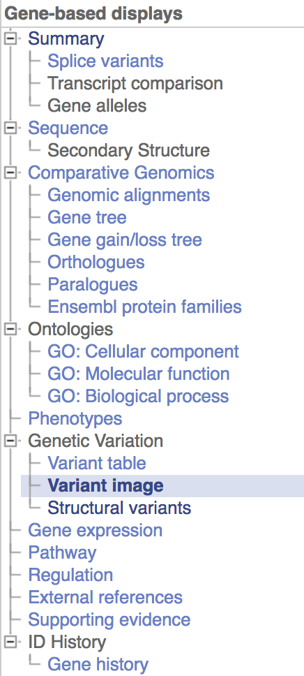
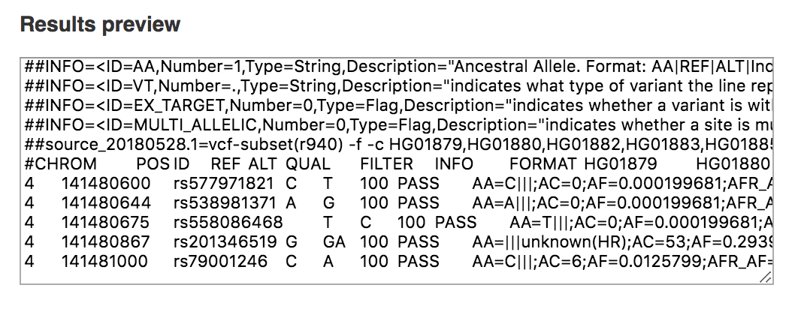
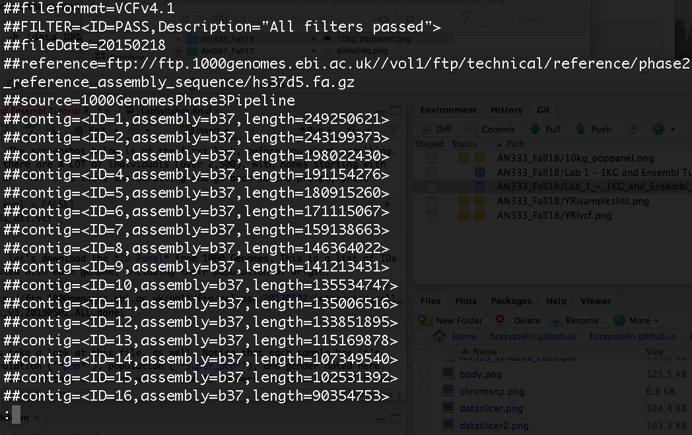

```{r,echo=F}
library(knitr)
```

```{css,echo=F}
.sccCode {
background-color: black;
color: white;
}
```

## Introduction to the International Genome Sample Resource (Formerly known as the 1000 Genomes Project)

***

###[Homework for Lab 1: DUE Friday, October 5th](https://fuzzyatelin.github.io/AN333_Fall18/Lab1_Homework.html)

***

**Readings**:<ul>
<li>[The 1000 Genomes Project Consortium. 2015. A global reference for human genetic variation. *Nature* 526: 68-74.](https://www.nature.com/articles/nature15393)</li><br>
<li>[Danecek P, Auton A, Abecasis G, Albers CA, Banks E, DePristo MA, Handsaker RE, Lunter G, Marth GT, Sherry ST, McVean G, Durbin R, 1000 Genomes Project Analysis Group. 2011. The variant call format and VCFtools. *Bioinformatics App Note* 27: 2156-2158.](https://academic.oup.com/bioinformatics/article/27/15/2156/402296)</li><br>
<li>[Gonzalez-Barroso MDM, Ricquier D, Cassard-Doulcier AM. 2000. The human uncoupling protein-1 gene (UCP1): present status and perspectives in obesity research. *Obesity Rev* 1: 61-72.](https://onlinelibrary.wiley.com/doi/full/10.1046/j.1467-789x.2000.00009.x)</li></ul>

***


<br>
<br>

**The 1000 Genomes Project**, which ran between 2008 and 2015, is as close as it comes to a "catalogue of human variation." The output of this initiative is a database of whole genome sequences from 26 distinct populations from around the world, all aligned to the same human reference sequence. This data is free to use, and is an excellent resource for researchers who want to study genetic variation in a gene across populations, but cannot afford to collect their own samples. 

While it was active, The 1000 Genomes Project published their data in several phases; by the final phase (Phase 3), they had gathered samples from 2,504 individuals from the 26 targeted populations. In 2015, the **International Genome Sample Resource** (**IGSR**) was established to "ensure the future usability and accessibility of the 1000 Genomes data." In keeping with this goal, the IGSR has: re-mapped the Phase 3 data to the latest two human reference sequences, **GRCh37** and **GRCh38**, incorporated externally generated, published genomic data (such as *RNA-seq* data) into their own dataset, and begun adding previously unsampled populations the database. 

Below is a map of the current populations represented in the 1000 Genomes dataset, as well as a reference list of the abbreviations used to identify these populations.  
<br>


<br>

### Reference List of Current ISGR Sub-Populations
<br>

* <b>CHB</b> - Han Chinese in Beijing, China
* <b>JPT</b> - Japanese in Tokyo, Japan
* <b>CHS</b> - Southern Han Chinese
* <b>CDX</b> - Chinese Dai in Xishuangbanna, China
* <b>KHV</b> - Kinh in Hi Chi Minh City, Vietnam
* <b>CEU</b> - Utah residents with Northern and Western European Ancestry
* <b>TSI</b> - Toscani in Italy
* <b>FIN</b> - Finnish in Finland
* <b>GBR</b> - British in England and Scotland
* <b>IBS</b> - Iberian Population in Spain
* <b>YRI</b> - Yoruba in Ibadan, Nigeria
* <b>LWK</b> - Luhya in Webuye, Kenya
* <b>GWD</b> - Gambian in Western Divisions in the Gambia
* <b>MSL</b> - Mende in Sierra Leone
* <b>ESN</b> - Esan in Nigeria
* <b>ASW</b> - Americans of African Ancestry in Southwest USA
* <b>ACB</b> - African Caribbeans in Barbados
* <b>MXL</b> - Mexican Ancestry from Los Angeles USA
* <b>PUR</b> - Puerto Ricans from Puerto Rico
* <b>CLM</b> - Colombians from Medellin, Columbia
* <b>PEL</b> - Peruvians from Lima, Peru
* <b>GIH</b> - Gujarati Indian from Houston, Texas
* <b>PJL</b> - Punjabi from Lahore, Pakistan
* <b>BEB</b> - Bengali from Bangladesh
* <b>STU</b> - Sri Lankan Tamil in the UK
* <b>ITU</b> - Indian Telugu in the UK
<br>

One last thing to note is that each of these populations falls under a "super population" which denotes the general area of the world each population is from. Many times, you will see information split up by these super populations instead of by each individual population. These super populations are as follows: 
<br>
<br>

* <b>AFR</b> - African
* <b>AMR</b> - Admixed American
* <b>EAS</b> - East Asian
* <b>EUR</b> - European
* <b>SAS</b> - South Asian
<br>

For the in-class labs this semester, each of you will be assigned a focal sub-population for our investigations into *UCP1*. Unless told otherwise, this is the population you'll be tracking variation in for the remainder of our time investigating *UCP1*. You can find your assigned population [here](https://fuzzyatelin.github.io/AN333_Fall18/1KG_SubPop_Fall2018.html)!

For more information about 1000 Genomes and IGSR, visit <http://www.internationalgenome.org/home>.
<br>

## A Brief Word on Bioinformatics and the Creation of the 1000 Genomes Database
<br>
Bioinformatics is the "science of developing methods and software tools for collecting and understanding biological data." It's become huge academic and professional field in a relatively short time as big datasets proliferate in biology, thanks to rapid developments in sequencing technology and the advances in the various '-omics' fields.<br>

BU has an interdisciplinary [**Master's Program in Bioinformatics**](http://www.bu.edu/bioinformatics/), a [**Bioinformatics Research and Interdisciplinary Training Experience (BRITE REU)**](http://sites.bu.edu/britereu/) for undergraduate students, as well as a [**Bioinformatics Hub (the BUBHUB)**](http://bubhub.bumc.bu.edu/) meant to support faculty and students conducting research in bioinformatics. These might be good resources if you decide you like this kind of work and want to pursue it further.<br>

Starting this semester, there's even a student-led **Biology/Bioinformatics Peer Coding Hour** here at BU, where undergraduate and graduate students help each other with bioinformatics and statistical coding issues. The Peer Coding Hour will have their first meet-and-greet (with free food!) on **October 2nd from 4-5pm in BRB 113**. I recommend everyone join!<br>

The 1000 Genomes Project, or even digitally recording the information DNA gives us, would not have been possible without this field. To understand the files that we will be working with (such as VCF files, which we will discuss later), it is beneficial to know how raw data is transformed in to digital information. In order to explain this process, I have included a simple flowchart that I will walk through. 
<br> 


<br>

The first step in this flowchart is the DNA sequencing itself. There are several kinds of sequencing, but we know from the 1000 Genomes paper we read that they used what is called an Illumina platform. Illumina uses a specific method of **next-generation sequencing** (NGS on the diagram). NGS is is a faster, more efficient, and more in-depth process of sequencing that is based on shearing the genome into small pieces and then reconstructing them en masse and in parallel (multiple times at once) using various proprietary technologies before mapping those pieces to a **reference genome** (typically the first, highest quality, or most completely sequenced individual genome of a species; this does *not* mean this is the representative, average, or most common version of the genome!). The proprietary Illumina platform was invented by [Illumina](https://www.illumina.com/), and uses a unique method of sequencing that makes it among the most efficient, affordable, and accurate ways of sequencing that we have today. BU has it's own [Illumina sequencing facility on campus](http://www.bumc.bu.edu/microarray/services/illumina-library-prep-sequencing/). Illumina sequencing in itself is an incredibly complex process that we won't talk about in detail here, but a good video that explains the process can be found [here](https://www.youtube.com/watch?annotation_id=annotation_228575861&feature=iv&src_vid=womKfikWlxM&v=fCd6B5HRaZ8). 
<br>
<br>
DNA sequence reads don't come out of the machine nicely put together and cleaned, however. There are a few more steps to turn them in to nice, neat files. As shown in the diagram, the output of a sequencing machine is called a **Fastq** file. A Fastq file consists of a raw nucleotide sequence that is not yet aligned to a reference genome, and accompanying **quality scores**, which are scores that tell us how reliable the sequencing read for each base is. You can work with these files, but without aligning them to a reference genome we won't be able to get as much from them as we want. That's where the next step in the diagram comes in... 
<br>
<br>
**Alignment** is the process of taking a chunk of DNA sequence and using a statistical algorithm to compare that chunk to a reference genome to figure out what portion of the genome that chunk represents. This is done with all the small sequence chunks that come from the initial Fastq file until you have a fully aligned genome. Once you have aligned your Fastq sequence to a reference sequence, you have a **BAM** file. A BAM file therefore not only contains an entire genome's worth of genetic code, but also gives information about where any particular piece of code falls within the genome. These files are good to work with if you need an entire genome's worth of information, or detailed information about every nucleotide in a region.
<br>
<br>
The final step in the flowchart is the **VCF** file, which is what we will be working with in our class. VCF files are the result of picking out just the *variant* nucleotide positions (in other words, loci where individual sequences differ from the reference) from a BAM file. Below, we will look at the VCF file type more in-depth, as we will be using VCF files in this class. 
<br>
 
## Overview of the Variant Call Format (VCF) 
<br>

In our labs, we will be using VCF files to look at our candidate gene, *UCP1*. The VCF file format is a computer file format in which variant genetic information can be stored, as we have seen above. VCF files in particular are a way of formatting SNP-only information without having to deal with the rest of the sequence that the SNPs come from. Other file types, such as BAM files, have their own uses but for the purposes of our study (and most population genetics studies) they simply contain way more information than we need: a single BAM file containing an entire genome can be almost a terabyte (1000 gigabytes) in size!<br>

VCF files are a text-file format which can be opened with a plain text editor on your computer, and can be analyzed using various softwares. Below I have included an example screenshot of what a VCF file looks like when opened in a plain text editor. This example compares what a simple representation of the sequence itself aligned to the reference ('*Alignment*') looks like in VCF format ('*VCF representation*'):
<br>


<br>

As you can see from parts (b-g) of the figure, there is different notation that can be used depending on what type of SNP or variant position is being recorded. If you're interested in more complex bioinformatic analyses with data like this, there's more information about VCF files [here](http://www.internationalgenome.org/wiki/Analysis/vcf4.0/).
<br>
<br>

## How to Use *Ensembl* to Get VCF Data Files from the 1000 Genomes Dataset

Links to, and information for, all of the genome browsers that feature 1000 Genomes data is found [here](http://www.internationalgenome.org/1000-genomes-browsers). 
<br>
<br>
While the 1000 Genomes project was still active, it had its very own "early access" genome browsers that allowed researchers to get detailed information about specific genes of interest. These browsers, still available today, contain open-access data that was updated with each phase of the project. These browsers are now outdated, however, and the most up-to-date genomic alignments for the 1000 Genomes data are generated by and stored in *Ensembl*. *Ensembl* is a genome database that is maintained by the [European Bioinformatics Institute](https://www.ebi.ac.uk/), and houses genomic data for many different species. *Ensembl* also has several versions of each dataset, which are updated as new alignment information becomes available.<br>

For this class, we will be using the most up-to-date version of the *Ensembl* human geneome browser, the **GRCh38.p12** browser, to look at our gene of interest, *UCP1*. 
<br>

### Step-by-step Instructions for Using *Ensembl*
<br>

<br>
<br>

#### Step 1: Finding *UCP1*

* Go to the website: <http://useast.ensembl.org/Homo_sapiens/Info/Index>

* Find the search bar in the top left-hand corner and type in "UCP1." Make sure the "category" drop-down menu is set to "Search all categories." Click "Go."
<br>


<br>

* The first result to come up should be called "UCP1 (Human Gene)" and should look like this: 
<br>


<br>

* Clicking on that will bring you to the "home page" for the gene *UCP1*, which will look like this: 
<br>
<br>


<br>

Congratulations, you've found your gene of interest in *Ensembl*! Now, let's visually explore the genomic information available for *UCP1*... 
<br>
<br>

#### Step 2: Visualizing *UCP1* and its Variants

* If you scroll down on the first page, you will see an interactive map of the *UCP1* coding region of the genome. 
<br>


<br>

If you click on the "Go to region in detail" option directly above this image, you will get a more detailed version of the coding region. If you're interested, you can do this on your own time; we will not be using this more detailed view for the purposes of this class. What we will look at, however, is an image that shows all of the variants in *UCP1*. 
<br>

* To get to the variant image, simply go to the lefthand sidebar and look for the "Variant Image" tab under "Genetic Variation."
<br>



<br>
<br>

Oh no: *JUST IN THE LAST MONTH*, *Ensembl* decided to retire this view of the human genome, as known variants have proliferated to the point where there's *so* much information in this view that it's become more confusing than helpful. I'll show you what it used to look like, just to give you an idea of the information it contains (note, you can still get this view for *non*-human sequences).<br><br>
In species where this still works, you will find an interactive image that looks like this: 
<br>


<br>

You can click on each little variant box as well, which will give you information about each SNP, such as its rs ID number, its location, and what kind of mutation it is: 
<br>


<br>
<br>

While it's a shame that this image view is no longer available, the far more helpful data format - the **variant table** - is still here! 
<br>

* To get to the variant table, simply go to the tab in the lefthand sidebar that is above the one you are currently in, which will say "Variant Table"
<br>


<br>

You will get a table that looks like this: 
<br>


<br>

As you can see under the "Conseq. Type" column, all of the variants at the top of the table are downstream variants (e.g., variants that take place past the stop codon of the *UCP1* protein coding region). 
<br>
<br>
Let's do a little exercise, shall we? Above the table, there are some filtering options. Click on the "Consequences" filtering option and hit "Turn All Off"
<br>
<br>


<br>

Now, turn back on *all of the mutations that lie within the coding region* of the gene that will also *cause a change in genotype*. After you're done choosing, hit "Apply Changes."
<br>
<br>
Now that we have a shortlist of SNPs that will actually come in handy for understanding variation in the protein output of *UCP1*, let's learn how to get useful information about a specific SNP that we will use in later labs. 
<br>
<br>

#### Step 3: Exploring a SNP of Choice - rs45539933

The first thing we'll look is the Global Minor Allele Frequency (MAF). MAF is simply the frequency at which the second most common *variant* allele from the reference genome (i.e. the minor allele) occurs in a population. We will be able to get population breakdowns of the MAF, but first we'll look at the Global MAF. 
<br>
 
* To do this, look at variant table with the results you filtered and find the "Global MAF" column. Click on the small grey 'down' arrow by the column header to sort the SNPs from highest-to-lowest MAF. The example SNP in the picture below has a Global MAF of 0.086, which means that 8.6% of the 1000 Genomes participants have the minor "T" allele as opposed to the major "C" allele. In the "Alleles" column, the major allele will always be listed first. 
<br>


<br>

* Now that we know how to find out the MAF of a SNP, let's explore this SNP some more. Click on the "Variant ID" of the SNP that has the highest MAF. Clicking on that link will bring you to the SNP page, which looks like this: 
<br>


<br>

* Under "Explore This Variant" there is several different tabs that will tell us different things about the SNP. In this class, we will be using two of these features: "**Population Genetics**" and "**Linkage Disequilibrium**". Right now, we will do a quick tour of these tabs so you can just see how they work. 

* First, click on the "Population Genetics" icon. You will get this page: 
<br>


<br>

* As you can see in these pie charts that there appear to be differences in the allele frequencies for this SNP in each population and sub-population. 

* Scroll down to the table that gives you the allele frequency breakdown for all the 1000 Genomes populations. Here is an example section of the 1000 Genomes data table: 
<br>


<br>

* From left to right, you can see the frequencies and count numbers (in parentheses) of how many C and T alleles reside in each population, as well as the heterozygous and homozygous genotype frequencies and counts for each population. 
<br>

As an exercise, find *your* population in this table. Make sure you can find the allele and genotype counts. This will come in handy when we do our [Hardy-Weinberg Lab](https://fuzzyatelin.github.io/AN333_Fall18/Lab_2_-_HWE.html). 
<br>

The final page we'll explore is the "Linkage Disequilibrium" page.

* To do this, navigate back back to the SNP page and click on the "Linkage Disequilibrium" icon. You will get this page: 
<br>


<br>

* Find your population. 

* First, click on the right-most "View Plot" link for your population. The icon is a reddish triangle. A few things will come up on this page. 

* The first thing you should see on the page is an image of Chromosome 4, with a red line marking the locus of our SNP of interest: 
<br>


<br>

Knowing what we know about recombination and the structure of the genome, think about how the location of this SNP on the chromosome will affect the likelihood of Linkage Disequilibrium. Is it more or less likely that this SNP will be out of Linkage Disequilibrium?

* Scrolling down, you will see a plot:
<br>


<br>

* This plot represents Linkage Disequilibrium blocks. When we talk about Linkage Disequilibrium, we will learn how to read one of these blocks. For now, it's enough to know what it looks like. 

* Now, navigate back to the table on the previous page. For your population, click on the "Show" link under the "Variants in High LD" column. If your population has SNPs in high Linkage Disequilibrium, you will get a table that looks like this: 
<br>


<br>

* This table shows us a couple of things that will come in handy, like how many base pairs away a linked SNP is from the SNP of interest ("Distance (bp)"), what effect the linked SNP has on transcription/translation and subsequent phneotype, and in which gene coding region, if any, the linked SNP falls ("Located in gene(s)"). 
<br>

If your population *doesn't* have SNPs in high Linkage Disequilibrium, think about what that tells us about the importance of *UCP1* in your population. 
<br>
<br>
Now that we have explored some important features of the *Ensembl* website, we can learn how to download some more focused datasets of our own that we'll use here in our Labs!
<br>
<br>

#### Step 4: Getting Genetic Data for your Sub-Population {.tabset .tabset-fade}

Usually when you are working with genomic information, you are given a whole chromosome or even a whole genome's worth of information in either a BAM file or a VCF file. If you only need to look at one small part of the genome, it can be very annoying to work with a lot of extra data. The *Data Slicer* in *Ensembl* is a convenient way to get only the amount of data that you want without using a separate program to cut it out yourself. We will use this tool to get the data for our analysis of *UCP1*. We will be taking *two* slices of data today: one that contains all of the SNPs in *UCP1* (we may have already done this in our Pre-Lab exercises), and one that contains only about 1/4 of the SNPs in the gene. We will be using the larger slice in most of our analyses, but we will need the smaller slice for [Lab 3](). 
<br>
<br>
The link to the *Data Slicer* is available here: <https://useast.ensembl.org/Homo_sapiens/Tools/DataSlicer>. 
<br>
<br>
**IMPORTANT NOTE**: As many of you may have already noticed, sometimes *Data Slicer* sucks and forgets how to link to the Phase 3 dataset appropriately. This makes things a bit more complicated. As such, I've appended two methods, below, to getting the data we need. The firt tab - *Data Slicer WINS!* - contains instructions for when *Data Slicer* is actually working. The second tab - *Data Slicer SUCKS!* - is for when *Data Slicer* fails us. The second method isn't harder, it just involves post-download filtering of our file, which might take a wee smidge longer.<br>

Try the *Data Slicer WINS!* method first. If that fails, it's time to move on the the *Data Slicer SUCKS!* method.<br>

Now, on to the tutorial!

* Click on the link provided above. It will take you here: 
<br>


<br>
<br>

* Click "New job." You will get this interface: 
<br>
<br>


<br>

* First off, in the "Name for this job" category, let's name it after our assigned population. I'll be working with the Yoruba population, so I'll name mine "**YRI_UCP1**".

*The file format should be set for VCF. If it's not, click the drop-down menu and select VCF. 

* In the "region lookup" bar, copy and paste in the location **4:140559434-140568805**. These are the GRCh38.p12 version alignment coordinates for the gene *UCP1*. This is the larger of the two chunks we will be taking.

* In in the "Choose data collections..." dropdown list, make sure "Phase 3" is selected. This will ensure you get data from the last phase of the 1000 Genomes project. 

* In the "filters" category, select "By populations". This will give you a dropdown menu of all of the 1000 Genomes populations. Select the population that you were assigned, so that you only get the data for that population. 

* The filled-in interface should look like this: 
<br>


<br>

If this has worked, and your window looks more or less like the image above (the entries above might not match yours), then *Data Slicer* is winning and you can continue!<br>

If this hasn't worked and *Data Slicer* is giving you some kind of error message asking for some URL or other... well... *Data Slicer* sucks and it's time to get resourceful, so click on that tab and check out what to do next...

Now, some students have noticed that this second process literally takes forever... in that case, if all else fails... we'll use ***Tabix***!

<br>
<br>
<br>

#####***Data Slicer WINS!***

* Hit the "run" button at the bottom of the page.

* At the top of the page, hit "New Job" and *repeat this process*, but this time with the coordinates **4:140560308-140564106**. Let's name this one something slightly different so we don't get confused. These are the coordinates for the smaller slice that we will be taking, so I'll name mine "**YRI_UCP1_small**"

* When you have clicked "Run" for both jobs, you will see this table pop up, which will eventually tell you when your job has been processed. Click "View Results" to look at your results. 
<br>


<br>
<br>

* You will get this page: 
<br>


<br>

* Scroll down to the bottom of the results preview. Recall from earlier that there is a "head" and a "body" section of a VCF file. Check to make sure that the "body" of the file is there. It will look like this: 
<br>


<br>

We check our file to see if the body is there because sometimes the server will malfunction and give you only the head of the VCF file. If that happens, repeat the *Data Slicer* process. Check both files in this same way.  
<br>

* Once you've checked your files to make sure everything is there, click on "Download results file", which should save these files in *filename.vcf.gz* format in the 'Downloads' folder in your *anth333* workspace on the *SCC*.

* Once in your workspace, change your filenames to make things easier. Rename the full *UCP1* file with the acronym for your population. Name the smaller file with the acronym and then "small." For example, I downloaded data from the **YRI** population, so I named the larger file "YRI.vcf.gz" and will name the smaller file "YRIsmall.vcf.gz". Remember, to rename a file in the *SCC* workspace, you use the *mv* command (e.g., '*mv oldname.vcf.gz YRI.vcf.gz*')

<br> 

#####***Data Slicer SUCKS!***

*Gah... this bug in Data Slicer is THE WORST*. But it's also not the end of the world. We can still get what we need from *Ensembl*, it'll just take a bit longer. The bonus is that we'll learn how to use a couple extra bioinformatics tools that are actually *preferred* over *Data Slicer* by folks who work frequently with human genomic data.

* Retrace your steps to get to the *Data Slicer* and re-enter all the naming and coordinate information you had before.

* In in the "Choose data collections..." dropdown list, where it says "Phase 3", click and choose "Provide file URLs".

* In the blank box that opens up next to "Genotype file URL", copy the following URL and paste it into the box:<br>

ftp://ftp.1000genomes.ebi.ac.uk/vol1/ftp/release/20130502/supporting/GRCh38_positions/ALL.chr4_GRCh38.genotypes.20170504.vcf.gz

* Now, click on the "By populations" button for "Filters", and a new error message with crop up asking for a sample population mapping file URL. When that happens, paste this URL into the "Sample population mapping file URL" box:<br>

ftp://ftp.1000genomes.ebi.ac.uk/vol1/ftp/release/20130502/integrated_call_samples_v3.20130502.ALL.panel

* Once that's done, your *Data Slicer* entry should look like this:

<br>


<br>

* Hit the "run" button at the bottom of the page.

* At the top of the page, hit "New Job" and *repeat this process*, but this time with the coordinates **4:140560308-140564106**. Let's name this one something slightly different so we don't get confused. These are the coordinates for the smaller slice that we will be taking, so I'll name mine "**YRI_UCP1_small**"

* When you have clicked "Run" for both jobs, you will see this table pop up, which will eventually tell you when your job has been processed. Click "View Results" to look at your results. 
<br>


<br>
<br>

* You will get this page: 
<br>


<br>

* Scroll down to the bottom of the results preview. Recall from earlier that there is a "head" and a "body" section of a VCF file. Check to make sure that the "body" of the file is there. It will look like this: 
<br>


<br>

We check our file to see if the body is there because sometimes the server will malfunction and give you only the head of the VCF file. If that happens, repeat the *Data Slicer* process. Check both files in this same way.  
<br>

* Once you've checked your files to make sure everything is there, click on "Download results file", which should save these files in *filename.vcf.gz* format in the 'Downloads' folder in your *anth333* workspace on the *SCC*.

* Once in your workspace, change your filenames to make things easier. Rename the full *UCP1* file with the acronym for your population. Name the smaller file with the acronym and then "small." For example, I downloaded data from the **YRI** population, so I named the larger file "YRI.vcf.gz" and will name the smaller file "YRIsmall.vcf.gz". Remember, to rename a file in the *SCC* workspace, you use the *mv* command (e.g., '*mv oldname.vcf.gz YRI.vcf.gz*')

<br> 

#####***It's TABIX time...***

Ok, so nothing has worked... we're tired of working with *Data Slicer*!<br>

There's a solution: ***tabix***!<br>

*tabix* is a module that you can load into your *SCC* workspace, like any other module.

* Make sure you're in your home directory on the *SCC*, meaning your prompt should look like this (if it doesn't, enter '**cd ..**', and that should take you back to your home directory):
```{bash, eval = F, , echo = T, class.source="sccCode"}
[caschmit@scc1 ~]$
```

* Enter this code in your prompt to load *tabix*:
```{bash, eval = FALSE, echo = T, class.source="sccCode"}
module load tabix
```

* First, we can download the data! Remember, mine is YRI, so I'll use that code. Where you see 'YRI' in my code, insert the three-letter code of *your* population. Use the following command:
```{bash, eval = FALSE, echo = T, class.source="sccCode"}
tabix -h ftp://ftp.1000genomes.ebi.ac.uk/vol1/ftp/release/20130502/supporting/GRCh38_positions/ALL.chr4_GRCh38.genotypes.20170504.vcf.gz 4:140559434-140568805 > YRI_all.vcf
```

* Notice the syntax in that command? It's basically:
```{bash, eval = FALSE, echo = T, class.source="sccCode"}
tabix -h [data URL] [region lookup] > [filename].vcf
```

* This has saved the *UCP1* region as a VCF formatted file into your working directory!

* If you want to take a look at the file, and see that it's all there, you can use the '*less*' command and scroll with the 'down arrow' key to see the file itself. The screenshot below is of the first look, before you start scrolling. Notice there are A LOT of individuals (over 2,500), with names starting with '*HG*' or '*NA*'. To leave the scrolling and go back to the prompt, press '*q*':
```{bash, eval = FALSE, echo = T, class.source="sccCode"}
less YRI_all.vcf
```


<br>

* Next, let's download the *ID Panel* from 1000 Genomes. This is a list of IDs associated with each genome, including their population of origin:
```{bash, eval = FALSE, echo = T, class.source="sccCode"}
wget ftp://ftp.1000genomes.ebi.ac.uk/vol1/ftp/release/20130502/integrated_call_samples_v3.20130502.ALL.panel
```

* Let's take a look at this file, as well. Notice that each sample has it's sub-population ('*pop*'), population ('*super_pop*'), and gender noted here. Scroll down and take a look at what sample ID numbers are associated with your population. To leave the scrolling and go back to the prompt, press '*q*':
```{bash, eval = FALSE, echo = T, class.source="sccCode"}
less integrated_call_samples_v3.20130502.ALL.panel
```


<br>

* Now, we need to make a list of IDs just from our population of interest, so we can tell *vcftools* to only keep those individuals. Remember, mine is YRI, so I'll use that code. Where you see 'YRI' in my code, insert the three-letter code of *your* population:
```{bash, eval = FALSE, echo = T, class.source="sccCode"}
grep YRI integrated_call_samples_v3.20130502.ALL.panel | cut -f1 > YRI.samples.list
```

* Let's take a quick look at our samples list. It should have a single column of sample names, and these sample names should match those you saw in your population. To leave the scrolling and go back to the prompt, press '*q*':
```{bash, eval = FALSE, echo = T, class.source="sccCode"}
less YRI.samples.list
```


<br>

* Let's now load *vcftools*, which has the *--keep* option we'll use to filter out our population:
```{bash, eval = FALSE, echo = T, class.source="sccCode"}
module load vcftools
```

* Now we can use *vcftools* to subset our dataset:
```{bash, eval = FALSE, echo = T, class.source="sccCode"}
vcftools --vcf YRI_all.vcf --keep YRI.samples.list --recode --out YRI
```

* My *new* VCF file is called ***YRI.recode.vcf***. Again, yours should be similar but with *your* population three-letter name. Rename this, as follows:
```{bash, eval = FALSE, echo = T, class.source="sccCode"}
mv YRI.recode.vcf YRI.vcf
```

* Great! You now have your *UCP1* data file for just your population, which should be named ***YRI.vcf*** (but with your population name)! If you take a look at the VCF file and scroll, you should see a list of IDs that match your samples list, meaning that the only genotypes included are those from your sample population:
```{bash, eval = FALSE, echo = T, class.source="sccCode"}
less YRI.vcf
```


<br>

* Once you've done this, let's also download the smaller region:
```{bash, eval = FALSE, echo = T, class.source="sccCode"}
tabix -h ftp://ftp.1000genomes.ebi.ac.uk/vol1/ftp/release/20130502/supporting/GRCh38_positions/ALL.chr4_GRCh38.genotypes.20170504.vcf.gz 4:140560308-140564106 > YRIsmall_all.vcf
```

* And then let's use the same post-download processing to subset this smaller regional dataset in the same way as the larger, name the final file ***YRIsmall.vcf*** (with your own population name, of course):

```{bash, eval = FALSE, echo = T, class.source="sccCode"}
vcftools --vcf YRIsmall_all.vcf --keep YRI.samples.list --recode --out YRIsmall
```

* My *new* VCF file is called ***YRI.recode.vcf***. Again, yours should be similar but with *your* population three-letter name. Rename this, as follows:
```{bash, eval = FALSE, echo = T, class.source="sccCode"}
mv YRIsmall.recode.vcf YRIsmall.vcf
```

* YAY! You're finished!
<br>
<br> 

# Congratulations, you now have your genetic data!
