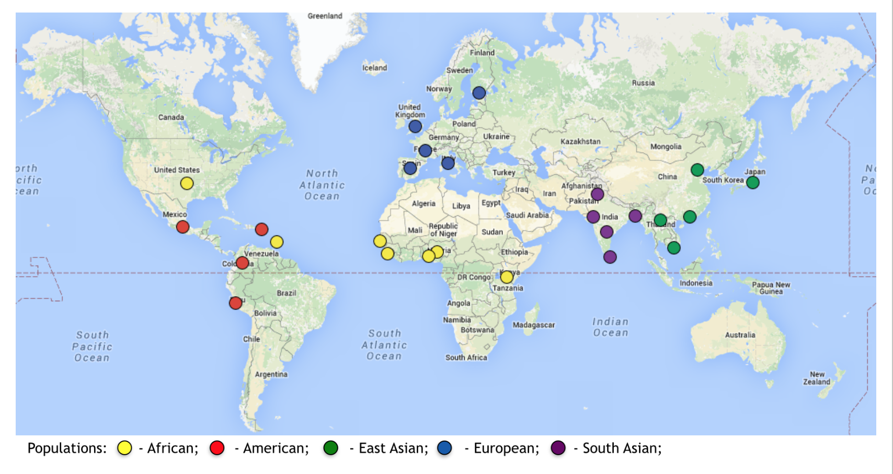
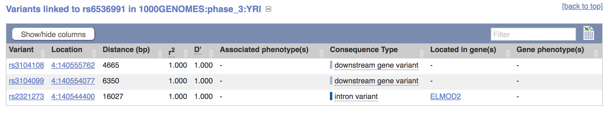

## Introduction to the International Genome Sample Resource (Formerly known as the 1000 Genomes Project)
 

 
 

**The 1000 Genomes Project**, which ran between 2008 and 2015, is as close as it comes to a "catalogue of human variation." The output of this initiative is a database of whole genome sequences from 26 distinct populations from around the world, all aligned to the same human reference sequence. This data is free to use, and is an excellent resource for researchers who want to study genetic variation in a gene across populations, but cannot afford to collect their own samples. 

While it was active, The 1000 Genomes Project published their data in several phases; by the final phase (Phase 3), they had gathered samples from 2,504 individuals from the 26 targeted populations. In 2015, the **International Genome Sample Resource** (**IGSR**) was established to "ensure the future usability and accessibility of the 1000 Genomes data." In keeping with this goal, the IGSR has: re-mapped the Phase 3 data to the latest two human reference sequences, **GRCh37** and **GRCh38**, incorporated externally generated, published genomic data (such as *RNA-seq* data) into their own dataset, and begun adding previously unsampled populations the database. 

Below is a map of the current populations represented in the 1000 Genomes dataset, as well as a reference list of the abbreviations used to identify these populations.  
 

 

### Reference List of Current ISGR Populations
 

* <b>CHB</b> - Han Chinese in Beijing, China
* <b>JPT</b> - Japanese in Tokyo, Japan
* <b>CHS</b> - Southern Han Chinese
* <b>CDX</b> - Chinese Dai in Xishuangbanna, China
* <b>KHV</b> - Kinh in Hi Chi Minh City, Vietnam
* <b>CEU</b> - Utah residents with Northern and Western European Ancestry
* <b>TSI</b> - Toscani in Italy
* <b>FIN</b> - Finnish in Finland
* <b>GBR</b> - British in England and Scotland
* <b>IBS</b> - Iberian Population in Spain
* <b>YRI</b> - Yoruba in Ibadan, Nigeria
* <b>LWK</b> - Luhya in Webuye, Kenya
* <b>GWD</b> - Gambian in Western Divisions in the Gambia
* <b>MSL</b> - Mende in Sierra Leone
* <b>ESN</b> - Esan in Nigeria
* <b>ASW</b> - Americans of African Ancestry in Southwest USA
* <b>ACB</b> - African Caribbeans in Barbados
* <b>MXL</b> - Mexican Ancestry from Los Angeles USA
* <b>PUR</b> - Puerto Ricans from Puerto Rico
* <b>CLM</b> - Columbians from Medellin, Columbia
* <b>PEL</b> - Peruvians from Lima, Peru
* <b>GIH</b> - Gujarati Indian from Houston, Texas
* <b>PJL</b> - Punjabi from Lahore, Pakistan
* <b>BEB</b> - Bengali from Bangladesh
* <b>STU</b> - Sri Lankan Tamil in the UK
* <b>ITU</b> - Undian Telugu in the UK
 

One last thing to note is that each of these populations falls under a "super population" which denotes the general area of the world each population is from. Many times, you will see information split up by these super populations instead of by each individual population. These super populations are as follows: 
 
 

* <b>AFR</b> - African
* <b>AMR</b> - Admixed American
* <b>EAS</b> - East Asian
* <b>EUR</b> - European
* <b>SAS</b> - South Asian
 

For more information about 1000 Genomes and IGSR, visit <http://www.internationalgenome.org/home>.
 

## A Brief Understanding the Bioinformatics Used To Create The 1000 Genomes Database
 
Bioinformatics is the "science of developing methods and software tools for collecting and understanding biological data." The 1000 Genomes Project, or even digitally recording the information DNA gives us, would not have been possible without this field. To understand the files that we will be working with (such as VCF files, which we will discuss later), it is beneficial to know how raw data is transformed in to digital information. In order to explain this process, I have included a simple flowchart that I will walk through. 
  

 

The first step in this flowchart is the DNA sequencing itself. There are several kinds of sequencing, but we know from the 1000 Genomes paper we read that they used what is called Illumina sequencing. Illumina sequencing is a type of next-generation sequencing (NGS on the diagram). All NGS is is a faster, more efficient, and more in-depth process of sequencing that has revolutionized the study of genomics. Illumina sequencing was invented by the Illumina company, and uses a unique method of sequencing that makes it one of the most efficient, affordable, and accurate ways of sequencing that we have today. Illumina sequencing in itself is an incredibly complex process that we won't talk about here, but a good video that explains the process can be found [here](https://www.youtube.com/watch?annotation_id=annotation_228575861&feature=iv&src_vid=womKfikWlxM&v=fCd6B5HRaZ8). 
 
 
DNA sequence reads don't come out of the machine nicely put together and cleaned, however. There are a few more steps to make them in to nice, neat files. As shown in the diagram, the output of a sequencing machine is a file type called a Fastq file. A Fastq file consists of a raw nucleotide sequence that is not aligned to a reference genome, and its quality scores, which are scores that tells how reliable the sequencing read for each base is. You can work with these files, but without aligning them to a reference genome, we won't be able to get as much from them as we want. That's where the next step in the diagram comes in. 
 
 
Aligning a DNA sequence is the process of taking a chunk of DNA sequence and using an algorithm that compares that chunk to a reference genome to figure out where in the genome that chunk goes. This is done with all the sequence chunks that come from the initial Fastq file until you have a full genome. Once you have aligned your Fastq sequence to a reference sequence, you have a BAM file. A BAM file therefore not only contains an entire genome's worth of genetic code, but also gives information about where any particular piece of code falls within the genome. These files are good to work with if you need an entire genome's worth of information, or detailed information about every nucleotide in a region.
 
 
The final step in the flowchart is the VCF file, which is what we will be working with in our class. VCF files are the result of picking out just the variant positions from a BAM file and identifying the genotypes of the genome you sequenced. Below, we will look at the VCF file type more in-depth, as we will be using VCF files in this class. 
 
 
## Overview of the Variant Call Format (VCF) 
 

In our labs, we will be using VCF files to look at our candidate gene, UCP1. The VCF file format is a computer file format that genetic information can be stored in, as we have seen above. VCF files in particular are a way of formatting SNP-only information without having to deal with the rest of the sequence that the SNPs come from. Other file types, such as BAM files, have their own uses but for the purposes of our study (and most population genetics studies) they simply contain way more information than we need. Seriously, a BAM file containing an entire genome can be almost a terabyte (1000 gigabytes) in size! 
 
VCF files are a text-file format which can be opened with a plain text editor on your computer, and can be analyzed using various softwares. Below I have included an example screenshot of what a VCF file looks like when opened in a plain text editor. 
 

 

As you can see from parts (b-g) of the figure, there is different notation that can be used depending on what type of SNP or variant position is being recorded. Don't worry though! You will not need to remember any of the notation used in VCF files, this is just here so you understand one way that SNP information is recorded, and what file type our software will use for the analyses. If you're interested in bioinformatics, there's more information about VCF files [here](http://www.internationalgenome.org/wiki/Analysis/vcf4.0/).
 
 

## How To Use Ensembl To Obtain VCF Information From The 1000 Genomes Dataset
 

Links to, and information for, all of the genome browsers that feature 1000 Genomes data is found [here](http://www.internationalgenome.org/1000-genomes-browsers). 
 
 
As the 1000 Genomes project was running, 1000 Genomes had its own "early access" genome browsers that allowed researchers to get detailed information about a specific gene of interest. These browsers, which are still available today, contain the open-access information that was updated with each phase of the project. However, these browsers are now outdated, and the most up-to-date genomic alignments for the 1000 Genomes project data are generated by Ensembl. Ensembl is a genome database that is maintained by the European Bioinformatics Instritute, and houses genomic data for many different species. Ensembl also has several different versions which are updated as new alignment information becomes available. For this class, we will be using the most up-to-date version of the Ensembl human geneome browser, the GRCh38 browser. Today we will use Ensembl to look at our gene of interest, UCP1. 
 
 

### Step-by-step Instructions for Using Ensembl
 

 
 

#### Step 1: Finding UCP1

* Go to the website: <http://useast.ensembl.org/Homo_sapiens/Info/Index>

* Find the search bar in the top left-hand corner and type in "UCP1." Make sure the "category" drop-down menu is set to "Search all categories." Click "go."
 

 

* The first result to come up should be called "UCP1 (Human Gene)" and should look like this: 
 

 

* Clicking on that will bring you to the "home page" for the gene UCP1, which will look like this: 
 
 

 

Congratulations, you've found your gene! Now, let's visually explore UCP1. 
 
 

#### Step 2: Visualizing UCP1 and its Variants

* If you scroll down on the first page, you will see an interactive map of the UCP1 region of the genome. 
 

 

If you click on the "Go to region in detail" option directly above this image, you will get a more detailed version of the image. If you're interested, you can do this on your own time, but we will not need to do that for the purposes of this class. What we will look at, however, is an image that shows all of the variants in UCP1. 
 

* To get to the variant image, simply go to the lefthand sidebar and look for the "Variant Image" tab under "Genetic Variation."
 

 
 

There, you will find an interactive image that looks like this: 
 

 

You can click on each little variant box as well, which will give you information about each SNP, such as its rs ID number, its location, and what kind of mutation it is: 
 

 
 

Feel free to play around with this image, but what will probably be more helpful is the variant table. 
 

* To get to the variant table, simply go to the tab in the lefthand sidebar that is above the one you are currently in, which will say "Variant Table"
 

 

You will get a table that looks like this: 
 

 

As you can see under the "Conseq. type" column, all of the variants at the top of the table are downstream variants. 
 
 
Let's do a little exercise, shall we? Above the table, there are some filtering options. Click on the "Consequences" filtering option and hit "Turn all off"
 
 

 

Now, turn back on all of the mutations that lie within the coding region of the gene AND will cause a change in genotype. Hint: I chose six types of mutation. After you're done choosing, hit "apply changes."
 
 
Now that we have a shortlist of SNPs that will actually come in handy for us, let's learn how to get useful information about a specific SNP that we will use in later labs. 
 
 

#### Step 3: Exploring A SNP Of Choice

The first thing we'll look is the Global Minor Allele Frequency (MAF). MAF is simply the frequency at which the second most common allele (i.e. the minor allele) occurs in a population. We will be able to get population breakdowns of the MAF, but first we'll look at the Global MAF. 
 
 
* To do this, look at variant table with the results you filtered and find the "Global MAF" column. Click on the small grey arrows by the column header to sort the SNPs from highest-to-lowest MAF. The example SNP in the picture below has a Global MAF of 0.086, which means that 8.6% of the 1000 Genomes participants have the minor "T" allele as opposed to the major "C" allele. In the "Alleles" column, the major allele will always be listed first. 
 

 

* Now that we know how to find out the MAF of a SNP, let's explore the SNP some more. Click on the "Variant ID" of the SNP that has the highest MAF. Clicking on that link will bring you to the SNP page, which looks like this: 
 

 

* Under "Explore This Variant" there is several different tabs that will tell us different things about the SNP. In this class, we will be using two of these features in the future: "Population Genetics" and "Linkage Disequilibrium." Right now, we will do a quick tour of these tabs so you can just see how they work. 

* First, click on the "Population Genetics" icon. You will get this page: 
 

 

* You can see in these pie charts that there are differences in the allele frequencies in each population. 

* Scroll down to the table that gives you the allele frequency breakdown for all the 1000 Genomes populations. Here is an example section of the 1000 Genomes data table: 
 

 

* From left to right, you can see the count numbers of how many C and T alleles reside in each population, as well as the heterozygous and homozygous genotype counts for each population. 
 

As an exercise, find your population in this table, and make sure you can find the allele and genotype counts for your population. This will come in handy when we do our Hardy-Weinberg lab. 
 

The final page we'll explore is the "Linkage Disequilibrium" page.

* To do this, go back to the SNP page and click on the Linkage Disequilibrium icon. You will get this page: 
 

 

* Find your population. There are a few things we will look at. 

* First, click on the right-most "View Plot" link for your population. The icon is a reddish triangle. A few things will come up on this page. 

* The first thing you should see on the page is an image of Chromosome 4, with a red line marking where the SNP of interest is: 
 

 

Think about how the location of this SNP on the chromosome will affect the likelihood of Linkage Disequilibrium. Is it more or less likely that this SNP will be out of Linkage Disequilibrium?

* Scrolling down, you will see a plot. The plot will look like this:
 

 

* This is a Linkage Disequilibrium block. When we talk about Linkage Disequilibrium, we will learn how to read one of these blocks. For now, just know what it looks like. 

* Now, go back to the table on the previous page. For your population, click on the "Show" link under the "Variants in High LD" column. If your population has SNPs in high Linkage Disequilibrium, you will get a table that looks like this: 
 

 

* This table shows us a couple of things that will come in handy later, like how far away a linked SNP is from the SNP of interest, what kind of SNP the linked SNP is, and which gene, if any, the linked SNP falls in. 
 

If your population DOESN'T have SNPs in high Linkage Disequilibrium, think about what that tells us about the importance of UCP1 in your population. 
 
 
Now that we have explored some important features of the Ensembl website, we can learn how to download some data of our own!
 
 

#### Step 4: Getting Genetic Data For Your Population

Usually when you are working with genomic information, you are given a whole chromosome or even a whole genome's worth of information in either a BAM file or a VCF file. If you only need to look at one part of the genome, it can be very annoying to work with a lot of extra data. The Ensembl data slicer is a convenient way to get only the amount of data that you want without using a programto cut it out yourself. Therefore, we will use this tool to get the data for our analysis of UCP1. We will be taking <b>two</b> slices of data today, one that contains all of the SNPs in UCP1, and one that contains only about 1/4 of the SNPs in the gene. We will be using the larger slice in most of our analyses, but we will need the smaller slice for Lab 3. 
 
 
One thing to note about the data slicer is that it is only available for the GRCh37 version of Ensembl, which is one version before GRCh38 (the version we have been using). What's different about the two versions of this site is that all of the 1000 Genomes data is aligned to a different reference genome in each version. All this means for us is that UCP1 will have different genomic coordinates in each version. Similarly, the coordinates of SNPs will be affected, but the SNP ID numbers will be the same since those are universal.  Don't worry about finding the coordinates of UCP1, I will give the GRCh37  to you here.
 
 
The link to the data slicer is available here: <http://grch37.ensembl.org/Homo_sapiens/Tools/DataSlicer?db=core>. 
 
 
Now, on to the tutorial!

* Click on the link provided above. It will take you here: 
 

 
 

* Click "New job." You will get this interface: 
 
 

 

* First off, the file format should be set for VCF. If it's not, click the drop-down menu and select VCF. 

* In the "region lookup" bar, copy and paste in the location <b> 4:141,480,588-141,489,959</b>. These are the GRCh37 version alignment coordinates for the gene UCP1. This is the larger of the two chunks we will be taking.  

* In in the "Choose data file" dropdown list, make sure "phase 3" is selected. This will ensure you get data from the last phase of the 1000 Genomes project. 

* In the "filters" category, select "By populations." This will give you a dropdown menu of all of the 1000 Genomes populations. Select the population that you were assigned, so that you only get the data for that population. 

* The filled-in interface should look like this: 
 

 

* Hit the "run" button at the bottom of the page.

* At the top of the page, hit "New Job" and <b>repeat this process</b>, but this time with the coordinates <b>4:141481462-141485260</b>. These are the coordinates for the smaller slice that we will be taking. 

* When you have clicked "run" for both jobs, you will see this table will pop up, and will tell you when your job has been processed. Click "View results" to look at your results. 
 

 
 

* You will get this page: 
 

 

* Scroll down to the bottom of the results preview. Recall from earlier that there is a "head" and a "body" section of a VCF file. Check to make sure that the "body" of the file is there. It will look like this: 
 

 

We check our file to see if the body is there because sometimes the server will malfunction and give you only the head of the VCF file. If that happens, repeat the data slicer process. Check both files in this same way.  
 
  

#### Step 5: Getting The File To SCC

The last thing we'll do is save our file and put our newly downloaded files in to the folders we made in the SCC tutorial with Charlie Jahnke. To do that: 
  

* Hit the "Download results file" button for both of your slices. You will get a file with your data. Rename the full UCP1 file with the acronym for your population. Name the smaller file with the acronym and then "small." For example, I downloaded data from the YRI population, so I named the larger file "YRI.vcf" and will name the smaller file "YRIsmall.vcf." Save the files to the desktop.
  

 

* Open a new Moba X Term window on the computer and double-click on "user sessions" (highlighted here). 
 

 

* You will open the "session settings" window. Click on the SFTP tag. In the "remote host" box, type "scc1.bu.edu." Type your BU username in to the Username box. Hit "OK."
 

 

* Enter your BU password in the popup box. 
 

 

* Now you have an interactive interface where you can see all the files loaded in to your SCC account. In the highlighted box, type the file path that you created in the pre-lab to store your data.
 

 
 

* Now you are in the directory you will use for this class. Go to the desktop of the computer, and your two downloaded files should be right on the home screen. Simply drag both of your files from the desktop and drop them in to your directory's interface like so:
 
 

 

After you drag and drop your files, you'll see them in your directory: 
 

 

And now, you're good to go for Lab 2!

# Congratulations, you now have your genetic data!
