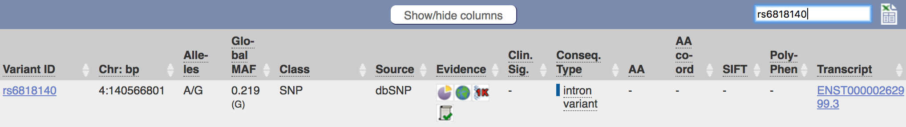
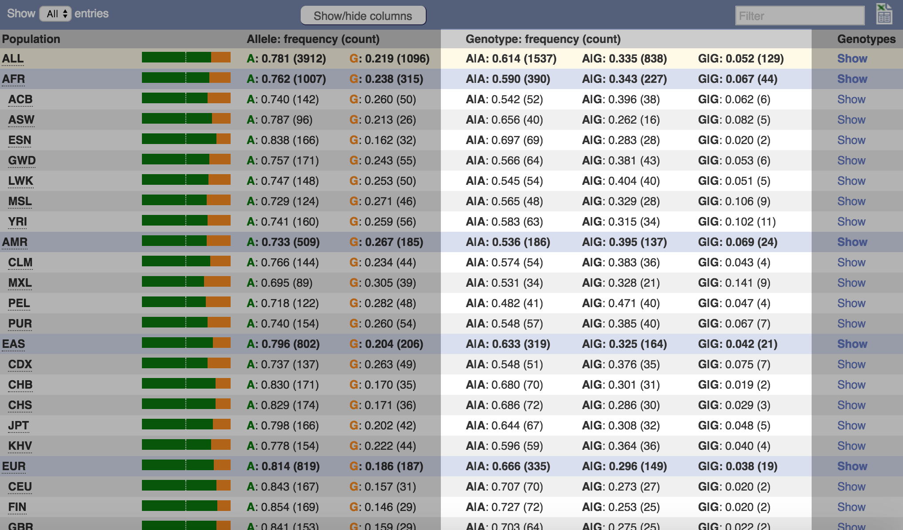

## Introduction to Hardy-Weinberg Equilibrium (using Human Genome Data)

***

**Readings**:<ul> 
<li>[Chen J. The Hardy-Weinberg Principle and Its Applications in Modern Population Genetics. *Frontiers in Biology* 5(4): 348-53.](https://link.springer.com/article/10.1007/s11515-010-0580-x)</li><br>
<li>[Rose G, Crocco O, D'Aquila P, Montesanto A, Bellizi D, Passarino G. 2011. Two variants located in the upstream enhancer region of human UCP1 gene affect gene expression and are correlated with human longevity. *Experimental Gerontology* 46(11): 897-904.](https://www.sciencedirect.com/science/article/pii/S0531556511001987?via%3Dihub)</li><br>
<li>[Wigginton JE, Cutler DJ, Abecasis GR. 2005. A note on exact tests of Hardy-Weinberg equilibrium. *Am J Hum Genet* 76: 887-893.](https://www.cell.com/ajhg/fulltext/S0002-9297(07)60735-6?code=ajhg-site)</li></ul>

***

We have already discussed Hardy-Weinberg Equilibrium in class, but we haven't really linked it to population genetics yet. Today's lab will focus on the uses of Hardy-Weinberg Equilibrium in modern population genetics as we use *R* to look at Hardy-Weinberg Equilibrium in our assigned populations. 
<br>

### Hardy-Weinberg Equilibrium in Population Genetics
<br>
In modern population genetics studies, Hardy-Weinberg Equilibrium has a slightly different meaning than what we have talked about so far in class. A population that is in true Hardy-Weinberg Equilibrium has to fit five conditions: 

* the population must be extremely large (no genetic drift)
* it must be isolated from other populations (no gene flow)
* there must be no mutations
* there must be random mating (no assortative mating or sexual selection)
* there must be no natural selection

Obviously, holding a population of any species to this standard is pretty much impossible, so we will use Hardy-Weinberg differently to understand real populations (like humans) in our own population genetics study. 
<br>
<br>
You will often see Hardy-Weinberg Equilibrium being used in modern population genetics to simply measure whether the observed genotype frequencies of a specific SNP or microsatellite are the same as the estimated genotype frequencies. Population geneticists will often use this measure of deviance as a "starting point," so to speak, for their studies. They use Hardy-Weinberg as their starting point for a few reasons; to check the genotype quality of their data, to get a general sense of the amount of allelic variability and selection happening at specific loci, or, most commonly, as an assumption about the frequency of disease causing genotypes in their population. The assigned [Rose et al. (2011)](https://www.sciencedirect.com/science/article/pii/S0531556511001987?via%3Dihub) paper uses Hardy-Weinberg in the latter manner, as a check to make sure there was no selection happening at their two loci of interest.
<br>
<br>
In order to determine how much the observed phenotype deviates from the expected phenotype, we've been using a *Chi-Squared Goodness-of-Fit test*, the output of which is a *P-value* that will tell you how much the observed genotype frequency deviates from the expected frequency. However, we learned from the [Wigginton reading](https://www.cell.com/ajhg/fulltext/S0002-9297(07)60735-6?code=ajhg-site) that the Chi-Squared test has a tendency to give false positives, meaning it will tell us something is significantly different when it's actually not; this is also called a *Type I Error*). In their paper, they propose a new mathematical method of calculating the "True" Hardy-Weinberg value, which fixes the problem of false positives. We will not need to get in to the specifics of the equation to calculate the "True" Hardy-Weinberg Equilibrium, but you will be calculating your population's "True" Hardy-Weinberg Equilibrium as well as using a traditional Chi-Squared test. 
<br>
<br>
Now that we have learned more about the applications of Hardy-Weinberg Equilibrium in modern population genetics, let's get to the lab! 
<br>

### Learning Outcomes
<br>
* Use the *SCC* and *R* coding language to observe and understand population differences in *UCP1* variation.

* Calculate Hardy-Weinberg Equilibrium for all *UCP1* SNPs in individual populations using a traditional Chi-Squared test.

* Perform a check on all SNPs *not* in Hardy-Weinberg Equilibrium by calculating "True" Hardy-Weinberg with the built-in *Shiny App*. 

* Research the consequence types of these SNPs in order to better understand *how* these SNPs might affect the genome itself, and also how they might affect subsequent phenotypes. 

* Calculate the "True" Hardy-Weinberg Equilibrium using the *Shiny App* for *A-3826G* (SNP ID *rs1800592*), an upstream SNP that has known phenotypic consequences, and determine what the Hardy-Weinberg Equilibrium says about the population. 
<br> 

## Step 1: Accessing *R Studio* and your Data
<br>
The first thing we need to do is access *R Studio* within the *SCC* environment. If you remember from the tutorial, there are a few steps you need to do in order to log in. 

* First, log in to SCC and enter your password.

* Your VCF file should be in there from last time. 

* *R Studio* needs a few *modules* loaded before it can be opened. Use the following commands to get *R Studio* going: 
<br>

```{bash, eval = F, echo = T}
module load gcc #we need this module to load R packages
module load R
rstudio #this will launch R Studio
```

## Step 2: Calculating Hardy-Weinberg Equilibrium Using Chi-Squared
<br> 
Now that we are in *R Studio* and have our data in place in our working directory (from Lab 1), we can get started. The first thing we need to do here is install two *packages*. 
<br>
<br>
In *R* space, packages are essentially bundles of functions that *R* users have written to perform analyses that do not come with the base program. In this class we will be using packages that were designed specifically for population genetics analysis. To install these packages, run these two lines of code in the console: 
<br>
```{r, eval=F, echo=T}
install.packages("vcfR")
install.packages("pegas")
```

We only need to install these packages once, but we need to load them in to our workspace every time we open the program. To do this, use the following code: 
<br>
```{r, results = 'hide', message=F, warning=F}
library(vcfR)
library(pegas)
```

Now that we have all our packages loaded, we can get to the analysis! In the "files" tab in the bottom left quadrant, you should see the VCF files we downloaded in your folder. We will be working with the larger VCF file today. We will need to load this file in to our workspace much like we did with our R packages. Unlike the packages, however, we need to give a name to the file. To make things simple, it would be a good idea to name this fiile in accordance with the acronym of your population. I will use the YRI population as an example. Use one of the two options below to enter your VCF data into the *R* space: 
<br>
```{r, echo=T, results='hide'}
#If your file is zipped (e.g., ends in '.vcf.gz') then use this code:

YRI <- read.vcfR("YRI.vcf.gz", verbose = TRUE)
```

```{r, eval = F, echo=T, results='hide'}
#If your file is unzipped (e.g., ends in just '.vcf') then use this code:

YRI <- read.vcfR(YRI.vcf, verbose = FALSE)
```

This will give you a file in your workspace called a *vcfR* file. Most genetics-based packages have their own way of formatting and working with genetic data, and this is the format *R* can use. The next line of code will seem a little counterintuitive, because we have to change the format of the file *again* to work with functions in the *pegas* package. Doing this will not delete the original file (as long as you name the file something different), so we can use the *vcfR* file again in later analyses. The type of file we have to convert to for *pegas* is called "genind," so we will do that here: 
<br>
```{r}
pegas.YRI <- vcfR2genind(YRI, sep = "[|/]")
```

Finally, now that we have our data in the format that we need, we can do our Hardy-Weinberg tests. This function will test whether *all* of your population's SNPs in the coding region of *UCP1* are in Hardy-Weinberg Equilibrium. As an example, I will run the funtion with my *pegas.YRI* file. Remember to save your results by assigning them a name:
<br>
```{r}
HWE <- hw.test(pegas.YRI, B = 0) #B MUST equal 0 here, changing this value will affect the result!
HWE #Running the name of your results file will print the results
```

What you'll get is this table. On the right is a list of P-values. Look over your P-values to see if any of them are significant (p < 0.05). If any of your P-values *are* significant, this means that that SNP is not in Hardy-Weinberg Equilibrium! Record the SNP ID numbers that have significant P-values, because they will be important for what we do next. 
<br>
<br>
Hopefully, some of you have found that there are SNPs in your population that are not in Hardy-Weinberg Equilibrium. That's exciting! But, think back to the Wigginton paper. There is a large *Type 1 Error* rate for Hardy-Weinberg tests performed by using a Chi-Squared test. To account for this, we will test our significant SNPs for Type 1 Error using the Shiny App calculator Becca De Camp created for us. Here's how we will do that: 

## Step 3: Finding the "True" Hardy-Weinberg Equilibrium
<br>
No more coding will happen in this lab tutorial. Instead, you will be interacting with a user interface on this webpage that was created to calculate "true" Hardy-Weinberg Equilibrium P-values for one SNP at a time. The input for this UI will be the genotype frequencies from your population (i.e. the number of people from the population with the heterozygous genotype, the number of people with one homozygous genotype, etc.). You will find this information on *Ensembl* by doing the following: 
<br> 

* Make a shortlist of ***FOUR*** SNP ID numbers of the SNPs that you found *not* to be in Hardy-Weinberg Equilibrium. When making this list, check the *degrees of freedom*, column. This UI will only accept SNPs with only *two* alleles, or *one* degree of freedom. Therefore, even though there are SNPs with more than two alleles that are not in Hardy-Weinberg Equilibrium, please ignore them for now. If you do *not* have four SNPs that meet these criteria, fill in your list with SNPs at random. Ultimately, EVERYONE should be looking at FOUR SNPs each. 

* Go to the *UCP1* gene page on *Ensembl* and click on the *Variant table* tab so you get this familiar page: 

* In the search bar at the top right of the variant table, type in the SNP ID number for one of your SNPs that's not in Hardy-Weinberg Equilibrium and search it. I will use the SNP **rs6818140** to demonstrate this. 
<br> 


<br>

* When you have found your SNP in the table, you should first make note of the consequence type of the SNP. For example, *rs6818140* is an intron variant. How do you think the consequence type will affect the phenotypic outcome of this SNP? 

* Next, click on the SNP ID to get to the SNP page. From there, click on the *Population Genetics* tab to get the population genetics table. 

* Find the *Genotype Frequency* column in this table: 
<br>


<br>

* Find *your* population in the table. Record the genotype frequency count numbers (heterozygous, homozygous 1 and homozygous 2). These will be your input to the UI below. Using this method, find these genotype frequencies for each SNP you want to test.

* NOTE: before you've entered any data into the UI, it will show a result error ("Error: missing value where TRUE/FALSE needed"). This just means there's nothing entered yet. Once you've entered your genotype counts, that error message will be replaced by the calculated "True" Hardy-Weinberg Equilibrium P-value for your SNP.

```{r, eval=T,echo=F}
library(shiny)
runGitHub("shiny_HWE","fuzzyatelin",subdir="fuzzyatelin.github.io/AN333_Fall2018/")

```

```{r, eval=F,echo=F}
library(shiny)
shinyApp(
   
   ui <- fluidPage(
  
  # App title ----
  titlePanel("True HWE Calculator"),
  
  # Sidebar layout with input and output definitions ----
  sidebarLayout(
    
    # Sidebar panel for inputs ----
    sidebarPanel(
      
      # Input: Slider for the number of bins ----
      
      numericInput("hetero", 
                   "Heterozygous Genotype Count", 
                   0),
      
      numericInput("hom1", 
                   "Homozygous 1 Genotype Count", 
                   0),
      
      numericInput("hom2", 
                   "Homozygous 2 Genotype Count", 
                   0)
      
    ),
    
    # Main panel for displaying outputs ----
    mainPanel(
      
  
      textOutput("HWE")
      
    )
  )
),
server = function(input, output) {
  
  output$HWE <- renderText({if (input$hom1 < 0 || input$hom2 < 0 || input$hetero < 0)
    return(-1.0)
    
    # total number of genotypes
    N <- input$hom1 + input$hom2 + input$hetero
    
    # rare homozygotes, common homozygotes
    obs_homr <- min(input$hom1, input$hom2)
    obs_homc <- max(input$hom1, input$hom2)
    
    # number of rare allele copies
    rare  <- obs_homr * 2 + input$hetero
    
    # Initialize probability array
    probs <- rep(0, 1 + rare)
    
    # Find midpoint of the distribution
    mid <- floor(rare * ( 2 * N - rare) / (2 * N))
    if ( (mid %% 2) != (rare %% 2) ) mid <- mid + 1
    
    probs[mid + 1] <- 1.0
    mysum <- 1.0
    
    # Calculate probablities from midpoint down 
    curr_hets <- mid
    curr_homr <- (rare - mid) / 2
    curr_homc <- N - curr_hets - curr_homr
    
    while ( curr_hets >=  2)
    {
      probs[curr_hets - 1]  <- probs[curr_hets + 1] * curr_hets * (curr_hets - 1.0) / (4.0 * (curr_homr + 1.0)  * (curr_homc + 1.0))
      mysum <- mysum + probs[curr_hets - 1]
      
      # 2 fewer heterozygotes -> add 1 rare homozygote, 1 common homozygote
      curr_hets <- curr_hets - 2
      curr_homr <- curr_homr + 1
      curr_homc <- curr_homc + 1
    }    
    
    # Calculate probabilities from midpoint up
    curr_hets <- mid
    curr_homr <- (rare - mid) / 2
    curr_homc <- N - curr_hets - curr_homr
    
    while ( curr_hets <= rare - 2)
    {
      probs[curr_hets + 3] <- probs[curr_hets + 1] * 4.0 * curr_homr * curr_homc / ((curr_hets + 2.0) * (curr_hets + 1.0))
      mysum <- mysum + probs[curr_hets + 3]
      
      # add 2 heterozygotes -> subtract 1 rare homozygtote, 1 common homozygote
      curr_hets <- curr_hets + 2
      curr_homr <- curr_homr - 1
      curr_homc <- curr_homc - 1
    }    
    
    # P-value calculation
    target <- probs[input$hetero + 1]
    
    #plo <- min(1.0, sum(probs[1:obs_hets + 1]) / mysum)
    
    #phi <- min(1.0, sum(probs[obs_hets + 1: rare + 1]) / mysum)
    
    # This assignment is the last statement in the fuction to ensure 
    # that it is used as the return value
    p <- min(1.0, sum(probs[probs <= target])/ mysum)})
  
}
)

```
<br>

Record your results, and make sure to record the SNP ID of each SNP you are testing. The last thing we'll do is think about what the calculations you did today mean. 
<br>

## Step 4: What Do Your Results Mean? Discuss with a partner from class: 
<br>

Think about the results you produced today in the context of your population. Here are some guiding questions to help you: 
<br>

* If your population had SNPs that were not in Hardy-Weinberg Equilibrium, what kind of consequence did the SNP(s) have? How would that consequence type affect the phenotype? 

* Does a SNP not being in Hardy-Weinberg Equilibrium mean that evolutionary forces are acting on it? How might evolutionary forces be acting on *UCP1* if a SNP is *not* in Hardy-Weinberg Equilibrium? 
