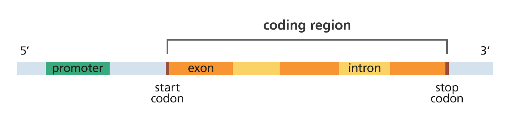

## Homework: Introduction to Hardy-Weinberg Equilibrium

 

***

**Readings**:<ul> 
<li>[Chen J. The Hardy-Weinberg Principle and Its Applications in Modern Population Genetics. *Frontiers in Biology* 5(4): 348-53.](https://link.springer.com/article/10.1007/s11515-010-0580-x)</li> 
<li>[Rose G, Crocco O, D'Aquila P, Montesanto A, Bellizi D, Passarino G. 2011. Two variants located in the upstream enhancer region of human UCP1 gene affect gene expression and are correlated with human longevity. *Experimental Gerontology* 46(11): 897-904.](https://www.sciencedirect.com/science/article/pii/S0531556511001987?via%3Dihub)</li> 
<li>[Nishimura T, Katsumura T, Motoi M, Oota H, Watanuki S. 2017. Experimental evidence reveals the UCP1 genotype changes the oxygen consumption attributed to non-shivering thermogenesis in humans. *Scientific Reports* 7(5570): 348-53.](https://www.nature.com/articles/s41598-017-05766-3)</li> 
<li>[Wigginton JE, Cutler DJ, Abecasis GR. 2005. A note on exact tests of Hardy-Weinberg equilibrium. *Am J Hum Genet* 76: 887-893.](https://www.cell.com/ajhg/fulltext/S0002-9297(07)60735-6?code=ajhg-site)</li></ul>

***

Now that many of us have a little more facility with working with *Ensembl* and 1000 Genomes data, I'm hoping this week's lab homework will be fairly simple. Don't forget: for more conceptual questions, you can consult both your notes/slides from lecture and the textbook!

As before, you'll be turning in your homework via an online interface.  I recommend writing your essays in a document on your laptop and only engaging with the online interface when you're ready to turn in *all* of your completed answers.

### [Access the online interface to submit your homework answers here.](https://goo.gl/forms/JTrXZDh0KaXvoOHm1)

 

* What does it mean if there is a SNP in the gene *UCP1* that is not in Hardy-Weinberg equilibrium? Think not only about the phenotypic consequences, but what it says about the environment of the population.

* How many SNPs in *your* population were *out* of Hardy-Weinberg equilibrium?

* Please list each of the four SNPs you chose to check for "true" Hardy-Weinberg equilibrium using the *Shiny App* embedded in the Lab 2 tutorial. What was the P-value of each using the *R* analysis? What was the modified P-value using the *Shiny App*? Did any of them change significance? Based on the Lab 2 tutorial and the Wigginton et al. (2005) reading, what does a change in P-value mean?

 

* Imagine that gene map above represents *UCP1*. Based on the Rose et al. (2011) article, where on the map is the SNP A-3826G? How could the placement of this SNP affect *UCP1* phenotype?

* Where on the map above is the SNP in *your* population that most significantly deviates from Hardy-Weinberg equilibrium? How would that SNP affect *UCP1* phenotype? If you don't have any SNPs that deviate, choose one at random. 

* Think about your population. Would it make sense for your population's *UCP1* genotype/phenotype to be influenced by evolutionary forces in the present day? Why or why not?
 
 
 