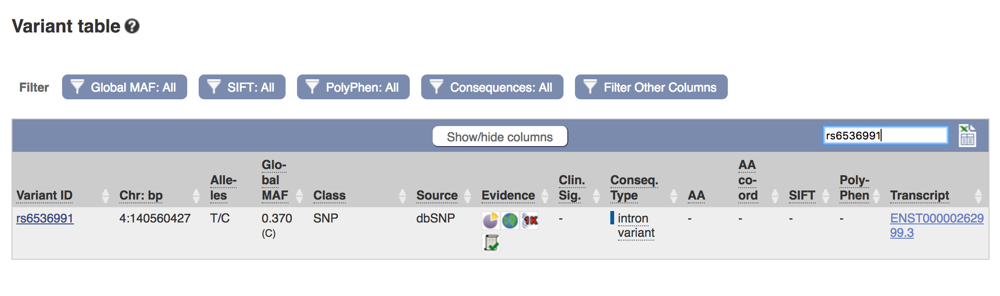

## Introduction to Linkage Disequilibrium (LD)
<br>
As we have learned in class, LD is simply the non-random assortment of alleles at different loci. Linked alleles will travel with each other during crossover events during meiosis, and if we know LD between two alleles is present in a population we can even use the frequency of one allele to predict the frequency of the other allele. Today, we will look at LD within UCP1 in our own populations to get both a sense of the amount of linkage within the gene, and what that linkage can tell us about our population's history.
<br>

### Our SNPs of Focus
<br>
In the Ramos et al. paper that you read for homework, they looked at 3 SNPs within UCP1 that were thought to be associated with obesity:  rs6536991, rs22705565 and rs1250257. The results found that only rs6536991 was directly associated with obesity in the population they looked at (Brazil), but the other two alleles, rs22705565 and rs1250257, were found to be in various levels of linkage to rs6536991. We will take a closer look at these three SNPs in our own populations, as well as another SNP called rs35243591 that is associated with obesity according to Ensembl. Additionally, the 1000 Genomes Project found various frequencies of LD between this SNP and other SNPs in UCP1. 
<br>

### A Note On D' and R^2^
<br>
We will be using two statistics to gauge LD in our populations: D' and R^2^. Both of these are useful for determining the amount of linkage between two SNPs, but each statistic tells us something slightly different. D' is slightly easier to understand, it simply is a measure of the predictability of one SNP's genotype based on the other. A D'=1 is perfect LD, and D'=0 is Linkage Equilibrium. R^2^ is a little bit different. This statistic will also take in to account the frequency of the allele in question. If one SNP genotype is linked to another, but the linked genotype of one SNP is the minor allele (less common than the other genotype), the R^2^ value will be lower than the D' value. This, however, does not make the SNPs any less linked, it is just taking in to account allele frequency. 

### Learning Outcomes

*	Learn about the SNPs rs6536991, rs35243591, rs2270565, and rs12502572 and their roles in obesity.

*	Learn how to use the package SNPStats to perform LD analysis in a population, including constructing LD matrices and LD heatmaps. 

*	Learn about the two statistics D' and R^2, which are the most commonly used statistics to evaluate LD between SNPs. Learn how they are different, and what they can tell us about LD in our population. 

*	Learn how to use Ensembl to look at long-distance LD between SNPs in UCP1 and SNPs in other genes. 
<br>

## Step 1: Getting To RStudio And Preparing Your Data
<br>
Log in to the SCC and bring up the RStudio window like we did in the last lab: 
<br>
```{bash, eval = F, echo = T}
#login
ssh -Y username@scc1.bu.edu
```
<br>
```{bash, eval = F, echo = T}
#access your directory and load your R space
cd /project/anth333/yourfilename
module load gcc
module load R
rstudio
```
<br>
Now that we're in R, we can prepare our data for analysis. The functions we will use today take an argument of a "SNPMatrix," so we will convert our data in to a SNPMatrix now. I will use the population YRI again as an example. 
<br>
```{r, results='hide', message=F, warning=F}
#First, we load the packages we will be using, which should already be installed in SCC:
library(snpStats)
library(VariantAnnotation)
library(LDheatmap)

```
<br>
Next, we will load in our data. Not only will we load in our VCF file of all the SNPs in UCP1, we will load in the smaller slice that we took in Lab 1 as well. We will load the VCF files in to our R space first, then use another function to transform them in to SNPMatrices. 
<br>
```{r}
#We'll start with the full UCP1 file. Copy this code with the name of your VCF file. The 'hg19' is telling the function to align our data with the hg19 genome that comes with the package VariantAnnotation:

vcfbig <- readVcf("YRI.vcf", "hg19")

#Next, convert it to a SNPMatirx. Remember to replace "YRI" with the acronym for your own population:

YRImatrix <- genotypeToSnpMatrix(vcfbig)
YRImatrix #repeating the file name will show you what it looks like
```
<br>
One error message you will notice is "variants with >1 ALT allele are set to NA non-single nucleotide variations are set to NA." This means that loci with 3 or more alleles are not included in any of these analyses. Because of this, you will notice a lot of what appears to be linkage equilibrium when making your charts, but this is merely due to the functions' inability to process LD between SNPs with more than 2 alleles. 

```{r}
#Repeat this process with your smaller slice of UCP1: 
vcfsmall <- readVcf("YRIsmall.vcf", "hg19")

YRIsmallmatrix <- genotypeToSnpMatrix(vcfsmall)
head(YRIsmallmatrix)
```
<br>
Now what you'll notice is that the "SNPMatrix" files we made actually are actually two separate files under one file name, and only one of them is the actual SNPMatrix. In order to call only the SNPMatrix in our functions, we will use "$genotypes" after our SNPMatrix's name. You will see this in our following analyses. 
<br> 

## Step 2: Using the "ld" Function 
<br> 
Next, we will be using a function from the SNPStats package to look at LD across the whole UCP1 gene. To do this, we will use the 'ld' function to create an LD matrix, which we will then graph to comprehend it better. First, we'll use the 'ld' function like so: 
<br>
```{r}
#For "Stats," use "R.squared" for now. We will explore D' later. Make sure to substitute "YRImatrix" for what you called your larger SNPMatrix
LD <- ld(YRImatrix$genotypes, depth = 200, stats = "R.squared")
head(LD)
```
<br>
This will give you a matrix of LD values. This is probably confusing to look at. An LD analysis output like this can be hard to interpret without a visual aid, so we will build one. The output of this function (our "LD" object) is what we'll use as an input to make sense of what this table means. 

```{r}
#sets color scale for the graph
cols = colorRampPalette(c("yellow", "red"))(10)
#building the image 
image(LD, lwd = 0, cuts= 9, col.regions=cols, colorkey=TRUE)

```

You can see that much of this gene in the YRI population shows very low LD, but there are several blips where high LD is observed. What could this mean? 

## Part 3: Measuring LD in Our SNPs Of Interest
<br>

Now, we will look at our smaller dataset so we can focus on four SNPs in particular: rs6536991, rs35243591, rs2270565, and rs12502572. Now, three of these you read about in the homework as being either SNPs related to obesity, or in moderate linkage with obesity-related SNPs. The one that was not in the reading, rs35243591, is another obesity-related SNP that has been shown in the Ensembl data to be in high LD within some populations. 
<br>
<br>
What we will be doing now is creating two LD heatmaps, one that displays the R squared LD statistics and one that displays the D prime LD statistics. As we discussed in the introduction, these two statistics don't tell us quite the same things about our data, so comparing the two statistics can be useful in making conclusions about your populations. 
<br>
<br>
The first thing you should do is copy and paste this block code in to the console. This will create a vector of numbers that is saved as a value called "positions." These numbers are the positions of all the SNPs that we will be using in our LD heatmap. 
<br>
```{r}
positions <- c(141481462, 141481520, 141481581, 141481612, 141481686, 141481733, 141481761, 141481841, 141481902, 141481946, 141481962, 141482038, 141482137, 141482180, 141482216, 141482228, 141482306, 141482327, 141482336, 141482472, 141482484, 141482511, 141482527, 141482664, 141482681, 141482691, 141482768, 141482785, 141482846, 141482867, 141482879, 141482897, 141483020, 141483130, 141483271, 141483330, 141483338, 141483389, 141483471, 141483476, 141483481, 141483503, 141483539, 141483540, 141483551, 141483675, 141483685, 141483735, 141483781, 141483814, 141483893, 141483997, 141484041, 141484046, 141484075, 141484144, 141484182, 141484200, 141484292, 141484309, 141484351, 141484363, 141484369, 141484372, 141484416, 141484492, 141484533, 141484536, 141484540, 141484577, 141484632, 141484684, 141484734, 141484802, 141484876, 141484908, 141485004, 141485065, 141485088, 141485098, 141485134, 141485172, 141485177, 141485260)
```
<br>

Now, here is the code to create the LD heatmap showing the R squared statistic. The only thing you have to change in this code is to replace the "YRIsmallmatrix" value with the name that you gave your smaller SNPMatrix. Leave the "$genotypes" part of the command though, just like in the ld function. Run the rest of the code as normal. 
<br>
```{r}
smallheatmapr <- LDheatmap(YRIsmallmatrix$genotype, genetic.distances=positions, distances="physical",
LDmeasure="r", title="Pairwise LD with R^2", add.map=TRUE, add.key=TRUE,
geneMapLocation=0.15,
SNP.name=c("rs6536991", "rs35243591", "rs2270565", "rs12502572"), color=NULL, newpage=TRUE,
name="ldheatmap")

```
<br>

Next, we will make the graph displaying the D prime statistic. Again, all you have to replace in this code is the "YRIsmallmatrix" with the name you gave your smaller matrix. 
<br>

```{r}
smallheatmapD <- LDheatmap(YRIsmallmatrix$genotype, genetic.distances=positions, distances="physical",
LDmeasure="D", title="Pairwise LD with D'", add.map=TRUE, add.key=TRUE,
geneMapLocation=0.15,
SNP.name=c("rs6536991", "rs35243591", "rs2270565", "rs12502572"), color=NULL, newpage=TRUE,
name="ldheatmap")
```
<br> 
Now you've got two graphs that you can use for your report! You can see specifically whether or not the SNPs of interest (the labelled SNPs) by finding where on the graph their paths intersect. Or, for the purpose of reporting your results, we can look at something called an LD matrix that was generated by the LD heatmap function. This is a matrix where the row and columnn names are SNP ID numbers, and the cell at the intersection of a row and a column will tell you the LD statistic for those two particular SNPs. For our purposes, you do not need to look at the whole chart, you just need to find the intersections of our four SNPs of interest to see if any of them are in LD, and what that LD value is for each respective statistical test. 
<br>
<br>
To view your LD matrices, run these two lines of code separately: 
<br>

```{r}
#for R squared LD heatmap: 
View(smallheatmapr$LDmatrix)

#for D prime LD matrix
View(smallheatmapD$LDmatrix)

```
<br>

## Part 4: Using Ensembl To Look For Other SNPs In LD 
<br>
The last thing we'll do in this lab is look at look at Ensembl's information on LD for each of the SNPs we studied today in your populations. To do this: 
<br>

* Go to [Ensembl](https://useast.ensembl.org/Homo_sapiens/Info/Index) and search UCP1 in the Human searchbar as we have done before

* In the left sidebar, go to the "Variant Table" tab to get the variant table:
<br>


<br>

* Pick one of the variants we looked at today (rs6536991, rs35243591, rs2270565, and rs12502572) and enter it in the variant table search bar. Make note of what kind of consequence each SNP has. What does the consequence mean, and how might the consequence of a SNP affect its LD?  
<br>


<br>

* Click on the Variant ID of the SNP you searched to get the SNP page. Click on the "Linkage Disequilibrium"
tab under "Explore This Variant"
<br>


<br>

* You will get this page. This should look familiar, because we visited it briefly in our introductory lab. You will get a page like this that has LD plots of the SNP for all of the 1000 Genomes populations. 
<br>


<br>

* You can play around with the LD calculator and the LD plots, but the first thing you should do is find your population in the table and click on the "show" button for "Variants in High LD." You will get this: 
<br>


<br>

* Some populations will have more SNPs in high LD than others. Look specifically at the SNPs in high LD that are not in LD. In the example above, there is a SNP listed that is in the gene ELMOD2. 

* Repeat this process for all four SNPs we looked at in today's lab. Where are the high LD SNPs that aren't in UCP1 located? Are any of them located in other genes? 

## Part 5: What Do Your Results Mean? Discuss with a partner: 
<br>
Think about the results you produced today in the context of your population. Here are some guiding questions to help you: 
<br>

* What does it mean for two SNPs in your population to be in LD? How would two obesity SNPs being in LD reflect selection in that population? 

* Would you expect a high level of LD in UCP1 in your population based on its environment? Why or why not? 

* What would LD between two obesity-related SNPs tell you about the evolutionary history of your population? 

* If you found any SNPs in high LD with our UCP1 SNPs during the Ensembl exercise that are in a different gene, do a quick Google search on the gene(s). What does that gene code for? How could it be connected to UCP1? 