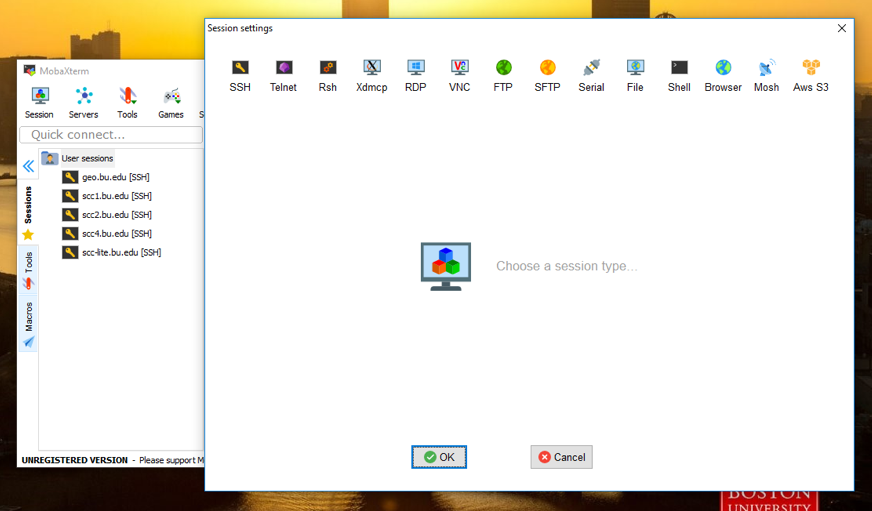
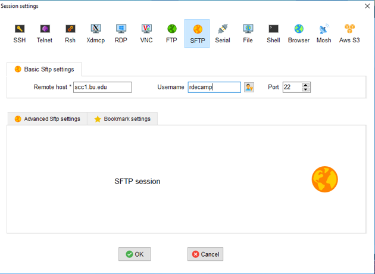
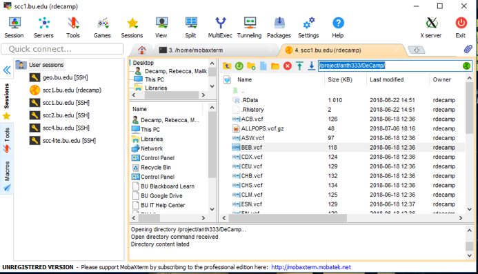
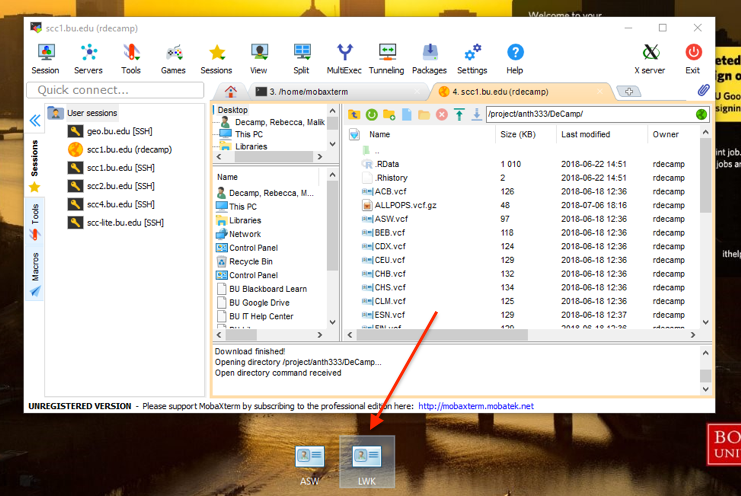
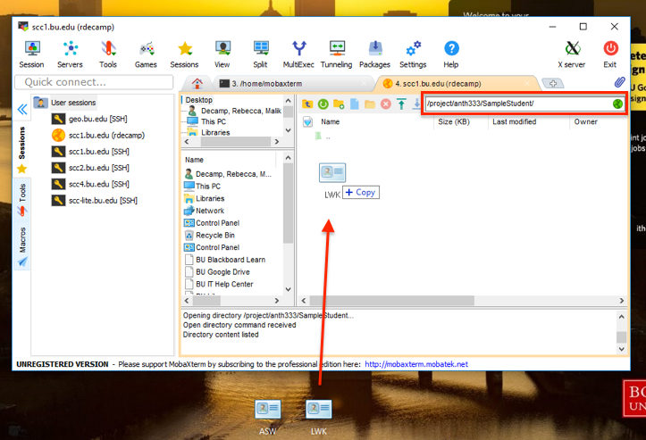

## Introduction to Nearest Neighbor Joining and Phylogenetics
<br>

Today we will be looking at not just our populations themselves, but the individuals in them and how they relate to one another. We will do this using the Nearest-Neighbor Joining method of tree-making, which you read about in preparation for the lab. This method of tree-making simply identifies which individuals are closest together and groups them together. It is one of the simplest ways of making a phylogenetic tree, even though it does not always follow the law of Maximum Parsimony (minimal evolution). But, as stated by Saitou and Nei, the tree with maximum parsimony is not always the correct tree for recovering the true shape of the tree. 
<br>

### Kimura's Neutral Theory of Evolution
<br>

Another important method we will be using today to compute how related the people in the population are to each other is Kimura's Neutral Theory. This theory states that most of the mutations occur during evolution are neutral mutations that don't affect the gene they occur in. Therefore, most of the mutations that stay in a population are neutral rather than beneficial. We will use this theory as a model when calculating the pairwise distances between the people in our populations. The model will also help us compute a timescale for our tree, as we can assume that neutral mutations happen at a certain rate. 
<br>

### Learning Outcomes: 

* Learn how to apply Kimura's Neutral Theory to our populations to create a matrix of genetic distances between individuals in a population

* Learn how to use the <i>ape</i> package's Nearest Neighbor Joining algorithm to create a Nearest Neighbor Joining tree

* Learn how to interpret a phylogenetic tree, and learn what it can tell us about molecular diversity within our populations
<br>

## Step 1: Getting Started
<br>
Log in to the SCC launch RStudio, as per ususal: 
<br>
```{bash, eval = F, echo = T}
#login
ssh -Y username@scc1.bu.edu
```
<br>
```{bash, eval = F, echo = T}
#access your directory and load your R space
cd /project/anth333/yourfilename
module load gcc
module load R
rstudio
```
<br>
Now, we will prepare our data for analysis. The main package we will be using is called <i>ape</i> (Analyses of Phylogenetics and Evolution), which uses a file format called a DNAbin. We will load in our data with the package vcfR, like we did in Lab 2, then we will convert our vcfR object to a DNAbin. 

```{r, results='hide', message=F, warning=F}
#First, load the packages: 

library(vcfR)
library(ape)
library(phangorn)
library(ade4)
```
<br>
Now, let's prepare our data. Again, I will be using the population YRI as an example. Remember to name your data according to your own population!
<br>
```{r}
#read in data
YRI <- read.vcfR("YRI.vcf")

#create DNAbin
YRIdna <- vcfR2DNAbin(YRI)
YRIdna
```

## Part 2: Creating A Distance Matrix Using Kimura's Evolutionary Model
<br>

As we learned in the introduction, Kimura's Neutral Theory is a popular model of molecular evolution. We will tell the function we will be using to create a distance matrix that we want it to use Kimura's Neutral Theory to figure out how far the members of our population are from each other. Ultimately, this distance matrix is what we will use to build our tree. 

```{r}
#creating distance matrix from our DNAbin. "K80" signifies the Kimura model
dist <- dist.dna(YRIdna, model = "K80")
length(dist)

#creating a data frame from this matrix so we can make a heatmap to look at our distance matrix. You will have to pop out the window to view the plot properly. 
heatmap <- as.data.frame(as.matrix(dist))
table.paint(heatmap, cleg=0, clabel.row=.5, clabel.col=.5)
```
<br>
The darker the color is, the further the two individuals are from each other genetically. However, we aren't quite ready to draw conclusions yet. Next, we will make our tree. 
<br>

## Part 3: Creating and Exploring A Neighbor Joining Tree
<br>
Next, we will use the Nearest-Neighbor algorithm make our tree. We learned in the introduction how Nearest-Neighbor Joining trees work, so now we will apply this method to our own data to see what the diversity within our population looks like. 
<br>
```{r}
#We simply input our distance matrix in to the neighbor joining algorithm and we have our tree! Make sure to name the tree after your own population!
YRItree <- nj(dist)
class(YRItree) #tree should be class "phylo"
#Just a quick sneak peek at our tree before we plot it
summary.phylo(YRItree)
```
<br>
Our tree is ready to be plotted now! Before we do this, think about your population. Would you expect there to be a lot of molecular variation within the population, or only a little? How do you think a lot or a little molecular variation will present itself in the context of your tree? 
<br>
```{r}
#Here is our tree now. Remember to plot your own tree and not mine!
plot(YRItree, cex=0.5)
```
<br>
As you can see from the example, YRI is a very molecularly diverse population in the context of UCP1, and there are many different nodes on the tree. How does your tree compare to the example tree from the YRI population? Is it more or less diverse than YRI? Do you think there is an adaptive reason for the amount of diversity in your population, or is it a product of human migration out of Africa? Think about these questions as we move in to the next part of the lab. 
<br>

## Part 4: Comparing Phylogenetic Trees
<br>
In the next part of the lab, we will make two more trees of populations from the same region as your population, and compare the tree from your population to those trees. This way, we will be able to qualitatively compare the amount of diversity in our population to the diversity in populations of the same region. Refer to the first lab for population names and regions and pick TWO other populations that are from the same region (i.e. Africa, Europe, East Asia, etc.) as your population. 
<br>
<br>
The first step to this part of the lab will be to get data from other populations in your region. Instead of downloading more data from Ensembl, we will get the data from the anth333 admin folder labelled "DeCamp." This folder contains downloads of UCP1 data from all of the 1000 Genomes populations. This process will be similar to what we did in Lab 1 to get our data in to our SCC folders. Here are step-by-step instructions: 
<br>

* In the left sidebar of the Moba X window, click on User Sessions. You will get the popup window shown below: 
<br> 


<br>

* Click on the "SFTP" tab on top. Enter your username and the server name in the boxes as shown. 
<br>


<br>

* Enter your password as prompted. You will get a new tab in the Moba X window with the following screen. Enter the highlighted file path in to the search bar as pictured. 
<br> 


<br>

* Find the VCF files of the two populations you picked. Click and drag them to copy them on to the desktop as shown. 
<br>


<br>

* Enter the filepath to your folder in to the search bar (/project/anth333/yourfoldername) and drag and drop the files from the desktop in to your folder. 
<br>


<br>

* Now you have the data for two new populations in to your folder! You can return to the RStudio screen, where you should see the new files in your directory in the bottom right screen. We will now use these files to create trees that we can compare to our original population. 
<br>
<br>
First, we will create our new trees with thhe same code as we did before. Remember to name your R files after each population to keep everything in order! 
<br>
```{r}
#Tree 1
LWK <- read.vcfR("LWK.vcf")

LWKdna <- vcfR2DNAbin(LWK)
LWKdna

D <- dist.dna(LWKdna, model = "K80")
length(D)

LWKtree <- nj(D)
class(LWKtree) 

#Tree 2
ASW <- read.vcfR("ASW.vcf")

ASWdna <- vcfR2DNAbin(ASW)
ASWdna

D <- dist.dna(ASWdna, model = "K80")
length(D)

ASWtree <- nj(D)
class(ASWtree) 

```
<br>
Next, make our multiPhylo object: 
<br>
```{r}
#Use the name of your populations' geographic location! I am using 'Africa' as an example! 

africa <- c(YRItree, LWKtree, ASWtree)
class(africa)
```
<br>
Finally, plot all the trees on the same axis (it will probably take a little bit to render because there are a lot of tips on the tree): 
<br>
```{r}
densitree <- densiTree(africa, type="phylogram", col=c("red", "green", "blue"), width=2, jitter=list(amount=.3, random=FALSE), alpha=1)
```
<br>
This might look confusing at first, especially without a legend. Unfortunately, this function can't make a legend for us, so we have to figure out which tree is which based on their order in the multiPhylo object. The red tree represents the first tree in the multiPhylo object, the green tree represents the second tree in the multiPhylo object, and the blue tree represents the last tree in the multiPhylo object. If you put your population's tree as the first tree in the multiPhylo object, the red tree therefore represents your population. 
<br>
<br>
Now, look at your trees. How does your tree compare with the other two? Does it have more diversity? Less diversity? A similar amount of diversity? Look at the shape of the trees. Is there a similar number of larger clusters in the trees, or not? Does any one tree have the oldest genotypes according to the timescale on the bottom (usually older branches belong to extinct species, but in the context of our data they represent older genotypes)? 
<br>

## Part 5: What Do Your Results Mean? Discuss with a partner: 
<br>
Now that we've assessed the molecular diversity of our populations, we can talk about what this means in the context of the UCP1 gene. Here are some guiding questions to help you: 
<br>

* Based on what you know about human migration, did you expect the amount of diversity that was present in your population? If not, was there less diversity than you expected? More? 

* Adding on to question 1, think about the diversity in terms of UCP1. If there was an unexpected amount of diversity in your population, what would that mean for UCP1? For example, if there is a lot of diversity in your population, does that mean there is selection happening? 

* Do you think that the genetic variation within UCP1 reflects the genetic variation across the whole genome for your population? Why or why not? 

