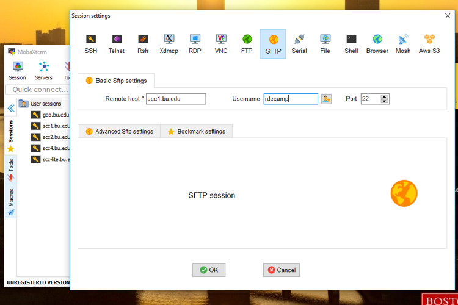
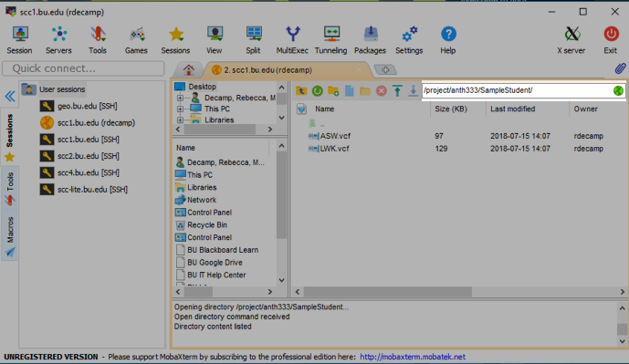
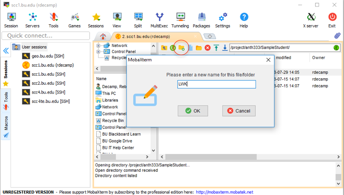
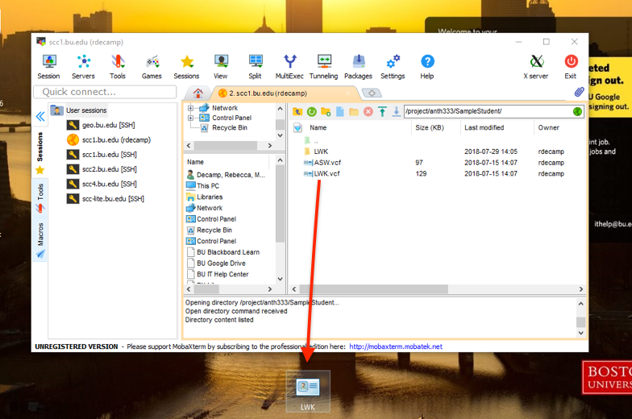
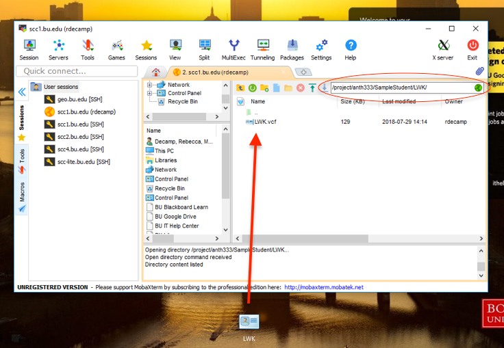

## Introduction to Neutrality Statistics and Signs of Selection
<br>
In this lab, we will look at Neutrality Statistics, which are statistical tests designed to measure if SNPs are being selected for within a population. In this lab, we will go over what each of the statistics are and what they mean, then we will use them on our own data (with the exception of iHS). First, let's get an understanding of what each of these statistics mean when calculated for our populations. 

### Tajima's D
<br>
This is a fairly common neutrality statistic. We read the original paper by Tajima, which detailed the development of his D statistic as a way of testing for the neutral mutation hypothesis (or Kimura's theory of neutral mutation, as we have learned it). Tajima's D tests the neutral theory by testing whether a genetic locus' mutations are neutral, or if there has been selection for/against an allele occurring. The closer to 0 the D statistic is, the closer to neutrality the locus is, meaning there is no environmental seection acting on the population. If the statistic is a negative number, this means the population is experiencing purifying selection at that locus (or selection against a specific allele); Likewise, if the statistic is positive, this means that the population is experiencing positive selection at the locus (selection for an allele). Today we will calculate Tajima's D values for our population in order to determine if any directional selection is happening at the UCP1 locus. 
<br>

### Fu and Li's D and F
<br>
Fu and Li's D and F are fairly straightforward tests tha tare based around the same theta statistic that Tajima's D is. Like Tajima's D, these statistics are also based upon Kimura's neutrality statistic, meaning that anything deviating from 0 is a violation of neutral mutation. Specifically, what these statistics do is measure the number of singletons (number of people within a sample that have a new mutation specific to themselves). While the D test statistic is based on the differences between the number of singletons (mutations appearing only once among the sequences) and the total number of mutations, the F statistic is  based on the differences between the number of singletons
(mutations appearing only once among the sequences) and the average number of
nucleotide differences between pairs of sequences. This renders it possible for one statistic to be positive while the other is negative. We interpret these statistics as so: If the statistics are more negative, this shows an excess of singletons in the population, which could have been derived either by population growth or a selective sweep further back in the population's history. If the statistics are positive, this indicates an excess of old mutations, that have been selected for in the past. We will calculate Fu and Li's D and F statistics for our data today. 

### Integrated Haplotype Score (iHS)
<br>
Recent positive selection usually happens by selective sweeps (i.e. the rapid spread of a particular haplotype, driven by selection for alleles within that haplotype), which not only act upon the SNP that is being selected for, but the entire haplotype that the SNP is contained in. The consequence of this is that the alleles in these haplotypes become almost entirely homozygous because they are being so strongly selected for. An iHS score, or an Integrated Haplotype Score, is a test that is used to measure the amount of recent positive selection an allele has been under by looking for selective sweeps. It does this by identifying extended haplotypes (large sets of SNPs on a single region of the chromosome) and looking at how many homozygous SNPs reside in each haplotype. Mass homozygosity is recorded as a high iHS score, while low levels of homozygosity is recorded as a low iHS score. 

## Learning Outcomes
<br>

* Learn what Fu and Li's D and F, Tajima's D, and iHS scores mean, and how to interpret them. 

* Learn to use the <i>PopGenome</i> package to calculate neutrality stats such as Fu and Li's D and F, and Tajima's D.

* Learn to use the <i>pegas</i> package to explore our Tajima's D statistic further.

* Learn about iHS by looking at an example of how to calculate iHS in R, and reflect on what the iHS score for our population's UCP1 haplotype might look like. 

* Learn about whether or not selection is happening in our populations based on these statistics, and realte it back to what may be happening in the environment to cause these alleles to be selected for/against.

## Part 1: Getting Started
<br>
Log in to the SCC launch RStudio, as per ususal: 
<br>
```{bash, eval = F, echo = T}
#login
ssh -Y username@scc1.bu.edu
```
<br>
```{bash, eval = F, echo = T}
#access your directory and load your R space
cd /project/anth333/yourfilename
module load gcc
module load R
rstudio
```
<br>
Next, we need to install the package <i>PopGenome</i>, because the SCC doesn't have it pre-installed. 
<br>
```{r, eval=F, echo=T}
#We need to install this package
install.packages("PopGenome")
```
<br>
Next, load in the packages we need to use:
<br>
```{r, results='hide', message=F, warning=F}
#Load other packages...
library(vcfR)
library(PopGenome)
library(pegas)
```
<br>
Finally, we need to format our data for analysis. Unfortunately, <i>PopGenome</i> is a bit funky about how they look for the files in your directory, so we need to move some files around in our folders to make our GENOME object. Specifically, we need to make a folder within our personal project folders and put a copy of our data in to that folder. We will do this like so: 

* First, as we have done before, click on "User Sessions" in the sidebar and go to the SFTP tab to log in. 
<br>


<br>

* Second, enter the filepath to your project folder in to the searchbar. 
<br>


<br> 

* Third, click on the 'new folder' icon (circled) and crete a new folder with the name of your population. 
<br>


<br>

* Then, to make a copy of your data, simply drag and drop the data on to the desktop as shown. 
<br>


<br>

* Finally, go in to the new folder you made (either by clicking on it or entering the new filepath in to the search bar, which is circled in the image) and drag and drop the copy of your data from the desktop to your new folder: 
<br>


<br>

And that's it! Now, we can make our GENOME object by directing the function to the folder we just created. Additionally, we will make a DNAbin object (as we have done before) to save for later. 
<br>
```{r}
#Create a GENOME object (replace "YRI" with your own population folder names!!)
YRIgenome <- readData("YRI", format = "VCF")
YRIgenome

#create DNAbin (with YOUR VCF file)
YRI <- read.vcfR("YRI.vcf")
YRIdna <- vcfR2DNAbin(YRI)
YRIdna
```
<br>

## Part 2: Fu and Li's D and F
<br>
The function "neutrality.stats" from <i>PopGenome</i> calculates several different neutrality statistics for a population. Here is where we will calculate Fu and Li's D and F. The execution is fairly straightforward: 

```{r}
#Remember to replace the varible name with your own GENOME object!
neut <- neutrality.stats(YRIgenome)
get.neutrality(neut)

#To see results: 

neut@Fu.Li.F
neut@Fu.Li.D
```
<br>
AS we can see here, YRI has D and F statistics that are very close to 0. This indicates neither an excess of singletons in this population, nor an excess of old mutations. Put simply, the YRI population hasn't evolved much in recent history, which we would expect from an African population. 
<br>
<br>
Before we move on, think about what <b>your</b> results mean, based on how we interpret Fu and Li's D. Is there an excess of singletons? Is there an excess of old mutations? What does that tell you about your population's history? We will come back to this at the end of class. 
<br>

## Part 3: Tajima's D
<br>
Now, we will look at Tajima's D. the "neutrality.stats" package also calcuated our Tajima's D statistic. We can preview Tajima's D from the neutrality.stats function results: 
```{r}
neut@Tajima.D
```
<br>
But, we can get more information than that by using the "tajima.test" function from <i>pegas</i>. This function will use our DNAbin object that we created earlier as an input. It will not only give us the same D statistic as was calculated by the "neutrality.stats" function, but will also give us a P-value for our test, which will tell us how significant our neutrality test results are. 
<br>
```{r}
#remember to replace my example DNAbin with your DNAbin name!
tajima <- tajima.test(YRIdna)
tajima
```
<br>
What we see from YRI is what we would expect; The UCP1 locus in this population is not subject to selection from the environment, therefore the only evolution happening in the population is neutral. 
<br>
<br>
Now, you should interpret your own Tajima's D value. First, compare the D value given by this function and the one given by the neutrality.stats function. Are they the same (they should be)? What is the D statistic for your population, and what does it mean in terms of the selection happening on your population? We will revisit this question at the end of the lab. 
<br>

## Part 4: An Example of iHS With Cows
<br>
Now, we will run our example of iHS. To do this example, I'm using the <i>rehh</i> package, which is a package that specifically looked for "Extended Haplotype Homozygosity," or evidence of selective sweeps. Therefore, we can use this package to look at an example of calculating an iHS score. The example will use the example data that is included with the <i>rehh</i> package, which is genetic data from cows. You can use 1000 Genomes data with this package, but that requires you to map and phase the data with other genomic analysis-specific programs such as SHAPEIT and Beagle. Therefore, we'll just use the example data with cows. But, as we walk through this example, make some predictions about what an iHS score in your population might look like. 
<br>
<br>
The first thing is to pull the example files from the package and create a "haplohh" object, which is the object class the <i>rehh</i> package uses. 
<br>
```{r}
library(rehh)

#puts example files in our working directory
make.example.files()

#read in files as a haplohh object
hap <- data2haplohh(hap_file="bta12_cgu.hap",map_file="map.inp", recode.allele = TRUE, chr.name = 12)
```
<br>
Then, we can run the iHS function. The first line of code looks for the haplotypes within the data, and the second calculates the iHS score for every allele. 
<br>
```{r, warning=FALSE, error=FALSE}
ehh <- scan_hh(hap,limhaplo=2,limehh=0.05,limehhs=0.05,maxgap=NA,threads=1)
head(ehh)

#this will give us a long list of iHS scores that we don't really need to look at, we can just plot. 
ihs <- ihh2ihs(ehh,freqbin=0.025,minmaf=0.05)

```
<br>
Finally, to comprehend what all of the iHS scores are, we can graph our results! The dotted line represents the threshhold of significance of each iHS score. 
<br>
```{r, fig.show='asis'}
ihsplot(ihs, plot.pval=TRUE, ylim.scan=2, pch=16, main="iHS")
```

## Chris, please review this code. I cannot get the graph to show up in the HTML file for the life of me, I don't know if it's a side effect of the function or something I'm doing, but I don't know what else to do to it. 
<br>

What we see here is that there are several SNPs that are above/below the iHS score threshhold. This means that these SNPs exist in the population as massly homozygous, which means there was most likely a selective sweep that happened in the population about 30Mb in to the region we're looking at. 
<br>
<br>
Now think about what an iHS score might look like in your population. Based on what we've discovered today about selection happening in our populations, do you think that a selective sweep may have happened in the UCP1 region for you population? Is there anything that you know about the environment and your population's adaptations to the environment that you can use to aid in your analysis?
<br>

## Part 5: What Do Your Results Mean? Discuss with a partner: 
<br>

As we wrap up this lab, think about the results you generated. You have already been prompted to think about what your results mean as we went through the lab, so now you have the opportunity to talk to a partner about what you think your results mean. I'll reiterate the questions I asked here: 
<br> 

* Think about what your results mean, based on how we interpret Fu and Li's D. Is there an excess of singletons? Is there an excess of old mutations? What does that tell you about your population's history? 

* What is the Tajima's D statistic and accompanying P-value for your population, and what does it mean in terms of the selection happening on your population?

* What do you think an iHS score might look like for your data? Based on what we've discovered today about selection happening in our populations, do you think that a selective sweep may have happened in the UCP1 region for you population? Is there anything that you know about the environment and your population's adaptations to the environment that you can use to aid in your analysis?
