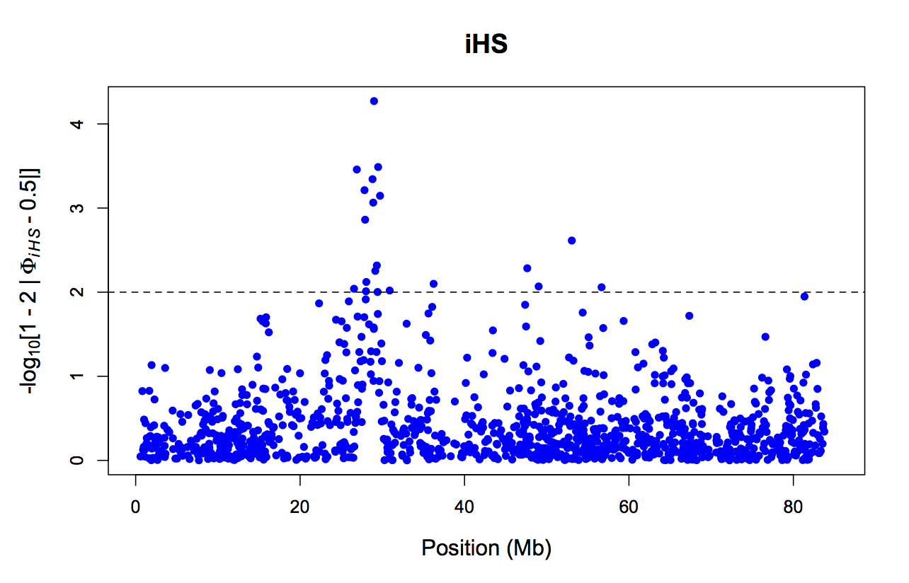
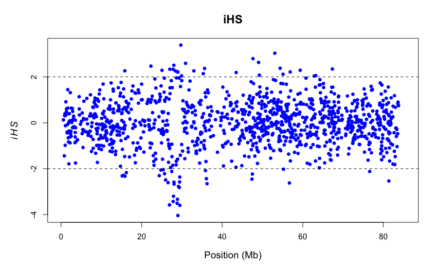
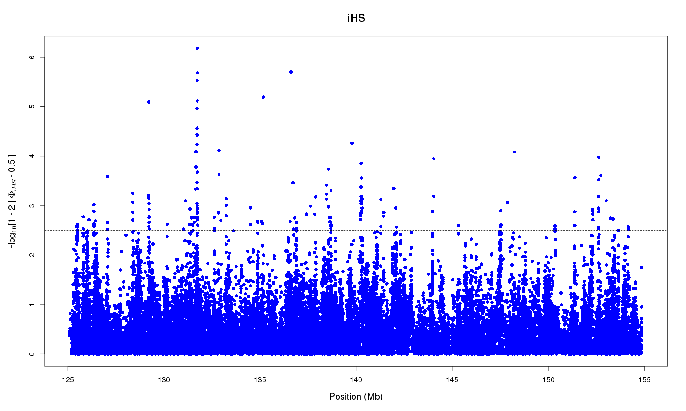
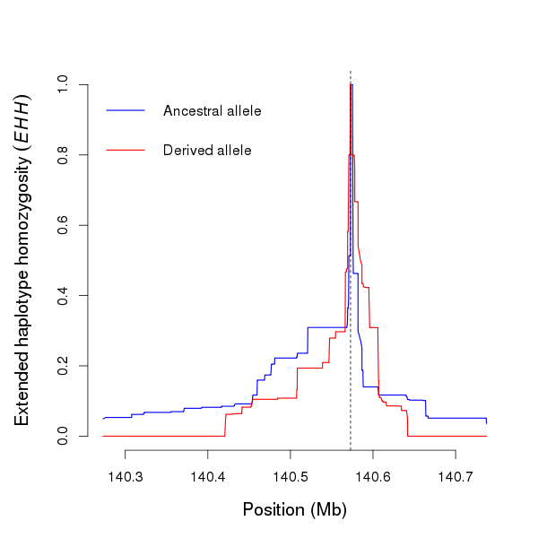
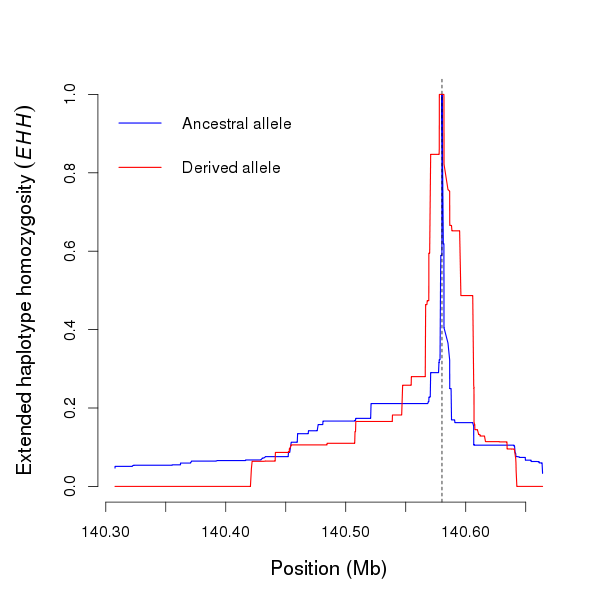

## Introduction to Neutrality Statistics and Signs of Selection

***

###[Homework for Lab 5: DUE Friday, November 9th](https://fuzzyatelin.github.io/AN333_Fall18/Lab5_Homework.html)

***

**Readings**:<ul> 
<li>[Garrigan DR, Lewontin R, Wakeley J. 2010. Measuring the sensitivity of single-locus “neutrality tests” using a direct perturbation approach. *Mol Biol Evol* 27(1): 73-89.](https://academic.oup.com/mbe/article/27/1/73/1125718)</li><br>
<li>[Southam L, Soranzo N, Montgomery SB, Frayling TM, McCarthy MI, Barroso I, Zeggini E. 2009. Is the thrifty genotype hypothesis supported by evidence based on confirmed type 2 diabetes- and obesity-susceptibility variants? *Diabetologia* 52: 1846-1851.](https://link.springer.com/article/10.1007%2Fs00125-009-1419-3)</li><br>
<li>[Tajima F. 1989. Statistical method for testing the neutral mutation hypothesis by DNA polymorphism. *Genetics* 123(3): 585–595.](http://www.genetics.org/content/123/3/585)</li></ul>

***

In this lab, we we'll take our first look at *neutrality statistics*, which are statistical tests designed to measure if whether SNPs appear to be undergoing selection within a population. We'll go over what each of the statistics are, what they mean, and how to interpret them, and then we'll use them on our own data (with the exception of our final statistic, *iHS*, which is for whole sequence data, not variant calls).
<br>
<br>
First, let's get an understanding of what each of these statistics might mean when calculated for our populations...

### Tajima's D
This is a fairly common neutrality statistic. For this lab, we've read the [original paper by Tajima](), which details the development of his D statistic as a way of testing for the *neutral mutation hypothesis* (or Kimura's theory of neutral mutation, as we've discussed it in class). Tajima's D tests whether the pattern of mutations found in a particular region of the genome in a population is following the assumptions of neutrality models; in other words, if there has been selection for or against a particular allele in the population, the pattern seen will *violate* the assumptions of the neutral model.
<br>
<br>
With Tajima's D, the closer to 0 the D statistic is, the closer the locus being tested is to meeting the assumptions of neutrality. In other words, when D is close to 0 there are no alleles over- or under-represented at that locus across the population, suggesting that selection is *not* acting on that locus in the population. If the D statistic is a negative number, this means the population is experiencing *purifying* or *negative* selection against an allele at that locus. Conversely, if the D statistic is positive, this means that the population is experiencing *positive* selection at the locus.<br><br> Today, we'll calculate Tajima's D values for *our* populations in order to determine if any directional selection is happening at the *UCP1* locus. 
<br>

### Fu and Li's D and F

Fu and Li's D and F are also fairly straightforward tests derived from the same $\Theta$ statistics as Tajima's D. Like Tajima's D, these statistics are also based upon Kimura's neutrality statistic, again meaning that anything deviating from 0 is a violation of neutrality. What these statistics do, specifically, is measure the number of *singleton* or *private* mutations (i.e., the number of people within a sample that have a novel mutation specific to themselves). While the *D statistic* is based on the difference between the number of singletons in the population and the *total number of mutations in population*, the *F statistic* is based on the difference between the number of singletons and the *average number of nucleotide differences between pairs of sequences*. This difference in how they're derived makes it possible for one statistic to be positive while the other is negative in the same population.<br><br>
We can interpret these statistics like so:

* If the statistics are strongly negative, this shows an *excess of singletons* in the population. This means there are quite a few people whose genomic variants don't match each other. Such a situation could be from rapid population growth (meaning everyone is closely related and so there's been no time for mutation to catch up to the increased numbers) or a *selective sweep* (see below for a formal definition) further back in the population's history, meaning that strong directional selection for a certain mutation led to an overrepresentation of that mutation (at the expense of other variants at that SNP).

* If the statistics are positive, this indicates an *excess of old/ancestral variants*, that have been selected for in the past. In other words, there are very few unique variants, and the variants that are present are carried by a lot of individuals.
<br><br>

We will calculate Fu and Li's D and F statistics for our data today. 

### Integrated Haplotype Score (iHS)

Recent positive selection usually happens by *selective sweeps* (i.e. the rapid spread of a particular haplotype, driven by selection for particular alleles within that haplotype), which not only act upon the SNP that corresponds to the phenotype under selection, but the *entire haplotype* or *linkage region* in which that SNP is found. When this happens, the alleles in these selected haplotypes become almost entirely homozygous, because selection on this region of the genome is so strong. An *iHS score*, or an *Integrated Haplotype Score*, is a test that can be used to measure the amount of recent positive selection experienced by an allele indirectly by looking for evidence of selective sweeps. This test identifies *extended haplotypes* (large sets of SNPs on a single region of the chromosome) and looking at how many of the SNPs are homozygous in each haplotype. Mass homozygosity in a particular haplotype is recorded as a *high* iHS score, while low levels of homozygosity is recorded as a *low* iHS score.<br> 

## Learning Outcomes

* Learn what Fu and Li's D and F, Tajima's D, and iHS scores mean, and how to interpret them. 

* Learn to use the *PopGenome* package to calculate neutrality statistics such as Fu and Li's D and F, and Tajima's D.

* Learn to use the *pegas* package to explore our Tajima's D statistic further.

* Learn about iHS by working through an example of how to calculate iHS in *R*, and reflect on what the iHS score for our population's *UCP1* haplotype might look like. 

* Learn about whether or not selection is happening in our populations based on these statistics, and relate it to environments that may cause these alleles in *UCP1* to be selected for or against.

## Part 1: Getting Started

Log in to the *SCC* and bring up the *R Studio* window [as usual](https://fuzzyatelin.github.io/AN333_Fall18/Lab_2_-_HWE.html): 
```{bash, eval = F, echo = T}
module load gcc
module load R
rstudio &
```

Next, we need to install the package *PopGenome* in our *R Studio* space, because the SCC doesn't have it pre-installed.
```{r, eval=F, echo=T}
#We need to install this package
install.packages("PopGenome")
```

Next, load in the packages we need to use:
```{r, results='hide', message=F, warning=F}
library(vcfR)
library(PopGenome)
library(pegas)
```

Finally, we need to format our data for analysis. *PopGenome* is a bit funky about how they look for the files in your directory, so we need to move some files around in our folders to make the *GENOME* object that the *PopGenome* package will work with. Specifically, if you haven't already done so, we need to make a new directory within our working directory, and put a copy of our data into that folder. Do this in your *SCC* space using the *mkdir* and *cp* commands (remember to use *your* population name rather than YRI!):
```{bash, eval = F, echo = T}
mkdir YRI
cp YRI.vcf YRI/YRI.vcf
```

Now, we can make our *GENOME* object by directing the function to the folder we just created. Additionally, we'll make a *DNAbin* object ([as we have done before](https://fuzzyatelin.github.io/AN333_Fall18/Lab4-Phylogeny.html)) to save for later... 
<br>
Here we'll make our *GENOME* object:
```{r}
YRIgenome <- readData("YRI", format = "VCF")
YRIgenome
```

And here we'll make our *DNAbin* object:
```{r}
YRI <- read.vcfR("YRI/YRI.vcf")
YRIdna <- vcfR2DNAbin(YRI)
YRIdna
```

## Part 2: Fu and Li's D and F

The function `neutrality.stats` from *PopGenome* conveniently calculates several different neutrality statistics for a given population. We'll use it now to calculate Fu and Li's D and F: 

```{r}
#Remember to replace the varible name with your own GENOME object!
neut <- neutrality.stats(YRIgenome)
get.neutrality(neut)

#To see results: 

neut@Fu.Li.F
neut@Fu.Li.D
```

As we can see here, the YRI population has D and F statistics that are pretty close to 0. This suggests neither an excess of singleton mutations in this population, nor an excess of ancestral mutations. Put simply, the *UCP1* region in the Yoruban population from Ibadan hasn't evolved much in recent history, which we might expect from an African population with little experience with extreme cold temperatures. 
<br>
<br>
Before we move on, think about what the results for *your* population means, based on how we interpret Fu and Li's D. Is there an excess of singletons? Is there an excess of old/ancestral mutations? What does that tell you about *your* population's history? We will come back to this at the end of class. 
<br>

## Part 3: Tajima's D

Now we'll look at Tajima's D! When we ran the `neutrality.stats` function in *PopGenome*, it also calcuated our Tajima's D statistic. We can *preview* our Tajima's D results from the *PopGenome* output... 
```{r}
neut@Tajima.D
```

But, we can get more useful information by using the `tajima.test` function in the *pegas* package. This function will use the *DNAbin* object that we created earlier as an input. It will not only give us the same D statistic as was calculated by the `neutrality.stats` function, which is all well and good, but will also give us a *P-value* associated with our test. This is important, because it will give us a sense of how significant the results are of our neutrality test. 
<br>
```{r}
tajima <- tajima.test(YRIdna)
tajima
```

What we see from YRI is, again, what we might expect from a population that has been living in a warm climate for many generations: the *UCP1* locus in this population does not appear to be subject to selection. This suggests that the only *evolution* (remember, that's a change in allele frequencies over generations, and does *not* have to be due to selection) happening in the population is selectively neutral. 
<br>
<br>
Interpret your own population's Tajima's D value. First, compare the D value given by this function and the one given by the `neutrality.stats` function. Are they the same? What is the D statistic for your population, and what does it mean in terms of whether and what kind of selection might be occuring on your population? We will revisit this question at the end of the lab.

## Part 4: An Example of iHS... with Cows
<br><center>

</center><br>

Now, we will run our example of *iHS*. To run this example, I'm using the *rehh* package, which is specifically designed to look for *Extended Haplotype Homozygosity*, or evidence of selective sweeps. We can use this package to look at an example of calculating an iHS score. For a fun digression from human data, the genomic dataset included in the *rehh* package is from cows! You *can* use 1000 Genomes Project data with this package, but that requires you to map and *phase* the data with other genomic analysis-specific programs such as *SHAPEIT* and *Beagle*... that's a bit more than we're ready to do. Sooo... we'll just use the cows. If you'd like to learn more about the cow genome, [you can read about (and query) the cow genome here](bovinegenome.org/). You can also find the cow genome on *Ensembl*, but it's unfortunately not yet annotated there (meaning we cannot yet *easily* make the connection between a chromosomal location and the genes it contains that are similar to those of humans). Even though our example population is a bit more bovine than usual, as we walk through this example, make some predictions about what an iHS score in *your* population might look like. 
<br>
<br>
The first thing we'll do is pull the example files from the package and create a *haplohh* object, which is what the *rehh* package reads for analyses: 

```{r,eval=F,echo=T,message=F}
install.packages("rehh")
```
```{r,message=F}
library(rehh)
```
```{r,eval = F, echo = T}
#puts example files in our working directory
make.example.files()
```
```{r}
#read in files as a haplohh object
hap <- data2haplohh(hap_file="bta12_cgu.hap",map_file="map.inp", recode.allele = TRUE, chr.name = 12)
```

Once this is done, we can run the iHS function. The first line of code looks for the haplotypes within the data, and the second calculates the iHS score for every allele:

```{r, warning=FALSE, error=FALSE}
ehh <- scan_hh(hap,limhaplo=2,limehh=0.05,limehhs=0.05,maxgap=NA,threads=1)
head(ehh)

#this will give us a long list of iHS scores... why read the list when we can just plot it?!
ihs <- ihh2ihs(ehh,freqbin=0.025,minmaf=0.05)
```

Finally, to take in the entirety of our iHS scores, we'll graph our results! The dotted line represents the *threshhold of significance* of each iHS score: 
```{r}
ihsplot(ihs, plot.pval=TRUE, ylim.scan=2, pch=16, main="iHS")
```



What we're seeing here are two plots representing a map of cow chromosome 12 (which is homologous to human chromosome 13), demarcated on the x-axis by chromosomal positions of SNPs (the ticks on the x-axis are every 20 Mb, or mega-bases, or 20-million-base increments; cow chromosome 12 is a little over 91 Mb long). The y-axis of the first graph is, more or less, the absolute value of the calculated iHS scores; the second is the untransformed value of iHS across the chromosome. The format of these plots is called a *Manhattan plot*, because the peaks and valleys of the data as you scan across the chromosome look a bit like the skyline of Manhattan.
<br><br>
You can see that that there are several SNPs that are above/below the iHS score significance threshhold, particularly around 30 Mb along chromosome 12. This means that these SNPs exist in the population as part of massively homozygous blocks in this region of the cow genome, which means there was most likely a selective sweep that happened in this population on a phenotype coded by an allele (or multiple alleles) located in this block 30Mb along chromosome 12! Cows have, in the past, apparently adapted to *some* selective pressure that has acted to maintain homozygosity across the population in this region of their genome. To discover what it is, we'd have to see what genes are in this homozygous haplotype block, but without annotation it's a bit too difficult for us to manage in this course. If this were the human genome, we would simply go to *Ensembl* and query this position range and see what gene regions are contained therein. These genes would then be *candidate genes* for understanding what selective force has been acting on which phenotype.
<br>
<br>
Now think about what an iHS score might look like in your population. Based on what we've discovered today about inferring selection in our populations, do you think that a selective sweep may have happened in the *UCP1* region of *your* population? Is there anything that you know about the environment and your population's potential adaptations to that environment that you can use to aid in your analysis?

## Part 5: What Do Your Results Mean? Discuss with a partner from class:

As we wrap up this lab, think about the results you've generated. You have already been prompted to think about what your results might mean as we've gone along; now you have the opportunity to talk to a partner about what you think your results might mean.

* Think about what your results mean, based on how we interpret Fu and Li's D. Is there an excess of singletons in your population? Is there an excess of old/ancestral mutations? What might that tell you about your population's history? 

* What is the Tajima's D statistic and accompanying P-value for your population, and what does that mean regarding potential selection happening on your population?

* What do you think an iHS score might look like for your data, based on the other results you've generated? Based on what we've discovered today about selection happening in our populations, do you think that a selective sweep may have happened in the *UCP1* region for you population? Is there anything that you know about the environment and your population's adaptations to the environment that you can use to aid in your analysis?
<br>
<br>
<br>
<br>
<br>
<br>

##Pro-Tip: How to run an iHS analysis on *1000 Genomes Project* Data

If you *really* want to run an iHS analysis on *1000 Genomes Project* data, you can... you just need to convert the VCF file for a broader genomic region surrounding your gene of interest into a haplotype file. This is relatively simple to do, but it involves using some unfamiliar *python* and *unix* code and some data transformations. It also can take *a lot* of memory, so I'll ask you to delete files along the way as you try this out. To demonstrate, let's try running an iHS analysis on a portion of human chromosome 4 to see if we can find evidence of a positive selective sweep around and related to *UCP1*.

We'll first need to download a larger chunk of chromosome 4 than we had previously. We *could* do this on the entire chromosome, as we did for the cow, but this would take up a *way* over our class' storage allotment on the *SCC*. Instead, let's pick a relatively large chunk - about 30 Mb - of chromosome 4 surrounding *UCP1*.

To cut down on data size, let's also restrict this dataset to a population where we might expect to see selection around *UCP1*, perhaps a population that's been living in the cold, like the Finns!

To do this, we'll first need to load our *modules*. This will include *tabix* to download the data, and *vcftools* to modify it. We'll also need to load the programming language *python* for a few short commands later:

```{bash, eval = F, echo = T}
module load tabix
module load vcftools
module load python
```

Next, we'll download our *1000 Genomes Project* population panel file and create an isolated list of the FIN samples so that we can subset our data file:
```{bash, eval = F, echo = T}
#download the population panel file:
wget ftp://ftp.1000genomes.ebi.ac.uk/vol1/ftp/release/20130502/integrated_call_samples_v3.20130502.ALL.panel

#get a list of sample IDs for the FIN population:
grep FIN integrated_call_samples_v3.20130502.ALL.panel | cut -f1 > FIN.samples.list
```

Now, to save on space, we'll download our extended positions (roughly 15 Mb above and below my gene of interest, *UCP1*) from chromosome 4 into a zipped file using a familiar *tabix* command:
```{bash, eval = F, echo = T}
tabix -h ftp://ftp.1000genomes.ebi.ac.uk/vol1/ftp/release/20130502/supporting/GRCh38_positions/ALL.chr4_GRCh38.genotypes.20170504.vcf.gz 4:125000000-155000000 | bgzip -c > CH4_All.vcf.gz
```

Then, we'll subset the zipped file for *just* the FIN data with a familiar *vcftools* command. While we're at it, we'll also filter out all indels and SNPs with a MAF lower than 5%:
```{bash, eval = F, echo = T}
vcftools --gzvcf CH4_All.vcf.gz --keep FIN.samples.list --maf 0.05 --remove-indels --recode-INFO AA --recode --stdout | bgzip -c > FIN_CH4.vcf.gz
```

Running the above code took about 10 minutes, because we're actually filtering 99 individuals from 2504 while also filtering down 62,551 SNPs!!! That's a *huge* amount of data compared to what we've been working with so far.

To make sure everything worked appropriately, check out the final file (so far) using the `less` command (press 'q' when you're done):
```{bash, eval = F, echo = T}
gunzip -c FIN_CH4.vcf.gz | less
```

Given your data looks good, now let's erase the larger file with all the *1000 Genomes Project* individuals, along with other files we're done with:
```{bash, eval = F, echo = T}
rm CH4_All.vcf.gz
rm integrated_call_samples_v3.20130502.ALL.panel
rm FIN.samples.list
```

Now we're ready to convert this into a haplotype file and a genome map file for {rehh} using a few relatively unfamiliar steps... these are modified from the [Informatics Portal website](https://csprojects.me/481/tools.php). 

First, we'll extract our INFO on ancestral alleles:
```{bash, eval = F, echo = T}
vcftools --gzvcf FIN_CH4.vcf.gz --get-INFO AA
```

I have to note that this step is - conceptually - a little complicated because the way the *1000 Genomes Project* estimates the ancestral allele at a position is a bit different what folks usually think about an ancestral allele (i.e., the allele state of the LCA of the groups you're testing). You don't have to worry about it, for now, but [you can learn more about it here](https://www.biostars.org/p/61267/).

Next, we'll change lower- to upper-case letters in our INFO file:
```{bash, eval = F, echo = T}
cat out.INFO | tr '[:lower:]' '[:upper:]' > out2.INFO
```

Export the VCF file in IMPUTE format:
```{bash, eval = F, echo = T}
vcftools --gzvcf FIN_CH4.vcf.gz --IMPUTE
```

Delete the first row in our INFO file and replace tabs for spaces:
```{bash, eval = F, echo = T}
more +2 out2.INFO | awk '{if($3==$5) print$0,"yes";if($3!=$5) print$0,"no";}' | sed -e 's/\t/ /g' > out3.INFO
```

OK, so there's a problem here in that IMPUTE is deleting a few loci from the sample. We need to use the 'join' command to merge the properly matched columns based on position (column 2 in out3.INFO and column 2 in out.impute.legend), which will automatically then delete non-matches in the output file (both files need to be sorted by the position name for this to work):
```{bash, eval = F, echo = T}
join -j 2 -o 1.1,1.2,1.3,1.4,1.5,1.6,1.7,1.8 out3.INFO <(sort -k2 out.impute.legend) > out4.INFO
```

Merge info file and impute our `hap` file, eliminate from merged file markers with no ancestral allele info (".") or ("N") or ("-"):
```{bash, eval = F, echo = T}
paste out4.INFO out.impute.hap | awk '($5!="." && $5!="N" && $5!="-")' > merged.out
```

Change the allele codes (0 to 3 and 1 to 4) starting in column 7, and remove potential duplicates:
```{bash, eval = F, echo = T}
awk '{for(i=7;i<=NF;i++)if($i==0)$i=3; else $i=4; print}' merged.out | awk '{if(ip[$2]=="") print; ip [$2]=1}' > merged2.out
```

```{bash, eval = F, echo = T}
# prepare rehh map file using information from the first 2 columns
awk '{print $1"-"$2,$1,$2,"1","2"}' merged2.out > mapFIN_CH4.out

#change label 3 to 1 when reference allele = ancestral allele (yes)
#change label 4 to 2 when reference allele = ancestral allele (yes)
#change label 3 to 2 when reference allele = derived allele (no)
#change label 4 to 1 when reference allele = derived allele (no)
#eliminate 6 initial fields in hap file to prepare rehh input hap file

sed -e '/yes/ s/3/1/g' -e '/yes/ s/4/2/g' -e '/no/ s/3/2/g' -e '/no/ s/4/1/g' merged2.out | cut -d " " -f7-  > merged3.out
```

Transpose to create final haplotype file for {rehh} input:
```{bash, eval = F, echo = T}
python -c "import sys; print('\n'.join(' '.join(c) for c in zip(*(l.split() for l in sys.stdin.readlines() if l.strip()))))" < merged3.out > merged4.out
```

Add first column with numbers in increasing order:
```{bash, eval = F, echo = T}
awk '{print NR " "$0}' merged4.out > hapFIN_CH4.out
```

Remove intermediate files:
```{bash, eval = F, echo = T}
rm merged.out
rm merged2.out
rm merged3.out
rm merged4.out
rm out.INFO
rm out.impute.hap
rm out.impute.hap.indv
rm out.log
rm out2.INFO
rm out3.INFO
rm out4.INFO
```

After this whole process, the files `mapCH4_FIN.out` and `hapCH4_FIN.out` are the input files for our {rehh} analysis!

Ok... now let's try it!

```{bash, eval = F, echo = T}
module load gcc
module load R
rstudio &
```

Once you're in R, let's get going! Load the {rehh} library (if it isn't already):
```{r,eval = F, echo = T}
library(rehh)
```

Then, we need to import our newly made files for the Finns:
```{r,eval = F, echo = T}
hap<-data2haplohh(hap_file="hapFIN_CH4.out",map_file="mapFIN_CH4.out", recode.allele = TRUE, chr.name = 4)
```

Once those are read in, you should see that our dataset consists of 62510 SNPs split into 198 haplotypes.

Now we can run our extended haplotype homozygosity assessment (this step might take a while, be patient):
```{r,eval = F, echo = T}
ehh<-scan_hh(hap,limhaplo=2,limehh=0.05,limehhs=0.05,maxgap=NA,threads=1)
```

Retrieve our iHS scores:
```{r,eval = F, echo = T}
ihs <- ihh2ihs(ehh,freqbin=0.025,minmaf=0.05)
```

And plot them:
```{r,eval = F, echo = T}
ihsplot(ihs, plot.pval=TRUE, ylim.scan=2.5, pch=16, main="iHS")
```



As you can see, we've got a few potential regions where there might be selective sweeps in this part of the genome. There maybe appears to be one or two around the position of *UCP1* (~140.5 Mb)... let's take a closer look at an actual *SNP* of interest.

In a recent study in Japan by [Nishimura et al. (2017)](https://www.ncbi.nlm.nih.gov/pmc/articles/PMC5514118/), researchers found that human subjects placed in a cold room for almost two hours showed significant differences in oxygen consumption (metabolism) and increased non-shivering thermogenesis based on having a derived allele (T/**C**) at a locus in a downstream regulator of *UCP1* expression (located −3826 bp from the gene itself) at [rs1800592](https://www.snpedia.com/index.php/Rs1800592), which is also implicated, in other studies, with obesity and diabetes mellitus.

We can investigate whether the derived version of this SNP is showing greater extended haplotype homozygosity compared to the ancestral version, which would imply a positive selective sweep on that particular SNP. To actually analyze the SNP, we need to check its position on *Ensembl* (for rs1800592, it's 140572807). Once we've done that, we need to find what number (as in first, second, third, etc) that SNP is in our haplotype file...

This seems complicated, but it's actually pretty simple. You first need to download your `out.impute.legend` file to your desktop, and then *Import* it into *Excel* as a text file with spaces as the delimiters. Once that's done, you can insert a new column, *Fill* it with a *Series* that increases by one from the first to last SNP, and then you've got each SNP marked in numerical order. All you have to do then is *Find* your SNP name. Once you've got the number, enter it into the `mrk`; in this case, rs1800592 is the 36,102 variant in our file):
```{r,eval = F, echo = T}
res.ehh<-calc_ehh(hap,mrk=36102)
```



We can see here that there doesn't seem to be a very clear, extensive difference between the EHH of the ancestral allele vs. the derived, suggesting that no evident selection for this particular enhancer SNP has occurred in the Finnish population. BUT the paper also mentioned that there was significant linkage (LD = 1) between rs1800592 and another SNP of interest, rs4956451. Just to be thorough, let's check out the EHH for this SNP, as well. Remember, if a phenotypic effect is associated with a SNP, but that SNP is in perfect linkage with another, it might actually be the *other* SNP that's controlling the phenotype:
```{r,eval = F, echo = T}
res.ehh<-calc_ehh(hap,mrk=36131)
```



Ok, it *does* look like there is extended haplotype homozygosity in the derived allele compared to the ancestral (notice how the red line is consistently higher than the blue around our SNP?) for rs4956451, suggesting positive selection for this SNP in the Finns! In other words, it's possible that Finns adapted to their cold environment, in part, through an increased derived allele frequency at this SNP, which is an enhancer locus that increases expression of *UCP1*!

You can also, with {rehh} compare haplotype homozygosity *between* two different populations, to see if a particular genomic region or SNP has been under differential selection between them (e.g., between Finns and Yorubans). However, that's getting a bit more avdanced than we'll get for this lab!

If you're interested, you can learn more about these other options by reading through the [{rehh} vignette here](https://cran.r-project.org/web/packages/rehh/vignettes/rehh.pdf).
<br>
<br>
<br>