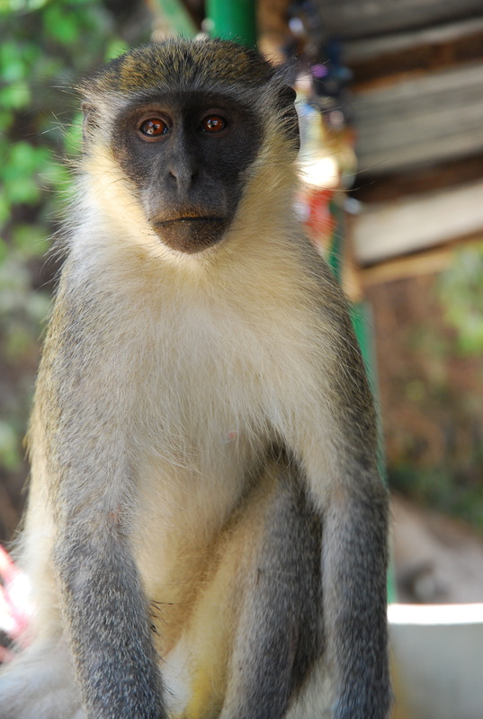
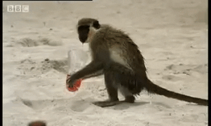
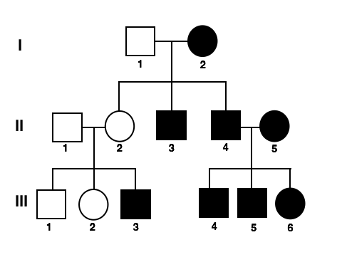
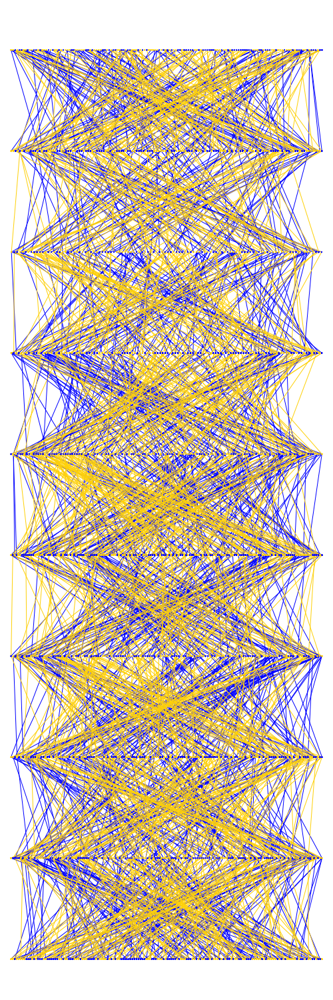
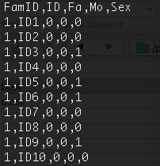
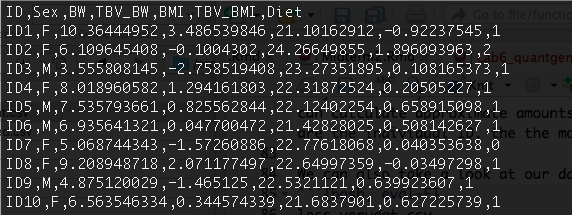
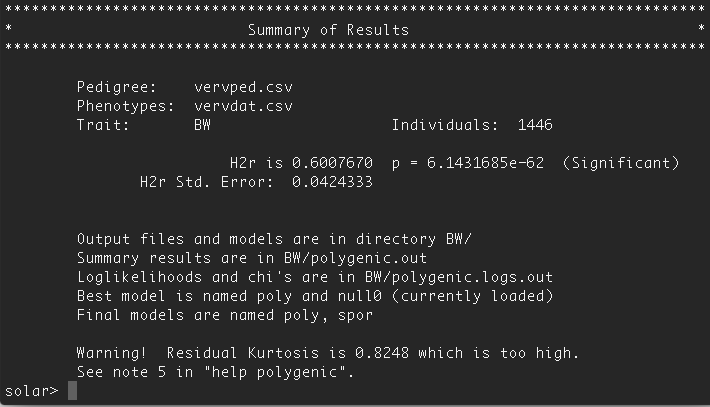
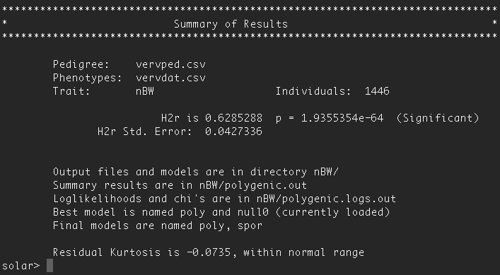
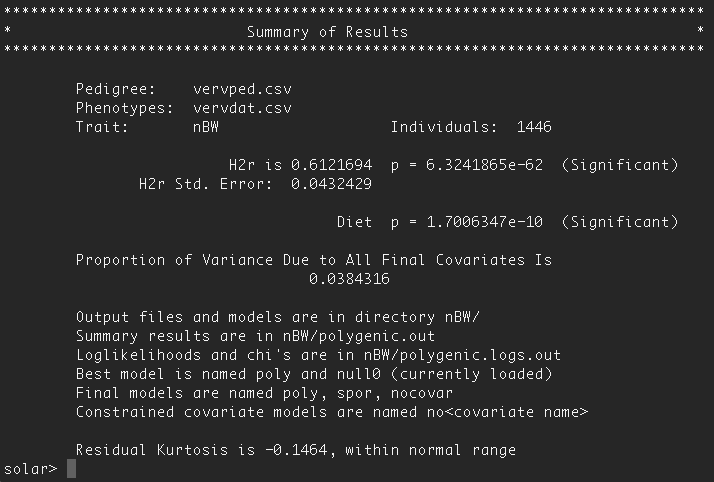

##A Brief Digression from *UCP1* for Quantitative Genetics

***

**Readings**:<ul> 
<li>[Almasy L, Blangero J. 2010. Variance component methods for analysis of complex phenotypes *Cold Spring Harbor Protocols* 2010(5): pdb.top77.](https://www.ncbi.nlm.nih.gov/pmc/articles/PMC3064490/pdf/nihms253587.pdf)</li><br>
<li>[Schmitt CA, Service S, Cantor RM, Jasinska AJ, Jorgensen MJ, Kaplan JR, and Freimer NB. 2018. High heritability of obesity and obesogenic growth are both highly heritable and modified by diet in a nonhuman primate model, the African green monkey (*Chlorocebus aethiops sabaeus*). *Int J Obesity* 42: 765-774.](https://www.nature.com/articles/ijo2017301)</li><br>
<li>[Hill WG. 2012. Quantitative genetics in the genomics era. *Curr Genomics* 13(3): 196-206.](https://www.ncbi.nlm.nih.gov/pmc/articles/PMC3382274/pdf/CG-13-196.pdf)</li></ul>

***

###[Homework for Lab 6: DUE Friday, November 30th](https://fuzzyatelin.github.io/AN333_Fall18/Lab6_Homework.html)

***

In this lab, we'll take a VERY brief look at the practicalities of running a quantitative genetics analysis of *variance decomposition*. In other words, we'll look at a quantitative trait and figure out how much of the variation in that trait can be attributed to *narrow sense* heritability, and how much from environmental factors.  We'll also take a look at a few important environmental *covariates* and see how including them can change our estimates.

##Part 1: Vervets of the Caribbean

For today's lab, metrics of obesity like body mass and BMI will be from simulated measurements from a wild population of vervet monkeys (*Chlorocebus sabaeus*):<br><br>
<center>

</center><br><br>
Imagine you are a primatologist, and we're collaborators working with a wild population of vervet monkeys that's been studied for the past 50 years on the Caribbean island of St. Kitts.
<br><br>

<br><br>
These Caribbean monkeys were brought over the Atlantic about 400 years ago from West Africa as either pets or food. A small amount of vervets were either set free or escaped, found the island to be fairly hospitable, and reproduced. A lot. There are now thousands of vervets running around on the island, where they're perhaps most famous for stealing the alcoholic beverages of tourists. <br><br>

<center>

</center><br><br>

Our study population has been living on a sugar cane farm further north on the island, in a group numbering anywhere from 100 to 200 animals at any given time. In that population, researchers have been trapping and measuring vervet monkeys every 5 years since the project began in 1968, leading to a comprehensive dataset of almost 1500 animals! While trapped, researchers have been consistently measuring both the monkeys' body weight (BW) and body-mass index (BMI), two clinical traits that are strongly associated with obesity.

According to the [Schmitt et al. (2018)](https://www.nature.com/articles/ijo2017301) study you've been assigned, are BW and BMI strongly heritable in vervets? How high is the *narrow sense* heritability for these traits in the captive vervet population? How much environmental variance is there?

##Part 2: Understanding the Vervet Data

We researchers on the farm have been collecting excellent breeding and genetic data on the vervets, as well as behavioral data. All mothers for the past 50 years have been successfully associated with their offspring, and all fathers established by microsatellite-based paternity assessment. From this data, our group have been able to put together a comprehensive pedigree.

Now, in high school and university biology courses, we're used to seeing simple family pedigrees in which we can see lines of relatedness leading from male (square) and female (circle) parents to their offspring. This allows us to estimate that the children's genomes are about 50% IBD to each parent, and then grandchildren about 25% IBD to grandparents. Here's a simple pedigree, as an example:

<br>
<center>

</center><br>

Now, here's the pedigree we're able to build for the nearly 1500 wild vervets we've sampled (in which blue individuals are males, and blue lines indicate male descent; and gold individuals are females and gold lines indicate female descent):

<br>
<center>

</center>
<br>
A little more complicated looking, no?  Even given this complex pedigree, we can still use the relatedness values as a proxy for shared genetic ancestry, or IBD (instead of sequencing the whole genome directly), and in so doing use the pedigree to estimate the amount of additive genetic variance contributing to the heritability of the traits of interest we've measured over the years.

As we know, however, genetic variance isn't all we need to be concerned about in a quantitative genetics analysis; we also need to estimate *environmental* variance. Now, we already know from studies in humans and other animals that obesity-related traits like BMI and body mass, can be influenced by quite a few environmental factors. Of these, diet may be the most important.

In our St. Kitts population there are three potential covariates for diet. Some monkeys were clever and figured out how to sneak through a guarded area of the farm where the farmers store harvested maize and sugar cane, and also where the dump is for food scraps, all of which which is very calorie-rich (these monkeys are coded in the *Diet* variable as '2'). Most of the monkeys were able to occasionally raid the farm and had occasional access to human foods (coded as '1' in the *Diet* covariate). Finally, there are some monkeys who, because of their place in the social hierarchy of the group, are kept at the outskirts of the population. These monkeys are forced to forage only on the forested slopes of the mountain near the farm, and eat only natural forage without any crops (coded as '0' in the *Diet* covariate). These are coded on an increasing basis with the increased availability of human foods because increased access to these foods is very often associated with obesity in humans.

##Part 3: Setting Up *SOLAR-Eclipse* for the Vervet Analysis

How much of the variation in body weight and BMI for the monkeys on St. Kitts genetic?  How much is based on environmental covariates like diet?

Here's where we come in!  We're going to use an analytical program called [*SOLAR-Eclipse*](http://solar-eclipse-genetics.org/index.html) (which is really good at handling messy pedigrees like the vervets') to conduct a variance components quantitative genetics analysis in the VRC to better understand how much of the colony-wide variance in average adult body weight is controlled by additive genetic variance (on other words, by differences in allele frequencies across the genome), and how much is controlled by environmental covariates (like diet).

The first thing we need to do is log in to the *SCC*, and then navigate to the *anth333* project directory, where there's a folder called *vervet*:

```{bash,eval=F}
cd /project/anth333/vervet/
```

Once there, copy both the files from the vervet folder to your personal folder in the project directory. These files include the wild vervet pedigree, and the population dataset on BW, BMI and the dietary covariate. You can use the following code, as an example (in this case, replace 'filename' with the name of the file, and 'BUID' with *your* BUID, so that the file will be copied to your named folder):

```{bash,eval=F}
cp /project/anth333/vervet/filename /project/anth333/BUID/
```

Before continuing, let's take a look at our vervet data. Use the `less` command to take a look at the pedigree file, `vervped.csv` (remember, you can press 'q' at any time to get back to your prompt):

```{bash, eval=F}
less vervped.csv
```
<br><br>
<center>

</center>
<br><br>
As you can see, we have a few different columns here. *FamID* is to identify separate family structures; in this case, it's all one interbreeding population, so there's only one family ID. *ID* is the unique identifier for each individual in the population. *Fa* stands for 'father', or 'sire', and is the male parent, while 'Mo' stands for 'mother', or 'dam', and is the female parent. You'll notice that these first ten individuals don't have any sires or dams listed (Fa = '0', Mo = '0'); this is because when we started following this population in 1968, we only knew the adults already in the group... we couldn't find out who their parents were. If you scroll down, you'll see that subsequent generations *do* have known sires and dams.  Finally, we have *Sex*, with '1' indicating males, and '0' indicating females. This looks really simple, but from this file we're able to both construct the complex-looking pedigree diagram you see above, and we can calculate approximate amounts of IBD (all it takes in this case are the individual ID, the the mother's ID, and the father's ID to estimate relatedness and thus estimated proportions of IBD).

We can also take a look at our data file, `vervdat.csv` (remember, you can press 'q' at any time to get back to your prompt):
```{bash, eval=F}
less vervdat.csv
```
<br><br>
<center>

</center>
<br><br>
Here, we can see all the phenotypes and environmental factors measured for each individual. We have *ID* and *Sex*, as in the pedigree (indeed, the phenotypes are matched to the pedigree values through *ID*), the phenotypes *BW* (weight measured in kilograms), and *BMI* (body-mass index, which is the weight in kilograms divided by the square of their crown-to-rump length - or the length from their head to their tail). Finally, there's also the *Diet* covariate mentioned earlier (as you can see, *ID2* was one of the monkeys who was able to sneak access to the high-quality human foods, while *ID7* was relegated to the outskirts of the population and was only able to forage on wild foods). The other two variables listed, *TBV_BW* and *TBV_BMI*, are measures of variance in each trait (you don't need to worry about these).

Once you're familiar with the dataset, we're ready to load *SOLAR-Eclipse*:

```{bash, eval=F}
module load solar-eclipse
solar
```

Now, you'll notice that once you've loaded *SOLAR*, that the prompt has changed to `solar>`. This means that once *SOLAR* is loaded, you can *only* run *SOLAR* commands. If you need to run other commands, you can type `quit` at the prompt to get back to your regular workspace prompt. If you've done that, you'll need to type `solar` once more to reinitiate *SOLAR-Eclipse*.

Once *SOLAR* is loaded, we need to load our pedigree into the *SOLAR* program. This is pretty straightforward:
```{bash, eval=F}
load pedigree vervped.csv
```

You'll be given a warning message about the IBD estimates, don't worry about it!

Then, we'll load our dataset:
```{bash, eval=F}
load phenotypes vervdat.csv
```

Once your data is loaded you're ready to run your first variance components-based quantitative genetic analysis! 

##Part 4: An Example of Variance Decomposition in *SOLAR-Eclipse* using Body Weight 

The *SOLAR* package was written by Laura Almasy and John Blangero, who wrote [this week's reading on variance component analyses](https://www.ncbi.nlm.nih.gov/pmc/articles/PMC3064490/pdf/nihms253587.pdf). You can review their paper (or the related lecture slides on *Blackboard*) to better understand what's going on under the hood of *SOLAR-Eclipse*. As it is, *SOLAR* makes variance decomposition almost startlingly simple to implement...

To demonstrate, let's estimate the narrow-sense heritability of body weight (*BW*) in the vervet population. To do this, we'll run a series of commands that set up our analysis.

First, we'll start a new variance decomposition model:
```{bash, eval=F}
model new
```

Then, we'll define the trait we want to analyze as our dependent variable, or the trait whose variance we want to decompose into genetic and environmental components. In this case, it's *BW*:
```{bash, eval=F}
trait BW
```

For now, let's keep it simple and not include any explicit environmental covariates. We'll simply look for how much variance in BW can be attributed to genetic relatedness based on the pedigree. To run this variance decomposition, all we have to do is enter the command `polygenic`:
```{bash, eval=F}
polygenic
```

Once you enter this command, the analysis will take off on its own. Given the complexity of the pedigree, it may take a few minutes to run completely, but as it runs it will show you various outputs indicating the progress of the analysis. It will estimate a *sporadic model*, which models the variance in BW on its own; *SOLAR* does this because it will then run the model with the IBD estimates from the pedigree and then will see if the inclusion of genetic data *better* explains the variance seen in BW. If it does, it will give you the output of the polygenic model, which will look like this:
<br><br>
<center>

</center>
<br><br>
As you can see, *SOLAR* will show you which 'Pedigree' and 'Phenotype' file you're using, as well as which 'Trait' and how many individuals were included in the analysis. 'H2r' is the estimate of the narrow-sense heritability for this trait given the relatedness/IBD estimates based on the pedigree. For BW, the heritability is **0.6007670**, meaning that about **60%** of the variance seen in BW in the vervet population can be explained by allelic variation! That's a lot, and is in the range observed for human body weight (which is typically between 40% and 70%). This estimate is also highly significantly different (6.14 x 10<sup>-62</sup>) from a null model in which there is no additive genetic variance contributing to the population variance in BW. You can also see that the standard error around our heritability estimate is small (plus or minus 0.0424, or 4.24%). This leaves about **40%** of the variance in BW explained by variation in the environment.

There some more important information here, too. All of our analysis files, for example, are now stored in a directory called 'BW' in our working directory, and these same summary results can be seen in the file 'polygenic.out' in that directory. Our best model is the 'poly', or polygenic model (better than the sporadic model). 

Most importantly for our analysis, though, we can also see that the residual kurtosis for BW in our analysis is too high. This analysis may seem complex, but it's still essentially a linear regression, and like any linear regression the distribution of our dependent variable must be normal...

We can fix this by *transforming* our dependent variable. In this case, we'll *normalize* the variable using a simple function already stored in *SOLAR*:
```{bash, eval=F}
define nBW = inormal_BW
```

Now we've created a new trait variable, called *nBW*, which is the normalized version of BW. Let's run our same, simple polygenic model assessment on this trait:
```{bash, eval=F}
model new
trait nBW
polygenic
```
<br><br>
<center>

</center>
<br><br>
As you can see, normalizing our trait hasn't changed our model much, but has allowed us to assign a bit more variance to the additive genetic component (which is up to almost 63%). This means that now only about 37% of the variance in BW is due to environmental effects.

Our next step towards better understanding the variance in BW will be to account for the proportion explained by the covariate of *Diet*. Remember, from our discussion of variance components in class: a good covariate will *absorb* variance in our trait, giving us a more accurate estimate of how much of our trait variance is due to genetics. In the case of diet, it may absorb some environmental variance (since, for example, animals stuck on the periphery of the population, will be sharing both that environment *and* that diet), and some of the genetic variance (since, for example, it's likely that mothers will teach their daughters how to sneak into the high-quality food area, making that trait consistent among closely related relatives).

To model a covariate, we must define our covariate using the `covariate` command, and modify our `polygenic` command with the options `-screen`, and `-all`. These options ask *SOLAR* to compare models with and without the covariates so that we can assess how significant an effect each covariate might have on the dependent variable. This comparison also allows us to figure out how much environmental variance is absorbed by our covariate, and how much is left as random environmental effects. Let's run the code now:
```{bash, eval=F}
model new
trait nBW
covariate Diet
polygenic -screen -all
```
<br><br>
<center>

</center>
<br><br>
As you can see, our *Diet* variable *is* significantly contributing to the variance in BW! The inclusion of *Diet* has also not much changed our heritability estimate, which has dropped about 1%, suggesting that variance was absorbed by our dietary covariate. Indeed, only about 3.84% of the variance in BW is due to the variation seen in diet, and since the heritability didn't change much, that variance must have primarily been absorbed from the random environmental variance.

How do we interpret these changes? Why does our estimate of heritability go down when we include our dietary covariate? Does that mean our first estimate of heritability was wrong? Why?

***Run a variance decomposition analysis for BMI on your own, including both a simple polygenic model and a model with Diet as a covariate.*** 

Do you expect to get the same results?  Why or why not? Given how BMI is measured, do you expect it to be more or less influenced by diet and/or genetics?

## Part 5: What Do Your Results Mean? Discuss with a partner from class...

As we wrap up this lab, think about the results you've generated. You have already been prompted to think about what your results might mean as we've gone along; now you have the opportunity to talk to a partner about what you think your results might mean.

* How much of the variation in body weight and BMI for the monkeys on St. Kitts genetic?  How much is based on environmental covariates like diet? How does this compare to the findings of Schmitt et al. (2018) in captive vervets?

* Why does heritability go down when we include our dietary covariate? Does that mean our first estimate of heritability was wrong? Why?

* What were your results for BMI? Given how BMI is measured, did you expect it to be more or less influenced by diet and/or genetics? Were your expectations met?
<br>
<br>
<br>
