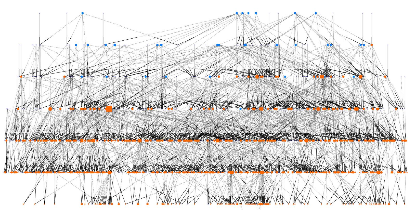

##A Brief Digression from *UCP1* for Quantitative Genetics

***

**Readings**:<ul> 
<li>[Almasy L, Blangero J. 1998. Multipoint quantitative-trait linkage analysis in general pedigrees. *Am J Hum Genet* 62: 1198–1211.]()</li><br>
<li>[Schmitt CA, Service S, Cantor RM, Jasinska AJ, Jorgensen MJ, Kaplan JR, and Freimer NB. 2018. High heritability of obesity and obesogenic growth are both highly heritable and modified by diet in a nonhuman primate model, the African green monkey (*Chlorocebus aethiops sabaeus*). *Int J Obesity* 42: 765-774.]()</li><br>
<li>[Hill WG. 2012. Quantitative genetics in the genomics era. *Curr Genomics* 13(3): 196-206.]()</li></ul>

***

###[Homework for Lab 6: DUE Friday, November 30th](https://fuzzyatelin.github.io/AN333_Fall18/Lab6_Homework.html)

***

In this lab, we'll take a VERY brief look at the practicalities of running a quantitative genetics analysis of *variance decomposition*. In other words, we'll look at a quantitative trait and figure out how much of the variation in that trait can be attributed to *narrow sense* heritability, and how much from environmental factors.  We'll also take a look at a few important environmental *covariates* and see how including them can change our estimates.

In this case, metrics of obesity like body mass, BMI, and waist circumference will be from measurements taken during my own research on the genomics of obesity in captive vervet monkeys (*Chlorocebus sabaeus*):<br><br>
<center>

</center><br><br>
Now, the vervet monkeys at the Vervet Research Colony in Wake Forest University School of Medicine (in Winston-Salem, North Carolina) have lived together in a captive colony since the early 1970's, and are descended from about 70 animals brought over from the Caribbean island of St. Kitts. 
<br><br>

<br><br>
These Caribbean monkeys, in turn, were brought over the Atlantic about 400 years ago from West Africa suring the slave trade, as either pets or food. A small amount of vervets were either set free or escaped, found the island to be fairly hospitable, and reproduced. A lot. There are now thousands of vervets running around on the island. This means that the VRC monkeys are a bottleneck of an already highly bottlenecked population, and so their genetic variability is pretty low and their linkage blocks are pretty big! This is actually to our advantage for finding genomic variants associated with complex traits, since there's very little variation to begin with - it reduces the statistical noise when looking for a genetic signal, so to speak. 

Since the VRC has been a closed breeding colony since the 1970s, the vervets are very well pedigreed, meaning we know who the father and mother of most individuals might be going back to the original founding population (although the pedigree is actually SUPER complex and confusing). There are about 950 vervets in the pedigree, going back about 6 generations, which makes for a pretty big mess:
<br><br>

<br><br>
Nonetheless, we can still use the relatedness values derived from the pedigree as a proxy for IBD shared genetic ancestry, and in so doing use the pedigree to estimate the amount of additive genetic variance contributing to the heritability of various traits we've measured in the colony.

As we know, however, genetic variance isn't all we need to be concerned about in a quantitative genetics analysis; we also need to estimate *environmental* variance. Now, we already know from studies in humans and other animals that obesity-related traits like BMI, waist circumference, and body mass, can be influenced by quite a few environmental factors. Of these, diet may be the most important. 

From 2004 to 2008, the VRC monkeys were put on an experimental diet to help them lose weight. This diet was comprised of relatively High Fiber and High Protein (HFHP) compared to their regular monkey chow. When the monkeys were put on this diet, they lost about 10% of their body weight, on average! Once they ended the diet, and switched back to the regular chow, they mostly gained back the weight. If we want to understand the genetics underlying body mass, we need to account for the potential variance in body mass introduced by this 4-year diet, a clearly very important environmental component of the variance seen in body weight over the monkeys' lifetimes.

Here's where we come in!  We're going to use an analytical program called [*SOLAR-Eclipse*](http://solar-eclipse-genetics.org/index.html) (which is really good at handling messy pedigrees like the vervets') to conduct a variance components quantitative genetics analysis in the VRC to better understand how much of the colony-wide variance in average adult body weight is controlled by additive genetic variance (on other words, by differences in allele frequencies across the genome), and how much is controlled by environmental covariates (like the HFHP dietary intervention).

The first thing we need to do is log in to the *SCC*, and then navigate to the *anth333* project directory, where there's a folder called *vervet*:

```{bash,eval=F}
cd /project/anth333/vervet/
```

Once there, copy both the files from the vervet folder to your personal folder in the project directory. These file include the vervet pedigree, and the vervet data on BW and its covariates. You can use the following code, as an example (in this case, replace 'filename' with the name of the file, and 'BUID' with *your* BUID, so that the file will be copied to your named folder):

```{bash,eval=F}
cp /project/anth33/vervet/filename /project/anth333/BUID/
```

Before continuing, let's take a look at our vervet data. Use the `less` command to take a look at the pedigree file:

```{bash, eval=F}
less vervetpedigree.csv
```

As you can see, we have 

Once that's done, we're ready to load *SOLAR-Eclipse*:

```{bash, eval=F}
module load solar-eclipse
solar
```

Now, you'll notice that once you've loaded *SOLAR*, that the prompt has changed to `solar>`. This means that once *SOLAR* is loaded, you can *only* run *SOLAR* commands.

