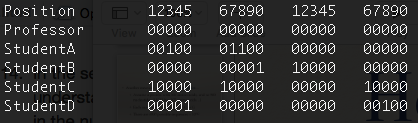
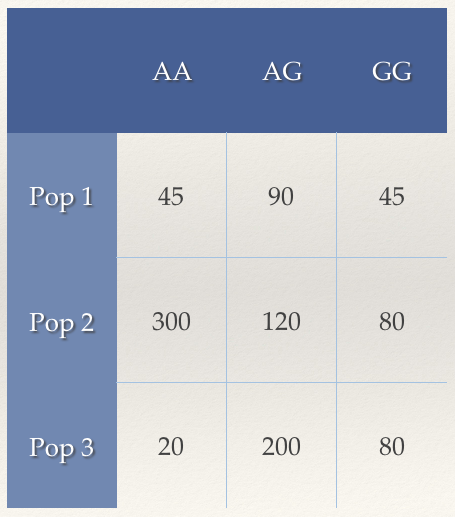

## Midterm 2 (150 points)

This midterm is **open notes, open textbook, open Lab tutorial** and will cover genetics review concepts (insofar as they are relevant to our newer work), linkage disequilibrium, genetic drift, heterozygosity, and detecting and measuring selection in the genome. <br>

You may begin the exam when the submission link (below) becomes active at class time on **Monday, November 19**, and work on the exam until the link closes at midnight of the exam due date, **Wednesday, November 28**.<br>

*No late responses will be accepted!*<br><br>

<center>
###[Access the online interface to submit your Midterm 2 answers here.]()
</center><br>

Parts of this exam will require downloading, processing, and analyzing data from *Ensembl* in ways that should, by now, be familiar to you; these may involve interfacing with *R/R Studio*, *tabix*, *vcftools*, and other modules in the *SCC*. If you've forgotten how to use these modules, you should use your online Lab tutorials as guides (this is an open notes exam, after all).<br>

All *SCC*-based files associated with exam analyses should be uploaded to a folder in the general *anth333* project space. Doing this will be part of the exam, and involves commands you've already learned and used in the context of class.<br>

NOTE: I will *not* help you directly with exam questions in office hours. However, I *will* help you with exercises already present on Lab tutorials or previous homework assignments. *Please do not ask for help on exam questions*. Also, although you are encouraged to do your homework in cooperation with other students, you should be doing your take-home exam *alone*.<br>

***

###Part 1: Preparing your Workspace for Midterm 2 (5 points)

<ol>1. Log in to your *SCC* working directory. **(1 point)**<br><br>

Once there, enter the following code:
```{bash, eval = F, echo = T}
#this gives you access to a shared project space on the SCC that I can access.
cd /project/anth333/
```
</ol><br>
<ol>2. Create a new directory in this *anth333* shared project space named after your BU login, followed by the number '**2**'. For example, my directory would be called *caschmit2*, which is both my BUID and my *SCC* login name wiht the number 2 after it. **(2 points)**</ol><br>

<ol>3. Now, navigate to your newly named directory so that it's your current directory (i.e., where all of the files you download from *Ensembl* will be deposited and saved). *Conduct all work for the midterm from this directory*. At the end of the exam, all your newly created or saved files associated with Midterm 2 *must* be in this folder. **(2 points)**<br><br>

HINT: Given you answered these first questions correctly, your *SCC* prompt will look like this for all midterm analyses:

```{bash, eval = F, echo = T}
[username@scc1 username2]$
```

Now, all of the analyses and processing you do will be done *within* this single named directory, allowing me to grade your individual progress.</ol>

***

###Part 2: Linkage in a New Population (40 points)

So far in our labs, we've been focusing on the human mitochondrial uncoupling protein 1 (*UCP1*) gene in our own assigned *1000 Genomes Project* populations. To better demostrate what we've learned, let's take a look at a novel population.<br><br>

Now, I'm already convinced that we all know how to properly download a dataset from *Ensembl*, so for this exam, please copy the data for the **Bengali in Bangladesh** population from the *caschmit2* folder into your Midterm 2 folder. **(5 points)**<br><br>

HINT: We last did something like this in [Lab 4](https://fuzzyatelin.github.io/AN333_Fall18/Lab4-Phylogeny.html)

The next few questions will have do with the concept of *linkage*.

<ol>1. Which process in the genome is responsible for driving linkage between any two loci towards equilibrium, and when does it happen? **(5 points)**

<ol>a) Mutation, during fertilization</ol>

<ol>b) Drift, during mitosis</ol>

<ol>c) Recombination, during meiosis</ol>

<ol>d) Selection, during evolution</ol>
</ol><br>

<ol>2. Imagine you conduct a dihybrid cross between pea plants, which can have either purple or red flowers (with the red flowers being recessive). Which of the following results in your F2 generation of this dihybrid cross indicate linkage (for the given sample size)? **(2 points)**

<ol>a) 281 : 94 : 94 : 31 (n = 500)</ol>

<ol>b) 197 : 66 : 65 : 22 (n = 350)</ol>

<ol>c) 215 : 71 : 71 : 24 (n = 381)</ol>

<ol>d) 327 : 27 : 27 : 55 (n = 436)</ol>
</ol><br>

<ol>3. Although it is generally recognized that *mitochondrial DNA* does *not* recombine, what evidence seems to suggests that might not be the case? **(2 points)**

<ol>a) Recombination in a large sample of human mtDNA seems to vary as a function of the number of bases between two loci.</ol>

<ol>b) There appears to be recombination between mtDNA haplotypes in humans with heteroplasmy.</ol>

<ol>c) Heteroplasmic mtDNA lineages can be passed on from parent to offspring.</ol>

<ol>d) All of the above.</ol>
</ol><br>

<ol>4. Which of the following loci on the Y chromosome are linked? **(2 points)**

<ol>a) *CDY2A* and *DAZ3*</ol>

<ol>b) *USP9Y* and *BPY2C*</ol>

<ol>c) *TSPY4* and *TSPY8*</ol>

<ol>d) All of the above; all loci on the Y chromosome (outside the PAR) are linked because it doesn't recombine.</ol>
</ol><br>

<ol>5. What is the measure of genetic distance on a *linkage map*? **(2 points)**

<ol>a) Megabases (Mb)</ol>

<ol>b) CentiMorgans (cM)</ol>

<ol>c) Nei's Distance (N)</ol>

<ol>d) None of the above.</ol>

</ol><br>

<ol>6. When comparing recombinant to non-recombinant offspring in a population of interest, you calculate a LOD score of 5.2 for two particular loci. In your population, are these two loci in linkage disequilibrim? **(2 points)**

<ol>a) Yes.</ol>

<ol>b) No.</ol>

<ol>c) It's impossible to say from this information.</ol>

</ol><br>

<ol>7. Imagine you measure the gametic genotypes for two monogenic traits (seen in the parental haplotype as AB/ab) in proportions 0.48, 0.48, 0.02, 0.02 (AB, ab, Ab, aB). Are these two loci experiencing linkage disequilibrium? **(2 points)**

<ol>a) Yes.</ol>

<ol>b) No.</ol>

<ol>c) It's impossible to say from this information.</ol>

</ol><br>

<ol>8. What is *D*, the measure of LD, for the problem above? **(2 points)**</ol><br>

For the next few questions, we'll interrogate the dataset we copied for the Bengali from Bangladesh population from the *1000 Genomes Project* dataset. Using the methods in [Lab 3](https://fuzzyatelin.github.io/AN333_Fall18/Lab3-LD.html), create an LD heatmap for the Bengali from Bangladesh using the **D'** test statistic. You will need the following positions to make your heatmap work:

```{r}
positions <- c(140559446,140559490,140559521,140559713,140559846,140559894,140559997,140560031,140560063,140560064,140560092,140560119,140560134,140560308,140560366,140560427,140560458,140560532,140560579,140560607,140560687,140560748,140560792,140560808,140560884,140560983,140561026,140561062,140561074,140561152,140561173,140561182,140561318,140561330,140561357,140561373,140561510,140561527,140561537,140561614,140561631,140561692,140561713,140561725,140561743,140561866,140561976,140562117,140562176,140562184,140562235,140562317,140562322,140562327,140562349,140562385,140562386,140562397,140562521,140562531,140562581,140562627,140562660,140562739,140562843,140562887,140562892,140562921,140562990,140563028,140563046,140563138,140563155,140563197,140563209,140563215,140563218,140563262,140563338,140563379,140563382,140563386,140563423,140563478,140563530,140563580,140563648,140563722,140563754,140563850,140563911,140563934,140563944,140563980,140564018,140564023,140564106,140564169,140564191,140564305,140564332,140564384,140564388,140564390,140564441,140564594,140564609,140564773,140564784,140564793,140564853,140564886,140564890,140564891,140564982,140565006,140565178,140565370,140565377,140565390,140565556,140565595,140565655,140565830,140565846,140566008,140566056,140566170,140566174,140566179,140566215,140566246,140566260,140566455,140566466,140566542,140566586,140566594,140566595,140566635,140566676,140566737,140566801,140566811,140566819,140566828,140566832,140566892,140566918,140566923,140567029,140567084,140567141,140567205,140567343,140567429,140567462,140567567,140567572,140567578,140567586,140567641,140567662,140567679,140567681,140567735,140567738,140567754,140567765,140567773,140567806,140567811,140567837,140567840,140567862,140567864,140567899,140567914,140567935,140567951,140567973,140567981,140568011,140568016,140568045,140568046,140568052,140568067,140568074,140568108,140568208,140568214,140568279,140568326,140568333,140568366,140568389,140568473,140568517,140568575,140568607,140568610,140568612,140568694,140568724,140568763,140568792)
```
<br>

<ol>9. Upload your *D'* heatmap for the Bengali from Bangladesh population **(10 points)**</ol><br>

<ol>10. Which of the three other SNPs of interest from the Ramos et al. (2012) paper and Lab 3 are in LD with SNP of interest **rs6536991** in the Bengali from Bangladesh population? **(6 points)**</ol><br>

###Part 3: Genetic Drift (10 points)

<ol>11. Imagine you're studying a small population of critically endangered yellow-tailed woolly monkeys (*Lagothrix flavicauda*). You manage to genotype the 8 remaining individuals in an isolated population in the Andes at SNP rs16534 (C/A), and find it's in Hardy-Weinberg equilibrium with the frequency of the C allele at 0.35. A few years later, you return and genotype the next generation of 8 individuals. Given this information, what is the probability that this next generation of yellow-tailed woolly monkeys will be fixed for the C allele at rs16534? **(4 points)**</ol><br>

<ol>12. Which of the following is a potential consequence of this reduced population size in yellow-tailed woolly monkeys? **(2 points)**

<ol>a) Reduced total number of alleles.</ol>

<ol>b) Changes in allele frequency.</ol>

<ol>c) Increased linkage disequilibrium.</ol>

<ol>d) None of the above.</ol>

</ol><br>

<ol>13. If the remnant yellow-tailed woolly monkey population you studied had only 2 males and 6 females, what is the effective population size (N<sub>e</sub>)? **(2 points)**</ol><br>

<ol>14. In the second generation of the remnant yellow-tailed woolly monkey population you studied, you genotype them to better understand how many offspring that generation were from each of the six females. You find that there's a rather large variance in the number. Would that increase or decrease the effective population size? **(2 points)**</ol><br>

###Part 4: Mutations, Heterozygosity, and Selection (80 points)

<ol>15. In your yellow-tailed woolly monkey population, given that the SNP rs16534 is fixed for the C allele, and a mutation rate of 0.00025, what would the frequency of the C allele be after 10,000 generations? **(2 points)**</ol><br>

<ol>16. In which mutation model, in which each mutation considered to be novel, does one simply count the number of difference and assume that represents the total number of mutations that have occured? **(2 points)**

<ol>a) Infinite alleles model</ol>

<ol>b) Stepwise mutation model</ol>

<ol>c) Nei's genetic distance</ol>

<ol>d) None of the above.</ol>

</ol><br>

<ol>17. Which mutation model is the preferred model for microsatellite loci? **(2 points)**

<ol>a) Infinite alleles model</ol>

<ol>b) Stepwise mutation model</ol>

<ol>c) Nei's genetic distance</ol>

<ol>d) None of the above.</ol>

</ol><br>

<ol>18. In Lab 4, we used the Neighbor-Joining method to construct a tree based on an infinite alleles mutation model. Does the neighbor-joining method always give you the evolutionarily 'correct' tree? Why or why not? **(5 points)**</ol><br>

<ol>19. Please take a screenshot or save a PNG or PDF file of the neighbor-joining tree for the Bengali in Bangladesh population (as done in Lab 4) and upload it here. Your file size must not exceed 10 MB. **(10 points)**</ol><br>

<ol>20. If we align several individual sequences, and see a site that has multiple bases at that locus, what do we call it? **(2 points)**

<ol>a) Segregating site</ol>

<ol>b) Non-conserved site</ol>

<ol>c) Polymorphic site</ol>

<ol>d) All of the above</ol>

</ol><br>

Imagine that we all, as a class, submitted samples to the Sensory Morphology and Genomic Anthropology Lab for sequencing of our individual *UCP1* genes. For a 20-bp sequence, we get the following information regarding *segregating sites* in that region:<br><br> 

<center>

</center><br>

<ol>21. What is the *observed heterozygosity* (Ѳ<sub>π</sub>) of this sample?  **(2 points)**</ol><br>

<ol>22. The *estimated heterozygosity* (Ѳ<sub>k</sub>) of this sample is 0.86. What is Tajima's D for this region of the genome in our class population? **(2 points)**

<ol>a) Positive</ol>

<ol>b) Zero</ol>

<ol>c) Negative</ol>

</ol><br>

<ol>23. Given the value of Tajima's D for our class population, what kind of selection might be occurring in our classroom!? **(2 points)**

<ol>a) No selection</ol>

<ol>b) Diversifying selection</ol>

<ol>c) Purifying selection</ol>

<ol>d) Balancing selection</ol>

</ol><br>

<ol>24. We also calculated Tajima's D, in a different and much faster way, in [Lab 5](https://fuzzyatelin.github.io/AN333_Fall18/Lab5-neutrality.html). Calculate Tajima's D for the Bengali in Bangladesh population. **(5 points)**</ol><br>

<ol>25. Is this value for Tajima's D statistically significant? **(2 points)**

<ol>a) Yes</ol>

<ol>b) No</ol>

</ol><br>

<ol>26. Given the value of Tajima's D for the Bengali in Bangladesh, what kind of selection might be occurring around *UCP1* in this population? **(2 points)**

<ol>a) No selection</ol>

<ol>b) Diversifying selection</ol>

<ol>c) Purifying selection</ol>

</ol><br>

When working in South Africa, you collect genomic data on three populations of vervet monkey (Pop1, Pop2, and Pop3). Each individual is genotyped at a particular SNP, the genotypes for which are summarized in the following table:<br><br>

<center>

</center><br>

Answer the following questions based on these genotype results.

<ol>27. What is the observed heterozygosity (H<sub>obs</sub>) and expected heterozygosity (H<sub>exp</sub>) of each population? **(6 points)**</ol><br>

<ol>28. Which population has a positive F-value? **(2 points)**</ol><br>

<ol>29. What does a positive F-value impy for that population? **(2 points)**</ol><br>

<ol>30. According to the F<sub>ST</sub> for these populations, what is the proportion of variation at this locus that is due to differences between subpopulations? **(2 points)**</ol><br>

<ol>31. What kind of sequencing is best for identifying and thus reducing errors in variant/polymorphism discovery with whole-genome sequencing? **(2 points)**

<ol>a) Sanger sequencing</ol>

<ol>b) Bisulfite sequencing</ol>

<ol>c) Duplex sequencing</ol>

<ol>d) Single-strand sequencing</ol>

</ol><br>

<ol>32. The *EDAR* gene, which was discussed in class, is implicated in numerous phenotypes including hair thickness, sweat gland output, tooth morphology, and mammary duct proliferation. What is this phenomenon called, where one gene is implicated in multiple seemingly unrelated phenotypes? **(2 points)**

<ol>a) Epistasis</ol>

<ol>b) Pleiotropy</ol>

<ol>c) Epigenetics</ol>

<ol>d) Polygenics</ol>

</ol><br>

<ol>33. The McDonald-Kreitman Test is a test designed to detect taxon-informative markers; we use it to contrast *within* and *between* taxon synonymous and non-synonymous differences. In the case of the *Drosophila melanogaster* variation at the alcohol dehydrogenase gene (see the figure on slide 23 of Lecture 12), of the loci presented are the *best* species-informative loci (e.g., loci that really differentiate species from each other) aside from 781, which we dicussed in class? **(6 points)**</ol><br>

<ol>34. When using d<sub>N</sub>/d<sub>S</sub>, a significantly *positive* value implies what kind of selection? **(2 points)**

<ol>a) Positive</ol>

<ol>b) Negative</ol>

<ol>c) Neutral</ol>

<ol>d) Purifying</ol>

</ol><br>

<ol>35. Which of the following physiological systems appear to have been under significant positive selection since our last common ancestor with chimpanzees, according to d<sub>N</sub>/d<sub>S</sub>? **(2 points)**

<ol>a) Immunity and defense</ol>

<ol>b) Digestion</ol>

<ol>c) Olfaction</ol>

<ol>d) Brain growth</ol>

</ol><br>

<ol>36. Are hard selective sweeps common in human evolutionary history? **(2 points)**

<ol>a) Yes</ol>

<ol>b) No</ol>

</ol><br>


<ol>37. Match the convergent mutations for a selected trait in human evolutionary history with the trait they were selected for... **(8 points)**<br>

Traits: lactase persistence, lighter skin pigmentation, hypoxia

<ol>G/C-14010 upstream of *LCT* in Tanzanians</ol>
<ol>Extended haplotype homozygosity around *EGLN1* in Andean populations</ol>
<ol>Missense mutation L-374-F (rs16891982) in the *MATP* gene in Europeans</ol>
<ol>C/G-13907 upstream of *LCT* in Sudanese</ol>
<ol>Missense variant H-615-R (rs1800414) in *OCA2* in East Asians</ol>
<ol>Extended haplotype homozygosity around *EGLN1* in Tibetans</ol>
</ol><br>

<ol>38. Explain, to the best of your ability, why the positive selective sweep around the *PPARA* gene, implicated in high altitude adaptations in Tibetans, is probably an adaptation related to cold tolerance rather than hypoxia. **(6 points)**</ol><br>

###Part 5: Quantitative Genetics (25 points)

<ol>39. Define *heritability*. **(5 points)**</ol><br>

<ol>40. What is the difference between *broad sense* and *narrow sense* heritability? **(5 points)**</ol><br>

<ol>41. The basic equation for modeling a phenotype lis much like a regression line, and can be described using the equation ***p = μ + Σ β<sub>i</sub> x<sub>i</sub> + a + e***. If we were to use this equation to estimate the variance components of body mass based on a QTL in *UCP1* and an experimental dietary covariate, what would each component of that equation represent?  Use one term each to match the parameter to what it represents:  **(10 points)**
<br><br>
<ol><ol>Body Mass    |    Diet Covariate    |    Change in Mass due to Alleles at QTL    |    Baseline Body Mass    |    Change in Mass due to Environmental Effects  |  Change in Mass due to Diet </ol></ol>
<br><br>

<ol>p:</ol>

<ol>μ:</ol>

<ol>β<sub>i</sub>:</ol>

<ol>x<sub>i</sub>:</ol>

<ol>a:</ol>

<ol>e:</ol>

</ol><br>

<ol>42. If Trait A has a heritability of 1, and Trait B has a heritability of 0.4, which will respond more readily to selection? Using the concept of realized heritability, explain why? **(5 points)**
