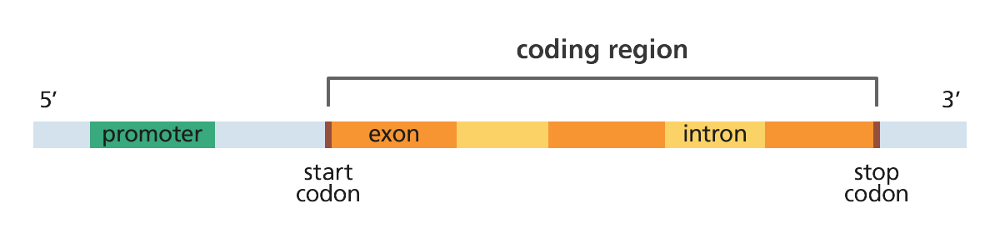

## Homework: Introduction to Hardy-Weinberg Equilibrium

 

***

**Readings**:<ul> 
<li>[Chen J. The Hardy-Weinberg Principle and Its Applications in Modern Population Genetics. *Frontiers in Biology* 5(4): 348-53.](https://link.springer.com/article/10.1007/s11515-010-0580-x)</li> 
<li>[Benetti E, et al. 2020. ACE2 gene variants may underlie interindividual variability and susceptibility to COVID-19 in the Italian population. *European Journal of Human Genetics* ](https://www.nature.com/articles/s41431-020-0691-z)</li> 
<li>[Maekawa et al. 2014. TMPRSS2 Met160Val polymorphism: Significant association with sporadic prostate cancer, but not with latend prostate cancer in Japanses men. *Int J Urology* 21(12): 1234-1238](https://onlinelibrary.wiley.com/doi/full/10.1111/iju.12578)</li> 
<li>[Wigginton JE, Cutler DJ, Abecasis GR. 2005. A note on exact tests of Hardy-Weinberg equilibrium. *Am J Hum Genet* 76: 887-893.](https://www.cell.com/ajhg/fulltext/S0002-9297(07)60735-6?code=ajhg-site)</li></ul>

***

Now that many of us have a little more facility with working with *Ensembl* and 1000 Genomes data, I'm hoping this week's lab homework will be fairly simple. Don't forget: for more conceptual questions, you can consult both your notes/slides from lecture and the textbook!

As before, you'll be turning in your homework via an online interface.  I recommend writing your essays in a document on your laptop and only engaging with the online interface when you're ready to turn in *all* of your completed answers.

###[Access the online interface to submit your homework answers here.](https://forms.gle/qVF1SRj2jbDm7EAbA)

 

* What does it mean if there is a SNP in the gene *ACE2* or *TMPRSS2* that is not in Hardy-Weinberg equilibrium? Think not only about the phenotypic consequences, but what it says about the environment of the population.

* How many SNPs in *your* population were *out* of Hardy-Weinberg equilibrium?

* Please list each of the four SNPs you chose to check for "true" Hardy-Weinberg equilibrium using the *Shiny App* embedded in the Lab 2 tutorial. What was the P-value of each using the *R* analysis? What was the modified P-value using the *Shiny App*? Did any of them change significance? Based on the Module 2 tutorial and the Wigginton et al. (2005) reading, what does a change in P-value mean?

 

* Imagine that gene map above represents *ACE2*. Based on the Benetti et al. (2020) article itself, and what you know about the organization of genes and the cDNA for the transcript ACE2-201 on Ensembl, where in a gene map for ACE2 would you find the SNP **Lys26Arg** (e.g., intron 1-2, exon 3, 3'-UTR, promotor, etc)?

* Where on the map above is the SNP in *your* population that most significantly deviates from Hardy-Weinberg equilibrium? How would you predict that SNP might affect *ACE2* or *TMPRSS2* phenotype? If you don't have any SNPs that deviate, choose one at random. 

* Think about the economic, cultural, and medical context of your 1000 Genomes population. Would it make sense for your population's ACE2 or TMPRSS2 genotype/phenotype to be influenced by evolutionary forces under the current pandemic? Why or why not?
 
 
 