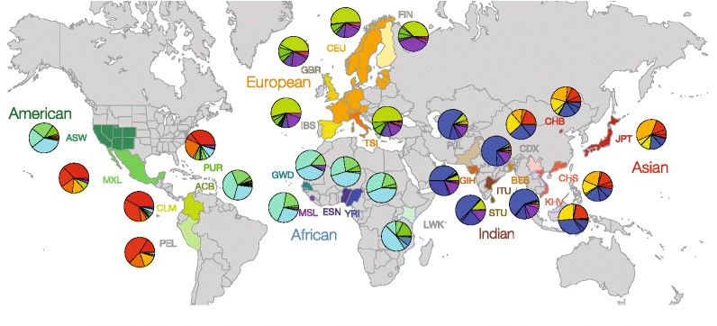

***

***

<b>Fall 2020, Lecture is held on MWF, 1:25 - 2:15pm in PSY 153</b>

***
### Faculty Instructor:
  **Christopher A. Schmitt**  
  Assistant Professor of Anthropology and Biology  
  Office: Stone Science Building (STO), 675 Commonwealth Ave, Rm 247E  
  Office Hours: Monday 2:30 - 3:30pm, Friday 2:30 - 3:30pm  
  Web: http://www.evopropinquitous.net  
  Email: caschmit[at]bu[dot]edu  
  Twitter: http://www.twitter.com/fuzzyatelin  
  
***

### [Syllabus](https://fuzzyatelin.github.io/AN333_Fall20/Syllabus.html)
### [Modules](https://fuzzyatelin.github.io/AN333_Fall20/Modules.html)
### [Exam](https://fuzzyatelin.github.io/AN333_Fall20/Midterm2.html)
### [Policies](https://fuzzyatelin.github.io/AN333_Fall20/policies.html)
### [Final Project](https://fuzzyatelin.github.io/AN333_Fall20/FinalProject.html)

***
### Course Description
***

This course uses human genomic and population variation as a framework within which to better understand human evolutionary history. We do this by familiarizing ourselves with the methods, techniques, and biology that allow us to understand human variation at its most basic level: the genome. Throughout the course, we will download, analyze, and draw conclusions about human evolutionary and population history from open-source human genomic datasets derived from the [1000 Genomes Project](http://www.internationalgenome.org). From there, we expand our view to better grasp human diversity and what it can tell us about our evolutionary history from our last common ancestor with other apes to how modern human populations have diverged, specialized and then interacted during our spread from East Africa to every part of the globe. Finally, we take a close look at the biological underpinnings of contemporary human variation and what impact our knowledge of these systems can have on our conceptions of public policy, health and disease. 

  

***
### Prerequisites
***
CAS AN 102 or AN 233; or CAS BI 107 and either BI 206 or BI 216; or consent of instructor. 

***
### Course Format
***
This is a 4-unit lecture course with some lab-like classes held in lieu of lecture to discuss modules. Lectures will be held three times a week for a total of 3 hours. 

***
### Assessment
***
Performance will be based on a total of 500 possible points distributed across five assessments:
<ol>
1.	Exam 1: 100 points,	Wednesday, 10 October, 2020
2.	Exam 2: 100 points,	Friday, 09 November, 2020
3.	Exam 3: 100 points,	Monday, 12 December, 2020
4.  Module Homework: 60 points (see below)
5.  Final Project: 140 points, due Friday, 18 December, 2020
</ol>

***
### Required Texts
***
The course text is be available for purchase at [BU Barnes & Noble](https://bu.bncollege.com), and is also on library reserve at the [Science and Engineering Library](http://www.bu.edu/library/sel/).
<ul><li>Hartl DL & Clark AG. 2007. <i>[Principles of Population Genetics, Fourth Edition](https://global.oup.com/ushe/product/principles-of-population-genetics-9780878933082?lang=en&cc=ca)</i>. Oxford: Oxford University Press.</li>   

</ul> 

***
### [BU HUB](http://www.bu.edu/hub/about-the-hub/) Learning Outcomes
***

This course has been added to the **BU HUB** General Education Curriculum as **CAS AN/BI 333**. There are several HUB-related Learning Outcomes for this course, including:

***
#### *Scientific Inquiry II (SI2)*
***

* **Learning Outcome 1**: Human genome data is a relatively new resource with its own challenges, both scientific and ethical. Students will apply population genetic and genomic principles to real human genomic data from the 1000 Genomes Project to assess the influences of population history and natural selection on human genomic variation. Methods will be learned as a class on an example gene of interest, followed by the independent application of these methods on a gene of each student’s choosing. We will discuss the relative merits of each test, when they are best used and under what population conditions, and then use this information to assess the appropriateness of tests for student-led project hypotheses and analyses in a peer-review format.

* **Learning Outcome 2**: While understanding the scientific merits of each analysis is critical, equally important is understanding the ethical merits of how the data was collected and results disseminated. Through a series of in-lecture discussions, we will interrogate the ethics of genomic data collection from a number of perspectives, including the use of genomic data to assess belonging and population history in indigenous North America (and in contemporary US politics), the proliferation of online personal genomics testing and health reports, and the ways in which genomic sampling continues to be biased. Finally, we will look at the contemporary misuse and misunderstanding of genomic data and studies, including race-based nationalist dialogues, gene-editing and eugenics debates, and public understandings of precision medicine.

***
#### *Quantitative Reasoning II (QR2)*
***

* **Learning Outcome 1**: This class will use R-based statistical packages (pegas, vcfR, PopGenome) and bioinformatics tools (SAMtools, VCFtools), accessed via the Shared Computing Cluster, to analyze human population genomic data downloaded from online repositories in order to ask questions about human population and evolutionary history. Statistical tests common to population genetics will be discussed and worked through in simpler examples in class, permitting students to learn them in an accessible conceptual quantitative framework. These simpler frameworks will then be scaled up to large-scale genomic analyses. Students will use these analytical techniques in consultation with the instructor to conduct a self-guided study testing an evolutionary hypothesis regarding a gene region of their choice in population(s) of their choice. Example projects require using bioinformatics tools and pipelines learned in class to assess genomic regions for signs of selection in keeping with evolutionary hypotheses (i.e., do Peruvian populations show selection around genes related to arsenic poisoning), or to use pedigree-based analysis to decompose variation in obesity-related traits into genomic and environmental sources.

* **Learning Outcome 2**: Questions of human evolutionary and population history will be framed in the context of population genetics and genomics. These methods will teach students to evaluate quantitatively how variation in the genome can shed light on both within and between group differences among humans in a way that elucidates the potential roles of selection, drift, mutation, mating patterns, and other factors on how human diversity evolved. This will be accomplished using population genetic packages in R to assess and interpret sequence-level variation in publicly available human genomic data. All inquiries will be framed by discipline-specific questions (for example, whether genomic variation around the *ACE2* gene, the primary receptor for SARS-CoV-2, shows differential signs of selection between populations). The diversity found in humans, on a genomic level, is often misinterpreted or misused in the public sphere. We will also assess how public representations of this human phenotypic variation may or may not accurately represent population genetic histories.

* **Learning Outcome 3**: After learning background and methods using a combination of lecture and increasingly complex online coding modules, each student will select a gene region associated with a human trait of interest. They will then use their understanding of human evolutionary and/or cultural history to form hypotheses regarding how that gene sequence is expected to vary within and across contemporary human populations. These hypotheses will be tested using the population genomic methods and tools learned in class. Most of these tools must be used in combination in order to provide adequate interpretive power (for example, students must test a sequence region for Hardy-Weinberg equilibrium, and then follow up those hits with further testing for deviations from neutrality using Tajima's D, and if that is indicative of positive selection use a test of Extended Haplotype Homozygosity to confirm a recent selective sweep in that region of the genome. Ultimately, a combination of literature review and their own quantitative analyses of genomic variation will be used to present their own argument for the history of this trait in their human populations of choice. Students will be 'peer-reviewed' on the basis of the quality of their quantitative methods, and the submission of their final paper requires a thorough answering of peer questions regarding their methods, and modification of analyses if recommended by the class.

* **Learning Outcome 4**: Students will communicate their quantitative analyses and outcomes both visually and verbally throughout the course.  Modules each come with required homework assignments that are submitted via Google Docs. Each require explanations of statistical symbols associated with genomic analyses, as well as short essays describing clearly what statistical tests accomplish and how that translates into biological meaning. This process culminates in an American Association of Physical Anthropologists-formatted presentation at the end of the course. These 15-minute presentations are expected to include graphical and tabular representations of analyses built in R packages (also learned in online modules and in-class work) and of outcomes that are verbally interpreted in relation to their hypotheses about human evolutionary history related to their gene of choice. In this way, quantitative information will be related symbolically (students must present equations underlying their analytical methods in their papers, and demonstrate a thorough understanding of what these symbols translate to with regards to genomic sequence variation), visually (through graphs and figures that must also be interpreted, showing an understanding of what these figures are relaying and how that reflects meaning regarding variation in the genome), and verbally in their presentation in a manner that is colloquially understandable to their peers and that shows clear understanding of the methods. The written paper will combine these three modes of communication.

* **Learning Outcome 5**: Critical to this course is conveying an understanding the assumptions and models underlying each population genomic test. We discuss these assumptions and the limits of these tests extensively in lecture, and this is also an important aspect of online modules that is emphasized in module-associated homework assignments. Integral to the final presentation and paper is a clear understanding of the assumptions of each test, and how much – or how little – these assumptions may limit what each test can tell us about population history and processes given the data and populations used. Finally, each student must also discuss how these assumptions and models do or do not take into account important potential covariates and cultural aspects of modern human populations and population histories; this is an aspect of human genomics famously neglected even in high impact publications of human genomic and quantitative genetic analyses.

***
#### *Research and Information Literacy (RIL)*
***

* **Learning Outcome 1**: Students will learn and compare multiple methods of accessing free online repositories of contemporary and ancient human genomic data while also assessing the quality of those samples through a rigorous interpretation of the published literature on their origins and analysis. To this end, students will read primary literature regarding the creation of genomic data repositories and data types, which will discuss the relative merits of accessing different genomic data types (for example, constructing de novo genome assembly from raw sequence data versus using pre-constructed variant call formats and other, more processed methods of storing genomic data), and even reference assemblies (i.e., those stored in Ensembl, the UCSC Genome Browser, and GenBank), recognizing the variable levels of skill and knowledge required to adequately access and assess the quality of data from such resources.  Through the process downloading and analyzing their own chosen genomic region, students must also repeatedly assess the quality of their own data, and critically reflect on how their processing techniques may have altered the information content of their genomic dataset (indeed, in past courses, data corruption often lead to untrustworthy outcomes, which students must detect and remedy using the tools provided in their modules). These studies will be supplemented by discussions of social and ethical issues surrounding data collection, analysis and presentation unique to human genomic datasets, including discussions of data from indigenous and non-Western populations and how the results from analyses of these populations are presented and interpreted. This includes reflections on how they choose their own population to interrogate, what cultural or biological assumptions may do to bias such choices, and how their choice of population may also alter how their analytical results can adequately address their question.

* **Learning Outcome 2**: •	Online exercises with in-class troubleshooting sessions guide students through the process of human population genomic research. This process follows a sequence from relatively low-stakes assignments familiarizing students with data sources, interfaces, and processing, leading gradually to a complete project in which students choose a gene to analyze comparatively across human populations, with an eye towards understanding how the data and resources available necessarily limit their scope of inquiry. This process is mediated by online modules which guide students through the initial process of data acquisition through increasingly complex methods of data processing and manipulation for population genetic assessments. Students will learn quickly to ensure that, with each modification of the dataset, the quality of their data remains high, and has not been compromised by faulty coding (a very common outcome) or by not meeting analytical assumptions. Upon successful completion of the training modules, students then work with the instructor to independently develop a question related to human genomic variation that is limited to the resources provided (the available 1000 Genomes Project dataset). Ultimately, students present their work in class in an American Association of Physical Anthropologists-formatted presentation where they gain peer-review of their work. The final paper involves a submission process in which students must attach a cover letter directly addressing critiques raised by their peers during their presentation. This process prepares students for the entirety of the scientific process, from literature review and hypothesis formation through peer-review and presentation.

