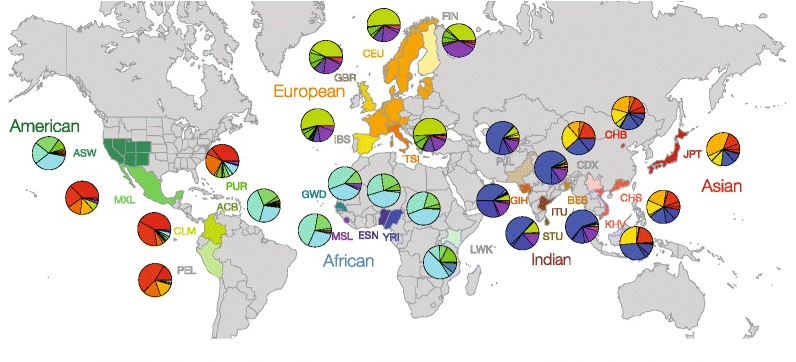

## Homework: Introduction to the International Genome Sample Resource (Formerly known as the 1000 Genomes Project)

<br>

***

**Readings**:<ul>
<li>[The 1000 Genomes Project Consortium. 2015. A global reference for human genetic variation. *Nature* 526: 68-74.](https://www.nature.com/articles/nature15393)</li><br>
<li>[Danecek P, Auton A, Abecasis G, Albers CA, Banks E, DePristo MA, Handsaker RE, Lunter G, Marth GT, Sherry ST, McVean G, Durbin R, 1000 Genomes Project Analysis Group. 2011. The variant call format and VCFtools. *Bioinformatics App Note* 27: 2156-2158.](https://academic.oup.com/bioinformatics/article/27/15/2156/402296)</li><br>
<li>[Nedergaard J, Golozoubova V, Matthias A, Asadi A, Jacobsson A, Cannon B. 2001. UCP1: the only protein able to mediate adaptive non-shivering thermogenesis and metabolic inefficiency. *Biochimica et Biophysica Acta - Bioenergetics* 1504(1): 82-106.](https://www.sciencedirect.com/science/article/pii/S0005272800002474)</li><br>
<li>[Gonzalez-Barroso MDM, Ricquier D, Cassard-Doulcier AM. 2000. The human uncoupling protein-1 gene (UCP1): present status and perspectives in obesity research. *Obesity Rev* 1: 61-72.](https://onlinelibrary.wiley.com/doi/full/10.1046/j.1467-789x.2000.00009.x)</li></ul><br>

***


<br>
<br>

At this point, technical difficulties aside, we've got a bit more knowledge regarding how to navigate the *SCC* and how to gather data of various kinds from *EnsEMBL*, so let's put that knowledge to use with some practice!<br> 

This homework assignment is meant to both stretch your abilities from the past two modules, and prepare you for what's coming in the next module. If you can't remember how to do something, check your Pre-Module slides/notes and [Module 1](https://fuzzyatelin.github.io/AN333_Fall24/Lab1_Module.html).<br>

To make things easier, I've also created an online interface where you can answer the questions.

<br><br>
<center>
### [Access the online interface to submit your homework answers here.](https://forms.gle/KLTq8iNPhUAuhqDD8)
</center>
<br><br>

### Question 1 (25 points): 

Go to the *Ensembl* web page for the human *UCP1* gene, and look at the *variant table*.<br> 

* How many variants code for a missense mutation within the coding region of *UCP1* for the 1000 Genomes population?
* Sort the variants by base pair location from first to last (e.g., lowest bp number to highest on chromosome 4), and list the first *five* variants (if there are less than five, list them all).
* How many *multi-allelic* variant sites (more than two alleles) are among the loci listed?
* Does *your* 1000 Genomes population have any of these missense variant minor alleles?
* How many individuals in *your* 1000 Genomes population have the minor allele at each of the variant sites you've listed here?

```{r, eval = FALSE, echo = FALSE}
They should use Consequences, turn all off, and only turn on 'missense variant' Once that is done, there are 30 SNPs left. The SNPs themselves are, in order from lowest bp location to highest:
  
rs146114327, rs140138182, rs2270565, rs148598275, rs565496720

There are 16 multi-allelic sites among the missense variants listed.

The average size of the deletion at these variant sites is 3 bp.

Nobody should have the deletion allele of these variants.
```

### Question 2 (50 points):

Go back to the variant table, and filter and sort it to find *Stop Gained* variants.

* How many SNPs that cause a stop gain in *UCP1* are present in the 1000 Genomes populations?  
* Name them, using the Variant ID, in order from lowest to highest position number.
* What is the *minor* allele (which causes the stop codon) for the stop-gained SNP that has the highest position number? 
* What does a stop gain mutation do, and why might it be selected for or against in population?  
* Does an individual in YOUR 1000 Genomes population have the minor allele?
* Given the readings for Module 1 regarding the function of *UCP1*, what might having the minor allele mean for the phenotype of individuals who have it?

```{r, eval = FALSE, echo = FALSE}
They should use Consequences, turn all off, and only turn on 'stop gain' Once that's done, there are 3 SNPs left that are part of the 1KG populations. The SNPs themselves are, in position order:

rs565496720 - A
rs530774350 - C
rs539685692 - A

```

### Question 3 (25 points):

We should *probably* get a little more practice with the *tabix* and *vcftools* coding for downloading data into our *SCC* space.<br>

* Please download an extended version of the *UCP1* gene region that includes 10,000 bp up- and down-stream of the gene region for your assigned population (i.e., add 10,000 to the end position of the gene, and subtract 10,000 from the starting position), and name it `UCP1_POP_REGION_username.vcf` (where `POP` is *your* study population's three-letter code, and `username` is your BU login name). Of all the files generated, you should keep *ONLY the final VCF file*. Send the file to me via the homework interface.<br>

* **Additionally, the final VCF file must be in your *SCC* working directory by the time we meet in class on Friday, October 4th!**


