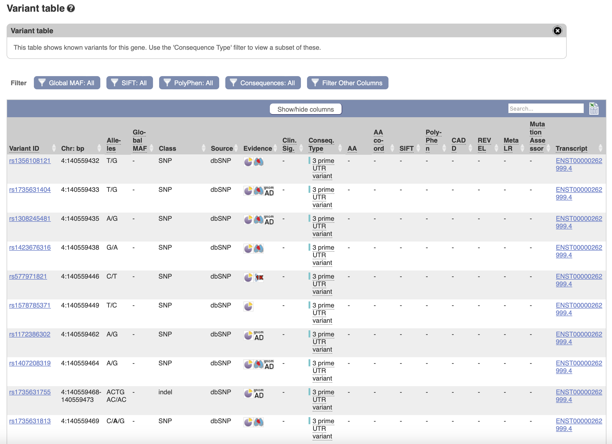
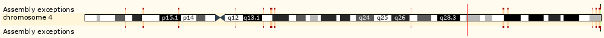
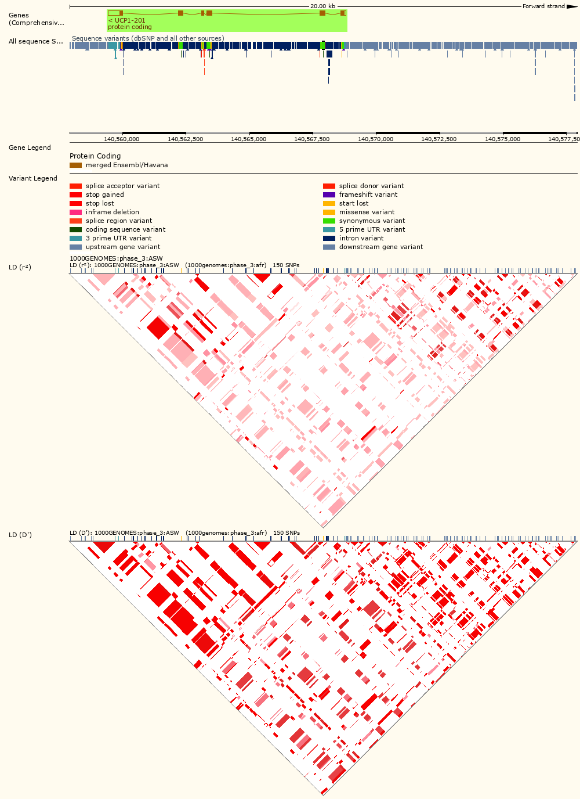
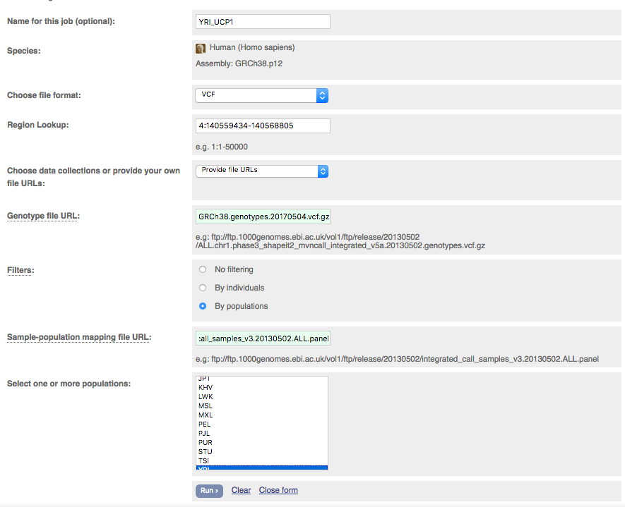
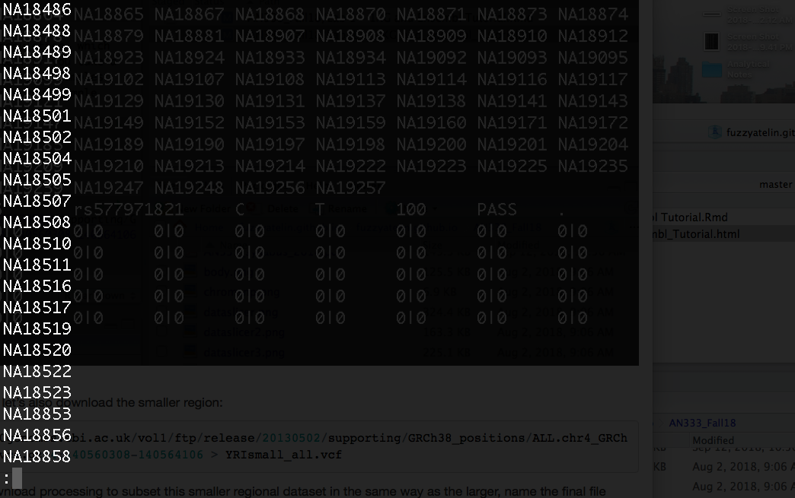

```{r,echo=F}
library(knitr)
```

```{css,echo=F}
.sccCode {
background-color: black;
color: white;
}
```

***

### [Homework for Lab 1: DUE Friday, October 4th](https://fuzzyatelin.github.io/AN333_Fall24/Lab1_Homework.html)

***

**Readings**:<ul>
<li>[The 1000 Genomes Project Consortium. 2015. A global reference for human genetic variation. *Nature* 526: 68-74.](https://www.nature.com/articles/nature15393)</li><br>
<li>[Danecek P, Auton A, Abecasis G, Albers CA, Banks E, DePristo MA, Handsaker RE, Lunter G, Marth GT, Sherry ST, McVean G, Durbin R, 1000 Genomes Project Analysis Group. 2011. The variant call format and VCFtools. *Bioinformatics App Note* 27: 2156-2158.](https://academic.oup.com/bioinformatics/article/27/15/2156/402296)</li><br>
<li>[Nedergaard J, Golozoubova V, Matthias A, Asadi A, Jacobsson A, Cannon B. 2001. UCP1: the only protein able to mediate adaptive non-shivering thermogenesis and metabolic inefficiency. *Biochimica et Biophysica Acta - Bioenergetics* 1504(1): 82-106.](https://www.sciencedirect.com/science/article/pii/S0005272800002474)</li><br>
<li>[Gonzalez-Barroso MDM, Ricquier D, Cassard-Doulcier AM. 2000. The human uncoupling protein-1 gene (UCP1): present status and perspectives in obesity research. *Obesity Rev* 1: 61-72.](https://onlinelibrary.wiley.com/doi/full/10.1046/j.1467-789x.2000.00009.x)</li></ul>

***

## Introduction to the International Genome Sample Resource

***


<br>
<br>

With the exception of the very recent [**Human PanGenome Reference Consortium**](https://humanpangenome.org), **The 1000 Genomes Project**, which ran between 2008 and 2015, is as close as it comes to a "catalogue of human variation." The output of this initiative is a database of whole genome sequences from 26 distinct populations from around the world, all aligned to the same human reference sequence. This data is free to use, and is an excellent resource for researchers who want to study genetic variation in a gene across populations, but cannot afford to collect their own samples. 

While it was active, The 1000 Genomes Project published their data in several phases; by the final phase (Phase 3), they had gathered samples from 2,504 individuals from 26 targeted populations. In 2015, the **International Genome Sample Resource** (**IGSR**) was established to "ensure the future usability and accessibility of the 1000 Genomes data." In keeping with this goal, the IGSR has: re-mapped the Phase 3 data to the latest two human reference sequences, **GRCh37** and **GRCh38**, incorporated externally generated, published genomic data (such as *RNA-seq* data) into their own dataset, and began adding previously unsampled populations the database. 

Below is a map of the current populations represented in the 1000 Genomes Project dataset, as well as a reference list of the abbreviations used to identify these populations.  
<br>


<br>

### Reference List of Current ISGR Sub-Populations
<br>

* <b>CHB</b> - Han Chinese in Beijing, China
* <b>JPT</b> - Japanese in Tokyo, Japan
* <b>CHS</b> - Southern Han Chinese
* <b>CDX</b> - Chinese Dai in Xishuangbanna, China
* <b>KHV</b> - Kinh in Hi Chi Minh City, Vietnam
* <b>CEU</b> - Utah residents with Northern and Western European Ancestry
* <b>TSI</b> - Toscani in Italy
* <b>FIN</b> - Finnish in Finland
* <b>GBR</b> - British in England and Scotland
* <b>IBS</b> - Iberian Population in Spain
* <b>YRI</b> - Yoruba in Ibadan, Nigeria
* <b>LWK</b> - Luhya in Webuye, Kenya
* <b>GWD</b> - Gambian in Western Divisions in the Gambia
* <b>MSL</b> - Mende in Sierra Leone
* <b>ESN</b> - Esan in Nigeria
* <b>ASW</b> - Americans of African Ancestry in Southwest USA
* <b>ACB</b> - African Caribbeans in Barbados
* <b>MXL</b> - Mexican Ancestry from Los Angeles USA
* <b>PUR</b> - Puerto Ricans from Puerto Rico
* <b>CLM</b> - Colombians from Medellin, Columbia
* <b>PEL</b> - Peruvians from Lima, Peru
* <b>GIH</b> - Gujarati Indian from Houston, Texas
* <b>PJL</b> - Punjabi from Lahore, Pakistan
* <b>BEB</b> - Bengali from Bangladesh
* <b>STU</b> - Sri Lankan Tamil in the UK
* <b>ITU</b> - Indian Telugu in the UK
<br>

Note that each of these populations falls under a "super population" which denotes the general area of the world each population is from. Many times, you will see information split up by these super populations instead of by each individual population. These super populations are as follows: 
<br>
<br>

* <b>AFR</b> - African
* <b>AMR</b> - Admixed American
* <b>EAS</b> - East Asian
* <b>EUR</b> - European
* <b>SAS</b> - South Asian
<br>

For the in-class lab activities this semester, each of you will be assigned a focal sub-population for our investigations into human *UCP1*. Unless told otherwise, this is the population you'll be tracking variation in for the remainder of our time learning these methods via our investigations of *UCP1*.

<br>
<center>

### [You can find your assigned population here!](https://fuzzyatelin.github.io/AN333_Fall24/1KG_SubPop_Fall2024.html)

</center>
<br>

For more information about 1000 Genomes and IGSR, visit <http://www.internationalgenome.org/home>.
<br>

## A Brief Word on Bioinformatics and the Creation of the 1000 Genomes Database
<br>
Bioinformatics is the "science of developing methods and software tools for collecting and understanding biological data." It's become huge academic and professional field in a relatively short time as big datasets proliferate in biology, thanks to rapid developments in sequencing technology and the advances in the various '-omics' fields.<br>

BU has an interdisciplinary [**Master's Program in Bioinformatics**](http://www.bu.edu/bioinformatics/), a [**Bioinformatics Research and Interdisciplinary Training Experience (BRITE REU)**](http://sites.bu.edu/britereu/) for undergraduate students that runs during the summer semester, as well as a [**Collaborative for Applied Bioinformatics (the CAB)**](http://bubhub.bumc.bu.edu/) meant to support faculty and students conducting research in bioinformatics. These might be good resources if you decide you like this kind of work and want to pursue it further.<br>

The 1000 Genomes Project, or even digitally recording the information DNA gives us, would not have been possible without this field. To understand the files that we will be working with (such as VCF files, which we will discuss later), it is beneficial to know how raw genomic data is transformed into digital information. In order to explain this process, I have included a simple flowchart that I will walk us through. 
<br> 


<br>

The first step in this flowchart is the DNA sequencing itself. There are several kinds of sequencing, but we know from the 1000 Genomes Project paper that they used [Illumina-based Next-Generation Sequencing](https://www.illumina.com/content/dam/illumina-marketing/documents/products/illumina_sequencing_introduction.pdf). [Illumina](https://www.illumina.com/science/technology/next-generation-sequencing.html) uses a specific method of **next-generation sequencing** (NGS on the diagram). NGS is is a fast, efficient, and in-depth process of sequencing that is based on shearing the genome into small pieces and then reconstructing it en masse and in parallel (in other words, multiple times at once) using various proprietary technologies before mapping those pieces to a **reference genome** (typically the first, highest quality, or most completely sequenced individual genome of a species; this does *not* mean this is the perfect, representative, average, or most common version of the genome!). The proprietary Illumina platform was invented by [Illumina](https://www.illumina.com/), and uses a unique method of sequencing that makes it among the most efficient, affordable, and accurate ways of sequencing that we have today. BU has it's own [Illumina sequencing facility on campus](http://www.bumc.bu.edu/microarray/services/illumina-library-prep-sequencing/). Illumina sequencing itself is an incredibly complex process that we won't talk about in detail here, but if you're curious a good video explaining the process can be found [here](https://www.youtube.com/watch?annotation_id=annotation_228575861&feature=iv&src_vid=womKfikWlxM&v=fCd6B5HRaZ8). 
<br>
<br>
DNA sequence reads don't come out of the machine nicely put together and cleaned, like the files we'll be using in this course. There are a few steps required to turn them into easily readable and analyzable files. As shown in the diagram, the data output of a sequencing machine is called a **Fastq** file. A Fastq file consists of a raw nucleotide sequence that is not yet aligned to a reference genome, and accompanying **quality scores**, which tell us how reliable the sequencing read for each base is. You can work with these files, but without aligning them to a reference genome we won't be able to get as much from them as we want. That's where the next step in the diagram comes in... 
<br>
<br>
**Alignment** is the process of taking a chunk of DNA sequence and using a statistical algorithm to compare that chunk to a reference genome to figure out what section of the genome that chunk most likely represents. This is done with all the small sequence chunks that come from the initial Fastq file until you have a fully-aligned genome. Once you have aligned your Fastq sequence to a reference sequence (and so referenced *positions* for each base pair), you have a **BAM** file. A BAM file therefore not only contains an entire genome's worth of genetic code, but also gives information about where any particular piece of code falls within the accepted reference genome. These files are good to work with if you need an entire genome's worth of information, or detailed information about every nucleotide in a region.
<br>
<br>
The final step in the flowchart is the **VCF** file, which is what we will be working with in our class. VCF files are the result of picking out just the *variant* nucleotide positions (in other words, loci where individual sequences differ from the reference) from a BAM file. Below, we will look at the VCF file format in more depth, as we will almost exclusively be using VCF files to perform our analyses in this class. 
<br>
<br>
**Other sequencing methods** may also be used to create genomic datasets. For example, in my lab - the **Sensory Morphology and Anthrpolgical Genomics Lab**, or **SMAGL** - we predominantly use a **third-generation** sequencing technology created by [Oxford Nanopore Technologies](https://nanoporetech.com). This technology relies on biologically engineered pores that latch onto DNA and 'read' bases one-by-one as they zip through the pore, based on the unique disruptions each base in the genome causes to an electric current in which the pore is embedded, It might be [easier to understand with a helpful video](https://youtu.be/qzusVw4Dp8w?si=9aaeLm039H9z4-sm). The end result from this method are longer (if somewhat lower-quality) sequencing reads, which may also be aligned to a reference to create variant calls (among many other uses). We may talk about this more later in the course.
 
## Overview of the Variant Call Format (VCF) 
<br>

In our modules, we will be using VCF files to look at our candidate gene, *UCP1*. The VCF file format is a computer file format in which variant genetic information can be stored. VCF files in particular are a way of formatting SNP-only information without having to deal with the rest of the sequence that the SNPs come from. Other file types, such as BAM files, have their own uses, but for the purposes of our work in class (and most population genetics studies) they simply contain way more information than we need: a single BAM file containing an entire genome can be almost a terabyte (1000 gigabytes) in size!<br>

VCF files are a text-file format which can be opened with a plain text editor on your computer, and can be analyzed using various softwares. Below I have included an example screenshot of what a VCF file looks like when opened in a plain text editor. This example compares what a simple representation of the sequence itself aligned to the reference ('*Alignment*') looks like in VCF format ('*VCF representation*'):
<br>


<br>

As you can see from parts (b-g) of the figure, there are different notations used depending on the type of SNP or variant is being represented. If you're interested in more complex bioinformatic analyses with data like this, there's more information about VCF files [here](http://www.internationalgenome.org/wiki/Analysis/vcf4.0/).
<br>
<br>

## How to Use *EnsEMBL* to Get VCF Data Files from the 1000 Genomes Dataset

Links to, and information for, all of the genome browsers that feature 1000 Genomes data can be found [here](http://www.internationalgenome.org/1000-genomes-browsers). 
<br>
<br>
The most up-to-date genomic alignments for the 1000 Genomes data are generated by and stored in *EnsEMBL*. *EnsEMBL* is a genome database that is maintained by the [European Bioinformatics Institute](https://www.ebi.ac.uk/), and houses genomic data for many dozens of different species, including humans and one of my own study species (savanna monkeys, or vervets). *EnsEMBL* also has several versions of each dataset, which are updated as new alignment information becomes available.<br>

For this class, we will be using the most up-to-date version of the *EnsEMBL* human geneome browser, the **GRCh38.p14** browser, to look at one of our genes of interest, *UCP1* (note that the screen shots may be from a slightly older version). 
<br>

### Step-by-step Instructions for Using *EnsEMBL*
<br>

<br>
<br>

#### Step 1: Finding *UCP1*

* Go to the website: <http://useast.ensembl.org/Homo_sapiens/Info/Index>

* Find the search bar in the top left-hand corner and type in "UCP1" Make sure the "category" drop-down menu is set to "Search all categories." Click "Go."
<br>


<br>

* The first result to come up should be called "UCP1 (Human Gene)" and should look like this: 
<br>


<br>

* Clicking on that will bring you to the "home page" for the gene *UCP1*, which will look like this: 
<br>
<br>


<br>

Congratulations, you've found a gene of interest in *EnsEMBL*! 

As you can see, we're already getting some interesting information on *UCP1* in humans. For example, *UCP1* is apparently on human chromosome 4, and the gene itself is from position 140,559,434 to position 140,568,805 on the reverse strand of the DNA. This means it's comprised of all the sequence between the 140,559,434th base pair (bp) from the start of human chromosome 4 to the 140,568,805th bp. But since the protein code or reading frame for the gene is on the *reverse* strand, transcription of this gene actually starts (meaning it has its transcription start site, or TSS) at the 140,568,805th bp and goes backwards to the 140,559,434th bp.

We can also see that there is only 1 *transcript* of the gene. This means that, unlike many other genes, there are no mutations or splice variants in human *UCP1* that lead to entirely different functional proteins from the same gene; in many genes where these *do* exist, they can lead to entirely different *phenotypes*, or traits based on the function of these differing transcripts (keep this in mind when we start analyzing the gene of your own choice later in the class).

Now, let's explore the genomic information available for *UCP1* with a bit more depth... 
<br>
<br>

#### Step 2: Visualizing *UCP1* and its Variants

* If you scroll down on the first page, you will see an interactive map of the *UCP1* coding region of the genome. 
<br>


<br>

If you click on the "Go to Region in Detail" option directly above this image, you will get a more detailed visual of the coding region. If you're interested, you can do this on your own time; we will not be using this more detailed view for the purposes of this class. What we will look at, however, is more detailed information on all of the *variants* present in the 1000 Genomes populations within the *UCP1* gene region. 
<br>

* One way to do this is by going directly to a specific *transcript*. If we want to actually see what a transcript (or transcribed amino acid sequence) looks like, we can click on the button `Show transcript table` on the main page for *UCP1*. This will show us the one known transcript for *UCP1*. Let's click on the standard transcript, **UCP1-201**.


<br>

As we can see, the standard *UCP1* transcript has 6 different exons (and 5 introns, which are spliced out at the mRNA stage). If we want to see what the transcript actually *codes* for, we can go to the left menu and click on the *Sequence > cDNA* link:


The **cDNA** view allows you to see where variants lie in the transcript, and what effects they have (first line), the baseline reference sequence (line 2), and the amino acid sequence of the subsequent protein (line 3). As you may have already noticed, these lines are numbered from the first nucleotide/amino acid onward, and color coded by alternating codons (white and yellow), as well as for structural and functional variants (red for stop gained; gold for missense; orange for splice region; etc). This makes it very easy to interpret variation in the transcript. 

For example, if you were wondering if there are any mutations in the 25th amino acid, you can look for it using the numbering on the third line (it's one to the right of 24), and see that it's normally C (cycsteine, or Cys; for help translating the amino acid codes, [see this helpful chart](https://i0.wp.com/www.compoundchem.com/wp-content/uploads/2014/09/20-Common-Amino-Acids-v3.png?ssl=1)). 

The red color of the 25th amino acid typeface indicates that it's a potentially variant amino acid site. You can also see here that the third base pair in the codon is a gold color, indicating that it codes for a missense mutation. If you click on the nucleotide itself, a window will pop up showing you that this is a known SNP called *rs1735859807* at position 4:140568655, wherein rather than the G allele normally present at that locus some individuals have a variant C, which in turn changes the codon and the amino acid from C (cysteine, or Cys) to W (tryptophan, or Trp):


<br>

Although this can be really helpful in characterizing exonic coding variants and discovering the consequences of those variants for a given transcript, there's another search method that is both broader and more specific for finding relevant variants in a gene region...

* To get to the **variant table**, make sure you are once again in the `Gene:UCP1` tab (rather than the `Transcript:UCP1-201` tab), and simply go to the tab in the lefthand sidebar and click on "Variant Table"
<br>


<br>

You will get a table that looks like this: 
<br>


<br>

As you can see under the Consequence Type ("Conseq. Type") column, all of the variants at the top of the table are 3 prime UTR variants (e.g., variants that are technically in the gene region, but upstream of the transcription start site of the *UCP1* protein coding region, and so are untranslated - UTR stands for "UnTranslated Region"). 
<br>
<br>
Let's do a little exercise, shall we? Above the table, there are some filtering options. Click on the "Consequences" filtering option and hit "Turn All Off"
<br>
<br>


<br>

Now, turn back on *all of the mutations that lie within the coding region* of the gene that might also potentially *cause a change in the protein* (hint: this will likely include missense variants, frameshifts, insertions/deletions, and stop/start gained/lost). After you're done choosing, hit "Apply".
<br>
<br>
Now, there are more datasets than the 1000 Genomes here in *EnsEMBL*. Let's also filter so that we'll only see variants present in the data we'll be working with. Click on the "Filter other columns" option, and choose "Evidence". Once you've chosen it, an "Evidence" filter will appear. In that filter, click "Turn All Off" and then click back on "1000Genomes". Press "Apply".
<br>
<br>
The result is a shortlist of SNPs within the 1000 Genomes dataset that will actually come in handy for understanding variation in the protein output of *UCP1*. Although changes in the amino acid sequence of the protein do not necessarily translate into changes in function, they certainly *can* do so. 

Let's learn how to get useful information about a specific SNP that we may use in later modules. 
<br>
<br>

#### Step 3: Exploring a SNP of Choice - rs45539933

The first thing we'll look is the Global Minor Allele Frequency (MAF). MAF is simply the frequency at which the second most common *variant* allele from the reference genome (i.e. the minor allele) occurs in a population. We will be able to get population breakdowns of the MAF, but first we'll look at the Global MAF. 
<br>
 
* To do this, look at variant table with the results you filtered and find the "Global MAF" column. Click on the small grey 'down' arrow by the column header to sort the SNPs from highest-to-lowest MAF. The example SNP in the picture below has a Global MAF of 0.086, which means that 8.6% of the 1000 Genomes participants have the minor "T" allele as opposed to the major "C" allele. In the "Alleles" column, the major allele will always be listed first. 
<br>


<br>

* Now that we know how to find out the MAF of a SNP, let's explore this SNP some more. Click on the "Variant ID" of the SNP that has the *highest* MAF. Clicking on that link will bring you to the SNP page, which looks like this: 
<br>


<br>

* Under the variant tab `Variant: rs45539933` there are several buttons that will tell us different things about the SNP. In this class, we will be using two of these features: "**Population Genetics**" and "**Linkage Disequilibrium**". Right now, we will do a quick tour of these buttons so you can see how they work. 

* First, click on the "Population Genetics" icon. You will get this page: 
<br>


<br>

* As you can see in these pie charts that there appear to be differences in the allele frequencies for this SNP in each population and sub-population.  

* Scroll down to the table that gives you the allele frequency breakdown for all the 1000 Genomes populations. Here is an example section of the 1000 Genomes data table: 
<br>


<br>

* From left to right, you can see the frequencies and count numbers (in parentheses) of how many C and T alleles reside in each population, as well as the heterozygous and homozygous genotype frequencies and counts for each population. 
<br>

As an exercise, find *your* population in this table. Make sure you can find the allele and genotype counts. This will come in handy when we do our [Hardy-Weinberg Module](https://fuzzyatelin.github.io/AN333_Fall24/Lab2_Module.html). 
<br>

The final page we'll explore is the "Linkage Disequilibrium" page.

* To do this, navigate back back to the rs45539933 SNP page and click on the "Linkage Disequilibrium" button. It will take you to this page: 
<br>


<br>

* Find your population. In my case, I will always be using the **YRI:	Yoruba in Ibadan, Nigeria** population for demonstration purposes.

* First, click on the right-most "View Plot" link for your population. The icon is a reddish triangle. A few things will come up on this page. 

* The first thing you should see on the page is an image of Chromosome 4, with a red line marking the locus of our SNP of interest: 
<br>


<br>

* Scrolling down, you will see a plot:
<br>


<br>

* This plot represents Linkage Disequilibrium blocks. When we talk about Linkage Disequilibrium, we will learn more about how to read one of these blocks (and create some plots like this for ourselves). For now, it's enough to know what it looks like, and to know that the red regions represent SNPs with relatively *high* linkage with our SNP of interest. 

Now that we have explored some important features of the *EnsEMBL* website, we can learn how to download some more focused datasets of our own that we'll use here in our Labs!
<br>
<br>

#### Step 4: Getting Genetic Data for your Sub-Population {.tabset .tabset-fade}

Usually when you are working with genomic information, you are given a whole chromosome or even a whole genome's worth of information in either a BAM file or a VCF file. If you only need to look at one small part of the genome, it can be very annoying (and very slow) to work with a lot of extra data. The *Data Slicer* in *EnsEMBL* is a convenient way to get only the amount of data that you want without using a separate program to cut it out yourself. We will use this tool to get the data for our analyses of *UCP1*. We will be taking one slice of data as part of this module: one that contains all of the SNPs in *UCP1*. 
<br>
<br>
The link to the *Data Slicer* is available here: <https://useast.ensembl.org/Homo_sapiens/Tools/DataSlicer>. 
<br>
<br>
**IMPORTANT NOTE**: Sometimes *Data Slicer* (when run in the *SCC*) sucks and forgets how to link to the Phase 3 dataset appropriately. This makes things a bit more complicated. As such, I've appended a few methods, below, for getting the data we need. The first tab - *Data Slicer WINS!* - contains instructions for when *Data Slicer* works as it is supposed to (note: it will probably work if you run it on your own laptop/computer - in this case, the resulting zipped VCF files are each less than 1 MB; I recommend trying this and moving the files to your *SCC* space via CyberDuck or MobaXTerm) . The second tab - *Data Slicer SUCKS!* - is for when *Data Slicer* fails us (again, this is likely to happen in the *SCC* for some reason). The second method isn't harder, just a bit tedious, and might take a smidge longer. The third tab - *It's TABIX time!* - uses bioinformatics tools (namely a program named *tabix*) to download and partition the data. This is the fastest and most useful method, IMHO. <br>

Try the *Data Slicer WINS!* method first in the *SCC*; if that fails, try the web browser of your own computer. If both fail, it's time to move on the the *Data Slicer SUCKS!* method. Folks more comfortable with coding will find the *tabix* method to be the easiest and fastest option. I encourage everyone to try it. If you'd like to be thorough, you can try all of them (but keep only *one* final VCF file)!<br>

Now, on to the tutorial!

* Click on the link provided above. It will take you to the Data Slicer interface: 
<br>


<br>
<br>

* First off, in the "Name for this job" category, let's name it after our assigned population. I'll be working with the Yoruba population, so I'll name mine "**YRI_UCP1**".

* The file format should be set for VCF. If it's not, click the drop-down menu and select VCF. 

* In the "region lookup" bar, copy and paste in the location **4:140559434-140568805**. These are the GRCh38.p13 version alignment coordinates for the gene *UCP1*.

* In in the "Choose data collections..." dropdown list, make sure "Phase 3" is selected. This will ensure you get data from the last phase of the 1000 Genomes Project. 

* In the "filters" category, select "By populations". This will give you a dropdown menu of all of the 1000 Genomes populations. Select the population that you were assigned by its three letter code, so that you only get the data for that population. 

* The filled-in interface should look like this: 
<br>


<br>

<br>
<br>
<br>
<br>

##### ***Data Slicer WINS!***

If this has worked, and your window looks more or less like the image above, then *Data Slicer* is winning so far!

* You can continue by pressing "Run". It may take a few moments, but when the job is done a bright green "Done" button will appear next to your job name. 


<br>

* Next to the "Done" button, press the "View results" link. You will get this page: 
<br>


<vr>

* Scroll down to the bottom of the results preview. Recall from earlier that there is a "head" and a "body" section of a VCF file. Check to make sure that the "body" of the file is there. It will typically only show a preview of 5 or 6 SNPs, but the preview body will look like this: 
<br>


<br>

We check our file to see if the body is there because sometimes the server will malfunction and give you only the head of the VCF file. If that happens, repeat the *Data Slicer* process.
<br>

* Once you've checked your files to make sure everything is there, click on "Download results file", which should save these files in *filename.vcf.gz* format in the 'Downloads' folder in your *anth333* workspace on the *SCC*.

* Once in your workspace, change your filenames to make things easier. Rename the full *UCP1* file with the acronym for your population. Remember, to rename a file in the *SCC* workspace, you use the *mv* command (e.g., '*mv oldname.vcf.gz YRI.vcf.gz*')

<br> 

If this hasn't worked and *Data Slicer* is giving you some kind of error message asking for some URL or other... well... *Data Slicer* sucks and it's time to get resourceful, so click on that tab and check out what to do next...

Now, some students have noticed that this second process literally takes forever, and sometimes if the WIFI is bad, the website will time out and you'll be unable to even start this process... in that case, if all else fails...  use ***tabix***. 

You can click on one of the three tabs below to choose your own way forward. If Data Slicer is working, that's the most user-friendly way forward; for those students interested in doing more work in bioformatics in future, I strongly recommend at least trying the *tabix* method.


##### ***Data Slicer SUCKS!***

*Gah... this bug in Data Slicer is THE WORST*. But it's also not the end of the world. We can still get what we need from *EnsEMBL*, it'll just take a bit longer. The bonus is that we'll learn how to use a couple extra bioinformatics tools that are actually *preferred* over *Data Slicer* by folks who work frequently with human genomic data.

* Retrace your steps to get to the *Data Slicer* and re-enter all the naming and coordinate information you had before.

* In in the "Choose data collections..." dropdown list, where it says "Phase 3", click and choose "Provide file URLs".

* In the blank box that opens up next to "Genotype file URL", copy the following URL and paste it into the box:<br>

ftp://ftp.1000genomes.ebi.ac.uk/vol1/ftp/release/20130502/supporting/GRCh38_positions/ALL.chr4_GRCh38.genotypes.20170504.vcf.gz

* Now, click on the "By populations" button for "Filters", and a new error message will crop up asking for a sample population mapping file URL. When that happens, paste this URL into the "Sample population mapping file URL" box:<br>

ftp://ftp.1000genomes.ebi.ac.uk/vol1/ftp/release/20130502/integrated_call_samples_v3.20130502.ALL.panel

* Once that's done, your *Data Slicer* entry should look like this (notice the green highlighted areas):

<br>



<br>

* Hit the "run" button at the bottom of the page.

* When you have clicked "Run", you will see this table pop up, which will eventually tell you when your job has been processed. Click "View Results" to look at your results. 
<br>


<br>
<br>

* You will get this page: 
<br>


<br>

* Scroll down to the bottom of the results preview. Recall from earlier that there is a "head" and a "body" section of a VCF file. Check to make sure that the "body" of the file is there. It will look like this: 
<br>


<br>

We check our file to see if the body is there because sometimes the server will malfunction and give you only the head of the VCF file. If that happens, repeat the *Data Slicer* process. Check both files in this same way.  
<br>

* Once you've checked your file to make sure everything is there, click on "Download results file", which should save it in *filename.vcf.gz* format in the 'Downloads' folder in your *anth333* workspace on the *SCC*.

* Once in your workspace, change your filenames to make things easier. Rename the *ACE2* VCF file with the acronym for your population. For example, I downloaded data from the **YRI** population, so I named the file "UCP1_YRI.vcf.gz". Remember, to rename a file in the *SCC* workspace, you use the *mv* command (e.g., '*mv oldname.vcf.gz UCP1_YRI.vcf.gz*')

<br> 

##### ***It's TABIX time!***

Ok, so nothing has worked... we're tired of working with *Data Slicer*! OR we think easy user interfaces are for suckers and we really want to just do this using cold, hard code...<br>

There's a solution: ***tabix***!<br>

*tabix* is a module that you can load into your *SCC* workspace, like any other module.

* Make sure you're in your home directory on the *SCC*, meaning your prompt should look like this (if it doesn't, enter '**cd ..**', and that should take you back to your home directory):
```{bash, eval = F, , echo = T, class.source="sccCode"}
[caschmit@scc1 ~]$
```

* Enter this code in your prompt to load *htslib*, the module from which *tabix* can be loaded:
```{bash, eval = FALSE, echo = T, class.source="sccCode"}
module load htslib
```

* First, we can download the data from an online repository. In this case, let's download *UCP1*. Remember, my population of interest is YRI, so I'll use that abbreviation in my code. Where you see 'YRI' in my code, insert the three-letter code of *your* population instead. Use the following command, *making sure that your positions are correct* for UCP1 (4:140559434-140568805), and that the *chromosome* designation is correct, both in the filename *and* in the positions (for example, if you were downloading a gene region on chromosome 8, you would replace all occurrences of `chr4` in the code below - there are two of them - with `chr8`):
```{bash, eval = FALSE, echo = T, class.source="sccCode"}
tabix -h http://ftp.1000genomes.ebi.ac.uk/vol1/ftp/data_collections/1000G_2504_high_coverage/working/20201028_3202_phased/CCDG_14151_B01_GRM_WGS_2020-08-05_chr4.filtered.shapeit2-duohmm-phased.vcf.gz chr4:140559434-140568805 > UCP1_YRI_all.vcf
```

* Notice the syntax in that command? It's basically:
```{bash, eval = FALSE, echo = T, class.source="sccCode"}
tabix -h [VCF file URL] [desired region] > [filename].vcf
```

* This has saved the *UCP1* region as a VCF formatted file into your working directory!

* If you want to take a look at the file, and see that it's all there, you can use the '*less*' command and scroll with the 'down arrow' key to see the file itself. The screenshot below is of the first look, before you start scrolling. Notice there are A LOT of individuals (over 2,500), with names starting with '*HG*' or '*NA*'. To leave the scrolling and go back to the prompt, press '*q*':
```{bash, eval = FALSE, echo = T, class.source="sccCode"}
less UCP1_YRI_all.vcf
```


<br>

* Next, let's download the *ID Panel* from 1000 Genomes. This is a list of IDs associated with each genome, including their gender and population of origin:
```{bash, eval = FALSE, echo = T, class.source="sccCode"}
wget ftp://ftp.1000genomes.ebi.ac.uk/vol1/ftp/release/20130502/integrated_call_samples_v3.20130502.ALL.panel
```
```{bash, eval = FALSE, echo = F, class.source="sccCode"}
wget http://ftp.1000genomes.ebi.ac.uk/vol1/ftp/data_collections/1000G_2504_high_coverage/20130606_g1k_3202_samples_ped_population.txt
```

* Let's take a look at this file, as well. Notice that each sample has it's sub-population ('*pop*'), population ('*super_pop*'), and gender noted here. Scroll down and take a look at what sample ID numbers are associated with your population. To leave the scrolling and go back to the prompt, press '*q*':
```{bash, eval = FALSE, echo = T, class.source="sccCode"}
less integrated_call_samples_v3.20130502.ALL.panel
```


<br>

* Now, we need to make a list of IDs just from our population of interest, so we can tell a program called *vcftools* to only keep those individuals in the VCF file and cut out everyone else. Remember, mine is YRI, so I'll use that code. Where you see 'YRI' in my code, insert the three-letter code of *your* population:
```{bash, eval = FALSE, echo = T, class.source="sccCode"}
grep YRI integrated_call_samples_v3.20130502.ALL.panel | cut -f1 > YRI.samples.list
```

* Let's take a quick look at our samples list. It should have a single column of sample names, and these sample names should match those you saw in your population. To leave the scrolling and go back to the prompt, press '*q*':
```{bash, eval = FALSE, echo = T, class.source="sccCode"}
less YRI.samples.list
```


<br>

* Let's now load *vcftools*, which has the *--keep* option we'll use to filter out our population:
```{bash, eval = FALSE, echo = T, class.source="sccCode"}
module load vcftools
```

* Now we can use *vcftools* to subset our dataset:
```{bash, eval = FALSE, echo = T, class.source="sccCode"}
vcftools --vcf UCP1_YRI_all.vcf --keep YRI.samples.list --recode --out UCP1_YRI
```

* My *new* VCF file is called ***YRI_TMPRSS2.recode.vcf***. Again, yours should be similar but with *your* population three-letter name. Rename this, as follows:
```{bash, eval = FALSE, echo = T, class.source="sccCode"}
mv UCP1_YRI.recode.vcf UCP1_YRI.vcf
```

* Great! You now have your *UCP1* data file for just your population, which should be named ***UCP1_YRI.vcf*** (but with your population name)! If you take a look at the VCF file and scroll, you should see a list of IDs that match your samples list, meaning that the only genotypes included are those from your sample population:
```{bash, eval = FALSE, echo = T, class.source="sccCode"}
less UCP1_YRI.vcf
```


<br>

* YAY! You're finished!
<br>
<br> 

# Congratulations, you now have your genetic data for *UCP1*!

<br>
<br>
<br>