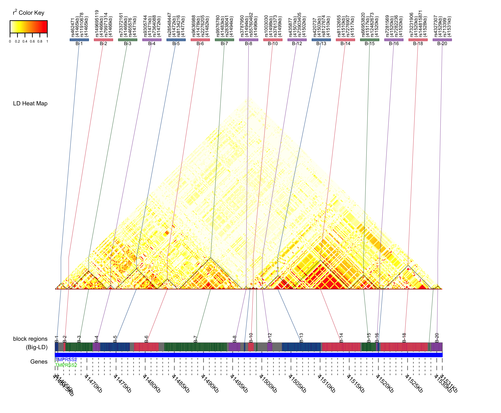
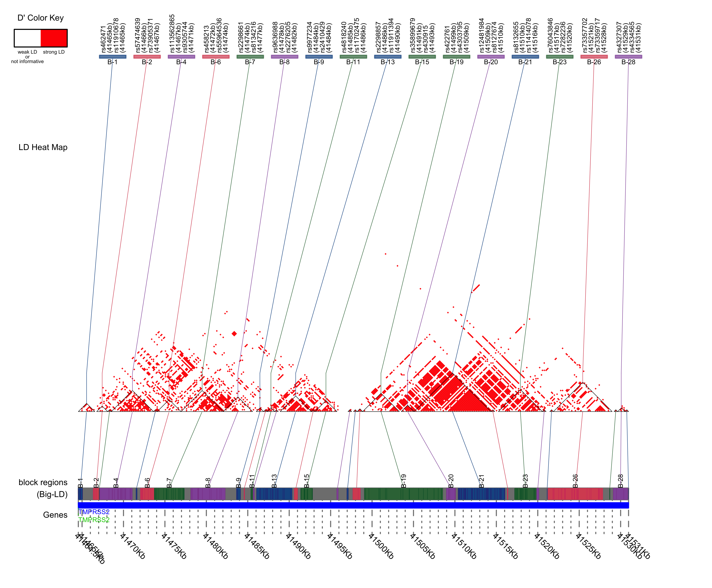

```{r,echo=F}
library(knitr)
```

```{css,echo=F}
.sccCode {
background-color: black;
color: white;
}
```

## Introduction to Linkage Disequilibrium (LD)

***

### [Homework for Lab 3: DUE Monday, October 26th](https://fuzzyatelin.github.io/AN333_Fall20/Lab3_Homework.html)

***

**Readings**:<ul> 
<li>[Wooster L, Nicholson CJ, Sigurslid HH, Lino Cardenas CL, Malhotra R. *Preprint accessed 31AUG20*. Polymorphisms in the ACE2 locus associate with severity of COVID-19 infection. *medRxiv* doi:10.1101/2020.06.18.20135152](https://www.medrxiv.org/content/10.1101/2020.06.18.20135152v1.full.pdf)</li><br>
<li>[Cheng Z., et al. 2015. Identification of *TMPRSS2* as a susceptibility gene for severe 2009 pandemic A(H1N1) influenza and A(H7N9) influenza. *The Journal of Infectious Diseases*, 212(8):1214–1221.](https://academic.oup.com/jid/article/212/8/1214/2193475)</li><br>
<li>[Slatkin M. 2008. Linkage disequilibrium – understanding the evolutionary past and mapping the medical future. *Nat Rev Genet* 9: 477-485.](https://www.nature.com/articles/nrg2361)</li><br>
<li>[Zeberg H, Pääbo S. 2020. The major genetic risk factor for severe COVID-19 is inherited from Neanderthals. *Nature* 2998. ](https://www.nature.com/articles/s41586-020-2818-3)</li><br>
<li>[Claiborne Stephens J, Schneider JA, Tanguay DA, Choi J, Acharya Y, Stanley SE, Jiang R, *et al*. 2001. Haplotype variation and linkage disequilibrium in 313 human genes. *Science* 293: 489-93.](http://science.sciencemag.org/content/293/5529/489)</li></ul><br>

***

As we learned in class, ***LD*** is the non-random assortment of alleles at different loci across the genome. Linked alleles will frequently travel with each other during crossover events during meiosis, and if we know LD is high between two alleles present in a population we can even use the frequency of one allele to predict the frequency of the other allele. Today, we will look at LD within *TMPRSS2* in our own populations to get both a sense of the amount of linkage present within the gene, and what that linkage can tell us about our assigned population's history.
<br>

### Our Focal SNPs

In the [Cheng *et al*. (2015)](https://academic.oup.com/jid/article/212/8/1214/2193475) paper that you read, they looked at several SNPs within *TMPRSS2* that were thought to be associated with greater susceptibility to H7N9 influenza infections: including *rs2070788*, *rs383510* and *rs4816720*. The results of their analyses suggested that both *rs2070788* and *rs383510* were directly associated with flu severity in the sample under investigation. One of the other two alleles, however -  *rs4816720* - was found to be inlinkage with *rs2070788*. We will take a closer look at these three SNPs in our own populations, as well as the SNP in *TMPRSS2* called *rs12329760*, associated with prostate cancer according the Maekawa et al. paper from [Module 2](https://fuzzyatelin.github.io/AN333_Fall20/Lab2_Module.html). 
<br>

### A Note On *D'* and *R<sup>2</sup>*

We will be using two statistics to gauge LD in our populations: ***D'*** (pronounced 'D prime') and ***R^2^*** (pronounced 'R-squared'). Both of these are useful for determining the amount of linkage between two SNPs, but each statistic tells us something slightly different.<br> 

* *D'* is slightly easier to understand, as it simply is a measure of the predictability of one SNP's genotype based on the other. When *D'* = 1, the two SNPs are in perfect LD (meaning that they will *always* co-segregate, or be inherited together as a unit), and when *D'* = 0 the two SNPs are in Linkage Equilibrium (meaning that co-segregation is random, or around 50%).<br> 

* *R^2* is a little bit different. This statistic will also take into account the *frequency* of the allele in question. If one SNP genotype is linked to another, but the linked genotype of one SNP is the *minor* allele (less common than the other genotype), the *R^2^* value will be *lower* than the *D'* value. This does not make the SNPs any less linked, but is rather taking into account the (lower) allele frequency. 

### Learning Outcomes

* Learn about the SNPs *rs2070788*, *rs383510*, *rs4816720*, and *rs12329760* and their roles in disease susceptibility.

* Learn how to use the *R* package *SNPStats* to perform LD analysis in a population, including constructing LD matrices and LD heatmaps.

* Learn about the two statistics *D'* and *R<sup>2</sup>*, which are the most commonly used statistics to evaluate LD between SNPs. Learn what each can tell us about a population, and apply the two statistics to our own populations.

* Learn how to use *Ensembl* to look at long-distance LD between SNPs in *TMPRSS2*, as well as for SNPs in other genes.
<br>

## Step 1: Getting to *R Studio* and Preparing your Data

Log in to the *SCC On Demand* and bring up the *R Studio* window [like we did in the last module](https://fuzzyatelin.github.io/AN333_Fall20/Lab2_Module.html): 

Now that we're in *R*, we can prepare our data for analysis. The functions we will use today require our VCF data to be in a special format called a *SNPMatrix*, so we'll convert our data in to a *SNPMatrix* now. As usual, I will use the population YRI again as an example; change all YRI code to *your* population code! 
<br>

First, we'll nned to install a few packages:
```{r,eval=F,echo=T}
install.packages("devtools")
library(devtools)
install.packages("BiocManager")
library(BiocManager)
devtools::install_github("SFUStatgen/LDheatmap")
BiocManager::install("snpStats")
BiocManager::install("VariantAnnotation")
BiocManager::install("GenomicFeatures")
BiocManager::install("gpart")
```

And then we'll load the packages we will be using:
```{r, results='hide', message=F, warning=F}
library(tidyverse)
library(snpStats)
library(VariantAnnotation)
library(LDheatmap)
```
<br>
Next, we will load in our data, in this case the VCF file of all the SNPs in *TMPRSS2* (for me called ***TMPRSS2_YRI.vcf***) in to our *R* space first, and then use another function to transform them into *SNPMatrices*.<br>

We'll start with the full *TMPRSS2* file. Copy this code with the name of your VCF file. The *hg19* option is telling the function to align our data with the 'hg19' human reference genome, which comes with the package *VariantAnnotation*:
```{r}
TMPRSS2vcf <- readVcf("TMPRSS2_YRI.vcf.gz", "hg19")
```

Next, we'll convert it to a *SNPMatrix*. Remember to replace "YRI" with the acronym for *your* population:

```{r}
TMPRSS2matrix <- genotypeToSnpMatrix(TMPRSS2vcf)
TMPRSS2matrix #repeating the file name will show you what it looks like
```
<br>
One error message you might notice is "*variants with >1 ALT allele are set to NA non-single nucleotide variations are set to NA*". This means that loci with 3 or more alleles are *not* included in any of these analyses. Because of this, you may notice a lot of what *appears* to be linkage *equilibrium* when making your charts, but this is merely due to the functions' inability to process LD between SNPs with more than 2 alleles. <br>

You may also notice that the output of the *YRImatrix* gives us some information about our data. Under "*$genotypes*" you'll see that our *SNPMatrix* has a column and row count, and that our columns ("Col") are comprised of *dbSNP* or *Variant ID* names, while our rows ("Row") are comprised of the individual sample codes from the 1000 Genomes Project. You can use this information to count both how many SNPs and how many individuals are in your database. In my case, I've got 108 individuals in the YRI population, typed at 2246 variants.<br>

Repeat this process with your *ACE2* dataset: 

```{r}
ACE2vcf <- readVcf("ACE2_YRI.vcf.gz", "hg19")

ACE2matrix <- genotypeToSnpMatrix(ACE2vcf)
head(ACE2matrix)
```
<br>
Notice, here, that the *ACE2* file has many fewer SNPs: 333 columns rather than 2246. This could mean two things: either the *ACE2* gene region is smaller than *TMPRSS2*, or the *ACE2* region simply has less variation. Which do you think is the case, and what might that mean about the evolution of each gene? <br>

As you may have already noticed from the output, as well, the *SNPMatrix* files we made are actually two separate files under one file name, and only one of them is the actual *SNPMatrix*. In order to call only the *SNPMatrix* in our functions, we will modify the name with "*$genotypes*" after our *SNPMatrix* name. You will see this in our following analyses. 
<br> 

## Step 2: Using the "ld" Function 

Next, we will be using a function from the *snpStats* package to look at LD across the *TMPRSS2* gene. To do this, we will use the "ld" function to create an LD matrix, which we will then graph to comprehend better. First, we'll use the "ld" function, like so: 
<br>
```{r}
#For "Stats," use "R.squared" for now. We will explore D' later.
LD <- ld(TMPRSS2matrix$genotypes, depth = 2245, stats = "R.squared")
```
<br>
If you type `LD` into your console, you'll see the  large matrix of R^2 LD values you've just created, which is probably fairly confusing on first look. An LD analysis output like this can be hard to interpret without a visual aid, so let's build one! The output of this function (our "LD" object) is what we'll use as an input to visualize these LD values. 

```{r}
#sets color scale for the graph
cols = colorRampPalette(c("yellow", "red"))(10)
#building the image 
image(LD, lwd = 0, cuts= 9, col.regions=cols, colorkey=TRUE)
```

You can see from the figure here in the module that much of this gene in the YRI population shows very *low* LD (consulting the scale on the right, that would be the yellow regions), meaning that these regions are segregating randomly. White regions represent those SNPs that were excluded due to having more than 2 alleles. The regions in *red* are those regions that have very *high* LD, suggesting non-random segregation. Large, contiguous regions of red (like the one we can see in the YRI population between 1500 and 1700) are what we might call *linkage blocks*, or larger contiguous areas along the genome with consistently high linkage. What could this mean about these regions of the gene?  

## Step 3: Measuring LD in our SNPs of Interest

Now, we will focus on four SNPs in particular: *rs2070788*, *rs383510*, *rs4816720*, and *rs12329760*. Now, three of these you read about in the homework as being either SNPs related to H7N9 flu severity or prostate cancer. 
<br>
<br>
What we will be doing now is creating *two* LD heatmaps, one that displays the *R<sup>2</sup>* LD statistics and one that displays the *D'* (pronounced "D prime") LD statistics. As we discussed in the introduction, these two statistics don't tell us quite the same things about our data, so comparing the two statistics can be useful in making conclusions about LD in your populations
<br>
<br>
First, we will need a list of all positions in our VCF files:
```{bash, eval = F, echo = T, class.source="sccCode"}
grep -v "^##" TMPRSS2_YRI.vcf | cut -f1-3 > TMPRSS2_loci.txt #Get list of variant sites for TMPRSS2
grep -v "^##" ACE2_YRI.vcf | cut -f1-3 > ACE2_loci.txt #Get list of variant sites for ACE2
```
<br>
<br>
And import them into *R*:
```{r}
positions_TMPRSS2<-read.table("TMPRSS2_loci.txt")
positions_TMPRSS2<-positions_TMPRSS2$V2
positions_ACE2<-read.table("ACE2_loci.txt")
positions_ACE2<-positions_ACE2$V2
```
<br>
<br>
Now, here is the code to create the LD heatmap showing the *R^2^* statistic (notice where I've entered the names of our SNPs of interest, to note their locations on the heatmap): 
<br>
```{r}
R2heatmapTMPRSS2 <- LDheatmap(TMPRSS2matrix$genotypes,
                           genetic.distances=positions_TMPRSS2,
                           distances="physical",
                           LDmeasure="r",
                           title="Pairwise LD with R^2",
                           add.map=TRUE, add.key=TRUE,
                           geneMapLocation=0.15,
                           SNP.name=c("rs2070788", "rs383510", "rs4816720",
                                      "rs12329760"),
                           color=NULL, newpage=TRUE,
                           name="TMPRSS2 LD Heatmap (R^2)")
```
<br><br>

This looks nice, but it's still pretty difficult to see LD blocks... there's an even better visualization tool in the {gpart} package for clearly seeing independent linkage blocks.
```{r,message=F,warning=F}
library(gpart)

tmprss2_res1 = BigLD(genofile = "TMPRSS2_YRI.vcf",LD="r2")
tmprss2_res1
```

Here, we can see that the *BigLD* algorithm has divided the YRI genomic region into 20 distinct linkage blocks, giving us both starting and ending positions for each.  Using the row number (1-20) to name them, which linkage block(s) contain our SNPs of interest?

Now, let's visualize these linkage blocks produced by {gpart}. This code will create a helpful LD heatmap figure in your working directory called `heatmap_tmprss2_r2.png`. You'll need to import it to your desktop using *CyberDuck* or *MobaXTerm* to open it. Let's take a look:
```{r,message=F,warning=F}
nowcex=0.5
LDblockHeatmap(genofile = "TMPRSS2_YRI.vcf", chrN = 21, geneDB = "ensembl", assembly = "GRCh38", geneid = "hgnc_symbol", blocktype="bigld", LD="r2", type="png", filename = "heatmap_tmprss2_r2", CLQmode = "density", res = 600)
```


This image is a LOT more helpful! It allows us to visualize distinct blocks of LD that are statistically partitioned by the package, and also gives us a range of SNP IDs and positions into which we might map SNPs of interest not explicitly listed.

Next, we'll make the graph displaying the *D'* statistic: 
<br>

```{r}
DheatmapTMPRSS2 <- LDheatmap(TMPRSS2matrix$genotypes,
                           genetic.distances=positions_TMPRSS2,
                           distances="physical",
                           LDmeasure="r",
                           title="Pairwise LD with D'",
                           add.map=TRUE, add.key=TRUE,
                           geneMapLocation=0.15,
                           SNP.name=c("rs2070788", "rs383510", "rs4816720",
                                      "rs12329760"),
                           color=NULL, newpage=TRUE,
                           name="TMPRSS2 LD Heatmap (D')")
```
<br><br> 

Again, this mode of visualization isn't particularly helpful... let's take a look using {gpart}:

```{r,message=F,warning=F}
library(gpart)

tmprss2_res1 = BigLD(genofile = "TMPRSS2_YRI.vcf", LD="Dprime")
tmprss2_res1
```

Here, we can see that, using the *D'* measure, the *BigLD* algorithm has divided the YRI genomic region into 29 distinct linkage blocks, giving us both starting and ending positions for each.  Using the row number (1-29) to name them, which linkage block(s) contain our SNPs of interest? Are any of our SNPs now in different linkage blocks than before?

Now, let's visualize these linkage blocks using {gpart}, which will divide them visually into strong and weak LD (this means that blocks showing only weak LD will not be explicitly visualized on the graph). This will create a file called `heatmap_tmprss2_Dp.png`. Let's take a look now:
```{r,message=F,warning=F}
nowcex=0.5
LDblockHeatmap(genofile = "TMPRSS2_YRI.vcf", chrN = 21, geneDB = "ensembl", assembly = "GRCh38", geneid = "hgnc_symbol", blocktype="bigld", LD="Dp-str", type="png", filename = "heatmap_tmprss2_Dp", CLQmode = "density", res = 600)
```



Once again, this is MUCH more helpful!

Now you've got several graphs that you can use to investigate LD in your gene region! You can see specifically whether or not the SNPs of interest (the labelled SNPs) are in LD by finding where on the graph their paths intersect, or by looking for their linkage block by position in the LD block analysis output. For the purpose of reporting your pairwise LD results, we can look at something called an *LD matrix* that was generated by the *LDheatmap* function. This is a matrix where the row and column names are SNP ID numbers, and the cell at the intersection of a row and a column will tell you the LD statistic for those two particular SNPs. For our purposes, you do not need to look at the whole chart, you just need to find the intersections of our four SNPs of interest to see if any of them are in LD, and what that LD value is for each respective statistical test. 
<br>
<br>
To view your reduced LD matrices, run these two chunks of code separately: 
<br>

```{r}
#for R squared LD heatmap: 
R2LD<-as.data.frame(R2heatmapTMPRSS2$LDmatrix)
snp<-rownames(R2LD)

R2LD<-
  R2LD %>%
  mutate(snp = snp) %>%
  dplyr::select(snp,rs2070788,rs383510,rs4816720,rs12329760) %>%
  filter(snp == "rs2070788" |
         snp == "rs383510" |
         snp == "rs4816720" |
         snp == "rs12329760")
R2LD
```

```{r}
#for D prime LD heatmap: 
DpLD<-as.data.frame(DheatmapTMPRSS2$LDmatrix)
snp<-rownames(DpLD)

DpLD<-
  DpLD %>%
  mutate(snp = snp) %>%
  dplyr::select(snp,rs2070788,rs383510,rs4816720,rs12329760) %>%
  filter(snp == "rs2070788" |
         snp == "rs383510" |
         snp == "rs4816720" |
         snp == "rs12329760")
DpLD
```

Does LD appear to correlate with physical distance among these SNPs, according to your LDheatmap images?

## Step 4: Using *Ensembl* to Look for More SNPs in LD 

The last thing we'll do in this lab is look at *Ensembl*'s information on LD for each of the SNPs we studied today in your populations. <br>
To do this: 
<br>

* Go to [*Ensembl*](https://useast.ensembl.org/Homo_sapiens/Info/Index) and search for *TMPRSS2* in the Human search bar as we have done before

* Use the left sidebar to navigate to the *Variant Table*:
<br>


<br><br>

* Pick one of the variants we looked at today (*rs2070788*, *rs383510*, *rs461194*, and *rs12329760*) and enter it in the *Variant Table* search bar. Make note of what kind of consequence each SNP has. What does the consequence mean, and how might the consequence of a SNP affect its LD?


* Click on the Variant ID of the SNP you searched to get the SNP page. Click on the "*Linkage Disequilibrium*" tab under "*Explore This Variant*"
<br>


<br>

* You will get this page. This should look familiar, because we visited it briefly in our introductory lab. You will get a page like this that has LD plots of the SNP for all of the 1000 Genomes populations. 
<br>


<br>

* You can play around with the LD calculator and the LD plots, but the first thing you should do is find *your* population in the table and click on the "*show*" button for "*Variants in High LD*". You will get this: 
<br>


<br>

* Some populations will have more SNPs in high LD than others. Look specifically at the SNPs in high LD that are *not* in *TMPRSS2*. In the example above, there are SNPs listed in the gene *BMX* in high linkage with several variants in *ACE2*. 

* Repeat this process for all four SNPs we looked at in today's lab. Where are the high LD SNPs that aren't in *TMPRSS2* located? Are any of them located in other gene regions? 

## Step 5: What Do Your Results Mean? Discuss with a partner from class: 

Think about the results you produced today in the context of your population. Here are some guiding questions to help you: 
<br>

* What does it mean for two SNPs in your population to be in LD? How would two obesity SNPs being in LD reflect selection in that population? 

* Would you expect a high level of LD to develop in *TMPRSS2* in your population based on its pandemic context? Why or why not? 

* What would LD between two COVID-19-related SNPs tell you about the evolutionary history of your population? 

* If you found any SNPs in high LD with our *TMPRSS2* SNPs during the *Ensembl* exercise that are in a different gene, do a quick [OMIM](http://omim.org/) search on the gene(s). What does that gene code for? How might it be connected to *TMPRSS2*? 
<br>
<br>