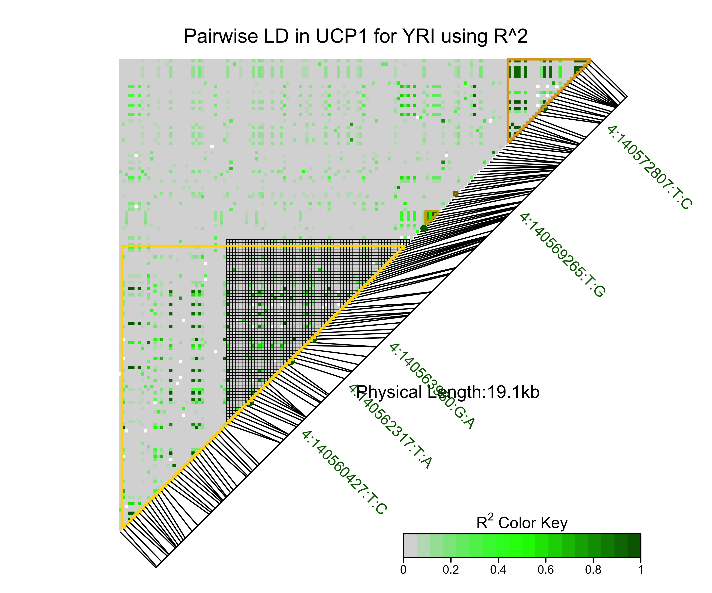

```{r,echo=F}
library(knitr)
setwd("/Users/christopheraschmitt/fuzzyatelin.github.io/fuzzyatelin.github.io/AN333_Fall24/")
```

```{css,echo=F}
.sccCode {
background-color: black;
color: white;
}
```

## Introduction to Linkage Disequilibrium (LD)

***

### [Homework for Lab 3: DUE Monday, October 28th](https://fuzzyatelin.github.io/AN333_Fall24/Lab3_Homework.html)

***

**Readings**:<ul> 
<li>[Cha MH, Kim KS, Suh D, Chung S-I, Yoon Y. 2008. A UCP1-412A>C polymorphism is associated with abdominal fat area in Korean women. *Hereditas* 145(5): 231-237.](https://onlinelibrary.wiley.com/doi/full/10.1111/j.1601-5223.2008.02071.x)</li><br>
<li>[Ramos AV, Bastos-Rodriguez L, Resende BA, Friedman E, Campanha-Versiani L, Miranda DM, Sarquis M, De Marco L. 2012. The contribution of *FTO* and *UCP-1* SNPs to extreme obesity, diabetes and cardiovascular risk in Brazilian individuals. *BMC Med Genet* 13:101.](https://www.ncbi.nlm.nih.gov/pmc/articles/PMC3526455/)</li><br>
<li>[Slatkin M. 2008. Linkage disequilibrium – understanding the evolutionary past and mapping the medical future. *Nat Rev Genet* 9: 477-485.](https://www.nature.com/articles/nrg2361)</li><br>
<li>[Claiborne Stephens J, Schneider JA, Tanguay DA, Choi J, Acharya Y, Stanley SE, Jiang R, *et al*. 2001. Haplotype variation and linkage disequilibrium in 313 human genes. *Science* 293: 489-93.](http://science.sciencemag.org/content/293/5529/489)</li></ul>

***

As we learned in class, ***LD*** is the non-random assortment of alleles at different loci across the genome. Linked alleles will frequently travel with each other during crossover events during meiosis, and if we know LD is high between two alleles is present in a population we can even use the frequency of one allele to predict the frequency of the other allele. Today, we will look at LD within *UCP1* in our own populations to get both a sense of the amount of linkage present within the gene, and what that linkage can tell us about our assigned population's history.
<br>

### Our Focal SNPs

In the [Ramos *et al*. (2012)](https://www.ncbi.nlm.nih.gov/pmc/articles/PMC3526455/) paper that you read for this module, they looked at 3 SNPs within *UCP1* that were thought to be associated with obesity:  *rs6536991* (4:140560427), *rs2270565* (4:140562317) and *rs12502572* (4:140563980). The results of their analyses suggested that only *rs6536991* was directly associated with obesity in the Brazilian population under investigation. The other two alleles, however -  *rs2270565* and *rs12502572* - were found to be in various levels of linkage with *rs6536991*. We will take a closer look at these three SNPs in our own populations, as well as two other SNPs in *UCP1* called *rs3811787* (4:140569265) and the famous *rs1800592* (4:140572807), which [Cha *et al.* (2008)](https://onlinelibrary.wiley.com/doi/full/10.1111/j.1601-5223.2008.02071.x) found to be associated with abdominal fat stores in a population of Korean women. 
<br>

### A Note On *D'* and *r<sup>2</sup>*

We will be using two statistics to gauge LD in our populations: Lewontin's ***D'*** (pronounced 'D prime') and ***r<sup>2</sup>*** (pronounced 'r-squared'). Both of these are useful for determining the amount of linkage between two SNPs, but each statistic tells us something slightly different.<br> 

* *D'* is slightly easier to understand, as it simply is a measure of the predictability of one SNP's genotype based on the other. When *D'* = 1, the two SNPs are in perfect LD (meaning that they will *always* co-segregate, or be inherited together as a unit), and when *D'* = 0 the two SNPs are in Linkage Equilibrium (meaning that co-segregation is random, or around 50%).<br> 

* *r<sup>2</sup>* is a little bit different. This statistic will also take into account the *frequency* of the allele in question. If one SNP genotype is linked to another, but the linked genotype of one SNP is the *minor* allele (less common than the other genotype), the *r<sup>2</sup>* value will be *lower* than the *D'* value. This does not make the SNPs any less linked, but is rather taking into account the (lower) allele frequency. 

### Learning Outcomes

* Learn about the SNPs *rs6536991*, *rs2270565*, *rs12502572*, *rs3811787*, and *rs1800592* and their roles in human obesity.

* Learn how to use various *R* packages to perform LD analysis in a population, including constructing LD matrices and LD heatmaps.

* Learn about the two statistics *D'* and *r<sup>2</sup>*, which are the most commonly used statistics to evaluate LD between SNPs. Learn what each can tell us about a population, and apply the two statistics to our own populations.

* Learn how to use *EnsEMBL* to look at long-distance LD between SNPs in *UCP1*, as well as for SNPs in other genes.
<br>

## Step 1: Getting to *R Studio* and Preparing your Data

Log in to the *SCC On Demand* and bring up the *R Studio* window [like we did in the last module](https://fuzzyatelin.github.io/AN333_Fall24/Lab2_Module.html): 

Now that we're in *R*, we can prepare our data for analysis. The functions we will use today require our VCF data to be in a special format called a *SNPMatrix*, so we'll convert our data in to a *SNPMatrix* now. As usual, I will use the population YRI again as an example; change all YRI code to *your* population code! 
<br>

First, we'll need to install a few packages (remember to always say 'yes' to downloading dependencies!):
```{r,eval=F,echo=T}
install.packages("devtools")
library(devtools)
install.packages("BiocManager")
library(BiocManager)
BiocManager::install("snpStats")
BiocManager::install("VariantAnnotation")
devtools::install_github("SFUStatgen/LDheatmap")
devtools::install_github("felix-clark/gpart")
install.packages("geneHapR")
```

And then we'll load the packages we will be using:
```{r, results='hide', message=F, warning=F}
library(tidyverse)
library(snpStats)
library(vcfR)
library(LDheatmap)
```
<br>
Next, we will load in our data, in this case the VCF file of the extended area of SNPs in *UCP1* (for me called ***UCP1_YRI_REGION.vcf***) in to our *R* space first, and then use another function to transform them into *SNPMatrices*.<br>

We'll start with the full *UCP1* file that you made for your Homework for Module 1 (which should include 5,000 or 10,000 bp up- and down-stream of the gene region itself. Remember to replace `YRI` with the acronym for *your* population, and `caschmit` with your own named directory:
```{r,eval=F,echo=T}
UCP1vcf <- read.vcfR("/projectnb/anth333/caschmit/UCP1_YRI_REGION.vcf")
```
```{r,eval=T,echo=F}
UCP1vcf <- read.vcfR("UCP1_YRI_REGION.vcf")
```

Next, we'll convert it to a *SNPMatrix*. Let's take a look: 

```{r}
UCP1matrix <- vcfR2SnpMatrix(UCP1vcf)
UCP1matrix #repeating the file name will show you what it looks like
```
<br>

You may notice that the output of the *UCP1matrix* gives us some information about our data. Under `$genetic.distances` you'll see that our *SNPMatrix* includes physical positions on the chromosome, and that our `$subjectID` is comprised of our sample names, while our genotype data are contained in the `$data` slot. You can use this information to count both how many SNPs and how many individuals are in your database. In my case, I've got 108 individuals in the YRI population, typed at 150 variants. Your population and variant count might differ, as when we created out VCF files we restricted to one sample population, and also cut out variant sites that were homogenous (i.e., had no variation across our individual populations).<br>
<br> 

## Step 2: Using the `ld` Function 

Next, we will be using a function from the {snpStats} package to look at LD across the *UCP1* gene. To do this, we will use the `ld` function to create an LD matrix, which we will then graph to comprehend better. First, we'll use the `ld` function, like so (you should set the `depth` number to one value *less* than the number of variants in your VCF file): 
<br>
```{r}
#For "Stats," use "R.squared" for now. We will explore D' later.
LD <- snpStats::ld(UCP1matrix$data, depth = 149, stats = "R.squared")
```
<br>
If you type `LD` into your console, you'll see the  large matrix of r<sup>2</sup> LD values you've just created, which is probably fairly confusing on first look. An LD analysis output like this can be hard to interpret without a visual aid, so let's build one! The output of this function (our `LD` object) is what we'll use as an input to visualize these LD values. 

```{r}
#sets color scale for the graph
cols = colorRampPalette(c("yellow", "red"))(10)
#building the image 
image(LD, lwd = 0, cuts= 9, col.regions=cols, colorkey=TRUE)
```

You can see from the figure here in the module that much of this gene in the YRI population shows very *low* LD (consulting the scale on the right, that would be the yellow regions), meaning that these regions are segregating randomly. The regions in *red* are those regions that have very *high* LD, suggesting non-random segregation. Large, contiguous regions of red are what we might call *linkage blocks*, or larger contiguous areas along the genome with consistently high linkage. What could this mean about these regions of the gene?  

## Step 3: Measuring LD in our SNPs of Interest

Now, we will look at our smaller dataset so we can focus on five SNPs in particular: *rs6536991* (4:140560427), *rs2270565* (4:140562317), *rs12502572* (4:140563980), *rs3811787* (4:140569265), and *rs1800592* (4:140572807). Now, three of these you read about in the homework as being either SNPs related to obesity, or in moderate linkage with obesity-related SNPs, in a Brazilian population; while the final two were associated with abdominal obesity in a Korean population of women. Let's see what they look like in *our* populations.
<br>
<br>
What we will be doing now is creating *two* LD heatmaps, one that displays the *r<sup>2</sup>* LD statistics and one that displays the *D'* LD statistics. As we discussed in the introduction, these two statistics don't tell us quite the same things about our data, so comparing the two statistics can be useful in making conclusions about LD in your populations.
<br>
<br>

Now, here is the code to create the LD heatmap showing the *r<sup>2</sup>* statistic (notice where I've entered the names of our SNPs of interest, to note their locations on the heatmap): 
<br>
```{r}
R2heatmapUCP1 <- LDheatmap(UCP1matrix$data,
                           genetic.distances=UCP1matrix$genetic.distances,
                           distances="physical",
                           LDmeasure="r",
                           title="Pairwise LD in UCP1 for YRI using R^2",
                           add.map=TRUE, add.key=TRUE,
                           geneMapLocation=0.15,
                           SNP.name=c("4:140560427:T:C", "4:140562317:T:A",
                                      "4:140563980:G:A", "4:140569265:T:G",
                                      "4:140572807:T:C"),
                           color=NULL, newpage=TRUE,
                           name="UCP1 LD Heatmap (R^2)")
```
<br><br>

This looks nice, but it's still pretty difficult to see LD blocks... if you want to prettify your LD heatmap, you can check out [this resource here](https://sfustatgen.github.io/LDheatmap/reference/LDheatmap.html), which is where I got the code for the color modifications, below (which I find easier to read than grayscale or yellow/red). You can see the codes and how they modify the heatmap as I move along, below:
```{r,results="hide",message=F}
#This code establishes the color palette for the heatmap
rgb.palette <- colorRampPalette(rev(c("grey85", "green", "darkgreen")), space = "rgb")

#This code will save the subsequent plot
png(filename="R2heatmapUCP1_YRI.png",units="in",res=600,width=6,height=5)

#Here's the code for the heatmap itself
R2heatmapUCP1 <- LDheatmap(UCP1matrix$data,
                           genetic.distances=UCP1matrix$genetic.distances,
                           distances="physical",
                           LDmeasure="r",
                           title="Pairwise LD in UCP1 for YRI using R^2",
                           add.map=TRUE, add.key=TRUE,
                           geneMapLocation=0.15,
                           SNP.name=c("4:140560427:T:C", "4:140562317:T:A",
                                      "4:140563980:G:A", "4:140569265:T:G",
                                      "4:140572807:T:C"),
                           color=rgb.palette(18), newpage=TRUE,
                           name="R2heatmapUCP1")

#There is USUALLY a way to add the gene map to this... but UCSC Genome Browser recently changed they way their website works, so this is broken, for now.
#addGenes <- LDheatmap.addGenes(R2heatmapUCP1, chromosome="chr4",genome="hg38")
#addRecomb <- LDheatmap.addRecombRate(R2heatmapUCP1, chr="chr4", genome="hg38")

#Here we're editing the symbols
grid::grid.edit("symbols", pch = 16, gp = grid::gpar(cex = 0.5,col="darkgreen"))
#And here we're editing the SNP names
grid::grid.edit("SNPnames", gp = grid::gpar(cex=0.75,col="darkgreen"))
#and this closes the plot
dev.off()
```


We can also add in an outline of the gene region, if that helps you to imagine where exactly all this LD is occurring:
```{r,results="hide",message=F}
#This code establishes the color palette for the heatmap
rgb.palette <- colorRampPalette(rev(c("grey85", "green", "darkgreen")), space = "rgb")

#This code will save the subsequent plot
png(filename="R2heatmapUCP1_YRI_Gene.png",units="in",res=600,width=6,height=5)

#Here's the code for the heatmap itself
R2heatmapUCP1 <- LDheatmap(UCP1matrix$data,
                           genetic.distances=UCP1matrix$genetic.distances,
                           distances="physical",
                           LDmeasure="r",
                           title="Pairwise LD in UCP1 for YRI using R^2",
                           add.map=TRUE, add.key=TRUE,
                           geneMapLocation=0.15,
                           SNP.name=c("4:140560427:T:C", "4:140562317:T:A",
                                      "4:140563980:G:A", "4:140569265:T:G",
                                      "4:140572807:T:C"),
                           color=rgb.palette(18), newpage=TRUE,
                           name="R2heatmapUCP1")

#There is USUALLY a way to add the gene map to this... but UCSC Genome Browser recently changed they way their website works, so this is broken, for now.
#addGenes <- LDheatmap.addGenes(R2heatmapUCP1, chromosome="chr4",genome="hg38")
#addRecomb <- LDheatmap.addRecombRate(R2heatmapUCP1, chr="chr4", genome="hg38")

#Highlight UCP1 gene region... remember, it's 4:140559431-140568961. In my SNPMatrix, this translates to rows 35-93; it may translate to *different* rows in your own!:

LDheatmap.highlight(R2heatmapUCP1, i = 35, j = 93, fill = "NA", col = "black", lwd = 0.5,lty = 1,flipOutline=FALSE, crissCross = TRUE)

#Here we're editing the symbols
grid::grid.edit("symbols", pch = 16, gp = grid::gpar(cex = 0.5,col="darkgreen"))
#And here we're editing the SNP names
grid::grid.edit("SNPnames", gp = grid::gpar(cex=0.75,col="darkgreen"))
#and this closes the plot
dev.off()
```


As you can see on first glance, there is *potentially* one large linkage block in the *UCP1* region of the YRI population, starting downstream (beyond the end) of the gene region. Remember, *UCP1* is on the reverse strand, so the gene is read from higher positions to lower positions, meaning that positions lower than the lowest numner in the gene's position range are are *downstream* of the gene). It also looks like there may be a few small regions of LD in the *upstream* region of the gene, near our regulatory SNPs from the Cha *et al.* (2008) paper... one immediately upstream of the gene (in what may be the promoter region), and one much further.

There are a few things we can do to figure out exactly where these significant regions of LD actually are beyond just eyeballing them...

Maybe the easiest is a tool in the {gpart} package called `BigLD`, which will help us statistically identify the positions of independent linkage blocks in our gene region:
```{r,message=F,warning=F,eval=F}
library(gpart)
ucp1_res = BigLD(genofile = "/projectnb/anth333/caschmit/UCP1_YRI_REGION.vcf",LD="r2")
ucp1_res
```
```{r,message=F,warning=F,eval=T,echo=F}
library(gpart)
ucp1_res = BigLD(genofile = "UCP1_YRI_REGION.vcf",LD="r2")
ucp1_res
```
As you can see, {gpart} has identified *four* significant blocks of LD in the YRI population across our *UCP1* gene region... let's take a look at where these regions are by mapping them onto our `LDheatmap` object:
```{r}
#This code establishes the color palette for the heatmap
rgb.palette <- colorRampPalette(rev(c("grey85", "green", "darkgreen")), space = "rgb")

#This code will save the subsequent plot (notice the name change!)
png(filename="R2heatmapUCP1_YRI_LDblocks.png",units="in",res=600,width=6,height=5)

#Here's the code for the heatmap itself (nothing's changed here):
R2heatmapUCP1 <- LDheatmap(UCP1matrix$data,
                           genetic.distances=UCP1matrix$genetic.distances,
                           distances="physical",
                           LDmeasure="r",
                           title="Pairwise LD in UCP1 for YRI using R^2",
                           add.map=TRUE, add.key=TRUE,
                           geneMapLocation=0.15,
                           SNP.name=c("4:140560427:T:C", "4:140562317:T:A",
                                      "4:140563980:G:A", "4:140569265:T:G",
                                      "4:140572807:T:C"),
                           color=rgb.palette(18), newpage=TRUE,
                           name="R2heatmapUCP1")

#There is USUALLY a way to add the gene map to this... but UCSC Genome Browser recently changed they way their website works, so this is broken, for now.
#addGenes <- LDheatmap.addGenes(R2heatmapUCP1, chromosome="chr4",genome="hg38")
#addRecomb <- LDheatmap.addRecombRate(R2heatmapUCP1, chr="chr4", genome="hg38")

#Highlight UCP1 gene region... remember, it's 4:140559431-140568961. In my SNPMatrix, this translates to rows 35-93; it may translate to *different* rows in your own!:

LDheatmap.highlight(R2heatmapUCP1, i = 35, j = 93, fill = "NA", col = "black", lwd = 0.5,lty = 1,flipOutline=FALSE, crissCross = TRUE)

#Here we're adding our linkage blocks using the start/end index numbers in the {gpart} output, and choosing a different color for each block:

#Block 1:
LDheatmap.highlight(R2heatmapUCP1, i = 2, j = 91, fill = "NA", col = "gold", lwd = 2,lty = 1,flipOutline=FALSE, crissCross = FALSE)

#Block 2:
LDheatmap.highlight(R2heatmapUCP1, i = 98, j = 102, fill = "NA", col = "gold3", lwd = 2,lty = 1,flipOutline=FALSE, crissCross = FALSE)

#Block 3:
LDheatmap.highlight(R2heatmapUCP1, i = 107, j = 108, fill = "NA", col = "gold4", lwd = 2,lty = 1,flipOutline=FALSE, crissCross = FALSE)

#Block 4:
LDheatmap.highlight(R2heatmapUCP1, i = 124, j = 150, fill = "NA", col = "goldenrod", lwd = 2,lty = 1,flipOutline=FALSE, crissCross = FALSE)

#Here we're editing the symbols
grid::grid.edit("symbols", pch = 16, gp = grid::gpar(cex = 0.5,col="darkgreen"))
#And here we're editing the SNP names
grid::grid.edit("SNPnames", gp = grid::gpar(cex=0.75,col="darkgreen"))
#and this closes the plot
dev.off()
```



The first, which runs from positions 140554683-140568842, appears to represent that first block we can visually identify in the downstream region of the heatmap; it contains our three SNPs we learned about from Ramos *et al.*, and indeed also contains almost the entire gene region (remember, *UCP1* runs from 140559431-140568961 on the reverse strand) and its downstream enhancer region (which runs from 140556002-140559199). 

The second linkage block, which runs from 140569304-140569826, is immediately upstream of the coding region for *UCP1*, and may represent the promoter, which runs from 140568951-140569599. How do I know that's where the promoter is? It's on *EnsEMBL*! You can see the promoter, enhancers, and their associated positions in the **Region in Detail** view on the human *UCP1* gene page. As you can see, the -412A>C variant site (rs3811787) from the Cha *et al.* (2008) paper is right near the promoter, which might explain how it affects *UCP1* function: if one of the variants at that locus alters how the promoter initiates transcription of *UCP1*, it could change *UCP1* expression.

Although the other two linkage blocks further upstream from the gene are not annotated on *EnsEMBL*, the final locus from the Cha *et al.* (2008) paper also gives us a clue regarding what these linkage blocks might represent: the larger of the two contains the famous regulatory locus Cha *et al.* identified as also having a large impact on abdominal obesity in Koren women, -3826A>G (rs1800592), suggesting that these may also be either full regulatory regions for *UCP1* that have not yet been identified as such, or that there may be LD in these areas due to selection on the regulatory effects of variants in these regions on *UCP1* function.

Next, we'll calculate and visualize LD using the *D'* statistic: 
<br>

```{r,results="hide",message=F}
#This code establishes the color palette for the heatmap
rgb.palette <- colorRampPalette(rev(c("grey85", "pink", "red")), space = "rgb")

#This code will save the subsequent plot
png(filename="DheatmapUCP1_YRI.png",units="in",res=600,width=6,height=5)

#Here's the code for the heatmap itself
DheatmapUCP1 <- LDheatmap(UCP1matrix$data,
                           genetic.distances=UCP1matrix$genetic.distances,
                           distances="physical",
                           LDmeasure="D",
                           title="Pairwise LD in UCP1 for YRI using D'",
                           add.map=TRUE, add.key=TRUE,
                           geneMapLocation=0.15,
                           SNP.name=c("4:140560427:T:C", "4:140562317:T:A",
                                      "4:140563980:G:A", "4:140569265:T:G",
                                      "4:140572807:T:C"),
                           color=rgb.palette(18), newpage=TRUE,
                           name="UCP1 LD Heatmap (D')")

#There is USUALLY a way to add the gene map to this... but UCSC Genome Browser recently changed they way their website works, so this is broken, for now.
#addGenes <- LDheatmap.addGenes(R2heatmapUCP1, chromosome="chr4")
#addRecomb <- LDheatmap.addRecombRate(R2heatmapUCP1, chr="chr4", genome="hg38")

#Highlight UCP1 gene region... remember, it's 4:140559431-140568961. In my SNPMatrix, this translates to rows 35-93; it may translate to *different* rows in your own!:

LDheatmap.highlight(DheatmapUCP1, i = 35, j = 93, fill = "NA", col = "black", lwd = 0.5,lty = 1,flipOutline=FALSE, crissCross = TRUE)

#Here we're editing the symbols
grid.edit("symbols", pch = 16, gp = gpar(cex = 0.5,col="red"))
#And here we're editing the SNP names
grid.edit("SNPnames", gp = gpar(cex=0.75,col="red"))
#and this closes the plot
dev.off()
```


<br><br> 

Notice that measuring linkage using D' appears to be fundamentally different... it looks like there is high LD across the entire chosen gene region!

Let's take a look using {gpart}:
```{r,message=F,warning=F,echo=T,eval=F}
ucp1_res1 = BigLD(genofile = "/projectnb/anth333/caschmit/UCP1_REGION_YRI.vcf", LD="Dprime")
ucp1_res1
```
```{r,message=F,warning=F,echo=F,eval=T}
ucp1_res1 = BigLD(genofile = "UCP1_YRI_REGION.vcf", LD="Dprime")
ucp1_res1
```

Here, we can see that, using the *D'* measure, the `BigLD` algorithm has divided the *UCP1* genomic region for the YRI population into 8 distinct linkage blocks, giving us both starting and ending positions for each.  Using the row number (1-8) to name them, which linkage block(s) contain our SNPs of interest? Are any of our SNPs now in different linkage blocks than before?  

Let's take a look (for this plot, I'll make the highlighted linkage blocks solid so that they can be seen better):
```{r,results="hide",message=F}
#This code establishes the color palette for the heatmap
rgb.palette <- colorRampPalette(rev(c("grey85", "pink", "red")), space = "rgb")

#This code will save the subsequent plot
png(filename="DheatmapUCP1_YRI_LDblocks.png",units="in",res=600,width=6,height=5)

#Here's the code for the heatmap itself
DheatmapUCP1 <- LDheatmap(UCP1matrix$data,
                           genetic.distances=UCP1matrix$genetic.distances,
                           distances="physical",
                           LDmeasure="D",
                           title="Pairwise LD in UCP1 for YRI using D'",
                           add.map=TRUE, add.key=TRUE,
                           geneMapLocation=0.15,
                           SNP.name=c("4:140560427:T:C", "4:140562317:T:A",
                                      "4:140563980:G:A", "4:140569265:T:G",
                                      "4:140572807:T:C"),
                           color=rgb.palette(18), newpage=TRUE,
                           name="UCP1 LD Heatmap (D')")

#There is USUALLY a way to add the gene map to this... but UCSC Genome Browser recently changed they way their website works, so this is broken, for now.
#addGenes <- LDheatmap.addGenes(R2heatmapUCP1, chromosome="chr4")
#addRecomb <- LDheatmap.addRecombRate(R2heatmapUCP1, chr="chr4", genome="hg38")

#Highlight UCP1 gene region... remember, it's 4:140559431-140568961. In my SNPMatrix, this translates to rows 35-93; it may translate to *different* rows in your own!:

LDheatmap.highlight(DheatmapUCP1, i = 35, j = 93, fill = "NA", col = "black", lwd = 0.5,lty = 1,flipOutline=FALSE, crissCross = TRUE)

#Here we're adding our linkage blocks using the start/end index numbers in the {gpart} output, and choosing a different color for each block:

#Block 1:
LDheatmap.highlight(R2heatmapUCP1, i = 2, j = 78, fill = "gold", col = "gold", lwd = 2,lty = 1,flipOutline=FALSE, crissCross = FALSE)

#Block 2:
LDheatmap.highlight(R2heatmapUCP1, i = 79, j = 80, fill = "gold3", col = "gold3", lwd = 2,lty = 1,flipOutline=FALSE, crissCross = FALSE)

#Block 3:
LDheatmap.highlight(R2heatmapUCP1, i = 97, j = 98, fill = "gold4", col = "gold4", lwd = 2,lty = 1,flipOutline=FALSE, crissCross = FALSE)

#Block 4:
LDheatmap.highlight(R2heatmapUCP1, i = 100, j = 102, fill = "goldenrod", col = "goldenrod", lwd = 2,lty = 1,flipOutline=FALSE, crissCross = FALSE)

#Block 5:
LDheatmap.highlight(R2heatmapUCP1, i = 107, j = 108, fill = "gold", col = "gold", lwd = 2,lty = 1,flipOutline=FALSE, crissCross = FALSE)

#Block 6:
LDheatmap.highlight(R2heatmapUCP1, i = 113, j = 139, fill = "gold3", col = "gold3", lwd = 2,lty = 1,flipOutline=FALSE, crissCross = FALSE)

#Block 7:
LDheatmap.highlight(R2heatmapUCP1, i = 140, j = 141, fill = "gold4", col = "gold4", lwd = 2,lty = 1,flipOutline=FALSE, crissCross = FALSE)

#Block 8:
LDheatmap.highlight(R2heatmapUCP1, i = 145, j = 150, fill = "goldenrod", col = "goldenrod", lwd = 2,lty = 1,flipOutline=FALSE, crissCross = FALSE)

#Here we're editing the symbols
grid.edit("symbols", pch = 16, gp = gpar(cex = 0.5,col="red"))
#And here we're editing the SNP names
grid.edit("SNPnames", gp = gpar(cex=0.75,col="red"))
#and this closes the plot
dev.off()
```


Now you've got several graphs that you can use to investigate LD in *your* population's gene region! You can see specifically whether or not the SNPs of interest (the labelled SNPs) are in LD by finding where on the graph their paths intersect, or by looking for their linkage block by position in the LD block analysis output. 

Now, for the purpose of reporting your pairwise LD results, we can look at something called an *LD matrix*, which is automatically generated by the `LDheatmap` function. This is a matrix where the row and column names are SNP ID numbers, and the cell at the intersection of a row and a column will tell you the LD statistic for those two particular SNPs. For our purposes, you do not need to look at the whole chart, you just need to find the intersections of our five SNPs of interest to see if any of them are in LD, and what that LD value is for each respective statistical test. 
<br>
<br>
To view your reduced LD matrices, run these two chunks of code separately: 
<br>

```{r}
#for R squared LD heatmap: 
R2LD<-as.data.frame(R2heatmapUCP1$LDmatrix)
snp<-rownames(R2LD)

R2LD<-
  R2LD %>%
  mutate(snp = snp) %>%
  dplyr::select(snp,"4:140560427:T:C","4:140562317:T:A","4:140563980:G:A","4:140569265:T:G","4:140572807:T:C") %>%
  filter(snp == "4:140560427:T:C" |
         snp == "4:140562317:T:A" |
         snp == "4:140563980:G:A" |
         snp == "4:140569265:T:G" |
         snp == "4:140572807:T:C")
R2LD
```

```{r}
#for D prime LD heatmap: 
DpLD<-as.data.frame(DheatmapUCP1$LDmatrix)
snp<-rownames(DpLD)

DpLD<-
  DpLD %>%
  mutate(snp = snp) %>%
  dplyr::select(snp,"4:140560427:T:C","4:140562317:T:A","4:140563980:G:A","4:140569265:T:G","4:140572807:T:C") %>%
  filter(snp == "4:140560427:T:C" |
         snp == "4:140562317:T:A" |
         snp == "4:140563980:G:A" |
         snp == "4:140569265:T:G" |
         snp == "4:140572807:T:C")
DpLD
```

Does LD appear to correlate with physical distance among these SNPs, according to your LDheatmap images?

## Step 4: Thinking about LD using Haplotypes

**NOTE: I added this section as an experiment for the Fall 2024 semester. If you cannot get it to work, don't worry! There are no homework questions related to this section, in case the coding is a disaster!**

Remember that when we think about LD, we can also think about *haplotypes*. A haplotype is a set of DNA variants along a single chromosome that tend to be inherited together. Given this definition, we can think of the linkage blocks we've identified as potential haplotypes. These are important because, since they tend to be inherited together recombination between them is rare; this, in turn, is important because it compels us to ask: why is recombination between alleles in this block rare?

Haplotypes can also be useful for conducting downstream geneti analyses that we'll become more familiar with later in the course, including phylogenetic analyses, because these random changes that stick in haplotypes can be used to trace population relatedness over evolutionary time.

Of course, the first step to analyzing haplotypes is identifying them... let's get started!

We'll be using a package called {geneHapR} to quickly and easily identify haplotypes in our study populations from the 1000 Genomes Project.

```{r,message=F,warning=F}
library(geneHapR)
```

Luckily for us, we can use our same imported VCF file for this analysis, but we do need to import one more piece of data: a *GFF* file. The GFF file is a file that contains gene annotation data; in other words, it indicates which positions are associated with which genes or other structures in the genome (i.e., introns, exons, regulatory regions, etc). I already downloaded a GFF file for chromosome 4 from *EnsEMBL* for us and uploaded it to the *SCC*. Let's load it into ***R*** now:
```{r,eval=F,echo=T,message=F,warning=F}
#import GFF
chrom4_gff<-import_gff("/projectnb/anth333/1KG_Chrom4/Homo_sapiens.GRCh38.112.chromosome.4.gff3")
```
```{r,eval=T,echo=F,message=F,warning=F}
#import GFF
chrom4_gff<-import_gff("Homo_sapiens.GRCh38.112.chromosome.4.gff3")
```

Now, in order to run the haplotypes, we need to get rid of duplicate POS calls in our VCF files. To do this, you may need to take a look at a portion of the VCF object:
```{r}
UCP1vcf@fix
```

You'll take the row number of each duplicate POS number and place it in the code below (for example, the position `140559713` occurs twice, so I'll put the row number of the duplicate row - for any row more than the first - in this case, `36`, in the code below). Notice I've done this for every repeated position on the list above:
```{r}
#clean out duplicate positions:
UCP1vcf@fix <- UCP1vcf@fix[-c(36,40,46,47,48,61,141,142,143),]
UCP1vcf@gt <- UCP1vcf@gt[-c(36,40,46,47,48,61,141,142,143),]
```

Now we're ready to calculate the haplotypes!
```{r}
#calculate haplotypes
hapResult <- vcf2hap(UCP1vcf,
                     hapPrefix = "H",
                     hetero_remove = TRUE,
                     na_drop = TRUE)
hapSummary <- hap_summary(hapResult)
hapSummary
```

As you can see from the output, {geneHapR} was able to construct five haplotypes from 38 different variant sites, including 29 biallelic SNPs and 9 indels. It also lists a representative sample for each haplotype.

You may be wondering why only 38 sites went into this when there are 150 loci in the VCF file... {geneHapR} automatically excludes loci where any variant has a minor allele frequency of less than 0.05 (i.e, sites where only one or two people have the minor allele). This conservative practice keeps us from assuming IBD when individuals might share those alleles by random mutation.

{geneHapR} also provides a prettified view of our haplotypes:
```{r,fig.width=30,fig.height=4,warning=F,message=F}
#haplotype table
plotHapTable(hapSummary)
```

You may notice that there are several loci that are identical across multiple haplotypes... for example, the first two loci (140554683 and 140555762) appear to segregate identically. These may represent distances in our haplotype map that have not yet been broken up by recombination; these identically segregating sites in the construction of our haplotypes can also allow us to construct *haplotype networks*. A haplotype network assumes that identical segregating sites are identical by descent (or inherited from an ancestor), while a segregating site with just one difference from the downstream pattern (like the C alelle in haplotype H004 at the third locus, 140556119; were it a T, it would also be identical to the pattern of the first two loci) represent a novel change. We can then construct networks based on counting changes across haplotypes.

Let's take a look at a haplotype network for *UCP1* in YRI, that might help us to understand better:
```{r,fig.width=5,fig.height=5}
#create haplotype network
hapNet <- get_hapNet(hapSummary,
                     groupName = "Type")

#plot haplotype network
plotHapNet(hapNet,
           size = "freq",                  # circle size
           scale = "log2",                 # scale circle with 'log10(size + 1)'
           cex = 0.8,                      # size of hap symbol
           col.link = 2,                   # link colors
           link.width = 2,                 # link widths
           show.mutation = 2,              # mutation types one of c(0,1,2,3)
           legend = c(-12.5, 7))           # legend position
```

According to our haplotype network, it looks like H002 and H004 are the haplotypes with the most samples, and they have quite a few differences between them (each dot on the line represents a single letter change between haplotypes). H003 only has a few changes from H002 (indeed, if you look at the table, they only differ at a few loci: 140568763, 140570066, 140570422, 140572723, 140573074, 140573322). As you cans see, the other haplotypes differ in different ways and amounts, but can still be related to each other by patterns of shared differences.

We also, helpfully, can use our GFF file to map out our haplotype variants on the *EnsEMBL* gene models by entering our `hapSummary`, GFF, and VCF positions below:
```{r,fig.width=10,fig.height=4}
#plot gene model

displayVarOnGeneModel(hapSummary, chrom4_gff,
                      Chr = "4",
                      startPOS = 140549241, endPOS = 140578900,
                      type = "pin", cex = 0.7,
                      CDS_h = 0.05, fiveUTR_h = 0.02, threeUTR_h = 0.01)
```

As you can see, our haplotype loci are spread throughout the gene region, although some are in apparent physical clusters (you may notice that those are the ones that seem most similar). Within our selected gene region, we actually have two different gene models: in green we have the exons of *UCP1*, and in pink we have an exon of a gene called [*ELMOD2*](https://useast.ensembl.org/Homo_sapiens/Gene/Splice?db=core;g=ENSG00000179387;r=4:140524168-140553770).

We can potentially use this map to see where linkage equilibrium is broken, based on breaks across our differing haplotypes.

Finally, {geneHapR} can also be used to construct LD maps, this time built from our haplotype-informative variant sites:
```{r,fig.height=10,fig.width=10}
plot_LDheatmap(hap=hapResult,
               gff=chrom4_gff,
               Chr=4,
               start=140549241,
               end=140578900,
               distances="physical",
               LDmeasure="r",
               title="Pairwise LD in UCP1 for YRI",
               add.map=TRUE,
               map.height=1,
               colorLegend=TRUE,
               geneMapLocation=0.1,
               SNP.name=TRUE,
               snpmarks_height=0.1,
               name="ucp1_yri_ldheatmap",
               pop=FALSE,
               text=FALSE)
```

Unfortunately, it looks like we're unable to get our gene model to map above the LD heatmap :(

I'll continue to troubleshoot and see if I can get it to work!

As you can see, this linkage map roughly replicates the patterns we saw in our more refined maps (more refined in that we used all 150 variant sites rather than just 38).

## Step 5: Using *EnsEMBL* to Look for More SNPs in LD 

The last thing we'll do in this lab is look at *EnsEMBL*'s information on LD for each of the SNPs we studied today in your populations. <br>
To do this: 
<br>

* Go to [*EnsEMBL*](https://useast.ensembl.org/Homo_sapiens/Info/Index) and search for *UCP1* in the Human search bar as we have done before

* Use the left sidebar to navigate to the *Variant Table*:
<br>


<br><br>

* Pick one of the variants we looked at today (*rs6536991* (4:140560427), *rs2270565* (4:140562317), *rs12502572* (4:140563980), *rs3811787* (4:140569265), and *rs1800592* (4:140572807)) and enter it in the *Variant Table* search bar. Make note of what kind of consequence each SNP has. What does the consequence mean, and how might the consequence of a SNP affect its LD?


* Click on the Variant ID of the SNP you searched to get the SNP page. Click on the "*Linkage Disequilibrium*" tab under "*Explore This Variant*"
<br>


<br>

* You will get this page. This should look familiar, because we visited it briefly in our introductory module. You will get a page like this that has LD plots of the SNP for all of the 1000 Genomes populations. 
<br>


<br>

* You can play around with the LD calculator and the LD plots, but the first thing you should do is find *your* population in the table and click on the "*show*" button for "*Variants in High LD*". You will get this: 
<br>


<br>

* Some populations will have more SNPs in high LD than others. Look specifically at the SNPs in high LD that are *not* in *UCP1*. In the example above, there's a SNP (*rs2321273*) listed in the gene *ELMOD2* in high linkage with a variant in *UCP1*. 

* Repeat this process for all five SNPs we looked at in today's module Where are the high LD SNPs that aren't in *UCP1* located? Are any of them located in other gene regions? 

## Step 6: What Do Your Results Mean? Discuss with a partner from class: 

Think about the results you produced today in the context of your population. Here are some guiding questions to help you: 
<br>

* What does it mean for two SNPs in your population to be in LD? How could two obesity-related SNPs being in LD reflect selection in that population? 

* Would you expect a high level of LD to develop in *UCP1* in your population based on its ecological context? Why or why not? 

* What would LD between two UCP1-related SNPs tell you about the evolutionary history of your population? 

* If you found any SNPs in high LD with our *UCP1* SNPs during the *EnsEMBL* exercise that are in a different gene, do a quick [OMIM](http://omim.org/) search on the gene(s). What does that gene code for? How might it be connected to *UCP1*? 
<br>
<br>