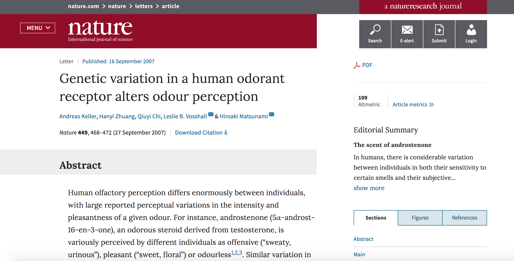
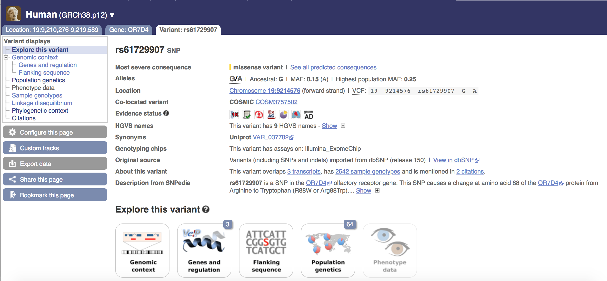

## Some Basic Instructions on How to Choose A Locus For Study

***

**Readings**:<ul> 
<li>[Slate J. 03 Nov 2015. Why I’m wary of candidate gene studies.](http://jon-slate.staff.shef.ac.uk/why-im-wary-of-candidate-gene-studies/)</li> 
<li>[Patnala R, Clements J, Batra J. 2013. Candidate gene association studies: a comprehensive guide to useful in silico tools. *BMC Genet* 14:39.](https://bmcgenet.biomedcentral.com/articles/10.1186/1471-2156-14-39)</li></ul>

***

Today, we will be talking about how to choose a new locus, or gene, of study. This is a fairly simple process that Becca herself will demonstrate (in this tutorial and in person) with a personal example. Hopefully, you will find this helpful in choosing a locus to complete your final project.

### Part 1: Think About A Trait Of Interest

The first thing to do is think about if you have a gene or trait that is of specific interest to you. Are you interested in genes that cause cancer? If so, what kind? Or genes that are hypothesized to affect gene/trait expression, maybe like in [Module 5](https://fuzzyatelin.github.io/AN333_Fall24/Lab5_Homework.html)? Perhaps genes involved in immunity like the MHC? Or are you interested in a specific gene such as *FOXP2* or the Sonic Hedgehog (*SHH*) gene? Additionally, it's important to think about how these genes interact with the environment and with the phenotype in question in humans. An important regulatory gene like *SHH* or *HOX*, one that's required for critical physiological functions, isn't likely to show differences between populations. 
 
 
The example that former student Becca uses in the rest of this tutorial is the gene *OR7D4*, which is part of the olfaction gene family. Becca became interested in this gene because of her work with [Professor Eva Garrett](http://www.ecgarrett.com/) (Co-PI of the BU Sensory Morphology and Anthropological Genomics Lab with Prof. Schmitt). Dr. Garrett studies the evolution of olfaction in primates. Humans have the weakest olfaction abilities out of all primate species, but we can still perceive scents, and some people perceive them differently. Becca wanted to see if there was a population-level difference in scent perception ability among humans in the 1000 Genomes Project populations, based on potential allelic variation in the *OR7D4* gene. How Becca got to *OR7D4* as her *candidate gene* of interest will be explained as we go along. 
 

(Incidentally, the Sonic Hedgehog gene is in fact a real gene, it plays an incredibly important role in organogenesis and brain/limb pattern formation in vertabrate fetuses, which is why it shows very little variation across human populations.)
 

 

### Part 2: Researching Your Trait of Interest

Once you've found a trait or gene that interests you, the next thing to do is research population genetics/genomics studies on the traits or genes that you have in mind. I would suggest starting with a [Google Scholar](https://scholar.google.com/) or a [BU Library](https://www.bu.edu/library/) search. Search simple keywords such as "[Your gene] population genetics" or "[Your trait] population genetics." The papers you find using this process will most likely be the background information in your paper so any research studies that have been done on your gene or trait will most likely be useful. If you're simply interested in a trait, look specifically for genes that are involved in that trait (be they from genome-wide association studies, linkage analyses, gene expression analyses, etc.) and narrow your focus to a few that you might want to study. If possible, look for which specific *alleles* have been shown to be associated with your trait of interest (just like some of the studies we've read on *UCP1* have done). 
 
 
For example, Becca knew she was interested in OR (olfactory receptor) genes, so she searched "OR population genetics," and came up with several papers that she was able to use for her background information, and found the gene *OR7D4* to be particularly interesting based on the paper below, and decided to use it for analysis... 
 

 

### Part 3: Back to *EnsEMBL*

The last thing you should do before you begin your analysis is return to *EnsEMBL*. Search for your gene (or genes, if you haven't narrowed it down yet). Scroll through the gene page like we did all the way back in [Lab 1](https://fuzzyatelin.github.io/AN333_Fall24/Lab1_Module.html). First, look at the variant table and filter the variants by *missense*. Then, click on one and explore the variant, again like we did in Module 1. Especially make sure to scope out the *population genetics* tab under the SNP you chose. Remember, your variant is only present in the 1000 Genomes populations if it has the *1KG* icon. If it is in the 1000 Genomes population, see if there is any variation of MAF in the populations that we can study (you're no longer restricted to your *UCP1* focal population; now you can look across any and all populations). Additionally, look at the *Citations* tab to see if your allele has been cited in any research papers, that may help you along in your research.
 

 

Ok, that should get you started! I hope this bit of advice helps you to think about what you'd like to analyze for your final class projects!

## Good Luck!!

