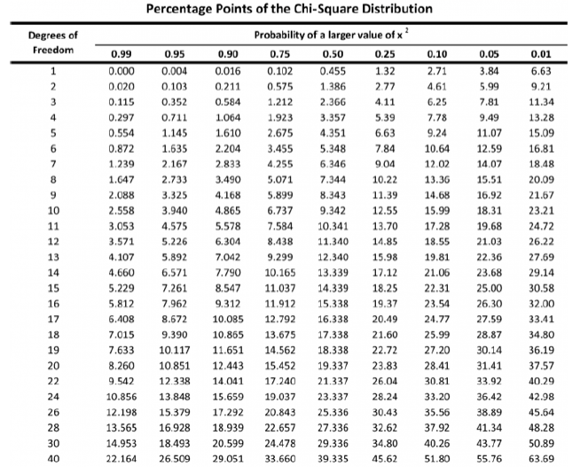

## Midterm 1 (100 points)

This midterm is **open notes, open textbook, open Lab tutorial** and will cover genetics review concepts, discrete vs. continuous traits, single vs. multiple alleles in populations,  the organization of the genome, Hardy-Weinberg equilibrium, and linkage disequilibrium. <br>

You may begin the exam when the submission link (below) becomes active on **Friday, October 9**, and work on the exam until the link closes at midnight of the exam due date, **Friday, October 16**.<br>

*No late responses will be accepted!*<br><br>

<center>
###[Access the online interface to submit your Midterm 1 answers here.](https://forms.gle/FwVFWwUunT9KVsNc9)
</center><br>

Parts of this exam will require downloading, processing, and analyzing data from *Ensembl* in ways that should, by now, be familiar to you; these may involve interfacing with *R/R Studio*, *tabix*, *vcftools*, and other modules in the *SCC*. If you've forgotten how to use these modules, you should use your online Lab tutorials as guides (this is an open notes exam, after all).<br>

All *SCC*-based files associated with exam analyses should be uploaded to the folder/directory named after your BUID in the general *anth333* project space, in a subfolder called "Midterm1". Creating this folder and placing your exam items there will be part of the exam, and involves commands you’ve already learned and used in the context of class, and in the Pre-Module..<br>

NOTE: I will *not* help you directly with exam questions in office hours. However, I *will* help you with exercises already present on Lab tutorials or previous homework assignments. *Please do not ask for help on exam questions*. Also, although you are encouraged to do your homework in cooperation with other students, you should be doing your take-home exam *alone*.<br>

***

###Part 1: Preparing a Workspace for Genomic Data Analysis (5 points)

<ol>1. Log in to your *SCC* working directory. **(1 point)**<br><br> 

Once there, enter the following code:

```{bash, eval = F, echo = T}
#this gives you access to a shared project space on the SCC that I can access.
cd /project/anth333/
```
</ol><br>
<ol>2. Create a new directory in this *anth333* shared project space named after your BU login. For example, my directory would be called *caschmit*, which is both my BUID and my *SCC* login name. **(2 points)**</ol><br>

<ol>3. Now, navigate to your newly named directory so that it's your current directory (i.e., where all of the files you download from *Ensembl* will be deposited and saved). *Conduct all work for the midterm from this directory*. At the end of the exam, all your newly created or saved files associated with Midterm 1 *must* be in this folder. **(2 points)**<br><br>

HINT: Given you answered these first questions correctly, your *SCC* prompt will look like this for all midterm analyses:

```{bash, eval = F, echo = T}
[username@scc1 username]$
```

Now, all of the analyses and processing you do will be done *within* this single named directory, allowing me to grade your individual progress.</ol>

***

###Part 2: Downloading, Processing, and Discussing a Novel Gene in a Continuous Trait from Human Genomic Data on *Ensembl* (50 points)

So far in our labs, we've been focusing on the human mitochondrial uncoupling protein 1 (*ACE2* and *TMPRSS2*) gene.<br><br> 

<ol>1. According to the readings for Module 1, in what tissues is the protein *ACE2* primarily expressed? **(2 points)**

<ol>a) Heart</ol>

<ol>b) The thyroid</ol>

<ol>c) Lungs</ol>

<ol>d) Gastrointestinal tract</ol>

<ol>e) All of the above</ol>

</ol><br>

<ol>2. What role does *ACE2* normally play in the human body? **(2 points)**

<ol>a) Primes the SARS-CoV-2 spike protein</ol>

<ol>b) Modulates a protein called angiotensin II (ANG II) that increases blood pressure and inflammation</ol>

<ol>c) Regulates androgen levels by lysing testosterone</ol>

<ol>d) Appends antigens to the surfaces of blood cells, enabling self/not-self cellular recognition required by immune systems</ol>

</ol><br>

<ol>3. What is the best way to describe the role of *ACE2* in SARS-CoV-2 pathogenicity? **(2 points)**

<ol>a) Directly replicates the SARS-CoV-2 virus, increasing infectivity</ol>

<ol>b) Binds to the SARS-CoV-2 spike protein, enabling the virus to enter cells</ol>

<ol>c) Primes the SARS-CoV-2 spike protein, enabling it to bind to TMPRSS2</ol>

</ol><br>

<ol>4. Traits like disease response, in which tens to hundreds of genes contribute incrementally small amounts of variation to the distribution of the phenotype, are called what? **(2 points)**

<ol>a) Monogenic</ol>

<ol>b) Oligogenic</ol>

<ol>c) Polygenic</ol>

<ol>d) Discrete</ol>

</ol><br>

<ol>5. Such complex traits often follow a normal distribution. Which of the following are characteristics of the normal distribution? **(2 points)**

<ol>a) Trait values are distributed symmetrically about the mean</ol>

<ol>b) The variance in trait values is the average of the squared difference of each value from the mean</ol>

<ol>c) About 68% of the sample is within 1 standard deviation from the mean</ol>

<ol>d) It shows high levels of skew</ol>

</ol><br>

<ol>6. Which of the two foundational scientists we've discussed in this course contributed to how we think about and analyze continuous variation in complex traits, and was the first to characterize the normal distribution? **(2 points)**

<ol>a) Gregor Mendel</ol>

<ol>b) Sir Francis Galton</ol>

<ol>c) Charles Darwin</ol>

<ol>d) Leslea Hlusko</ol>

</ol><br>

<ol>7. The basic equation for a *regression* line is ***y = mx + b***. If we were to use regression to discover the relationship between variation at a SNP in *ACE2* and COVID-19 severity, what would each component of that equation represent?  Use one term each to match the parameter to what it represents:  **(4 points)**
<br><br>
<ol><ol>Body mass    |    SNP error    |    SNP alleles    |    The intercept    |    Mean mass    |    The slope </ol></ol>
<br><br>

<ol>y:</ol>

<ol>m:</ol>

<ol>x:</ol>

<ol>b:</ol>

</ol><br>

<ol>8. Which of the above regression parameters is actually representative of the relationship between COVID-19 severity and changes in SNP allele? **(2 points)**

<ol>a) y</ol>

<ol>b) m</ol>

<ol>c) x</ol>

<ol>d) b</ol>

</ol><br>

<ol>9. If we found a *paralog* of *TMPRSS2*, it most likely represents what kind of larger-scale variation in the genome? **(2 points)**

<ol>a) transposable element</ol>

<ol>b) microsatellite</ol>

<ol>c) copy number variant (CNV)</ol>

<ol>d) variable number of tandem repeats (VNTR)</ol>

</ol><br>

Although we know that *ACE2* and *TMPRSS2* are the main receptors for SARS-CoV-2 in the human body, novel research if actively finding other genes that may modulate the severity of SARS-CoV-2 infection in humans. According to one of our Module readings, the gene *SLC6A20* is in a region strongly associated with poor health outcomes in people infected with COVID-19. Given that *SLC6A20* is known to conjugate with *ACE2*, it's presumed to be the gene associated with these outcomes.<br>

Go to *Ensembl* and look up *SLC6A20* in the most recent human reference genome (Human GRCh38.p13). Answer the following questions based on both information you learned in lecture and information you see specifically on the *SLC6A20* page:<br><br>

<ol>10. Is *SLC6A20* on the same chromosome as *ACE2*? **(1 point)**

<ol>a) Yes</ol>

<ol>b) No</ol>

</ol><br>

<ol>11. Is it possible for *SLC6A20* to show linkage with *ACE2*? **(2 points)**

<ol>a) Yes</ol>

<ol>b) No</ol>

</ol><br>

<ol>12. How many splice variants are there for *SLC6A20* (in other words, how many transcripts can be made from the *SLC6A20* coding region by alternative splicing)? **(2 points)**

<ol>a) 1</ol>

<ol>b) 2</ol>

<ol>c) 5</ol>

<ol>d) 7</ol>

</ol><br>

<ol>13. What is the *location* of *SLC6A20* in the human genome (i.e., on which chromosome, and at what base-pair position does the gene region start and end). Answer in the standard format: [chromosome number]**:**[start-position]**-**[end-position]. **(3 points)**</ol><br><br>

The 1000 Genomes Project is a comprehensive dataset of variation that we've been working with all semester.<br><br>

<ol>14. According to the 1000 Genomes Project Consortium (2015), how many individuals have been sequenced in Phase 3 of the project? **(2 points)**</ol><br>

<ol>15. According to the 1000 Genomes Project Consortium (2015), which *Chinese* population shows the highest number of variants common to that population but that were rare in the rest of the world (HINT: see Figure 3)? Please use the 3-letter population acronym for your answer. **(2 points)**</ol><br>

<ol>16. Take a closer look at Figure 3 in the 1000 Genomes Project Consortium (2015) paper. Which of the following genes appear to have been under strong selection in the Chinese population you chose in your previous answer. **(2 points)**</ol><br>

<center>*IGHA2*  |  *CMYA5*  |  *LILRB2*  |  *IGHE*  |  *TRBV9*  |  *FADS1*  |  None of the above</center>   <br></ol> 

Now, we're going to download the *SLC6A20* data just for the **Indian Telugu in the UK** from the 1000 Genomes project dataset.<br><br> 

<ol>17. What is the three-letter code for the Indian Telugu in the United Kingdom population in the 1000 Genome project dataset? **(1 point)**</ol><br>

<ol>18. Download the variant data for *SLC6A20* only for the Indian Telugu in the United Kingdom population using the same procedure we used for *TMPRSS2*. As in Module 1, I recommend using the *tabix* code, although Data Slicer is also an option. **(15 points)**<br><br>

**Please keep all files associated with this process in your personal *anth333* folder, created in Part 1 of this exam!**</ol><br>

***

###Part 3: Understanding Variation Within Genes, and Hardy-Weinberg Equilibrium (50 points)

For this section of the exam, we'll take a closer look at the variation present within the *SLC6A20* region of the Indian Telugu in the UK. Answer the following questions based on both information you learned in lecture and information you see specifically on the *SLC6A20* page on Ensembl and through your own analyses of the dataset you just downloaded.<br>

Prior to answering these questions, please repeat the analyses from Module 2 on the *SLC6A20* region of the genome in the population of Indian Telugu in the UK. Remember to do all analyses from, and save all files to, your *Midterm1* folder in your named directory in the shared *anth333* project space created in Part 1 of this midterm.<br>

<ol>1. Open your VCF file using the `less` command in your SCC space. What is the ID of the first human sample listed for this population? **(2 points)**</ol><br>

<ol>2. According to Danecek et al. (2011), what character(s) is used to denote header space in the VCF file format (e.g., where metadata and information about the file itself is stored)? **(2 points)**</ol><br>

<ol>3. There are 1245 documented variant sites in *SLC6A20* in the 1000 Genomes dataset. How many of these variant sites are *not* in Hardy-Weinberg equilibrium in the Indian Telugu in the UK (according to our method of analysis using *R* and *R Studio*)? **(2 points)**</ol><br>

<ol>4. Name each variant that is out of Hardy-Weinberg equilibrium in this population, using the dbSNP nomenclature (i.e., "rs123456789"). **(3 points)**</ol><br>

<ol>5. For the first SNP that is significantly out of HWE on the list as you scroll down your table of significant sites, what are the major and minor alleles (please answer in the following way: "major/minor")? **(2 points)**</ol><br>

<ol>6. What is the minor allele frequency at this SNP for the Indian Telugu in the UK? **(2 points)**</ol><br>

<ol>7. Using either *tabix* or the Shiny App from Lab 2, assess the "true" Hardy-Weinberg equilibrium for this SNP in the Indian Telugu in the UK. Is it still out of equilibrium?  **(2 points)**</ol><br>

<ol>9. What is the consequence of this SNP? How likely is it to have an affect on the phenotype of the individuals who carry the minor allele?  **(5 points)**</ol><br>

<ol>8. Given the status of the pandemic where these individuals live, and given that *SLC6A20* may also be involved in severity of COVID-19, would we expect for there to be selection acting on *SLC6A20* in the ITU population? Why or why not?  **(10 points)**</ol><br>

<ol>9. On the Ensembl 'Population Genetics' page for this SNP, which of the larger-scale 1000 Genomes population appears to have the *most* different allele frequencies, on average, compared to all others at this locus? **(2 points)**

<ol>a) African (AFR)</ol>

<ol>b) East Asian (EAS)</ol>

<ol>c) European (EUR)</ol>

<ol>d) South Asian (SAS)</ol>

</ol><br>

While we're on *Ensembl*, look up the *SLC6A20* variant called '***rs202158371***'.

<ol>10. What is the consequence of the minor allele of this SNP? Describe it both as listed on the Variant Table, and tell me what that means for the subsequent protein and potential phenotype? **(5 points)**</ol><br><br>

### An Isolated Finnish Population in the Barents Sea

Imagine you meet a small population of Finns on an island in the Barents Sea, which has been isolated from other Finns for generations. When you genotype this population (n = 250), you observe the following genotype frequencies for * rs202158371*:

* GG = 115

* GT = 18

* GA = 76

* AA = 24

* TA = 10

* TT = 7

<ol>11. What is the frequency of the '**T**' allele in this population? **(0.5 points)**</ol><br>

<ol>12. What is the frequency of the '**G**' allele in this population? **(0.5 points)**</ol><br>

<ol>14. If this SNP is in Hardy-Weinberg equilibrium, what is the expected count of '**TT**' genotyped individuals in this population? **(0.5 points)**</ol><br>

<ol>15. If this SNP is in Hardy-Weinberg equilibrium, what is the expected count of '**GA**' genotyped individuals in this population? **(0.5 points)**</ol><br>

<ol>17. What is the Chi-squared value of the observed genotype counts vs. the genotype counts expected under Hardy-Weinberg Equilibrium? **(2 points)**</ol><br>

<ol>18. What are the degrees of freedom for this test? **(1 points)**</ol><br><br>

<center>

</center><br><br>

<ol>19. Using the above table to estimate the P-value of this test, is this SNP in Hardy-Weinberg equilibrium in this relict population? **(2 points)**</ol><br>

<ol>20. Under the Modern Synthesis definition of evolution, has this relict population *evolved* since it first split from the Finnish population? **(2 points)**</ol><br><br>

<ol>21. If a functional *SLC6A20* protein is necessary to stop a 'cytokine storm' from developing when infected with SARS-CoV-2, what kind of consequence does the minor allele of rs202158371 code for? What does this mean for those that possess the minor allele during the COVID-19 pandemic? **(2 points)**</ol><br>

<ol>22. A Finnish woman living in London, Valda, has two parents who do NOT express *SLC6A20*. She has fallen in love with Aadavan, her neighbor, who is Telugu. The two have expressed a desire to have children. If they do, what is the probability that their child will express *SLC6A20*? In your answer, give the predicted genotype/phenotype frequencies. **(2 points)**</ol><br><br>
<center>
##Congratulations!  You've finished your first midterm!
</center>
<br><br><br>