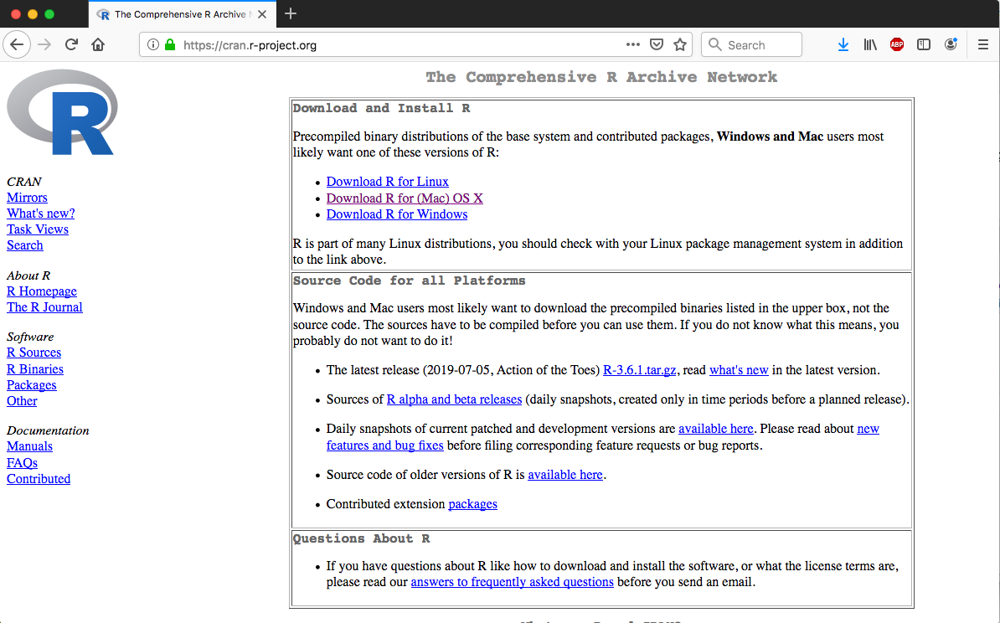

***

```{r setup, include=FALSE}
knitr::opts_chunk$set(
	echo = TRUE,
	warning = TRUE,
	comment = "##",
	prompt = FALSE,
	tidy = TRUE,
	tidy.opts = list(width.cutoff = 75),
	fig.path = "img/"
)
```
# First Steps with ***R*** and ***RStudio***

***

## Objectives
> The goal of this module is to get everyone's computers set up for the semester and to provide background and an introduction to the ***R*** programming language and the ***R*** environment.

## The Backstory

The name ***R*** is a nod to the statistical programming language ***S*** (for "Statistics") that inspired its creation. ***S*** was developed at Bell Laboratories by John Chambers and later sold to a small company that further developed it into ***S-Plus***. ***R*** was then developed as an alternative to ***S*** by Ross Ihaka and Robert Gentleman in the Department of Statistics at the University of Aukland, New Zealand.

***R*** is a high-level, interpreted language, like ***Python*** or ***Ruby***, where commands are executed directly and sequentially, without previously compiling a program into machine-language instructions. Each statement is translated, on the fly, into a sequence of subroutines that have already been compiled into machine code.

***R*** is open-source software, meaning that the source code for the program is freely available for anyone to modify, extend, and improve upon. ***R*** is also FREE (!) for anyone to use and distribution. The large and active community of users and developers is one of the reasons that ***R*** has become very popular in academics, science, engineering, and business - any field that requires data analytics. Developers have also built in the capacity for easily making production-quality graphics, making it a great tool for data visualization. There are thus **many** good reasons to learn and use ***R***.

Here are a few of the main ones, in a nutshell:

- ***R*** is high quality software. It is actively developed by an international community of statisticians and software developers with multiple releases and bug fixes every year.
- ***R*** is FREE (as in thought). The source code is openly available under the GNU General Public License, which allows others to easily evaluate the quality of the code, contribute new functionality, and quickly fix bugs.
- ***R*** is FREE (as in lunch). Whereas licenses for other statistical software such as ***SAS***, ***SPSS***, or ***Stata*** may cost thousands of dollars, ***R*** is available free of charge.
- ***R*** is available for multiple platforms. Installers are available for Windows, Mac OS, and other Unix-based systems and most package are OS agnostic.
- ***R*** is very extensible. If there is a procedure you want to run that is not included in one of the standard packages, it is likely available in one of the thousands of extensions packages that have been developed and are also freely available. You can also use ***R*** to control or interface with external applications, including other programming languages (like ***Python***, ***SQL***, ***C++***, ***NetLogo***), other analysis tools (like GIS software), and databases (like ***MySQL***, ***PostgreSQL***, ***SQLite***, etc). It is also always possible for you to improve ***R*** yourself. You can **literally** do just about anything in ***R***.
- ***R*** has a vibrant, intelligent, and generous user community. LOTS of resources are available online for learning and troubleshooting (see, for example, the section on ***R*** at the [**Stack Overflow**](http://stackoverflow.com/tags/r/info) website.

***R*** can be run in several ways:
- Interactively from the command line in a terminal window.
- In batch mode, by sourcing commands from an ***R*** script file (which is a simple text file).
- From within an ***R*** graphical user interface (or GUI) or integrated development environment (or IDE), which accommodates both of the above.

We are going to introduce several of these ways of working with ***R***, but the easiest and most convenient is to use an IDE.

## Getting Started - Installing ***R***

- Download and install ***R*** from the [**Compehensive R Archive Network (CRAN)**](https://cran.r-project.org/) website. Choose the correct version for your operating system.

<br><center>

</center><br>

- If you are using MacOS, you should also install [***XQuartz***](https://www.xquartz.org/), which lets you use the **X11** X Windows management software.

<br><center>

</center><br>

- Open the ***R*** program from wherever you installed it... you should see the console window and the `>` prompt. Note that your screen may look slightly different from the screenshots below. Also, note that you can also run ***R*** in a terminal window (MacOS or Unix) or from the Windows command shell after starting it with the command “r”.

- **On MacOS...**

<br><center>

</center><br>

- **On Windows...**

<br><center>

</center><br>

- NOTE: For the beginning of the Spring 2025 semster, I am running ***R*** version *4.4.2 "Pile of Leaves"* in ***RStudio*** version *2024.12.0+467* on an Intel Mac OS Sonoma v. 14.5. If you're running different versions, you may have a slightly different experience with the code!

## Taking Our First Steps in ***R***
- ***R*** can be used as an interactive calculator from the console line
	- Standard mathematic order of operations applies (PEMDAS - parentheses, exponents, multiplication/division, addition/subtraction)
- The assignment operator can be used `<-` to assign a value, the results of an operation, or specific code to an *object*** (e.g., a variable, a function, a complex data structure)
	- You can also use `=`, but I prefer to use that only to assign values to function arguments (more on this later)
- To list the objects you have assigned in your *workspace*, you can use the function `ls()` with no arguments
- You can set various *settings* to customize your interactions with ***R***
	- To change the standard *prompt*, use the function `options()` with the `prompt` argument: `options(prompt="")` [where you supply, between the quotes, text with what you want the prompt to say]
	- To list the current *working directory* (the default folder where dialog boxes will open and where files and output will be stored), use the function `getwd()`, which has no arguments
	- To set the current *working directory*, use the function `setwd("")` [where you supply, between the quotes, the path to the desired directory]
	  - On MacOS, these directory options are also available under the **Misc** menu
	  - On Windows, you can set the *working directory* with the **Change dir** command under the **File** menu
	  - In ***RStudio***, the *working directory* can be set under the **Session** menus
- Within the active workspace, ***R*** keeps a log of all executed commands, and you can use the *arrow keys* to scroll through this history
- Commands and code can also be written in a text file or *script* and sent to the console for execution
	- In most GUIs/IDEs, you can choose to create a new *script* document from the **File** menu, which opens in a text editor of some kind
	- From within the text editor, you can send an individual command to the ***R*** interpreter by positioning your cursor somewhere in the line you want to execute and hitting `⌘-RETURN` (Mac) or `control-R` (PC)
	- To send a set of commands to the console as a *batch*, you can highlight the code lines of code you want to execute and then use `⌘-RETURN` (Mac) or `control-R` (PC)
	- You can include comments in your scripts by prefacing them with `#`
	- Script files can be saved just like any other type of text file, usually with the **.R** extension by default

- To view the names of all of the objects in your workspace, you can use the `ls()` function
- To clear objects from your workspace, use the `rm()` function [where an individual object's name or a list of object names is included as the argument to `rm()`]
- To remove all objects from your workspace, you can use `rm(list=ls())` [in this case, you are passing to `rm()` a list consisting of all the objects in the workspace, provided by the `ls()` function

<br>

***

#### **CHALLENGE 1**

***

Try interacting with ***R*** via the command line or console window.

- Try doing some math in ***R*** by using it to evaluate the followinge expressions:

	- 8 + 5
	- 10 - 6 / 2
	- (10 - 6) / 2
	- 10 * 5
	- 15 / 5
	- 10 ^ 5
	- 3 * pi [where pi is an built-in constant]

``` {r}
8+5
10-6/2
(10-6)/2
10*5
15/5
10^5
3*pi
```
- Try working with assignments:

	- Assign the number 6 to a variable called **x**
	- Assign the number 5 to a variable called **y**
	- Assign x * y to a variable called **z**
	- Assign x^2 to a variable called **x2**

``` {r}
x<-6
x
y<-5
y
z<-x*y
z
x2<-x^2
x2
```
- Try out some of the built-in functions of ***R*** functions:

	- Assign the number 10 to a variable called **x**
	- Take the natural log of **x** using the `log()` function
	- Find the factorial of **x** using the `factorial()` function
	- Assign the number 81 to a variable called **y**
	- Take the square root of y using the `sqrt()` function
	- Assign the number -8.349218 to a variable called **z**
	- Use `?round()` to view the help file for the function `round()`
	- Round **z** to the 1000ths place
	- Use `?abs()` to view the help file for the function `abs()`
	- Take the absolute value of **z** * **y**

``` {r}
x<-10
log(x)
factorial(x)
y<-81
sqrt(y)
z<--8.349218
round(z, digits=3)
abs(z*y)
```
	
- Use the `ls()` function to list the variables currently stored in your active session. How many do you have?

``` {r}
ls()
```
- Use the command `rm(list=ls())` to clear all the variables you have defined.
- What happens if you type a function name without including the parentheses?
- What happens if you type a function with an invalid or missing argument?

***

<br>

## Working with ***R*** Packages

One of the fantastic things about ***R***, and one of the reasons it is such a flexible tool for so many types of data analysis, is the ability to extend its functionality with *packages*. Packages are sets of reusable ***R*** functions created by the core development team or by users and are akin to *libraries* in other programming software, like ***`Python`***. They can be installed into ***R*** and then attached to a workspace (using the `require()` or `library()` functions), which then gives the user access to the functions contained therein.

If a package is loaded that has a function with the same name as one in a previously loaded package, then the older one is *masked* and the more recently attached one is used if called by a user. Both alternative versions of the function can be called explicitly by using the `::` operator, using the construct `package-name::function`.
	
- Installing packages from the GUI included in the base MacOS installation:
	- Select the **Packages & Data** menu
	- Choose **Package Installer**
	- Select a package repository to install from, e.g., **CRAN (binaries)**
	- The first time you go to install packages, you will be prompted to select a mirror site (i.e., the remote server from where you can download any of the packages hosted in the selected package repository)
	- Select an install location [I usually install packages to the SYSTEM rather than USER level]
	- Check the box **install dependencies**
	- Select a package to install
	
- Installing packages from the GUI included in the base Windows installation:
	- Select the **Packages** menu
	- Choose **Install package(s)...**
	- By default, the package repository that you will install from is **CRAN (binaries)**
	- The first time you go to install packages, you will be prompted to select a mirror site (a.k.a., the remote server from where you can download any of the packages hosted in the selected package repository)
	- Select a package to install
	- By default, packages are installed at the system level (inside of the **library** folder within your ***R*** installation), and any missing dependenices are also installed by default

- Installing packages from the ***R*** console prompt:
	- Use the function `install.packages("")` [where you include, between the quotes, the name of the package you want to install]. This command installs the package, by default, to the USER level, though this can be changed by providing a path to install to using the `lib` argument. Other arguments for this function can be set to specify the repository to download from, etc.

Installing packages simply places them into a standard location on your computer. To actually use the functions they contain in an ***R*** session, you need to also load them into your ***R*** workspace.

- To load packages from the base MacOS GUI:
	- Select the **Packages & Data** menu
	- Choose **Package Manager**
	- Check the box next to the package name

- To load packages from the base Windows GUI:
	- Select the **Packages** menu
	- Choose **Load package...**
	- Select the package to load

- To load packages from the ***R*** console prompt or in a script:
	- Use the command `library()` or `require()` with the package name as an argument
		- **NOTE:** the package name should *not* be in quotes
	- The `require()` function is nearly identical to the `library()` function except that the former is safer to use inside functions because it will not throw an error if a package is not installed. `require()` also returns a value of **TRUE** or **FALSE** depending on whether the package loaded successfully or not. I almost always have used the `library()` function in my scripts.

- You can use the following to list the set of packages you have installed:
	- `library()`
	- `installed.packages()`

- The command `(.packages())` will give you a list of packages loaded in your current workspace

- The command `detach(package:XXX)` [where XXX, not in quotes, is the name of the package you want to unload] will unload a currently loaded package

- To update your installed packages to the latest version, you can use:
	- `update.packages()`

## Getting Started with ***RStudio***

Apart from the GUIs included in the MacOS and Windows installations of ***R***, there are several IDEs that connect to the ***R*** interpretator and provide lots of convenient functionality , but one of the most versatile and easy to use (and my favorite) is ***RStudio***.

- Download and install the [**RStudio**](https://www.rstudio.com/) Integrated Development Environment (IDE)

<br><center>

</center><br>

- Open the ***RStudio*** program...

Note that the workspace you see is divided into four separate panes (**Source** and **Console** panes on the left, two customizable panes on the right). You can modify the layout and appearance of the ***RStudio*** IDE to suit your taste by selecting **Preferences** from the ***RStudio*** menu (MacOS) or by selecting **Global Options** from the **Tools** menu (both MacOS and Windows).

The **Source** pane is where you work with and edit various file types (e.g., scripts), while the **Console** pane is where you send commands to the ***R*** interpreter and see the results of those commands. The other two customizable panes provide easy access to useful tools and overviews of your interactions with ***R***. For example, the **Environment** tab lists all of the objects in your current workspace, the **History** tab shows the log of all of the commands you have sent to the interpreter, and the **Packages** tab provides a convenient interface for installing and loading packages. 

<br><center>

</center><br>

<br>

***

#### **CHALLENGE 2**

***

Repeat Challenge 1 from above using the editor and console in ***RStudio***.

**NOTE:** In both the base GUI that ships with the ***R*** application and in ***RStudio***, the console supports *code completion*. Pressing `TAB` after starting to type a function or variable name will give you suggestions as to how to complete what you have begun to type. In ***RStudio***, this functionality is present also when you are typing code in the text editor in the **Source** pane. Also helpful in ***RStudio*** are popup windows that accompany code completion that show, for each function, what possible arguments that function can take and their default values.

***

<br>

## Objects, Classes, Attributes, and Vectors

Almost everything in ***R*** can be thought of as an *object*, including variables, functions, and complex data structures.

Objects in ***R*** fall into different *classes* or types. There are a few basic (or "atomic") *classes* for objects: **numeric** (real numbers), **integer** (integer numbers), **character** (for text), **logical** (Boolean values, i.e., **TRUE** or **FALSE**, represented as 1 and 0, respectively), **complex** (for imaginary numbers), and **factor** (for defined levels of categorical variables... we will talk more about factors later on). Both built-in and user defined functions have the class **function**.

***R*** also supports a variety of *data structure* objects, the most basic of which is the *vector*. Vectors are *variables with one or more values of the same type*, e.g., student's grades on an exam. The *class* of a vector has to be one of the atomic classes described above. [A scalar variable, such as a constant, is simply a vector with only 1 value.]

- There are lots of ways to create vectors... one of the most common is to use the `c()` or "concatenate" command:

```	{r}
x <- c(15, 16, 12, 3, 21, 45, 23)
x
```
``` {r}
y <- c("once", "upon", "a", "time")
y
```
``` {r}
z <- "once upon a time"
z
```
``` {r}
f <- function(){
	# code to be evaluated
}
# this is the minimal definition for a function
```
- What is the *class* of **x**? Of **y**? of **f**? Use the `class()` function to check.
- What happens if you try the following assignment: `x <- c("2", 2, "zombies")`? What is the class of **x** now?
- What is the class of the built in function `mean()`? To check, use `class(mean)`
	
Another way to create a vector is to use the `:` sequence operator:

```	{r}
x <- 1:10
x
```

Some objects in ***R*** also have *attributes*, which we can think of as metadata, or data describing the object. A useful attribute to query about a *vector* object is the number of elements in it.

``` {r}
length(x)
```

<br>

***

#### **CHALLENGE 3**

***

Try some vector math using the console in ***RStudio***

- Assign a sequence of numbers from 15 to 28 to a vector, **x**. [There are at least two ways to do this.]
- Assign a sequence of numbers from 1 to 4 to a vector, **y**.
- Add **x** and **y**. What happens?
- Use the up arrow to recall the last command from history and modify the command to store the result of the addition to a variable, **s**. What kind of object is **s**? Examine it using the `class()` function. What is the length of **x**?
- Create a new vector, **z** with values 10 and 100.
- Multiply **x** times **z**. What happens? What is the effect of having vectors that differ in length?
- Use the `mean()` and `sd()` functions to calculate the mean and standard deviation of **s**.

``` {r}
x <- 15:28 # or x <- c(15, 16, 17...)
y <- 1:4
x + y
```
``` {r}
s <- x + y
s
```

``` {r}
class(s)
```
``` {r}
length(s)
```
``` {r}
z <- c(10, 100)
x * z
```
``` {r}
mean(s)
```
``` {r}
sd(s)
```

***

<br>

## Working with Scripts

As noted above, scripts are text files that store ***R*** commands and they can be used to link together sets of commands to perform complete analyses and show results. ***R*** scripts may be constructed using lines of individual code to accomplish tasks, but if the code will be executed repeatedtly, it is much better to organize the code into user-defined *functions*. A function is a bit of code that performs a specific task. It may take arguments or not, and it may return nothing, a single value, or any ***R*** object (e.g., a vector or a list, which is another data structure will discuss later on). If care is taken to write functions that work under a wide range of circumstances, then they can be reused in many different places. Novel functions are the basis of the thousands of user-designed packages that are what make ***R*** so extensible and powerful.

If you save a script, you can then use the `source()` function (with the path to the script file of interest as an argument) at the console prompt (or in another script) to read and execute the entire contents of the script file. In ***RStudio*** you may also go to **Code > Source** to run an entire script, or you can run lines in the script by opening it, highlighting the lines of interest, and sending those lines to the console using the **Run** button or the appropriate keyboard shortcut, `⌘-RETURN` (Mac) or `control-R` (PC).

<br>

***

#### **CHALLENGE 4**

***

Try writing a script containing a function.

- Open a new blank document in ***RStudio***
	- **File > New File > R Script**
- Type in the code below to create the `sayhi()` function, which adds a name to a greeting:

``` {r}
sayhi <- function(x) {
  hi <- paste("greetings, ", x, "!", sep = "")
  # the paste command allows string concatenation
  return(hi)
}
```
Now, send this function to ***R*** by highlighting it and hitting `⌘-RETURN` (Mac) or `control-R` (PC) to automatically paste it to the console.

<br><center>

</center><br>

- Now we can create some test data and call the function. What are the results?

``` {r}
name1 <- "septimus"
name2 <- "thomasina"
sayhi(name1)  
```
``` {r}
sayhi(name2)
```

***

<br>

## Quitting ***R*** and Saving your Work

Working in ***RStudio***, you can save script files (which, again, are just plain text files) using standard dialog boxes.

When you go to quit ***R*** (by using the `q()` function or by trying to close ***RStudio***), you will be asked whether you want to

```Save workspace image to XXX/.Rdata?``` [where XXX is the path to your working directory].

Saying "yes" will store all of the contents of your workspace in a single *hidden* file, **.Rdata**. The leading "." makes this invisible to most operating systems, unless you deliberately make it possible to see hidden files. The next time you start ***R***, this workspace will be loaded again automatically, provided you have not changed your working directory.

A second hidden file, **.Rhistory**, will also be stored in the same directory, which will contain a log of all commands you sent to the console during your ***R*** session.

## Updating ***R***
***R*** has been under continuous and active development since its inception in the late 1990s, and several updates are made available each year. These updates help to fix bugs, improve speed and computational efficiency, and add new functionality to the software. The following information on how to update ***R*** is based on [**this post from R Bloggers**](https://www.r-bloggers.com/2017/05/upgrade-r-without-losing-your-packages/):

### Step 1: Before upgrading, build a temporary file that contains all your package locations:
```{r,eval=F,echo=T}
tmp <- installed.packages()
installedpkgs <- as.vector(tmp[is.na(tmp[,"Priority"]), 1])
save(installedpkgs, file="installed_old.rda")
```

### Step 2: Get the latest version of ***R***

- Go to the [**R Project**](http://www.r-project.org) website
- Click on **CRAN** in the sidebar on the left
- Choose the **CRAN Mirror** site that you like
- Click on **Download R for...** [choose your operating system]
- Follow the installation procedures for your system
- Restart ***RStudio***

### Step 3: Reload, reinstall, and update your packages: 
```{r,eval=F,echo=T}
load("installed_old.rda")
tmp <- installed.packages()
installedpkgs.new <- as.vector(tmp[is.na(tmp[,"Priority"]), 1])
missing <- setdiff(installedpkgs, installedpkgs.new)
```
```{r,eval=F,echo=T}
#Run these last two lines separately... sometimes they require interactive commands:
install.packages(missing)
update.packages()
```

- if you have any packages from [{BioConductor}](https://bioconductor.org/) (a popular bioinformatics repository for specialized R-packages), you may need to also run this code:
```{r,eval=F,echo=T}
chooseBioCmirror()
BiocManager::install()
load("installed_old.rda")
tmp <- installed.packages()
installedpkgs.new <- as.vector(tmp[is.na(tmp[,"Priority"]), 1])
missing <- setdiff(installedpkgs, installedpkgs.new)
for (i in 1:length(missing)) BiocManager::install(missing[i])
```

### Potentially easier ways to update and carry over packages:

- If you're using a Windows computer, you can use the package [{installr}](https://www.r-statistics.com/2013/03/updating-r-from-r-on-windows-using-the-installr-package/) to update R and all your packages.
- If you're using a Mac, you can use the package [{updateR}](https://github.com/AndreaCirilloAC/updateR), but only from base ***R*** (not within ***RStudio***).

- Finally, to reassure yourself that you have done everything correctly, type these two commands in the ***RStudio*** console to see what you've got in terms of what version of ***R*** you are running and what packages you have installed:

``` {r,eval=F}
version
```
``` {r,eval=F}
packageStatus()
```
