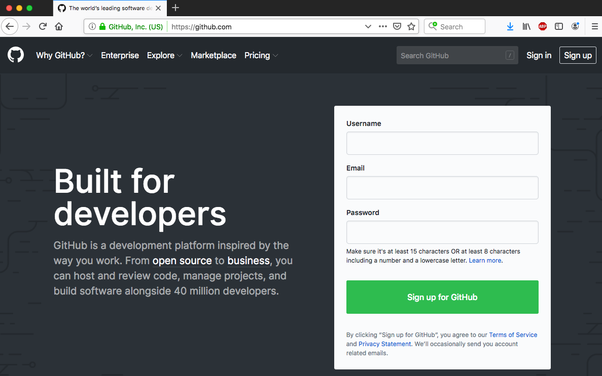
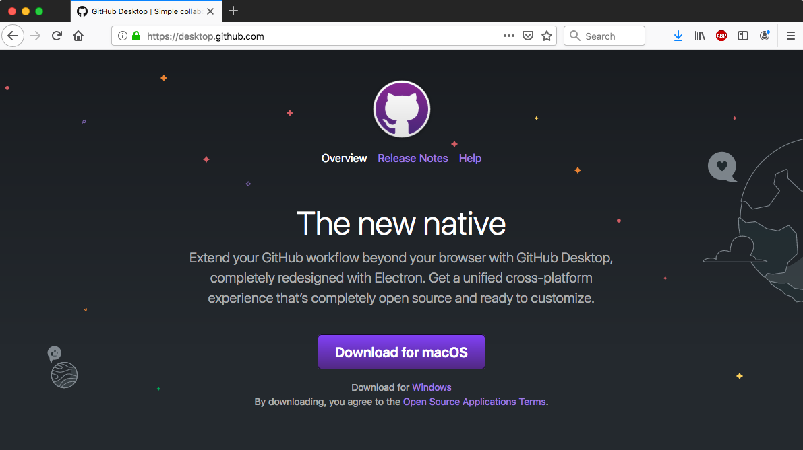

Module 02
================
by Anthony Di Fiore, with modifications by Christopher A. Schmitt

Basics of Version Control
=========================

Objectives
----------

> To introduce the basics of working with version control systems in ***R***, using ***Git***, ***GitHub***, and ***GitHub Desktop***

Backstory
---------

For any of us who work with data files and associated analyses and documents over a long period of time, it can become very complicated to keep track of the "latest version" of what we're working on. This is especially true if we are collaborating with others on a project and need to share and modify these things back and forth in real time. This is a problem that software developers have been dealing with for a long time, however, and there is a robust ecosystem of "version control systems" (VCSs) out there for dealing with this problem. The basic idea behind these systems is that all of the work on a particular project is stored in a **repository** (or **repo**), and as you work on and modify files and data for the project, you "commit" your changes periodically. The VCS keeps track of what changes between commits and allows you to roll back to previous versions if need be.

You can also **fork** a repo -- basically, make a duplicate copy of it -- and work on the forked branch and then, later, merge your changes back into the master branch. Multiple people can each work on different branches simultaneously, and the software will take care of looking for and highlighting changes that occur on different branches so that they can be merged back in appropriately. This module will introduce you to one such system.

Installing ***git*** and a Text Editor
--------------------------------------

One of the most popular and frequently used VCSs is ***git***.

-   Download and install [**git**](https://git-scm.com/) for your operating system. This will put the appropriate software on your machine.

-   A good text editor is also an important tool for programmers, web developers, and data analysts. While we're at it, let's grab one! Download and install the [**Atom**](https://atom.io) text editor. \[Other text editors, such as [**TextWrangler**](http://www.barebones.com/products/textwrangler/download.html), for MacOS, or [**Notepad++**](https://notepad-plus-plus.org/), for Windows, are also very good. **Atom**, however, is available for multiple platforms and is created by the folks resposible for ***GitHub*** (see below).\]

Getting Started with ***GitHub*** and Creating Repositories
-----------------------------------------------------------

The ***git*** software we just installed is strictly a command-line tool and is a bit difficult to pick up from scratch. However, the repository hosting service ***GitHub*** provides an easy to use web-based graphical interface for repository management and version control. ***GitHub*** offers the distributed version control and source code management functionality of ***git*** plus some additional features. We will get introduced to ***git*** by using ***GitHub***.

-   Go to [**GitHub.com**](https://github.com/), choose `Sign Up` and create your own account.

#### CHALLENGE:

Create a new repository on ***GitHub***

-   Follow the instructions laid out in the [**Hello World**](https://guides.github.com/activities/hello-world/) ***GitHub*** guide.

-   In doing so, you should create a **repository** (colloquially, a **repo**) and name it (e.g., "test-repo"). **NOTE:** Do not include spaces in your repo name!

-   Create a `README` file for your repo using the browser-based [**Markdown**](https://en.wikipedia.org/wiki/Markdown) editor. **Markdown** is basically a set of rules for how to easily style plain text files in such a way that can be easily converted and rendered in HTML, the structural language of the web. This module, for example, is written using **Markdown**! ***GitHub*** has a nice, short tutorial that you can follow about [**Mastering Markdown**](https://guides.github.com/features/mastering-markdown/).
-   Following the online guide, create a **fork** of your repo, make some edits to your `README` file, and then merge your edits back into the `master` branch of your repo.
-   Be sure to also read the ***GitHub*** guide on ["Documenting your Projects on GitHub"](https://guides.github.com/features/wikis/) for a useful overview of the benefits of good documentation.

Managing ***git*** from the Desktop with a GUI
----------------------------------------------

***git*** is a command-line tool, but both local (on your computer) and hosted (e.g., on ***GitHub***) repositories can be managed using a GUI, such as ***GitHub Desktop***, ***GitUp***, or a host of others. I find ***GitHub Desktop*** the easiest one to use.

-   Download and install [***GitHub Desktop***](https://desktop.github.com/)

With ***GitHub Desktop***, we can download, work on, and update remote repos or we can create, work on, and push local repos to remote sites.

#### CHALLENGE:

Clone a remote repository from ***GitHub*** to your computer

-   You can create a *cloned copy* of your recently created repo at **GitHub.com** in **GitHub Desktop** as follows:
    -   Open **GitHub Desktop**
    -   Go to **GitHub.com** and log in
    -   Go to your repository and choose *Clone or download* and then select *Open in Desktop*

This should create a local copy of your repo. On MacOS, if you then *right-click* on it in the list of your local repos, you will see the option to open your repo in **GitHub** (which will take you back to the web interface), in the **Terminal**, in the **Finder**, or with the [**Atom**](https://atom.io/) text editor. The process should be *similar* on Windows, but the same options listed above may not appear.

-   Try making some edits to your **README** file in your local copy using **Atom** or another text editor...
-   Then switch to ***GitHub Desktop*** (where you should see the changes highlighted) and **Commit** the changes (to save them locally...
-   Then **Sync** your changes with the remote master on ***GitHub***

#### CHALLENGE:

Create a local repository and push it to ***GitHub***

-   Open ***GitHub Desktop*** and create a new local repo (e.g., "local-repo")

-   On MacOS, navigate to the folder of the repo you just created by *right-clicking* on the repo and choosing **Open in Atom**. You can also choose **Open in Finder**, though the next steps will then be a bit different. The process will be similar, though not identical, on Windows.
-   If you opened in ***Atom***, you should see the folder **.git**, which is a hidden folder (indicated by the "."). You probably will **not** see this if you opened in the Finder, since "." prefaced files are hidden by default.

-   The ***Atom*** editor should also have opened a new, *untitled* plain text file. If it did not, you can simply create a new file.
-   Type something into this plain text file using [**Markdown**](https://en.wikipedia.org/wiki/Markdown) syntax and save it as "README.md".

-   Switch back to ***GitHub Desktop*** and then **Commit** your `README.md` file to the `master` branch, providing a short bit of text describing your commit (e.g., "Initial commit").

**NOTE:** This file is still located only in your local ***git*** repository, and not on ***GitHub***'s servers.

-   After you have committed the file, you can choose *Publish* to push your repo to **GitHub**.

If you now go to **GitHub.com** and log in, you should be able to find the repo you have pushed up there.

