***

```{r setup, include=FALSE}
knitr::opts_chunk$set(
	echo = TRUE,
	warning = TRUE,
	comment = "##",
	prompt = FALSE,
	tidy = TRUE,
	tidy.opts = list(width.cutoff = 75),
	fig.path = "img/"
)
```

# Reproducible Research using **RMarkdown**

***

## Objectives
> The objective of this module is to set you up with a new local repository under version control in which you will take notes and practice coding, and also set you up to be able to push changes that you make locally to a remote copy of the repository hosted on ***GitHub***. We also introduce the idea of *reproducible research* and practice implementing it using **RMarkdown**.

## The Backstory
Last time, we introduced the concept of version control and looked at tools in ***RStudio*** for interfacing with ***git***, a popular version control system. Today, we are going to put these ideas into practice as a means for fostering *reproducible research*.

## Reproducible Research

**Reproducible research** refers to conducting and disseminating scientific research in such a way that makes data analysis (and scientific claims more generally) more transparent and replicable. We already have means of sharing *methods* and *results* generally, through publications, although perhaps typically in less than complete detail (!), and we can share the data on which those are based by including them in some form of online repository (e.g., via "supplementary information" that accompanies an article or by posting datasets to repositories like the [**Dryad Digital Repository**](http://datadryad.org/) or [**Figshare**](https://figshare.com/). But how do we share the details of exactly how we did an analysis? And how can we ensure that it is possible for us to go back, ourselves, and replicate a particular analysis or data transformation? One solution is to integrate detailed text describing a workflow and analytical source code (such as ***R*** scripts) together in the same document.

This idea of tying together narrative, logic, specific code, and data (or references to them) in a single document stems from the principle of [*literate programming*](https://en.wikipedia.org/wiki/Literate_programming) developed by Donald Knuth. Applied to scientific practice, the concept of *literate programming* means documenting both the logic behind and code used for an analysis conducted with a computer program. This documentation allows researchers to return to and reexamine their own thought processes at any later time, and also allows them to share their thought processes so others can understand how an analysis was performed. The upshot is that our scholarship can be better understood, recreated, and independently verified.

This is exactly the point of an **RMarkdown** document.

So, how does this work?

First, **Markdown** is a way of styling plain text document such that it can be easily rendered into HTML or PDF files. It is based on using some simple formatting and special characters to tag pieces of text such that a parser knows how to convert the plain text into HTML or PDF. [This link](https://daringfireball.net/projects/markdown/syntax) takes you to a description of **Markdown**, its syntax, and the philosophy behind it by John Gruber, Markdown's creator. A guide to **Markdown** syntax used on ***GitHub*** is provided [here](https://guides.github.com/pdfs/markdown-cheatsheet-online.pdf).

**RMarkdown** is an extension of Markdown that allows you to embed chunks of ***R*** code and additional parsing instructions in a plain text file. Then, during the rendering or "knitting" stage, when the text file is being converted to HTML or PDF format, the output of running the embedded code can also be included.

**RMarkdown** uses the package {knitr} to produce files that can compile into a variety of formats, including HTML, traditional **Markdown**, PDFs, MS Word documents, web presentations, and others. A cheatsheet of **RMarkdown** syntax can be found [here](https://www.rstudio.com/wp-content/uploads/2016/03/rmarkdown-cheatsheet-2.0.pdf).

To put these ideas into practice, today we are going to create a new ***R*** project and corresponding repository that we will track with version control using ***git***. In that project, we are going to create an **RMarkdown** document in which you will take notes and practice coding during class today and in for homework this week.

## Workflow for New Projects to Use ***RStudio*** with ***git*** and ***GitHub***

*The information below is based on [this helpful post](http://www.datasurg.net/2015/07/13/rstudio-and-github/) as well as [this one](https://support.rstudio.com/hc/en-us/articles/200532077-Version-Control-with-Git-and-SVN).*

Version control allows backup of scripts and easy collaboration on complex projects. ***RStudio*** includes some valuable tools for managing projects and for implementing version control on those projects. It works well with ***git***, an open source distributed version control system, and ***GitHub***, a web-based ***git*** repository hosting service. It also works well with ***Subversion*** (or ***SVN***), another popular version control system.

### Step 1 - Install ***git***

If you have not already done so, download and install [***git***](https://git-scm.com/) for your operating system and create an account on [**GitHub.com**](https://github.com/).

Remember, ***git*** is a piece of software running on your own computer, and that is distinct from ***GitHub***, which is the remote repository website, and from ***GitHub Desktop***, which is a GUI to ***git***.

### Step 2 - Set up your identity in ***git***

We next need to tell ***git*** (on your local computer) who you are so that when you make commits either locally or remotely, they are associated with a particular user name and email. To do this within ***RStudio***, select **Tools -> Terminal -> New Terminal...**, which will open up a Terminal window. Alternatively, you can enter these commands directly in a Terminal window you open yourself on your computer outside ***RStudio***, rather than one opened from within ***RStudio***.

- At the Terminal prompt, enter...

<pre>
git config --global user.email <i>your email address</i>
git config --global user.name <i>your GitHub username</i>
</pre>

***GitHub*** will link any commits to the username associated with the email address used to tag your commits, even if you enter a different username here. If you use an email address that is not already associated with a ***GitHub*** account, then the entered username will appear associated with your commits.

### Step 3 - Activate version control features of ***RStudio***

We now need to set up ***RStudio*** to interface with ***git***.

- Go to **Global Options** (from the **Tools** menu)
- Click `Git/SVN`
- Click `Enable version control interface for RStudio projects`
- Ensure that the path to your ***git*** executable is correct (usually */usr/bin/git* on MacOS, *C:/Program Files (x86)/Git/bin/git.exe* on Windows) and, if not, then enter it.

<br><center>
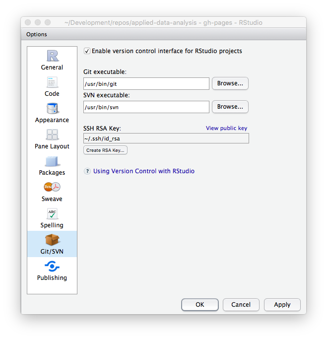
</center><br>

- From this same window, also hit `Create RSA key` so you can use **SSH**, a secure information transfer protocol, to send and receive data from remote servers.

<br><center>
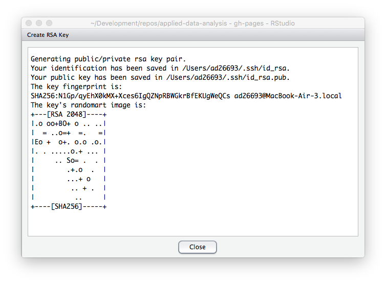
</center><br>

We also need to enable the use of a *Personal Access Token* in order to interface with ***GitHub*** via ***RStudio***. A Personal Access Token is essentially a password established on ***GitHub*** that ***RStudio*** will send to identify itself as a permitted user.

To set up your Personal Access Token, log in to your ***GitHub*** account and go to *Settings*. In the *Settings* menu, scroll down and click on *Developer Settings*. Once there, use the menu to click on *Personal Access Token*.

Click on the button to *Generate new token*.

<br><center>
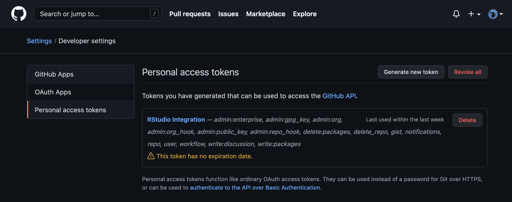
</center><br>

When you do, ***GitHub*** will give you the option of naming the token's purpose in your *Note*, to give an expiration date for the token (I recommend setting it to expire only after the course ends... otherwise ***GitHub*** integration will stop midway through the course and you'll have to set up a new token), and to select the *scope* of the token. I recommend, at a minimum, granting `repo`, `user`, and `delete_repo` access by ticking off the boxes next to those scopes.

<br><center>
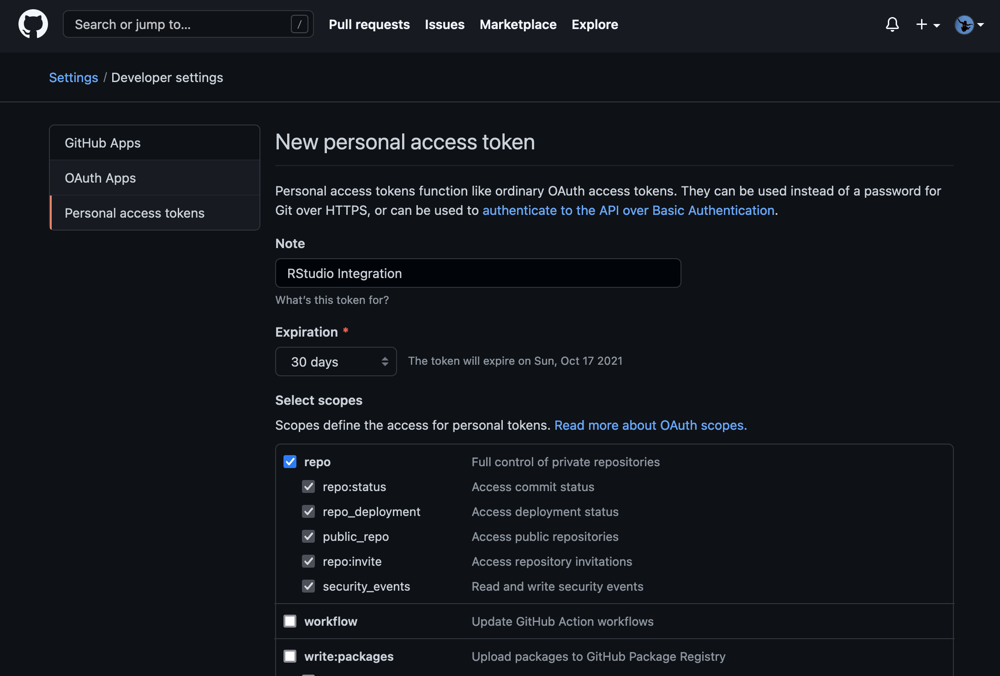
</center><br>

Once you've selected your scopes, click on the green *Generate token* button.

<br><center>
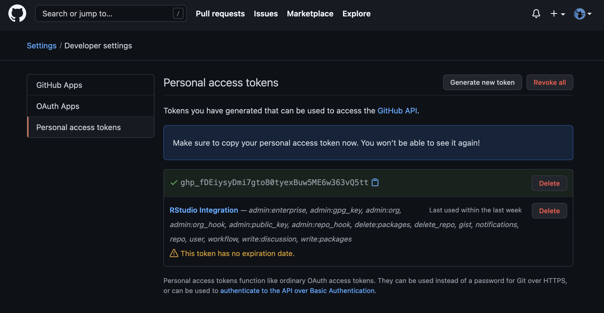
</center><br>

Once your token is generated, copy it.

Open ***RStudio***, and in your ***R*** console, enter the following code:
```{r,eval=F,echo=T}
install.packages("gitcreds")
library(gitcreds)
gitcreds_set()
```

When prompted, paste your Personal Access Token into the console and press Enter. This should save your Personal Access Token into your ***RStudio*** git workflow.

Now that we have integrated them, there are a couple of different routes we can take to get ***RStudio***, ***git***, and ***GitHub*** to work together. 

RStudio's version control features are tied to the use of **Projects** (which are a way of dividing work into multiple contexts, each with their own working directory). The steps required to use version control with a project vary depending on whether the project is new or existing as well as whether it is already under version control.

### Step 4, version 1 - Creating a new ***R*** project by cloning a remote repository on ***GitHub***

- Go to the ***GitHub*** website and create a new repository. Be sure to initialize it with a `README` file.
- Open ***RStudio*** and execute the **New Project** command (from the **File** menu)
- Choose to create a new project from `Version Control`

<br><center>
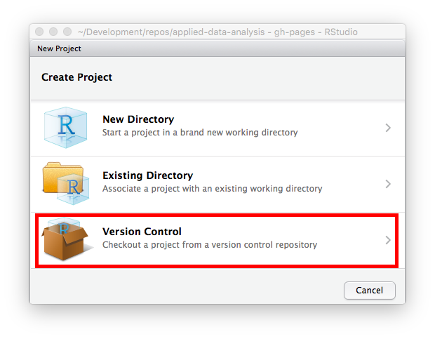</center>
</center><br>

- Choose the top option to clone a project from an existing ***git*** repository.

<br><center>
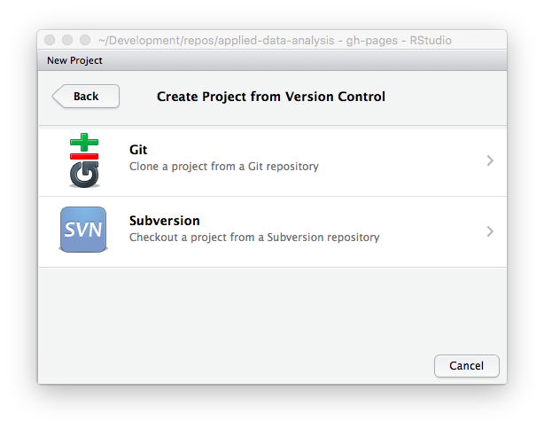</center>
</center><br>

- In the following dialog box, provide the repository URL (which should be the URL for the repository you just created, likely https://github.com/ followed by *your GitHub username*/*your repo name*. The `Project directory name` should be *your repo name*, and you should choose a parent directory for your local copy of the repo using the `Create project as a subdirectory of:` text field. Then click **Create Project**.

<br><center>
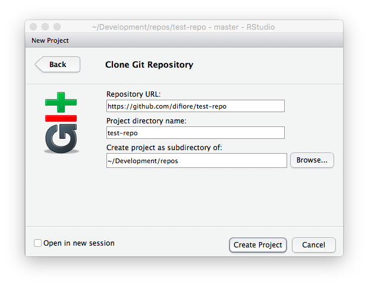</center>
</center><br>

The remote repository will then cloned into the specified directory and ***RStudio***'s version control features will then be available for that directory. ***RStudio*** will create an *.Rproj* file in the directory (with the name of your project) and a .gitignore file inside of it. This directory is now being tracked by ***git***.

#### Adding to the repository, staging changes, and committing

- Now, you can create one or more new scripts (*filename*.R) or **RMarkdown** (*filename*.Rmd) files and add them to your repository. Create a new **RMarkdown** file and save it.

<br><center>
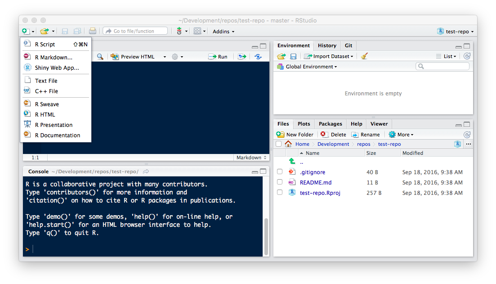</center>
</center>

<center>
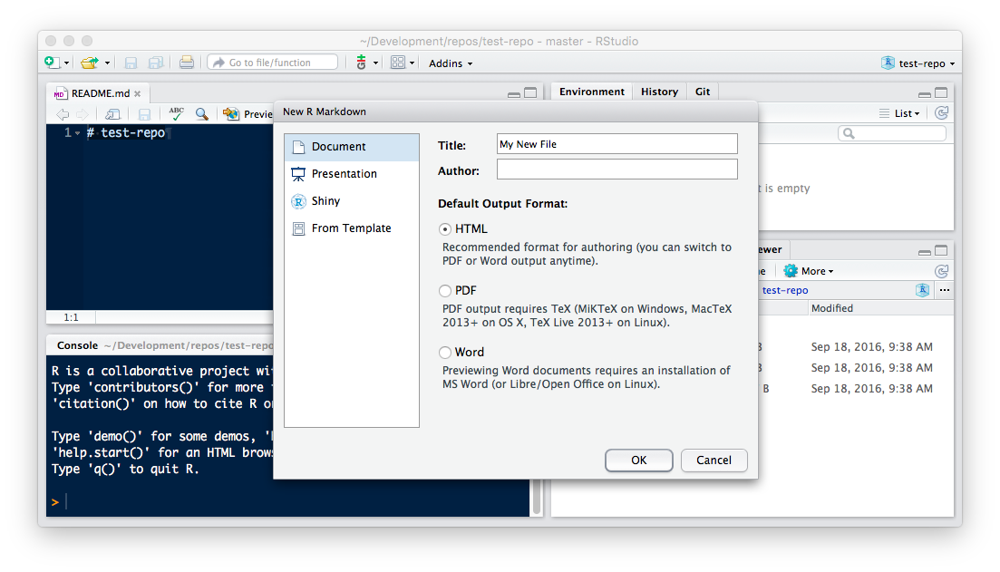</center>
</center><br>

- After saving your file, it should appear in the git tab in the upper right pane of ***RStudio***, along with the **.Rproj** and **.gitignore** files.
- Click on all of the file(s) you wish to add to your repo, and their status should turn to a green `A` (for "added").

<br><center>

</center><br>

- Click `Commit`. You will see another window open up with the names of the files in your directory in the upper left pane. Selecting any of these will show you the contents of the file in the lower pane.
- Enter an identifying commit message in the upper right pane and then click `Commit`. A window will pop up confirming what you have just done, which you can close.

<br><center>
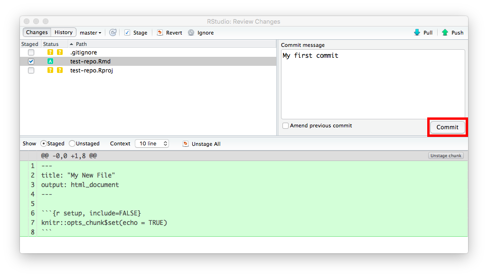</center>
</center><br>

You have now committed the current version of the file(s) you have added to your repository on your local computer. These files should now no longer show up on the ***Git*** tab.
- Now edit one or more of your files and save those edits. The changed file should show up in the ***Git*** tab with a blue `M` (for "modified") next to it.

<br><center>
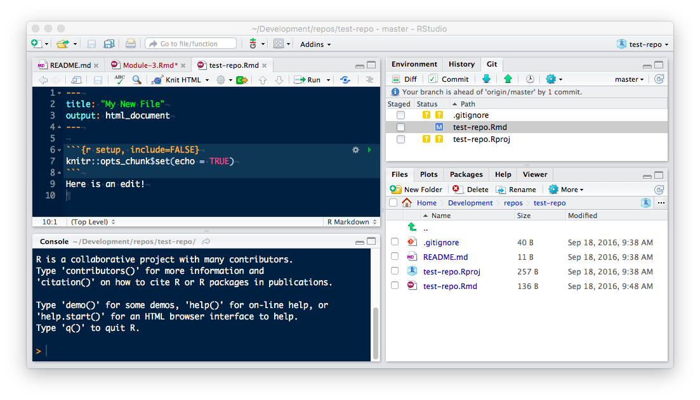</center>
<br>

- Click on the check box to *stage* it (i.e., get it ready to commit to the local repo) and then click the `Commit` button.

Again, a new window will open up showing the files in your directory that are, either, not yet included in the ***git*** tracked repo on your local computer or that have been modified since your last commit (e.g., the file you have just changed). With the changed file highlighted, the pane at the bottom summarizes the difference between the current version of the file and the version that was committed previously.

- Enter an identifying commit message in the upper right pane and then click `Commit`. A window will pop up confirming what you have just done, which you can close.

If you now select the `History` tab you can see the history of commits, and selecting any of the nodes in the commit history will show you (in the lower pane) the files involved in the commit and how the content of those files has changed since your last commit. For example, the node associated with your intial commit will show you the initial file contents, while subsequent nodes highlight where a new version differs from the previous one.

#### Pushing your changes to ***GitHub***

- With your commits completed, the files disappear from the commit window (meaning they have all been committed locally) and you should now be able to pass all of your changes up to ***GitHub*** using the `Push` button. This updates the remote copy of your repo and makes it available to collaborators.

<br><center>
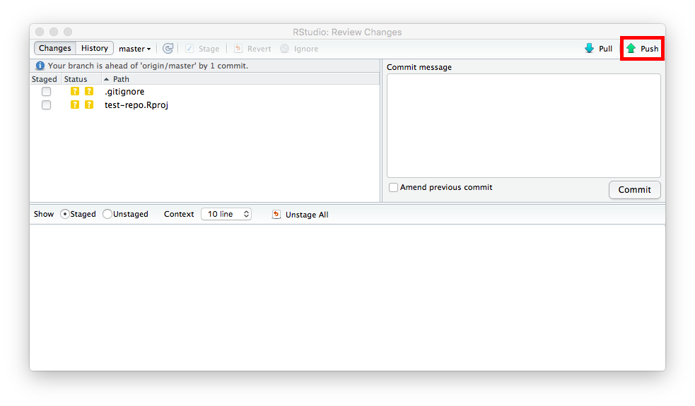
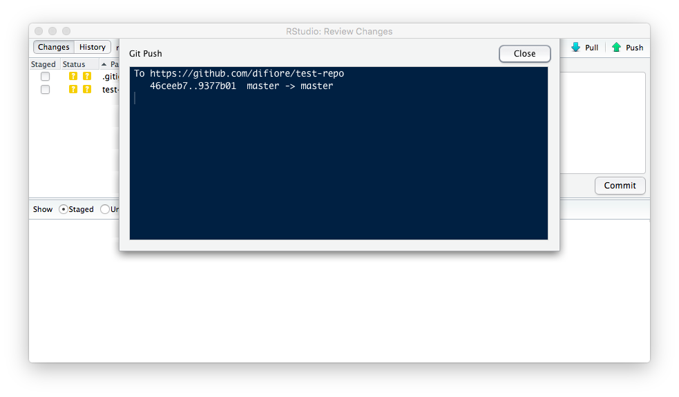
</center><br>

### Step 4, version 2 - Creating a new ***R*** project based on a local directory already under version control

- If you have an existing directory on your local computer which is already under ***git*** version control, then you simply need to create a new ***RStudio*** project for that directory and then version control features will be automatically enabled. To do this:

- Execute the **New Project** command (from the **File** menu)
- Choose to create a new project from an `Existing Directory`

<br><center>
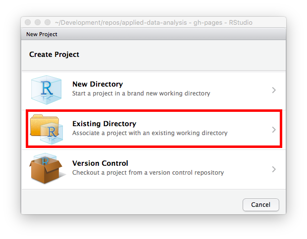
</center><br>

- Select the appropriate directory and then click **Create Project**

A new **.Rproj** file will be created for the directory and ***RStudio***'s version control features will then be available for that directory. Now, you can edit files currently in the directory or create new ones as well as stage and commit them to the local repo directly from ***RStudio***. See the section above on **Adding to the repository, staging changes, and committing**.

So far, however, this project is only under *local version control*... you will not yet be able to push changes up to ***GitHub***.

### Step 4 version 3 - Creating a new ***RStudio*** project repository to track with ***git***

- In ***RStudio***, select **File -> New project** and click `New Directory`.

<br><center>
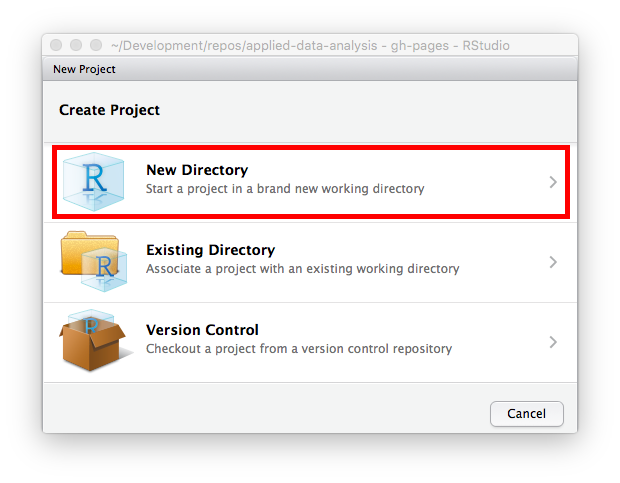
</center><br>

- Choose `Empty Project`, name the directory and choose where you would like it to be stored, check the box marked `Create a git repository`, and press `Create Project`.

<br><center>
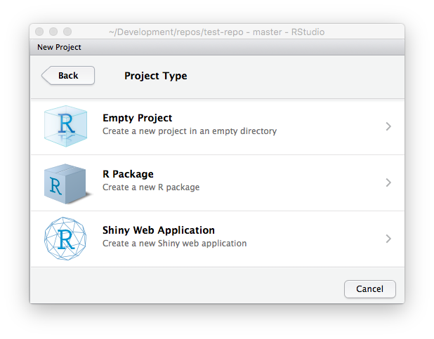


</center><br>

- ***RStudio*** will create a new directory with an **.Rproj** file (with the name of your project) and a **.gitignore** file inside of it. This directory is now being tracked by ***git*** and ***RStudio***. You can now create and edit files in this new directory and stage and commit them to the local repo directly from ***RStudio***. See the section above on **Adding to the repository, staging changes, and committing**.

As for projects created from an existing local directory (see above), this project is still only under *local version control*... you will not yet be able to push changes up to ***GitHub***.

### Followup from Step 4, versions 2 and 3 - Connecting a local repository to ***GitHub***

If you did not create your project repository by cloning a remote repo from ***GitHub***, you can follow the steps below to connect and push a local repo up to ***GitHub***.

#### Step 1:

- In ***RStudio***, select **Tools -> Global Options** and then select the `Git/SVN` icon.
- If you haven't already ceated an `RSA` Key, click `Create RSA Key...` and follow through with any additional dialog boxes.

<br><center>

</center><br>

- Then close this window, click `View public key`, copy the displayed public key, and close out of the **Global Options** dialog box. If you have created a key previously, just click `View public key`, copy the displayed public key, and close out of the **Global Options** dialog box.

<br><center>
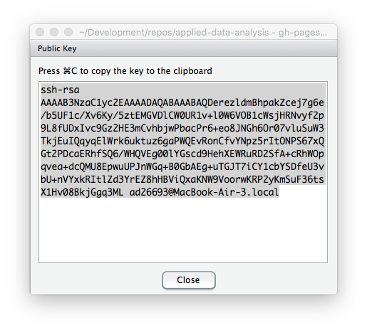
</center><br>

#### Step 2:

- Go to your ***GitHub*** account online, open your profile/account settings (e.g., by clicking the `Edit Profile` button), and the select the `SSH & GPG keys` tab.
- Click `New SSH key`, type a title for the new key, paste in the public key you copied from ***RStudio***, and then click `Add SSH key` at the bottom of the window.

<br><center>
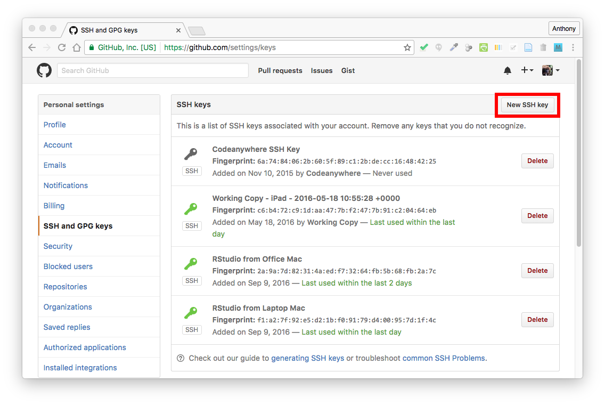
</center><br>

- Return to ***RStudio***.

#### Step 3:

Now you will want to create a remote repository on ***GitHub*** to which you can push the contents of your local repository so that it is also backed-up off site and available to collaborators.

- Go to the ***GitHub*** website and create a new repository. You can use the same name as that of the ***RStudio*** project you want to push up, or you can create a different one. **You should not initialize this repo with a README file!**
- From the next screen, first make sure that the `SSH` button is selected under the **Quick setup...** option at the top. Then, scroll down to the option: **...or push an existing repository from the command line**.

<br><center>
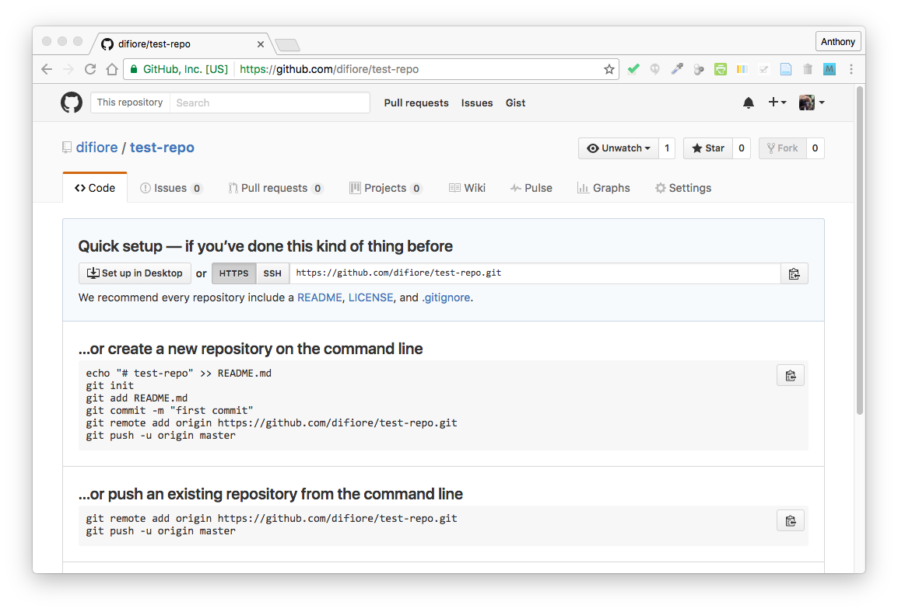
</center><br>

- Copy the first line of code listed there (the one that begins *git remote add origin...*) and then return to ***RStudio***


#### Step 4:

- In ***RStudio***, open the project that you want to push to ***GitHub*** and click **Tools -> Terminal -> New Terminal...** to open a terminal window (if one is not open already).

<br><center>
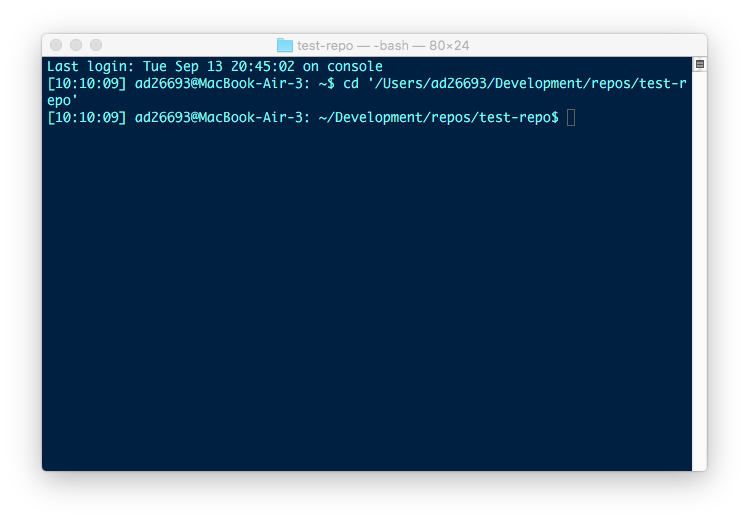
</center><br>

**NOTE:** Your prompt will almost certainly look different than that in the image above!

[Alternatively, open a separate Terminal window and navigate to the directory of the repo you wish to push.] At the *Terminal* prompt (*not* in your ***R*** Console), enter...

<pre>
git remote add origin git@github.com:<i>your GitHub user name</i>/<i>your repo name</i>.git
git push -u origin master
</pre>

The first line tells ***git*** the remote URL that you are going to push to, and the second pushes your local repo up to the remote master.

- From within ***RStudio***, you can now open the project and repo that you just pushed to ***GitHub***. In the project, you can add or edit files, and you can locally commit any changes you make to those files and push them up to GitHub as described above.

**Congratulations!** You have now pushed commits from your local repo to ***GitHub***, and you should be able to see those files in your ***GitHub*** repo online. The `Pull` and `Push` buttons in ***RStudio*** should now also work. 

***Remember***: after each `Commit`, you will have to push to ***GitHub*** manually. This does not happen automatically.

<br>

***

#### **CHALLENGE**

***

- Start a new ***R*** project using one of the methods above -- call it "AN588-Week-2" -- and in it, create an **RMarkdown** document in which you will take notes and complete the coding CHALLENGES from [Module 4](http://fuzzyatelin.github.io/bioanth-stats/module-04/module-04.html). You can begin with a standard **RMarkdown** document template created by choosing **File -> New File -> R Markdown** and choosing `HTML` as the `Default Document Output`.

<br><center>

</center><br>

- You should commit your document locally several times during class and as you complete the coding challenges, and you should push your updated repo to ***GitHub*** periodically as well. The instructions above should be helpful in getting you comfortable with commiting changes to your local repo and pushing changes up to ***GitHub***. Feel free to come see me during the week if you run into any problems!

- By the start of next week's class, your updated **RMarkdown** document addressing all of today's CHALLENGES should be posted to ***GitHub*** and you should "knit" your document to HTML and post that to ***GitHub*** as well (see below for more on what it means to "knit" your document to HTML).

#### Additional Useful Info

##### Using Terminal

RStudio provides an interface to the most common version control operations including managing changelists, diffing files, committing, and viewing history. While these features cover basic everyday use of ***git*** and ***Subversion***, you may also occasionally need to use Terminal to access all of their underlying functionality.

***RStudio*** includes functionality to make it more straightforward to use Terminal with projects under version control. This includes:

- On all platforms, you can use the **Tools -> Terminal -> New Terminal...** command to open a new Terminal window with the working directory already initialized to your project's root directory.

- On Windows when using ***git***, the **Terminal** command will open **Git Bash**, which is a port of the bash shell to Windows specially configured for use with Msys Git (note you can disable this behavior and use the standard Windows command prompt instead using **Options -> Version Control**).

##### SSH

Version control repositories can typically be accessed using a variety of protocols (including **HTTP** and **HTTPS**). Many repositories can also be accessed using **SSH** (this is the mode of connection for many hosting services including ***GitHub*** and ***R-Forge***, and is the process described above).

In many cases the authentication for an **SSH** connection is done using public/private `RSA` key pairs. This type of authentication requires two steps:

- Generate a public/private key pair
- Provide the public key to the hosting provider (e.g., ***GitHub*** or ***R-Forge***)

To make working with `RSA` key pairs more straightforward the **RStudio Version Control** options panel can be used to both create new `RSA` public/private key pairs as well as view and copy the current `RSA` public key.

While Linux and Mac OSX both have long included SSH as part of the base system, Windows did not until fairly recently (you can learn more about how to access SSH in Windows [here](https://learn.microsoft.com/en-us/windows/terminal/tutorials/ssh)). As a result the standard Windows distribution of ***git*** (Msysgit, referenced above) also includes an SSH client.

***

# Tips for **RMarkdown** Prettification

***

One of the more delightful aspects of using **RMarkdown** is "knitting" your `.Rmd` file to a more useful and visually pleasing format. For this class, we will mostly be knitting to HTML (which is the document format that makes up web pages), but you can also knit your document to PDF, to a Word Doc, or to many other useful formats. 

This conversion of your raw **RMarkdown** code to another - often more familiar - format is *not* a trivial pursuit: aesthetically pleasing formatting can both enhance your own data management *and* make sharing your work a more rewarding experience for those on the receiving end. Now, we will not have a formal **RMarkdwn** tutorial during class; this is best done as an experimental, trial-and-error process on your own! However, we will address **RMarkdown** coding during our troubleshooting sessions, predominantly related to formatting requests I'll be making as part of your homework assignments. 

In addition to what we'll discuss in class, there are a number of websites and cheat sheets that can help make your **RMarkdown** experience smoother, more aesthetically rigorous, and more useful. I *strongly* encourage you to spend some time with them to make your **RMarkdown** as beautiful as you make your code!

To get you started, here's one helpful **RMarkdown Cheatsheet**, which can help guide you through basic formatting for your **RMarkdown** documents. Remember, to see the effects of changing your formatting code in the `.Rmd` file, you need to *knit* your **RMarkdown** file to its intended final format (in our case, HTML):

<br><center>
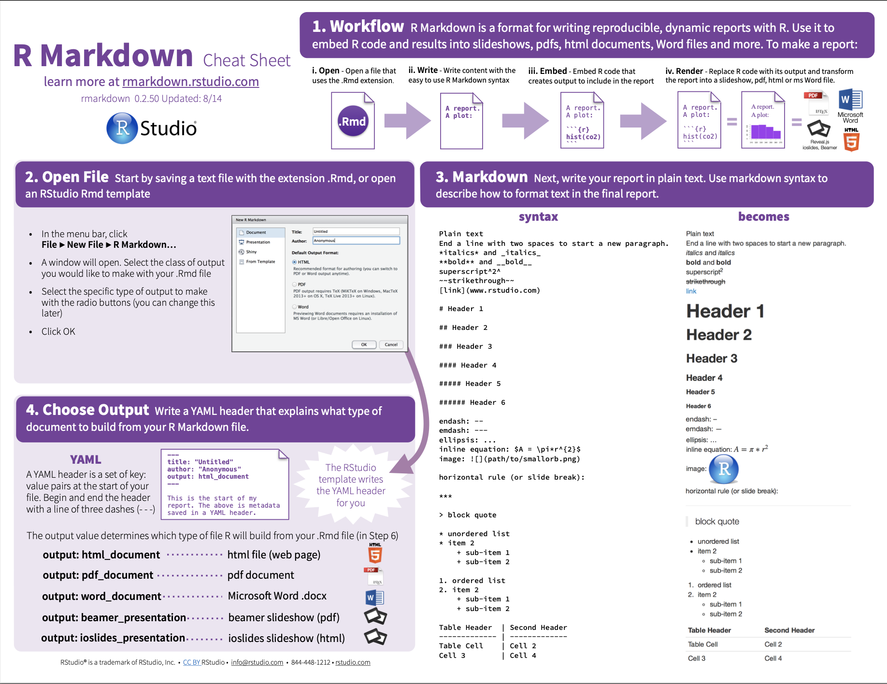
</center>

<center>
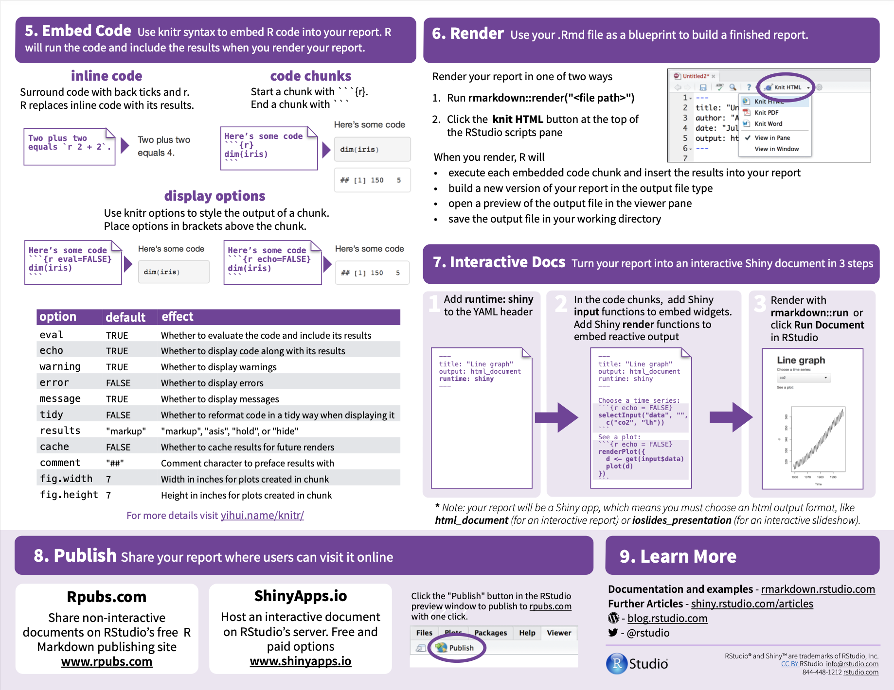
</center><br>


***

#### **CHALLENGE**

***

- In your "AN588-Week-2" repository, you've already created an HTML-formatted **RMarkdown** document in which you've taken notes and completed the previous coding CHALLENGES from [Module 4](http://fuzzyatelin.github.io/bioanth-stats/module-04/module-04.html). *Knit* this document and take a look at the appearance of the knit document. Is it readable? Is it aesthetically pleasing? Keep this un-prettified original knitted document for future reference... 

- Create a *new* HTML-formatted **RMarkdown** document that is a *copy* of your original. Name it "prettified-NAME.Rmd" with *NAME* being the original document name you gave your **RMarkdown** document for the Module 4 CHALLENGES.

- Using the instructions in the **RMarkdown Cheatsheet** above, try to make your document more readable and accessible. You can experiment with different *themes* (which themselves have variable fonts and colors) in the *YAML*, add headers that are part of a hierarchical table of contents, partition your code in to different ***R*** *chunks* that allow you to illustrate to your reader what you've done once the document is knitted into HTML. As always, feel free to come see me during the week if you run into any problems!

- By the start of next week's class, your updated *prettified* **RMarkdown** document addressing all of today's CHALLENGES should also be posted to ***GitHub*** along with the "knitted" version (to HTML).

<br>

To help with this exercise, beyond the above Cheatsheet, there are *many* more helpful and complete resources available online:

<ul>
<li>An introduction to [R Markdown](https://rmarkdown.rstudio.com/)</li>
<li>[R Markdown: The Definitive Guide](https://bookdown.org/yihui/rmarkdown/)</li>
<li>[R Markdown Cheatsheet](https://rmarkdown.rstudio.com/lesson-15.html)</li>
<li>[Another R Markdown Cheatsheet](https://www.rstudio.com/wp-content/uploads/2015/02/rmarkdown-cheatsheet.pdf)</li>
<li>[Pimp my RMD: A Few Tips for R Markdown](https://holtzy.github.io/Pimp-my-rmd/)</li>
<li>[R Markdown Templates for Journal Submissions](https://github.com/rstudio/rticles/tree/master/inst/rmarkdown/templates)</li>
<li>[Using R Markdown for Class Reports](https://www.stat.cmu.edu/~cshalizi/rmarkdown/)</li>
<li>[R Markdown Theme Gallery](http://www.datadreaming.org/post/r-markdown-theme-gallery/)</li>
<li>[Creating Pretty Documents from R Markdown](https://cran.r-project.org/web/packages/prettydoc/vignettes/architect.html)</li>
</ul>
<br>

In addition to the above (but by no means necessary for this course), you can *also* embed actual HTML code in your **RMarkdown** document to modify the appearance of your final knitted HTML. If you're interested in trying this out, here's [a basic HTML tutorial](https://www.geeksforgeeks.org/html-basics/).

Experiment to find a formatting that works for you! I'll look forward to seeing what you land on as your preferred format in your repo!

Also, to help stretch these abilities, I'll be asking for specific formatting specifications in your final knitted homework assignments, to push you to experiment a bit with your **RMarkdown** skills... <br>
