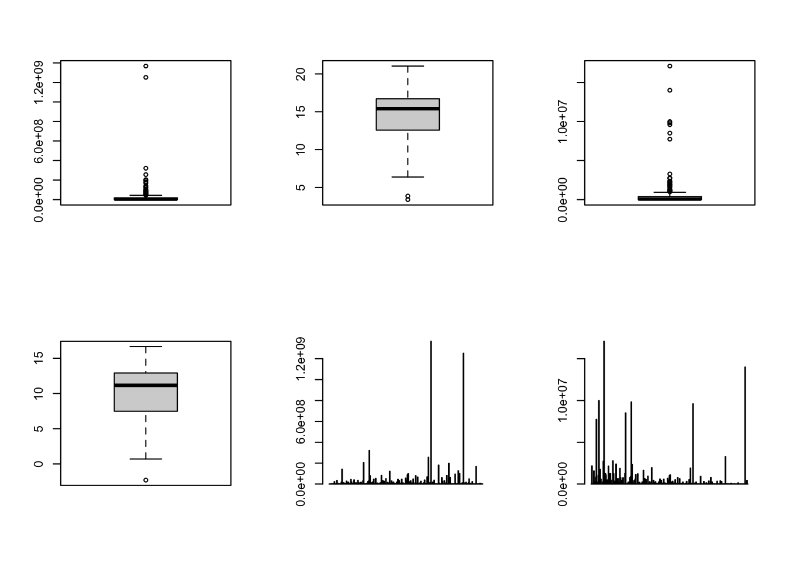
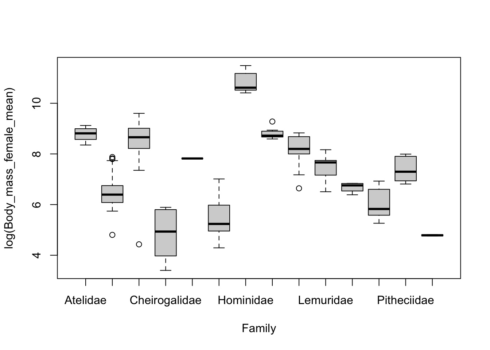
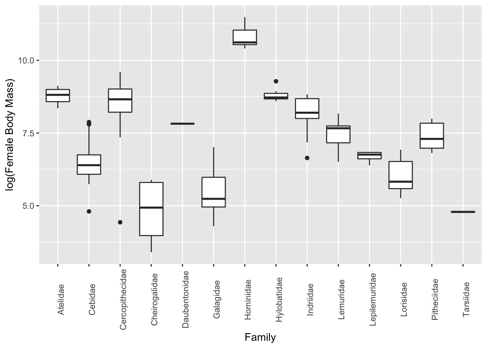
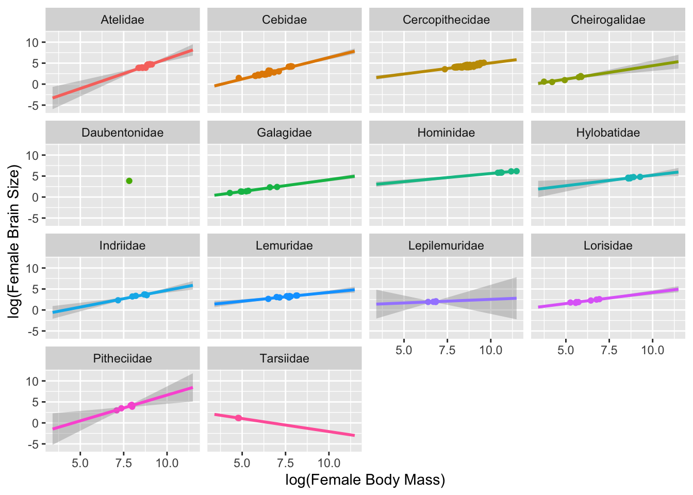
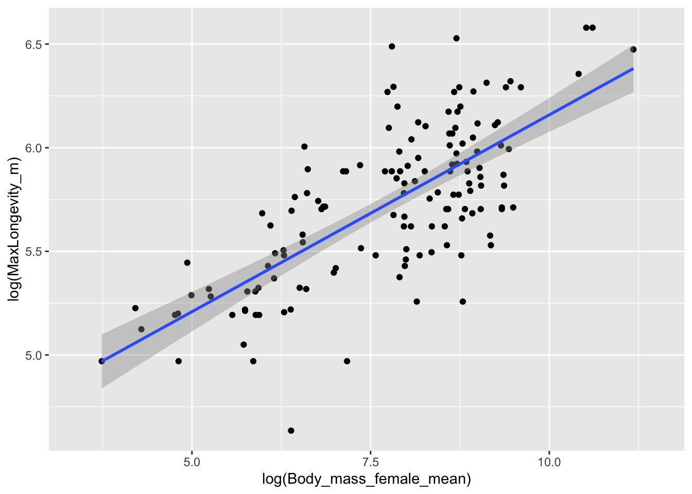

Module 06
================
by Anthony Di Fiore and Christopher Schmitt

Exploratory Data Analysis
=========================

Objectives
----------

> The objective of this module to begin exploring data using the summary functions and graphing abilities of ***R***.

Preliminaries
-------------

-   GO TO: <https://github.com/fuzzyatelin/fuzzyatelin.github.io/tree/master/AN597_Fall17/>, select the `.csv` version of the *Country-Data-2016* file, then press the `RAW` button, highlight, and copy the text to a text editor and save it locally. Do the same for the *KamilarAndCooperData* file.

-   Install these packages in ***R***: [{dplyr}](https://cran.r-project.org/web/packages/dplyr/vignettes/dplyr.html), [{ggplot2}](http://ggplot2.tidyverse.org/reference/)

The Backstory
-------------

***R*** has some very easy to use functions for taking a quick tour of your data. We have seen some of these already (e.g., `head()`, `tail()`, and `str()`), and you should always use these right after loading in a dataset to work with. Also useful are `dim()` to return the number of rows and columns in a data frame, `names()`, `colnames()`, and sometimes `rownames()`.

> As an aside, you can use the `attach()` function to make variables within data frames accessible in ***R*** with fewer keystrokes. The `attach()` functions binds the variables from data frame named as an argument to the local namespace so that as long as the data frame is attached, variables can be called by their names without explicitly referring to the data frame. That is, if you `attach()` a data frame, then you do not need to use the **$** operator or **bracket notation** to refer to a particular variable. It is important to remember to `detach()` data frames when finished. It is also possible to attach multiple data frames (and the same data frame multiple times), and, if these share variable names, then the more recently attached one will mask the other. Thus, it is best to attach only one data frame at a time.

> The `with()` function accomplishes much the same thing as `attach()` but is self-contained and cleaner, especially for use in functions. If you use `with()`, all code to be run should be included as an argument of the function.

Some Useful Procedures for Exploratory Data Analysis
----------------------------------------------------

### For univariate data

-   Summary: The `summary()` function provides a quick overview of each column in a data frame. For **numeric** variables, this includes the minimum, 25th percentile, median, mean, 75th percentile, and maximum of the data, as well as a count of `NA` (missing values). For **factors**, it includes a count of each factor.

#### CHALLENGE:

-   Load the **Country-Data-2016** dataset into a data frame variable, **d**, and summarize the variables in that data frame. You can load the file any way you want, e.g., load from a local file, or you can access the data straight from ***GitHub***, as in the code below.

``` r
library(curl)
f <- curl("https://raw.githubusercontent.com/fuzzyatelin/fuzzyatelin.github.io/master/AN597_Fall17/Country-Data-2016.csv")
d <- read.csv(f, header = TRUE, sep = ",", stringsAsFactors = FALSE)
head(d)
```

    ##          country population    area                      govt_form
    ## 1    Afghanistan   32564342  652230               islamic republic
    ## 2        Albania    3029278   28748                       republic
    ## 3        Algeria   39542166 2381741                       republic
    ## 4 American Samoa      54343     199 territory of the United States
    ## 5        Andorra      85580     468        constitutional monarchy
    ## 6         Angola   19625353 1246700                       republic
    ##   birthrate deathrate life_expect mammals birds reptiles amphibians fishes
    ## 1      38.6      13.9        50.9      11    17        1          1      5
    ## 2      12.9       6.6        78.1       3    10        4          2     44
    ## 3      23.7       4.3        76.6      14    14        8          3     40
    ## 4      22.9       4.8        75.1       1     8        6          0     12
    ## 5       8.1       7.0        82.7       2     2        1          0      0
    ## 6      38.8      11.5        55.6      17    26        5          0     51
    ##   mollucs other_inverts plants fungi_protists
    ## 1       0             2      5              0
    ## 2      49            13      0              0
    ## 3      10            26     18              0
    ## 4       5            59      1              0
    ## 5       3             4      0              0
    ## 6       5             4     34              0

``` r
summary(d)
```

    ##    country            population             area         
    ##  Length:248         Min.   :3.000e+01   Min.   :       0  
    ##  Class :character   1st Qu.:2.991e+05   1st Qu.:    1769  
    ##  Mode  :character   Median :4.912e+06   Median :   69700  
    ##                     Mean   :2.999e+07   Mean   :  610952  
    ##                     3rd Qu.:1.803e+07   3rd Qu.:  398754  
    ##                     Max.   :1.367e+09   Max.   :17098242  
    ##                     NA's   :6           NA's   :1         
    ##   govt_form           birthrate       deathrate      life_expect   
    ##  Length:248         Min.   : 0.00   Min.   : 0.00   Min.   :49.80  
    ##  Class :character   1st Qu.:11.40   1st Qu.: 5.65   1st Qu.:67.40  
    ##  Mode  :character   Median :16.40   Median : 7.40   Median :74.70  
    ##                     Mean   :18.95   Mean   : 7.61   Mean   :72.19  
    ##                     3rd Qu.:24.35   3rd Qu.: 9.40   3rd Qu.:78.40  
    ##                     Max.   :45.50   Max.   :14.90   Max.   :89.50  
    ##                     NA's   :17      NA's   :17      NA's   :19     
    ##     mammals           birds           reptiles         amphibians     
    ##  Min.   :  0.00   Min.   :  0.00   Min.   :  0.000   Min.   :  0.000  
    ##  1st Qu.:  3.00   1st Qu.:  6.00   1st Qu.:  2.000   1st Qu.:  0.000  
    ##  Median :  8.00   Median : 12.00   Median :  5.000   Median :  0.000  
    ##  Mean   : 13.85   Mean   : 17.82   Mean   :  8.331   Mean   :  9.849  
    ##  3rd Qu.: 15.00   3rd Qu.: 19.00   3rd Qu.:  8.000   3rd Qu.:  4.000  
    ##  Max.   :188.00   Max.   :165.00   Max.   :139.000   Max.   :215.000  
    ##  NA's   :3        NA's   :3        NA's   :3         NA's   :3        
    ##      fishes          mollucs       other_inverts        plants       
    ##  Min.   :  0.00   Min.   :  0.00   Min.   :  0.00   Min.   :   0.00  
    ##  1st Qu.: 11.00   1st Qu.:  0.00   1st Qu.:  3.00   1st Qu.:   2.00  
    ##  Median : 25.00   Median :  1.00   Median : 11.00   Median :  10.00  
    ##  Mean   : 32.84   Mean   :  9.62   Mean   : 32.57   Mean   :  60.78  
    ##  3rd Qu.: 43.00   3rd Qu.:  6.00   3rd Qu.: 33.00   3rd Qu.:  44.00  
    ##  Max.   :249.00   Max.   :301.00   Max.   :340.00   Max.   :1856.00  
    ##  NA's   :3        NA's   :3        NA's   :3        NA's   :3        
    ##  fungi_protists   
    ##  Min.   : 0.0000  
    ##  1st Qu.: 0.0000  
    ##  Median : 0.0000  
    ##  Mean   : 0.6082  
    ##  3rd Qu.: 0.0000  
    ##  Max.   :12.0000  
    ##  NA's   :3

``` r
names(d)
```

    ##  [1] "country"        "population"     "area"           "govt_form"     
    ##  [5] "birthrate"      "deathrate"      "life_expect"    "mammals"       
    ##  [9] "birds"          "reptiles"       "amphibians"     "fishes"        
    ## [13] "mollucs"        "other_inverts"  "plants"         "fungi_protists"

-   What are the median area and population size of all countries in the dataset? **HINT:** There are a couple of ways to do this... try `summary()` and `median()` (for the latter, you'll need to use the `na.rm = TRUE` argument)
-   Create a new **pop\_density** variable in your data frame which is population / area. What are the 10 most dense countries? The 10 least dense? **HINT:** check out the `order()` function

``` r
d$density <- d$population/d$area
d <- d[order(-d$density), ]
d[1:10, ]
```

    ##                     country population   area
    ## 130                   Macau     592731   28.0
    ## 145                  Monaco      30535    2.0
    ## 97  Holy See (Vatican City)        842    0.1
    ## 199               Singapore    5674472  697.0
    ## 99                Hong Kong    7141106 1108.0
    ## 84                Gibraltar      29258    7.0
    ## 17                  Bahrain    1346613  760.0
    ## 135                Maldives     393253  298.0
    ## 137                   Malta     413965  316.0
    ## 24                  Bermuda      70196   54.0
    ##                                  govt_form birthrate deathrate life_expect
    ## 130 special administrative region of China       8.9       4.2        84.5
    ## 145                constitutional monarchy       6.7       9.2        89.5
    ## 97                                monarchy        NA        NA          NA
    ## 199                               republic       8.3       3.4        84.7
    ## 99  special administrative region of China       9.2       7.1        82.9
    ## 84              British overseas territory      14.1       8.4        79.3
    ## 17                 constitutional monarchy      13.7       2.7        78.7
    ## 135                               republic      15.8       3.9        75.4
    ## 137                               republic      10.2       9.1        80.2
    ## 24              British overseas territory      11.3       8.2        81.2
    ##     mammals birds reptiles amphibians fishes mollucs other_inverts plants
    ## 130       0     4        1          0      5       0             1      0
    ## 145       3     0        0          0     15       0             3      0
    ## 97        1     0        0          0      0       0             0      0
    ## 199      13    17        6          0     27       0           173     58
    ## 99        3    20        5          5     13       1             7      9
    ## 84        4     5        0          0     18       3             2      0
    ## 17        3     6        4          0     10       0            13      0
    ## 135       2     0        3          0     24       0            46      0
    ## 137       2     5        1          0     22       3             2      4
    ## 24        4     1        4          0     26       0            28      8
    ##     fungi_protists   density
    ## 130              0 21168.964
    ## 145              0 15267.500
    ## 97               0  8420.000
    ## 199              0  8141.280
    ## 99               0  6445.042
    ## 84               0  4179.714
    ## 17               0  1771.859
    ## 135              0  1319.641
    ## 137              0  1310.016
    ## 24               0  1299.926

``` r
d <- d[order(d$density), ]
d[1:10, ]
```

    ##                                      country population    area
    ## 206 South Georgia and South Sandwich Islands         30    3903
    ## 86                                 Greenland      57733 2166086
    ## 70                          Falkland Islands       3361   12173
    ## 175                         Pitcairn Islands         48      47
    ## 146                                 Mongolia    2992908 1564116
    ## 245                           Western Sahara     570866  266000
    ## 76                             French Guiana     181000   83534
    ## 152                                  Namibia    2212307  824292
    ## 13                                 Australia   22751014 7741220
    ## 101                                  Iceland     331918  103000
    ##                        govt_form birthrate deathrate life_expect mammals
    ## 206   British overseas territory        NA        NA          NA       3
    ## 86  autonomous region of Denmark      14.5       8.5        72.1       9
    ## 70    British overseas territory        NA        NA          NA       4
    ## 175   British overseas territory        NA        NA          NA       1
    ## 146                     republic      20.3       6.4        69.3      11
    ## 245 autonomous region of Morocco      30.2       8.3        62.6      10
    ## 76  overseas territory of France       0.0       0.0        76.1       8
    ## 152                     republic      19.8      13.9        51.6      14
    ## 13        parliamentary monarchy      12.2       7.1        82.2      63
    ## 101                     republic      13.9       6.3        83.0       6
    ##     birds reptiles amphibians fishes mollucs other_inverts plants
    ## 206     6        0          0      0       0             0      0
    ## 86      3        0          0      9       0             0      1
    ## 70      9        0          0      5       0             0      5
    ## 175    10        0          0     10       5            11      7
    ## 146    24        0          0      2       0             3      0
    ## 245     3        1          0     31       0             3      0
    ## 76      8        7          3     29       0             0     18
    ## 152    28        5          1     33       0             4     28
    ## 13     50       43         47    118     174           340     92
    ## 101     4        0          0     16       0             0      0
    ##     fungi_protists     density
    ## 206              0 0.007686395
    ## 86               0 0.026653143
    ## 70               0 0.276102851
    ## 175              0 1.021276596
    ## 146              0 1.913482120
    ## 245              0 2.146112782
    ## 76               0 2.166782388
    ## 152              0 2.683887506
    ## 13               1 2.938944249
    ## 101              0 3.222504854

-   Extract data from the 20 largest countries into a new variable. What are the median area and population size of these countries?
-   Extract data from all countries beginning with the letters "A" through "F". What are the mean area and population size of these countries?

``` r
new <- d[grep("^[A-F]", d$country), ]
summary(new)
```

    ##    country            population             area         
    ##  Length:78          Min.   :5.960e+02   Min.   :      14  
    ##  Class :character   1st Qu.:2.991e+05   1st Qu.:    4066  
    ##  Mode  :character   Median :4.785e+06   Median :   51148  
    ##                     Mean   :3.507e+07   Mean   :  918248  
    ##                     3rd Qu.:1.469e+07   3rd Qu.:  466498  
    ##                     Max.   :1.367e+09   Max.   :14000000  
    ##                     NA's   :4                             
    ##   govt_form           birthrate       deathrate       life_expect   
    ##  Length:78          Min.   : 0.00   Min.   : 0.000   Min.   :49.80  
    ##  Class :character   1st Qu.:11.65   1st Qu.: 5.850   1st Qu.:68.75  
    ##  Mode  :character   Median :15.90   Median : 7.700   Median :75.50  
    ##                     Mean   :18.77   Mean   : 7.861   Mean   :72.25  
    ##                     3rd Qu.:23.30   3rd Qu.: 9.500   3rd Qu.:78.40  
    ##                     Max.   :42.00   Max.   :14.400   Max.   :82.70  
    ##                     NA's   :7       NA's   :7        NA's   :7      
    ##     mammals         birds           reptiles        amphibians    
    ##  Min.   : 0.0   Min.   :  0.00   Min.   : 0.000   Min.   :  0.00  
    ##  1st Qu.: 3.0   1st Qu.:  6.00   1st Qu.: 2.000   1st Qu.:  0.00  
    ##  Median : 7.0   Median : 11.00   Median : 5.000   Median :  0.00  
    ##  Mean   :13.4   Mean   : 18.62   Mean   : 7.397   Mean   : 11.86  
    ##  3rd Qu.:14.0   3rd Qu.: 18.00   3rd Qu.: 8.000   3rd Qu.:  3.00  
    ##  Max.   :81.0   Max.   :165.00   Max.   :43.000   Max.   :215.00  
    ##                                                                   
    ##      fishes          mollucs       other_inverts        plants       
    ##  Min.   :  0.00   Min.   :  0.00   Min.   :  0.00   Min.   :   0.00  
    ##  1st Qu.: 10.00   1st Qu.:  0.00   1st Qu.:  4.00   1st Qu.:   2.25  
    ##  Median : 24.50   Median :  1.00   Median : 11.00   Median :  10.00  
    ##  Mean   : 29.54   Mean   : 10.17   Mean   : 23.63   Mean   :  70.64  
    ##  3rd Qu.: 41.50   3rd Qu.:  5.00   3rd Qu.: 25.25   3rd Qu.:  41.75  
    ##  Max.   :133.00   Max.   :174.00   Max.   :340.00   Max.   :1856.00  
    ##                                                                      
    ##  fungi_protists      density         
    ##  Min.   :0.0000   Min.   :   0.2761  
    ##  1st Qu.:0.0000   1st Qu.:  24.5932  
    ##  Median :0.0000   Median :  75.0297  
    ##  Mean   :0.6026   Mean   : 162.4785  
    ##  3rd Qu.:0.0000   3rd Qu.: 140.7140  
    ##  Max.   :8.0000   Max.   :1771.8592  
    ##                   NA's   :4

Or, alternatively...

``` r
mean(new$population, na.rm = TRUE)
```

    ## [1] 35065172

``` r
mean(new$area, na.rm = TRUE)
```

    ## [1] 918247.7

-   Boxplots : The `boxplot()` function provides a box-and-whiskers visual representation of the five-number summary plus outliers that go beyond the bulk of the data. The function balks if you pass it nonnumeric data, so you may need to reference columns specifically using either **bracket notation** or the **$** operator.
-   Barplot : The `barplot()` function is useful for crude data, with bar height proportional to the value of the variable. The function `dotchart()` provides a similar graphical summary.

#### CHALLENGE:

-   Make boxplots of the raw population and area data, then do the same after `log()` transforming these variables.

**NOTE:** The `par()` command will let you set up a grid of panel in which to plot. Here, I set up a two row by three column grid.

``` r
par(mfrow = c(2, 3))
boxplot(d$population)
boxplot(log(d$population))
boxplot(d$area)
boxplot(log(d$area))
barplot(d$population)
barplot(d$area)
```



-   Histograms : The `hist()` function returns a histogram showing the complete empirical distribution of the data in binned categories, which is useful for checking skewwness of the data, symmetry, multi-modality, etc. Setting the argument `freq=FALSE` will scale the Y axis to represent the *proportion* of observations falling into each bin rather than the *count*.

#### CHALLENGE:

-   Make histograms of the `log()` transformed population and area data from the **Country-Data-2016** file. Explore what happens if you set `freq=FALSE` versus the default of `freq=TRUE`. Try looking at other variables as well.

``` r
par(mfrow = c(1, 2))  # gives us two panels
attach(d)
hist(log(population), freq = FALSE, col = "red", main = "Plot 1", xlab = "log(population size)", 
    ylab = "density", ylim = c(0, 0.2))
hist(log(area), freq = FALSE, col = "red", main = "Plot 2", xlab = "log(area)", 
    ylab = "density", ylim = c(0, 0.2))
```


**NOTE:** You can add a line to your histograms (e.g., to show the mean value for a variable) using the `abline()` command, with arguments. For exmaple, to show a single *vertical* line representing the mean log(population size), you would add the argument `v=mean(log(population))`)

-   Density plot : The `density()` function computes a non-parametric estimate of the distribution of a variable, which can be combined with `plot()` to also yield a graphical view of the distribution of the data. If your data have missing values, then you need to add the argument `na.rm=TRUE` to the `density()` function. To superimpose a `density()` curve on a histogram, you can use the `lines(density())` function.

``` r
par(mfrow = c(1, 1))  # set up one panel and redraw the log(population) histogram
hist(log(population), freq = FALSE, col = "white", main = "My Plot with Mean and Density", 
    xlab = "log(population size)", ylab = "density", ylim = c(0, 0.2))
abline(v = mean(log(population), na.rm = TRUE), col = "blue")
lines(density(log(population), na.rm = TRUE), col = "green")
```


``` r
detach(d)
```

-   Tables : the `table()` function can be used to summarize counts and proportions for categorical variables in your dataset.

#### CHALLENGE:

-   Using the `table()` function, find what is the most common form of government in the **Country-Data-2016** dataset. How many countries have that form? **HINT:** We can combine `table()` with `sort()` and the argument `decreasing=TRUE` to get the desired answered straight away:

``` r
sort(table(d$govt_form), decreasing = TRUE)
```

    ## 
    ##                                republic 
    ##                                     127 
    ##                 constitutional monarchy 
    ##                                      33 
    ##              British overseas territory 
    ##                                      12 
    ##            overseas territory of France 
    ##                                       7 
    ##           presidential federal republic 
    ##                                       7 
    ##                                monarchy 
    ##                                       6 
    ##                  parliamentary monarchy 
    ##                                       5 
    ##          territory of the United States 
    ##                                       5 
    ##                 parliamentary democracy 
    ##                                       4 
    ##                  territory of Australia 
    ##                                       4 
    ## autonomous territory of the Netherlands 
    ##                                       3 
    ##                        federal republic 
    ##                                       3 
    ##                        islamic republic 
    ##                                       3 
    ##                      socialist republic 
    ##                                       3 
    ##                       absolute monarchy 
    ##                                       2 
    ##            autonomous region of Denmark 
    ##                                       2 
    ##     autonomous territory of New Zealand 
    ##                                       2 
    ##            overseas community of France 
    ##                                       2 
    ##          parliamentary federal republic 
    ##                                       2 
    ##  special administrative region of China 
    ##                                       2 
    ##                     territory of Norway 
    ##                                       2 
    ##                       autonomous region 
    ##                                       1 
    ##             autonomous region of France 
    ##                                       1 
    ##            autonomous region of Morocco 
    ##                                       1 
    ##                              federation 
    ##                                       1 
    ##         foreign-administrated territory 
    ##                                       1 
    ##      islamic-socialist peoples republic 
    ##                                       1 
    ##                  parliamentary republic 
    ##                                       1 
    ##                        peoples republic 
    ##                                       1 
    ##                     territory of France 
    ##                                       1 
    ##                territory of New Zealand 
    ##                                       1 
    ##            territory of the Netherlands 
    ##                                       1

### For multivariate data

-   Multiple boxplots or histograms can be laid out side-by-side or overlaid. For boxplots, the **~** operator can be read as "by".

#### CHALLENGE:

Read in the dataset **KamilarAndCooperData**, which contains a host of summary information about 213 primate species.

Spend some time exploring the data and then make boxplots of **log(female body mass) ~ family**. Try doing this with {base} graphics and then look at how we might do in in {ggplot2}, which provides a standard "grammar of graphics" (see the [{ggplot2} documentation](http://docs.ggplot2.org/current/))

``` r
f <- curl("https://raw.githubusercontent.com/fuzzyatelin/fuzzyatelin.github.io/master/AN597_Fall17/KamilarAndCooperData.csv")
d <- read.csv(f, header = TRUE, stringsAsFactors = FALSE)
attach(d)
head(d)
```

    ##               Scientific_Name          Family          Genus      Species
    ## 1 Allenopithecus_nigroviridis Cercopithecidae Allenopithecus nigroviridis
    ## 2         Allocebus_trichotis Cercopithecidae      Allocebus    trichotis
    ## 3           Alouatta_belzebul        Atelidae       Alouatta     belzebul
    ## 4             Alouatta_caraya        Atelidae       Alouatta       caraya
    ## 5            Alouatta_guariba        Atelidae       Alouatta      guariba
    ## 6           Alouatta_palliata        Atelidae       Alouatta     palliata
    ##   Brain_Size_Species_Mean Brain_Size_Female_Mean   Brain_size_Ref
    ## 1                   58.02                  53.70 Isler et al 2008
    ## 2                      NA                     NA                 
    ## 3                   52.84                  51.19 Isler et al 2008
    ## 4                   52.63                  47.80 Isler et al 2008
    ## 5                   51.70                  49.08 Isler et al 2008
    ## 6                   49.88                  48.04 Isler et al 2008
    ##   Body_mass_male_mean Body_mass_female_mean Mass_Dimorphism
    ## 1                6130                  3180           1.928
    ## 2                  92                    84           1.095
    ## 3                7270                  5520           1.317
    ## 4                6525                  4240           1.539
    ## 5                5800                  4550           1.275
    ## 6                7150                  5350           1.336
    ##                 Mass_Ref MeanGroupSize AdultMales AdultFemale
    ## 1       Isler et al 2008            NA         NA          NA
    ## 2 Smith and Jungers 1997          1.00       1.00         1.0
    ## 3       Isler et al 2008          7.00       1.00         1.0
    ## 4       Isler et al 2008          8.00       2.30         3.3
    ## 5       Isler et al 2008          6.53       1.37         2.2
    ## 6       Isler et al 2008         12.00       2.90         6.3
    ##   AdultSexRatio
    ## 1            NA
    ## 2            NA
    ## 3          1.00
    ## 4          1.43
    ## 5          1.61
    ## 6          2.17
    ##                                                     Social_Organization_Ref
    ## 1                                                                          
    ## 2                                                             Kappeler 1997
    ## 3                                                       Campbell et al 2007
    ## 4 van Schaik et al. 1999; Kappeler and Pereira 2003; Nunn & van Schaik 2000
    ## 5                                                       Campbell et al 2007
    ## 6 van Schaik et al. 1999; Kappeler and Pereira 2003; Nunn & van Schaik 2000
    ##   InterbirthInterval_d Gestation WeaningAge_d MaxLongevity_m LitterSz
    ## 1                   NA        NA       106.15          276.0     1.01
    ## 2                   NA        NA           NA             NA     1.00
    ## 3                   NA        NA           NA             NA       NA
    ## 4               337.62       187       323.16          243.6     1.01
    ## 5                   NA        NA           NA             NA       NA
    ## 6               684.37       186       495.60          300.0     1.02
    ##    Life_History_Ref GR_MidRangeLat_dd Precip_Mean_mm Temp_Mean_degC
    ## 1 Jones et al. 2009             -0.17         1574.0           25.2
    ## 2                              -16.59         1902.3           20.3
    ## 3                               -6.80         1643.5           24.9
    ## 4 Jones et al. 2009            -20.34         1166.4           22.9
    ## 5                              -21.13         1332.3           19.6
    ## 6 Jones et al. 2009              6.95         1852.6           23.7
    ##   AET_Mean_mm PET_Mean_mm       Climate_Ref HomeRange_km2
    ## 1      1517.8      1589.4 Jones et al. 2009            NA
    ## 2      1388.2      1653.7 Jones et al. 2009            NA
    ## 3      1286.6      1549.8 Jones et al. 2009            NA
    ## 4      1193.1      1404.9 Jones et al. 2009            NA
    ## 5      1225.7      1332.2 Jones et al. 2009          0.03
    ## 6      1300.0      1633.9 Jones et al. 2009          0.19
    ##        HomeRangeRef DayLength_km     DayLengthRef Territoriality Fruit
    ## 1                             NA                              NA    NA
    ## 2                             NA                              NA    NA
    ## 3                             NA                              NA  57.3
    ## 4                           0.40 Nunn et al. 2003             NA  23.8
    ## 5 Jones et al. 2009           NA                              NA   5.2
    ## 6 Jones et al. 2009         0.32 Nunn et al. 2003         0.6506  33.1
    ##   Leaves Fauna             DietRef1 Canine_Dimorphism
    ## 1                                               2.210
    ## 2                                                  NA
    ## 3   19.1   0.0 Campbell et al. 2007             1.811
    ## 4   67.7   0.0 Campbell et al. 2007             1.542
    ## 5   73.0   0.0 Campbell et al. 2007             1.783
    ## 6   56.4   0.0 Campbell et al. 2007             1.703
    ##   Canine_Dimorphism_Ref  Feed  Move  Rest Social  Activity_Budget_Ref
    ## 1   Plavcan & Ruff 2008    NA    NA    NA     NA                     
    ## 2                          NA    NA    NA     NA                     
    ## 3   Plavcan & Ruff 2008 13.75 18.75 57.30  10.00 Campbell et al. 2007
    ## 4   Plavcan & Ruff 2008 15.90 17.60 61.60   4.90 Campbell et al. 2007
    ## 5   Plavcan & Ruff 2008 18.33 14.33 64.37   3.00 Campbell et al. 2007
    ## 6   Plavcan & Ruff 2008 17.94 12.32 66.14   3.64 Campbell et al. 2007

``` r
summary(d)
```

    ##  Scientific_Name       Family             Genus          
    ##  Length:213         Length:213         Length:213        
    ##  Class :character   Class :character   Class :character  
    ##  Mode  :character   Mode  :character   Mode  :character  
    ##                                                          
    ##                                                          
    ##                                                          
    ##                                                          
    ##    Species          Brain_Size_Species_Mean Brain_Size_Female_Mean
    ##  Length:213         Min.   :  1.63          Min.   :  1.66        
    ##  Class :character   1st Qu.: 13.95          1st Qu.: 13.23        
    ##  Mode  :character   Median : 61.45          Median : 57.20        
    ##                     Mean   : 68.11          Mean   : 65.24        
    ##                     3rd Qu.: 88.48          3rd Qu.: 86.80        
    ##                     Max.   :491.27          Max.   :480.15        
    ##                     NA's   :42              NA's   :48            
    ##  Brain_size_Ref     Body_mass_male_mean Body_mass_female_mean
    ##  Length:213         Min.   :    31      Min.   :   30.0      
    ##  Class :character   1st Qu.:   865      1st Qu.:  835.5      
    ##  Mode  :character   Median :  4290      Median : 3039.0      
    ##                     Mean   :  8112      Mean   : 5396.5      
    ##                     3rd Qu.:  7815      3rd Qu.: 6390.0      
    ##                     Max.   :170400      Max.   :97500.0      
    ##                     NA's   :18          NA's   :18           
    ##  Mass_Dimorphism   Mass_Ref         MeanGroupSize     AdultMales    
    ##  Min.   :0.841   Length:213         Min.   : 1.00   Min.   : 0.900  
    ##  1st Qu.:1.013   Class :character   1st Qu.: 4.00   1st Qu.: 1.000  
    ##  Median :1.109   Mode  :character   Median : 7.80   Median : 1.500  
    ##  Mean   :1.246                      Mean   :15.06   Mean   : 2.516  
    ##  3rd Qu.:1.409                      3rd Qu.:18.50   3rd Qu.: 3.100  
    ##  Max.   :2.688                      Max.   :90.00   Max.   :16.000  
    ##  NA's   :18                         NA's   :60      NA's   :68      
    ##   AdultFemale     AdultSexRatio    Social_Organization_Ref
    ##  Min.   : 1.000   Min.   : 0.500   Length:213             
    ##  1st Qu.: 1.000   1st Qu.: 1.000   Class :character       
    ##  Median : 2.900   Median : 1.450   Mode  :character       
    ##  Mean   : 5.049   Mean   : 2.305                          
    ##  3rd Qu.: 7.100   3rd Qu.: 2.770                          
    ##  Max.   :25.200   Max.   :15.600                          
    ##  NA's   :68       NA's   :84                              
    ##  InterbirthInterval_d   Gestation       WeaningAge_d    MaxLongevity_m 
    ##  Min.   : 144.5       Min.   : 59.99   Min.   :  40.0   Min.   :103.0  
    ##  1st Qu.: 365.0       1st Qu.:142.00   1st Qu.: 122.4   1st Qu.:233.4  
    ##  Median : 476.9       Median :165.04   Median : 237.7   Median :303.6  
    ##  Mean   : 572.1       Mean   :163.47   Mean   : 310.0   Mean   :327.3  
    ##  3rd Qu.: 741.4       3rd Qu.:180.75   3rd Qu.: 383.4   3rd Qu.:394.2  
    ##  Max.   :2007.5       Max.   :256.00   Max.   :1260.8   Max.   :720.0  
    ##  NA's   :103          NA's   :75       NA's   :95       NA's   :66     
    ##     LitterSz     Life_History_Ref   GR_MidRangeLat_dd Precip_Mean_mm
    ##  Min.   :0.990   Length:213         Min.   :-24.500   Min.   : 419  
    ##  1st Qu.:1.010   Class :character   1st Qu.:-13.625   1st Qu.:1190  
    ##  Median :1.010   Mode  :character   Median : -0.760   Median :1542  
    ##  Mean   :1.181                      Mean   : -1.796   Mean   :1543  
    ##  3rd Qu.:1.050                      3rd Qu.:  6.785   3rd Qu.:1857  
    ##  Max.   :2.520                      Max.   : 35.880   Max.   :2794  
    ##  NA's   :47                         NA's   :38        NA's   :38    
    ##  Temp_Mean_degC   AET_Mean_mm      PET_Mean_mm     Climate_Ref       
    ##  Min.   : 2.60   Min.   : 453.1   Min.   : 842.5   Length:213        
    ##  1st Qu.:21.95   1st Qu.:1091.0   1st Qu.:1512.3   Class :character  
    ##  Median :24.30   Median :1291.1   Median :1566.9   Mode  :character  
    ##  Mean   :23.13   Mean   :1253.1   Mean   :1553.2                     
    ##  3rd Qu.:25.20   3rd Qu.:1444.2   3rd Qu.:1622.2                     
    ##  Max.   :27.40   Max.   :1828.3   Max.   :1927.3                     
    ##  NA's   :38      NA's   :38       NA's   :38                         
    ##  HomeRange_km2     HomeRangeRef        DayLength_km    DayLengthRef      
    ##  Min.   : 0.0020   Length:213         Min.   : 0.250   Length:213        
    ##  1st Qu.: 0.0600   Class :character   1st Qu.: 0.708   Class :character  
    ##  Median : 0.2750   Mode  :character   Median : 1.212   Mode  :character  
    ##  Mean   : 1.9379                      Mean   : 1.551                     
    ##  3rd Qu.: 0.8995                      3rd Qu.: 1.800                     
    ##  Max.   :28.2400                      Max.   :11.000                     
    ##  NA's   :65                           NA's   :104                        
    ##  Territoriality        Fruit          Leaves             Fauna          
    ##  Min.   : 0.2250   Min.   : 1.00   Length:213         Length:213        
    ##  1st Qu.: 0.8555   1st Qu.:27.00   Class :character   Class :character  
    ##  Median : 1.5923   Median :48.00   Mode  :character   Mode  :character  
    ##  Mean   : 2.2289   Mean   :47.74                                        
    ##  3rd Qu.: 2.6867   3rd Qu.:68.00                                        
    ##  Max.   :15.5976   Max.   :97.00                                        
    ##  NA's   :109       NA's   :98                                           
    ##    DietRef1         Canine_Dimorphism Canine_Dimorphism_Ref
    ##  Length:213         Min.   :0.880     Length:213           
    ##  Class :character   1st Qu.:1.109     Class :character     
    ##  Mode  :character   Median :1.560     Mode  :character     
    ##                     Mean   :1.617                          
    ##                     3rd Qu.:1.883                          
    ##                     Max.   :5.263                          
    ##                     NA's   :92                             
    ##       Feed            Move            Rest           Social      
    ##  Min.   : 9.00   Min.   : 3.00   Min.   : 4.00   Min.   : 0.900  
    ##  1st Qu.:21.75   1st Qu.:14.93   1st Qu.:18.38   1st Qu.: 3.500  
    ##  Median :33.30   Median :21.00   Median :30.48   Median : 5.400  
    ##  Mean   :33.08   Mean   :21.67   Mean   :34.26   Mean   : 7.369  
    ##  3rd Qu.:43.08   3rd Qu.:26.90   3rd Qu.:52.40   3rd Qu.:10.000  
    ##  Max.   :63.90   Max.   :70.60   Max.   :78.50   Max.   :23.500  
    ##  NA's   :141     NA's   :143     NA's   :143     NA's   :136     
    ##  Activity_Budget_Ref
    ##  Length:213         
    ##  Class :character   
    ##  Mode  :character   
    ##                     
    ##                     
    ##                     
    ## 

Plotting using {base} graphics...

``` r
boxplot(log(Body_mass_female_mean) ~ Family, d)
```



``` r
detach(d)
```

Alternatively, plotting using {ggplot2}...

``` r
library(ggplot2)
p <- ggplot(data = d, aes(x = Family, y = log(Body_mass_female_mean)))
p <- p + geom_boxplot()
p <- p + theme(axis.text.x = element_text(angle = 90))
p <- p + ylab("log(Female Body Mass)")
p
```



-   Scatterplots : Scatterplots are a natural tool for visualizing two continuous variables and can be made easily with the `plot(x=XXX, y=YYY)` function in {base} graphics (where **XXX\* and **YYY\*\* denote the names of the two variables you wish to plot). Transformations of the variables, e.g., `log` or square-root (`sqrt()`), may be necessary for effective visualization.

#### CHALLENGE:

-   Again using data from the *KamilarAndCooperData* dataset, plot the relationship between female body size and female brain size. Then, play with log transforming the data and plot again.

``` r
attach(d)
par(mfrow = c(1, 2))
plot(x = Body_mass_female_mean, y = Brain_Size_Female_Mean)
plot(x = log(Body_mass_female_mean), y = log(Brain_Size_Female_Mean))
```


``` r
detach(d)
```

The grammar for {ggplot2} is a bit more complicated... see if you can follow it in the example below.

``` r
p <- ggplot(data = d, aes(x = log(Body_mass_female_mean), y = log(Brain_Size_Female_Mean), 
    color = factor(Family)))  # first, we build a plot object and color points by Family
p <- p + xlab("log(Female Body Mass)") + ylab("log(Female Brain Size)")  # then we modify the axis labels
p <- p + geom_point()  # then we make a scatterplot
p <- p + theme(legend.position = "bottom", legend.title = element_blank())  # then we modify the legend
p  # and, finally, we plot the object
```


Using {ggplot2}, we can also easily set up a grid for "faceting"" by a grouping variable...

``` r
p <- p + facet_wrap(~Family, ncol = 4)
p <- p + theme(legend.position = "none")
p
```

 And we can easily add regression lines to our plot. Here, we add a linear model to each facet.

``` r
p <- p + geom_smooth(method = "lm", fullrange = TRUE)
p
```



#### CHALLENGE:

-   Build your own bivariate scatterplot using the **KamilarAndCooperData** dataset.

``` r
p <- ggplot(data = d, aes(x = log(Body_mass_female_mean), y = log(MaxLongevity_m)))
p <- p + geom_point()
p <- p + geom_smooth(method = "lm")
p
```



### Aggregate Statistics and the {dplyr} Package

To calculate summary statistics for groups of observations in a data frame, there are many different approaches. One is to use the `aggregate()` function from the {stats} package (a standard package), which provides a quick way to look at summary statistics for sets of observations, though it requires a bit of clunky code. Here, we apply a particular function (`FUN = "mean"`) to mean female body mass, grouped by `Family`.

``` r
aggregate(d$Body_mass_female_mean ~ d$Family, FUN = "mean", na.rm = TRUE)
```

    ##           d$Family d$Body_mass_female_mean
    ## 1         Atelidae               6616.2000
    ## 2          Cebidae                876.3323
    ## 3  Cercopithecidae               6327.8247
    ## 4    Cheirogalidae                186.0286
    ## 5    Daubentonidae               2490.0000
    ## 6        Galagidae                371.6143
    ## 7        Hominidae              53443.7167
    ## 8      Hylobatidae               6682.1200
    ## 9        Indriidae               3886.5333
    ## 10       Lemuridae               1991.1200
    ## 11   Lepilemuridae                813.5000
    ## 12       Lorisidae                489.8625
    ## 13     Pitheciidae               1768.5000
    ## 14       Tarsiidae                120.0000

Or, alternatively...

``` r
aggregate(x = d["Body_mass_female_mean"], by = d["Family"], FUN = "mean", na.rm = TRUE)
```

    ##             Family Body_mass_female_mean
    ## 1         Atelidae             6616.2000
    ## 2          Cebidae              876.3323
    ## 3  Cercopithecidae             6327.8247
    ## 4    Cheirogalidae              186.0286
    ## 5    Daubentonidae             2490.0000
    ## 6        Galagidae              371.6143
    ## 7        Hominidae            53443.7167
    ## 8      Hylobatidae             6682.1200
    ## 9        Indriidae             3886.5333
    ## 10       Lemuridae             1991.1200
    ## 11   Lepilemuridae              813.5000
    ## 12       Lorisidae              489.8625
    ## 13     Pitheciidae             1768.5000
    ## 14       Tarsiidae              120.0000

Another, EASIER, way to summarize data is to use the package {plyr}, which provides "a flexible grammar of data manipulation" that includes a set of **verbs** that can be used to perform useful operations on data frames. Before using {dplyr} for this, let's look in general at what it can do...

``` r
library(dplyr)
```

    ## 
    ## Attaching package: 'dplyr'

    ## The following objects are masked from 'package:stats':
    ## 
    ##     filter, lag

    ## The following objects are masked from 'package:base':
    ## 
    ##     intersect, setdiff, setequal, union

``` r
s <- filter(d, Family == "Hominidae" & Mass_Dimorphism > 2)
head(s)  # filtering a data frame for certain rows...
```

    ##   Scientific_Name    Family   Genus  Species Brain_Size_Species_Mean
    ## 1 Gorilla_gorilla Hominidae Gorilla  gorilla                  490.41
    ## 2    Pongo_abelii Hominidae   Pongo   abelii                  389.50
    ## 3  Pongo_pygmaeus Hominidae   Pongo pygmaeus                  377.38
    ##   Brain_Size_Female_Mean   Brain_size_Ref Body_mass_male_mean
    ## 1                 455.89 Isler et al 2008            170400.0
    ## 2                 341.21 Isler et al 2008             84482.5
    ## 3                 337.72 Isler et al 2008             80136.9
    ##   Body_mass_female_mean Mass_Dimorphism         Mass_Ref MeanGroupSize
    ## 1               71500.0           2.383 Isler et al 2008           7.1
    ## 2               41148.0           2.053 Isler et al 2008            NA
    ## 3               36947.6           2.169 Isler et al 2008           2.0
    ##   AdultMales AdultFemale AdultSexRatio
    ## 1        1.8         4.4          2.44
    ## 2         NA          NA            NA
    ## 3        1.0         1.0          1.00
    ##                                                     Social_Organization_Ref
    ## 1 van Schaik et al. 1999; Kappeler and Pereira 2003; Nunn & van Schaik 2000
    ## 2                                                                          
    ## 3 van Schaik et al. 1999; Kappeler and Pereira 2003; Nunn & van Schaik 2000
    ##   InterbirthInterval_d Gestation WeaningAge_d MaxLongevity_m LitterSz
    ## 1               1430.8       256       920.35            648     1.05
    ## 2                   NA        NA           NA             NA       NA
    ## 3               2007.5       249      1088.80            720     1.07
    ##    Life_History_Ref GR_MidRangeLat_dd Precip_Mean_mm Temp_Mean_degC
    ## 1 Jones et al. 2009              0.88         1528.8           24.2
    ## 2                                  NA             NA             NA
    ## 3 Jones et al. 2009              1.33         2587.0           23.8
    ##   AET_Mean_mm PET_Mean_mm       Climate_Ref HomeRange_km2
    ## 1      1291.1      1502.7 Jones et al. 2009          4.03
    ## 2          NA          NA                              NA
    ## 3      1676.6      1691.7 Jones et al. 2009          3.88
    ##        HomeRangeRef DayLength_km     DayLengthRef Territoriality Fruit
    ## 1 Jones et al. 2009         0.86 Nunn et al. 2003         0.3797    11
    ## 2                             NA                              NA    NA
    ## 3 Jones et al. 2009         0.50 Nunn et al. 2003         0.2250    64
    ##   Leaves Fauna        DietRef1 Canine_Dimorphism Canine_Dimorphism_Ref
    ## 1     93     0 Nunn et al 2003             1.739   Plavcan & Ruff 2008
    ## 2                                          1.710   Plavcan & Ruff 2008
    ## 3     18     3 Nunn et al 2003             1.693   Plavcan & Ruff 2008
    ##   Feed  Move Rest Social                Activity_Budget_Ref
    ## 1 52.6  9.55 35.5    5.8 wendy dataset; Sussman et al. 2005
    ## 2   NA    NA   NA     NA                                   
    ## 3 42.4 15.40 41.0    1.2                       Kamilar 2006

``` r
s <- arrange(d, Family, Genus, Body_mass_male_mean)  # rearranging a data frame...
head(s)
```

    ##      Scientific_Name   Family    Genus   Species Brain_Size_Species_Mean
    ## 1   Alouatta_guariba Atelidae Alouatta   guariba                   51.70
    ## 2    Alouatta_caraya Atelidae Alouatta    caraya                   52.63
    ## 3 Alouatta_seniculus Atelidae Alouatta seniculus                   55.22
    ## 4  Alouatta_palliata Atelidae Alouatta  palliata                   49.88
    ## 5  Alouatta_belzebul Atelidae Alouatta  belzebul                   52.84
    ## 6     Alouatta_pigra Atelidae Alouatta     pigra                   51.13
    ##   Brain_Size_Female_Mean   Brain_size_Ref Body_mass_male_mean
    ## 1                  49.08 Isler et al 2008                5800
    ## 2                  47.80 Isler et al 2008                6525
    ## 3                  54.26 Isler et al 2008                6690
    ## 4                  48.04 Isler et al 2008                7150
    ## 5                  51.19 Isler et al 2008                7270
    ## 6                  48.75 Isler et al 2008               11400
    ##   Body_mass_female_mean Mass_Dimorphism         Mass_Ref MeanGroupSize
    ## 1                  4550           1.275 Isler et al 2008          6.53
    ## 2                  4240           1.539 Isler et al 2008          8.00
    ## 3                  5210           1.284 Isler et al 2008          7.10
    ## 4                  5350           1.336 Isler et al 2008         12.00
    ## 5                  5520           1.317 Isler et al 2008          7.00
    ## 6                  6430           1.773 Isler et al 2008          6.60
    ##   AdultMales AdultFemale AdultSexRatio
    ## 1      1.370       2.200          1.61
    ## 2      2.300       3.300          1.43
    ## 3      1.700       2.200          1.29
    ## 4      2.900       6.300          2.17
    ## 5      1.000       1.000          1.00
    ## 6      1.925       2.175          1.13
    ##                                                     Social_Organization_Ref
    ## 1                                                       Campbell et al 2007
    ## 2 van Schaik et al. 1999; Kappeler and Pereira 2003; Nunn & van Schaik 2000
    ## 3 van Schaik et al. 1999; Kappeler and Pereira 2003; Nunn & van Schaik 2000
    ## 4 van Schaik et al. 1999; Kappeler and Pereira 2003; Nunn & van Schaik 2000
    ## 5                                                       Campbell et al 2007
    ## 6                                                       Campbell et al 2007
    ##   InterbirthInterval_d Gestation WeaningAge_d MaxLongevity_m LitterSz
    ## 1                   NA        NA           NA             NA       NA
    ## 2               337.62       187       323.16          243.6     1.01
    ## 3               507.35       190       370.04          300.0     1.42
    ## 4               684.37       186       495.60          300.0     1.02
    ## 5                   NA        NA           NA             NA       NA
    ## 6                   NA       187           NA          240.0     1.01
    ##    Life_History_Ref GR_MidRangeLat_dd Precip_Mean_mm Temp_Mean_degC
    ## 1                              -21.13         1332.3           19.6
    ## 2 Jones et al. 2009            -20.34         1166.4           22.9
    ## 3 Jones et al. 2009              0.68         1823.4           25.1
    ## 4 Jones et al. 2009              6.95         1852.6           23.7
    ## 5                               -6.80         1643.5           24.9
    ## 6 Jones et al. 2009             18.80         1341.3           25.1
    ##   AET_Mean_mm PET_Mean_mm       Climate_Ref HomeRange_km2
    ## 1      1225.7      1332.2 Jones et al. 2009          0.03
    ## 2      1193.1      1404.9 Jones et al. 2009            NA
    ## 3      1449.8      1574.9 Jones et al. 2009          0.10
    ## 4      1300.0      1633.9 Jones et al. 2009          0.19
    ## 5      1286.6      1549.8 Jones et al. 2009            NA
    ## 6      1373.8      1580.8 Jones et al. 2009          0.30
    ##        HomeRangeRef DayLength_km     DayLengthRef Territoriality Fruit
    ## 1 Jones et al. 2009           NA                              NA   5.2
    ## 2                           0.40 Nunn et al. 2003             NA  23.8
    ## 3 Jones et al. 2009         0.55 Nunn et al. 2003         1.5414  40.0
    ## 4 Jones et al. 2009         0.32 Nunn et al. 2003         0.6506  33.1
    ## 5                             NA                              NA  57.3
    ## 6 Jones et al. 2009           NA                              NA  40.8
    ##   Leaves Fauna             DietRef1 Canine_Dimorphism
    ## 1   73.0   0.0 Campbell et al. 2007             1.783
    ## 2   67.7   0.0 Campbell et al. 2007             1.542
    ## 3   48.1   0.0 Campbell et al. 2007             1.464
    ## 4   56.4   0.0 Campbell et al. 2007             1.703
    ## 5   19.1   0.0 Campbell et al. 2007             1.811
    ## 6   45.1   0.0 Campbell et al. 2007             1.109
    ##   Canine_Dimorphism_Ref  Feed  Move  Rest Social  Activity_Budget_Ref
    ## 1   Plavcan & Ruff 2008 18.33 14.33 64.37   3.00 Campbell et al. 2007
    ## 2   Plavcan & Ruff 2008 15.90 17.60 61.60   4.90 Campbell et al. 2007
    ## 3   Plavcan & Ruff 2008 12.70  6.20 78.50   2.50 Campbell et al. 2007
    ## 4   Plavcan & Ruff 2008 17.94 12.32 66.14   3.64 Campbell et al. 2007
    ## 5   Plavcan & Ruff 2008 13.75 18.75 57.30  10.00 Campbell et al. 2007
    ## 6   Plavcan & Ruff 2008 24.40  9.80 61.90   3.80 Campbell et al. 2007

``` r
s <- select(d, Family, Genus, Body_mass_male_mean)  # selecting specific columns...
head(s)
```

    ##            Family          Genus Body_mass_male_mean
    ## 1 Cercopithecidae Allenopithecus                6130
    ## 2 Cercopithecidae      Allocebus                  92
    ## 3        Atelidae       Alouatta                7270
    ## 4        Atelidae       Alouatta                6525
    ## 5        Atelidae       Alouatta                5800
    ## 6        Atelidae       Alouatta                7150

``` r
s <- rename(d, Female_Mass = Body_mass_female_mean)
head(s$Female_Mass)  # renaming columns...
```

    ## [1] 3180   84 5520 4240 4550 5350

``` r
s <- mutate(d, Binomial = paste(Genus, Species, sep = " "))
head(s$Binomial)  # and adding new columns...
```

    ## [1] "Allenopithecus nigroviridis" "Allocebus trichotis"        
    ## [3] "Alouatta belzebul"           "Alouatta caraya"            
    ## [5] "Alouatta guariba"            "Alouatta palliata"

The {dplyr} package also makes it easy to summarize data using more convenient functions than `aggregate()`. For example:

``` r
s <- summarise(d, avgF = mean(Body_mass_female_mean, na.rm = TRUE), avgM = mean(Body_mass_male_mean, 
    na.rm = TRUE))
s
```

    ##       avgF     avgM
    ## 1 5396.474 8111.801

The `group_by()` function allows us to do apply summary functions to sets of observations defined by a categorical variable, as we did above with `aggregate()`.

``` r
byFamily <- group_by(d, Family)
byFamily
```

    ## # A tibble: 213 x 44
    ## # Groups:   Family [14]
    ##                Scientific_Name          Family          Genus      Species
    ##                          <chr>           <chr>          <chr>        <chr>
    ##  1 Allenopithecus_nigroviridis Cercopithecidae Allenopithecus nigroviridis
    ##  2         Allocebus_trichotis Cercopithecidae      Allocebus    trichotis
    ##  3           Alouatta_belzebul        Atelidae       Alouatta     belzebul
    ##  4             Alouatta_caraya        Atelidae       Alouatta       caraya
    ##  5            Alouatta_guariba        Atelidae       Alouatta      guariba
    ##  6           Alouatta_palliata        Atelidae       Alouatta     palliata
    ##  7              Alouatta_pigra        Atelidae       Alouatta        pigra
    ##  8          Alouatta_seniculus        Atelidae       Alouatta    seniculus
    ##  9                Aotus_azarai         Cebidae          Aotus       azarai
    ## 10             Aotus_brumbacki         Cebidae          Aotus    brumbacki
    ## # ... with 203 more rows, and 40 more variables:
    ## #   Brain_Size_Species_Mean <dbl>, Brain_Size_Female_Mean <dbl>,
    ## #   Brain_size_Ref <chr>, Body_mass_male_mean <dbl>,
    ## #   Body_mass_female_mean <dbl>, Mass_Dimorphism <dbl>, Mass_Ref <chr>,
    ## #   MeanGroupSize <dbl>, AdultMales <dbl>, AdultFemale <dbl>,
    ## #   AdultSexRatio <dbl>, Social_Organization_Ref <chr>,
    ## #   InterbirthInterval_d <dbl>, Gestation <dbl>, WeaningAge_d <dbl>,
    ## #   MaxLongevity_m <dbl>, LitterSz <dbl>, Life_History_Ref <chr>,
    ## #   GR_MidRangeLat_dd <dbl>, Precip_Mean_mm <dbl>, Temp_Mean_degC <dbl>,
    ## #   AET_Mean_mm <dbl>, PET_Mean_mm <dbl>, Climate_Ref <chr>,
    ## #   HomeRange_km2 <dbl>, HomeRangeRef <chr>, DayLength_km <dbl>,
    ## #   DayLengthRef <chr>, Territoriality <dbl>, Fruit <dbl>, Leaves <chr>,
    ## #   Fauna <chr>, DietRef1 <chr>, Canine_Dimorphism <dbl>,
    ## #   Canine_Dimorphism_Ref <chr>, Feed <dbl>, Move <dbl>, Rest <dbl>,
    ## #   Social <dbl>, Activity_Budget_Ref <chr>

``` r
s <- summarise(byFamily, avgF = mean(Body_mass_female_mean, na.rm = TRUE), avgM = mean(Body_mass_male_mean, 
    na.rm = TRUE))
s
```

    ## # A tibble: 14 x 3
    ##             Family       avgF       avgM
    ##              <chr>      <dbl>      <dbl>
    ##  1        Atelidae  6616.2000  7894.5833
    ##  2         Cebidae   876.3323  1012.4484
    ##  3 Cercopithecidae  6327.8247  9542.8288
    ##  4   Cheirogalidae   186.0286   193.4286
    ##  5   Daubentonidae  2490.0000  2620.0000
    ##  6       Galagidae   371.6143   395.1571
    ##  7       Hominidae 53443.7167 98681.0167
    ##  8     Hylobatidae  6682.1200  6925.8000
    ##  9       Indriidae  3886.5333  3637.9000
    ## 10       Lemuridae  1991.1200  2076.6200
    ## 11   Lepilemuridae   813.5000   792.0000
    ## 12       Lorisidae   489.8625   512.2625
    ## 13     Pitheciidae  1768.5000  1955.1000
    ## 14       Tarsiidae   120.0000   131.0000

### Chaining

One other cool thing about the {dplyr} package is that it provides a convenient way to chain together operations on a data frame using the **%&gt;%** operator.

#### CHALLENGE:

-   In one line of code, do the following:
    -   Add a variable, *Binomial* to our data frame **d**, which is a concatenation of the *Genus* and *Species*...
    -   Trim the data frame to only include the variables *Binomial*, *Family*, *Body\_mass\_female\_mean*, *Body\_mass\_male\_mean* and *Mass\_Dimorphism*...
    -   Group these by *Family*...
    -   And calculate the average value for female body mass, male body mass, and mass dimorphism.

``` r
s <- mutate(d, Binomial = paste(Genus, Species, sep = " ")) %>% select(Binomial, 
    Family, Body_mass_female_mean, Body_mass_male_mean, Mass_Dimorphism) %>% 
    group_by(Family) %>% summarise(avgF = mean(Body_mass_female_mean, na.rm = TRUE), 
    avgM = mean(Body_mass_male_mean, na.rm = TRUE), avgBMD = mean(Mass_Dimorphism, 
        na.rm = TRUE))
s
```

    ## # A tibble: 14 x 4
    ##             Family       avgF       avgM    avgBMD
    ##              <chr>      <dbl>      <dbl>     <dbl>
    ##  1        Atelidae  6616.2000  7894.5833 1.2305833
    ##  2         Cebidae   876.3323  1012.4484 1.0700323
    ##  3 Cercopithecidae  6327.8247  9542.8288 1.4851370
    ##  4   Cheirogalidae   186.0286   193.4286 1.0208571
    ##  5   Daubentonidae  2490.0000  2620.0000 1.0520000
    ##  6       Galagidae   371.6143   395.1571 1.0490000
    ##  7       Hominidae 53443.7167 98681.0167 1.8091667
    ##  8     Hylobatidae  6682.1200  6925.8000 1.0311000
    ##  9       Indriidae  3886.5333  3637.9000 0.9496667
    ## 10       Lemuridae  1991.1200  2076.6200 1.0616667
    ## 11   Lepilemuridae   813.5000   792.0000 0.9805000
    ## 12       Lorisidae   489.8625   512.2625 1.0515000
    ## 13     Pitheciidae  1768.5000  1955.1000 1.0919000
    ## 14       Tarsiidae   120.0000   131.0000 1.0930000
