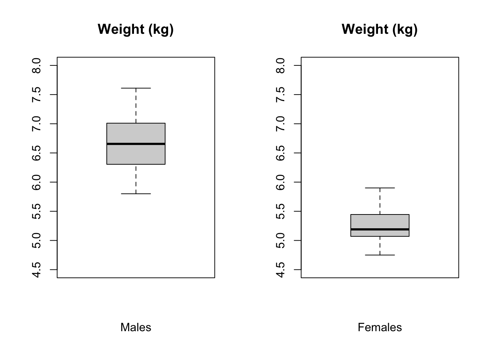

Module 10
================
by Anthony Di Fiore and Christopher A. Schmitt

Classical Hypothesis Testing
============================

Objectives
----------

> The objective of this module is to continue our discussion of classical *hypothesis testing* from a frequentist statistics approach.

Null and Alternative Hypotheses
-------------------------------

Classical or frequentist hypothesis testing (a.k.a. parametric statistics) involves formally stating a claim - the **null hypothesis** - which is then followed up by statistical evaluation of the null versus an alternative hypotheses. The null hypothesis is interpreted as a baseline hypothesis and is the claim that is assumed to be true. The **alternative hypothesis** is the conjecture that we are testing.

We need some kind of statistical evidence to reject the null hypothesis in favor of an alternative hypothesis. This evidence is, in classicical frequentist approaches, some measure of how unexpected it would be for the sample to have been drawn from a given null distribution.

-   ***H*<sub>0</sub> = null hypothesis** = a sample statistic shows no deviation from what is expected or neutral

-   ***H*<sub>*A*</sub> = alternative hypothesis** = a sample statistic deviates more than expected by chance from what is expected or neutral

We can test several different comparisons between *H*<sub>0</sub> and *H*<sub>*A*</sub>.

*H*<sub>*A*</sub> &gt; *H*<sub>0</sub>, which constitutes an "upper one-tailed test (i.e., our sample statistic is greater than that expected under the null)

*H*<sub>*A*</sub> &lt; *H*<sub>0</sub>, which constitutes an "lower one-tailed test (i.e., our sample statistic is less than that expected under the null)

*H*<sub>*A*</sub> ≠ *H*<sub>0</sub>, which constitutes an "two-tailed test (i.e., our sample statistic is different, maybe greater maybe less, than that expected under the null)

There are then four possible outcomes to our statistical decision:

| What is True      | What We Decide    | Result                                    |
|-------------------|-------------------|-------------------------------------------|
| *H*<sub>0</sub>   | *H*<sub>0</sub>   | Correctly 'accept' the null               |
| *H*<sub>0</sub>   | *H*<sub>*A*</sub> | Falsely reject the null (Type I error)    |
| *H*<sub>*A*</sub> | *H*<sub>0</sub>   | Falsely 'accept' the null (Type II error) |
| *H*<sub>*A*</sub> | *H*<sub>*A*</sub> | Correctly reject the null                 |

In classical frequentist (a.k.a. parametric) inference, we perform hypothesis testing by trying to minimize our probability of Type I error... we aim for having a high bar for falsely rejecting the null (e.g., for incorrectly finding an innocent person guilty). When we set a high bar for falsely rejecting the null, we lower the bar for falsely 'accepting' (failing to reject) the null (e.g., for concluding that a guilty person is innocent).


To do any statistical test, we typically calculate a **test statistic** based on our data, which we compare to some appropriate standardized sampling distribution to yield a **p value**.

The **p value** = the probability of our obtaining a test statistic that is as high or higher than our calculated one by chance, assuming the null hypothesis is true.

The test statistic basically summarizes the "location" of our data relative to an expected distribution based on our null model. The particular value of our test statistic is determined by both the **difference between the original sample statistic and the expected null value** (e.g., the difference between the mean of our sample and the expected population mean) and the **standard error of the sample statistic**. The value of the test statistic (i.e., the distance of the test statistic from zero) and the shape of the null distribution are the sole drivers of the smallness of the p value. The p value effectively represents the area under the sampling distribution associated with test statistic values **as or more extreme** than the one we observed.

We compare the p value associated with our test statistic to some significance level, *α*, typically 0.05 or 0.01, to determine whether we reject or fail to reject the null. If p &lt; *α*, we decide that there is sufficient statistical evidence for rejecting *H*<sub>0</sub>.

How do we calculate the p value?

1.  Specify a test statistic (e.g., the mean)

2.  Specify our null distribution

3.  Calculate the tail probability, i.e., the probability of obtaining a statistic (e.g., a mean) as or more extreme than was observed assuming that null distribution

Testing Sample Means: One Sample Z and T Tests
----------------------------------------------

Let's do an example where we try to evaluate whether the mean of a single set of observations is significantly different than expected under a null hypothesis... i.e., this is a ONE-SAMPLE test.

<center>
<p>

</p>
</center>
Suppose we have a vector describing the adult weights of vervet monkeys trapped in South Africa during the 2016 trapping season. We have the sense they are heavier than vervets we trapped in previous years, which averaged 4.9 kilograms. The mean is 5.324 kilograms. Is the mean significantly greater than our expectation?

``` r
library(curl)
f <- curl("https://raw.githubusercontent.com/fuzzyatelin/fuzzyatelin.github.io/master/AN597_Fall17/vervet-weights.csv")
d <- read.csv(f, header = TRUE, sep = ",", stringsAsFactors = FALSE)
head(d)
```

    ##   id weight
    ## 1  1   5.17
    ## 2  2   7.13
    ## 3  3   4.70
    ## 4  4   6.10
    ## 5  5   6.36
    ## 6  6   4.93

``` r
mean(d$weight)
```

    ## [1] 5.323922

-   What is our *H*<sub>0</sub>?
-   What is our *H*<sub>*A*</sub>?
-   What is the hypothesis we want to test? Is it two-tailed? Upper-tailed? Lower-tailed?
-   Calculate the mean, standard deviation, and SEM from our sample

``` r
mu <- 4.9
x <- d$weight
m <- mean(x)
s <- sd(x)
n <- length(x)
sem <- s/sqrt(n)
```

Our test statistic takes a familiar form... it is effectively the standard normalized position of our sample mean in a distribution centered around the expected population mean.


with


where:

-    = mean of sample observations
-   *μ* = expected mean
-   *s* = sample standard deviation
-   *n* = number of sample observations

Or, to use our variables from above...

``` r
z <- (m - mu)/sem
z
```

    ## [1] 3.103753

In this case, ***z*** is a quantile... the estimated number of standard errors of the mean away from the population mean that our sample falls.

If we then want to see if ***z*** is significant, we need to calculate the probability of seeing a deviation from the mean as high or higher than this by chance. To do this, we can use the `pnorm()` function. Because we have converted our sample mean to the standard normal scale, the `mean=` and `sd=` arguments of `pnorm()` are the defaults of 0 and 1, respectively.

We want the probability of seeing a ***z*** this large or larger by chance.

``` r
p <- 1 - pnorm(z)
p
```

    ## [1] 0.0009554144

``` r
p <- pnorm(z, lower.tail = FALSE)
p
```

    ## [1] 0.0009554144

However, as noted above, our sample size from a population is typically limited. So, instead of using the normal distribution to determine the p value of our statistic, we should use the t distribution, which, as we've seen, has slightly fatter tails. The statistic and process is exactly the same, though, as for the normal distribution.


or, equivalently...


``` r
p <- 1 - pt(z, df = n - 1)
p
```

    ## [1] 0.001570945

``` r
p <- pt(z, df = n - 1, lower.tail = FALSE)
p
```

    ## [1] 0.001570945

***R*** has built into it a single function, `t.test()`, that lets us do all this in one line. We give it our data and the expected population mean, *μ*, along with the kind of test we want to do.

``` r
t <- t.test(x = x, mu = mu, alternative = "greater")
t
```

    ## 
    ##  One Sample t-test
    ## 
    ## data:  x
    ## t = 3.1038, df = 50, p-value = 0.001571
    ## alternative hypothesis: true mean is greater than 4.9
    ## 95 percent confidence interval:
    ##  5.095021      Inf
    ## sample estimates:
    ## mean of x 
    ##  5.323922

Note that we can also use the `t.test()` function to calculate t distribution based CIs for us easily!

``` r
lower <- m - qt(1 - 0.05/2, df = n - 1) * sem
upper <- m + qt(1 - 0.05/2, df = n - 1) * sem
ci <- c(lower, upper)
ci  # by hand
```

    ## [1] 5.049585 5.598258

``` r
t <- t.test(x = x, mu = mu, alternative = "two.sided")
ci <- t$conf.int
ci  # using t test
```

    ## [1] 5.049585 5.598258
    ## attr(,"conf.level")
    ## [1] 0.95

#### CHALLENGE:

<center>
<p>

</p>
</center>
Adult lowland woolly monkeys are reported to have an average body weight of 7.2 kilograms. You are working with an isolated population of woolly monkeys from the Colombian Andes that you think may be a different species from the lowland form, and you collect a sample of 15 weights of from adult individuals at that site. From your sample, you calculate a mean of 6.43 kilograms and a standard deviation of 0.98 kilograms. Perform a hypothesis test to test whether body weights in your population are different from the reported average for lowland woolly monkeys by setting up a "two-tailed" hypothesis, carrying out the analysis, and interpreting the p value (assume the significance level is *α*=0.05). Your sample is &lt; 30, so you should use the t distribution and do a t test. Do your calculations both by hand and using the `t.test()` function and confirm that they match.

``` r
f <- curl("https://raw.githubusercontent.com/fuzzyatelin/fuzzyatelin.github.io/master/AN597_Fall17/woolly-weights.csv")
d <- read.csv(f, header = TRUE, sep = ",", stringsAsFactors = FALSE)
head(d)
```

    ##   id weight
    ## 1  1   6.14
    ## 2  2   6.19
    ## 3  3   7.08
    ## 4  4   5.67
    ## 5  5   4.83
    ## 6  6   6.83

``` r
x <- d$weight
m <- mean(x)
s <- sd(x)
n <- length(x)
sem <- s/sqrt(n)
mu <- 7.2
t <- (m - mu)/sem
t
```

    ## [1] -3.336805

``` r
alpha <- 0.05
crit <- qt(1 - alpha/2, df = n - 1)  # identify critical values
test <- t < -crit || t > crit  # boolean test as two whether t is larger than the critical value at either tail
test <- abs(t) > crit
t.test(x = x, mu = mu, alternative = "two.sided")
```

    ## 
    ##  One Sample t-test
    ## 
    ## data:  x
    ## t = -3.3368, df = 14, p-value = 0.004891
    ## alternative hypothesis: true mean is not equal to 7.2
    ## 95 percent confidence interval:
    ##  5.930689 6.923978
    ## sample estimates:
    ## mean of x 
    ##  6.427333

Comparing Sample Means: Two Sample Z and T Tests
------------------------------------------------

Sometimes we want to compare two groups of measurements to one another, which boils down to a hypothesis test for the difference between two means, *μ*1 and *μ*2. The null hypothesis is that the difference between the means is zero.

Before getting to the appropriate test, there are a couple of things that we need to consider:

\[1\] How, if at all, are the two samples related to one another? Sometimes we may have PAIRED samples (e.g., the same individuals before and after some treatment) and sometimes the samples are UNPAIRED or INDEPENDENT (e.g., weights for different samples of black-and-white colobus monkeys collected in the rainy versus dry seasons).

\[2\] Are the variances in the two samples roughly equal or not? E.g., if we are comparing male and female heights, are the variances comparable?

### Samples with Unequal Variances

For the most generic case, where the two samples are independent and we cannot assume the variances of the two samples are equal, we can do what is called **Welch's t test** where our test statistic is:


where:

-    and  = means of observations in each sample group
-   *μ* = expected difference in means between sample groups under the null hypothesis, which is usually zero
-   *s*<sub>1</sub> and *s*<sub>2</sub> = standard deviations of each sample group
-   *n*<sub>1</sub> and *n*<sub>2</sub> = numbers of observations in each sample group

#### CHALLENGE:

<center>
<p>

</p>
</center>
Let's do an example. Load in a file of black-and-white colobus weights and examine the `str()` of the file. Then, create 2 vectors, x and y, for male and female weights. Plot these in boxplots side by side and then calculate the mean, sd, and sample size for both males and females.

``` r
f <- curl("https://raw.githubusercontent.com/fuzzyatelin/fuzzyatelin.github.io/master/AN597_Fall17/colobus-weights.csv")
d <- read.csv(f, header = TRUE, sep = ",", stringsAsFactors = FALSE)
head(d)
```

    ##   id weight  sex
    ## 1  1   7.24 male
    ## 2  2   6.09 male
    ## 3  3   6.97 male
    ## 4  4   6.98 male
    ## 5  5   6.08 male
    ## 6  6   6.22 male

``` r
x <- d$weight[d$sex == "male"]
y <- d$weight[d$sex == "female"]
par(mfrow = c(1, 2))
boxplot(x, ylim = c(4.5, 8), main = "Weight (kg)", xlab = "Males")
boxplot(y, ylim = c(4.5, 8), main = "Weight (kg)", xlab = "Females")
```



``` r
m1 <- mean(x)
m2 <- mean(y)
mu <- 0  # you could leave this out... the default argument value is 0
s1 <- sd(x)
s2 <- sd(y)
n1 <- length(x)
n2 <- length(y)
```

Now calculate the t statistic and test the two-tailed hypothesis that the sample means differ.

``` r
t <- (m2 - m1 - mu)/sqrt(s2^2/n2 + s1^2/n1)
t
```

    ## [1] -11.45952

``` r
alpha <- 0.05
crit <- qt(1 - alpha/2, df = n - 1)  # identify critical values
crit
```

    ## [1] 2.144787

``` r
test <- t < -crit || t > crit  # boolean test
test <- abs(t) > crit
test
```

    ## [1] TRUE

Note that for this test, the number of degrees of freedom is calculated as:


``` r
df <- (s2^2/n2 + s1^2/n1)^2/((s2^2/n2)^2/(n2 - 1) + (s1^2/n1)^2/(n1 - 1))
df
```

    ## [1] 31.21733

Do the same using the `t.test()` function.

``` r
t <- t.test(x = x, y = y, mu = 0, alternative = "two.sided")
t
```

    ## 
    ##  Welch Two Sample t-test
    ## 
    ## data:  x and y
    ## t = 11.46, df = 31.217, p-value = 1.023e-12
    ## alternative hypothesis: true difference in means is not equal to 0
    ## 95 percent confidence interval:
    ##  1.191186 1.706814
    ## sample estimates:
    ## mean of x mean of y 
    ##     6.689     5.240

### Samples with Equal Variances

There's a simpler t statistic we can use if the variances of the two samples are more or less equal.


where:


-    and  = means of observations in each sample group
-   *μ* = expected difference in means between sample groups (usually set to zero)
-   *s*<sub>*p*</sub> = pooled sample standard deviation
-   *n*<sub>1</sub> and *n*<sub>2</sub> = numbers of observations in each sample group

The degrees of freedom for this test is calculated as follows:


``` r
s <- sqrt((((n1 - 1) * s1^2) + ((n2 - 1) * s2^2))/(n1 + n2 - 2))
t <- (m2 - m1 - mu)/(sqrt(s^2 * (1/n1 + 1/n2)))
t
```

    ## [1] -11.45952

``` r
df <- n1 + n2 - 2
df
```

    ## [1] 38

``` r
t <- t.test(x = x, y = y, mu = 0, var.equal = TRUE, alternative = "two.sided")
t
```

    ## 
    ##  Two Sample t-test
    ## 
    ## data:  x and y
    ## t = 11.46, df = 38, p-value = 6.787e-14
    ## alternative hypothesis: true difference in means is not equal to 0
    ## 95 percent confidence interval:
    ##  1.193025 1.704975
    ## sample estimates:
    ## mean of x mean of y 
    ##     6.689     5.240

A crude test for equality of variances is to divide the larger by the smaller and if the result is &lt; 2, you can go ahead and used the pooled variance version of the test (which has many fewer degrees of freedom).

In our case, we cannot, since the ratio of variances exceeds 2...

``` r
var(x)/var(y)
```

    ## [1] 2.746196

We can use the `var.test()` function to conduct an actual statistical test on the ratio of variances, which compares the ratio test statistic we just calculated to an **F distribution**. The F distribution is often used to model *ratios* of random variables and thus is useful in regression applications and, as here, for testing whether variances from two samples are different. It is dependent upon the specification of a pair of degrees of freedom values supplied as the arguments `df1=` and `df2=` (or inferred from the number of observations in each sample).

Below, the results of `var.test()` are saved to a variable. Calling the variable provides a brief descriptive summary.

``` r
vt <- var.test(x, y)
vt
```

    ## 
    ##  F test to compare two variances
    ## 
    ## data:  x and y
    ## F = 2.7462, num df = 19, denom df = 19, p-value = 0.03319
    ## alternative hypothesis: true ratio of variances is not equal to 1
    ## 95 percent confidence interval:
    ##  1.086978 6.938128
    ## sample estimates:
    ## ratio of variances 
    ##           2.746196

### Paired Samples

For a paired sample test, the null hypothesis is that the mean of individual paired differences between the two samples (e.g., before and after) is zero.

Our test statistic is:


where:

-    = mean of difference between paired samples
-   *μ* = expected mean difference between paired samples (usually set to zero)
-   *s*<sub>*d*</sub> = standard deviation in the set of differences between paired samples
-   *n* = number of sample pairs

Again, note that *μ* here is the expected difference between the means under the null hypothesis, which is zero, and we are dividing by the standard error of the mean for the set of differences between pairs.

#### CHALLENGE:

Let's play with a sample... IQs of individuals taking a certain statistics course pre and post a lecture on significance testing. Load in the `iqs.csv` data file, look at it, plot a barchart of values before and after and construct a paired t test to evaluate the means before and after.

``` r
f <- curl("https://raw.githubusercontent.com/fuzzyatelin/fuzzyatelin.github.io/master/AN597_Fall17/iqs.csv")
d <- read.csv(f, header = TRUE, sep = ",", stringsAsFactors = FALSE)
head(d)
```

    ##   id IQ.before IQ.after
    ## 1  1    124.54   133.50
    ## 2  2    125.98   131.93
    ## 3  3    126.93   129.15
    ## 4  4    114.93   129.38
    ## 5  5    122.41   132.77
    ## 6  6    123.64   126.80

``` r
x <- d$IQ.before - d$IQ.after
m <- mean(x)
mu <- 0  # can leave this out
s <- sd(x)
n <- length(x)
sem <- s/sqrt(n)
par(mfrow = c(1, 2))
boxplot(d$IQ.before, ylim = c(115, 145), main = "IQ", xlab = "Before")
boxplot(d$IQ.after, ylim = c(115, 145), main = "IQ", xlab = "After")
```


``` r
t <- (m - mu)/sem
t
```

    ## [1] -1.789636

``` r
alpha <- 0.05
crit <- qt(1 - alpha/2, df = n - 1)  # identify critical values
crit
```

    ## [1] 2.093024

``` r
test <- t < -crit || t > crit  # boolean test
test
```

    ## [1] FALSE

``` r
t.test(x, df = n - 1, alternative = "two.sided")
```

    ## 
    ##  One Sample t-test
    ## 
    ## data:  x
    ## t = -1.7896, df = 19, p-value = 0.08946
    ## alternative hypothesis: true mean is not equal to 0
    ## 95 percent confidence interval:
    ##  -6.762409  0.528409
    ## sample estimates:
    ## mean of x 
    ##    -3.117

Testing Sample Proportions: One Sample Z Test
---------------------------------------------

As we have seen, the sampling distribution of sample means for independent and identically distributed random variables is roughly normal (and, as shown by the CLT, this distribution increasingly approaches normal as sample size increases). Similarly, the sampling distribution for another kind of sample statistic, the number of "successes" *x* out of a series of *k* trials is also roughly normally distributed. If the true population proportion of "successes" is *π*, then the sampling distribution for the proportion of successes in a sample of size *n* is expected to be roughly normally distributed with mean = *π* and standard error = sqrt(*π*(1 − *π*)/*n*).

Let's set up a simulation to show this...

First we create a population of 500 "1"s and 500 "0"s, i.e., where *π* = 0.5...

``` r
pop <- c(rep(0, 500), rep(1, 500))
```

Now, we will take 1000 random samples of size n=10 from that population and calculate the proportion of "1"s in each sample...

``` r
pi <- 0.5
x <- NULL
n <- 10
for (i in 1:1000) {
    x[i] <- mean(sample(pop, size = n, replace = FALSE))  # taking the mean of a bunch of 0s and 1s yields the proportion of 1s!
}
m <- mean(x)
m
```

    ## [1] 0.4944

``` r
s <- sd(x)
s
```

    ## [1] 0.1585995

``` r
pop_se <- sqrt(pi * (1 - pi)/n)
pop_se  # the se is an estimate of the sd of the sampling distribution
```

    ## [1] 0.1581139

The same is true if we create a population of 800 "1"s and 200 "0"s, i.e., where *π* = 0.8...

``` r
pop <- c(rep(0, 800), rep(1, 200))
pi <- 0.8
x <- NULL
n <- 10
for (i in 1:1000) {
    x[i] <- mean(sample(pop, size = n, replace = FALSE))  # taking the mean of a bunch of 0s and 1s yields the proportion of 1s!
}
m <- mean(x)
m
```

    ## [1] 0.1981

``` r
s <- sd(x)
s
```

    ## [1] 0.1236191

``` r
pop_se <- sqrt(pi * (1 - pi)/n)
pop_se  # the se is an estimate of the sd of the sampling distribution
```

    ## [1] 0.1264911

This normal approximation is true as long as *n* is fairly large and *π* is not close to 0 or 1. One rule of thumb is to check that both n×*π* and *n* × (1 − *π*) are greater than 5.

With all this in mind, we can construct Z statistics for proportions like we constructed Z and T statistics for means and test those proportions for differences from an expected value or for differences between two sample proportions. The Z statistic for proportions takes the same general form as that for means...

*z* = (*observed statistic* - *expected statistic*) / *standard error*

or,


-    = proportion in sample
-   *π* = expected proportion
-   *n* = number of observations in sample

#### CHALLENGE:

<center>
<p>

</p>
</center>
A neotropical ornithologist working in the western Amazon deploys 30 mist nets in a 100 ha grid. She monitors the nets on one morning and records whether or not a she captures any birds in the net (i.e., a "success" or "failure" for every net during a netting session). The following vector summarizes her netting results:

``` r
v <- c(0, 1, 1, 1, 0, 1, 0, 0, 1, 1, 0, 0, 1, 1, 0, 1, 1, 0, 0, 1, 1, 1, 0, 
    1, 1, 0, 1, 0, 1, 1)
```

Her netting success over the previous three seasons suggests that she should catch birds in 80% of her nets. This season, she feels, her success rate is lower than in previous years. Does her trapping data support this hypothesis?

-   What is *H*<sub>0</sub>?
-   What is *H*<sub>*A*</sub>?
-   Are both n×*π* and *n* × (1 − *π*) &gt; 5?
-   Calculate z and the p value associated with z
-   Calculate the 95% CI around 

``` r
phat <- mean(v)
phat
```

    ## [1] 0.6

``` r
pi <- 0.8
n <- 30
z <- (phat - pi)/sqrt(pi * (1 - pi)/30)
z
```

    ## [1] -2.738613

``` r
p <- pnorm(z, lower.tail = TRUE)
p
```

    ## [1] 0.00308495

We use the `lower.tail=TRUE` argument because we're testing a lower-tailed one-tailed hypothesis. The 95% confidence interval can be estimated, based on the normal distribution, as follows:

``` r
lower <- phat - qnorm(0.975) * sqrt(phat * (1 - phat)/30)
upper <- phat + qnorm(0.975) * sqrt(phat * (1 - phat)/30)
ci <- c(lower, upper)
ci
```

    ## [1] 0.4246955 0.7753045

This approach using quantiles of the standard normal distribution is but one method of calculating CIs for proportion data, and is the CI referred to as a *Wald confidence interval*. Note that the CI does not include the value of *π*... rather, *π* &gt; is greater than the upper bound of the CI, suggesting that the observed success rate is indeed lower than in previous years.

We can do the same test with a one-liner in ***R***...

``` r
pt <- prop.test(x = sum(v), n = length(v), p = 0.8, conf.level = 0.95, correct = FALSE, 
    alternative = "less")
pt
```

    ## 
    ##  1-sample proportions test without continuity correction
    ## 
    ## data:  sum(v) out of length(v), null probability 0.8
    ## X-squared = 7.5, df = 1, p-value = 0.003085
    ## alternative hypothesis: true p is less than 0.8
    ## 95 percent confidence interval:
    ##  0.0000000 0.7328738
    ## sample estimates:
    ##   p 
    ## 0.6

Note that the CI is different than we calculated based on the normal distribution... `prop.test()` implements a slightly different procedure for estimating the CI rather than basing this on the normal distribution and the CLT.

Comparing Sample Proportions: Two Sample Z Tests
------------------------------------------------

The Z statistic for the two sample test comparing proportions is also very similar to that for comparing means.


where:


-    and  = proportions of "successes" in each sample group
-   *π* = expected difference in proportions between sample groups (usually set to zero)
-   *p*<sup>\*</sup> = pooled proportion
-   *n*<sub>1</sub> and *n*<sub>2</sub> = numbers of observations in each sample group

#### CHALLENGE:

<center>
<p>

</p>
</center>
A biologist studying two species of tropical bats captures females of both species in a mist net over the course of week of nightly netting. For each species, the researcher records whether females are lactating or not. The two vectors below summarize the data for each species.

``` r
v1 <- c(1, 0, 1, 1, 0, 0, 1, 1, 0, 0, 1, 1, 1, 1, 0, 0, 1, 1, 0, 0, 1, 1, 0, 
    1, 0)
v2 <- c(1, 1, 0, 0, 1, 1, 1, 1, 0, 1, 0, 1, 1, 1, 0, 1, 0, 1, 1, 1, 1, 1, 0, 
    0, 1, 1, 0, 1, 1, 1)
```

Based on your mist netting data, do the species differ significantly in the proportion of lactating females? What are *H*<sub>0</sub> and *H*<sub>*A*</sub>?

``` r
pstar <- (sum(v1) + sum(v2))/(length(v1) + length(v2))
pstar
```

    ## [1] 0.6363636

``` r
phat1 <- mean(v1)
phat1
```

    ## [1] 0.56

``` r
phat2 <- mean(v2)
phat2
```

    ## [1] 0.7

``` r
pi <- 0
z <- (phat2 - phat1)/sqrt((pstar * (1 - pstar)) * (1/length(v1) + 1/length(v2)))
z
```

    ## [1] 1.074709

``` r
p <- 1 - pnorm(z, lower.tail = TRUE) + pnorm(z, lower.tail = FALSE)
p
```

    ## [1] 0.2825049

``` r
crit <- qnorm(1 - alpha/2)  # identify critical values
crit
```

    ## [1] 1.959964

``` r
test <- p < -crit || p > crit  # boolean test
test
```

    ## [1] FALSE

We can use the `prop.test()` function to do this in one line.

``` r
pt <- prop.test(x = c(sum(v2), sum(v1)), n = c(length(v2), length(v1)), alternative = "two.sided", 
    correct = FALSE)
pt
```

    ## 
    ##  2-sample test for equality of proportions without continuity
    ##  correction
    ## 
    ## data:  c(sum(v2), sum(v1)) out of c(length(v2), length(v1))
    ## X-squared = 1.155, df = 1, p-value = 0.2825
    ## alternative hypothesis: two.sided
    ## 95 percent confidence interval:
    ##  -0.1144634  0.3944634
    ## sample estimates:
    ## prop 1 prop 2 
    ##   0.70   0.56

Summary of Z and T Tests
------------------------

Z and T tests are used to evaluate whether a given sample statistic (e.g., a mean or proportion) deviates significantly from what is expected under a null model or whether two samples statistics deviate significantly from one another.

They are used for dealing with normally distributed, continuous variables or those that can be approximated closely by the normal distribution.

-   We REJECT a *H*<sub>0</sub> if the p value obtained for a given Z or T test statistic is &lt; *α*
-   CIs for our sample statistic are calculated as **mean ± *T*<sub>(1 − *α*/2)</sub> or *Z*<sub>(1 − *α*/2)</sub> x SEM**, and we can REJECT a *H*<sub>0</sub> if the (1-*α*) CI around does not include the expected value of the statistic
-   When the sample size &gt; 30, or when we are dealing with proportions, we use Z quantiles for calculating CIs and p values, but for sample size &lt; 30, we use T quantiles

### T Statistics for Testing a Single Mean


### T Statistics for Comparing Means

#### Unequal Variance


#### Equal Variance


#### Paired Samples


### Z Statistic for Testing a Single Proportion


### Z Statistic for Comparing Proportions


