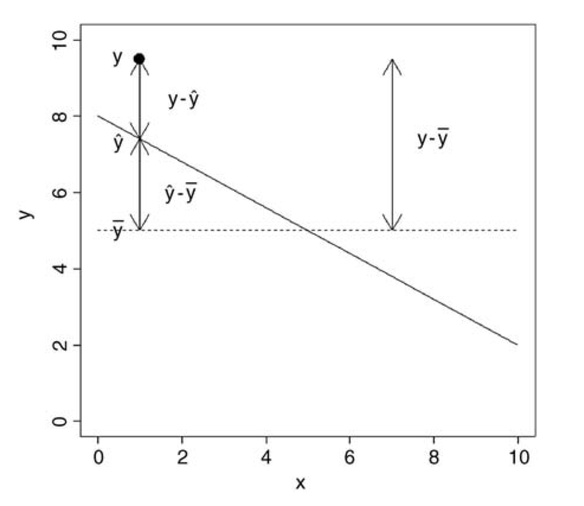
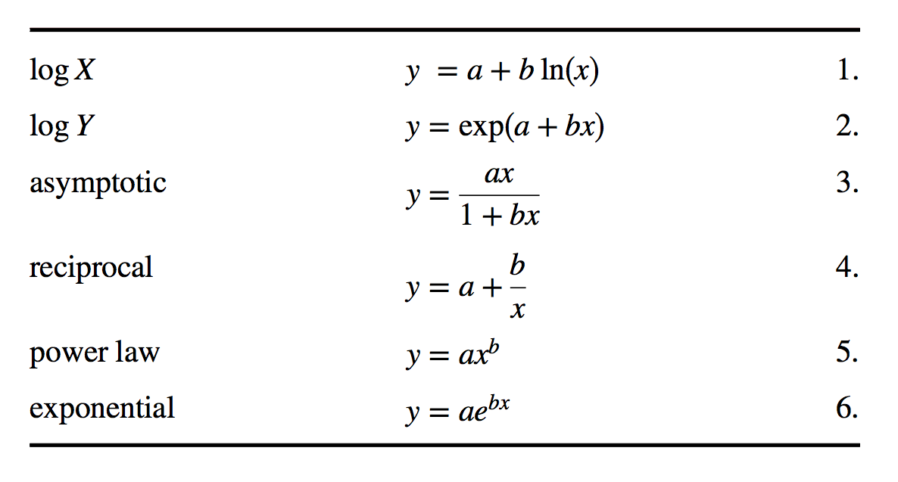

***

```{r setup, include=FALSE}
knitr::opts_chunk$set(
	echo=TRUE,
	warning=FALSE,
	comment="##",
	prompt=FALSE,
	tidy=TRUE,
	tidy.opts=list(width.cutoff=75),
	fig.path="img/"
)
```
# Elements of Regression Analysis

***

## Preliminaries
- Install these packages in ***R***: {curl}, [{car}](https://cran.r-project.org/web/packages/car/car.pdf)

## Objectives
> The objective of this module is to continue our discussion of simple linear regression analysis to understand how the object of regression is to partition variance in the response variable among different sources, i.e., into that explanined **by the regression model** itself (and, we'll see later on in our discussion of multivariate regression, among different factors in that model) versus the left-over **error or residual variance**. We also go through how to calculate the **standard errors** for our various regression coefficients and for the predicted values of our response variable based on our regression model, which, as we have seen are returned by the `lm()` function. Finally, we also briefly discuss ways to transform non-normally distributed data to make them more appropriate for analysis using linear regression.

## Analysis of Variance and ANOVA Tables

In our linear models, we can separate or "partition" the total variation in our **y** variable (the *sum of squares of y*, or SSY) into that explained by our model (the *regression sum of squares*, or SSR) and that which is left over as "error" (the *error sum of squares*, or SSE): $SSY$ = $SSR$ + $SSE$.

Graphically...



Let's make sure we have our zombie survivor data loaded...

```{r}
library(curl)
f <- curl("https://raw.githubusercontent.com/fuzzyatelin/fuzzyatelin.github.io/master/AN597_Fall19/zombies.csv")
d <- read.csv(f, header = TRUE, sep = ",", stringsAsFactors = FALSE)
```

Now, we'll run a straightforward bivariate regression model (as in [Module 12](https://fuzzyatelin.github.io/bioanth-stats/module-12/module-12.html)) and, using the raw data (which are duplicated in the `$model` data structure within our model object), we will calculate the various sums of squares of our variables and identify the numbers of degrees of freedom associated with each source of variation. This allows us to generate the ANOVA table for our model, which is a summary of how variance is partitioned among different sources.

```{r}
m <- lm(data=d,height~weight)
SSY <- sum((m$model$height-mean(m$model$height))^2) # height - mean(height)
SSY
SSR <- sum((m$fitted.values-mean(m$model$height))^2) # predicted height - mean height
SSR
SSE <- sum((m$model$height-m$fitted.values)^2) # height - predicted height
SSE
```
From here, we can calculate the variance in each of these components, typically referred to as the *mean square*, by dividing each sum of squares by its corresponding degrees of freedom (recall that a variance can be thought of as an average "sum of squares").

The degrees of freedom for the regression sum of squares (SSR) is equal to the number of predictor variables, which in this case is one (given our regression equation, we need to know only one piece of information, the value of our predictor variable, in order to calculate the predicted value of the response variable). The number of degrees of freedom for the error sum of squares (SSE) is equal to $n-2$. This is because we need to estimate two parameters ($\beta_0$ and $\beta_1$) from our data before we can calculate the error sum of squares. Finally, the number of degrees of freedom for the total sum of squares (SSY) is $n-1$... we need to estimate one parameter from our data (the mean value of **y**) before we can calculate SSY.

```{r}
df_regression <- 1
df_error <- 998
df_y <- 999
MSR <- SSR/df_regression
MSE <- SSE/df_error
MSY <- SSY/df_y
```

The last item we need to calculate is the **F ratio**, the ratio of the variance explained by the regression model to the remaining, unexplained variance: MSR/MSE.

```{r}
fratio <- MSR/MSE
fratio
```

Together, the values we have calculated above form the main entries in the  **ANOVA Table** for our regression.

| Source          | Sum of Squares  | Degrees of Freedom | Mean Squares (SS/df)     | F Ratio  |
|:----------------:|:--------------:|:------------------:|:------------------------:|:--------:|
| Regression      | SSR = 12864.82  | 1                  | MSR = 12864.82           | 2254.139 |
| Error           | SSE = 5693.79   | $n-2$ = 998        | MSE = 5.7072             |          |
| Total       | SSY = 18558.61       | $n-1$ = 999        | MSY = 18.57719          |          |

We can test the overall significance of our regression model by evaluating our F ratio test statistic against the F distribution, taking into account the number of degrees of freedom in each. The F distribution is a continuous probability distribution, defined for $x≥0$ and governed by two parameters, df1 and df2. The critical value above which we would reject the idea that the variance in our two sources is comparable is given by `qf(p,df1,df2)`, where **p** is 1-$\alpha$ and **df1** and **df2** are the degrees of freedom in the sources being compared (regression versus error).

```{r,fig.height=5,fig.width=5}
curve(df(x,df=1,df2=1), col="green", lty=3, lwd=2, xlim=c(0,10), main="Some Example F Distributions\n(vertical line shows critical value for df1=1,df2=998)", ylab="f(x)", xlab="x")
curve(df(x,df=2,df2=2), col="blue", lty=3, lwd=2, add=TRUE)
curve(df(x,df=4,df2=4), col="red", lty=3, lwd=2, add=TRUE)
curve(df(x,df=8,df2=6), col="purple", lty=3, lwd=2, add=TRUE)
curve(df(x,df=1,df2=998), col="black", lwd=3, add=TRUE)
legend("top", c("df1=1,df2=1","df1=2,df2=2","df1=4,df2=4","df1=8,df2=6","df1=1,df2=998"), lty=3, lwd=2, col=c("green", "blue", "red","purple","black"), bty='n', cex=.75)

fcrit <- qf(p=0.95,df1=1,df2=998)
fcrit
abline(v=fcrit)
abline(h=0)
polygon(cbind(c(fcrit,seq(from=fcrit, to=10, length.out=1000), 8), c(0,df(seq(from=fcrit, to=8, length.out=1000),df1=1,df2=998),0)), border="black",col="grey")
```

For our data, then, the value for the F ratio well exceeds this critical value.

Alternatively, we can use the following formulation to directly estimate a p value associated with our value for the F ratio:

```{r}
1-pf(q=fratio,df1=1,df2=998)
```
... and we see that the p value associated with this high of an F ratio is infintessimally small.

As usual, ***R*** can handle all of the calculations above easily with a built-in function. The `aov()` function, like the `lm()` function, returns a model object that we can use `summary()` on to look at the results we want. Alternatively, we can run the function `summary.aov()` using the model object resulting from `lm()` as an argument. In either case, the results returned are the same as we calculated by hand above.

```{r}
a <- aov(data=d,height~weight)
summary(a)
summary.aov(m)
```

Recall that the results returned by `summary()` of our regression model also shows the coefficient of determination, or the "R-squared value", which we defined above as the fraction of the total variation explained by the model. We can calculate this value directly from our ANOVA table as simply SSR/SSY. The correlation coefficient, $\rho$, between our response and predictor variable is simply the square root of this value.

```{r}
rsquared <- SSR/SSY
rsquared
rho <- sqrt(rsquared)
rho
```

## Standard Errors of Regression Coefficients

Recall that `lm()` returned the standard errors associated with each of the various components of our regression model, i.e., the slope and intercept and each predicted value of **y**. We can calculate standard errors directly to show how ***R*** is deriving them.

The formula for the standard error of the regression slope, $\beta_1$, is calculated as:


Using our data...

```{r}
SSX <- sum((m$model$weight-mean(m$model$weight))^2)
SEbeta1 <- sqrt(MSE/SSX)
SEbeta1
```

The standard error of the intercept, $\beta_0$, is calculated as:


```{r}
SEbeta0 <- sqrt((MSE*sum(m$model$weight^2))/(1000*SSX))
SEbeta0
```

Finally, the standard error of each predicted value of y is calculated as:


```{r}
SEyhat <- sqrt(MSE*(1/1000+(m$model$weight-mean(m$model$weight))^2/SSX))
head(SEyhat) # just the first 6 rows
```

Again, these same standard errors for $\beta_0$ and $\beta_1$ are exactly what are returned by the `lm()` function.

```{r}
summary(m)
```

## Model Checking

So far, we've derived a bunch of summary statistics describing our model and we've looked at ways of testing whether those summary statistics are significantly different from zero. That is...

- We've seen whether our overall regression model explains a significant portion of the variance in **y** by means of the F ratio test
- We've calculated standard errors for our $\beta_1$ and $\beta_0$ estimates and seen whether they are significantly different from zero by means of t tests
- We've calculated standard errors for our prediction of **y** () at each value of **x**
- We've estimated the proportion of the total variance in **y** explained by our model (i.e., "R squared")

What we haven't done yet, however, is checked our model fit critically in other ways... particularly, we haven't seen whether two assumptions of linear modeling are met: that our residuals (or errors) are normally distributed and that there is constancy of variance in our **y** values across the range of **x**s.

We can investigate our residuals as one way of assessing model fit. 

***

#### **CHALLENGE 1**

***

Calculate the residuals from the regression of zombie height on weight and plot these in relation to weight (the **x** variable). There are lots of ways to do this quickly.

```{r,fig.height=5,fig.width=5}
m <- lm(data=d,height~weight)
plot(x=d$weight,y=m$residuals)
# or
e <- resid(m)
plot(x=d$weight,y=e)
```

Now, plot a histogram of your residuals... ideally they are normally distributed!

```{r,fig.height=5,fig.width=5}
hist(e, xlim=c(-4*sd(e),4*sd(e)),breaks=20, main="Histogram of Residuals")
```

An additional way to quickly examine your residuals is to use the `plot()` function with your model as an argument. This prints out 4 plots that each tell you something.

```{r,fig.height=5,fig.width=5}
plot(m$model$weight,m$residuals)
par(mfrow=c(2,2))
plot(m)
```

The first plot of fitted values () versus residuals should, like the plot of **x** versus residuals, not show any structure. We hope to see equally spread residuals around a horizontal line without distinct patterns. The second plot is a Q-Q plot of theoretical quantiles versus standardized quantiles for the residual values. These should fall on roughly a straight line, if the residuals are normally distributed. The third plot graphs the square root of the standardized residuals versus **x** and shows whether or not residuals are spread equally along the ranges of **x**s. It is good if you see a horizontal line with equally spread points rather than a decrease or increase in spread with **x**, which would indicate that the error variance increases or decreases with **x**. The fourth plot highlights whether there are particular observations that influence the results. In particular, we look to see if there are cases that fall in the upper or lower right portion of the plot.

We can also do a QQ plot of our residuals:

```{r,fig.height=5,fig.width=5}
qqnorm(m$residuals)
```

Perhaps a more helpful QQ plot can be found in the {car} package. The function `qqPlot()` provides a trend line and confidence intervals that allow us to see exactly which points make the sample fall outside of normality (if any). Let's take a look:

```{r,fig.height=5,fig.width=5}
library(car)
qqPlot(m$residuals)
```

Finally, there are a number of tests for normality that we can run within the ***R*** framework and using other packages. A Shapiro-Wilk Normality Test is perhaps the most widely used, where a low p value would indicate deviation from normality (technically, a measure of how far the trend line of the residuals deviates from the qqplot line).

```{r}
s <- shapiro.test(m$residuals)
s
```

As you can see, although there are some points at the higher quantiles that suggest non-normality, the Shapiro-Wilks test suggests that it's not quite non-normal, so our use of parametric statistics should be ok.

Some other popular tests for normality, and the cases in which they're best used, are listed below:

- Anderson-Darling test
    - Very popular, not quite as powerful as Shapiro-Wilk.
    - Best used when n ≥ 8.
    - {nortest}: `ad.test()` 
- Martinez-Iglewicz test
    - Test for dispersion from the median. 
    - Very powerful for heavy-tailed distributions.
    - Best with small sample sizes (n ≥ 3).
    - {PoweR}: `stat0032.MartinezIglewicz()`
- Kolmogorov-Smirnov (with Lilliefors adjustment) test
    - Not as good as Anderson-Darling, but historically popular.
    - Requires that n ≥ 4.
    - {nortest}: `lillie.test()`
- D-Agostino Omnibus test (based on assessment of skew and kurtosis)
    - Robust against identical values in distribution.
    - Skewness test requires n ≥ 8; Kurtosis test requires n ≥ 20.
    - {fBasics}: `dagoTest()`

For a good discussion/demonstration of the relative power of each of these tests (meaning the probability that the test will correctly reject the null hypothesis) at different sample sizes, [check this out](https://ncss-wpengine.netdna-ssl.com/wp-content/themes/ncss/pdf/Procedures/PASS/Normality_Tests-Simulation.pdf), especially the tables on 670-8 and 670-9, and plots on 670-10. This can help you better understand which test is best for a given sample size, and how much faith to put in these tests given your sample!

***

#### **CHALLENGE 2**

***

Load in the "KamilarAndCooper.csv" dataset and develop a linear model to look at the relationship between "weaning age" and "female body mass". You will probably need to look at the data and variable names again to find the appropriate variables to examine.

- Using the procedures outlined above and in Module 12, calculate estimates of $\beta_0$ and $\beta_1$ by hand ***and** using the `lm()` function. Are the regression coefficients estimated under a simple linear model statistically significantly different from zero?
- Construct an ANOVA table by hand and compare your values to the results of running `lm()` and then looking at `summary.aov(lm())`.
- Generate the residuals for your linear model by hand, plot them in relation to female body weight, and make a histogram of the residuals. Do they appear to be normally distributed?
- Run the `plot()` command on the result of `lm()` and examine the 4 plots produced. Again, based on examination of the residuals and the results of  Shapiro-Wilks test, does it look like your model has good fit?

```{r,fig.height=5,fig.width=5}
f <- curl("https://raw.githubusercontent.com/fuzzyatelin/fuzzyatelin.github.io/master/AN597_Fall19/KamilarAndCooperData.csv")
d <- read.csv(f, header = TRUE, sep = ",", stringsAsFactors = FALSE)
head(d)
plot(data=d,WeaningAge_d~Body_mass_female_mean)
model<-lm(data=d,WeaningAge_d~Body_mass_female_mean)
summary(model)
plot(model)
qqPlot(model$residuals)
s <- shapiro.test(model$residuals)
s
```

## Data Transformations

Recall that for linear regression modeling to be appropriate, two important conditions need to be met: [1] our variables (and the error variance in our variables) should be **normally distributed** and [2] there should be **homogeneity of variance** in our response variable around the range of our predictor variable.

In many cases, these conditions may not be met... for example, the continuous metric data we have may not, in fact, be normally distributed. Which data points are pushing this dataset into non-normality? Can we justify their exclusion to achieve normality if we're interested in understanding life history variation in the realtionship between female body size and age at weaning?  Thankfully, we can often apply some kind of mathematical transformation to our data to change their distribution to more closely approximate the normal without excluding what may initially appear to be outliers. 

The logarithmic or "log" transformation (where we take the log value of each data point) is often applied to positive numeric variables with heavy skew to dramatically reduce the overall range of the data and bring extreme observations closer to a measure of centrality. The logarithm for a number is the power to which you must raise a base value (e.g., $e$, the natural log) in order to obtain that number. This is an example of a "power transformation", other examples of which include the square root transformation and the reciprocal (or multiplicative inverse) transformation.

***

#### **CHALLENGE 3**

***

Return to the "KamilarAndCooper.csv" dataset you were looking at above and log transform both of your variables and then run a simple bivariate linear model. Do you notice a difference between these results and those obtained using untransformed variables?

```{r,fig.height=5,fig.width=5}
d$logWeaningAge <- log(d$WeaningAge_d)
d$logFemaleBodyMass <- log(d$Body_mass_female_mean)
plot(data=d,logWeaningAge~logFemaleBodyMass)
model<-lm(data=d,logWeaningAge~logFemaleBodyMass)
summary(model)
plot(model)
qqPlot(model$residuals)
s <- shapiro.test(model$residuals)
s
```

The following chart and graphs shows some other common numerical transformations that are often useful for changing a variable's distribution to more closely approximate the normal.




```{r}
par(mfrow = c(1,2))

a <- 2
b <- 2

# log x
x <- seq(from=0, to=100, length.out=1000)
y <- a + b * log(x)
plot(x,y, type="l",main="untransformed")
plot(log(x),y, type="l",main="log(x)")

# log y
x <- seq(from=0, to=10, length.out=1000)
y <- exp(a + b *x)
plot(x,y, type="l",main="untransformed")
plot(x,log(y), type="l",main="log(y)")

# assymptotic
x <- seq(from=1,to=100,length.out=100)
y <- (a * x) / (1 + b*x)
plot(x,y, type="l",main="untransformed")
plot(1/x, y, type="l",main="1/x")

# reciprocal
x <- seq(from=1,to=100,length.out=100)
y <- a + b/x
plot(x,y, type="l",main="untransformed")
plot(1/x,y, type="l",main="1/x")

# power
x <- seq(from=1,to=100,length.out=100)
y <- a * x^b
plot(x,y, type="l",main="untransformed")
plot(x^b, y, type="l",main="x^b")

# exp
x <- seq(from=1,to=10,length.out=100)
y <- a * exp(b*x)
plot(x,y, type="l",main="untransformed")
plot(x,log(y), type="l",main="log(y)")
```

Uniformly transforming a dataset is the most common way of attempting to squeeze your data into matching the normal distribution so that you can use parametric statistics.  This is a very common practice, and there is much written on the topic, including its drawbacks. 

For a good discussion on common transformations, see ***R in Action*** Chapter 8.5 (Corrective measures), and please do note **A caution concerning transformations** (p. 200). When trying out transformations, keep your normalization tests handy so that you can retest the transformed data and see if the transformation achieved it’s intended purpose.
