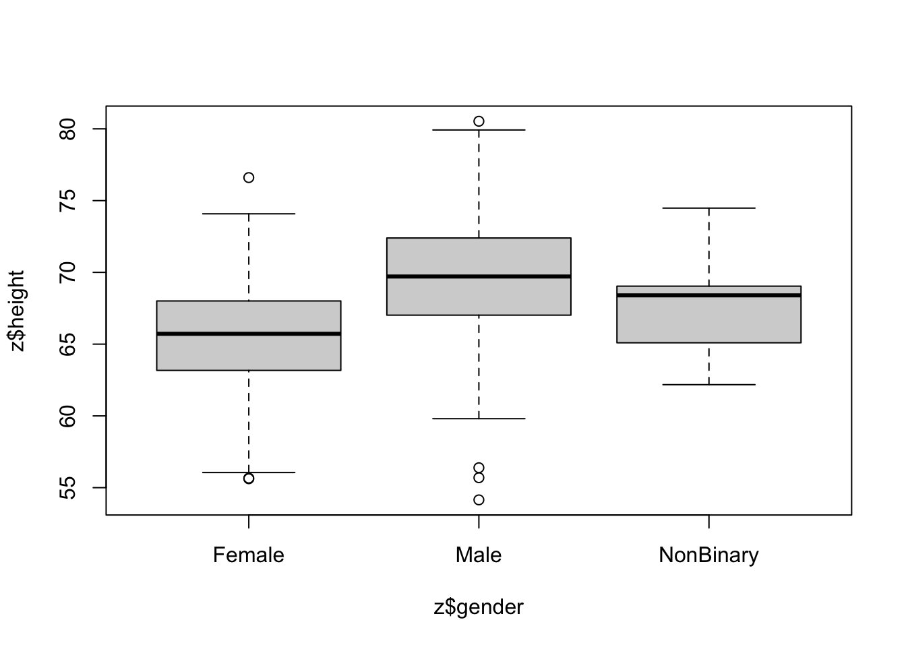
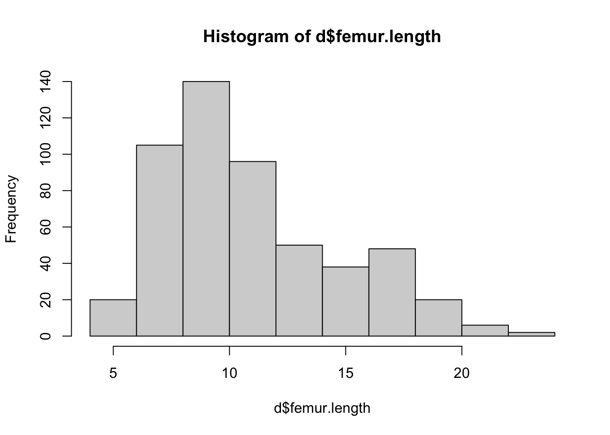
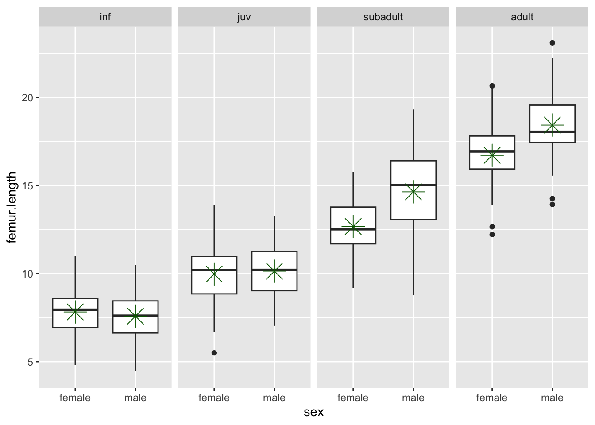
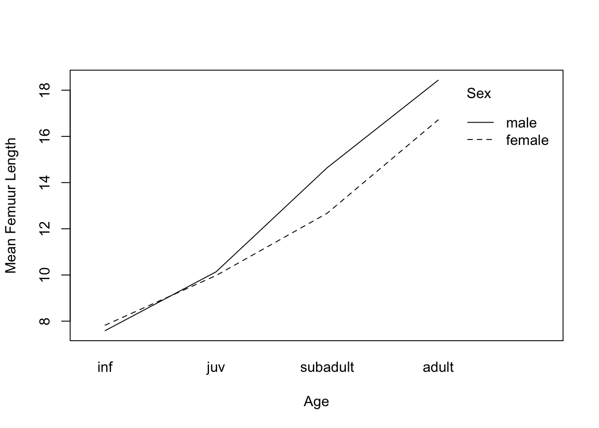
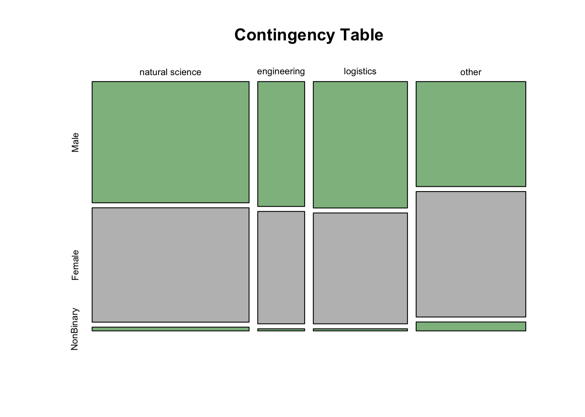

Module 14
================

Basic Categorical Data Analysis and ANOVA
=========================================

Preliminaries
-------------

-   Install these packages in ***R***: {curl}, {ggplot2}, {dplyr}, {car}

Objectives
----------

> In this module, we examine how simple linear regression can be applied to datasets where our predictor variable is discrete or categorical rather than continuous. Indeed, we will see that one-way (and two-way) analysis of variance (ANOVA) are specific applications of simple (and multiple) linear regression. We also look at other methods for basic statistical analysis of categorical data.

Categorical Predictors in Regression
------------------------------------

Thus far we have used simple linear regression models involving continuous explanatory variables, but we can also use a discrete or categorical explanatory variable, made up of 2 or more groups that are coded as "factors" (i.e., we use integer values from 1 to *k* discrete groups as dummy values for our categorical variables). Let's load in our zombie data again, but this time we specify `stringsAsFactors = TRUE` and then look at the class of the variable "gender".

``` r
library(curl)
f <- curl("https://raw.githubusercontent.com/difiore/ADA2016/master/zombies.csv")
z <- read.csv(f, header = TRUE, sep = ",", stringsAsFactors = TRUE)
class(z$gender)
```

    ## [1] "factor"

``` r
summary(z$gender)
```

    ## Female   Male 
    ##    494    506

As with our prior simple regression analysis, we want to evalute the effect of a predictor variable on a response variable (e.g., "height"), but this time we want our predictor to be a discrete variable (e.g., "gender") rather than a continuous one. We can start off by plotting "height" by "gender" using the same formula notation we have been using.

``` r
plot(z$height ~ z$gender)
```



This immediately gives us a nice barplot. Note that if we'd try to use this command after loading in "gender" as character rather than factor data, ***R*** would have thrown an error.

Based on our plot, there indeed seems to be a difference in height between males and females. We can test this directly using linear regression (and, recall, we already know another way to test this, using z or t tests to compare means).

``` r
m <- lm(data = z, height ~ gender)
summary(m)
```

    ## 
    ## Call:
    ## lm(formula = height ~ gender, data = z)
    ## 
    ## Residuals:
    ##      Min       1Q   Median       3Q      Max 
    ## -15.4642  -2.4861   0.0876   2.5425  11.0065 
    ## 
    ## Coefficients:
    ##             Estimate Std. Error t value Pr(>|t|)    
    ## (Intercept)  65.5983     0.1717  382.13   <2e-16 ***
    ## genderMale    4.0154     0.2413   16.64   <2e-16 ***
    ## ---
    ## Signif. codes:  0 '***' 0.001 '**' 0.01 '*' 0.05 '.' 0.1 ' ' 1
    ## 
    ## Residual standard error: 3.815 on 998 degrees of freedom
    ## Multiple R-squared:  0.2172, Adjusted R-squared:  0.2164 
    ## F-statistic: 276.9 on 1 and 998 DF,  p-value: < 2.2e-16

If we take a look at the `summary()` of our model, **m**, we see the same kind of table of results we have seen before, but because the predictor variable in this case is a factor vector instead of a numeric vector, the coefficients are reported and interpreted a bit differently. The coefficient for the intercept, i.e., *β*<sub>0</sub>, reflects the estimate of the mean height for the first of our level variables.

``` r
levels(z$gender)
```

    ## [1] "Female" "Male"

The estimate for *β*<sub>1</sub> is reported as "genderMale" and the value for that coefficient, 4.0154, is the estimated difference in mean height associated with being a male. The regression equation is basically:

**height = 65.5983 + 4.0154 x gender**, with males assigned a gender value of 1 and females of 0.

In this case, the **p** value associated with the **t** statistic for *β*<sub>1</sub> is extremely low, so we conclude that "gender" has a significant effect on height.

We can easily `relevel()` what is the baseline group. The result is very similar, but the sign of *β*<sub>1</sub> is changed.

``` r
z$gender <- relevel(z$gender, ref = "Male")
m <- lm(data = z, height ~ gender)
summary(m)
```

    ## 
    ## Call:
    ## lm(formula = height ~ gender, data = z)
    ## 
    ## Residuals:
    ##      Min       1Q   Median       3Q      Max 
    ## -15.4642  -2.4861   0.0876   2.5425  11.0065 
    ## 
    ## Coefficients:
    ##              Estimate Std. Error t value Pr(>|t|)    
    ## (Intercept)   69.6137     0.1696  410.42   <2e-16 ***
    ## genderFemale  -4.0154     0.2413  -16.64   <2e-16 ***
    ## ---
    ## Signif. codes:  0 '***' 0.001 '**' 0.01 '*' 0.05 '.' 0.1 ' ' 1
    ## 
    ## Residual standard error: 3.815 on 998 degrees of freedom
    ## Multiple R-squared:  0.2172, Adjusted R-squared:  0.2164 
    ## F-statistic: 276.9 on 1 and 998 DF,  p-value: < 2.2e-16

The last line of the `summary()` output shows the results of the global test of significance of the regression model based on an F statistic compared to an F distribution with, in this case, 1 and 998 degrees of freedom.

``` r
p <- 1 - pf(276.9, df1 = 1, df2 = 998)
p
```

    ## [1] 0

We can extend this approach to the case where we have more than two categories for a variable... in this case we need to dummy code our factor variable into multiple binary variables. ***R*** takes care of this for us automatically, but it is good to recognize the procedure.

Let's explore this by recoding the variable "major" into four levels. We first create a new variable name.

``` r
z$occupation <- "temp"
```

We can use the `unique()` or `levels()` function to list all of the different majors in our dataset. The latter does this alphabetically. The `row()` command returns an index of row numbers, which we can then use to recode "major" into our new variable.

``` r
unique(z$major)
```

    ##  [1] medicine/nursing                     
    ##  [2] criminal justice administration      
    ##  [3] education                            
    ##  [4] energy studies                       
    ##  [5] logistics                            
    ##  [6] psychology                           
    ##  [7] botany                               
    ##  [8] communication                        
    ##  [9] military strategy                    
    ## [10] economics                            
    ## [11] mechanical engineering               
    ## [12] physical education                   
    ## [13] philosophy                           
    ## [14] biology                              
    ## [15] applied sciences                     
    ## [16] animal husbandry                     
    ## [17] agricultural sciences                
    ## [18] culinart services                    
    ## [19] city planning                        
    ## [20] integrated water resources management
    ## [21] pharmacology                         
    ## [22] environmental science                
    ## [23] human services                       
    ## [24] epidemiology                         
    ## [25] business administration              
    ## [26] architecture                         
    ## 26 Levels: agricultural sciences animal husbandry ... psychology

``` r
levels(z$major)
```

    ##  [1] "agricultural sciences"                
    ##  [2] "animal husbandry"                     
    ##  [3] "applied sciences"                     
    ##  [4] "architecture"                         
    ##  [5] "biology"                              
    ##  [6] "botany"                               
    ##  [7] "business administration"              
    ##  [8] "city planning"                        
    ##  [9] "communication"                        
    ## [10] "criminal justice administration"      
    ## [11] "culinart services"                    
    ## [12] "economics"                            
    ## [13] "education"                            
    ## [14] "energy studies"                       
    ## [15] "environmental science"                
    ## [16] "epidemiology"                         
    ## [17] "human services"                       
    ## [18] "integrated water resources management"
    ## [19] "logistics"                            
    ## [20] "mechanical engineering"               
    ## [21] "medicine/nursing"                     
    ## [22] "military strategy"                    
    ## [23] "pharmacology"                         
    ## [24] "philosophy"                           
    ## [25] "physical education"                   
    ## [26] "psychology"

``` r
row(data.frame(levels(z$major)))
```

    ##       [,1]
    ##  [1,]    1
    ##  [2,]    2
    ##  [3,]    3
    ##  [4,]    4
    ##  [5,]    5
    ##  [6,]    6
    ##  [7,]    7
    ##  [8,]    8
    ##  [9,]    9
    ## [10,]   10
    ## [11,]   11
    ## [12,]   12
    ## [13,]   13
    ## [14,]   14
    ## [15,]   15
    ## [16,]   16
    ## [17,]   17
    ## [18,]   18
    ## [19,]   19
    ## [20,]   20
    ## [21,]   21
    ## [22,]   22
    ## [23,]   23
    ## [24,]   24
    ## [25,]   25
    ## [26,]   26

``` r
z$occupation[row(data.frame(levels(z$major))) %in% c(1, 2, 3, 5, 6, 14, 15, 
    16, 18, 21, 23)] <- "natural science"
z$occupation[row(data.frame(levels(z$major))) %in% c(7, 8, 12, 17, 19, 22)] <- "logistics"
z$occupation[row(data.frame(levels(z$major))) %in% c(4, 18, 20)] <- "engineering"
z$occupation[row(data.frame(levels(z$major))) %in% c(9, 10, 11, 13, 24, 25, 
    26)] <- "other"
z$occupation <- as.factor(z$occupation)
levels(z$occupation)
```

    ## [1] "engineering"     "logistics"       "natural science" "other"

``` r
z$occupation <- relevel(z$occupation, ref = "natural science")
levels(z$occupation)
```

    ## [1] "natural science" "engineering"     "logistics"       "other"

Again, we can plot our variable by group and run a multilevel linear regression. Each *β* estimate reflects the difference from the estimated mean for the reference level. The `lm()` function also returns the results of the global significance test of our model.

``` r
plot(data = z, zombies_killed ~ occupation)
```


``` r
m <- lm(data = z, zombies_killed ~ occupation)
summary(m)
```

    ## 
    ## Call:
    ## lm(formula = zombies_killed ~ occupation, data = z)
    ## 
    ## Residuals:
    ##     Min      1Q  Median      3Q     Max 
    ## -3.0234 -1.0234 -0.0234  0.9827  7.9926 
    ## 
    ## Coefficients:
    ##                        Estimate Std. Error t value Pr(>|t|)    
    ## (Intercept)            3.023377   0.089172  33.905   <2e-16 ***
    ## occupationengineering -0.223377   0.185935  -1.201    0.230    
    ## occupationlogistics   -0.006061   0.145616  -0.042    0.967    
    ## occupationother       -0.015942   0.139040  -0.115    0.909    
    ## ---
    ## Signif. codes:  0 '***' 0.001 '**' 0.01 '*' 0.05 '.' 0.1 ' ' 1
    ## 
    ## Residual standard error: 1.75 on 996 degrees of freedom
    ## Multiple R-squared:  0.001582,   Adjusted R-squared:  -0.001426 
    ## F-statistic: 0.526 on 3 and 996 DF,  p-value: 0.6645

``` r
p <- 1 - pf(0.526, df1 = 3, df2 = 996)  # F test
p
```

    ## [1] 0.6644926

In this case, we see no significant effect of major on zombie killing proficiency.

One-Way ANOVA
-------------

Regression with a single categorical predictor run as we have just done above is exactly equivalent to a "one-way" or "one-factor" analysis of variance, or ANOVA. That is, ANOVA is just one type of special case of least squares regression.

We can thus run an ANOVA with one line in ***R***. Compare the results presented in the `summary()` output table from an ANOVA with that from the global test reported in `summary()` from `lm()`

``` r
m <- aov(data = z, zombies_killed ~ occupation)
summary(m)
```

    ##              Df Sum Sq Mean Sq F value Pr(>F)
    ## occupation    3    4.8   1.610   0.526  0.665
    ## Residuals   996 3049.1   3.061

``` r
par(mfrow = c(2, 2))
plot(m)
```


The summary of the `lm()` model produces a different table for the same analysis. It shows the effect sizes for each coefficient and their standard errors, whereas the F statistic and omnibus p value given in the ANOVA table indicates that there are differences between at least some treatments, but we do not know where those differences occur. The summary from `lm()` shows the effects arranged as sequential contrasts (the default in R). The first row gives the mean of the first level of the first factor specified in the model. The following rows give differences from this mean for each subsequent factor level. Likewise the standard error in the first row is a standard error of a mean, while the entries in subsequent rows are standard errors of the differences between two means.

In general, in ANOVA and simple regression using a single categorical variable, we aim to test the *H*<sub>0</sub> that the means of a variable of interest do not differ among groups, i.e., that *μ*<sub>1</sub> = *μ*<sub>2</sub>... *μ*<sub>*k*</sub> are all equal. This is an extension of our comparison of two means that we did with z and t tests.

The basic linear model formulation for ANOVA is:


where:

-   *μ* is the grand population mean

-   *β*<sub>*i*</sub> is the deviation of the mean of treatment level *i* from the grand mean

-   *ϵ*<sub>*i*, *j*</sub> is error variance of individual points from the grand mean

The assumptions of ANOVA, similar to those of simple regression, are:

-   that samples are independent and identically distributed

-   that the residuals *ϵ*<sub>*i*, *j*</sub> are normally distributed

-   that within-group variances are similar across all groups (‘homoscedastic”)

The following assumption makes the interpretation of results from ANOVA more straightforward, but it is not strictly required.

-   Our experiment/observations have a balanced design (i.e., an equal number of cases in all groups). If this is violated, it ceases to be true that the total SS of our dataset = within SS + between SS, and then the calculations of MSE and F and our associated p values would be off.

#### CHALLENGE:

Load in the "gibbon-femurs.csv" dataset, which contains the lengths, in centimeters, of the femurs of 400 juvenile, subadult, and adult individuals gibbons. Use both ANOVA and simple linear regession to examine the relationship between age and femur length. Before beginning, make sure that you check for normality of observations within each group.

Is the omnibus test of the relationship between age category and femur length significant? Are femur lengths significantly different for juveniles versus subadults? Subadults versus adults? Juveniles versus adults? HINT: to test these bivariate options, you will need to `relevel()` your factors for simple linear regression.

``` r
library(curl)
library(dplyr)
```

    ## 
    ## Attaching package: 'dplyr'

    ## The following objects are masked from 'package:stats':
    ## 
    ##     filter, lag

    ## The following objects are masked from 'package:base':
    ## 
    ##     intersect, setdiff, setequal, union

``` r
f <- curl("https://raw.githubusercontent.com/difiore/ADA2016/master/gibbon-femurs.csv")
d <- read.csv(f, header = TRUE, sep = ",", stringsAsFactors = TRUE)
head(d)
```

    ##   id age    sex femur.length
    ## 1  1 inf female         7.28
    ## 2  2 inf   male         6.30
    ## 3  3 inf female         7.44
    ## 4  4 inf   male         8.69
    ## 5  5 inf female         9.13
    ## 6  6 inf   male         9.28

``` r
hist(d$femur.length)
```



``` r
qqnorm(d$femur.length)
```


``` r
plot(data = d, femur.length ~ age)  # boxplot with medians
means <- summarise(group_by(d, age), mean(femur.length))  # calculate average by group
points(1:4, means$`mean(femur.length)`, pch = 4, cex = 1.5)  # add means to plot
```


``` r
sds <- summarise(group_by(d, age), sd(femur.length))
max(sds$`sd(femur.length)`)/min(sds$`sd(femur.length)`)  # check that variances are roughly equal (ratio of max/min is <2)
```

    ## [1] 1.767635

``` r
means.centered <- d$femur.length - means[as.numeric(d$age), 2]  # subtract relevant group mean from each data point
qqnorm(means.centered$`mean(femur.length)`)  # graphical tests for normality
```


``` r
par(mfrow = c(2, 2))
hist(d$femur.length[d$age == "inf"], main = "inf")
qqnorm(d$femur.length[d$age == "inf"])
hist(d$femur.length[d$age == "juv"], main = "juv")
qqnorm(d$femur.length[d$age == "juv"])
```


``` r
hist(d$femur.length[d$age == "subadult"], main = "subadult")
qqnorm(d$femur.length[d$age == "subadult"])
hist(d$femur.length[d$age == "adult"], main = "adult")
qqnorm(d$femur.length[d$age == "adult"])
```

 All this checking done, we can plot our data by group and run our ANOVA model...

``` r
par(mfrow = c(1, 1))
plot(data = d, femur.length ~ age)
```


``` r
m <- aov(data = d, femur.length ~ age)  # femur length related to age
summary(m)
```

    ##              Df Sum Sq Mean Sq F value Pr(>F)    
    ## age           3   6152  2050.6   735.8 <2e-16 ***
    ## Residuals   521   1452     2.8                   
    ## ---
    ## Signif. codes:  0 '***' 0.001 '**' 0.01 '*' 0.05 '.' 0.1 ' ' 1

``` r
m <- lm(data = d, femur.length ~ age)
summary(m)
```

    ## 
    ## Call:
    ## lm(formula = femur.length ~ age, data = d)
    ## 
    ## Residuals:
    ##     Min      1Q  Median      3Q     Max 
    ## -5.2052 -1.1104  0.1089  1.0396  5.6748 
    ## 
    ## Coefficients:
    ##             Estimate Std. Error t value Pr(>|t|)    
    ## (Intercept)  17.4252     0.1928   90.39   <2e-16 ***
    ## ageinf       -9.7148     0.2260  -42.98   <2e-16 ***
    ## agejuv       -7.3741     0.2361  -31.23   <2e-16 ***
    ## agesubadult  -3.6688     0.2550  -14.39   <2e-16 ***
    ## ---
    ## Signif. codes:  0 '***' 0.001 '**' 0.01 '*' 0.05 '.' 0.1 ' ' 1
    ## 
    ## Residual standard error: 1.669 on 521 degrees of freedom
    ## Multiple R-squared:  0.809,  Adjusted R-squared:  0.8079 
    ## F-statistic: 735.8 on 3 and 521 DF,  p-value: < 2.2e-16

Post-Hoc Tests and the Non-Parametric Kruskal-Wallis Test
---------------------------------------------------------

After finding a significant omnibus F statistic in an ANOVA, we can test, post-hoc, what group means are different from one another using pairwise t tests with appropriate p value correction.

``` r
pairwise.t.test(d$femur.length, d$age, p.adj = "bonferroni")
```

    ## 
    ##  Pairwise comparisons using t tests with pooled SD 
    ## 
    ## data:  d$femur.length and d$age 
    ## 
    ##          adult  inf    juv   
    ## inf      <2e-16 -      -     
    ## juv      <2e-16 <2e-16 -     
    ## subadult <2e-16 <2e-16 <2e-16
    ## 
    ## P value adjustment method: bonferroni

After an anova, we can also use a "Tukey Honest Significant Differences" test to evaluate this.

``` r
m <- aov(d$femur.length ~ d$age)
posthoc <- TukeyHSD(m, "d$age", conf.level = 0.95)
posthoc  # all age-sex classes differ
```

    ##   Tukey multiple comparisons of means
    ##     95% family-wise confidence level
    ## 
    ## Fit: aov(formula = d$femur.length ~ d$age)
    ## 
    ## $`d$age`
    ##                     diff        lwr       upr p adj
    ## inf-adult      -9.714750 -10.297335 -9.132165     0
    ## juv-adult      -7.374133  -7.982623 -6.765643     0
    ## subadult-adult -3.668800  -4.326044 -3.011556     0
    ## juv-inf         2.340617   1.875875  2.805359     0
    ## subadult-inf    6.045950   5.518982  6.572918     0
    ## subadult-juv    3.705333   3.149860  4.260806     0

The Kruskal-Wallis test is a nonparametric alternative to one-way ANOVA that relaxes the need for normality in the distribution of data in each group (the different groups should still have roughly equal variances). Essentially, rather than testing the null hypothesis that the means for each group do not differ we are instead testing the null hypothesis that the **medians** do not differ. The test converts the continuous response variable to a set of RANKS (i.e., it does a uniform transformation) and then works with those ranks. The **p** value associated with the K-W test statistic is evaluated against a Chi-Square distribution.

``` r
m <- kruskal.test(data = d, femur.length ~ age)
m
```

    ## 
    ##  Kruskal-Wallis rank sum test
    ## 
    ## data:  femur.length by age
    ## Kruskal-Wallis chi-squared = 407.13, df = 3, p-value < 2.2e-16

``` r
d <- arrange(d, femur.length)  # use {dplyr} to sort by femur.length
d <- mutate(d, femur.rank = row(data.frame(d$femur.length)))  # use {dplyr} to add new variable of rank femur.length
m <- kruskal.test(data = d, femur.rank ~ age)
m
```

    ## 
    ##  Kruskal-Wallis rank sum test
    ## 
    ## data:  femur.rank by age
    ## Kruskal-Wallis chi-squared = 407.43, df = 3, p-value < 2.2e-16

Multiple Factor ANOVA
---------------------

Sometimes the data we are interested in is characterized by multiple grouping variables (e.g., age and sex). In the case of the gibbon femur length data, we are interested in the **main effect** of each factor on the variable of interest (e.g., do femur lengths vary by age or sex) while accounting for the effects of the other factor. We may also be interested in any **interactive effects** among factors. Thus, in multiple factor ANOVA we are interested in testing several null hypotheses simultaneously: \[1\] that each factor has no effect on the mean of our continuous reponse variable and \[2\] that there are no interactive effects of sets of factors on the mean of our continuous reponse variable.

Model description and testing for multiple ANOVA is a simple extension of the formula notation which we've used for single factors. First, though, let's quickly check that our groups have similar variance.

``` r
library(ggplot2)
means <- summarise(group_by(d, age, sex), mean(femur.length))  # first we calculate averages by combination of factors
means
```

    ## Source: local data frame [8 x 3]
    ## Groups: age [?]
    ## 
    ##        age    sex `mean(femur.length)`
    ##     <fctr> <fctr>                <dbl>
    ## 1    adult female            16.715909
    ## 2    adult   male            18.431935
    ## 3      inf female             7.825049
    ## 4      inf   male             7.588763
    ## 5      juv female             9.976420
    ## 6      juv   male            10.138696
    ## 7 subadult female            12.673111
    ## 8 subadult   male            14.642727

``` r
sds <- summarise(group_by(d, age, sex), sd(femur.length))  # first we calculate averages by combination of factors
sds
```

    ## Source: local data frame [8 x 3]
    ## Groups: age [?]
    ## 
    ##        age    sex `sd(femur.length)`
    ##     <fctr> <fctr>              <dbl>
    ## 1    adult female           1.791199
    ## 2    adult   male           1.996978
    ## 3      inf female           1.220022
    ## 4      inf   male           1.309130
    ## 5      juv female           1.435525
    ## 6      juv   male           1.533014
    ## 7 subadult female           1.618919
    ## 8 subadult   male           2.296289

``` r
max(sds$`sd(femur.length)`)/min(sds$`sd(femur.length)`)  # check that variances in each group are roughly equal (ratio of max/min is <2)
```

    ## [1] 1.882171

``` r
p <- ggplot(data = d, aes(y = femur.length, x = sex)) + geom_boxplot() + facet_wrap(~age, 
    ncol = 4)  # and let's plot what the data look like
# p <- p + geom_point() # uncommenting this shows all points
p <- p + stat_summary(fun.y = mean, colour = "darkgreen", geom = "point", shape = 8, 
    size = 6)
p
```



If we look at each variable separately using ANOVA, we see there is an effect of age but not of sex.

``` r
summary(aov(data = d, femur.length ~ age))
```

    ##              Df Sum Sq Mean Sq F value Pr(>F)    
    ## age           3   6152  2050.6   735.8 <2e-16 ***
    ## Residuals   521   1452     2.8                   
    ## ---
    ## Signif. codes:  0 '***' 0.001 '**' 0.01 '*' 0.05 '.' 0.1 ' ' 1

``` r
summary(aov(data = d, femur.length ~ sex))
```

    ##              Df Sum Sq Mean Sq F value Pr(>F)
    ## sex           1     28   28.33   1.956  0.163
    ## Residuals   523   7576   14.48

However, if we do a two-way ANOVA and consider the factors together, we see that there is still a main effect of age when taking sex into account **and** there is a main effect of sex when we take age into account.

``` r
m <- summary(aov(data = d, femur.length ~ age + sex))
m
```

    ##              Df Sum Sq Mean Sq F value   Pr(>F)    
    ## age           3   6152  2050.6   756.4  < 2e-16 ***
    ## sex           1     42    42.3    15.6 8.89e-05 ***
    ## Residuals   520   1410     2.7                     
    ## ---
    ## Signif. codes:  0 '***' 0.001 '**' 0.01 '*' 0.05 '.' 0.1 ' ' 1

To examine whether there is an interaction effect, we would modify our model formula a bit...

``` r
m <- aov(data = d, femur.length ~ age + sex + age:sex)  # : operator includes specific interaction terms
summary(m)
```

    ##              Df Sum Sq Mean Sq F value   Pr(>F)    
    ## age           3   6152  2050.6  816.35  < 2e-16 ***
    ## sex           1     42    42.3   16.84 4.72e-05 ***
    ## age:sex       3    111    37.0   14.73 3.21e-09 ***
    ## Residuals   517   1299     2.5                     
    ## ---
    ## Signif. codes:  0 '***' 0.001 '**' 0.01 '*' 0.05 '.' 0.1 ' ' 1

We could also use...

``` r
m <- aov(data = d, femur.length ~ age * sex)  # * operator includes all interaction terms
summary(m)
```

    ##              Df Sum Sq Mean Sq F value   Pr(>F)    
    ## age           3   6152  2050.6  816.35  < 2e-16 ***
    ## sex           1     42    42.3   16.84 4.72e-05 ***
    ## age:sex       3    111    37.0   14.73 3.21e-09 ***
    ## Residuals   517   1299     2.5                     
    ## ---
    ## Signif. codes:  0 '***' 0.001 '**' 0.01 '*' 0.05 '.' 0.1 ' ' 1

``` r
m <- lm(data = d, femur.length ~ age * sex)  # or using the lm() function...
summary(m)
```

    ## 
    ## Call:
    ## lm(formula = femur.length ~ age * sex, data = d)
    ## 
    ## Residuals:
    ##     Min      1Q  Median      3Q     Max 
    ## -5.8727 -1.0088  0.1336  1.0469  4.6773 
    ## 
    ## Coefficients:
    ##                     Estimate Std. Error t value Pr(>|t|)    
    ## (Intercept)          16.7159     0.2389  69.960  < 2e-16 ***
    ## ageinf               -8.8909     0.2854 -31.148  < 2e-16 ***
    ## agejuv               -6.7395     0.2968 -22.706  < 2e-16 ***
    ## agesubadult          -4.0428     0.3360 -12.031  < 2e-16 ***
    ## sexmale               1.7160     0.3716   4.617 4.91e-06 ***
    ## ageinf:sexmale       -1.9523     0.4341  -4.498 8.48e-06 ***
    ## agejuv:sexmale       -1.5538     0.4534  -3.427 0.000658 ***
    ## agesubadult:sexmale   0.2536     0.4895   0.518 0.604641    
    ## ---
    ## Signif. codes:  0 '***' 0.001 '**' 0.01 '*' 0.05 '.' 0.1 ' ' 1
    ## 
    ## Residual standard error: 1.585 on 517 degrees of freedom
    ## Multiple R-squared:  0.8292, Adjusted R-squared:  0.8269 
    ## F-statistic: 358.6 on 7 and 517 DF,  p-value: < 2.2e-16

``` r
interaction.plot(x.factor = d$age, xlab = "Age", trace.factor = d$sex, trace.label = "Sex", 
    response = d$femur.length, fun = mean, ylab = "Mean Femuur Length")
```



Here, it looks like there is indeed a significant main effect of each term as well as an interaction between our two categorical variables. We will return to comparing models to one another (e.g., our model with and without interaction) and to post-hoc tests of what group mean differences are significant when we get into model selection in another few lectures.

When we do `summary()` of the results of the `lm()` function, we are estimating eight *β* coefficients (equivalent to the number of groups we have). *β*<sub>0</sub>, the intercept, which is the mean femur length for the base level (in this case, "adult females"). Then we have coefficients showing how the different factor combination groups would differ from that base level (e.g., adult males have mean femur lengths 1.716 greater than adult females, etc).

Note that the ORDER in which our factors are entered into our linear model results in different values for the entries in our ANOVA table, while the estimation of our regression coefficients is identical regardless:

``` r
m1 <- aov(data = d, femur.length ~ age * sex)
summary(m1)
```

    ##              Df Sum Sq Mean Sq F value   Pr(>F)    
    ## age           3   6152  2050.6  816.35  < 2e-16 ***
    ## sex           1     42    42.3   16.84 4.72e-05 ***
    ## age:sex       3    111    37.0   14.73 3.21e-09 ***
    ## Residuals   517   1299     2.5                     
    ## ---
    ## Signif. codes:  0 '***' 0.001 '**' 0.01 '*' 0.05 '.' 0.1 ' ' 1

``` r
m2 <- aov(data = d, femur.length ~ sex * age)
summary(m2)
```

    ##              Df Sum Sq Mean Sq F value   Pr(>F)    
    ## sex           1     28    28.3   11.28 0.000843 ***
    ## age           3   6166  2055.3  818.20  < 2e-16 ***
    ## sex:age       3    111    37.0   14.73 3.21e-09 ***
    ## Residuals   517   1299     2.5                     
    ## ---
    ## Signif. codes:  0 '***' 0.001 '**' 0.01 '*' 0.05 '.' 0.1 ' ' 1

``` r
m1 <- lm(data = d, femur.length ~ age * sex)
summary(m1)
```

    ## 
    ## Call:
    ## lm(formula = femur.length ~ age * sex, data = d)
    ## 
    ## Residuals:
    ##     Min      1Q  Median      3Q     Max 
    ## -5.8727 -1.0088  0.1336  1.0469  4.6773 
    ## 
    ## Coefficients:
    ##                     Estimate Std. Error t value Pr(>|t|)    
    ## (Intercept)          16.7159     0.2389  69.960  < 2e-16 ***
    ## ageinf               -8.8909     0.2854 -31.148  < 2e-16 ***
    ## agejuv               -6.7395     0.2968 -22.706  < 2e-16 ***
    ## agesubadult          -4.0428     0.3360 -12.031  < 2e-16 ***
    ## sexmale               1.7160     0.3716   4.617 4.91e-06 ***
    ## ageinf:sexmale       -1.9523     0.4341  -4.498 8.48e-06 ***
    ## agejuv:sexmale       -1.5538     0.4534  -3.427 0.000658 ***
    ## agesubadult:sexmale   0.2536     0.4895   0.518 0.604641    
    ## ---
    ## Signif. codes:  0 '***' 0.001 '**' 0.01 '*' 0.05 '.' 0.1 ' ' 1
    ## 
    ## Residual standard error: 1.585 on 517 degrees of freedom
    ## Multiple R-squared:  0.8292, Adjusted R-squared:  0.8269 
    ## F-statistic: 358.6 on 7 and 517 DF,  p-value: < 2.2e-16

``` r
m2 <- lm(data = d, femur.length ~ sex * age)
summary(m2)
```

    ## 
    ## Call:
    ## lm(formula = femur.length ~ sex * age, data = d)
    ## 
    ## Residuals:
    ##     Min      1Q  Median      3Q     Max 
    ## -5.8727 -1.0088  0.1336  1.0469  4.6773 
    ## 
    ## Coefficients:
    ##                     Estimate Std. Error t value Pr(>|t|)    
    ## (Intercept)          16.7159     0.2389  69.960  < 2e-16 ***
    ## sexmale               1.7160     0.3716   4.617 4.91e-06 ***
    ## ageinf               -8.8909     0.2854 -31.148  < 2e-16 ***
    ## agejuv               -6.7395     0.2968 -22.706  < 2e-16 ***
    ## agesubadult          -4.0428     0.3360 -12.031  < 2e-16 ***
    ## sexmale:ageinf       -1.9523     0.4341  -4.498 8.48e-06 ***
    ## sexmale:agejuv       -1.5538     0.4534  -3.427 0.000658 ***
    ## sexmale:agesubadult   0.2536     0.4895   0.518 0.604641    
    ## ---
    ## Signif. codes:  0 '***' 0.001 '**' 0.01 '*' 0.05 '.' 0.1 ' ' 1
    ## 
    ## Residual standard error: 1.585 on 517 degrees of freedom
    ## Multiple R-squared:  0.8292, Adjusted R-squared:  0.8269 
    ## F-statistic: 358.6 on 7 and 517 DF,  p-value: < 2.2e-16

Why is this? In the first case, we are looking at the variance within each age group that is explained by gender while in the second case we are looking at the variance within each gender that is explained by age... but we have different numbers of observations in our different groups. This is known as an unbalanced design.

We can see the unbalanced design by tabulating the cases for each combination of factors.

``` r
table(d$sex, d$age)
```

    ##         
    ##          adult inf juv subadult
    ##   female    44 103  81       45
    ##   male      31  97  69       55

Recall that ANOVA is based on splitting up the sums of squares, so that for a model like:


The sums of squares add up such that:


By default, the `aov()` function uses something called **Type I Sums of Squares** (also called "sequential sum of squares"), which gives greater emphasis to the first factor in the model, leaving only residual variation to the remaining factors. It should be used when you want to first control for one factor, leaving the others to explain only any remaining differences. In a **Type I** ANOVA, the sums of squares for the first term are calculated around the grand mean of our observations, but the next terms are calculated as residuals around the average of the grand mean and the first group mean. This sequential procedure means our results depend on which term shows up first. This can have a large effect on the sums of squares calculated, and hence on p values, when using an unbalanced design.

By contrast, **Type II** and **Type III Sums of Squares** calculate individual observations' within each group as deviations from the grand mean.

By contrast, **Type II Sum of Squares** compares the main effects of each group, assuming that the interaction between them is minimal. Generally it is a much more appropriate test for comparing main effects and is more appropriate for us to use when there is an unbalanced design.

**Type III Sum of Squares** (or "marginal sum of squares") is most appropriate when there is a significant interaction effect. Since both **Type II** and **Type III** ANOVA calculate sums of squares around the grand mean, these are unaffected by sample sizes and do not arbitrarily give preference to one effect over another.

To summarize:

-   When our data are balanced, our factors are orthogonal, and all three types of sums of squares give the same results.

-   If our data are unbalanced, we should generally be using Type II or Type III Sums of Squares, since we are generally interested in exploring the significance of one factor while controlling for the level of the other factors.

-   In general, if there is no significant interaction effect, then Type II is more powerful.

-   If interaction is present, then Type II is inappropriate while Type III can still be used, but results need to be interpreted with caution (in the presence of interactions, main effects difficult to interpret).

[See this post](http://goanna.cs.rmit.edu.au/~fscholer/anova.php) for further treatment of this issue.

We can use the `Anova()` function in the {car} package to run ANOVA with Type II and Type III Sums of Squares. In the examples below, both linear models, where the order of factors are reversed, give the same results.

``` r
library(car)
```

    ## 
    ## Attaching package: 'car'

    ## The following object is masked from 'package:dplyr':
    ## 
    ##     recode

``` r
m1 <- aov(data = d, femur.length ~ age + sex)
m1 <- Anova(m1, type = "II")
m1
```

    ## Anova Table (Type II tests)
    ## 
    ## Response: femur.length
    ##           Sum Sq  Df F value    Pr(>F)    
    ## age       6165.8   3 758.126 < 2.2e-16 ***
    ## sex         42.3   1  15.604 8.888e-05 ***
    ## Residuals 1409.7 520                      
    ## ---
    ## Signif. codes:  0 '***' 0.001 '**' 0.01 '*' 0.05 '.' 0.1 ' ' 1

``` r
m1 <- aov(data = d, femur.length ~ sex + age)
m2 <- Anova(m2, type = "II")
m2
```

    ## Anova Table (Type II tests)
    ## 
    ## Response: femur.length
    ##           Sum Sq  Df F value    Pr(>F)    
    ## sex         42.3   1  16.840 4.724e-05 ***
    ## age       6165.8   3 818.200 < 2.2e-16 ***
    ## sex:age    111.0   3  14.735 3.210e-09 ***
    ## Residuals 1298.7 517                      
    ## ---
    ## Signif. codes:  0 '***' 0.001 '**' 0.01 '*' 0.05 '.' 0.1 ' ' 1

``` r
m1 <- aov(data = d, femur.length ~ age * sex)
m1 <- Anova(m1, type = "III")
m1
```

    ## Anova Table (Type III tests)
    ## 
    ## Response: femur.length
    ##              Sum Sq  Df  F value    Pr(>F)    
    ## (Intercept) 12294.6   1 4894.442 < 2.2e-16 ***
    ## age          2661.3   3  353.158 < 2.2e-16 ***
    ## sex            53.6   1   21.320  4.91e-06 ***
    ## age:sex       111.0   3   14.735  3.21e-09 ***
    ## Residuals    1298.7 517                       
    ## ---
    ## Signif. codes:  0 '***' 0.001 '**' 0.01 '*' 0.05 '.' 0.1 ' ' 1

``` r
m2 <- aov(data = d, femur.length ~ sex * age)
m2 <- Anova(m2, type = "III")
m2
```

    ## Anova Table (Type III tests)
    ## 
    ## Response: femur.length
    ##              Sum Sq  Df  F value    Pr(>F)    
    ## (Intercept) 12294.6   1 4894.442 < 2.2e-16 ***
    ## sex            53.6   1   21.320  4.91e-06 ***
    ## age          2661.3   3  353.158 < 2.2e-16 ***
    ## sex:age       111.0   3   14.735  3.21e-09 ***
    ## Residuals    1298.7 517                       
    ## ---
    ## Signif. codes:  0 '***' 0.001 '**' 0.01 '*' 0.05 '.' 0.1 ' ' 1

Chi-Square Tests of Goodness of Fit and Independence
----------------------------------------------------

One additional type of categorical data we will often encounter are counts of observations that fall into two or more categories (when we were dealing with Z tests for proportion data, we were interested in something similar, though with two categories only). We can use Chi-Square tests to evaluate statistically the distribution of observations across levels of one or more categorical variables. To use the Chi-Square test we first derive a Chi-Square statistic, which is calculated as...


where:

-   *O*<sub>*i*</sub> = number of observations in the *i*th category
-   *E*<sub>*i*</sub> = number of observations in the *i*th category

We then compare the value of the *χ*<sup>2</sup> statistic to the Chi-Square distribution with *k* − 1 degrees of freedom.

#### CHALLENGE:

Let's return to the zombies dataset, where we defined an occupation based on major for survivors of the zombie apocalypse. We want to test the hypothesis that survivors of the zombie apocalypse are more likely than expected by chance to be natural science majors. We will assume that our null hypothesis is that the proportions of different post-apocalypse occupations are equivalent, i.e., that *π*<sub>*n**a**t**u**r**a**l**s**c**i**e**n**c**e*</sub> = *π*<sub>*e**n**g**i**n**e**e**r**i**n**g*</sub>= *π*<sub>*l**o**g**i**s**t**i**c**s*</sub> = *π*<sub>*o**t**h**e**r*</sub> = 0.25.

``` r
obs.table <- table(z$occupation)  # returns the same as summary()
obs.table
```

    ## 
    ## natural science     engineering       logistics           other 
    ##             385             115             231             269

``` r
exp.table <- rep(0.25 * length(z$occupation), 4)
exp.table
```

    ## [1] 250 250 250 250

``` r
occupation.matrix <- data.frame(cbind(obs.table, exp.table, (obs.table - exp.table)^2/exp.table))
names(occupation.matrix) <- c("Oi", "Ei", "(Oi-Ei)^2/Ei")
occupation.matrix
```

    ##                  Oi  Ei (Oi-Ei)^2/Ei
    ## natural science 385 250       72.900
    ## engineering     115 250       72.900
    ## logistics       231 250        1.444
    ## other           269 250        1.444

``` r
X2 <- sum(occupation.matrix[, 3])
X2
```

    ## [1] 148.688

``` r
p <- 1 - pchisq(X2, length(obs.table) - 1)
p
```

    ## [1] 0

Here, we reject the null hypothesis that the proportions of different occupations among the survivors of the zombie apocalypse is equivalent.

We can do all this with a 1-liner in ***R***, too.

``` r
chisq.test(x = obs.table, p = c(0.25, 0.25, 0.25, 0.25))  # here p is a vector of expected proportions... default is uniform
```

    ## 
    ##  Chi-squared test for given probabilities
    ## 
    ## data:  obs.table
    ## X-squared = 148.69, df = 3, p-value < 2.2e-16

``` r
chisq.test(x = obs.table)
```

    ## 
    ##  Chi-squared test for given probabilities
    ## 
    ## data:  obs.table
    ## X-squared = 148.69, df = 3, p-value < 2.2e-16

``` r
chisq.test(x = obs.table, p = c(0.38, 0.12, 0.23, 0.27))  # with a different set of expected proportions... fail to reject H0
```

    ## 
    ##  Chi-squared test for given probabilities
    ## 
    ## data:  obs.table
    ## X-squared = 0.28217, df = 3, p-value = 0.9633

The above was a Chi-Square goodness of fit test for one categorical variable... what about if we have two categorical variables and we are curious if there is an association among them? Then we do a Chi-Square test of independence. In this case, our Chi-Square statistic is the sum of (O-E)^2/E across all cells in our table, and our degrees of freedom is = (number of rows - 1) \* (number of columns -1). Let's suppose we want to see if there is a relationship among zombie apocalypse survivors between gender and occupation.

First, we determine our table of observed proportions:

``` r
obs.table = table(z$gender, z$occupation)
obs.table
```

    ##         
    ##          natural science engineering logistics other
    ##   Male               198          61       123   124
    ##   Female             187          54       108   145

We can view our data graphically using the `mosaic plot()` function.

``` r
mosaicplot(t(obs.table), main = "Contingency Table", col = c("darkseagreen", 
    "gray"))  # t function transposes the table
```



Then, we determine our table of expected proportions:

``` r
r <- rowSums(obs.table)  # row margins
r
```

    ##   Male Female 
    ##    506    494

``` r
c <- colSums(obs.table)  # column margins
c
```

    ## natural science     engineering       logistics           other 
    ##             385             115             231             269

``` r
nr <- nrow(obs.table)  # row dimensions
nr
```

    ## [1] 2

``` r
nc <- ncol(obs.table)  # column dimensions
nc
```

    ## [1] 4

``` r
exp.table <- matrix(rep(c, each = nr) * r/sum(obs.table), nrow = nr, ncol = nc, 
    dimnames = dimnames(obs.table))  # calculates the product of c*r and divides by total
exp.table
```

    ##         
    ##          natural science engineering logistics   other
    ##   Male            194.81       58.19   116.886 136.114
    ##   Female          190.19       56.81   114.114 132.886

``` r
X2 <- sum((obs.table - exp.table)^2/exp.table)
X2
```

    ## [1] 3.210266

``` r
p <- 1 - pchisq(X2, df = (nr - 1) * (nc - 1))
p
```

    ## [1] 0.3603285

Again, we can do a one-liner for a test of independence...

``` r
chisq.test(x = obs.table)
```

    ## 
    ##  Pearson's Chi-squared test
    ## 
    ## data:  obs.table
    ## X-squared = 3.2103, df = 3, p-value = 0.3603
