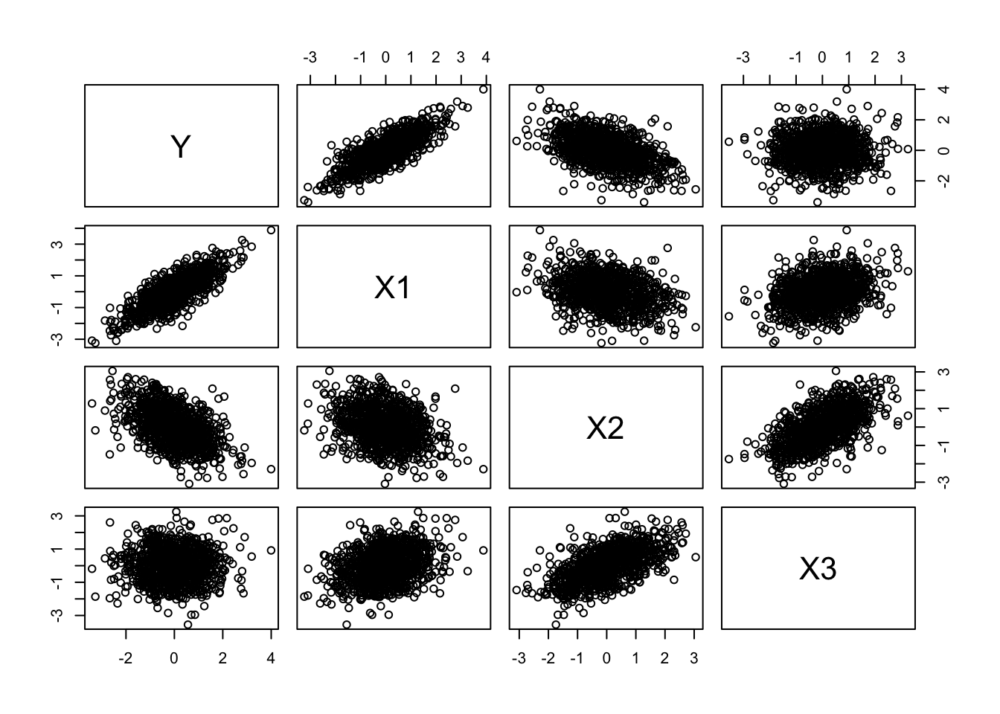
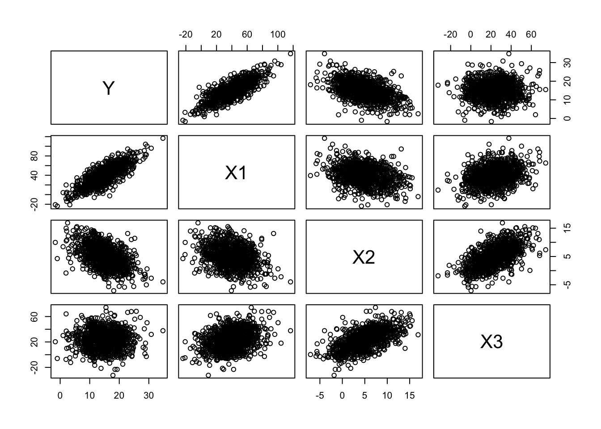
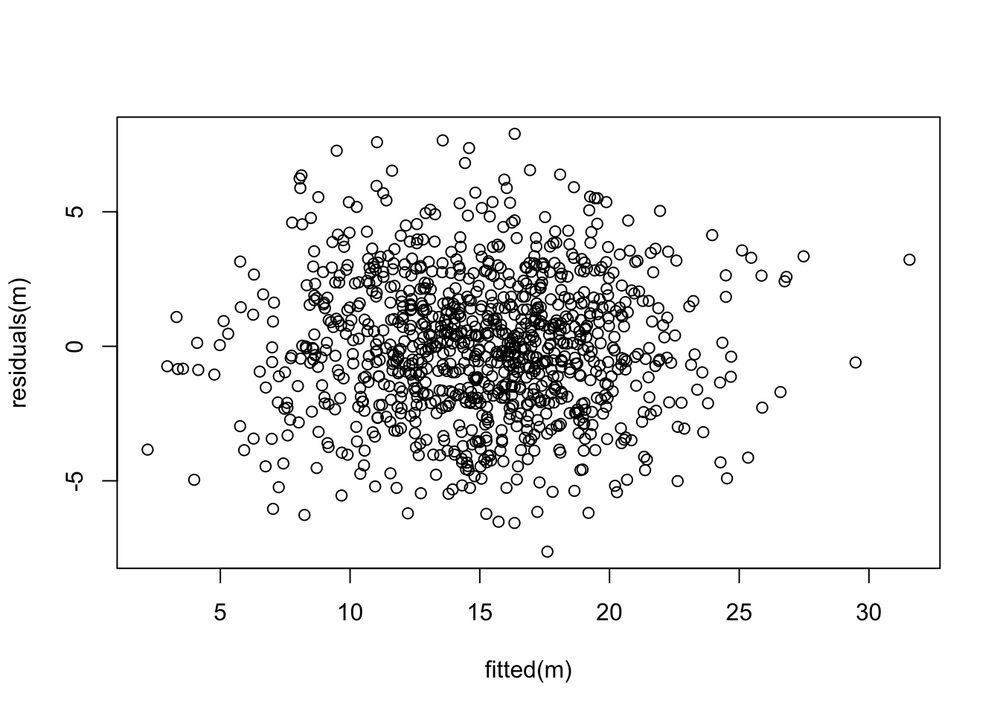
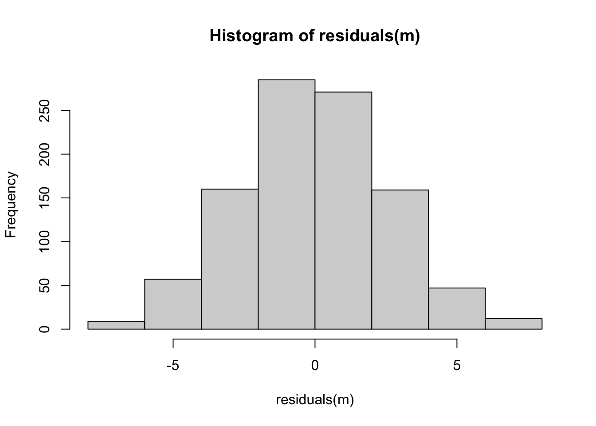
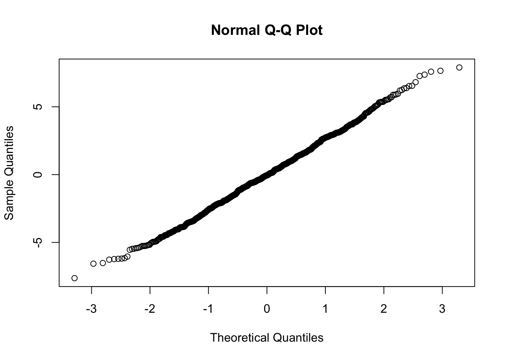
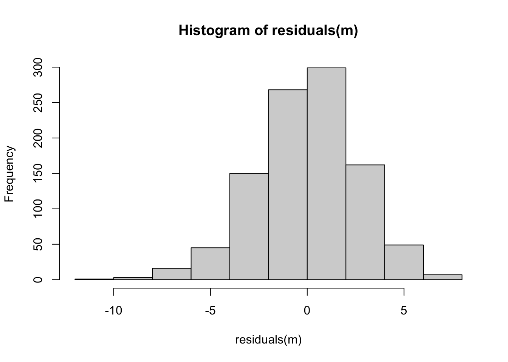
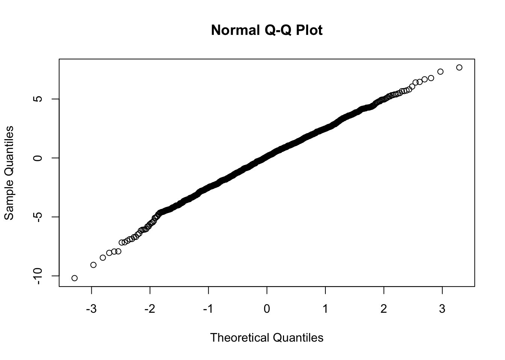
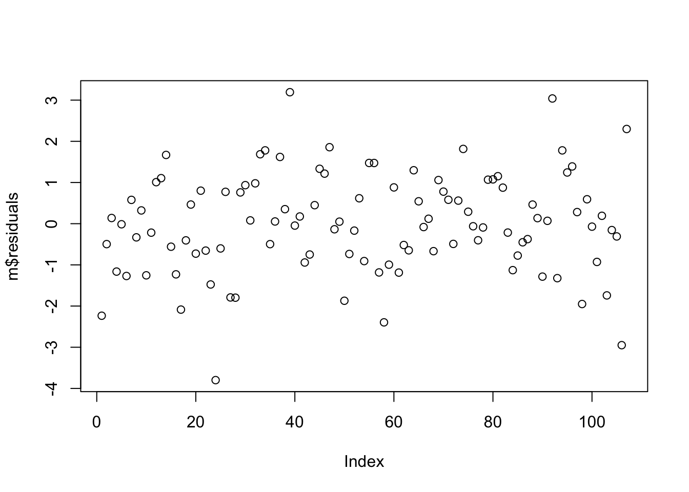

Module 15
================

Multiple Regression and ANCOVA
==============================

Preliminaries
-------------

-   Install these packages in ***R***: {curl}, {ggplot2}, {gridExtra}, {dplyr}, {car}

Objectives
----------

> In this module, we extend our simple linear regression and ANOVA models to cases where we have more than one predictor variable. The same approach can be used with combinations of continuous and categorical variables. If all of our predictors variables are continuous, we typically describe this as "multiple regression". If our predictors are combinations of continuous and categorical variables, we typically describe this as "analysis of covariance", or ANCOVA.

Overview
--------

Multiple linear regression and ANCOVA are pretty straightforward generalizations of the simple linear regression and ANOVA approach that we have considered previously (i.e., Model I regressions with our parameters estimated using the criterion of OLS). In multiple linear regression and ANCOVA, we are looking to model a response variable in terms of more than one predictor variable so we can evaluate the effects of several different explanatory variables. When we do multiple linear regression, we are, essentially, looking at the relationship between each of two or more continuous predictor variables and a continuous response variable **while holding the effect of all other predictor variables constant**. When we do ANCOVA, we are effectively looking at the relationship between one or more continuous predictor variables and a continuous response variable within each of one or more categorical groups.

To characterize this using formulas analogous to those we have used before...

Simple Bivariate Linear Model:


Multivariate Linear Model:


We thus now need to estimate **multiple** *β* coefficients, one for the intercept plus one for each predictor variable in our model, and, instead of a "line"" of best fit, we are determining a multidimensional surface of best fit. The criteria we typically use for estimating best fit is analogous to that we've used before, i.e., **ordinary least squares**, where we want to minimize the multidimensional squared deviation of our observed and predicted values:


Estimating our set of coefficients for multiple regression is then done using matrix algebra, which we don't need to explore thoroughly (but see the "digression" below). The `lm()` function will implement this process for us directly.

> NOTE: Besides the least squares approach to parameter estimation, we might also use other approaches, including maximum likelihood and Bayesian approaches. These are beyond the scope of what we will discuss in this class, but the objective is the same... to use a particular criterion to estimate parameter values describing a relationship between our predictor and response variables as well as measures of uncertainty in those parameter values. It is worth noting that for many common population parameters (such as the mean) as well as for regression slopes and/or factor effects in certain linear models, the OLS and ML estimators turn out to be the same when the assumptions behind OLS are met (i.e., normally distributed variables and normally distributed error terms). When response variables or residuals are not normally distributed (e.g., where we have binary or categorical response variables), we use ML or Bayesian approaches rather than OLS for parameter estimation.

Let's work some examples!

Multiple Regression - Continuous Response Variable and More than One Continuous Predictor Variables
---------------------------------------------------------------------------------------------------

We will start by constructing a dataset ourselves of some correlated random normal continuous variables. The following bit of code will let us do that. [See also this post](http://statistical-research.com/simulating-random-multivariate-correlated-data-continuous-variables/). First, we define a matrix of correlations among our variables (you can play with the values in this matrix, but it must be symmetric):

``` r
R = matrix(cbind(1, 0.8, -0.5, 0, 0.8, 1, -0.3, 0.3, -0.5, -0.3, 1, 0.6, 0, 
    0.3, 0.6, 1), nrow = 4)
```

Second, let's generate a dataset of random normal variables where each has a defined mean and standard deviation and then bundle these into a matrix ("M") and a dataframe ("orig"):

``` r
n <- 1000
k <- 4
M <- NULL
V <- NULL
mu <- c(15, 40, 5, 23)  # vector of variable means
s <- c(5, 20, 4, 15)  # vector of variable SDs
for (i in 1:k) {
    V <- rnorm(n, mu[i], s[i])
    M <- cbind(M, V)
}
M <- matrix(M, nrow = n, ncol = k)
orig <- as.data.frame(M)
names(orig) = c("Y", "X1", "X2", "X3")
head(orig)
```

    ##          Y       X1        X2        X3
    ## 1 19.53543 10.88467  2.888090 30.753763
    ## 2 16.81717 20.08912 10.050667 32.519950
    ## 3 13.03543 21.76351  5.371918  8.863209
    ## 4 25.38264 40.02430  6.750061 25.808563
    ## 5 16.98370 38.94477  5.710683  6.586227
    ## 6 23.68394 37.25023 14.579377 28.804369

``` r
cor(orig)  # variables are uncorrelated
```

    ##               Y           X1          X2           X3
    ## Y   1.000000000 -0.005441474 -0.03112476  0.022113543
    ## X1 -0.005441474  1.000000000 -0.01607718 -0.004555934
    ## X2 -0.031124755 -0.016077176  1.00000000 -0.045828204
    ## X3  0.022113543 -0.004555934 -0.04582820  1.000000000

``` r
plot(orig)  # does quick bivariate plots for each pair of variables; using `pairs(orig)` would do the same
```


Now, let's normalize and standardize our variables into by subtracting the relevant means and dividing by the standard deviation. This converts them to Z scores from a standard normal distribution.

> NOTE how we use the `apply()` and `sweep()` functions here. Cool, eh?

``` r
ms <- apply(orig, 2, FUN = "mean")  # returns a vector of means, where we are taking this across dimension 2 of the array 'orig'
ms
```

    ##         Y        X1        X2        X3 
    ## 14.794345 39.005792  5.029565 23.455478

``` r
sds <- apply(orig, 2, FUN = "sd")
sds
```

    ##         Y        X1        X2        X3 
    ##  4.977833 20.483147  3.952218 14.083808

``` r
normalized <- sweep(orig, 2, STATS = ms, FUN = "-")  # 2nd dimension is columns, removing array of means, function = subtract
normalized <- sweep(normalized, 2, STATS = sds, FUN = "/")  # 2nd dimension is columns, scaling by array of sds, function = divide
head(normalized)  # now a dataframe of Z scores
```

    ##            Y           X1         X2         X3
    ## 1  0.9524396 -1.372890543 -0.5418414  0.5182040
    ## 2  0.4063668 -0.923523514  1.2704514  0.6436095
    ## 3 -0.3533495 -0.841778879  0.0866230 -1.0361025
    ## 4  2.1270890  0.049724241  0.4353242  0.1670773
    ## 5  0.4398206 -0.002979268  0.1723381 -1.1977762
    ## 6  1.7858352 -0.085707835  2.4163169  0.3797901

``` r
M <- as.matrix(normalized)  # redefine M as our matrix of normalized variables
```

With `apply()` we apply a function to the specified margin of an array or matrix, and with `sweep()` we then perform whatever function is specified on all of the elements in an array specified by the given margin.

Next, we take the Cholesky decomposition of our correlation matrix and then multiply our normalized data matrix by the decomposition matrix to yield a transformed dataset with the specified correlation among variables. The Cholesky decomposition breaks certain symmetric matrices into two such that:


``` r
U = chol(R)
newM = M %*% U
new = as.data.frame(newM)
names(new) = c("Y", "X1", "X2", "X3")
cor(new)  # note that is correlation matrix is what we are aiming for!
```

    ##               Y         X1         X2           X3
    ## Y   1.000000000  0.7988243 -0.5214460 -0.008199549
    ## X1  0.798824303  1.0000000 -0.3256212  0.293775317
    ## X2 -0.521445973 -0.3256212  1.0000000  0.578392940
    ## X3 -0.008199549  0.2937753  0.5783929  1.000000000

``` r
plot(orig)
```


``` r
plot(new)  # note the axis scales; using `pairs(new)` would plot the same
```



Finally, we can scale these back out to the mean and distribution of our original random variables.

``` r
df <- sweep(new, 2, STATS = sds, FUN = "*")  # scale back out to original mean...
df <- sweep(df, 2, STATS = ms, FUN = "+")  # and standard deviation
head(df)
```

    ##          Y       X1        X2        X3
    ## 1 19.53543 37.74029 0.4232097 13.649497
    ## 2 16.81717 34.31473 7.8853281 33.420761
    ## 3 13.03543 22.87026 5.4642844  9.269622
    ## 4 25.38264 74.47248 2.3210996 28.984320
    ## 5 16.98370 46.17630 4.7373085 14.505959
    ## 6 23.68394 67.21607 9.5598833 46.840331

``` r
cor(df)
```

    ##               Y         X1         X2           X3
    ## Y   1.000000000  0.7988243 -0.5214460 -0.008199549
    ## X1  0.798824303  1.0000000 -0.3256212  0.293775317
    ## X2 -0.521445973 -0.3256212  1.0000000  0.578392940
    ## X3 -0.008199549  0.2937753  0.5783929  1.000000000

``` r
plot(df)  # note the change to the axis scales; using `pairs(d)` would produce the same plot
```



Now, we have a dataframe, **df**, comprising correlated random variables in original units!

Let's explore this dataset first with single and then with multivariate regression.

#### CHALLENGE:

Start off by making some bivariate scatterplots in {ggplot2}. Then, using simple linear regression as implemented with `lm()`, how does the response variable (*Y*) vary with each predictor variable (*X*1, *X*2, *X*3)? Are the *β*<sub>1</sub> coefficients significant? How much of the variation in *Y* does each predictor explain in a simple bivariate linear model?

``` r
library(ggplot2)
require(gridExtra)
```

    ## Loading required package: gridExtra

``` r
g1 <- ggplot(data = df, aes(x = X1, y = Y)) + geom_point() + geom_smooth(method = "lm", 
    formula = y ~ x)
g2 <- ggplot(data = df, aes(x = X2, y = Y)) + geom_point() + geom_smooth(method = "lm", 
    formula = y ~ x)
g3 <- ggplot(data = df, aes(x = X3, y = Y)) + geom_point() + geom_smooth(method = "lm", 
    formula = y ~ x)
grid.arrange(g1, g2, g3, ncol = 3)
```


``` r
m1 <- lm(data = df, formula = Y ~ X1)
summary(m1)
```

    ## 
    ## Call:
    ## lm(formula = Y ~ X1, data = df)
    ## 
    ## Residuals:
    ##    Min     1Q Median     3Q    Max 
    ## -9.387 -2.086 -0.002  1.984  9.226 
    ## 
    ## Coefficients:
    ##             Estimate Std. Error t value Pr(>|t|)    
    ## (Intercept)  7.20226    0.20428   35.26   <2e-16 ***
    ## X1           0.19464    0.00464   41.95   <2e-16 ***
    ## ---
    ## Signif. codes:  0 '***' 0.001 '**' 0.01 '*' 0.05 '.' 0.1 ' ' 1
    ## 
    ## Residual standard error: 2.996 on 998 degrees of freedom
    ## Multiple R-squared:  0.6381, Adjusted R-squared:  0.6378 
    ## F-statistic:  1760 on 1 and 998 DF,  p-value: < 2.2e-16

``` r
m2 <- lm(data = df, formula = Y ~ X2)
summary(m2)
```

    ## 
    ## Call:
    ## lm(formula = Y ~ X2, data = df)
    ## 
    ## Residuals:
    ##      Min       1Q   Median       3Q      Max 
    ## -14.5876  -2.8255  -0.1355   2.9563  13.6693 
    ## 
    ## Coefficients:
    ##             Estimate Std. Error t value Pr(>|t|)    
    ## (Intercept) 18.06055    0.21606   83.59   <2e-16 ***
    ## X2          -0.64940    0.03364  -19.30   <2e-16 ***
    ## ---
    ## Signif. codes:  0 '***' 0.001 '**' 0.01 '*' 0.05 '.' 0.1 ' ' 1
    ## 
    ## Residual standard error: 4.25 on 998 degrees of freedom
    ## Multiple R-squared:  0.2719, Adjusted R-squared:  0.2712 
    ## F-statistic: 372.7 on 1 and 998 DF,  p-value: < 2.2e-16

``` r
m3 <- lm(data = df, formula = Y ~ X3)
summary(m3)
```

    ## 
    ## Call:
    ## lm(formula = Y ~ X3, data = df)
    ## 
    ## Residuals:
    ##      Min       1Q   Median       3Q      Max 
    ## -16.3205  -3.4972  -0.0905   3.1674  16.4526 
    ## 
    ## Coefficients:
    ##              Estimate Std. Error t value Pr(>|t|)    
    ## (Intercept) 14.863975   0.311536  47.712   <2e-16 ***
    ## X3          -0.002969   0.011460  -0.259    0.796    
    ## ---
    ## Signif. codes:  0 '***' 0.001 '**' 0.01 '*' 0.05 '.' 0.1 ' ' 1
    ## 
    ## Residual standard error: 4.98 on 998 degrees of freedom
    ## Multiple R-squared:  6.723e-05,  Adjusted R-squared:  -0.0009347 
    ## F-statistic: 0.0671 on 1 and 998 DF,  p-value: 0.7957

In simple linear regression, *Y* has a significant, positive relationship with *X*1, a signficant negative relationship with *X*2, and no significant bivariate relationship with *X*3.

Now let's move on to doing actual multiple regression. To review, with multiple regression, we are looking to model a response variable in terms of two or more predictor variables so we can evaluate the effect of several explanatory variables.

Using `lm()` and formula notation, we can fit a model with all three predictor variables. The `+` sign is used to add additional predictors to our model.

``` r
m <- lm(data = df, formula = Y ~ X1 + X2 + X3)
coef(m)
```

    ## (Intercept)          X1          X2          X3 
    ##  9.78467224  0.18629969 -0.25791932 -0.04092314

``` r
summary(m)
```

    ## 
    ## Call:
    ## lm(formula = Y ~ X1 + X2 + X3, data = df)
    ## 
    ## Residuals:
    ##     Min      1Q  Median      3Q     Max 
    ## -7.5055 -1.6973  0.0501  1.8104  8.0913 
    ## 
    ## Coefficients:
    ##              Estimate Std. Error t value Pr(>|t|)    
    ## (Intercept)  9.784672   0.247459  39.541  < 2e-16 ***
    ## X1           0.186300   0.005538  33.637  < 2e-16 ***
    ## X2          -0.257919   0.033171  -7.776 1.87e-14 ***
    ## X3          -0.040923   0.009538  -4.290 1.96e-05 ***
    ## ---
    ## Signif. codes:  0 '***' 0.001 '**' 0.01 '*' 0.05 '.' 0.1 ' ' 1
    ## 
    ## Residual standard error: 2.639 on 996 degrees of freedom
    ## Multiple R-squared:  0.7197, Adjusted R-squared:  0.7189 
    ## F-statistic: 852.4 on 3 and 996 DF,  p-value: < 2.2e-16

``` r
# let's check if our residuals are random normal...
plot(fitted(m), residuals(m))
```



``` r
hist(residuals(m))
```



``` r
qqnorm(residuals(m))
```



What does this output tell us? First off, the results of the omnibus F test tells us that the overall model is significant; using these three variables, we explain signficantly more of the variation in the response variable, **Y**, than we would using a model with just an intercept, i.e., just that *Y* = mean(*Y*).

For a multiple regression model, we calculate the F statistic as follows:


Where:

-   *R*<sup>2</sup> = multiple R squared value

-   *n* = number of data points

-   *p* = number of parameters estimated from the data (i.e., the number of *β* coefficients, not including the intercept)

``` r
f <- (summary(m)$r.squared * (nrow(df) - (ncol(df) - 1) - 1))/((1 - summary(m)$r.squared) * 
    (ncol(df) - 1))
f
```

    ## [1] 852.4242

Second, looking at `summary()` we see that the *β* coefficient for each of our predictor variables (including *X*3) is significant. That is, each predictor is significant even when the effects of the other predictor variables are held constant. Recall that in the simple linear regression, the *β* coefficient for *X*3 was not significant.

Third, we can interpret our *β* coefficients as we did in simple linear regression... for each change of one unit in a particular predictor variable (holding the other predictors constant), our predicted value of the response variable changes *β* units.

#### CHALLENGE:

Load up the "zombies.csv" dataset again and run a linear model of height as a function of both weight and age. Is the overall model significant? Are both predictor variables significant when the other is controlled for?

``` r
library(curl)
f <- curl("https://raw.githubusercontent.com/difiore/ADA2016/master/zombies.csv")
z <- read.csv(f, header = TRUE, sep = ",", stringsAsFactors = TRUE)
head(z)
```

    ##   id first_name last_name gender   height   weight zombies_killed
    ## 1  1      Sarah    Little Female 62.88951 132.0872              2
    ## 2  2       Mark    Duncan   Male 67.80277 146.3753              5
    ## 3  3    Brandon     Perez   Male 72.12908 152.9370              1
    ## 4  4      Roger   Coleman   Male 66.78484 129.7418              5
    ## 5  5      Tammy    Powell Female 64.71832 132.4265              4
    ## 6  6    Anthony     Green   Male 71.24326 152.5246              1
    ##   years_of_education                           major      age
    ## 1                  1                medicine/nursing 17.64275
    ## 2                  3 criminal justice administration 22.58951
    ## 3                  1                       education 21.91276
    ## 4                  6                  energy studies 18.19058
    ## 5                  3                       logistics 21.10399
    ## 6                  4                  energy studies 21.48355

``` r
m <- lm(data = z, height ~ weight + age)
summary(m)
```

    ## 
    ## Call:
    ## lm(formula = height ~ weight + age, data = z)
    ## 
    ## Residuals:
    ##     Min      1Q  Median      3Q     Max 
    ## -5.2278 -1.1782 -0.0574  1.1566  5.4117 
    ## 
    ## Coefficients:
    ##              Estimate Std. Error t value Pr(>|t|)    
    ## (Intercept) 31.763388   0.470797   67.47   <2e-16 ***
    ## weight       0.163107   0.002976   54.80   <2e-16 ***
    ## age          0.618270   0.018471   33.47   <2e-16 ***
    ## ---
    ## Signif. codes:  0 '***' 0.001 '**' 0.01 '*' 0.05 '.' 0.1 ' ' 1
    ## 
    ## Residual standard error: 1.64 on 997 degrees of freedom
    ## Multiple R-squared:  0.8555, Adjusted R-squared:  0.8553 
    ## F-statistic:  2952 on 2 and 997 DF,  p-value: < 2.2e-16

ANCOVA - Continuous Response Variable and Both Continuous and Categorical Predictor Variables
---------------------------------------------------------------------------------------------

We can use the same linear modeling approach to do analysis of covariance, where we have a continuous response variable and a combination of continuous and categorical predictor variables. Let's return to our "zombies.csv" dataset and now include one continuous and one categorical variable in our model... we want to predict height as a function of age and gender, and we want to use Type II regression. What is our model formula?

``` r
library(car)
m <- lm(data = z, formula = height ~ gender + age)
summary(m)
```

    ## 
    ## Call:
    ## lm(formula = height ~ gender + age, data = z)
    ## 
    ## Residuals:
    ##      Min       1Q   Median       3Q      Max 
    ## -10.1909  -1.7173   0.1217   1.7670   7.6746 
    ## 
    ## Coefficients:
    ##             Estimate Std. Error t value Pr(>|t|)    
    ## (Intercept) 46.74251    0.56869   82.19   <2e-16 ***
    ## genderMale   4.00224    0.16461   24.31   <2e-16 ***
    ## age          0.94091    0.02777   33.88   <2e-16 ***
    ## ---
    ## Signif. codes:  0 '***' 0.001 '**' 0.01 '*' 0.05 '.' 0.1 ' ' 1
    ## 
    ## Residual standard error: 2.603 on 997 degrees of freedom
    ## Multiple R-squared:  0.6361, Adjusted R-squared:  0.6354 
    ## F-statistic: 871.5 on 2 and 997 DF,  p-value: < 2.2e-16

``` r
m.aov <- Anova(m, type = "II")
m.aov
```

    ## Anova Table (Type II tests)
    ## 
    ## Response: height
    ##           Sum Sq  Df F value    Pr(>F)    
    ## gender    4003.9   1  591.15 < 2.2e-16 ***
    ## age       7775.6   1 1148.01 < 2.2e-16 ***
    ## Residuals 6752.7 997                      
    ## ---
    ## Signif. codes:  0 '***' 0.001 '**' 0.01 '*' 0.05 '.' 0.1 ' ' 1

``` r
plot(fitted(m), residuals(m))
```


``` r
hist(residuals(m))
```



``` r
qqnorm(residuals(m))
```



How do we interpret these results?

-   The omnibus F test is significant

-   Both predictors are significant

-   Controlling for age, being **male** adds 4 inches to predicted height when compared to being female.

#### Visualizing the Model

We can write two equations for the relationship between height on the one hand and age and gender on the other:

For females, height = 46.7251 + 0.94091 x age

> In this case, females are the first level of our "gender" factor and thus do not have additional regression coefficients associated with them.

For males, height = 46.7251 + 4.00224 + 0.94091 x age

> Here, the additional 4.00224 added to the intercept term is the coefficient associated with genderMale

``` r
library(ggplot2)
p <- ggplot(data = z, aes(x = age, y = height)) + geom_point(aes(color = factor(gender))) + 
    scale_color_manual(values = c("red", "blue"))
p <- p + geom_abline(slope = m$coefficients[3], intercept = m$coefficients[1], 
    color = "darkred")
p <- p + geom_abline(slope = m$coefficients[3], intercept = m$coefficients[1] + 
    m$coefficients[2], color = "darkblue")
p
```


Note that this model is based on all of data collectively... we are not doing separate linear models for males and females, which could result in different slopes and intercepts for each sex. Below, we will explore a model where we posit an interaction between age and sex, which would require estimation of four separate parameters (i.e., both a slope and an intercept for males and females rather than, as above, different intercepts more males and females but the same slope for each sex).

### Confidence Intervals and Prediction

Using the `confint()` function on our ANCOVA model results reveals the confidence intervals for each of the coefficients in our multiple regression, just as it did for simple regression.

``` r
m <- lm(data = z, formula = height ~ age + gender)
summary(m)
```

    ## 
    ## Call:
    ## lm(formula = height ~ age + gender, data = z)
    ## 
    ## Residuals:
    ##      Min       1Q   Median       3Q      Max 
    ## -10.1909  -1.7173   0.1217   1.7670   7.6746 
    ## 
    ## Coefficients:
    ##             Estimate Std. Error t value Pr(>|t|)    
    ## (Intercept) 46.74251    0.56869   82.19   <2e-16 ***
    ## age          0.94091    0.02777   33.88   <2e-16 ***
    ## genderMale   4.00224    0.16461   24.31   <2e-16 ***
    ## ---
    ## Signif. codes:  0 '***' 0.001 '**' 0.01 '*' 0.05 '.' 0.1 ' ' 1
    ## 
    ## Residual standard error: 2.603 on 997 degrees of freedom
    ## Multiple R-squared:  0.6361, Adjusted R-squared:  0.6354 
    ## F-statistic: 871.5 on 2 and 997 DF,  p-value: < 2.2e-16

``` r
confint(m, level = 0.95)
```

    ##                  2.5 %     97.5 %
    ## (Intercept) 45.6265330 47.8584809
    ## age          0.8864191  0.9954081
    ## genderMale   3.6792172  4.3252593

Similarly, using `predict()` allows us to determine confidence intervals for the predicted mean response and prediction intervals for individual responses for a given combination of predictor variables.

#### CHALLENGE:

-   What is the estimated mean height, in inches, for a 29 year old male who has survived the zombie apocalypse?

-   What is the 95% confidence interval around this mean height?

-   What is the 95% prediction interval for the individual heights of 29 year old male survivors?

``` r
ci <- predict(m, newdata = data.frame(age = 29, gender = "Male"), interval = "confidence", 
    level = 0.95)
ci
```

    ##        fit      lwr      upr
    ## 1 78.03124 77.49345 78.56903

``` r
pi <- predict(m, newdata = data.frame(age = 29, gender = "Male"), interval = "prediction", 
    level = 0.95)
pi
```

    ##        fit      lwr      upr
    ## 1 78.03124 72.89597 83.16651

### Interactions Between Predictors

So far, we have only considered the joint **main effects** of multiple predictors on a response variable, but often there are **interactive effects** between our predictors. An interactive effect is an additional change in the response that occurs because of particular combinations of predictors or because the relationship of one continuous variable to a response is contingent on a particular level of a categorical variable. We explored the former case a bit when we looked at ANOVAs involving two discrete predictors. Now, we'll consider the latter case... is there an interactive effect of sex **AND** age on height in our population of zombie apocalypse survivors?

Using formula notation, it is easy for us to consider interactions between predictors. The colon (:) operator allows us to specify particular interactions we want to consider; we can use the asterisk (\*) operator to specify a full model, i.e., all single terms factors and their interactions.

``` r
m <- lm(data = z, height ~ age + gender + age:gender)  # or
summary(m)
```

    ## 
    ## Call:
    ## lm(formula = height ~ age + gender + age:gender, data = z)
    ## 
    ## Residuals:
    ##     Min      1Q  Median      3Q     Max 
    ## -9.7985 -1.6973  0.1189  1.7662  7.9473 
    ## 
    ## Coefficients:
    ##                Estimate Std. Error t value Pr(>|t|)    
    ## (Intercept)    48.18107    0.79839  60.348   <2e-16 ***
    ## age             0.86913    0.03941  22.053   <2e-16 ***
    ## genderMale      1.15975    1.12247   1.033   0.3018    
    ## age:genderMale  0.14179    0.05539   2.560   0.0106 *  
    ## ---
    ## Signif. codes:  0 '***' 0.001 '**' 0.01 '*' 0.05 '.' 0.1 ' ' 1
    ## 
    ## Residual standard error: 2.595 on 996 degrees of freedom
    ## Multiple R-squared:  0.6385, Adjusted R-squared:  0.6374 
    ## F-statistic: 586.4 on 3 and 996 DF,  p-value: < 2.2e-16

``` r
m <- lm(data = z, height ~ age * gender)
summary(m)
```

    ## 
    ## Call:
    ## lm(formula = height ~ age * gender, data = z)
    ## 
    ## Residuals:
    ##     Min      1Q  Median      3Q     Max 
    ## -9.7985 -1.6973  0.1189  1.7662  7.9473 
    ## 
    ## Coefficients:
    ##                Estimate Std. Error t value Pr(>|t|)    
    ## (Intercept)    48.18107    0.79839  60.348   <2e-16 ***
    ## age             0.86913    0.03941  22.053   <2e-16 ***
    ## genderMale      1.15975    1.12247   1.033   0.3018    
    ## age:genderMale  0.14179    0.05539   2.560   0.0106 *  
    ## ---
    ## Signif. codes:  0 '***' 0.001 '**' 0.01 '*' 0.05 '.' 0.1 ' ' 1
    ## 
    ## Residual standard error: 2.595 on 996 degrees of freedom
    ## Multiple R-squared:  0.6385, Adjusted R-squared:  0.6374 
    ## F-statistic: 586.4 on 3 and 996 DF,  p-value: < 2.2e-16

``` r
coefficients(m)
```

    ##    (Intercept)            age     genderMale age:genderMale 
    ##     48.1810741      0.8691284      1.1597481      0.1417928

Here, when we allow an interaction, there is no main effect of gender, but there is an interaction effect of gender and age.

If we want to visualize this...

female height = 48.1817041 + 0.8891281 \* age

male height = 0.481704 + 1.1597481 + 0.8891281 \* age + 0.1417928 \* age

``` r
library(ggplot2)
library(gridExtra)
p1 <- ggplot(data = z, aes(x = age, y = height)) + geom_point(aes(color = factor(gender))) + 
    scale_color_manual(values = c("red", "blue"))
p1 <- p1 + geom_abline(slope = m$coefficients[2], intercept = m$coefficients[1], 
    color = "darkred")
p1 <- p1 + geom_abline(slope = m$coefficients[2] + m$coefficients[4], intercept = m$coefficients[1] + 
    m$coefficients[3], color = "darkblue")
p1
```


``` r
p2 <- ggplot(data = z, aes(x = age, y = height)) + geom_point(aes(color = factor(gender))) + 
    scale_color_manual(values = c("red", "blue")) + geom_smooth(method = "lm", 
    aes(color = factor(gender), fullrange = TRUE))
grid.arrange(p1, p2, ncol = 2)
```


#### CHALLENGE:

-   Load in the "KamilarAndCooper.csv"" dataset we have used previously

-   Reduce the dataset to the following variables: *Family*, *Brain\_Size\_Female\_Mean*, *Body\_mass\_female\_mean*, *MeanGroupSize*, *DayLength\_km*, *HomeRange\_km2*, and *Move*

-   Fit a **Model I** least squares multiple linear regression model using log(*HomeRange\_km2*) as the response variable and log(*Body\_mass\_female\_mean*), log(*Brain\_Size\_Female\_Mean*), *MeanGroupSize*, and *Move* as predictor variables, and view a model summary.

``` r
library(dplyr)
```

    ## 
    ## Attaching package: 'dplyr'

    ## The following object is masked from 'package:car':
    ## 
    ##     recode

    ## The following object is masked from 'package:gridExtra':
    ## 
    ##     combine

    ## The following objects are masked from 'package:stats':
    ## 
    ##     filter, lag

    ## The following objects are masked from 'package:base':
    ## 
    ##     intersect, setdiff, setequal, union

``` r
f <- curl("https://raw.githubusercontent.com/difiore/ADA2016/master/KamilarAndCooperData.csv")
d <- read.csv(f, header = TRUE, sep = ",", stringsAsFactors = TRUE)
head(d)
```

    ##               Scientific_Name          Family          Genus      Species
    ## 1 Allenopithecus_nigroviridis Cercopithecidae Allenopithecus nigroviridis
    ## 2         Allocebus_trichotis Cercopithecidae      Allocebus    trichotis
    ## 3           Alouatta_belzebul        Atelidae       Alouatta     belzebul
    ## 4             Alouatta_caraya        Atelidae       Alouatta       caraya
    ## 5            Alouatta_guariba        Atelidae       Alouatta      guariba
    ## 6           Alouatta_palliata        Atelidae       Alouatta     palliata
    ##   Brain_Size_Species_Mean Brain_Size_Female_Mean   Brain_size_Ref
    ## 1                   58.02                  53.70 Isler et al 2008
    ## 2                      NA                     NA                 
    ## 3                   52.84                  51.19 Isler et al 2008
    ## 4                   52.63                  47.80 Isler et al 2008
    ## 5                   51.70                  49.08 Isler et al 2008
    ## 6                   49.88                  48.04 Isler et al 2008
    ##   Body_mass_male_mean Body_mass_female_mean Mass_Dimorphism
    ## 1                6130                  3180           1.928
    ## 2                  92                    84           1.095
    ## 3                7270                  5520           1.317
    ## 4                6525                  4240           1.539
    ## 5                5800                  4550           1.275
    ## 6                7150                  5350           1.336
    ##                 Mass_Ref MeanGroupSize AdultMales AdultFemale
    ## 1       Isler et al 2008            NA         NA          NA
    ## 2 Smith and Jungers 1997          1.00       1.00         1.0
    ## 3       Isler et al 2008          7.00       1.00         1.0
    ## 4       Isler et al 2008          8.00       2.30         3.3
    ## 5       Isler et al 2008          6.53       1.37         2.2
    ## 6       Isler et al 2008         12.00       2.90         6.3
    ##   AdultSexRatio
    ## 1            NA
    ## 2            NA
    ## 3          1.00
    ## 4          1.43
    ## 5          1.61
    ## 6          2.17
    ##                                                     Social_Organization_Ref
    ## 1                                                                          
    ## 2                                                             Kappeler 1997
    ## 3                                                       Campbell et al 2007
    ## 4 van Schaik et al. 1999; Kappeler and Pereira 2003; Nunn & van Schaik 2000
    ## 5                                                       Campbell et al 2007
    ## 6 van Schaik et al. 1999; Kappeler and Pereira 2003; Nunn & van Schaik 2000
    ##   InterbirthInterval_d Gestation WeaningAge_d MaxLongevity_m LitterSz
    ## 1                   NA        NA       106.15          276.0     1.01
    ## 2                   NA        NA           NA             NA     1.00
    ## 3                   NA        NA           NA             NA       NA
    ## 4               337.62       187       323.16          243.6     1.01
    ## 5                   NA        NA           NA             NA       NA
    ## 6               684.37       186       495.60          300.0     1.02
    ##    Life_History_Ref GR_MidRangeLat_dd Precip_Mean_mm Temp_Mean_degC
    ## 1 Jones et al. 2009             -0.17         1574.0           25.2
    ## 2                              -16.59         1902.3           20.3
    ## 3                               -6.80         1643.5           24.9
    ## 4 Jones et al. 2009            -20.34         1166.4           22.9
    ## 5                              -21.13         1332.3           19.6
    ## 6 Jones et al. 2009              6.95         1852.6           23.7
    ##   AET_Mean_mm PET_Mean_mm       Climate_Ref HomeRange_km2
    ## 1      1517.8      1589.4 Jones et al. 2009            NA
    ## 2      1388.2      1653.7 Jones et al. 2009            NA
    ## 3      1286.6      1549.8 Jones et al. 2009            NA
    ## 4      1193.1      1404.9 Jones et al. 2009            NA
    ## 5      1225.7      1332.2 Jones et al. 2009          0.03
    ## 6      1300.0      1633.9 Jones et al. 2009          0.19
    ##        HomeRangeRef DayLength_km     DayLengthRef Territoriality Fruit
    ## 1                             NA                              NA    NA
    ## 2                             NA                              NA    NA
    ## 3                             NA                              NA  57.3
    ## 4                           0.40 Nunn et al. 2003             NA  23.8
    ## 5 Jones et al. 2009           NA                              NA   5.2
    ## 6 Jones et al. 2009         0.32 Nunn et al. 2003         0.6506  33.1
    ##   Leaves Fauna             DietRef1 Canine_Dimorphism
    ## 1                                               2.210
    ## 2                                                  NA
    ## 3   19.1   0.0 Campbell et al. 2007             1.811
    ## 4   67.7   0.0 Campbell et al. 2007             1.542
    ## 5   73.0   0.0 Campbell et al. 2007             1.783
    ## 6   56.4   0.0 Campbell et al. 2007             1.703
    ##   Canine_Dimorphism_Ref  Feed  Move  Rest Social  Activity_Budget_Ref
    ## 1   Plavcan & Ruff 2008    NA    NA    NA     NA                     
    ## 2                          NA    NA    NA     NA                     
    ## 3   Plavcan & Ruff 2008 13.75 18.75 57.30  10.00 Campbell et al. 2007
    ## 4   Plavcan & Ruff 2008 15.90 17.60 61.60   4.90 Campbell et al. 2007
    ## 5   Plavcan & Ruff 2008 18.33 14.33 64.37   3.00 Campbell et al. 2007
    ## 6   Plavcan & Ruff 2008 17.94 12.32 66.14   3.64 Campbell et al. 2007

``` r
d <- select(d, Brain_Size_Female_Mean, Family, Body_mass_female_mean, MeanGroupSize, 
    DayLength_km, HomeRange_km2, Move)
```

-   Look at and interpret the estimated regression coefficients for the fitted model and interpret. Are any of them statistically significant? What can you infer about the relationship between the response and predictors?

-   Report and interpret the coefficient of determination and the outcome of the omnibus F test.

-   Examine the residuals... are they normally distributed?

-   What happens if you remove the "Move" term?

``` r
m <- lm(data = d, log(HomeRange_km2) ~ log(Body_mass_female_mean) + log(Brain_Size_Female_Mean) + 
    MeanGroupSize + Move)
summary(m)
```

    ## 
    ## Call:
    ## lm(formula = log(HomeRange_km2) ~ log(Body_mass_female_mean) + 
    ##     log(Brain_Size_Female_Mean) + MeanGroupSize + Move, data = d)
    ## 
    ## Residuals:
    ##     Min      1Q  Median      3Q     Max 
    ## -3.7978 -0.6473 -0.0038  0.8807  2.1598 
    ## 
    ## Coefficients:
    ##                              Estimate Std. Error t value Pr(>|t|)    
    ## (Intercept)                 -6.955853   1.957472  -3.553 0.000865 ***
    ## log(Body_mass_female_mean)   0.315276   0.468439   0.673 0.504153    
    ## log(Brain_Size_Female_Mean)  0.614460   0.591100   1.040 0.303771    
    ## MeanGroupSize                0.034026   0.009793   3.475 0.001095 ** 
    ## Move                         0.025916   0.019559   1.325 0.191441    
    ## ---
    ## Signif. codes:  0 '***' 0.001 '**' 0.01 '*' 0.05 '.' 0.1 ' ' 1
    ## 
    ## Residual standard error: 1.127 on 48 degrees of freedom
    ##   (160 observations deleted due to missingness)
    ## Multiple R-squared:  0.6359, Adjusted R-squared:  0.6055 
    ## F-statistic: 20.95 on 4 and 48 DF,  p-value: 4.806e-10

``` r
plot(m$residuals)
```


``` r
qqnorm(m$residuals)
```


``` r
shapiro.test(m$residuals)
```

    ## 
    ##  Shapiro-Wilk normality test
    ## 
    ## data:  m$residuals
    ## W = 0.96517, p-value = 0.1242

``` r
m <- lm(data = d, log(HomeRange_km2) ~ log(Body_mass_female_mean) + log(Brain_Size_Female_Mean) + 
    MeanGroupSize)
summary(m)
```

    ## 
    ## Call:
    ## lm(formula = log(HomeRange_km2) ~ log(Body_mass_female_mean) + 
    ##     log(Brain_Size_Female_Mean) + MeanGroupSize, data = d)
    ## 
    ## Residuals:
    ##     Min      1Q  Median      3Q     Max 
    ## -3.7982 -0.7310 -0.0140  0.8386  3.1926 
    ## 
    ## Coefficients:
    ##                              Estimate Std. Error t value Pr(>|t|)    
    ## (Intercept)                 -5.354845   1.176046  -4.553 1.45e-05 ***
    ## log(Body_mass_female_mean)  -0.181627   0.311382  -0.583 0.560972    
    ## log(Brain_Size_Female_Mean)  1.390536   0.398840   3.486 0.000721 ***
    ## MeanGroupSize                0.030433   0.008427   3.611 0.000473 ***
    ## ---
    ## Signif. codes:  0 '***' 0.001 '**' 0.01 '*' 0.05 '.' 0.1 ' ' 1
    ## 
    ## Residual standard error: 1.228 on 103 degrees of freedom
    ##   (106 observations deleted due to missingness)
    ## Multiple R-squared:  0.6766, Adjusted R-squared:  0.6672 
    ## F-statistic: 71.85 on 3 and 103 DF,  p-value: < 2.2e-16

``` r
plot(m$residuals)
```



``` r
qqnorm(m$residuals)
```


``` r
shapiro.test(m$residuals)  # no significant deviation from normal
```

    ## 
    ##  Shapiro-Wilk normality test
    ## 
    ## data:  m$residuals
    ## W = 0.99366, p-value = 0.9058
