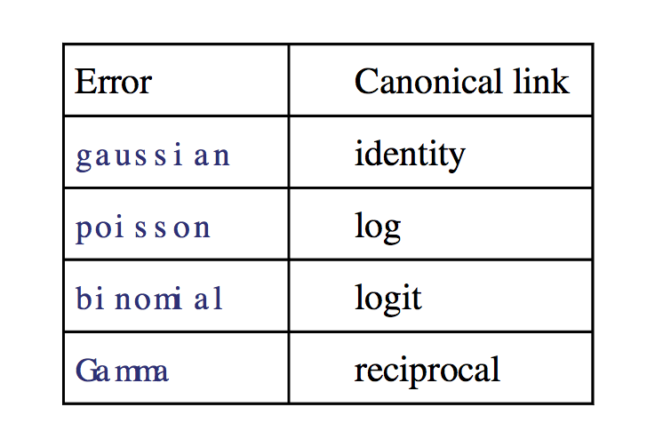

Module 17
================

Generalized Linear Models
=========================

Preliminaries
-------------

-   Install these packages in ***R***: {curl}, {ggplot2}, {broom}, {lmtest}

Objectives
----------

> In this module, we extend our discussion of regression modeling to include generalized linear models.

Generalized Linear Models
-------------------------

So far, our discussion of regression centered on standard or "general" linear models that assume normally distributed response variables, normally distributed error terms (residuals) from our fitted models, and constant variance in our response variable across the range of our predictor variables. If these assumptions of general linear regression are not met, we can sometimes transform our variables to meet them, but other times we cannot (e.g., when we have binary or count data for a response variable).

In these cases, however, we can use a different regression technique called **generalized linear modeling** instead of general linear modeling. Generalized linear models, then, extend traditional regression models to allow the expected value of our response variable to depend on our predictor variable(s) through what is called a **link function**. It allows the response variable to belong to any of a set of distributions belonging to the "exponential" family (e.g., normal, Poisson, binomial), and it does not require errors (residuals) to be normally distributed. It also does not require homogeneity of variance across the range of predictor variable values, and overdispersion (when the observed variance is larger than what the model assumes) may be present.

One of the most important differences is that in generalized linear modeling we no longer use ordinary least squares to estimate parameter values, but rather use maximum likelihood or Bayesian approaches.

A generalized linear model consists of three components:

-   The **systematic or linear component**, which reflects the linear combination of predictor variables in our model. As in general linear regression, these can be be continuous and/or categorical. Interactions between predictors and polynomial functions of predictors can also be included, as in general linear modeling. \[Recall that "linear" simply means the regression model is based on linear combinations of regression coefficients, not of variables.\]

-   The **error structure** or **random component**, which refers to the probability distribution of the response variable and of the residuals in the response variable after the linear component has been removed. The probability distribution in a GLM must be from the exponential family of probability distributions, which includes the *normal* (Gaussian), *binomial* (e.g., if our response variable is binary, like "yes/no", "presence/absence"), *Poisson* (e.g., if our reponse variable consists of count data), *gamma*, *negative binomial*, etc.

-   A **link function**, which links the expected value of the response variable to the predictors. You can think of this as a transformation function. In GLM, our linear component yields a predicted value, but this value is not necessarily the predicted value of our response variable, *Y*, *per se*. Rather, the predicted value is some needs to be transformed back into a predicted *Y* by applying the inverse of the link function.

Common link functions include:

-   The **identity link**, which is used to model ***μ***, the mean value of *Y* and is what we use implicitly in standard linear models.

-   The **log link**, which is typically used to model **log(*λ*)**, the log of the mean value of *Y*.

-   The **logit link**, which is **log(*π*/(1-*π*))**, and is typically used for binary data and logistic regression.



General linear regression can be viewed as a special case of GLM, where the random component of our model has a *normal distribution* and the link function is the *identity link* so that we are modeling an expected value for *Y*.

### Model Fitting in Generalized Linear Models

Model fitting and parameter estimation in GLM is commonly done using a maximum likelhood approach, which is an iterative process. To determine the fit of a given model, a GLM evaluates the linear predictor for each value of the response variable, then back-transforms the predicted value into the scale of the *Y* variable using the inverse of the link function. These predicted values are compared with the observed values of *Y*. The parameters are then adjusted, and the model is refitted on the transformed scale in an iterative procedure until the fit stops improving. In ML approaches, then, the data are taken as a given, and we are trying to find the most likely model to fit those data. We judge the fit of the model of the basis of **how likely the data would be if the model were correct.**

The measure of discrepancy used in a GLM to assess the goodness of fit of the model to the data is called the **deviance**, which we can think of as analogous to the variance in a general linear model. Deviance is defined as **2 times (the log-likelihood of a fully saturated model minus the log-likelihood of the proposed model)**. The former is a model that fits the data perfectly. Its likelihood is 1 and its log-likelihood is thus 0, so deviance functionally can be calculated at \*\*-2\*log-likelihood of the proposed model\*\*. Because the saturated model does not depend on any estimated parameters and has a likelihood of 1, minimizing the deviance for a particular model is the same as maximizing the likelihood. \[For the ML process of parameter estimation, it is actually mathematically easier to maximize the log-likelihood, **ln(L)**, than is is to maximize the likelihood, **L**, so computationally that is what is usually done.\] In logistic regression, the sum of squared "deviance residuals" of all the data points is analogous to the sum of squares of the residuals in a standard linear regression.

The `glm()` function in ***R*** can be used for many types of generalized linear modeling, using similar formula notation to that we've used before, with an additional argument, `family=`, to specify the kind of error structure we expect in the response variable ("gaussian", "binomial", "poisson", etc.): `glm(y ~ x, family = "gaussian")`

As with previous models, our explanatory variable, *X*, can be continuous (leading to a regression analysis) or categorical (leading to an ANOVA-like procedure called an *analysis of deviance*) or both.

We will explore two types of GLMs... **logistic regression** (used when our response variable is binary) and **log-linear or Poisson regression** (used when our response variable is count data).

### Logistic Regression

As alluded to above, when we have a binary response variable (i.e., a categorical variable with two levels, 0 or 1), we actually are interested in modeling *π*<sub>*i*</sub>, which is the probability that *Y* equals 1 for a given value of *X* (*x*<sub>*i*</sub>), rather than *μ*<sub>*i*</sub>, the mean value of *Y* for a given *X*, which is what we typically model with general linear regression. The usual model we fit to such data is the logistic regression model, which is a nonlinear model with a sigmoidal shape. The error from such a model is not normally distributed but rather has a binomial distribution.

When we do our regression, we actually use as our response variable the natural log of the **odds ratio** between our two possible outcomes, i.e., the ratio of the probabilities of *y*<sub>*i*</sub> = 1 versus *y*<sub>*i*</sub> = 0 for a given *x*<sub>*i*</sub>, which we call the *logit*:


where:

-   *π*<sub>*i*</sub> = the probability that *y*<sub>*i*</sub> equals 1 for a given value of *x*<sub>*i*</sub> and (1 − *π*) = the probability that *y*<sub>*i*</sub> equals 0.

The *logit* transformation, then, is the link function connecting *Y* to our predictors. The logit is useful as it converts probabilities, which lie in the range 0 to 1, into the scale of the whole real number line.

We can convert back from a log(odds ratio) to an odds ratio using the inverse of the *logit*, which is called the *expit*:


#### EXAMPLE:

Suppose we are interested in how a students' GRE scores, grade point averages (GPA), and ranking of their undergraduate institution (into quartiles, 1 to 4, from high to low), affect admission into graduate school. The response variable, "admitted/not admitted", is a binary variable, scored as 1/0.

Load in the "graddata.csv" dataset, which comes from `http://www.ats.ucla.edu/`, and then explore it using `head()`, `summary()`, `pairs()`, and `table()`.

``` r
library(curl)
f <- curl("https://raw.githubusercontent.com/difiore/ADA2016/master/graddata.csv")
d <- read.csv(f, header = TRUE, sep = ",")
head(d)
```

    ##   admit gre  gpa rank
    ## 1     0 380 3.61    3
    ## 2     1 660 3.67    3
    ## 3     1 800 4.00    1
    ## 4     1 640 3.19    4
    ## 5     0 520 2.93    4
    ## 6     1 760 3.00    2

``` r
summary(d)
```

    ##      admit             gre             gpa             rank      
    ##  Min.   :0.0000   Min.   :220.0   Min.   :2.260   Min.   :1.000  
    ##  1st Qu.:0.0000   1st Qu.:520.0   1st Qu.:3.130   1st Qu.:2.000  
    ##  Median :0.0000   Median :580.0   Median :3.395   Median :2.000  
    ##  Mean   :0.3175   Mean   :587.7   Mean   :3.390   Mean   :2.485  
    ##  3rd Qu.:1.0000   3rd Qu.:660.0   3rd Qu.:3.670   3rd Qu.:3.000  
    ##  Max.   :1.0000   Max.   :800.0   Max.   :4.000   Max.   :4.000

``` r
# first, some exploratory visualization
par(mfrow = c(1, 2))
plot(as.factor(d$admit), d$gpa, xlab = "Admit", ylab = "GPA", col = "lightgreen")
plot(as.factor(d$admit), d$gre, xlab = "Admit", ylab = "GRE", col = "lightblue")
```


``` r
pairs(d)
```


``` r
table(d$admit, d$rank)
```

    ##    
    ##      1  2  3  4
    ##   0 28 97 93 55
    ##   1 33 54 28 12

To use logistic regression to look at how the odds of admission are influenced by GRE scores, we can call the `glm()` function with a model where *admit* is our response variable and *gre* is our predictor variable.

``` r
# glm of admit~gre
glm <- glm(data = d, admit ~ gre, family = "binomial")
summary(glm)
```

    ## 
    ## Call:
    ## glm(formula = admit ~ gre, family = "binomial", data = d)
    ## 
    ## Deviance Residuals: 
    ##     Min       1Q   Median       3Q      Max  
    ## -1.1623  -0.9052  -0.7547   1.3486   1.9879  
    ## 
    ## Coefficients:
    ##              Estimate Std. Error z value Pr(>|z|)    
    ## (Intercept) -2.901344   0.606038  -4.787 1.69e-06 ***
    ## gre          0.003582   0.000986   3.633  0.00028 ***
    ## ---
    ## Signif. codes:  0 '***' 0.001 '**' 0.01 '*' 0.05 '.' 0.1 ' ' 1
    ## 
    ## (Dispersion parameter for binomial family taken to be 1)
    ## 
    ##     Null deviance: 499.98  on 399  degrees of freedom
    ## Residual deviance: 486.06  on 398  degrees of freedom
    ## AIC: 490.06
    ## 
    ## Number of Fisher Scoring iterations: 4

Here is the equation representing the results of our model: logit(*π*<sub>*i*</sub>) = -2.901344 + 0.003582 \* *g**r**e*

#### Interpretation and Hypothesis Testing in Logistic Regression

When we get a *β*<sub>1</sub> estimate from a logistic regression, it represents the *change in the log(odds ratio) of the outcome* for an increase in one unit of *X*.

Looking at the coefficient for *gre*, we see it is positive and, while low, is significantly different from 0. Thus, increasing GRE score results in an increase in the log(odds ratio) of admission (i.e., students with higher scores are more likely to be admitted). Here, for every one unit change in *gre*, the log odds of admission (versus non-admission) increases by 0.003582.

Using the `predict()` function, we can plot our data and fit the change in the admitted/not admitted ratio across the range of GRE scores.

``` r
x <- seq(from = min(d$gre), to = max(d$gre), length.out = 1000)
logOR <- predict(glm, newdata = data.frame(gre = x))  # this function will predict the log(odds ratio)... but if we add the argument type='response', the predict() function will return the expected response on the scale of the Y variable, i.e., Pr(Y)=1, rather than the odds ratio!
y <- predict(glm, newdata = data.frame(gre = x), type = "response")
plot(d$admit ~ d$gre, pch = 21, type = "p", xlab = "GRE Score", ylab = "Pr(Y)", 
    main = "Pr(Y) versus GRE")
lines(y ~ x, type = "l")
```


By exponentiating *β*<sub>1</sub>, we can get the actual odds ratio change (as opposed to the log(odds ratio) change) associated with a 1 unit change in GRE scores.

``` r
ORchange <- exp(glm$coefficients[2])
ORchange  # a 1 unit increase in gre results in a 0.36% increase in likelihood of admission
```

    ##      gre 
    ## 1.003589

As in simple linear regression, the key *H*<sub>0</sub> of relevance when fitting a simple logistic regression model is that our regression coefficient, *β*s, is zero, i.e. that there is no relationship between the binary response variable and the predictor variable.

There are two common ways to test this *H*<sub>0</sub>. The first is to calculate the **Wald statistic** for the predictor variable and compare this to the standard normal or *z* distribution. This is like a ML-based version of a t test. The Wald statistic is, like the t statistic, our *β* parameter estimate divided by the standard error of that estimate: *β*<sub>1</sub>/(SE of *β*<sub>1</sub>). This is most appropriate when sample sizes are large. The "z value" in the summary table for the model shows us this statistic.

If we wanted to calculate the Wald statistic by hand, we can do so easily. Below, I use the convenient `tidy()` function from the {broom} package to pull out a table of results from our GLM very easily.

``` r
library(broom)
glmresults <- tidy(glm)
wald <- glmresults$estimate[2]/glmresults$std.error[2]
p <- 2 * (1 - pnorm(wald))  # calculation of 2 tailed p value associated with the Wald statistic
p
```

    ## [1] 0.0002800845

We can get the confidence intervals around our estimates using `confint()` with the model results as an argument. There are two common approaches used to derive these confidence intervals, once based on ML and one based on the standard error associated with the parameter estimates.

``` r
CI <- confint(glm, level = 0.95)  # this function returns a CI based on log-likelihood, an iterative ML process
```

    ## Waiting for profiling to be done...

``` r
CI
```

    ##                    2.5 %       97.5 %
    ## (Intercept) -4.119988259 -1.739756286
    ## gre          0.001679963  0.005552748

``` r
CI <- confint.default(glm, level = 0.95)  # this function returns CIs based on standard errors, the way we have calculated them by hand previously... note the slight difference
CI
```

    ##                    2.5 %       97.5 %
    ## (Intercept) -4.089156159 -1.713532380
    ## gre          0.001649677  0.005514746

``` r
CI <- glmresults$estimate[2] + c(-1, 1) * qnorm(0.975) * glmresults$std.error[2]  # and this is how we have calculated CIs by hand previously
CI
```

    ## [1] 0.001649677 0.005514746

#### CHALLENGE:

Repeat the logistic regression above, but using *gpa* rather than *gre* as the predictor variable.

-   Is *gpa* a significant predictor of the odds of admission?

-   What is the estimate of *β*<sub>1</sub> and the 95% CI around that estimate?

-   How much does an increase of 1 unit in *gpa* increase the actual odds ratio (as opposed to the log(odds ratio) for admission?

-   What is the 95% CI around this odds ratio?

> HINT: for both of the latter questions, you will need to apply the `exp()` function and convert the log(odds ratio) to an odds ratio.

-   Graph the probability of admission, *Pr(admit)*, or *π*<sub>*i*</sub>, for students with GPAs between 2.0 and 4.0 GPAs? HINT: Use the `predict()` function with `type="response"` to yield *π*<sub>*i*</sub> directly.

``` r
glm <- glm(data = d, admit ~ gpa, family = "binomial")
summary(glm)
```

    ## 
    ## Call:
    ## glm(formula = admit ~ gpa, family = "binomial", data = d)
    ## 
    ## Deviance Residuals: 
    ##     Min       1Q   Median       3Q      Max  
    ## -1.1131  -0.8874  -0.7566   1.3305   1.9824  
    ## 
    ## Coefficients:
    ##             Estimate Std. Error z value Pr(>|z|)    
    ## (Intercept)  -4.3576     1.0353  -4.209 2.57e-05 ***
    ## gpa           1.0511     0.2989   3.517 0.000437 ***
    ## ---
    ## Signif. codes:  0 '***' 0.001 '**' 0.01 '*' 0.05 '.' 0.1 ' ' 1
    ## 
    ## (Dispersion parameter for binomial family taken to be 1)
    ## 
    ##     Null deviance: 499.98  on 399  degrees of freedom
    ## Residual deviance: 486.97  on 398  degrees of freedom
    ## AIC: 490.97
    ## 
    ## Number of Fisher Scoring iterations: 4

``` r
coeffs <- glm$coefficients
coeffs
```

    ## (Intercept)         gpa 
    ##   -4.357587    1.051109

``` r
CI <- confint(glm, level = 0.95)
```

    ## Waiting for profiling to be done...

``` r
CI
```

    ##                  2.5 %    97.5 %
    ## (Intercept) -6.4334239 -2.367430
    ## gpa          0.4742282  1.647959

``` r
ORchange <- exp(coeffs[2])
ORchange
```

    ##      gpa 
    ## 2.860821

``` r
ORchangeCI <- exp(CI[2, ])
ORchangeCI
```

    ##    2.5 %   97.5 % 
    ## 1.606774 5.196365

Now for some visualization...

``` r
library(ggplot2)
x <- data.frame(gpa = seq(from = 2, to = 4, length.out = 100))
prediction <- cbind(gpa = x, response = predict(glm, newdata = x, type = "response"))
# IMPORTANT: Using type='response' returns predictions on the scale of our Y
# variable, in this case Pr(admit); using the default for type would return
# a prediction on the logit scale, i.e., the log(odds ratio), or
# log(Pr(admit)/(1-Pr(admit)))
head(prediction)
```

    ##        gpa   response
    ## 1 2.000000 0.09488728
    ## 2 2.020202 0.09672673
    ## 3 2.040404 0.09859796
    ## 4 2.060606 0.10050136
    ## 5 2.080808 0.10243733
    ## 6 2.101010 0.10440626

``` r
p <- ggplot(prediction, aes(x = gpa, y = response)) + geom_line() + xlab("GPA") + 
    ylab("Pr(admit)")
p
```


The `predict()` function can also be used to get confidence intervals around our estimate of the log(odds of admission) (if "type" is unspecified or set to "link"), or of the probability of admission (if "type" is set to "response"), by using the argument `se.fit=TRUE`.

``` r
prediction <- cbind(gpa = x, predict(glm, newdata = x, type = "response", se = TRUE))
prediction$LL <- prediction$fit - 1.96 * prediction$se.fit
prediction$UL <- prediction$fit + 1.96 * prediction$se.fit
head(prediction)
```

    ##        gpa        fit     se.fit residual.scale         LL        UL
    ## 1 2.000000 0.09488728 0.03825202              1 0.01991332 0.1698612
    ## 2 2.020202 0.09672673 0.03840310              1 0.02145665 0.1719968
    ## 3 2.040404 0.09859796 0.03854537              1 0.02304904 0.1741469
    ## 4 2.060606 0.10050136 0.03867851              1 0.02469148 0.1763112
    ## 5 2.080808 0.10243733 0.03880223              1 0.02638497 0.1784897
    ## 6 2.101010 0.10440626 0.03891621              1 0.02813049 0.1806820

``` r
p <- ggplot(prediction, aes(x = gpa, y = fit))
p <- p + geom_ribbon(aes(ymin = LL, ymax = UL), alpha = 0.2) + geom_line() + 
    xlab("GPA") + ylab("Pr(admit)")
p <- p + geom_point(data = d, aes(x = gpa, y = admit))
p
```


#### Likelihood Ratio Tests

To evaluate the significance of an **overall model** in a logistic regression, we can compare the fit of a more complex model to that of a nested, reduced model, just as when we discussed model selection approaches for simple linear regression and used partial F tests.

For example, to test the null hypothesis of *β*<sub>1</sub> = 0 for a simple logistic regression model with a single predictor, we would compare the log-likelihood of the full model to that of the reduced, intercept only model. This is called a **likelihood ratio test**. Likelihood ratio tests are similar to partial F-tests in that they compare the full model with a nested, reduced model where the explanatory variables of interest are omitted. Now, however, instead of using a test statistic based on a ratio of variances explained by the two models and interpreting that by comparison to an F distribution, we create a test statistic that is a ratio of the log-likelihoods of the two models. The p values of the tests are calculated using the *χ*<sup>2</sup> distribution with 1 df, but the underlying idea is conceptually the same.

A likelihood ratio test comparing the full and reduced models can be performed using the `anova()` function with the additional argument `test="Chisq"`.

``` r
glm1 <- glm(data = d, admit ~ 1, family = "binomial")
glm2 <- glm(data = d, admit ~ gpa, family = "binomial")
anova(glm1, glm2, test = "Chisq")
```

    ## Analysis of Deviance Table
    ## 
    ## Model 1: admit ~ 1
    ## Model 2: admit ~ gpa
    ##   Resid. Df Resid. Dev Df Deviance Pr(>Chi)    
    ## 1       399     499.98                         
    ## 2       398     486.97  1   13.009  0.00031 ***
    ## ---
    ## Signif. codes:  0 '***' 0.001 '**' 0.01 '*' 0.05 '.' 0.1 ' ' 1

Note that the df for the *χ*<sup>2</sup> test is the **\# of parameters in the proposed model minus \# parameters in the nested model (here, 2-1 = 1)**

With this low p value, we would reject the null hypothesis that removing the variable of interest (*gpa*) from our model does not result in a loss of fit.

Alternatively, we can use the function `lrtest()` from the {lmtest} package.

``` r
library(lmtest)
```

    ## Loading required package: zoo

    ## 
    ## Attaching package: 'zoo'

    ## The following objects are masked from 'package:base':
    ## 
    ##     as.Date, as.Date.numeric

``` r
lrtest(glm1, glm2)
```

    ## Likelihood ratio test
    ## 
    ## Model 1: admit ~ 1
    ## Model 2: admit ~ gpa
    ##   #Df  LogLik Df  Chisq Pr(>Chisq)    
    ## 1   1 -249.99                         
    ## 2   2 -243.48  1 13.009    0.00031 ***
    ## ---
    ## Signif. codes:  0 '***' 0.001 '**' 0.01 '*' 0.05 '.' 0.1 ' ' 1

We can also perform a likelihood ratio test by hand by taking the difference between the *deviances* of the two models. The deviance for a generalized linear model is analogous to the the residual sum of squares for a general linear model (low deviance, low RSS = better model). It is calculated as a kind of "distance" of given model from a fully "saturated" model, i.e., a model where each data point has its own parameters. The likelihood of the saturated model = 1 so its log-likelihood is log(1) = 0.

*Deviance* = 2 × (log-likelihood of the saturated model - log-likelihood of the proposed model)

*Deviance* = 2 × (0 - log-likelihood of the proposed model)

*Deviance* = -2 × (log-likelihood of the proposed model)

We can get the deviance associated with a given model object by accessing its `$deviance` slot or by using the `deviance()` function with the model object as an argument.

``` r
Dglm1 <- glm1$deviance  # intercept only model
Dglm1
```

    ## [1] 499.9765

``` r
Dglm1 <- deviance(glm1)
Dglm1
```

    ## [1] 499.9765

``` r
Dglm2 <- glm2$deviance  # model with intercept and one predictor
Dglm2
```

    ## [1] 486.9676

``` r
Dglm2 <- deviance(glm2)
Dglm2
```

    ## [1] 486.9676

``` r
chisq <- Dglm1 - Dglm2  # this is a measure of how much the fit improves by adding in the predictor
chisq
```

    ## [1] 13.0089

``` r
p <- 1 - pchisq(chisq, df = 1)  # df = difference in number of parameters in the full verus reduced model
p
```

    ## [1] 0.0003100148

The `$null.deviance` slot of a model object returns, for any model, the deviance associated with an intercept only null model.

``` r
x2 <- glm1$null.deviance - glm1$deviance
x2  # why is this 0? because glm1 *is* the intercept only model!
```

    ## [1] -1.136868e-13

``` r
p <- 1 - pchisq(x2, df = 1)
p
```

    ## [1] 1

``` r
x2 <- glm2$null.deviance - glm2$deviance
x2
```

    ## [1] 13.0089

``` r
p <- 1 - pchisq(x2, df = 1)  # df = difference in number of parameters in the full verus reduced model
p
```

    ## [1] 0.0003100148

Here's some additional useful information about intepreting the results of `summary()` from running a logistic regression based on [this post from *StackExchange*](http://stats.stackexchange.com/questions/108995/interpreting-residual-and-null-deviance-in-glm-r) and [this post from *The Analysis Factor*](http://www.theanalysisfactor.com/r-glm-model-fit/)

> Let n = the number of observations in the data set and k = the number of predictor terms in a proposed model.
>
> -   The *Saturated Model* is a model that assumes each data point has its own parameter, which means we have n parameters to describe the data
> -   The *Null Model* is a model that assumes the exact "opposite", i.e., one parameter describes all of the data points, which means only one parameter, the intercept, is estimated from the data
>
> -   The *Proposed Model* is the model we are fitting by GLM, which has k predictor terms (1 for the intercept + 1 for each predictor variable/interaction term)
>
> -   *Null Deviance* = deviance of null model, calculated as 2(log-likelihood of the saturated model - log-likelihood of a null model), where df = n - 1
>
> -   *Residual Deviance* = 2(log-likelihood of the saturated model - log-likelihood of the proposed model), where df = n - k
>
> If the null deviance is really small, it means that the *Null Model* explains the data pretty well. Likewise, if the residual deviance is really small, then the *Residual Deviance* explains the data pretty well.
>
> If you want to compare a *Proposed Model* against a *Null*, intercept only model, then you can look at (Null Deviance - Residual Deviance) for that model, which yields a difference that can be examined against Chi Square distribution with k degrees of freedom.
>
> If you want to compare one Proposed model against a nested (reduced) model, then you can look at (Residual Deviance for the reduced model - Residual Deviance for the Proposed model), which again yields a difference that can be examined against Chi Square distribution with df = k proposed model - k nested model.
>
> This deviance-based, Chi Square like statistic is also referred to as a **G Square** or **G** statistic. If the p value associated with this statistic is less than the alpha level, it means that the the fuller model is associated with significantly reduced deviance relative to the nested (reduced) model and thus has a better fit. We would thus reject the null hypothesis that the fuller model is not better than the reduced one.

### Multiple Logistic Regression

Logistic regression can be easily extended to situations with multiple predictor variables, including both continuous and categorical variables, as in our discussion of multiple regression under the general linear model.

#### CHALLENGE:

Using the same "graddata.csv" dataset, run a multiple logistic regression analysis using *gpa*, *gre*, and *rank* to look at student admissions to graduate school. Do not, at first, include interaction terms.

-   What variables are significant predictors of the log(odds ratio) of admission?

-   What is the value of the log(odds ratio) coefficient and the 95% CIs around that value for the two continuous variable (*gpa* and *gre*), when taking the effects of the other and of rank into account? What do these translate into on the actual odds ratio scale?

-   Is the model including all three predictors better than models that include just two predictors?

-   Compare a model that includes the three predictors with no interactions versus one that includes the three predictors and all possible interactions.

``` r
d$rank <- as.factor(d$rank)  # make sure rank is a categorical variable
glmGGR <- glm(data = d, formula = admit ~ gpa + gre + rank, family = binomial)  # 3 predictor model
summary(glmGGR)
```

    ## 
    ## Call:
    ## glm(formula = admit ~ gpa + gre + rank, family = binomial, data = d)
    ## 
    ## Deviance Residuals: 
    ##     Min       1Q   Median       3Q      Max  
    ## -1.6268  -0.8662  -0.6388   1.1490   2.0790  
    ## 
    ## Coefficients:
    ##              Estimate Std. Error z value Pr(>|z|)    
    ## (Intercept) -3.989979   1.139951  -3.500 0.000465 ***
    ## gpa          0.804038   0.331819   2.423 0.015388 *  
    ## gre          0.002264   0.001094   2.070 0.038465 *  
    ## rank2       -0.675443   0.316490  -2.134 0.032829 *  
    ## rank3       -1.340204   0.345306  -3.881 0.000104 ***
    ## rank4       -1.551464   0.417832  -3.713 0.000205 ***
    ## ---
    ## Signif. codes:  0 '***' 0.001 '**' 0.01 '*' 0.05 '.' 0.1 ' ' 1
    ## 
    ## (Dispersion parameter for binomial family taken to be 1)
    ## 
    ##     Null deviance: 499.98  on 399  degrees of freedom
    ## Residual deviance: 458.52  on 394  degrees of freedom
    ## AIC: 470.52
    ## 
    ## Number of Fisher Scoring iterations: 4

``` r
coeff <- glmGGR$coefficients  # extract coefficients... all significantly different from 0
coeffCI <- cbind(coeff, confint(glmGGR))  # and 95% CIs around them... none include 0
```

    ## Waiting for profiling to be done...

``` r
coeffCI
```

    ##                    coeff         2.5 %       97.5 %
    ## (Intercept) -3.989979073 -6.2716202334 -1.792547080
    ## gpa          0.804037549  0.1602959439  1.464142727
    ## gre          0.002264426  0.0001375921  0.004435874
    ## rank2       -0.675442928 -1.3008888002 -0.056745722
    ## rank3       -1.340203916 -2.0276713127 -0.670372346
    ## rank4       -1.551463677 -2.4000265384 -0.753542605

``` r
ORcoeff <- exp(coeff)
ORcoeff
```

    ## (Intercept)         gpa         gre       rank2       rank3       rank4 
    ##   0.0185001   2.2345448   1.0022670   0.5089310   0.2617923   0.2119375

``` r
ORcoeffCI <- exp(coeffCI)
ORcoeffCI
```

    ##                 coeff       2.5 %    97.5 %
    ## (Intercept) 0.0185001 0.001889165 0.1665354
    ## gpa         2.2345448 1.173858216 4.3238349
    ## gre         1.0022670 1.000137602 1.0044457
    ## rank2       0.5089310 0.272289674 0.9448343
    ## rank3       0.2617923 0.131641717 0.5115181
    ## rank4       0.2119375 0.090715546 0.4706961

``` r
# Compare 2 verus 3 factor models
glmGG <- glm(data = d, formula = admit ~ gpa + gre, family = binomial)
glmGR <- glm(data = d, formula = admit ~ gpa + rank, family = binomial)
glmRG <- glm(data = d, formula = admit ~ gre + rank, family = binomial)
anova(glmGG, glmGGR, test = "Chisq")
```

    ## Analysis of Deviance Table
    ## 
    ## Model 1: admit ~ gpa + gre
    ## Model 2: admit ~ gpa + gre + rank
    ##   Resid. Df Resid. Dev Df Deviance  Pr(>Chi)    
    ## 1       397     480.34                          
    ## 2       394     458.52  3   21.826 7.088e-05 ***
    ## ---
    ## Signif. codes:  0 '***' 0.001 '**' 0.01 '*' 0.05 '.' 0.1 ' ' 1

``` r
anova(glmGR, glmGGR, test = "Chisq")
```

    ## Analysis of Deviance Table
    ## 
    ## Model 1: admit ~ gpa + rank
    ## Model 2: admit ~ gpa + gre + rank
    ##   Resid. Df Resid. Dev Df Deviance Pr(>Chi)  
    ## 1       395     462.88                       
    ## 2       394     458.52  1   4.3578  0.03684 *
    ## ---
    ## Signif. codes:  0 '***' 0.001 '**' 0.01 '*' 0.05 '.' 0.1 ' ' 1

``` r
anova(glmRG, glmGGR, test = "Chisq")
```

    ## Analysis of Deviance Table
    ## 
    ## Model 1: admit ~ gre + rank
    ## Model 2: admit ~ gpa + gre + rank
    ##   Resid. Df Resid. Dev Df Deviance Pr(>Chi)  
    ## 1       395     464.53                       
    ## 2       394     458.52  1   6.0143  0.01419 *
    ## ---
    ## Signif. codes:  0 '***' 0.001 '**' 0.01 '*' 0.05 '.' 0.1 ' ' 1

``` r
# Compare model with and model without interactions
glmNO <- glm(data = d, admit ~ rank + gpa + gre, family = "binomial")
glmALL <- glm(data = d, admit ~ rank * gpa * gre, family = "binomial")
anova(glmNO, glmALL, test = "Chisq")  # adding interaction terms to model doesn't significantly decrease deviance
```

    ## Analysis of Deviance Table
    ## 
    ## Model 1: admit ~ rank + gpa + gre
    ## Model 2: admit ~ rank * gpa * gre
    ##   Resid. Df Resid. Dev Df Deviance Pr(>Chi)
    ## 1       394     458.52                     
    ## 2       384     450.39 10   8.1317    0.616

### Log-Linear or Poisson Regression

Sometimes, we want to model a response variable that is in the form of count data (e.g., species richness on an island in terms of distance from the mainland, number of plants of a particular species found in a sampling plot in relation to altitude). Many discrete response variables have counts as possible outcomes. Binomial counts are the number of successes *x* in a fixed number of trials, *n*. Poisson counts are the number occurrences of some event in a certain interval of time (or space). While binomial counts only take values between 0 and n, Poisson counts have no upper bound. We are going to focus on Poisson counts here.

As we have discussed before, for Poisson distributed variables, the mean and the variance are equal and represented by a single parameter (*λ*), and therefore linear models based on normal distributions may not be appropriate. We have seen that sometimes we can simply transform a response variable with some kind of power transformation to make it appear more normally distributed, but an alternative is to use a GLM with a Poisson error term and use a *log* transformation as the link function, resulting in in a **log-linear** model. Thus, when we do Poisson regression, our regression model tries to predict the natural log of the expected value of *Y*, i.e., *λ*<sub>*i*</sub>.

The link function is thus:


The inverse link function is, then:


Our regression formulation is the same as in logistic regression, above, except we use `family="Poisson"`, e.g, `glm(y ~ x, family = "poisson")`

#### EXAMPLE:

Researchers studied the reproductive success of a set of male woolly monkeys over a period of 8 years. The age of each monkey at the beginning of the study and the number of successful matings they had during the 8 years were recorded, and they were also scored into ranks of "high", "medium", and "low". We assume the number of matings follows a Poisson distribution, and we are interested in exploring whether mating success depends on the age of the monkey in question.

``` r
library(curl)
f <- curl("https://raw.githubusercontent.com/difiore/ADA2016/master/woollydata.csv")
d <- read.csv(f, header = TRUE, sep = ",")
head(d)
```

    ##      name success   age   rank
    ## 1   Aaron      15  9.80 medium
    ## 2    Adam      14 12.06 medium
    ## 3 Agustin      22 16.33   high
    ## 4    Alan       9  8.79    low
    ## 5  Andrew      12  6.81    low
    ## 6 Anthony      11 14.84    low

``` r
summary(d)
```

    ##       name       success           age             rank   
    ##  James  : 2   Min.   : 5.00   Min.   : 5.740   high  :24  
    ##  Aaron  : 1   1st Qu.: 9.00   1st Qu.: 9.555   low   :24  
    ##  Adam   : 1   Median :12.00   Median :10.765   medium:12  
    ##  Agustin: 1   Mean   :12.12   Mean   :10.884              
    ##  Alan   : 1   3rd Qu.:14.00   3rd Qu.:12.285              
    ##  Andrew : 1   Max.   :24.00   Max.   :16.330              
    ##  (Other):53

``` r
# first, some exploratory visualization
par(mfrow = c(1, 1))
p <- ggplot(data = d, aes(x = age, y = success)) + geom_point() + xlab("Age") + 
    ylab("Mating Success")
p
```


``` r
pairs(d)
```


``` r
table(d$rank, d$success)
```

    ##         
    ##          5 6 7 8 9 10 11 12 13 14 15 16 17 19 20 21 22 24
    ##   high   1 1 1 1 3  1  2  3  2  2  2  1  1  1  0  0  1  1
    ##   low    0 1 1 4 4  2  2  5  2  1  1  0  1  0  0  0  0  0
    ##   medium 0 0 0 0 1  1  2  1  1  2  1  0  0  1  1  1  0  0

``` r
# glm of success~age
glm <- glm(data = d, success ~ age, family = "poisson")
summary(glm)
```

    ## 
    ## Call:
    ## glm(formula = success ~ age, family = "poisson", data = d)
    ## 
    ## Deviance Residuals: 
    ##     Min       1Q   Median       3Q      Max  
    ## -2.2033  -0.8930  -0.1190   0.6368   2.7388  
    ## 
    ## Coefficients:
    ##             Estimate Std. Error z value Pr(>|z|)    
    ## (Intercept)  1.84007    0.17696  10.398  < 2e-16 ***
    ## age          0.05920    0.01541   3.841 0.000122 ***
    ## ---
    ## Signif. codes:  0 '***' 0.001 '**' 0.01 '*' 0.05 '.' 0.1 ' ' 1
    ## 
    ## (Dispersion parameter for poisson family taken to be 1)
    ## 
    ##     Null deviance: 75.972  on 59  degrees of freedom
    ## Residual deviance: 61.179  on 58  degrees of freedom
    ## AIC: 322.88
    ## 
    ## Number of Fisher Scoring iterations: 4

``` r
coeffs <- glm$coefficients
coeffs
```

    ## (Intercept)         age 
    ##  1.84007390  0.05919652

``` r
CIs <- confint(glm, level = 0.95)  # uses ML approaches
```

    ## Waiting for profiling to be done...

``` r
CIs
```

    ##                  2.5 %     97.5 %
    ## (Intercept) 1.49039282 2.18410597
    ## age         0.02901531 0.08942537

``` r
CIs <- confint(glm, level = 0.95)  # uses standard errors
```

    ## Waiting for profiling to be done...

``` r
CIs
```

    ##                  2.5 %     97.5 %
    ## (Intercept) 1.49039282 2.18410597
    ## age         0.02901531 0.08942537

In the `summary()`, note that the residual deviance is slighly higher than the residual degrees of freedom, which suggests that our data are slightly overdispersed (i.e., there is some extra, unexplained variation in the response, where the variance is greater than the mean). If this were dramatic, we might use "quasipoisson" for the family instead, but we will stick with "poisson".

Now, let's fit a "line" of best fit through our data, along with 95% CI around this "line". We want to plot the relationship between success (rather than log success) and age, so this relationship will not actually be linear but log-linear.

``` r
x <- data.frame(age = seq(from = 5, to = 17, length.out = 30))
prediction <- cbind(age = x, predict(glm, newdata = x, type = "response", se = TRUE))
# IMPORTANT: Using the argument type='response' makes our prediction be
# units of our actual Y variable (success) rather than log(success)
prediction$LL <- prediction$fit - 1.96 * prediction$se.fit
prediction$UL <- prediction$fit + 1.96 * prediction$se.fit
head(prediction)
```

    ##        age      fit    se.fit residual.scale       LL       UL
    ## 1 5.000000 8.465986 0.8711054              1 6.758619 10.17335
    ## 2 5.413793 8.675922 0.8413401              1 7.026895 10.32495
    ## 3 5.827586 8.891064 0.8101102              1 7.303248 10.47888
    ## 4 6.241379 9.111541 0.7774904              1 7.587660 10.63542
    ## 5 6.655172 9.337485 0.7435987              1 7.880031 10.79494
    ## 6 7.068966 9.569032 0.7086127              1 8.180151 10.95791

``` r
p <- p + geom_line(data = prediction, aes(x = age, y = fit)) + geom_ribbon(data = prediction, 
    aes(x = age, y = fit, ymin = LL, ymax = UL), alpha = 0.2) + xlab("Age") + 
    ylab("Mating Success")
p  # note the curvilinear 'line' of best fit
```


Is this model better than an intercept-only model? YES! We can see this by doing a likelihood ratio test.

``` r
glm1 <- glm(data = d, success ~ 1, family = "poisson")
glm2 <- glm(data = d, success ~ age, family = "poisson")
# using the anova function
anova(glm1, glm2, test = "Chisq")
```

    ## Analysis of Deviance Table
    ## 
    ## Model 1: success ~ 1
    ## Model 2: success ~ age
    ##   Resid. Df Resid. Dev Df Deviance  Pr(>Chi)    
    ## 1        59     75.972                          
    ## 2        58     61.179  1   14.794 0.0001199 ***
    ## ---
    ## Signif. codes:  0 '***' 0.001 '**' 0.01 '*' 0.05 '.' 0.1 ' ' 1

``` r
# based on the deviance between a specified null and full models
x2 <- glm1$deviance - glm2$deviance
x2
```

    ## [1] 14.79362

``` r
p <- 1 - pchisq(x2, df = 1)
p
```

    ## [1] 0.0001199407

``` r
# based on hand calculating deviance for each model; logLik() function
# returns the log-likelihood of a model
Dglm1 = -2 * logLik(glm1)
Dglm1
```

    ## 'log Lik.' 333.6736 (df=1)

``` r
Dglm2 = -2 * logLik(glm2)
Dglm2
```

    ## 'log Lik.' 318.8799 (df=2)

``` r
x2 <- as.numeric(Dglm1 - Dglm2)
x2
```

    ## [1] 14.79362

``` r
p <- 1 - pchisq(x2, df = 1)  # df = difference in number of parameters in the full verus reduced model
p
```

    ## [1] 0.0001199407

The Akaike Information Criterion, or AIC, is another way of evaluating and comparing related models. For similar models, those with lower AIC models are preferred over those with higher AIC. The AIC value is based on the deviance associated with the model, but it penalizes model complexity. Much like an adjusted R-squared, it’s intent is to prevent you from including irrelevant predictors when choosing among similar models. Models with low AICs represent a better fit to the data, and if many models have similarly low AICs, you should choose the one with the fewest model terms. For both continuous and categorical predictors, we prefer comparing full and reduced models against one another to test individual terms rather than comparing the fit of all possible models to try and select the “best” one. Thus, AIC values are useful for comparing models, but they are not interpretable on their own. The `logLik()` function returns the log-likelihood associated with a particular model and can be used to calculate AIC values by hand.

``` r
AIC <- 2 * 2 - 2 * logLik(glm2)  # formula for AIC = 2 * # params estimated - 2 * log-likelihood of model; for thise model we estimated 2 params
AIC
```

    ## 'log Lik.' 322.8799 (df=2)

``` r
AICreduced <- 2 * 1 - 2 * logLik(glm1)  # for this model, 1 param is estimated
AICreduced
```

    ## 'log Lik.' 335.6736 (df=1)

Here, the log-likelihood of the model including *age* as a predictor is much lower than the log-likelihood of the reduced (intercept only) model, so we prefer the former.

#### CHALLENGE:

Using the woolly monkey mating success data set, explore multiple Poisson regression models of \[a\] mating success in relation to *rank* and \[b\] mating success in relation to *age* + *rank* (and their interaction) on your own. What conclusions can you come to about the importance of rank and rank in combination with age versus age alone?

``` r
# glm of success~age
glm1 <- glm(data = d, success ~ rank, family = "poisson")
summary(glm1)
```

    ## 
    ## Call:
    ## glm(formula = success ~ rank, family = "poisson", data = d)
    ## 
    ## Deviance Residuals: 
    ##     Min       1Q   Median       3Q      Max  
    ## -2.4470  -0.8424  -0.1774   0.4721   2.8432  
    ## 
    ## Coefficients:
    ##             Estimate Std. Error z value Pr(>|z|)    
    ## (Intercept)  2.53568    0.05745  44.138   <2e-16 ***
    ## ranklow     -0.17247    0.08498  -2.029   0.0424 *  
    ## rankmedium   0.10931    0.09601   1.139   0.2549    
    ## ---
    ## Signif. codes:  0 '***' 0.001 '**' 0.01 '*' 0.05 '.' 0.1 ' ' 1
    ## 
    ## (Dispersion parameter for poisson family taken to be 1)
    ## 
    ##     Null deviance: 75.972  on 59  degrees of freedom
    ## Residual deviance: 67.229  on 57  degrees of freedom
    ## AIC: 330.93
    ## 
    ## Number of Fisher Scoring iterations: 4

``` r
coeffs <- glm1$coefficients
coeffs
```

    ## (Intercept)     ranklow  rankmedium 
    ##   2.5356790  -0.1724693   0.1093131

``` r
CIs <- confint(glm1, level = 0.95)
```

    ## Waiting for profiling to be done...

``` r
CIs
```

    ##                   2.5 %       97.5 %
    ## (Intercept)  2.42092563  2.646198893
    ## ranklow     -0.33952605 -0.006209755
    ## rankmedium  -0.08068136  0.295948462

``` r
# glm of success~age+rank
glm2 <- glm(data = d, success ~ age + rank, family = "poisson")
summary(glm2)
```

    ## 
    ## Call:
    ## glm(formula = success ~ age + rank, family = "poisson", data = d)
    ## 
    ## Deviance Residuals: 
    ##     Min       1Q   Median       3Q      Max  
    ## -2.3631  -0.7242  -0.1271   0.6126   2.5314  
    ## 
    ## Coefficients:
    ##             Estimate Std. Error z value Pr(>|z|)    
    ## (Intercept)  1.89985    0.18016  10.546  < 2e-16 ***
    ## age          0.05848    0.01547   3.780 0.000157 ***
    ## ranklow     -0.18419    0.08504  -2.166 0.030324 *  
    ## rankmedium   0.07981    0.09633   0.829 0.407344    
    ## ---
    ## Signif. codes:  0 '***' 0.001 '**' 0.01 '*' 0.05 '.' 0.1 ' ' 1
    ## 
    ## (Dispersion parameter for poisson family taken to be 1)
    ## 
    ##     Null deviance: 75.972  on 59  degrees of freedom
    ## Residual deviance: 52.905  on 56  degrees of freedom
    ## AIC: 318.61
    ## 
    ## Number of Fisher Scoring iterations: 4

``` r
coeffs <- glm2$coefficients
coeffs
```

    ## (Intercept)         age     ranklow  rankmedium 
    ##  1.89985210  0.05848079 -0.18418827  0.07981313

``` r
CIs <- confint(glm2, level = 0.95)
```

    ## Waiting for profiling to be done...

``` r
CIs
```

    ##                  2.5 %      97.5 %
    ## (Intercept)  1.5439316  2.25019524
    ## age          0.0281809  0.08882429
    ## ranklow     -0.3513638 -0.01780910
    ## rankmedium  -0.1107918  0.26708124

``` r
# glm of success~age+rank+age:rank
glm3 <- glm(data = d, success ~ age * rank, family = "poisson")
summary(glm3)
```

    ## 
    ## Call:
    ## glm(formula = success ~ age * rank, family = "poisson", data = d)
    ## 
    ## Deviance Residuals: 
    ##      Min        1Q    Median        3Q       Max  
    ## -2.32160  -0.74018  -0.05743   0.61891   2.44260  
    ## 
    ## Coefficients:
    ##                Estimate Std. Error z value Pr(>|z|)    
    ## (Intercept)     1.68099    0.27350   6.146 7.93e-10 ***
    ## age             0.07821    0.02398   3.261  0.00111 ** 
    ## ranklow         0.35253    0.39958   0.882  0.37763    
    ## rankmedium      0.19221    0.47173   0.407  0.68368    
    ## age:ranklow    -0.04820    0.03514  -1.372  0.17009    
    ## age:rankmedium -0.01052    0.04037  -0.261  0.79432    
    ## ---
    ## Signif. codes:  0 '***' 0.001 '**' 0.01 '*' 0.05 '.' 0.1 ' ' 1
    ## 
    ## (Dispersion parameter for poisson family taken to be 1)
    ## 
    ##     Null deviance: 75.972  on 59  degrees of freedom
    ## Residual deviance: 50.925  on 54  degrees of freedom
    ## AIC: 320.63
    ## 
    ## Number of Fisher Scoring iterations: 4

``` r
coeffs <- glm3$coefficients
coeffs
```

    ##    (Intercept)            age        ranklow     rankmedium    age:ranklow 
    ##     1.68098680     0.07820855     0.35253499     0.19220655    -0.04820457 
    ## age:rankmedium 
    ##    -0.01052473

``` r
CIs <- confint(glm3, level = 0.95)
```

    ## Waiting for profiling to be done...

``` r
CIs
```

    ##                      2.5 %     97.5 %
    ## (Intercept)     1.14024776 2.21228299
    ## age             0.03107609 0.12507067
    ## ranklow        -0.43334404 1.13330517
    ## rankmedium     -0.74201052 1.10847589
    ## age:ranklow    -0.11693019 0.02081384
    ## age:rankmedium -0.08936412 0.06896883
