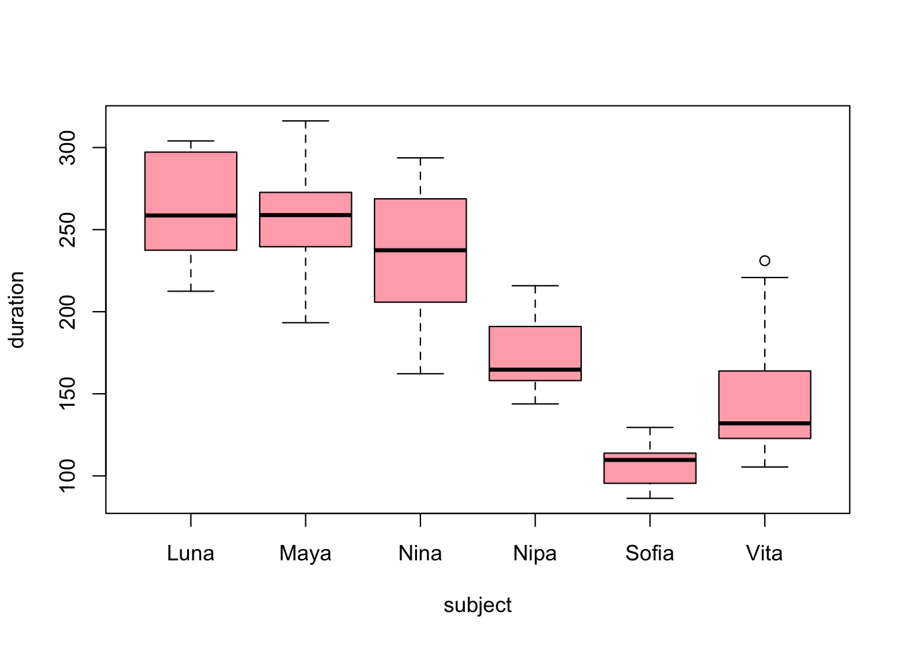
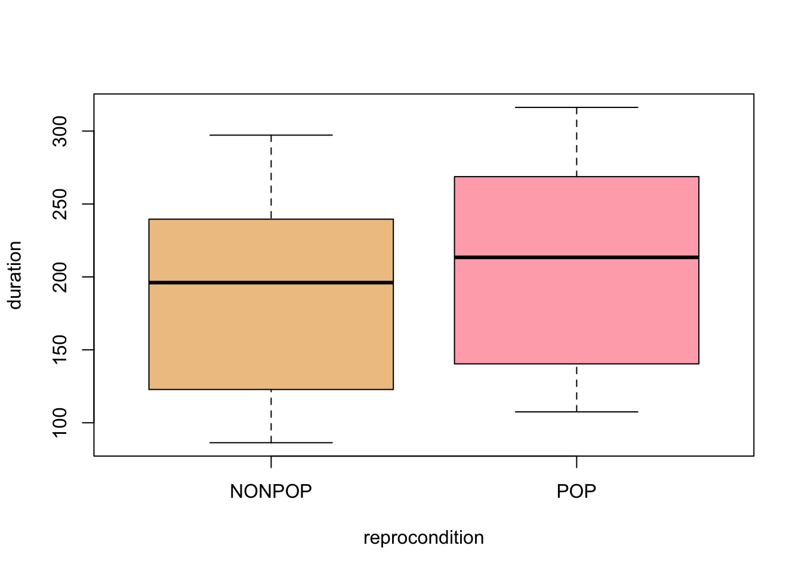
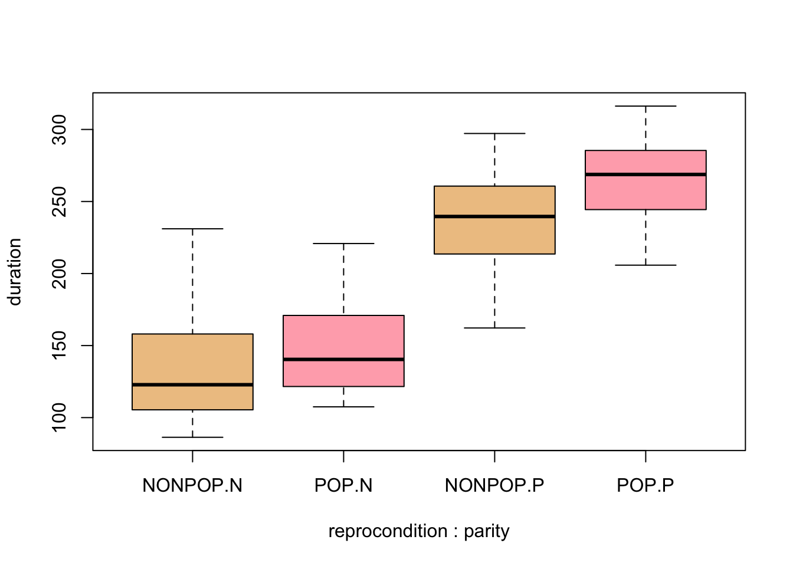
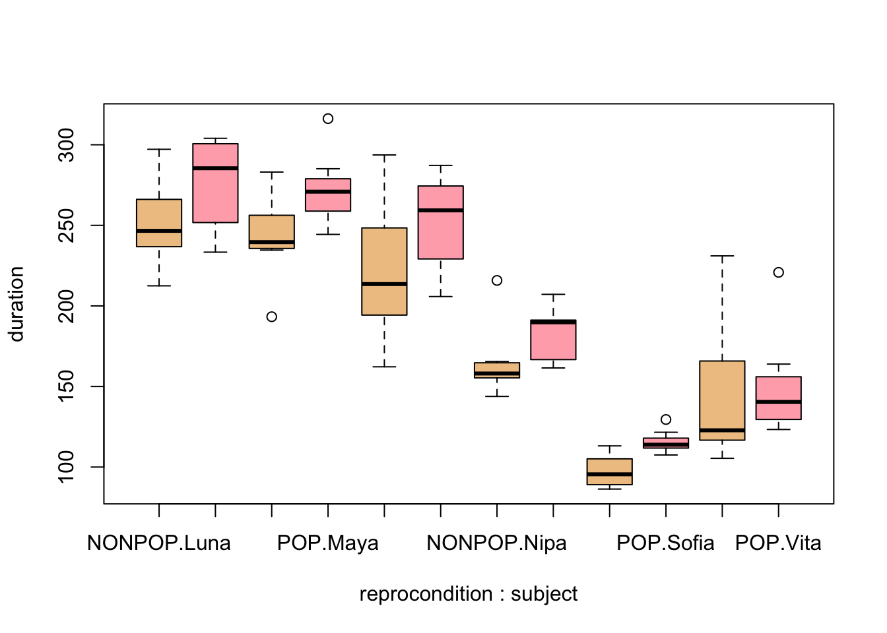

Module 18
================

Mixed Effects Modeling
======================

Preliminaries
-------------

-   Install these packages in ***R***: {curl}, {ggplot2}, {lme4}

Objectives
----------

> In this module, we extend our discussion of regression modeling even further to include mixed effects models.

Mixed Effects Models
--------------------

A final extension of linear regression modeling that we will talk about is so-called "multilevel" or "mixed effects" modeling. This is a very complex topic, and we will only scratch the surface! There are many varieties of mixed models.

-   **Linear mixed models (LMM)**, if we're dealing with normally distributed variables and error structures
-   **Generalized linear mixed models (GLMM)**, if we're dealing with various other variable types and error structure (e.g., binary, proportion, or count data)
-   **Nonlinear mixed models (NLMM)**, if we're dealing with situations where our response variable is best modeled by a nonliner combination of predictors

> NOTE: We have not talked in this course about general or generalized NONLINEAR modeling, but it's worth knowing that such approaches are also possible. NONLINEAR modeling is where our regression equation is a nonlinear function of the model parameters.

In a (general or generalized) linear mixed model, we have a reponse variable, *Y*, and observations that fall into different factor categories each with some set of levels (e.g., "sex" with levels "male" and "female"), and we are interested in the effects of these factors and factor levels on the response variable. Generically, if *μ* = a population mean response and *μ*<sub>*A*</sub> = mean response for observations belonging to factor level A, then the effect of A is given by *μ* - *μ*<sub>*A*</sub>. We have already dealt with factors and factor levels in our linear regression models when we looked at categorical predictors (e.g., *sex*, *rank category*) in our discussions of ANOVA and ANCOVA.

We can conceptualize factor effects as being either **fixed** or **random**. **Fixed** factors are those that reflect all levels of interest in our study, while **random** effects are those that represent only a sample of the levels of interest. For example, if we include *sex* as a factor in a model with the factor levels "male" and "female", this (typically) will cover the gamut of levels of interest our study, thus we would consider *sex* a fixed factor. When we were doing ANOVA and ANCOVA analyses previously, we were looking at the effects of such fixed factors.

However, if our observational data were to consist of repeated observations of the same sampling unit, e.g., measurements taken on the same set of individuals at on different dates, *individual ID* would be considered a random factor because it is unlikely that we will have collected data from all possible "levels of interest", i.e., from all possible individual subjects. We have not yet dealt with such random factors as an additional source of variance in our modeling.

**Mixed models** are those that include BOTH fixed and random effects. Including random effects in addition to fixed effects in our models has several ramifications:

-   Using random effects broadens the scope of inference. That is, we can use statistical methods to infer something about the population from which the levels of the random factor have been drawn.

-   Using random effects naturally incorporates dependence in the model and helps us account for pseudoreplication in our dataset. Observations that share the same level of the random effects are explicitly modeled as being correlated. This makes mixed effect modeling very useful for dealing with time series data, spatially correlated data, or situations where we have repeated observations/measures from the same subjects or sampling unit.

-   Using random factors often gives more accurate parameter estimates.

-   Incorporating random factors, however, does require the use of more sophisticated estimation and fitting methods.

We will explore mixed effects modeling using an example based on this [excellent tutorial](http://www.bodowinter.com/tutorial/bw_LME_tutorial2.pdf).

#### EXAMPLE:

Suppose we have measured the amount of grooming received by female chimpanzees when they are either in their periovulatory period (i.e., the window of 2-3 days around the likely time of ovulation) or duing other portions of their reproductive cycle. We collected data on the *duration of grooming bouts received* and scored the female's *reproductive condition* at the time as a categorical factor with two levels: "POP" versus "NONPOP". On top of that, we also recorded data on female parity at the time of the grooming bout, i.e., whether the female had given birth previously (was "parous", or "P") or had not yet had an offspring (was "nulliparous", or "N").

If we're interested in how reproductive condition and parity influence how much grooming a female receives, our regression model would look like this:

*grooming duration* ~ *condition* + *parity* + *ϵ*

Also imagine that our study design was such that we took multiple observations per subject. That is, our data set includes records of multiple grooming bouts received by each subject. This situation violates the assumption of independence of observations that we make for standard linear regression: multiple responses/measures from the same subject cannot be regarded as independent from each other.

Using a mixed effects model, we can deal with this situation by adding **subject ID** as a random effect in our model. Doing so allows us to address the nonindependence issue by estimating a different set of parameters for each level of the factor subject. We can either estimate a different *intercept* for each subject (which would correspond to each female having a different "baseline" level of grooming received) or estimate a different *intercept* **and** *slope* (where individual subjects are presumeed to differ both in the baseline level of grooming received and the strength of the relationship between grooming duration, on the one hand, and reproductive condition and parity, on the other). Our mixed effects model estimates these individual level parameters in addition to the main effects of each variable.

This is why a mixed effects model is called a **mixed** model. The models that we have considered so far have been “fixed effects only” models and included only one or more "fixed" predictor variables and a general error term. We essentially divided the world into things that we somehow understand or that are systematic (the fixed effects, or the explanatory variables) and things that we could not control for or do not understand (*ϵ*). These fixed effects models did not examine possible structure *within* the error term. In a mixed model, by contrast, we add one or more random effects to our fixed effects that may explain a portion of the variance in our error term.

#### CHALLENGE:

Let's explore these idea using some actual data. First, load in the dataset "chimpgrooming.csv" and do some exploratory data analysis:

``` r
library(curl)
f <- curl("https://raw.githubusercontent.com/difiore/ADA2016/master/chimpgrooming.csv")
d <- read.csv(f, header = TRUE, sep = ",")
head(d)
```

    ##   subject parity season reprocondition duration
    ## 1    Nina      P     WS         NONPOP   213.56
    ## 2    Nina      P     WS            POP   205.81
    ## 3    Nina      P     WS         NONPOP   293.71
    ## 4    Nina      P     WS            POP   268.76
    ## 5    Nina      P     WS         NONPOP   205.02
    ## 6    Nina      P     WS            POP   287.19

``` r
summary(d)
```

    ##   subject   parity season  reprocondition    duration     
    ##  Luna :14   N:42   DS:48   NONPOP:42      Min.   : 86.34  
    ##  Maya :14   P:42   WS:36   POP   :42      1st Qu.:132.36  
    ##  Nina :14                                 Median :205.41  
    ##  Nipa :14                                 Mean   :197.81  
    ##  Sofia:14                                 3rd Qu.:252.27  
    ##  Vita :14                                 Max.   :316.23

``` r
# first, some exploratory visualization let's plot grooming received
# duration in relation to subject ID
par(mfrow = c(1, 1))
boxplot(data = d, duration ~ subject, col = c("lightgreen"))
```



``` r
# we see lots of individual variation let's plot grooming received duration
# in relation to reproductive condition
boxplot(data = d, duration ~ reprocondition, col = c("lightgreen", "lightblue"))
```



``` r
# let's plot grooming received duration in relation to reproductive
# condition and parity
boxplot(data = d, duration ~ reprocondition * parity, col = c("lightgreen", 
    "lightblue"))
```



``` r
boxplot(data = d, duration ~ reprocondition * subject, col = c("lightgreen", 
    "lightblue"))
```

 What patterns do you see?

#### Random Intercept Models

We will now perform an initial mixed effects analysis where we look at how reproductive condition and parity (as fixed effect) effect grooming duration, where we include individual subject ID as a random effect.

Here is a first mixed effects model that we will fit, using one extension of formula notation that is commonly used in ***R***.

*grooming duration* ~ *condition* + *parity* + (1|*subject*) + *ϵ*

Here, the 1 refers to the fact that we want to estimate an intercept and the pipe "|" operator following the "1" signifies that we want to estimate a different intercept for each subject. Note that this generic formula still contains a general error term, *ϵ*, to highlight that there will still be unexplained "error" variance after accounting for both fixed and random effects in the model.

We can think of this formula as saying that we expect our dataset to include multiple observations of the response variable per subject, and these responses will depend, in part, on each subject’s baseline level. This effectively accounts the nonindependence that stems from having multiple responses by the same subject.

The {lme4} package in **R** is commonly used for mixed effects modeling, and the function `lmer()` is the mixed model equivalent of the function `lm()`. In the formula syntax for mixed effects models using the {lme4} package, fixed effect are included without parentheses while random effects are included in parentheses (the error, *ϵ*, is understood and is not included explicitly).

> NOTE: We could also use the package {nlme} for mixed effects modeling (which requires a slightly different formula syntax that that used here. That same package also allows us to do nonlinear mixed effects modeling, which we will not be talking about. It is important to note that {lme4} uses, by default, a slightly different parameter estimation algorithm than {nlme}. Unless otherwise specified, {lme4} uses "restricted maximum likelihood" (REML) rather than ordinary maximum likelihood estimation, which is what is used in {nlme}. In practice, these give very similar results. We will see below that when we want to compare different model using {lme4}, we will need to tell {lme4} to use ordinary maximum likelihood.

The code block below implements this first mixed effects model.

``` r
library(lme4)
```

    ## Loading required package: Matrix

``` r
lme <- lmer(data = d, duration ~ reprocondition + parity + (1 | subject))
summary(lme)
```

    ## Linear mixed model fit by REML ['lmerMod']
    ## Formula: duration ~ reprocondition + parity + (1 | subject)
    ##    Data: d
    ## 
    ## REML criterion at convergence: 796.1
    ## 
    ## Scaled residuals: 
    ##     Min      1Q  Median      3Q     Max 
    ## -2.2611 -0.5349 -0.1890  0.3918  3.1994 
    ## 
    ## Random effects:
    ##  Groups   Name        Variance Std.Dev.
    ##  subject  (Intercept) 611.9    24.74   
    ##  Residual             847.3    29.11   
    ## Number of obs: 84, groups:  subject, 6
    ## 
    ## Fixed effects:
    ##                   Estimate Std. Error t value
    ## (Intercept)        132.841     15.305   8.680
    ## reproconditionPOP   20.293      6.352   3.195
    ## parityP            109.650     21.173   5.179
    ## 
    ## Correlation of Fixed Effects:
    ##             (Intr) rprPOP
    ## rprcndtnPOP -0.208       
    ## parityP     -0.692  0.000

Let’s focus on the output for the random effects first. Have a look at the column standard deviation. The entry for *subject* shows us how much variability in grooming duration (apart from that explained by the fixed effects) is due to subject ID. The entry for *Residual* summarizes the remaining variability in grooming duration that is not due to *subject* or to our fixed effects. This is our *ϵ*, the “random” deviations from the predicted values that are not due to either subject or our fixed effects.

The fixed effects output mirrors the coefficient tables that we have seen previously in our linear models that have focused only on fixed effects. The coefficient “reproconditionPOP” is the *β* coefficient (slope) for the categorical effect of reproductive condition. The positive for the coefficient means that grooming duration is GREATER by 20.293 units for POP than for NONPOP females. Then, there’s a standard error associated with this slope, and a t value, which is simply the estimate divided by the standard error.

The coefficient “parityP” is the *β* coefficient for the categorical effect of parity. The grooming duration associated with being parous versus nulliparous is GREATER by 109.65 units.

The INTERCEPT in this case is the grooming duration associated with nulliparous, NONPOP females. Like the `lm()` function, the `lmer()` took whatever factor level came first in the alphabet to be the reference level for each fixed effect variable.

Let's also look at the coefficients coming out of the model.

``` r
coefficients(lme)
```

    ## $subject
    ##       (Intercept) reproconditionPOP parityP
    ## Luna    142.76558          20.29286  109.65
    ## Maya    137.37902          20.29286  109.65
    ## Nina    118.37755          20.29286  109.65
    ## Nipa    160.80050          20.29286  109.65
    ## Sofia    99.80117          20.29286  109.65
    ## Vita    137.92047          20.29286  109.65
    ## 
    ## attr(,"class")
    ## [1] "coef.mer"

We can see the separate intercepts, or "baseline" level of grooming received, associated with each female when they are (presumably) nulliparous and in a NONPOP reproductive condition. Note that not all females are, necessarily, ever seen in a particular partity or reproductive condition.

### Statistical Significance in Mixed Effects Models

In mixed effects models, it is not as straightfoward to determine p values associated with either overall models or individual coefficients as it is for standard linear models. However, using **likelihood ratio tests**, which we previously used for comparing generalized linear models, is one common approach. Likelihood is the probability of seeing the data we have actually collected *given* a particular model. The logic of the likelihood ratio test is to compare the likelihood of two models with each other, i.e., a model that includes the factor that we are interested in versus a reduced, nested model with that factor excluded.

So... if we are interested in the effect of reproductive condition on grooming duration we could compare:

*grooming duration* ~ *condition* + *parity* + (1|*subject*) + *ϵ*

*grooming duration* ~ *parity* + (1|*subject*) + *ϵ*

In ***R***, we would do this as follows:

``` r
full <- lmer(data = d, duration ~ reprocondition + parity + (1 | subject), REML = FALSE)
summary(full)
```

    ## Linear mixed model fit by maximum likelihood  ['lmerMod']
    ## Formula: duration ~ reprocondition + parity + (1 | subject)
    ##    Data: d
    ## 
    ##      AIC      BIC   logLik deviance df.resid 
    ##    825.7    837.9   -407.9    815.7       79 
    ## 
    ## Scaled residuals: 
    ##     Min      1Q  Median      3Q     Max 
    ## -2.2996 -0.5283 -0.1783  0.4032  3.2285 
    ## 
    ## Random effects:
    ##  Groups   Name        Variance Std.Dev.
    ##  subject  (Intercept) 388.6    19.71   
    ##  Residual             836.4    28.92   
    ## Number of obs: 84, groups:  subject, 6
    ## 
    ## Fixed effects:
    ##                   Estimate Std. Error t value
    ## (Intercept)        132.841     12.625  10.522
    ## reproconditionPOP   20.293      6.311   3.215
    ## parityP            109.650     17.288   6.343
    ## 
    ## Correlation of Fixed Effects:
    ##             (Intr) rprPOP
    ## rprcndtnPOP -0.250       
    ## parityP     -0.685  0.000

``` r
reduced <- lmer(data = d, duration ~ parity + (1 | subject), REML = FALSE)
summary(reduced)
```

    ## Linear mixed model fit by maximum likelihood  ['lmerMod']
    ## Formula: duration ~ parity + (1 | subject)
    ##    Data: d
    ## 
    ##      AIC      BIC   logLik deviance df.resid 
    ##    833.4    843.2   -412.7    825.4       80 
    ## 
    ## Scaled residuals: 
    ##     Min      1Q  Median      3Q     Max 
    ## -2.4996 -0.6492 -0.1198  0.6594  2.7072 
    ## 
    ## Random effects:
    ##  Groups   Name        Variance Std.Dev.
    ##  subject  (Intercept) 380.6    19.51   
    ##  Residual             947.3    30.78   
    ## Number of obs: 84, groups:  subject, 6
    ## 
    ## Fixed effects:
    ##             Estimate Std. Error t value
    ## (Intercept)   142.99      12.22  11.697
    ## parityP       109.65      17.29   6.343
    ## 
    ## Correlation of Fixed Effects:
    ##         (Intr)
    ## parityP -0.707

> NOTE: Here, we added the argument REML=FALSE to the `lmer()` function. This is necessary to do when we want to compare models using the likelihood ratio test. Basically, REML uses a different algorithm to determine likelihood values than ordinary likelihood, and, if we want to use these likelihoods to execute an LRT, we need to use ordinary likelihood. See [this site](http://users.stat.umn.edu/~gary/classes/5303/handouts/REML.pdf) for a more complete explanation of this issue.

We perform the likelihood ratio test using the `anova()` function.

``` r
anova(reduced, full, test = "Chisq")
```

    ## Data: d
    ## Models:
    ## reduced: duration ~ parity + (1 | subject)
    ## full: duration ~ reprocondition + parity + (1 | subject)
    ##         Df    AIC    BIC  logLik deviance  Chisq Chi Df Pr(>Chisq)   
    ## reduced  4 833.43 843.15 -412.72   825.43                            
    ## full     5 825.72 837.88 -407.86   815.72 9.7089      1   0.001834 **
    ## ---
    ## Signif. codes:  0 '***' 0.001 '**' 0.01 '*' 0.05 '.' 0.1 ' ' 1

The results tell us that the model containing *reproductive condition* fits the data better than a null model lacking this variable. What about *parity*?

``` r
full <- lmer(data = d, duration ~ reprocondition + parity + (1 | subject), REML = FALSE)
reduced <- lmer(data = d, duration ~ reprocondition + (1 | subject), REML = FALSE)
anova(reduced, full, test = "Chisq")
```

    ## Data: d
    ## Models:
    ## reduced: duration ~ reprocondition + (1 | subject)
    ## full: duration ~ reprocondition + parity + (1 | subject)
    ##         Df    AIC    BIC  logLik deviance  Chisq Chi Df Pr(>Chisq)    
    ## reduced  4 835.97 845.70 -413.99   827.97                             
    ## full     5 825.72 837.88 -407.86   815.72 12.251      1   0.000465 ***
    ## ---
    ## Signif. codes:  0 '***' 0.001 '**' 0.01 '*' 0.05 '.' 0.1 ' ' 1

Based on this result, including *parity* also significantly improves the fit of our model.

#### CHALLENGE:

Construct a model that includes an interaction of *reproductive condition* and *parity* and compare it to a model without the interaction term. Is the interaction of these two fixed effects significant?

``` r
full <- lmer(data = d, duration ~ reprocondition * parity + (1 | subject), REML = FALSE)
reduced <- lmer(data = d, duration ~ reprocondition + parity + (1 | subject), 
    REML = FALSE)
anova(reduced, full, test = "Chisq")
```

    ## Data: d
    ## Models:
    ## reduced: duration ~ reprocondition + parity + (1 | subject)
    ## full: duration ~ reprocondition * parity + (1 | subject)
    ##         Df    AIC    BIC  logLik deviance  Chisq Chi Df Pr(>Chisq)
    ## reduced  5 825.72 837.88 -407.86   815.72                         
    ## full     6 826.41 840.99 -407.20   814.41 1.3124      1      0.252

### Random Slope Models

In the exercise above, we included only estimation of a separate intercept for each female and presumed that the same relationship between grooming duration and reproductive condition + parity obtained for all females. But we can also allow that relationship to vary across subjects. We would indicate this model in formula notation as follows:

``` r
lme <- lmer(data = d, duration ~ reprocondition + parity + (1 + reprocondition | 
    subject) + (1 + parity | subject), REML = FALSE)
summary(lme)
```

    ## Linear mixed model fit by maximum likelihood  ['lmerMod']
    ## Formula: 
    ## duration ~ reprocondition + parity + (1 + reprocondition | subject) +  
    ##     (1 + parity | subject)
    ##    Data: d
    ## 
    ##      AIC      BIC   logLik deviance df.resid 
    ##    833.6    857.9   -406.8    813.6       74 
    ## 
    ## Scaled residuals: 
    ##     Min      1Q  Median      3Q     Max 
    ## -2.4514 -0.6093 -0.1559  0.3851  3.2152 
    ## 
    ## Random effects:
    ##  Groups    Name              Variance Std.Dev. Corr 
    ##  subject   (Intercept)        83.992   9.165        
    ##            reproconditionPOP   1.466   1.211   -1.00
    ##  subject.1 (Intercept)       628.511  25.070        
    ##            parityP           628.514  25.070   -1.00
    ##  Residual                    835.802  28.910        
    ## Number of obs: 84, groups:  subject, 6
    ## 
    ## Fixed effects:
    ##                   Estimate Std. Error t value
    ## (Intercept)        132.530     16.294   8.134
    ## reproconditionPOP   20.293      6.328   3.207
    ## parityP            110.271     17.258   6.389
    ## 
    ## Correlation of Fixed Effects:
    ##             (Intr) rprPOP
    ## rprcndtnPOP -0.211       
    ## parityP     -0.902  0.000

Here, we have changed the random effects, which now look a little more complicated. The notation “(1 + reprocondition|subject)” tells the model to estimate differing baseline levels of grooming duration (the intercept, represented by 1) as well as differing responses to the main factor in question, which is reproductive condition in this case. We do the same for parity.

Looking at the coefficients of the new model, we see the effects. Each female now has a different intercept **and** a different coefficient for the slopes of grooming duration as a function of both reproductive condition and parity.

``` r
coefficients(lme)
```

    ## $subject
    ##       (Intercept) reproconditionPOP   parityP
    ## Luna     144.8584          19.47836 110.27128
    ## Maya     137.6454          19.95490 110.27122
    ## Nina     113.0913          21.57714 110.27101
    ## Nipa     139.1936          19.85261  84.76948
    ## Sofia    125.3346          20.76825 140.07661
    ## Vita     135.0575          20.12588 105.96742
    ## 
    ## attr(,"class")
    ## [1] "coef.mer"

To then get p values associated with each of the fixed factors, we could use LRTs...

``` r
# reproductive condition
full <- lmer(data = d, duration ~ reprocondition + parity + (1 + reprocondition | 
    subject) + (1 + parity | subject), REML = FALSE)
reduced <- lmer(data = d, duration ~ parity + (1 + reprocondition | subject) + 
    (1 + parity | subject), REML = FALSE)
anova(reduced, full, test = "Chisq")
```

    ## Data: d
    ## Models:
    ## reduced: duration ~ parity + (1 + reprocondition | subject) + (1 + parity | 
    ## reduced:     subject)
    ## full: duration ~ reprocondition + parity + (1 + reprocondition | subject) + 
    ## full:     (1 + parity | subject)
    ##         Df    AIC    BIC  logLik deviance  Chisq Chi Df Pr(>Chisq)   
    ## reduced  9 840.23 862.11 -411.11   822.23                            
    ## full    10 833.63 857.94 -406.82   813.63 8.5963      1   0.003368 **
    ## ---
    ## Signif. codes:  0 '***' 0.001 '**' 0.01 '*' 0.05 '.' 0.1 ' ' 1

``` r
# parity
full <- lmer(data = d, duration ~ reprocondition + parity + (1 + reprocondition | 
    subject) + (1 + parity | subject), REML = FALSE)
null <- lmer(data = d, duration ~ reprocondition + (1 + reprocondition | subject) + 
    (1 + parity | subject), REML = FALSE)
anova(reduced, full, test = "Chisq")
```

    ## Data: d
    ## Models:
    ## reduced: duration ~ parity + (1 + reprocondition | subject) + (1 + parity | 
    ## reduced:     subject)
    ## full: duration ~ reprocondition + parity + (1 + reprocondition | subject) + 
    ## full:     (1 + parity | subject)
    ##         Df    AIC    BIC  logLik deviance  Chisq Chi Df Pr(>Chisq)   
    ## reduced  9 840.23 862.11 -411.11   822.23                            
    ## full    10 833.63 857.94 -406.82   813.63 8.5963      1   0.003368 **
    ## ---
    ## Signif. codes:  0 '***' 0.001 '**' 0.01 '*' 0.05 '.' 0.1 ' ' 1

Note that in both cases, we get a significant LRT, but we also get warnings that our null models "failed to converge". Lack of convergence is sometimes due to having a LOT of parameters we are trying to estimate relative to the number of observations we have, though in this case the full model has more parameters than the reduced model. Dealing with lack of convergence in fitting maximum likelihood models is beyond what we can cover here, so I encourage you to explore that on your own :)

### Generalized Linear Mixed Modeling (GLMM)

Just as we extended our standard linear modeling approach to include non normally distributed response variables/error structures, so too can we extend our mixed effects modeling to such situations. This is referred to as **generalized linear mixed modeling, or GLMM**. There are several ***R*** packages we can use to do this (e.g., {glmm}, {glmer}). The methods for generating maximum likelihood parameter estimates under GLMMs are more complicated, but conceptually, the process is a simple extension of what we have talked about already.
