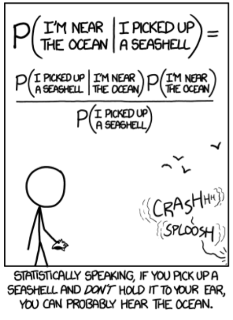

```{r setup, include=FALSE}
knitr::opts_chunk$set(
	echo = TRUE,
	fig.path = "img/",
	warning = FALSE,
	comment = "##",
	prompt = FALSE,
	tidy = TRUE,
	tidy.opts = list(width.cutoff = 75)
)
```

# Using Bayesian Statistics for Mixed Effects Modeling

## Preliminaries
- Install these packages in ***R***: [{MCMCglmm}](https://cran.r-project.org/web/packages/MCMCglmm/vignettes/CourseNotes.pdf)

## Objectives
> In this module, we'll go over the basics of Bayesian inference and implement some simple mixed models.

Before learning a bit about Bayesian statistics (as opposed to frequentist statistics, which is what we've been learning about so far in this class), it's important to note that there's a long and contentious history of statisticians and researchers mutually criticizing the use of each. There are STILL some folks who will insist that if you use one approach you must consistently use one approach for all time... I am not of that school. In this class, at least, these two approaches will be considered different tools we can use to tackle problems of statistical inference.

##Bayes' Theorem



Before diving into actual statistical inference using Bayesian methods, it's important to understand exactly how Bayesian inference is different from frequentist methods. With frequentist statistics, we've been assuming that there is one underlying distribution that is described by the fixed parameters of a population, which we can estimate based on a small sample of the population. That small sample is likely to represent the population, and our best model is chosen to reflect how likely the data is to be represented by that model. The objectivity of this frequentist approach lies in the idea that only the information contained in our sample is used to estimate our parameters. In other words, this approach is assuming no prior knowledge about that population aside from our best guess at the underlying distribution.

Bayesian inference stipulates that we are not going blind into our analysis of our population; we often know more than our sample data is capable of showing us. In fact, the prior knowledge we have about a population can be critical to understanding our true parameter estimates. Making the mistake of ignoring this prior knowledge can cause enormous errors.

Perhaps it's easier to explain with a real life example. Sally Clark was a solicitor in the UK who had two children die of cot death ([SIDS](https://www.mayoclinic.org/diseases-conditions/sudden-infant-death-syndrome/symptoms-causes/syc-20352800)) a little over a year apart. After the second death, she was arrested on suspicion of murder. During the legal inquiry into the deaths in 1999, Sally Clark was accused and convicted of murdering her two children largely based on the testimony of a frequentist statistician who argued that the probability of two infants in the same family dying of cot death was so small that murder was the most probable explanation for the two deaths. According to the prosecutor, Sir Roy Meadow (a pediatrician), the probability of one infant dying of cot death is about 1 in 8543, meaning that, controlling for other covariates like smoking in the household and other social factors, the probability of two infants in the same household dying of cot death is that value squared, or 1 in 73,000,000. Despite having no substantial evidence of foul play, Sally Clark was convicted of murdering her two infants on the supposition that the probability of her two babies dying by chance (of cot death), and thus the probability of her innocence, was only 1 in 73 million, small enough to leave no reasonable doubt of her guilt in their deaths.

There are quite a few problems with the assumptions of this case, part of which has become known as the ["Prosecutor's Fallacy"](https://en.wikipedia.org/wiki/Prosecutor%27s_fallacy). Focusing on that aspect, we should be aware that multiplying the two probabilities together, as was done by Sir Meadow, requires that the death of each infant be completely independent. However, research has consistently shown that many risks associated with cot death may be present in a given household and shared by multiple infants in that home -- e.g., quality of parental care, sleeping positions, and other factors not controlled for in Sir Meadow's analysis -- suggesting that the underlying risk may have been mutually elevated for both infants, suggesting a lack of independence for the two events. Given these shared risks, one death by SIDS in a single family is known to increase the probability of a second, so two deaths by SIDS in the same household must have a higher probability than two individual and independent events. 

In order to truly understand the odds of two infants in the same household dying of SIDS, we need to understand *conditional probability*, or the *relative* likelihood of a second infant in the Clark household dying of SIDS, given that one has already done so.


Describing this a bit more concisely, we could say that while frequentist statistics assume that parameters are unknown but fixed (like the mean of a population), Bayesian statistics assume that parameters are not fixed but rather follow their own prior probability distribution. This *prior distribution* is based on what we *already* know about the population in question -- this can either be knowledge about the distribution of this parameter from previous experiments or analyses, or can reflect the idea that we have very little prior knowledge about the distribution of parameters (we call these *uninformative* or *vague* prior distributions). This *prior distribution*, in conjunction with the data itself, allows us to estimate the *posterior distribution* for the parameter. Conceptually, the data helps us to pinpoint our posterior distribution in a specific area of the stipulated prior distribution. From this posterior we estimate our parameter(s), complete with *credibility intervals* and p-values.

##Markov Chain Monte Carlo Techniques

Monte Carlo Markov Chains (MCMC) are a method that allow us to create an actual distribution of parameter estimates from which we can derive a mean with a credibility interval and p-value. The Monte Carlo element is that this process will stochastically choose an initial value for our parameter estimates based on the prior distribution (that randomness is the Monte Carlo part). A Markov chain starts with this random initial estimated value of the parameter, and estimates a second parameter value based on the conditional probability of that second parameter given that the first is true (thus the importance of Bayes' Theorem to this process). This process is iterated over and over again -- to create the Markov chain -- for as many times as the user defines (this is *number of iterations*). Once a Markov chain 'converges' on a stable posterior mean value for our parameter, it no longer matters what the initial, stochastic parameter value was, or how appropriate it might have been. Typically, this *'burn-in'* period of random values prior to convergence is discarded, since we only want the stable outcomes of the converged chains. Typically, we need a large number of Markov chain samples to cover the entire posterior distribution of our parameter estimate.

Once we've generated a large number of these chains, after discarding the burn-in, the distribution of final parameter values is taken to represent the posterior distribution. We can summarize this distrubution with the same summary statistics as those used to summarize frequentist samples, like means and quantiles.

