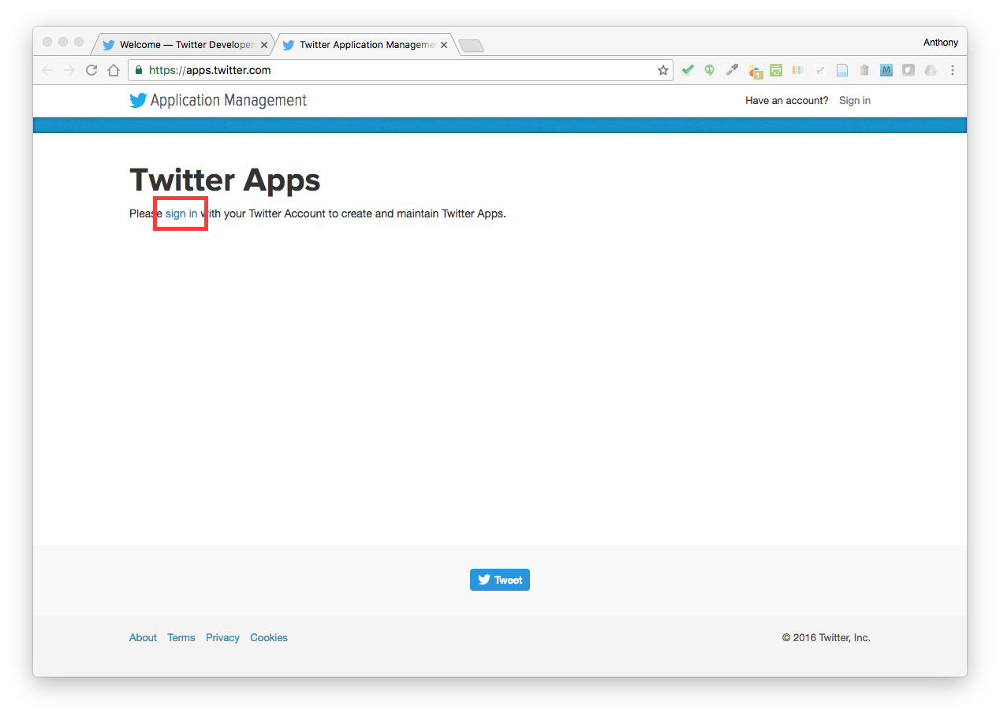
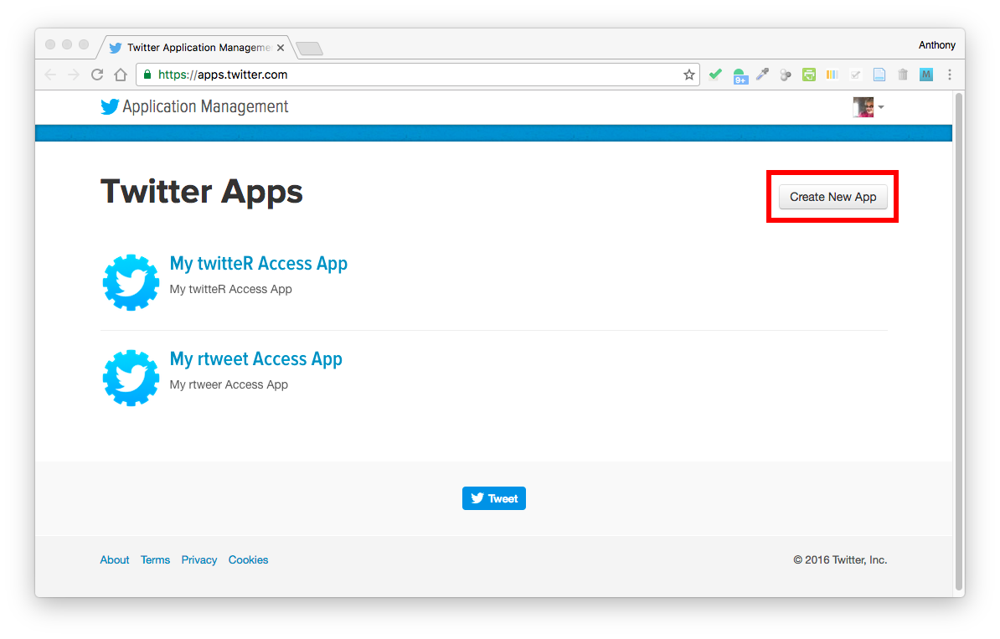
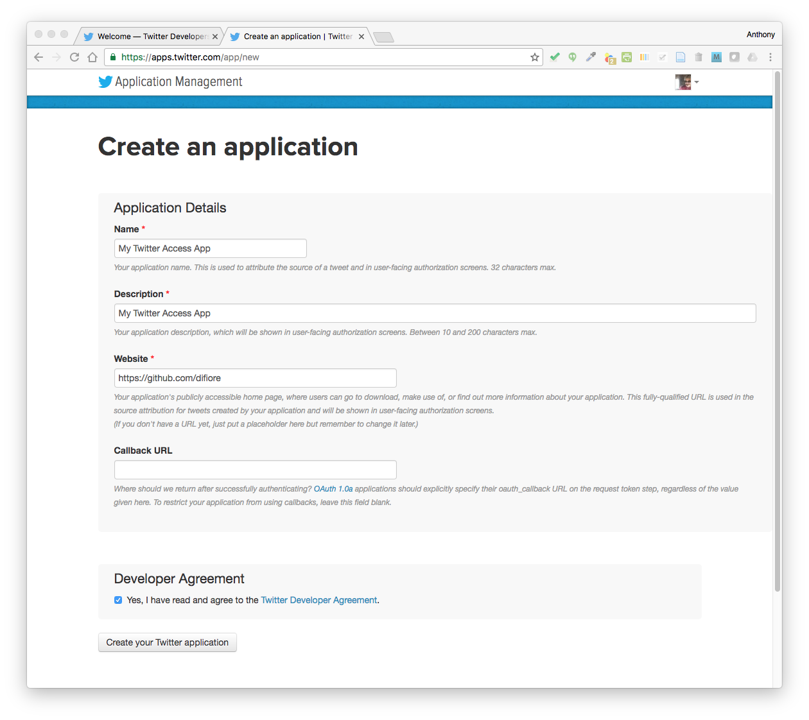
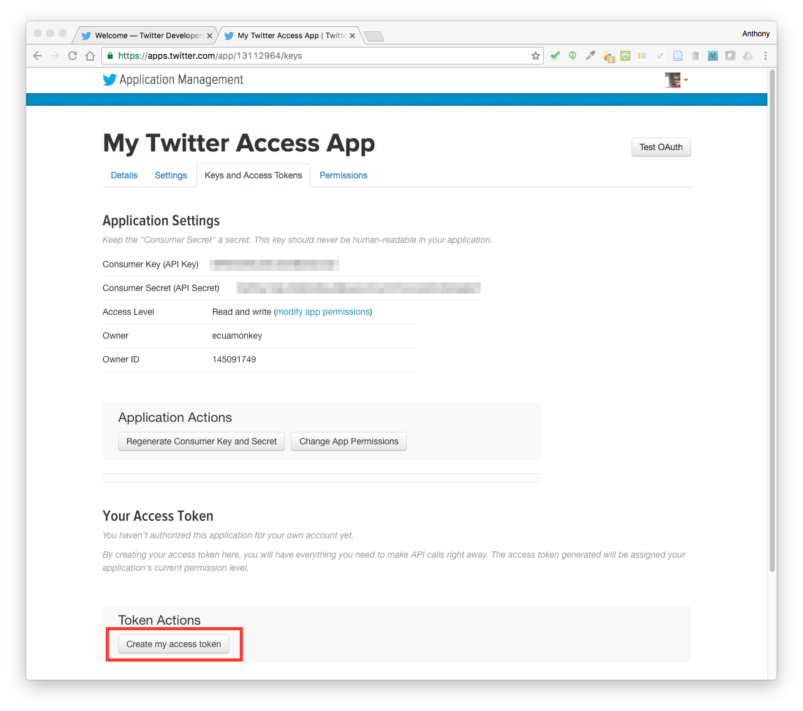
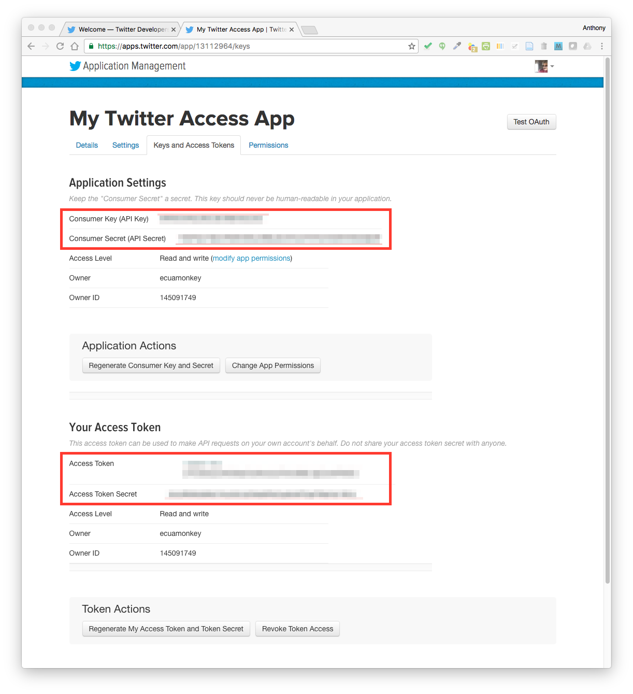
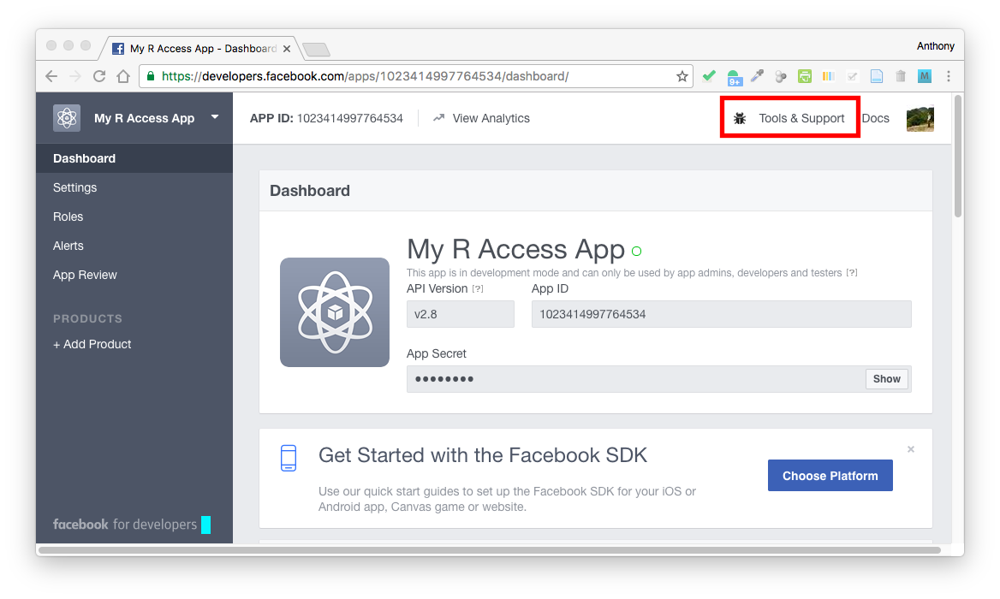
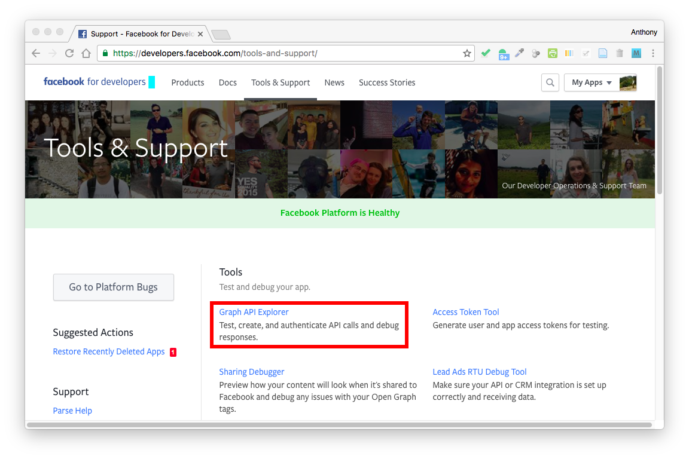
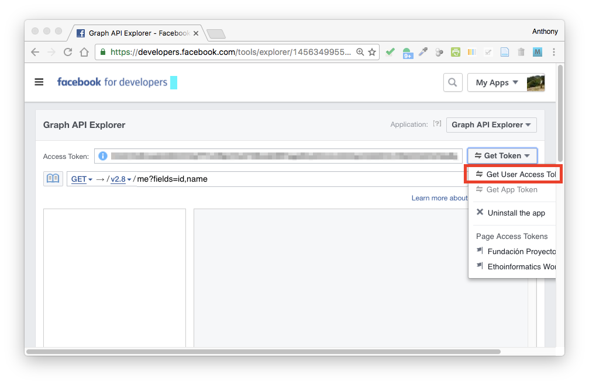
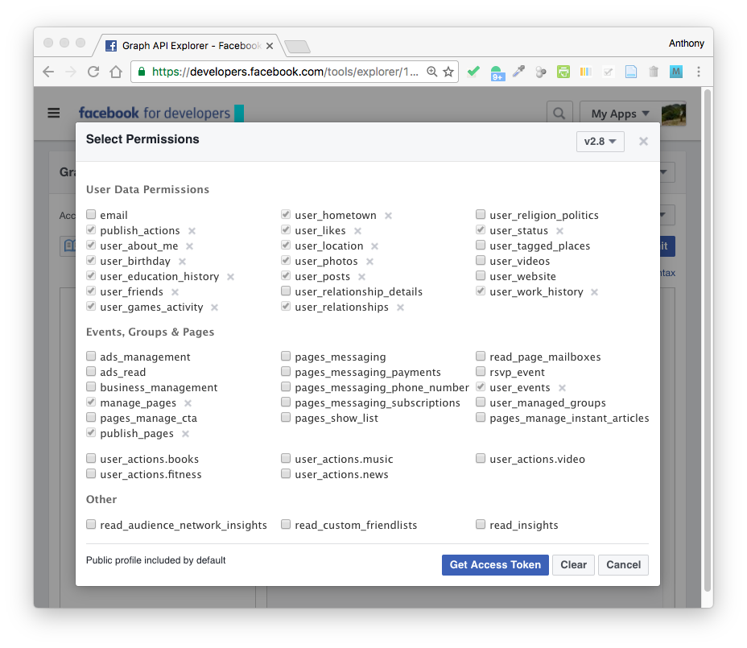

```{r setup, include=FALSE}
knitr::opts_chunk$set(
	echo = TRUE,
	fig.path = "img/",
	warning = FALSE,
	comment = "##",
	prompt = FALSE,
	tidy = TRUE,
	tidy.opts = list(width.cutoff = 75)
)
```
# Accessing Web APIs

## Preliminaries
- Install these packages in ***R***: {twitteR}, {data.table}, {rtweet}, {Rfacebook}, {tm}, {httr}, {jsonlite}

## Objectives

> In this module, we learn some basic tools for working with APIs (or "application programming interfaces") using Twitter and Facebook as examples, because ***R*** packages exist already that provide easy functionality. It is also possible to access LOTS of different data sources over the web using API calls, and we will explore a couple of other examples as well. For more information on accessing APIs, check out [this blog post](http://tophcito.blogspot.com/2015/11/accessing-apis-from-r-and-little-r.html)

## Accessing the Twitter API from ***R***

Twitter is a service that allows users to broadcast short (≤ 140 character) messages ('tweets') for others to read. The {twitteR} package is intended to provide access to the Twitter or API from within ***R***, allowing users to grab interesting subsets of Twitter data for analysis.

The first thing you need to do is to create a ***Twitter*** application for yourself. Go to [https://apps.twitter.com/](https://apps.twitter.com/), and sign in. If you do not have a Twitter account already, you will need to create one first!




From the Twitter Apps screen, choose "Create New App".



Complete the requested information to create a new app. For the `Name` and `Description` fields, you can choose anything (although your name might be taken; instead of 'My Twitter App', try '[USERNAME] Twitter App'. For the `Website` field, you need to include a valid URL... the easiest thing to do is use your ***GitHub*** page. You can leave the `Callback URL` blank or set it to the default http://127.0.0.1:1410.



Once you app is created, move to the `Keys and Access Tokens` tab and select "Create my access token".





Then, take note of your `Consumer Key`, `Consumer Secret`, `Access Token`, and `Access Token Secret`. Assign these values to variables in ***R***.

``` {r eval = FALSE}
app <- "[YOUR APP NAME]"
consumer_key <- "[YOUR KEY]"
consumer_secret <- "[YOUR SECRET]"
access_token <- "[YOUR TOKEN]"
access_secret <- "[YOUR TOKEN SECRET]"
```

```{r echo = FALSE}
app <- "Fuzzyatelin Twitter Access App"
consumer_key <- "LC91nJxGki7Mc0af1Pdez3le7"
consumer_secret <- "WQnvJe0z4YZKhF5nZA3JMTP1g2SNauBFeMY1h1VrIaaIabrgBR"
access_token <- "824000078-kapt630z22hQToIc1ls7y9ryTeTK3csHcxurRNSF"
access_secret <- "juHlQW0orDkUUxQgu1jOlb0neTQmfMu9EaJVzLMo9pGwV"
```

### Using the {twitteR} Package

Load the {twitteR} package and run the `setup_twitter_oauth()` function with the four keys assigned above as arguments. This will give us per session access to the Twitter API. You may need to run the `setup_twitter_oauth()` function again if you close your ***R*** session.

```{r}
library(twitteR)
setup_twitter_oauth(consumer_key, consumer_secret, access_token, access_secret)
```

We’re now ready to ping the Twitter servers. Fortunately, the {twitteR} package makes this fairly easy. As a first step, you can download information on a given user and take a look their information using the `getUser()` function. The function returns a complex data structure of a custom class named `user`.

> NOTE: There are limits to how often and how many results you can return per unit time from the Twitter API, so if you're trying to do something that returns a LOT of results, you may sometimes get a warning that the "Rate Limit" has been reached. If this is the case, you may need to use the "n=" argument to limit the number of results returned and/or try running your function call again after waiting for some time. For most types of requests, users are limited to making 15 API calls in any given 15 minute window.

```{r}
me <- getUser('fuzzyatelin') # replace with your own Twitter handle ("@")
me$description
me$location
me$name
me$lastStatus$text <- iconv(me$lastStatus$text, "latin1", "ASCII", "byte") # iconv() function should fix most encoding issues
str(me) # take a look at the structure of a 'user' object
```

The following code snippets returns information on *different* users...

```{r}
who <- getUser('Mammals_Suck') # replace your user name with someone else's Twitter handle (minus the "@")
who$description
potus <- getUser('realDonaldTrump')
potus$description
```

The `userTimeline()` function can be used to access the most recent tweets of any given user (e.g., `@potus`). The function returns a **list** of tweets with a complex data struture of a custom class named `status`.

```{r}
tweets <- userTimeline('Mammals_Suck', n=50)
head(tweets)
str(tweets[[1]]) # take a look at the structure of the first tweet (a 'status')
tweets <- userTimeline('potus', n=100)
length(tweets)
head(tweets)
```

The `strip_retweets()` removes any retweets from the list of returned tweets.

```{r}
tweets <- strip_retweets(tweets, strip_manual=TRUE, strip_mt=TRUE)
head(tweets)
```

We can use the command `twListToDF()` to unpack a tweet list and convert it to a dataframe.

```{r}
tweets <- twListToDF(tweets)
head(tweets)
```

By accessing the `getFollowers()` method for a given user, we can get the followers of that particular user.

```{r}
myfollowers <- me$getFollowers() # return 10 of my followers
myfollowers
```

Below, we use the {data.table} package to unpack a user's followers information to see where those followers are located.

```{r}
library(data.table) # this library lets us use rbindlist()
myfollowers_df = rbindlist(lapply(myfollowers,as.data.frame))
myfollowers_df$name
myfollowers_df$location
```

Similarly, can use the `getFriends()` method to return the Twitter friends of a particular user (i.e., the folks that a user is following). This function returns a list of `user` objects which we can parse to, for example, get a list of friends' `names` and Twitter handles.

> NOTE: It's possible to return lots of other user information as well!

```{r}
myfriends <- me$getFriends()
friends_df <- data.frame()
for (i in 1:length(myfriends)) {
  n <- myfriends[[i]]$name
  h <- myfriends[[i]]$screenName
  info <- cbind(n,h)
  friends_df <- rbind(friends_df,info)
}
names(friends_df) <- c("Name","Handle")
friends_df
```

Here's how we would get a data frame of the friends of a different user...

```{r}
ndt_friends <- getUser("neiltyson")$getFriends(n=100)
length(ndt_friends)
ndt_friends_df = rbindlist(lapply(ndt_friends,as.data.frame))
ndt_friends_df$name
```

... or a data frame of the followers of that user...

> NOTE: This many only be a partial list because of rate limit constraints on the API.

```{r}
ndt_followers <- getUser("neiltyson")$getFollowers(n=1000) # setting n=1000 returns up to 1000 followers; the default is "all" followers, but if the user has large numbers of followers you are very likely to hit the rate limit!
length(ndt_followers)
ndt_followers_df = rbindlist(lapply(ndt_followers,as.data.frame))
head(ndt_followers_df$name,50) # only returning n=50
```

The code below would return a data frame of how many Twitter users that my friends (i.e., the folks I am following) are themselves following...

```{r}
f <- data.frame()
for (i in 1:length(myfriends)) {
	following <- cbind(as.data.frame(myfriends[[i]]$name),as.data.frame(myfriends[[i]]$getFriendsCount()))
	f <- rbind(f,following)
}
names(f) <- c("name", "following")
f
```

... and the following would return a list of how many followers my friends (i.e., the folks I am following) have...

```{r}
f <- data.frame()
for (i in 1:length(myfriends)) {
	followers <- cbind(as.data.frame(myfriends[[i]]$name),as.data.frame(myfriends[[i]]$getFollowersCount()))
	f <- rbind(f,followers)
}
names(f) <- c("name", "followers")
f
```

Lastly, following would return a data frame on with information on *friends of friends*, i.e., lists of users who those I am following are currently following.

> NOTE: You are certain to run into rate limit issues with this if you are following more than 15 friends, so run the loop in subsets!

```{r}
f <- data.frame()
for (i in 27:30) { # running for a subset of my list of friends... here, we ask Twitter to only return 10
  my_friend <- myfriends[[i]]$name
	my_friend_friends <- myfriends[[i]]$getFriends(n=10)
	my_friend_friends <- cbind(my_friend,rbindlist(lapply(my_friend_friends,as.data.frame)))
	f = rbind(f,my_friend_friends)
}
FOF <- cbind(f$my_friend, f$name) # we could add other field names here, too...
colnames(FOF) <- c("friend","FOF name")
FOF
```

We can can also use the {twitteR} package to look for trending topics using the `trends()` function...

```{r}
close_trends <- closestTrendLocations(lat=42.3601, long=-71.0589) # returns an ID ("woeid") for the current list of topics trending closest to a particular lat and long, like that of Boston, MA
head(close_trends)
trends <- getTrends(close_trends$woeid) # now, return the trends pertinent to that location
head(trends)
```

We can also use {twitteR} to search for tweets containing a particular `searchString`. A "+" can be used to combine search terms, and other arguments can be used to limit the set of results.

```{r}
wd <- searchTwitter("RuPaul+Drag+Race",lang="en",n=50,since='2017-10-01',geocode='42.3601,-71.0589,1000mi') # only required argument is searchString; since restricts to tweets since a date; geocode restricts to within a set radius of a given lat and long, here, within 1000 miles of Boston, MA
wd <- twListToDF(wd)
head(wd$text)
```

Finally, we can also post and and delete tweets to our Twitter feed from ***R*** using the `updateStatus()` and `deleteStatus()` commands.

```{r,eval=FALSE}
new_tweet <- updateStatus("Whaaaaaaat... I just posted to Twitter from R!!!!")
deleteStatus(new_tweet) #if this returns "TRUE", the tweet was deleted correctly.
```

Below, I pull my timeline, select a tweet from the list that is returned, and pass that to `deleteStatus()` to remove it.

```{r,eval=FALSE}
new_tweet <- updateStatus("This a post to Twitter from R!!!!")
my_timeline <- userTimeline("fuzzyatelin", retryOnRateLimit=10)
my_timeline
to_delete <- my_timeline[[1]]
deleteStatus(to_delete)
```

I can also post **media**, e.g., a photo, to Twitter if I supply the path to the file to post...

```{r,eval=FALSE}
new_tweet <- tweet("I can now post GIFs to my twitter feed from R... there is no longer any reason to leave R...", mediaPath = "~/Desktop/divine-wink-and-smile.gif")
```

### Using the {rtweet} Package

{rtweet} is another package that lets us interact with the Twitter API in a comparable way to {twitteR}. First, we need to set up authorization as we did above. Here, I am authorizing access using a different app created in Twitter to demonstrate using an authorization *token* contained in a file on my computer.

```{r,echo=FALSE}
library(rtweet)
app <- "Fuzzyatelin rtweet Access App"
consumer_key <- "NdhwfqjpB318nEbA2fZ5WmhY7"
consumer_secret <- "j4kag1r67cliSQ5LZpfjgtmump1FEbqFmMq4JOU2547oRALkRE"
access_token <- "824000078-oWPZkXeGirgdHI4VKzKXWSfdlB6dLDBOcT7E4wVT"
access_secret <- "4NlhU6WCi3gBhU7xTPyPqPRBPUs96wX7CVWFFSD83ax8S"
```

```{r,eval=FALSE}
library(rtweet)
app <- "My rtweet Access App"
consumer_key <- "[YOUR CONSUMER KEY]"
consumer_secret <- "[YOU CONSUMER SECRET]"
```

If you run the following code one time, you will create a file on your computer in your home directory with your Twitter authorization for this particular app **and** you will modify your `.Renviron` file to include the path to your tokens.

> NOTE: You will need to restart ***R*** after running the snippet below for this to work properly!

```{r,eval=FALSE}
library(rtweet)
rtweet_tokens <- create_token(app = app, consumer_key = consumer_key, consumer_secret = consumer_secret)
home_directory <- normalizePath("~/")
file_name <- paste0(home_directory, "/", "rtweet_tokens")
save(rtweet_tokens, file = file_name)
cat(paste0("TWITTER_PAT=",file_name,"\n"),
  file = paste0(home_directory, "/.Renviron"),
  append = TRUE)
```

The `search_tweets()` function from {rtweet} is very similar to `searchTwitter()` from {twitteR} but returns a dataframe by default (i.e., the argument "parse=" is set to TRUE by default).


```{r}
library(rtweet)
sasha <- search_tweets("sasha_velour", n = 100)
head(sasha$text)
```

The function `get_Timeline()` is equivalent to `userTimeline()` the {twitteR} package.

```{r}
potus <- get_timeline("realDonaldTrump",n=50)
head(potus$text)
```

{rtweet} allows us to do many other things, too... 

```{r}
# we can combine search terms with "+"
wd <- search_tweets("RuPaul+Sasha", n = 100)
head(wd$text)

# we can extract data on the users who posted tweets
head(users_data(wd))

# we can lookup users by their screen_name or user_id
users <- c("Mammals_Suck", "hadleywickham", "RuPaul", "sasha_velour", "potus", "fuzzyatelin", "BarakObama")
famous_tweeters <- lookup_users(users)
famous_tweeters

# we can search for particular users and retrieve their public posts (e.g., for user "@bjork")
ndt <- lookup_users("bjork")
ndt <- get_timeline("bjork", n=100)
head(ndt$text)

# here we pass Bjork's tweets into a corpus for text mining (see Module 20!)
library(tm)
ndtCorpus <- Corpus(VectorSource(ndt$text))

# we can also retreive the user IDs of people following a particular user, e.g., bjork
bjork_followers <- get_followers("bjork", n=5000) # by default, n=75000... if you specify something less, it will return in multiples of 5000
bjork_followers <- as.character(unlist(bjork_followers$user_id))
head(bjork_followers,100)

# ... and then lookup data on those users
bjork_followers <- lookup_users(bjork_followers)
head(bjork_followers$name,100)
```

The {rtweet} [vignette](https://cran.r-project.org/web/packages/rtweet/vignettes/rtweet.html) provides additional examples of the functionality of the {rtweet} package.

## Accessing the Facebook GraphAPI from ***R***

* Go to: [https://developers.facebook.com/](https://developers.facebook.com/)
* Login in, and from the dropdown menu in the upper left corner, select `Add a New App` and create a new app


* Go to `Tools and Support`, choose `GraphApiExplorer` and then press the `Get Token` button






* Choose `Get User Access Token` and select the User Data Permissions you wish to be able to access.





> NOTE: If you want to be able to POST status updates to Facebook, you should make sure that "publish_actions" is checked.

* Copy the token text and paste it in the ***R*** code below

* This token should be good for a few hours, after which you will need to go back to the Facebook developer page, refresh it, and replace the token information in the ***R*** code below.

``` {r eval = FALSE}
library(Rfacebook)

FBtoken <- "[YOUR TOKEN HERE]"
```

```{r echo = FALSE}
library(Rfacebook)

FBtoken <- "EAACEdEose0cBAFiOwjVDztlbRejX1ns12TZAU6zTSvr9bO35rkxAVI4E3KZBxkB446WZB6IZBaiWVPZAfg4YZA5WAVcQ7IlcQvnqpLwjDSZBOeuCVnZAiqxNfqOnUAxZBusCwGMPdAXqjs6owgrpbGEPXZAeGYZC3VBEz3gIqZCY2ZAEuhlR70gwa1Sdkclex2TH9yrkZD"
```

```{r}
me <- getUsers("me", token=FBtoken, private_info = TRUE) # returns my profile info
me
```

The `getLikes()` function returns a list of the URLs I have liked.

```{r}
mylikes <- getLikes(user="me", token=FBtoken)
mylikes
```

The `searchGroup()` function lets us search for groups using a search string.

```{r}
searchGroup("Evolutionary Anthropology",token=FBtoken)
searchGroup("March For Science",token=FBtoken)
```

The `getGroup()` function lets us return posts from a particular public group. 

```{r}
getGroup(group_id=227055379125, token=FBtoken, n = 10)
```

The `searchPages()` function lets us search for public posts using a particular search string.

```{r}
monkeyPages <- searchPages("monkey", token=FBtoken, n = 20)
monkeyPages$description
```

The `updateStatus()` function let's us post to Facebook from ***R***.

```{r,eval=FALSE}
updateStatus("This is a test of the FB API from R", FBtoken)
```

## Accessing REST APIs Generically

API calls commonly consist of sending requests/commands to a remote site over the internet using HTTP ("hypertext transfer protocol"). Examples of such commands include `GET()`, which points to a specific URL endpoint (a site on the web) to request return of specific information stored at that point, and `POST()`, which is a request to send and often store information at that URL endpoint. Typically, we also need to provide some kind of authorization information in our request to allow us to access the API.

The ***R*** packages described above for accessing Twitter and Facebook use the {httr} package behind the scenes to generate the HTTP commands needed to request information from and send information to a remote server. We can also use the {httr} package to write our own API calls directly. 

### The Twitter API

To access the Twitter API using {httr}, you need to have the key and secret for your own Twitter application that we created above.

``` {r eval = FALSE}
consumer_key <- "[YOUR KEY]"
consumer_secret <- "[YOUR SECRET]"
```

```{r echo = FALSE}
consumer_key <- "LC91nJxGki7Mc0af1Pdez3le7"
consumer_secret <- "WQnvJe0z4YZKhF5nZA3JMTP1g2SNauBFeMY1h1VrIaaIabrgBR"
```

Then, we send a request to the Twitter API with our app codes and ask Twitter to return an authorization token. The code below encodes our user authorization in *auth_string* and sends it to Twitter to request a token, which we store in TWtoken...

```{r}
library(httr)
library(jsonlite)
# set up a key:value pair for authorization and get an authorization token back from Twitter
# we use POST() because we are sending information to Twitter
auth_string <- base64_enc(paste(consumer_key,consumer_secret, sep = ":")) # encoded our key and secret
request <- POST("https://api.twitter.com/oauth2/token",add_headers("Authorization" = paste("Basic", gsub("\n", "", auth_string)),"Content-Type"="application/x-www-form-urlencoded;charset=UTF-8"),body = "grant_type=client_credentials")

#Extract the access token from the returned post
stop_for_status(request, "Need to authenticate with Twitter")
TWtoken <- paste("Bearer", content(request)$access_token)
```

We then issue a `GET()` request to the Twitter API specifying as a URL endpoint the kind of data we want to return (e.g., statuses from a user timeline, tweets) and adding as a "header" to our request the authorization token we received from Twitter above. The base URL to access user statuses is "https://api.twitter.com/1.1/statuses/user_timeline.json". The base URL we use to search tweets is "https://api.twitter.com/1.1/search/tweet.json". 

> NOTE: In the first *query* below, we are asking Twitter to return 10 statuses from the user timeline of "fuzzyatelin". In the second, we are asking Twitter to return 10 tweets mentioning "RuPaul". In all of the query strings, we use "?" to start the string and "&" to separate parameters within the string.

The results come back as `json` ("Java Script Object Notation") formatted text. We extract the `content` of the `json` object and then "prettify" it using a command from ***R***'s {jsonlite} packag. We can also convert the `json` content to a dataframe using the `fromJSON()` command.

```{r}
# API call to return statuses
endpoint <- "https://api.twitter.com/1.1/statuses/user_timeline.json"
query <- "?screen_name=fuzzyatelin&count=10"
request <- paste0(endpoint, query)
x <- GET(request, add_headers(Authorization = TWtoken))
x <- prettify(content(x, as="text", type="application/json", encoding = "UTF-8")) # extract and prettify `content`
tweets <- fromJSON(x) # convert extracted contents to a dataframe
tweets$text

# API call to search tweets
endpoint <- "https://api.twitter.com/1.1/search/tweets.json"
query <- "?q=RuPaul&count=10"
request <- paste0(endpoint, query)
x <- GET(request, add_headers(Authorization = TWtoken))
x <- prettify(content(x, as="text", type="application/json", encoding = "UTF-8"))
tweets <- fromJSON(x)
tweets$statuses$text
```

### The Facebook Graph API

The base URL for Facebook's Graph API is currently "https://graph.facebook.com/v2.8/", to which we append information on the endpoint we want to retrieve from. As above, for our API call we then set up a string in ***R*** that is a URL containing [a] the web location we want to retrieve information from, [b] the information we want to retrieve, and [c] our authorization and then issue a `GET()` request.

> NOTE: For the Facebook API, we append our authorization information to the URL we send via HTTP rather than including this information as a "header".

In the example below, we ask to retrieve the "id", "name", "hometown", "location", and "posts" fields from from my personal user profile node on Facebook ("me") using the access token assigned above. 

> NOTE: As above, in the query strings below we use "?" to start the string and "&" to separate parameters within the string.

```{r}
endpoint <- "https://graph.facebook.com/v2.8/me"
query <- paste0("?fields=id,name,hometown,location,friends,posts&access_token=",FBtoken)
request <- paste0(endpoint,query)
x <- GET(request)
x <- prettify(content(x,as="text", type="application/json", encoding = "UTF-8"))
x
```

We can also use `GET()` to search for users from the "search" endpoint. For example, to search for particular terms from the "pages" endpoint...

```{r}
query <- paste0("?q=Proyecto+Primates&type=page&access_token=",FBtoken)
request <- paste0(endpoint,query)
x <- GET(request)
x <- prettify(content(x,as="text", type="application/json", encoding = "UTF-8"))
x
```

To post a message to Facebook, we can send a request to the "feed" edge of my user endpoint ("me") with the message we want to post...

```{r,eval=FALSE}
endpoint <- "https://graph.facebook.com/v2.8/me/feed"
query <- paste0("?message=Hello%Queens!!&access_token=",FBtoken)
request <- paste0(endpoint,query)
x <- POST(request)
x <- prettify(content(x,as="text", type="application/json", encoding = "UTF-8"))
x <- fromJSON(x)
id <- x$id
id
```

To delete a post, we can use a `DELETE()` HTTP request with the {id} of the post we want to delete. Below, I use delete the post created above.

```{r,eval=FALSE}
endpoint <- paste0("https://graph.facebook.com/v2.8/",id)
query <- paste0("?access_token=",FBtoken)
request <- paste0(endpoint,query)
x <- DELETE(request)
x <- prettify(content(x,as="text", type="application/json", encoding = "UTF-8"))
x
```

To post pictures to my user node ("me"), we can set the endpoint as the "photos" edge and then include a "body" for our post.

```{r}
endpoint <- "https://graph.facebook.com/v2.8/me/photos"
query <- paste0("?access_token=",FBtoken)
request <- paste0(endpoint,query)
x <- POST(request, body = list(message ="Oh, you know... just uploading GIFs to Facebook from R...", source = upload_file("~/Desktop/divine-wink-and-smile.gif")))
x <- prettify(content(x, as="text", type="application/json", encoding = "UTF-8"))
x <- fromJSON(x)
x
```

For more information on the Facebook Graph API, following [this link](https://developers.facebook.com/docs/graph-api/overview).


### The Google Maps API

Finally, here's a simple example of using a different API that does not require use of an authorization token. The Google Maps API takes a query string and returns, among other things, location information as latitude and longitude.

```{r}
# Google Maps AP1 v3
endpoint <- "https://maps.googleapis.com/maps/api/geocode/json"
query <- "?address=125+Peterborough+Street,+Boston,+MA" # my old address... no token needed
request <- paste0(endpoint,query) 
x <- GET(request)
x <- prettify(content(x,as="text", type="application/json", encoding = "UTF-8"))
x <- fromJSON(x)
x # this will show use the nested structure of the returned JSON file... from this, we can extract different nodes
address <- x[['results']]$formatted_address
lat <- x[['results']]$geometry$location$lat
long <- x[['results']]$geometry$location$lng
x <- c(address,lat,long)
x
```

As you might imagine, there are **tons** of other web based APIs that you could use to retrieve data from remote servers, e.g., from various news organizations, remote databases, etc. Often, these will publish the API specifications that you would need to use to construct the request URLs for `GET()` or `POST()` commands.
