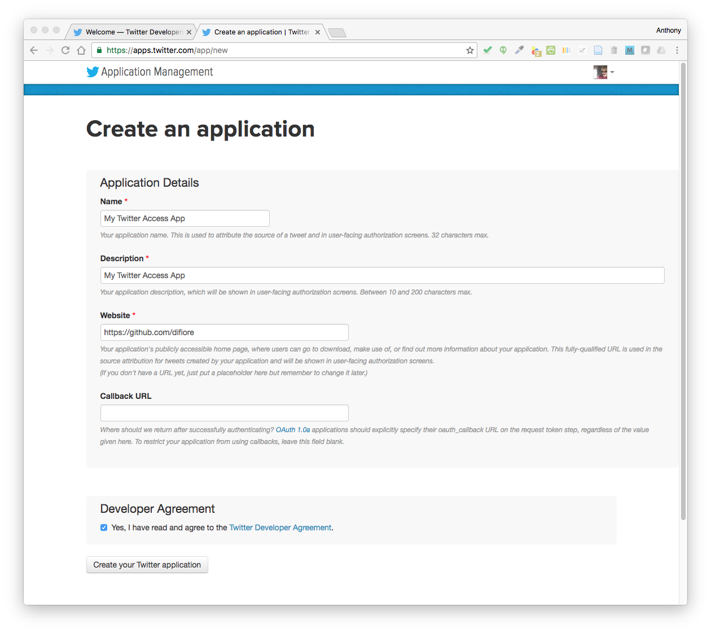
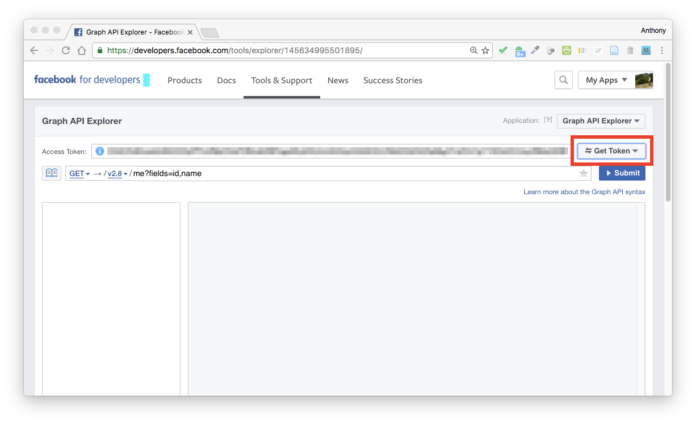
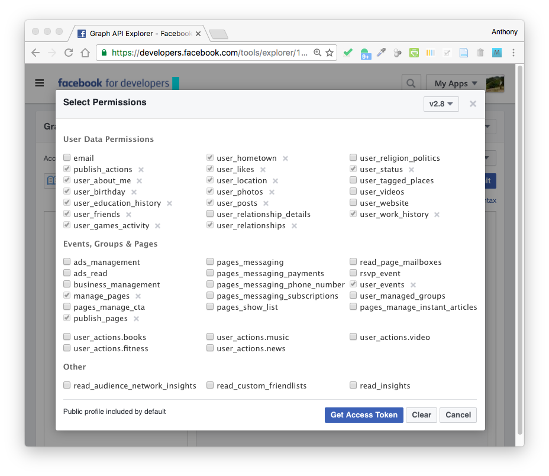

Module 19
================

Accessing Web APIs
==================

Preliminaries
-------------

-   Install these packages in ***R***: {twitteR}, {data.table}, {rtweet}, {Rfacebook}, {tm}, {httr}, {jsonlite}

Objectives
----------

> In this module, we learn some basic tools for working with APIs (or "application programming interfaces") using Twitter and Facebook as examples, because ***R*** packages exist already that provide easy functionality. It is also possible to access LOTS of different data sources over the web using API calls, and we will explore a couple of other examples as well. For more information on accessing APIs, check out [this blog post](http://tophcito.blogspot.com/2015/11/accessing-apis-from-r-and-little-r.html)

Accessing the Twitter API from ***R***
--------------------------------------

Twitter is a service that allows users to broadcast short (≤ 140 character) messages ('tweets') for others to read. The {twitteR} package is intended to provide access to the Twitter or API from within ***R***, allowing users to grab interesting subsets of Twitter data for analysis.

The first thing you need to do is to create a ***Twitter*** application for yourself. Go to <https://dev.twitter.com/>, choose "My Apps", and sign in. If you do not have a Twitter account already, you will need to create one first!


From the Twitter Apps screen, choose "Create New App".


Complete the requested information to create a new app. For the `Name` and `Description` fields, you can choose anything. For the `Website` field, you need to include a valid URL... the easiest thing to do is use your ***GitHub*** page. You can leave the `Callback URL` blank or set it to the default <http://127.0.0.1:1410>.



Once you app is created, move to the `Keys and Access Tokens` tab and select "Create my access token".


Then, take note of your `Consumer Key`, `Consumer Secret`, `Access Token`, and `Access Token Secret`. Assign these values to variables in ***R***.

``` r
app <- "[YOUR APP NAME]"
consumer_key <- "[YOUR KEY]"
consumer_secret <- "[YOUR SECRET]"
access_token <- "[YOUR TOKEN]"
access_secret <- "[YOUR TOKEN SECRET]"
```

### Using the {twitteR} Package

Load the {twitteR} package and run the `setup_twitter_oauth()` function with the four keys assigned above as arguments. This will give us per session access to the Twitter API. You may need to run the `setup_twitter_oauth()` function again if you close your ***R*** session.

``` r
library(twitteR)
setup_twitter_oauth(consumer_key, consumer_secret, access_token, access_secret)
```

    ## [1] "Using direct authentication"

We’re now ready to ping the Twitter servers. Fortunately, the {twitteR} package makes this fairly easy. As a first step, you can download information on a given user and take a look their information using the `getUser()` function. The function returns a complex data structure of a custom class named `user`.

> NOTE: There are limits to how often and how many results you can return per unit time from the Twitter API, so if you're trying to do something that returns a LOT of results, you may sometimes get a warning that the "Rate Limit" has been reached. If this is the case, you may need to use the "n=" argument to limit the number of results returned and/or try running your function call again after waiting for some time. For most types of requests, users are limited to making 15 API calls in any given 15 minute window.

``` r
me <- getUser("ecuamonkey")  # replace with your own Twitter handle ('@')
me$description
```

    ## [1] "Primate evolutionary biologist and geneticist at the University of Texas at Austin"

``` r
me$location
```

    ## [1] "Austin, TX"

``` r
me$name
```

    ## [1] "Anthony Di Fiore"

``` r
me$lastStatus$text <- iconv(me$lastStatus$text, "latin1", "ASCII", "byte")  # iconv() function should fix most encoding issues
str(me)  # take a look at the structure of a 'user' object
```

    ## Reference class 'user' [package "twitteR"] with 18 fields
    ##  $ description      : chr "Primate evolutionary biologist and geneticist at the University of Texas at Austin"
    ##  $ statusesCount    : num 43
    ##  $ followersCount   : num 39
    ##  $ favoritesCount   : num 27
    ##  $ friendsCount     : num 41
    ##  $ url              : chr(0) 
    ##  $ name             : chr "Anthony Di Fiore"
    ##  $ created          : POSIXct[1:1], format: "2010-05-18 03:11:20"
    ##  $ protected        : logi FALSE
    ##  $ verified         : logi FALSE
    ##  $ screenName       : chr "ecuamonkey"
    ##  $ location         : chr "Austin, TX"
    ##  $ lang             : chr "en"
    ##  $ id               : chr "145091749"
    ##  $ lastStatus       :Reference class 'status' [package "twitteR"] with 17 fields
    ##   ..$ text         : chr "An old pic, but a fave... https://t.co/bBWRAbssnJ"
    ##   ..$ favorited    : logi FALSE
    ##   ..$ favoriteCount: num 0
    ##   ..$ replyToSN    : chr(0) 
    ##   ..$ created      : POSIXct[1:1], format: "2016-12-08 05:50:17"
    ##   ..$ truncated    : logi FALSE
    ##   ..$ replyToSID   : chr(0) 
    ##   ..$ id           : chr "806737642846945280"
    ##   ..$ replyToUID   : chr(0) 
    ##   ..$ statusSource : chr "<a href=\"https://github.com/difiore\" rel=\"nofollow\">My twitteR Access App</a>"
    ##   ..$ screenName   : chr "Unknown"
    ##   ..$ retweetCount : num 0
    ##   ..$ isRetweet    : logi FALSE
    ##   ..$ retweeted    : logi FALSE
    ##   ..$ longitude    : chr(0) 
    ##   ..$ latitude     : chr(0) 
    ##   ..$ urls         :'data.frame':    0 obs. of  4 variables:
    ##   .. ..$ url         : chr(0) 
    ##   .. ..$ expanded_url: chr(0) 
    ##   .. ..$ dispaly_url : chr(0) 
    ##   .. ..$ indices     : num(0) 
    ##   ..and 51 methods, of which 39 are  possibly relevant:
    ##   ..  getCreated, getFavoriteCount, getFavorited, getId, getIsRetweet,
    ##   ..  getLatitude, getLongitude, getReplyToSID, getReplyToSN,
    ##   ..  getReplyToUID, getRetweetCount, getRetweeted, getRetweeters,
    ##   ..  getRetweets, getScreenName, getStatusSource, getText, getTruncated,
    ##   ..  getUrls, initialize, setCreated, setFavoriteCount, setFavorited,
    ##   ..  setId, setIsRetweet, setLatitude, setLongitude, setReplyToSID,
    ##   ..  setReplyToSN, setReplyToUID, setRetweetCount, setRetweeted,
    ##   ..  setScreenName, setStatusSource, setText, setTruncated, setUrls,
    ##   ..  toDataFrame, toDataFrame#twitterObj
    ##  $ listedCount      : num 0
    ##  $ followRequestSent: logi FALSE
    ##  $ profileImageUrl  : chr "http://pbs.twimg.com/profile_images/781657854839230464/aubawJv0_normal.jpg"
    ##  and 57 methods, of which 45 are  possibly relevant:
    ##    getCreated, getDescription, getFavorites, getFavoritesCount,
    ##    getFavouritesCount, getFollowerIDs, getFollowers, getFollowersCount,
    ##    getFollowRequestSent, getFriendIDs, getFriends, getFriendsCount, getId,
    ##    getLang, getLastStatus, getListedCount, getLocation, getName,
    ##    getProfileImageUrl, getProtected, getScreenName, getStatusesCount,
    ##    getUrl, getVerified, initialize, setCreated, setDescription,
    ##    setFavoritesCount, setFollowersCount, setFollowRequestSent,
    ##    setFriendsCount, setId, setLang, setLastStatus, setListedCount,
    ##    setLocation, setName, setProfileImageUrl, setProtected, setScreenName,
    ##    setStatusesCount, setUrl, setVerified, toDataFrame,
    ##    toDataFrame#twitterObj

The following code snippets returns information on *different* users...

``` r
who <- getUser("fuzzyatelin")  # replace your user name with someone else's Twitter handle (minus the '@')
who$description
```

    ## [1] "Asst Prof of BioAnth at Boston University, queer, primate genomicist, field biologist and blogger of mishaps (https://t.co/aBQY32B6Vc)."

``` r
potus <- getUser("potus")
potus$description
```

    ## [1] "Dad, husband, and 44th President of the United States. Tweets may be archived: http://t.co/eVVzoATsAR."

The `userTimeline()` function can be used to access the most recent tweets of any given user (e.g., `@potus`). The function returns a **list** of tweets with a complex data struture of a custom class named `status`.

``` r
tweets <- userTimeline("fuzzyatelin", n = 50)
head(tweets)
```

    ## [[1]]
    ## [1] "fuzzyatelin: My hero, .@WeatherKait on #Breitbart and @HouseScience misuse of weather/climate data: \"consult a scientist\" https://t.co/Tu3Unc60Rq"
    ## 
    ## [[2]]
    ## [1] "fuzzyatelin: Tell Trump To #ActOnClimate - Sign the Petition! https://t.co/vd4Ignd0w3 via @Change"
    ## 
    ## [[3]]
    ## [1] "fuzzyatelin: Hey students, here's that study that Jessica mentioned in lecture (that I'll be adding to the genetic diagnosis pap… https://t.co/OBgaK8ZPiF"

``` r
str(tweets[[1]])  # take a look at the structure of the first tweet (a 'status')
```

    ## Reference class 'status' [package "twitteR"] with 17 fields
    ##  $ text         : chr "My hero, .@WeatherKait on #Breitbart and @HouseScience misuse of weather/climate data: \"consult a scientist\" https://t.co/Tu3"| __truncated__
    ##  $ favorited    : logi FALSE
    ##  $ favoriteCount: num 3
    ##  $ replyToSN    : chr(0) 
    ##  $ created      : POSIXct[1:1], format: "2016-12-07 14:01:27"
    ##  $ truncated    : logi FALSE
    ##  $ replyToSID   : chr(0) 
    ##  $ id           : chr "806498863209127936"
    ##  $ replyToUID   : chr(0) 
    ##  $ statusSource : chr "<a href=\"http://twitter.com\" rel=\"nofollow\">Twitter Web Client</a>"
    ##  $ screenName   : chr "fuzzyatelin"
    ##  $ retweetCount : num 1
    ##  $ isRetweet    : logi FALSE
    ##  $ retweeted    : logi FALSE
    ##  $ longitude    : chr(0) 
    ##  $ latitude     : chr(0) 
    ##  $ urls         :'data.frame':   1 obs. of  5 variables:
    ##   ..$ url         : chr "https://t.co/Tu3Unc60Rq"
    ##   ..$ expanded_url: chr "https://youtu.be/UhdymoRTz6M"
    ##   ..$ display_url : chr "youtu.be/UhdymoRTz6M"
    ##   ..$ start_index : num 109
    ##   ..$ stop_index  : num 132
    ##  and 51 methods, of which 39 are  possibly relevant:
    ##    getCreated, getFavoriteCount, getFavorited, getId, getIsRetweet,
    ##    getLatitude, getLongitude, getReplyToSID, getReplyToSN, getReplyToUID,
    ##    getRetweetCount, getRetweeted, getRetweeters, getRetweets,
    ##    getScreenName, getStatusSource, getText, getTruncated, getUrls,
    ##    initialize, setCreated, setFavoriteCount, setFavorited, setId,
    ##    setIsRetweet, setLatitude, setLongitude, setReplyToSID, setReplyToSN,
    ##    setReplyToUID, setRetweetCount, setRetweeted, setScreenName,
    ##    setStatusSource, setText, setTruncated, setUrls, toDataFrame,
    ##    toDataFrame#twitterObj

``` r
tweets <- userTimeline("potus", n = 100)
length(tweets)
```

    ## [1] 93

``` r
head(tweets)
```

    ## [[1]]
    ## [1] "POTUS: Proud of our Champions of Change - folks who prove that, here in America, there's no more powerful role than that o… https://t.co/wbz1YSlUEx"
    ## 
    ## [[2]]
    ## [1] "POTUS: Today, we honor those who are leading the fight against HIV/AIDS. Because of them, an AIDS-free generation is now w… https://t.co/yW9uyfbf1x"
    ## 
    ## [[3]]
    ## [1] "POTUS: This Thanksgiving, we give thanks for our blessings, and work to fulfill the timeless responsibility we have as Americans to serve others."
    ## 
    ## [[4]]
    ## [1] "POTUS: The Old Soldiers Home in DC has cared for our nation's veterans for 165 years. I was honored to be a small part of… https://t.co/43ttiaLibI"
    ## 
    ## [[5]]
    ## [1] "POTUS: Happy birthday, Joe! The best @VP and friend I could have had alongside me these past eight years. https://t.co/kWH3L5uSFC"
    ## 
    ## [[6]]
    ## [1] "POTUS: One thing I've learned from my time abroad as President: Young people will shape our future long after their leader… https://t.co/bwEltHdPDs"

The `strip_retweets()` removes any retweets from the list of returned tweets.

``` r
tweets <- strip_retweets(tweets, strip_manual = TRUE, strip_mt = TRUE)
head(tweets)
```

    ## [[1]]
    ## [1] "POTUS: Proud of our Champions of Change - folks who prove that, here in America, there's no more powerful role than that o… https://t.co/wbz1YSlUEx"
    ## 
    ## [[2]]
    ## [1] "POTUS: Today, we honor those who are leading the fight against HIV/AIDS. Because of them, an AIDS-free generation is now w… https://t.co/yW9uyfbf1x"
    ## 
    ## [[3]]
    ## [1] "POTUS: This Thanksgiving, we give thanks for our blessings, and work to fulfill the timeless responsibility we have as Americans to serve others."
    ## 
    ## [[4]]
    ## [1] "POTUS: The Old Soldiers Home in DC has cared for our nation's veterans for 165 years. I was honored to be a small part of… https://t.co/43ttiaLibI"
    ## 
    ## [[5]]
    ## [1] "POTUS: Happy birthday, Joe! The best @VP and friend I could have had alongside me these past eight years. https://t.co/kWH3L5uSFC"
    ## 
    ## [[6]]
    ## [1] "POTUS: One thing I've learned from my time abroad as President: Young people will shape our future long after their leader… https://t.co/bwEltHdPDs"

We can use the command `twListToDF()` to unpack a tweet list and convert it to a dataframe.

``` r
tweets <- twListToDF(tweets)
head(tweets)
```

    ##                                                                                                                                           text
    ## 1 Proud of our Champions of Change - folks who prove that, here in America, there's no more powerful role than that o… https://t.co/wbz1YSlUEx
    ## 2 Today, we honor those who are leading the fight against HIV/AIDS. Because of them, an AIDS-free generation is now w… https://t.co/yW9uyfbf1x
    ## 3   This Thanksgiving, we give thanks for our blessings, and work to fulfill the timeless responsibility we have as Americans to serve others.
    ## 4  The Old Soldiers Home in DC has cared for our nation's veterans for 165 years. I was honored to be a small part of… https://t.co/43ttiaLibI
    ## 5                   Happy birthday, Joe! The best @VP and friend I could have had alongside me these past eight years. https://t.co/kWH3L5uSFC
    ## 6 One thing I've learned from my time abroad as President: Young people will shape our future long after their leader… https://t.co/bwEltHdPDs
    ##   favorited favoriteCount replyToSN             created truncated
    ## 1     FALSE         41284      <NA> 2016-12-05 22:46:10      TRUE
    ## 2     FALSE        100816      <NA> 2016-12-01 15:57:15      TRUE
    ## 3     FALSE         35088     POTUS 2016-11-24 18:05:11     FALSE
    ## 4     FALSE         98024      <NA> 2016-11-24 18:03:35      TRUE
    ## 5     FALSE        663790      <NA> 2016-11-20 22:40:00     FALSE
    ## 6     FALSE         76720      <NA> 2016-11-20 15:17:26      TRUE
    ##           replyToSID                 id replyToUID
    ## 1               <NA> 805906134074847232       <NA>
    ## 2               <NA> 804353679050543104       <NA>
    ## 3 801848753468674048 801849159800197121 1536791610
    ## 4               <NA> 801848753468674048       <NA>
    ## 5               <NA> 800468765934690304       <NA>
    ## 6               <NA> 800357392588406785       <NA>
    ##                                                                         statusSource
    ## 1 <a href="http://twitter.com/download/iphone" rel="nofollow">Twitter for iPhone</a>
    ## 2 <a href="http://twitter.com/download/iphone" rel="nofollow">Twitter for iPhone</a>
    ## 3 <a href="http://twitter.com/download/iphone" rel="nofollow">Twitter for iPhone</a>
    ## 4 <a href="http://twitter.com/download/iphone" rel="nofollow">Twitter for iPhone</a>
    ## 5 <a href="http://twitter.com/download/iphone" rel="nofollow">Twitter for iPhone</a>
    ## 6 <a href="http://twitter.com/download/iphone" rel="nofollow">Twitter for iPhone</a>
    ##   screenName retweetCount isRetweet retweeted longitude latitude
    ## 1      POTUS         8152     FALSE     FALSE        NA       NA
    ## 2      POTUS        32221     FALSE     FALSE        NA       NA
    ## 3      POTUS         7681     FALSE     FALSE        NA       NA
    ## 4      POTUS        20281     FALSE     FALSE        NA       NA
    ## 5      POTUS       209177     FALSE     FALSE        NA       NA
    ## 6      POTUS        22317     FALSE     FALSE        NA       NA

By accessing the `getFollowers()` method for a given user, we can get the followers of that particular user.

``` r
myfollowers <- me$getFollowers()  # return 10 of my followers
myfollowers
```

    ## $`252865391`
    ## [1] "enunapalabra"
    ## 
    ## $`3244396765`
    ## [1] "MolecAnth"
    ## 
    ## $`500372750`
    ## [1] "LizTapanes"
    ## 
    ## $`2469679549`
    ## [1] "NisargPDesai7"
    ## 
    ## $`18879292`
    ## [1] "daubentonia"
    ## 
    ## $`3437020947`
    ## [1] "RhesusMaCassidy"
    ## 
    ## $`2174250166`
    ## [1] "julxf"
    ## 
    ## $`3008239842`
    ## [1] "UTCOLA_Courses"
    ## 
    ## $`596095318`
    ## [1] "vasilina_orlova"
    ## 
    ## $`311833925`
    ## [1] "MiguelYaLater"
    ## 
    ## $`2469865608`
    ## [1] "BinoMajolo"
    ## 
    ## $`2973354573`
    ## [1] "gisela_kopp"
    ## 
    ## $`3091276335`
    ## [1] "caleymonkey"
    ## 
    ## $`768040454`
    ## [1] "coolanthro"
    ## 
    ## $`2897491036`
    ## [1] "teragramonkey"
    ## 
    ## $`3940281513`
    ## [1] "JacobCDunn"
    ## 
    ## $`1563461023`
    ## [1] "EdMcLester"
    ## 
    ## $`211239381`
    ## [1] "ingthingg"
    ## 
    ## $`21035205`
    ## [1] "nitinverma"
    ## 
    ## $`2354256084`
    ## [1] "melmbeasley"
    ## 
    ## $`2840726613`
    ## [1] "SandraWinters22"
    ## 
    ## $`30798211`
    ## [1] "LPozzi81"
    ## 
    ## $`461691604`
    ## [1] "alexvgeorgiev"
    ## 
    ## $`625534459`
    ## [1] "CookeSiobhan"
    ## 
    ## $`18456821`
    ## [1] "rickwasmith"
    ## 
    ## $`2746362792`
    ## [1] "UTAnthropology"
    ## 
    ## $`2932897734`
    ## [1] "Knomascus"
    ## 
    ## $`2595260136`
    ## [1] "ljnbrent"
    ## 
    ## $`15989138`
    ## [1] "monkeymullet"
    ## 
    ## $`781653795004518400`
    ## [1] "AMelinLab"
    ## 
    ## $`16527211`
    ## [1] "sarahok"
    ## 
    ## $`3115915388`
    ## [1] "maryjkablas"
    ## 
    ## $`195957798`
    ## [1] "AndiLJones"
    ## 
    ## $`715573452535496704`
    ## [1] "ian_gilby"
    ## 
    ## $`824000078`
    ## [1] "fuzzyatelin"
    ## 
    ## $`4715701057`
    ## [1] "ssubers17"
    ## 
    ## $`3176821134`
    ## [1] "Serioju1"
    ## 
    ## $`67007817`
    ## [1] "kchiou"

Below, we use the {data.table} package to unpack a user's followers information to see where those followers are located.

``` r
library(data.table)  # this library lets us use rbindlist()
myfollowers_df = rbindlist(lapply(myfollowers, as.data.frame))
myfollowers_df$name
```

    ##  [1] "Diego Mosquera"       "UO Molecular Anthro"  "Elizabeth Tapanes"   
    ##  [4] "Nisarg Desai"         "Jenna Lawrence"       "Lauren Cassidy"      
    ##  [7] "Julia Fischer"        "UT COLA Courses"      "Vasilina Orlova"     
    ## [10] "Miguel Angel Aguilar" "Bino Majolo"          "GiselaKopp"          
    ## [13] "Caley Johnson"        "Cool Anthropology"    "Margaret Bryer"      
    ## [16] "Jake Dunn"            "Edward McLester"      "Ingrid L"            
    ## [19] "Nitin Verma"          "Melanie Beasley"      "Sandra Winters"      
    ## [22] "Luca Pozzi"           "Alexander Georgiev"   "Siobhan B. Cooke"    
    ## [25] "Rick W. A. Smith"     "UT Anthropology"      "Joseph Orkin"        
    ## [28] "Lauren Brent"         "Mike Montague"        "Amanda Melin"        
    ## [31] "Sarah Oktay"          "Maryjka Blaszczyk"    "Andi Jones"          
    ## [34] "Ian Gilby"            "christopher schmitt"  "Shannon Subers"      
    ## [37] "JuanCarlosSerioSilva" "Kenny Chiou"

``` r
myfollowers_df$location
```

    ##  [1] "Amazonia"                       "Oregon, USA"                   
    ##  [3] "Washington, DC"                 "Minneapolis, MN"               
    ##  [5] "Columbia University"            "Göttingen, Germany"            
    ##  [7] ""                               "Austin, Texas"                 
    ##  [9] "Vladivostok/Kiev/Moscow/Austin" "San Antonio, TX"               
    ## [11] "Reader. University of Lincoln"  "Konstanz, Deutschland"         
    ## [13] "New York, NY"                   "New York, NY"                  
    ## [15] "New York"                       "Cambridge, England"            
    ## [17] "Liverpool, England"             "Austin, Texas"                 
    ## [19] "Austin, TX "                    ""                              
    ## [21] "New York, USA"                  "San Antonio, TX"               
    ## [23] "Chicago, IL, USA"               "Baltimore, MD"                 
    ## [25] "Austin, TX"                     "Austin, TX"                    
    ## [27] "Calgary, Alberta"               ""                              
    ## [29] "40.675789,-74.013367"           "Calgary, Alberta"              
    ## [31] "Colorado, USA"                  "Austin"                        
    ## [33] "California, USA"                "Tempe, AZ"                     
    ## [35] "Boston, MA"                     "San Diego, CA"                 
    ## [37] "Xalapa"                         ""

Similarly, can use the `getFriends()` method to return the Twitter friends of a particular user (i.e., the folks that a user is following). This function returns a list of `user` objects which we can parse to, for example, get a list of friends' `names` and Twitter handles.

> NOTE: It's possible to return lots of other user information as well!

``` r
myfriends <- me$getFriends()
friends_df <- data.frame()
for (i in 1:length(myfriends)) {
    n <- myfriends[[i]]$name
    h <- myfriends[[i]]$screenName
    info <- cbind(n, h)
    friends_df <- rbind(friends_df, info)
}
names(friends_df) <- c("Name", "Handle")
friends_df
```

    ##                    Name          Handle
    ## 1   UO Molecular Anthro       MolecAnth
    ## 2         Andrew Hendry    EcoEvoEvoEco
    ## 3      Christina Bergey        bergeycm
    ## 4          Amanda Melin       AMelinLab
    ## 5      Richard R Flores      floresUTGI
    ## 6       Hillary Clinton  HillaryClinton
    ## 7        The First Lady          FLOTUS
    ## 8         Julia Fischer           julxf
    ## 9      Elizabeth Warren  elizabethforma
    ## 10      Agustin Fuentes   Anthrofuentes
    ## 11    Prof Darren Croft    DarrenPCroft
    ## 12            Joan Silk         jbsilk1
    ## 13      AmerAnthroAssoc  AmericanAnthro
    ## 14         George Takei     GeorgeTakei
    ## 15     Elizabeth Warren       SenWarren
    ## 16                NYCEP    TheRealNYCEP
    ## 17         Joseph Orkin       Knomascus
    ## 18      Stephen Colbert   StephenAtHome
    ## 19  Neil deGrasse Tyson       neiltyson
    ## 20   Alexander Georgiev   alexvgeorgiev
    ## 21      NYU Primatology  nyuprimatology
    ## 22    Barrett-Henzi Lab storiesofyrlife
    ## 23 AmSoc Primatologists        ASPvoice
    ## 24     Rick W. A. Smith     rickwasmith
    ## 25              SAPIENS     SAPIENS_org
    ## 26     Siobhan B. Cooke    CookeSiobhan
    ## 27           Luca Pozzi        LPozzi81
    ## 28         Lauren Brent        ljnbrent
    ## 29        Mike Montague    monkeymullet
    ## 30                nvALT        nvALTApp
    ## 31     Wenner-Gren Fndn   WennerGrenOrg
    ## 32                 AAPA        PhysAnth
    ## 33  christopher schmitt     fuzzyatelin
    ## 34      Lina M Valencia        valrodlm
    ## 35       Laura Abondano      laabondano
    ## 36          Kelly Swing     ckellyswing
    ## 37            Ian Gilby       ian_gilby
    ## 38   Christina Campbell   ChrissyAteles
    ## 39           Andi Jones      AndiLJones
    ## 40    Maryjka Blaszczyk     maryjkablas
    ## 41            UT Austin        UTAustin

Here's how we would get a data frame of the friends of a different user...

``` r
ndt_friends <- getUser("neiltyson")$getFriends(n = 100)
length(ndt_friends)
```

    ## [1] 47

``` r
ndt_friends_df = rbindlist(lapply(ndt_friends, as.data.frame))
ndt_friends_df$name
```

    ##  [1] "Old Pics Archive"                              
    ##  [2] "Republic of Math"                              
    ##  [3] "Edward Snowden"                                
    ##  [4] "God"                                           
    ##  [5] "LeVar Burton"                                  
    ##  [6] "Lisa Lampanelli"                               
    ##  [7] "Brannon Braga"                                 
    ##  [8] "Girls Are Geeks"                               
    ##  [9] "Gwen Pearson\xed\xa0\xbd\xed\xb0\x9d\xed\xa0\xbd\xed\xb0\x9b"
    ## [10] "Paul Provenza"                                 
    ## [11] "Bill Maher"                                    
    ## [12] "Jim Gaffigan"                                  
    ## [13] "Sarah Silverman"                               
    ## [14] "Andy Borowitz"                                 
    ## [15] "Whoopi Goldberg"                               
    ## [16] "Burghound Report"                              
    ## [17] "Jeff Ross"                                     
    ## [18] "Al Gore"                                       
    ## [19] "Ricky Gervais"                                 
    ## [20] "David Pogue"                                   
    ## [21] "Sam Harris"                                    
    ## [22] "Chuck Nice"                                    
    ## [23] "John Allen Paulos"                             
    ## [24] "Carl Zimmer"                                   
    ## [25] "Brian Malow"                                   
    ## [26] "Seth MacFarlane"                               
    ## [27] "J Richard Gott"                                
    ## [28] "Michael Shermer"                               
    ## [29] "Brian Cox"                                     
    ## [30] "TYSON"                                         
    ## [31] "PZ Myers"                                      
    ## [32] "Miles O'Brien"                                 
    ## [33] "Kevin Mitnick"                                 
    ## [34] "Bill Prady"                                    
    ## [35] "Richard Dawkins"                               
    ## [36] "Stephen Colbert"                               
    ## [37] "Jim_Bell"                                      
    ## [38] "Dr. Michio Kaku"                               
    ## [39] "SethShostak"                                   
    ## [40] "PBS"                                           
    ## [41] "Bill Nye"                                      
    ## [42] "Dr. Bruce Betts"                               
    ## [43] "Phil Plait"                                    
    ## [44] "Emily Lakdawalla"                              
    ## [45] "Mike Massimino"                                
    ## [46] "VeryFunnyLady"                                 
    ## [47] "Mike Brown"

... or a data frame of the followers of that user...

> NOTE: This many only be a partial list because of rate limit constraints on the API.

``` r
ndt_followers <- getUser("neiltyson")$getFollowers(n = 1000)  # setting n=1000 returns up to 1000 followers; the default is 'all' followers, but if the user has large numbers of followers you are very likely to hit the rate limit!
length(ndt_followers)
```

    ## [1] 804

``` r
ndt_followers_df = rbindlist(lapply(ndt_followers, as.data.frame))
head(ndt_followers_df$name, 50)  # only returning n=50
```

    ##  [1] "不着边际"                       "Ligen He"                      
    ##  [3] "Nadia Garcia"                   "01710878580"                   
    ##  [5] "Aaron Bailey"                   "Jordan Raschke"                
    ##  [7] "पार्थ द्विवेदी  \xed\xa0\xbd\xed\xb5\x89" "顽固复活节"                    
    ##  [9] "Andy"                           "Fred"                          
    ## [11] "Nicholas Manzo"                 "Diego Lopez"                   
    ## [13] "Gangadaibudhu"                  "Erika Murillo"                 
    ## [15] "Steve Miller"                   "Jayme"                         
    ## [17] "Jacinta"                        "Beth"                          
    ## [19] "FaustianGent"                   "DeJie"                         
    ## [21] "Arshia Noori"                   "JJ"                            
    ## [23] "Jasmine Marie"                  "patyching"                     
    ## [25] "Joseph Nell"                    "RTD"                           
    ## [27] "Lee Dile"                       "Chris Thompson"                
    ## [29] "Max"                            "COAL CITY TOURS LTD"           
    ## [31] "Isza Gabriel ☺♬=◢◤"             "Tod Dunfield"                  
    ## [33] "Kyle Rowley"                    "Fahad Saleem"                  
    ## [35] "Karen Zielke"                   "Celb Bart"                     
    ## [37] "oBay"                           "Gabe"                          
    ## [39] "SportsRehab&Wellness"           "Al Taief Engineering"          
    ## [41] "Guy Sensei"                     "Sergio moreno"                 
    ## [43] "McKenzy Connelly"               "Jacob Rodriguez Robl"          
    ## [45] "Chokera Gloria"                 "شهاب الدين احمد"               
    ## [47] "Geri Garcia"                    "Andrew Benson"                 
    ## [49] "Arabella Ware"                  "mHarZxxx"

The code below would return a data frame of how many Twitter users that my friends (i.e., the folks I am following) are themselves following...

``` r
f <- data.frame()
for (i in 1:length(myfriends)) {
    following <- cbind(as.data.frame(myfriends[[i]]$name), as.data.frame(myfriends[[i]]$getFriendsCount()))
    f <- rbind(f, following)
}
names(f) <- c("name", "following")
f
```

    ##                    name following
    ## 1   UO Molecular Anthro       342
    ## 2         Andrew Hendry        89
    ## 3      Christina Bergey       102
    ## 4          Amanda Melin        63
    ## 5      Richard R Flores       123
    ## 6       Hillary Clinton       757
    ## 7        The First Lady        24
    ## 8         Julia Fischer       103
    ## 9      Elizabeth Warren       298
    ## 10      Agustin Fuentes        90
    ## 11    Prof Darren Croft       711
    ## 12            Joan Silk        38
    ## 13      AmerAnthroAssoc       594
    ## 14         George Takei       501
    ## 15     Elizabeth Warren       254
    ## 16                NYCEP       354
    ## 17         Joseph Orkin        40
    ## 18      Stephen Colbert        23
    ## 19  Neil deGrasse Tyson        47
    ## 20   Alexander Georgiev      2760
    ## 21      NYU Primatology       505
    ## 22    Barrett-Henzi Lab       134
    ## 23 AmSoc Primatologists       581
    ## 24     Rick W. A. Smith       426
    ## 25              SAPIENS       447
    ## 26     Siobhan B. Cooke       170
    ## 27           Luca Pozzi       380
    ## 28         Lauren Brent       529
    ## 29        Mike Montague       258
    ## 30                nvALT         2
    ## 31     Wenner-Gren Fndn       847
    ## 32                 AAPA        28
    ## 33  christopher schmitt      2145
    ## 34      Lina M Valencia        45
    ## 35       Laura Abondano        20
    ## 36          Kelly Swing         1
    ## 37            Ian Gilby       134
    ## 38   Christina Campbell        97
    ## 39           Andi Jones       171
    ## 40    Maryjka Blaszczyk       554
    ## 41            UT Austin      1254

... and the following would return a list of how many followers my friends (i.e., the folks I am following) have...

``` r
f <- data.frame()
for (i in 1:length(myfriends)) {
    followers <- cbind(as.data.frame(myfriends[[i]]$name), as.data.frame(myfriends[[i]]$getFollowersCount()))
    f <- rbind(f, followers)
}
names(f) <- c("name", "followers")
f
```

    ##                    name followers
    ## 1   UO Molecular Anthro       295
    ## 2         Andrew Hendry      2557
    ## 3      Christina Bergey       196
    ## 4          Amanda Melin        78
    ## 5      Richard R Flores       134
    ## 6       Hillary Clinton  11550626
    ## 7        The First Lady   6091506
    ## 8         Julia Fischer       192
    ## 9      Elizabeth Warren    924932
    ## 10      Agustin Fuentes       411
    ## 11    Prof Darren Croft      1119
    ## 12            Joan Silk       830
    ## 13      AmerAnthroAssoc     26266
    ## 14         George Takei   1960920
    ## 15     Elizabeth Warren   1228345
    ## 16                NYCEP       427
    ## 17         Joseph Orkin         8
    ## 18      Stephen Colbert  12251879
    ## 19  Neil deGrasse Tyson   6214443
    ## 20   Alexander Georgiev      1330
    ## 21      NYU Primatology      1508
    ## 22    Barrett-Henzi Lab       132
    ## 23 AmSoc Primatologists      1596
    ## 24     Rick W. A. Smith       452
    ## 25              SAPIENS      5034
    ## 26     Siobhan B. Cooke       188
    ## 27           Luca Pozzi       411
    ## 28         Lauren Brent       947
    ## 29        Mike Montague       173
    ## 30                nvALT      2603
    ## 31     Wenner-Gren Fndn      7490
    ## 32                 AAPA      2275
    ## 33  christopher schmitt      1968
    ## 34      Lina M Valencia        13
    ## 35       Laura Abondano        28
    ## 36          Kelly Swing        30
    ## 37            Ian Gilby       101
    ## 38   Christina Campbell       222
    ## 39           Andi Jones        53
    ## 40    Maryjka Blaszczyk       342
    ## 41            UT Austin    166760

Lastly, following would return a data frame on with information on *friends of friends*, i.e., lists of users who those I am following are currently following.

> NOTE: You are certain to run into rate limit issues with this if you are following more than 15 friends, so run the loop in subsets!

``` r
f <- data.frame()
for (i in 27:30) {
    # running for a subset of my list of friends... here, we ask Twitter to only
    # return 10
    my_friend <- myfriends[[i]]$name
    my_friend_friends <- myfriends[[i]]$getFriends(n = 10)
    my_friend_friends <- cbind(my_friend, rbindlist(lapply(my_friend_friends, 
        as.data.frame)))
    f = rbind(f, my_friend_friends)
}
FOF <- cbind(f$my_friend, f$name)  # we could add other field names here, too...
colnames(FOF) <- c("friend", "FOF name")
FOF
```

    ##       friend          FOF name             
    ##  [1,] "Luca Pozzi"    "Matt Jarvis"        
    ##  [2,] "Luca Pozzi"    "Catalina Pimiento"  
    ##  [3,] "Luca Pozzi"    "Collective Behavior"
    ##  [4,] "Luca Pozzi"    "Barrett-Henzi Lab"  
    ##  [5,] "Luca Pozzi"    "UTSAHonorsCollege"  
    ##  [6,] "Luca Pozzi"    "President Obama"    
    ##  [7,] "Luca Pozzi"    "Barack Obama"       
    ##  [8,] "Luca Pozzi"    "Rachel Maddow MSNBC"
    ##  [9,] "Lauren Brent"  "The Minion Postdoc" 
    ## [10,] "Lauren Brent"  "Thekla Morgenroth"  
    ## [11,] "Lauren Brent"  "Alex Morrison"      
    ## [12,] "Lauren Brent"  "Kevin Bennett"      
    ## [13,] "Lauren Brent"  "Tracey Rogers"      
    ## [14,] "Lauren Brent"  "Sophia Viklund"     
    ## [15,] "Lauren Brent"  "Claudio Tennie"     
    ## [16,] "Lauren Brent"  "C.I.E. - Deakin Uni"
    ## [17,] "Lauren Brent"  "William O'Hearn"    
    ## [18,] "Mike Montague" "UPenn NGG"          
    ## [19,] "Mike Montague" "Global Times"       
    ## [20,] "Mike Montague" "Governor Tom Wolf"  
    ## [21,] "Mike Montague" "PA State Dept."     
    ## [22,] "Mike Montague" "NEEP"               
    ## [23,] "Mike Montague" "Ben Ainscough"      
    ## [24,] "Mike Montague" "Marcela E. Benitez" 
    ## [25,] "Mike Montague" "Hunter PMEL"        
    ## [26,] "Mike Montague" "Deanna Church"      
    ## [27,] "nvALT"         "Brett Terpstra"     
    ## [28,] "nvALT"         "David Halter"

We can can also use the {twitteR} package to look for trending topics using the `trends()` function...

``` r
close_trends <- closestTrendLocations(lat = 30.2672, long = -97.7431)  # returns an ID ('woeid') for the current list of topics trending closest to a particular lat and long, like that of Austin, TX
head(close_trends)
```

    ##     name       country   woeid
    ## 1 Austin United States 2357536

``` r
trends <- getTrends(close_trends$woeid)  # now, return the trends pertinent to that location
head(trends)
```

    ##             name                                          url
    ## 1 #HairsprayLive http://twitter.com/search?q=%23HairsprayLive
    ## 2     #RichBooks     http://twitter.com/search?q=%23RichBooks
    ## 3        #Empire        http://twitter.com/search?q=%23Empire
    ## 4       Clippers         http://twitter.com/search?q=Clippers
    ## 5   #ObamaLegacy   http://twitter.com/search?q=%23ObamaLegacy
    ## 6        Chapman          http://twitter.com/search?q=Chapman
    ##              query   woeid
    ## 1 %23HairsprayLive 2357536
    ## 2     %23RichBooks 2357536
    ## 3        %23Empire 2357536
    ## 4         Clippers 2357536
    ## 5   %23ObamaLegacy 2357536
    ## 6          Chapman 2357536

We can also use {twitteR} to search for tweets containing a particular `searchString`. A "+" can be used to combine search terms, and other arguments can be used to limit the set of results.

``` r
wd <- searchTwitter("Walking Dead+Rick", lang = "en", n = 50, since = "2016-11-01", 
    geocode = "30.2672,-97.7431,1000mi")  # only required argument is searchString; since restricts to tweets since a date; geocode restricts to within a set radius of a given lat and long, here, within 1000 miles of Austin, TX
wd <- twListToDF(wd)
head(wd$text)
```

    ## [1] "I'm Rick. Discover which #TheWalkingDead character you are! \n\nSTART QUIZ: https://t.co/I14ER65Due https://t.co/OAYGUmLebW"                 
    ## [2] "Daryl, Rosita Dies in #TheWalkingDead Season 8 https://t.co/4SO8wSA0NU"                                                                      
    ## [3] "Looks like it's #Negan vs. Rick, the sequel, in The Walking Dead midseason finale: https://t.co/gGDsFT1wSG"                                  
    ## [4] "#TheWalkingDead Season 8 will be much  darker than Season 7 https://t.co/FyEkGUHdbf"                                                         
    ## [5] "Listen here or download on #iTunes #Stitcher #PodcastAddict #TuneIn ... #TWD #CFBPlayoff https://t.co/JCfGwyIKHp"                            
    ## [6] "Last night, I had a noticeably long dream about The Walking Dead, with focus switching between me and Rick. And also my family's house, wee."

Finally, we can also post and and delete tweets to our Twitter feed from ***R*** using the `updateStatus()` and `deleteStatus()` commands.

``` r
new_tweet <- updateStatus("This a post to Twitter from R!!!!")
deleteStatus(new_tweet)  # if this returns 'TRUE', the tweet was deleted correclty.
```

    ## [1] TRUE

Below, I pull my timeline, select a tweet from the list that is returned, and pass that to `deleteStatus()` to remove it.

``` r
new_tweet <- updateStatus("This a post to Twitter from R!!!!")
my_timeline <- userTimeline("ecuamonkey", retryOnRateLimit = 10)
my_timeline
```

    ## [[1]]
    ## [1] "ecuamonkey: This a post to Twitter from R!!!!"
    ## 
    ## [[2]]
    ## [1] "ecuamonkey: An old pic, but a fave... https://t.co/bBWRAbssnJ"
    ## 
    ## [[3]]
    ## [1] "ecuamonkey: An old pic, but a fave... https://t.co/nMIcvgv6w0"
    ## 
    ## [[4]]
    ## [1] "ecuamonkey: Hey, primate folks... We're looking for a new colleague to expand bioanth at UT! Apply! https://t.co/LNK5NmSy8w"
    ## 
    ## [[5]]
    ## [1] "ecuamonkey: Love this pic from South Padre Island! https://t.co/2Jgb9kqQey"

``` r
to_delete <- my_timeline[[1]]
deleteStatus(to_delete)
```

    ## [1] TRUE

I can also post **media**, e.g., a photo, to Twitter if I supply the path to the file to post...

``` r
new_tweet <- tweet("An old pic, but a fave...", mediaPath = "~/Desktop/kris-and-tony.jpg")
```

### Using the {rtweet} Package

{rtweet} is another package that lets us interact with the Twitter API in a a comparable way to {twitteR}. First, we need to set up authorization as we did above. Here, I am authorizing access using a different app created in Twitter to demonstrate using an authorization *token* contained in a file on my computer.

``` r
library(rtweet)
app <- "[YOUR APP NAME]"
consumer_key <- "[YOUR CONSUMER KEY]"
consumer_secret <- "[YOUR CONSUMER SECRET]"
```

    ## Welcome to rtweet v0.3.7!

    ## 
    ## Attaching package: 'rtweet'

    ## The following object is masked from 'package:twitteR':
    ## 
    ##     lookup_statuses

If you run the following code one time, you will create a file on your computer in your home directory with your Twitter authorization for this particular app **and** you will modify your `.Renviron` file to include the path to your tokens.

> NOTE: You will need to restart ***R*** after running the snippet below for this to work properly!

``` r
library(rtweet)
rtweet_tokens <- create_token(app = app, consumer_key = consumer_key, consumer_secret = consumer_secret)
home_directory <- normalizePath("~/")
file_name <- paste0(home_directory, "/", "rtweet_tokens")
save(rtweet_tokens, file = file_name)
cat(paste0("TWITTER_PAT=", file_name, "\n"), file = paste0(home_directory, "/.Renviron"), 
    append = TRUE)
```

The `search_tweets()` function from {rtweet} is very similar to `searchTwitter()` from {twitteR} but returns a dataframe by default (i.e., the argument "parse=" is set to TRUE by default).

``` r
library(rtweet)
pantsuit <- search_tweets("pantsuit", n = 100)
```

    ## Searching for tweets...

    ## Finished collecting tweets!

``` r
head(pantsuit$text)
```

    ## [1] "I actually really intended to wear a Selena-inspired pantsuit because I'm a fan. \U0001f60a"                                       
    ## [2] "Petraeus may have been a great field general, but he is wholly unfit to serve in any cabinet position. https://t.co/qaEdry0pqf"    
    ## [3] "Despite @HillaryClinton losing the election, supporters are still wearing pantsuits for female empowerment https://t.co/dcdxEaCH8a"
    ## [4] "RT @HuffPostWomen: Here's the awesome thing you can do with your Election Day pantsuit https://t.co/wGZvvQhgkt"                    
    ## [5] "RT @HuffPostWomen: Here's the awesome thing you can do with your Election Day pantsuit https://t.co/wGZvvQhgkt"                    
    ## [6] "RT @nickpeta: Jennifer Hudson in a pantsuit, dreams do come true"

The function `get_Timeline()` is equivalent to `userTimeline()` the {twitteR} package.

``` r
potus <- get_timeline("potus", n = 50)
head(potus$text)
```

    ## [1] "Proud of our Champions of Change - folks who prove that, here in America, there's no more powerful role than that o… https://t.co/wbz1YSlUEx"
    ## [2] "Today, we honor those who are leading the fight against HIV/AIDS. Because of them, an AIDS-free generation is now w… https://t.co/yW9uyfbf1x"
    ## [3] "This Thanksgiving, we give thanks for our blessings, and work to fulfill the timeless responsibility we have as Americans to serve others."  
    ## [4] "The Old Soldiers Home in DC has cared for our nation's veterans for 165 years. I was honored to be a small part of… https://t.co/43ttiaLibI" 
    ## [5] "Happy birthday, Joe! The best @VP and friend I could have had alongside me these past eight years. https://t.co/kWH3L5uSFC"                  
    ## [6] "One thing I've learned from my time abroad as President: Young people will shape our future long after their leader… https://t.co/bwEltHdPDs"

{rtweet} allows us to do many other things, too...

``` r
# we can combine search terms with '+'
wd <- search_tweets("TheWalkingDead+Rick", n = 100)
```

    ## Searching for tweets...

    ## Finished collecting tweets!

``` r
head(wd$text)
```

    ## [1] "After last night's #TheWalkingDead do you think Carl's now braver than Rick?? https://t.co/2tjXYs1LfB"                                           
    ## [2] "Rick, Michonne, Negan, Daryl &amp; more return for next week's jam-packed episode of #TheWalkingDead! Here's the traile… https://t.co/xP8jvbnbOE"
    ## [3] "Carl shot &amp; killed Rick! Did not see that coming! #TheWalkingDead"                                                                           
    ## [4] "RT @LauraDi75: When RIck finds out Coral is gone #TWD #thewalkingdead https://t.co/RqU2BiKCpJ"                                                   
    ## [5] "RT @LauraDi75: When RIck finds out Coral is gone #TWD #thewalkingdead https://t.co/RqU2BiKCpJ"                                                   
    ## [6] "RT @HershelGreene1: On December 1, 2013 I looked back at Rick and smiled my last smile. #TheWalkingDead https://t.co/mhcEc8WT2U"

``` r
# we can extract data on the users who posted tweets
head(users_data(wd))
```

    ##      user_id             name    screen_name           location
    ## 1   14724725 The Walking Dead TheWalkingDead    Los Angeles, CA
    ## 2  872683897  KEEM \U0001f37f       KEEMSTAR        Buffalo, NY
    ## 3  304550049  Muhammad Arslan     khanbaba93   Lahore, Pakistan
    ## 4  244007273              Rio    riocanavaro            jakarta
    ## 5 2205823868     \\\\Mariel//       Sxsimple Nuevo León, México
    ## 6 4622731935        rick_2304      rick_2304               <NA>
    ##                                                                                                                                                 description
    ## 1  The Official Walking Dead account from Skybound Entertainment. Make sure to also check out https://t.co/xFPK8aeZgx & https://t.co/TMrKQvIajE. #TWDFamily
    ## 2                         Creator of #DramaAlert #1 source for News on the Social interactions in Online Entertainment! Our Discord https://t.co/RIP4DLcs4y
    ## 3 Working as a Virtual Assistant on http://t.co/wqiXYVT77n.I can become your Virtual Assistant.To hire me just go to my profile : \nhttps://t.co/HoFpeDUtfd
    ## 4                                                                     Hidup adalah sebuah perjalanan.perjalanan menjadi proses mematangkan tujuan yg pasti.
    ## 5                                                                                                                              Bitch, I was born like this.
    ## 6                                                                                                                                                      <NA>
    ##                       url protected followers_count friends_count
    ## 1  http://t.co/cMPtTbZ0HZ     FALSE         1437622          5222
    ## 2 https://t.co/aS4PQGXFsQ     FALSE         1173102           417
    ## 3 https://t.co/HoFpeDUtfd     FALSE             709          1128
    ## 4 https://t.co/Vn6vizyWgh     FALSE             336          2514
    ## 5 https://t.co/iq1n58FFm2     FALSE            1017          2961
    ## 6                    <NA>     FALSE               5             7
    ##   listed_count          created_at favourites_count utc_offset
    ## 1         2718 2008-05-10 14:14:51             4214     -28800
    ## 2          833 2012-10-10 23:43:12           145019     -14400
    ## 3           15 2011-05-24 18:11:45               70      18000
    ## 4           12 2011-01-28 08:53:11               13     -28800
    ## 5           23 2013-11-20 23:56:38            61997     -25200
    ## 6            0 2015-12-27 15:27:43               11         NA
    ##                     time_zone geo_enabled verified statuses_count lang
    ## 1  Pacific Time (US & Canada)        TRUE     TRUE          14063   en
    ## 2      Atlantic Time (Canada)        TRUE     TRUE          67568   en
    ## 3                   Islamabad        TRUE    FALSE            315   en
    ## 4  Pacific Time (US & Canada)        TRUE    FALSE            211   id
    ## 5 Mountain Time (US & Canada)        TRUE    FALSE          11780   en
    ## 6                        <NA>       FALSE    FALSE             20   de
    ##                                                                                                                 url
    ## 1                                      http://t.co/cMPtTbZ0HZ,http://www.thewalkingdead.com,thewalkingdead.com,0,22
    ## 2                          https://t.co/aS4PQGXFsQ,https://youtube.com/NewDramaAlert,youtube.com/NewDramaAlert,0,23
    ## 3                        https://t.co/HoFpeDUtfd,https://www.fiverr.com/s2/8ab27d244e,fiverr.com/s2/8ab27d244e,0,23
    ## 4 https://t.co/Vn6vizyWgh,https://www.youtube.com/channel/UCdE1pAHLRxoiYTNs5XaRhZQ,youtube.com/channel/UCdE1p…,0,23
    ## 5             https://t.co/iq1n58FFm2,https://m.youtube.com/user/aaroncarpenter5,m.youtube.com/user/aaroncarp…,0,23
    ## 6                                                                                                                  
    ##                                                                                                                                                                  description_urls
    ## 1 https://t.co/xFPK8aeZgx,https://t.co/TMrKQvIajE,http://bit.ly/TWDFacebook,https://instagram.com/thewalkingdead/,bit.ly/TWDFacebook,instagram.com/thewalkingdead/,91,114,117,140
    ## 2                                                                                                   https://t.co/RIP4DLcs4y,https://discord.gg/pedQJFE,discord.gg/pedQJFE,106,129
    ## 3                         http://t.co/wqiXYVT77n,https://t.co/HoFpeDUtfd,http://fiverr.com,https://www.fiverr.com/s2/8ab27d244e,fiverr.com,fiverr.com/s2/8ab27d244e,34,56,129,152
    ## 4                                                                                                                                                                                
    ## 5                                                                                                                                                                                
    ## 6

``` r
# we can lookup users by their screen_name or user_id
users <- c("fivethirtyeight", "hadleywickham", "realdonaldtrump", "KimKardashian", 
    "potus", "ecuamonkey", "BarakObama")
famous_tweeters <- lookup_users(users)
famous_tweeters
```

    ##      user_id                name     screen_name                 location
    ## 1 2303751216     FiveThirtyEight FiveThirtyEight             New York, NY
    ## 2   69133574      Hadley Wickham   hadleywickham              Houston, TX
    ## 3   25073877     Donald J. Trump realDonaldTrump             New York, NY
    ## 4   25365536 Kim Kardashian West   KimKardashian where I'm meant to be...
    ## 5 1536791610     President Obama           POTUS         Washington, D.C.
    ## 6  145091749    Anthony Di Fiore      ecuamonkey               Austin, TX
    ## 7   25830688        Barack Obama      barakobama                     <NA>
    ##                                                                                              description
    ## 1      The home of Nate Silver's FiveThirtyEight on Twitter. Politics, Economics, Science, Life, Sports.
    ## 2                                                                                R, data, visualisation.
    ## 3                                                                   President-elect of the United States
    ## 4                                                                                                   <NA>
    ## 5 Dad, husband, and 44th President of the United States. Tweets may be archived: http://t.co/eVVzoATsAR.
    ## 6                     Primate evolutionary biologist and geneticist at the University of Texas at Austin
    ## 7                                                                                                   <NA>
    ##                       url protected followers_count friends_count
    ## 1 https://t.co/BDdsHpm7og     FALSE          800106           222
    ## 2 https://t.co/DWqWlxbOKK     FALSE           36828           281
    ## 3 https://t.co/mZB2hymxC9     FALSE        16960539            41
    ## 4 https://t.co/bM4eYxal17     FALSE        49306014           106
    ## 5  http://t.co/IxLjEAKXX4     FALSE        12462398            72
    ## 6                    <NA>     FALSE              39            41
    ## 7                    <NA>     FALSE           14239             0
    ##   listed_count          created_at favourites_count utc_offset
    ## 1        12518 2014-01-21 21:39:32              513     -18000
    ## 2         1653 2009-08-26 23:34:46             6894     -21600
    ## 3        47634 2009-03-18 13:46:38               45     -18000
    ## 4        79973 2009-03-19 19:21:56                1     -28800
    ## 5        21731 2013-06-21 16:02:21                3     -14400
    ## 6            0 2010-05-18 03:11:20               27         NA
    ## 7          139 2009-03-22 15:29:38                0         NA
    ##                    time_zone geo_enabled verified statuses_count lang
    ## 1 Eastern Time (US & Canada)        TRUE     TRUE          29779   en
    ## 2 Central Time (US & Canada)        TRUE     TRUE          22735   en
    ## 3 Eastern Time (US & Canada)        TRUE     TRUE          34098   en
    ## 4 Pacific Time (US & Canada)        TRUE     TRUE          22469   en
    ## 5     Atlantic Time (Canada)       FALSE     TRUE            327   en
    ## 6                       <NA>       FALSE    FALSE             44   en
    ## 7                       <NA>       FALSE    FALSE             12   en
    ##                                                                                               url
    ## 1                 https://t.co/BDdsHpm7og,http://www.fivethirtyeight.com,fivethirtyeight.com,0,23
    ## 2                                         https://t.co/DWqWlxbOKK,http://hadley.nz,hadley.nz,0,23
    ## 3                       https://t.co/mZB2hymxC9,http://www.DonaldJTrump.com,DonaldJTrump.com,0,23
    ## 4 https://t.co/bM4eYxal17,http://AppStore.com/KimKardashianWest,AppStore.com/KimKardashianW…,0,23
    ## 5                                http://t.co/IxLjEAKXX4,http://WhiteHouse.gov,WhiteHouse.gov,0,22
    ## 6                                                                                                
    ## 7                                                                                                
    ##                                                     description_urls
    ## 1                                                                   
    ## 2                                                                   
    ## 3                                                                   
    ## 4                                                                   
    ## 5 http://t.co/eVVzoATsAR,http://wh.gov/privacy,wh.gov/privacy,79,101
    ## 6                                                                   
    ## 7

``` r
# we can search for particular users and retrieve their public posts (e.g.,
# for user '@neiltyson')
ndt <- lookup_users("neiltyson")
ndt <- get_timeline("neiltyson", n = 100)
head(ndt$text)
```

    ## [1] "@PrintingJesus Yup. I occasionally repost after gaining more followers than the number I had the last time I posted the tweet"               
    ## [2] "If you remove a person's arteries, veins, &amp; capillaries, and tie them end to end, that person will die."                                 
    ## [3] "@KBNovaStarr @D_L_Wolfe Third law relates to AbsZero.  Perhaps you mean the 2nd law, easily “violated” with sources of energy, like the Sun."
    ## [4] "JustPOSTED @StarTalkRadio “Surviving on Mars\" w/ @andyweirauthor” &amp; @mattkirshen on @iTunesPodcasts &amp; https://t.co/vwwGnYU5Dn"      
    ## [5] "@rmathematicus The 7 “planetes” (Greek for \"wanderer\") were distinct from stars: Sun Moon Mercury Venus Mars Jupiter Saturn."              
    ## [6] "If you wished upon that first Star you saw tonight in twilight, then it will not likely come true. You wished on planet Venus"

``` r
# here we pass Neil DeGrasse Tyson's tweets into a corpus for text mining
# (see Module 20!)
library(tm)
```

    ## Loading required package: NLP

    ## 
    ## Attaching package: 'NLP'

    ## The following object is masked from 'package:rtweet':
    ## 
    ##     next_id

``` r
ndtCorpus <- Corpus(VectorSource(ndt$text))

# we can also retreive the user IDs of people following a particular user,
# e.g., neiltyson
ndt_followers <- get_followers("ecuamonkey", n = 5000)  # by default, n=75000... if you specify something less, it will return in multiples of 5000
ndt_followers <- as.character(unlist(ndt_followers$id))
head(ndt_followers, 100)
```

    ##  [1] "252865391"          "3244396765"         "500372750"         
    ##  [4] "2469679549"         "18879292"           "3437020947"        
    ##  [7] "2174250166"         "3008239842"         "596095318"         
    ## [10] "311833925"          "2469865608"         "2973354573"        
    ## [13] "3091276335"         "768040454"          "2897491036"        
    ## [16] "3940281513"         "1563461023"         "211239381"         
    ## [19] "799345091601203200" "21035205"           "2354256084"        
    ## [22] "2840726613"         "30798211"           "461691604"         
    ## [25] "625534459"          "18456821"           "2746362792"        
    ## [28] "2932897734"         "2595260136"         "15989138"          
    ## [31] "781653795004518400" "16527211"           "3115915388"        
    ## [34] "195957798"          "715573452535496704" "824000078"         
    ## [37] "4715701057"         "3176821134"         "67007817"

``` r
# ... and then lookup data on those users
ndt_followers <- lookup_users(ndt_followers)
head(ndt_followers$name, 100)
```

    ##  [1] "Diego Mosquera"       "UO Molecular Anthro"  "Elizabeth Tapanes"   
    ##  [4] "Nisarg Desai"         "Jenna Lawrence"       "Lauren Cassidy"      
    ##  [7] "Julia Fischer"        "UT COLA Courses"      "Vasilina Orlova"     
    ## [10] "Miguel Angel Aguilar" "Bino Majolo"          "GiselaKopp"          
    ## [13] "Caley Johnson"        "Cool Anthropology"    "Margaret Bryer"      
    ## [16] "Jake Dunn"            "Edward McLester"      "Ingrid L"            
    ## [19] "Nitin Verma"          "Melanie Beasley"      "Sandra Winters"      
    ## [22] "Luca Pozzi"           "Alexander Georgiev"   "Siobhan B. Cooke"    
    ## [25] "Rick W. A. Smith"     "UT Anthropology"      "Joseph Orkin"        
    ## [28] "Lauren Brent"         "Mike Montague"        "Amanda Melin"        
    ## [31] "Sarah Oktay"          "Maryjka Blaszczyk"    "Andi Jones"          
    ## [34] "Ian Gilby"            "christopher schmitt"  "Shannon Subers"      
    ## [37] "JuanCarlosSerioSilva" "Kenny Chiou"

The {rtweet} [vignette](https://cran.r-project.org/web/packages/rtweet/vignettes/rtweet.html) provides additional examples of the functionality of the {rtweet} package.

Accessing the Facebook GraphAPI from ***R***
--------------------------------------------

-   Go to: <https://developers.facebook.com/>
-   Login in, select `Add a New App` and create a new app


-   Go to `Tools and Support`, choose `GraphApiExplorer` and then press the `Get Token` button




-   Choose `Get User Access Token` and select the User Data Permissions you wish to be able to access.




> NOTE: If you want to be able to POST status updates to Facebook, you should make sure that "publish\_actions" is checked.

-   Copy the token text and paste it in the ***R*** code below

-   This token should be good for a few hours, after which you will need to go back to the Facebook developer page, refresh it, and replace the token information in the ***R*** code below.

``` r
library(Rfacebook)

FBtoken <- "[YOUR TOKEN HERE]"
```

    ## Loading required package: httr

    ## 
    ## Attaching package: 'httr'

    ## The following object is masked from 'package:NLP':
    ## 
    ##     content

    ## Loading required package: rjson

    ## Loading required package: httpuv

    ## 
    ## Attaching package: 'Rfacebook'

    ## The following object is masked from 'package:twitteR':
    ## 
    ##     updateStatus

    ## The following object is masked from 'package:methods':
    ## 
    ##     getGroup

``` r
me <- getUsers("me", token = FBtoken, private_info = TRUE)  # returns my profile info
me
```

    ##          id             name username first_name middle_name last_name
    ## 1 804297518 Anthony Di Fiore       NA    Anthony          NA  Di Fiore
    ##   gender locale category likes picture   birthday
    ## 1   male  en_US       NA    NA      NA 10/08/1968
    ##                    location         hometown relationship_status
    ## 1 Yasuní, Orellana, Ecuador Vienna, Virginia             Married

The `getLikes()` function returns a list of the URLs I have liked.

``` r
mylikes <- getLikes(user = "me", token = FBtoken)
mylikes
```

    ##                  id
    ## 1   166997127042528
    ## 2  1340186812659728
    ## 3   979613892126968
    ## 4   774076136023693
    ## 5      103983379801
    ## 6      312822558075
    ## 7   124971764182631
    ## 8  1643396855909429
    ## 9  1041982519208708
    ## 10 1721557874798034
    ## 11 1721222158097312
    ## 12  351025201596705
    ## 13 1626191464330131
    ## 14  557964744220725
    ## 15  426494147421580
    ## 16 1582781008638167
    ## 17  170643066405224
    ## 18 1541738879443465
    ## 19  806178089463640
    ## 20  150204878493346
    ## 21  103147373073563
    ## 22  777797455579094
    ## 23  238416049510552
    ## 24  274786879295306
    ## 25  160576397389692
    ## 26  541944819153956
    ## 27  162827993743121
    ## 28  107343335993842
    ## 29  120501791327321
    ## 30  159377984075803
    ## 31     304981108326
    ## 32  110287275674307
    ## 33     360648450994
    ## 34      27400169892
    ## 35     444711775180
    ## 36     141269459031
    ##                                                                   names
    ## 1                                                             1880 Farm
    ## 2                                                        Truth Examiner
    ## 3                                                        Proud Liberals
    ## 4                                          Democrats for a Blue America
    ## 5                                                Texas Democratic Party
    ## 6                                               UT Austin Human Ecology
    ## 7               NYCEP - New York Consortium in Evolutionary Primatology
    ## 8                                                           CORE Borneo
    ## 9                                                       Washu Chocolate
    ## 10                                             Filoha Hamadryas Project
    ## 11                                 Asociación de Primatología Argentina
    ## 12                                                 Macaca Nigra Project
    ## 13                           Department of Anthropology, Ithaca College
    ## 14                                              CU Boulder Anthropology
    ## 15                                               The Owl Monkey Project
    ## 16                                          Nittany Lion genome project
    ## 17                                            Paleontología en Colombia
    ## 18 Conservación Titi Gris - Conservation Silvery brown tamarin Colombia
    ## 19                                           Estación Científica Yasuní
    ## 20                                Midwest Primate Interest Group - MPIG
    ## 21                                          Fundación Proyecto Primates
    ## 22                                                       Proyecto WASHU
    ## 23                                                                PDF24
    ## 24                                    The Nacey Maggioncalda Foundation
    ## 25                                                          I Am Yasuni
    ## 26                                      UTSA Department of Anthropology
    ## 27                                                              The Jam
    ## 28                          GUARDIANES DEL YASUNI - GUARDIANS OF YASUNI
    ## 29                                                                  DDG
    ## 30                       Revista Latinoamericana de Conservacion - LAJC
    ## 31                                       Join the Coffee Party Movement
    ## 32                                                            YUNKAWASI
    ## 33                                UPFRONTS a new show by Michelle Maryk
    ## 34                                                             Tiputini
    ## 35                                        www.pitheciineactiongroup.org
    ## 36                                                               PS 116
    ##                                                                                                          website
    ## 1                                                                                               www.1880farm.com
    ## 2                                                                                       http://TruthExaminer.com
    ## 3                                                                                    http://RealtimePolitics.com
    ## 4                                                                                             <<not-applicable>>
    ## 5                                                                                    http://www.txdemocrats.org/
    ## 6                                                                                          http://he.utexas.edu/
    ## 7                                                                                           http://www.nycep.org
    ## 8                                                                                http://coreborneo.wordpress.com
    ## 9                                                                                  http://www.proyectowashu.org/
    ## 10                                                                              http://larissaswedell.org/filoha
    ## 11                                                                                                          <NA>
    ## 12                                                                                          www.macaca-nigra.org
    ## 13                                                                        http://www.ithaca.edu/hs/depts/anthro/
    ## 14                                                                             http://anthropology.colorado.edu/
    ## 15                                                                        http://owlmonkeyproject.wordpress.com/
    ## 16                                                                 https://pennstate.useed.net/projects/205/home
    ## 17                                                              http://lapaleontologiaencolombia.blogspot.com.es
    ## 18                                                                               http://conservaciontitigris.org
    ## 19                                                                                          http://www.yasuni.ec
    ## 20                                                                                               http://mpig.org
    ## 21                                                                                      www.proyectoprimates.org
    ## 22                                                                                  http://www.proyectowashu.org
    ## 23                                                                                          http://www.pdf24.org
    ## 24                                                                                     http://www.naceymagg.org/
    ## 25                                                                                                          <NA>
    ## 26                                                                                     http://colfa.utsa.edu/ant
    ## 27 http://www.paulweller.com/ http://www.thejamfan.net/welcome.htm http://www.facebook.com/#!/paulwellerofficial
    ## 28                                                                           http://www.causes.com/causes/436444
    ## 29                                                                                            http://teamddg.com
    ## 30                                                              www.procat-conservation.org/rev.lat.conservacion
    ## 31                                                                                 http://www.coffeepartyusa.com
    ## 32                                                                                         www.yunkawasiperu.org
    ## 33                                    www.michellemaryk.com/upfronts.html http://west.ioimprov.com/io/shows/1783
    ## 34                                                                             http://www.usfq.edu.ec/tiputini/ 
    ## 35                                                                 https://sites.google.com/site/pagprimate/home
    ## 36                                                                                                 www.ps116.org

The `searchGroup()` function lets us search for groups using a search string.

``` r
searchGroup("Evolutionary Anthropology", token = FBtoken)
```

    ##                                                                   name
    ## 1                     Evolutionary Anthropology Society Social Network
    ## 2                     Geoff Bond's Evolutionary Lifestyle Anthropology
    ## 3               Duke University Evolutionary Anthropology Majors Union
    ## 4                                            Evolutionary Anthropology
    ## 5                                            Evolutionary Anthropology
    ## 6  Welsh Primatology Anthropology and Evolutionary Physchology Society
    ## 7                                            Evolutionary Anthropology
    ## 8                Association for Research in Evolutionary Anthropology
    ## 9                                            Evolutionary Anthropology
    ## 10                   SE570 Current Issues in Evolutionary Anthropology
    ## 11              Evolutionary Anthropology @The University Of Liverpool
    ## 12                   Cognitive and Evolutionary Anthropology 2016-2017
    ## 13                       Cognitive and Evolutionary Anthropology Group
    ## 14                   MSc Cognitive & Evolutionary Anthropology 2014/15
    ## 15                                       UOL Evolutionary Anthropology
    ##    privacy               id
    ## 1     OPEN     227055379125
    ## 2     OPEN  123752254307162
    ## 3     OPEN  499051390202139
    ## 4     OPEN  343557342358549
    ## 5     OPEN  191665354274079
    ## 6     OPEN 1583050958623635
    ## 7     OPEN  466450893545514
    ## 8     OPEN  294829257385837
    ## 9     OPEN  410716695622799
    ## 10    OPEN  406931972726250
    ## 11  CLOSED  158203330869257
    ## 12  CLOSED 1870270133202259
    ## 13  CLOSED  171477892936622
    ## 14  CLOSED 1484995545118321
    ## 15  CLOSED 1532247836991953

``` r
searchGroup("Pantsuit Nation", token = FBtoken)
```

    ##                                                                            name
    ## 1                                   Pantsuit Nation - Official Illinois Chapter
    ## 2                                             Pantsuit Nation - Arizona Chapter
    ## 3                                       Pantsuit Nation: Fairfax County Chapter
    ## 4                                            Pantsuit Nation - Boone/Western NC
    ## 5                                            Pantsuit Nation (New York Chapter)
    ## 6                                  DC, Virginia, Maryland Pantsuit Nation Group
    ## 7                                             Pantsuit Nation Pasco/Hernando FL
    ## 8                                       Pantsuit Nation Greater Cincinnati Area
    ## 9                                             Pantsuit Nation--MIDDLE TENNESSEE
    ## 10                                              Pantsuit Nation Georgia Chapter
    ## 11                     Pantsuit Nation: Louisville and Southern Indiana Chapter
    ## 12                 Pantsuit Nation - Arizona Chapter: PAC/Legislative Committee
    ## 13                                                       Pantsuit Nation of WNY
    ## 14                                                              Pantsuit Nation
    ## 15                                  Pantsuit Nation (inspired): East TN Chapter
    ## 16            Together We Will - Maryland (previously Pantsuit Nation Maryland)
    ## 17                                                        Pantsuit Nation Rally
    ## 18  Pantsuit Nation South Charlotte and SC Counties of York, Lancaster, Chester
    ## 19                                               West Tennessee Pantsuit Nation
    ## 20                                                      Pantsuit Nation Chicago
    ## 21                                       Pantsuit Nation Greater Phoenix Valley
    ## 22                                 Pantsuit Nation - Spokane / Inland Northwest
    ## 23                                                     Pantsuit Nation Oklahoma
    ## 24                           ACTION TOGETHER NYC (formerly Pantsuit Nation NYC)
    ## 25                                                    Pantsuit Nation - Vermont
    ## 26                                          Pantsuit Nation: SW Indiana Chapter
    ## 27                                                Pantsuit Nation Massachusetts
    ## 28                                                Amelia Island Pantsuit Nation
    ## 29                           Pantsuit Nation Canada - Original & Official Group
    ## 30                                    Pantsuit Nation: Jacksonville, FL Chapter
    ## 31                                                  Pantsuit Nation - St. Louis
    ## 32                                                       Pantsuit Nation Israel
    ## 33                                                Pantsuit Nation Inland Empire
    ## 34                                              Pantsuit Nation, Tucson Chapter
    ## 35                                        Pantsuit Nation - Connecticut Chapter
    ## 36                                                  Pantsuit Nation: UK Chapter
    ## 37                                  Pantsuit Nation Orlando and Central Florida
    ## 38                                                      Pantsuit Nation Raleigh
    ## 39                                Pantsuit Nation - Northern Suburbs of Chicago
    ## 40                                                        Pantsuit Nation Omaha
    ## 41                                                   Pantsuit Nation Charleston
    ## 42                                                  Pantsuit Nation East Dallas
    ## 43                                    Pantsuit Nation - Minnesota - North Metro
    ## 44                                                    Pantsuit Nation San Diego
    ## 45                                     Pantsuit Nation - Southwest Ohio Chapter
    ## 46                                            PantSuit Nation, Central Virginia
    ## 47                                Pantsuit Nation Connecticut - Hartford County
    ## 48                                                    Pantsuit Nation Cleveland
    ## 49                                      Pantsuit Nation - Washington DC Chapter
    ## 50                                                        Pantsuit Nation 14850
    ## 51                                       Pantsuit Nation Ann Arbor/Ypsi Chapter
    ## 52                                Pantsuit Nation: Northern and Central Indiana
    ## 53                                   Pantsuit Nation Southeast Michigan Chapter
    ## 54                                         Pantsuit Nation Rhode Island Chapter
    ## 55                              Pantsuit Nation - NYC Metro Westchester Chapter
    ## 56                                          Pantsuit Nation -Southwest Virginia
    ## 57                                     Pantsuit Nation - Greater Cleveland Area
    ## 58                               Pantsuit Nation DuPage County Illinois Chapter
    ## 59                                             Pantsuit Nation Change Agent Hub
    ## 60                                              Pantsuit Nation - Asheville/WNC
    ## 61                       Pantsuit Nation - Colorado - Northern Colorado Chapter
    ## 62                                  Pantsuit Nation - South East Florida Region
    ## 63                                             Pantsuit Nation--Chicago Chapter
    ## 64                             Pantsuit Nation - Main Line Philadelphia Chapter
    ## 65                                           Pantsuit Nation - Evanston Chapter
    ## 66                                           Pantsuit Nation-Central Washington
    ## 67                                            Pantsuit Nation Tennessee Chapter
    ## 68                         Pantsuit Nation - Central/Northeast Los Angeles NELA
    ## 69                    Pantsuit Nation HoCo MD: A Progressive Solidarity Network
    ## 70                             Pantsuit Nation: New York, Staten Island Chapter
    ## 71                                           Pantsuit Nation - Outer Banks, OBX
    ## 72                                             Pantsuit Nation Northern Florida
    ## 73                                             Pantsuit Nation-Delmarva Chapter
    ## 74                             Pantsuit Nation Official - Illinois - NW Suburbs
    ## 75                                       Pantsuit Nation - Missoula, MT Chapter
    ## 76                                             Pantsuit Nation - London Chapter
    ## 77          Pantsuit Nation Springfield--Official Springfield, Illinois Chapter
    ## 78                                      Pantsuit Nation: Anne Arundel County MD
    ## 79                                       Pantsuit Nation North county San Diego
    ## 80                                              Pantsuit Nation: Montgomery, AL
    ## 81                                               Pantsuit Nation Bookclub (DFW)
    ## 82                                     Pantsuit Nation - Rocky Mountain Chapter
    ## 83                                             Pantsuit Nation Cleveland County
    ## 84                               PantSuit Nation Gallatin & Park County Chapter
    ## 85                                                     Colorado Pantsuit Nation
    ## 86                                      Pantsuit Nation - Western Slope Chapter
    ## 87                          Pantsuit Nation East Tennessee ( Tri-Cities Focus )
    ## 88                                          Pantsuit Nation Inspired Broomfield
    ## 89                                                        Nyack Pantsuit Nation
    ## 90                                        Formerly Pantsuit Nation: Mississippi
    ## 91                                                     Elmhurst Pantsuit Nation
    ## 92                                                   Savannah's Pantsuit Nation
    ## 93                                                  Chattanooga Pantsuit Nation
    ## 94                                             Missouri Chapter Pantsuit Nation
    ## 95                                                     Petaluma Pantsuit Nation
    ## 96                                                Support National Pantsuit Day
    ## 97                                                 Cedar Valley Pantsuit Nation
    ## 98     Stronger Together Action Network - New Mexico (formerly Pantsuit Nation)
    ## 99         Action Together, Lowcountry Chapter (formerly Pantsuit Nation, L.C.)
    ## 100                                                   PA Pantsuit Nation Admins
    ##     privacy               id
    ## 1    CLOSED 1143275945748752
    ## 2    CLOSED 1790538704546317
    ## 3    CLOSED  331769073867063
    ## 4    CLOSED 1282146771805741
    ## 5    CLOSED  686531244839476
    ## 6    CLOSED 1228783890515712
    ## 7    CLOSED 1707332126261603
    ## 8    CLOSED 1113043055480548
    ## 9    CLOSED 1831004190480919
    ## 10   CLOSED  140049686470036
    ## 11   CLOSED  386748984989776
    ## 12   CLOSED  198517873933975
    ## 13   CLOSED  361760577506208
    ## 14   CLOSED  763151337156158
    ## 15   CLOSED 1599104237063963
    ## 16   CLOSED  362798467402129
    ## 17   CLOSED  291716381228453
    ## 18   CLOSED 1131899883564156
    ## 19   CLOSED 1860096324260615
    ## 20   CLOSED 1787836604788645
    ## 21   CLOSED  208739172868206
    ## 22   CLOSED  193562271095809
    ## 23   CLOSED 1857095177855241
    ## 24   CLOSED  687365478098448
    ## 25   CLOSED  334915213532089
    ## 26   CLOSED  357504237916730
    ## 27   CLOSED 1120580401362591
    ## 28   CLOSED  367214633612920
    ## 29   CLOSED 1785200678385937
    ## 30   CLOSED  118857665259585
    ## 31   CLOSED 1152608911490621
    ## 32   CLOSED 1386050808079314
    ## 33   CLOSED 1794736320797827
    ## 34   CLOSED  364920690515282
    ## 35   CLOSED 1788659931355968
    ## 36   CLOSED 1254880911227554
    ## 37   CLOSED 1458859680808294
    ## 38   CLOSED  197116710696558
    ## 39   CLOSED  328261197557722
    ## 40   CLOSED 1219512611425658
    ## 41   CLOSED  157024261432803
    ## 42   CLOSED  592444940940698
    ## 43   CLOSED  712980658850360
    ## 44   CLOSED  543462149190045
    ## 45   CLOSED 1877097279185909
    ## 46   CLOSED  731944906981792
    ## 47   CLOSED 1160469680710684
    ## 48   CLOSED 1811458552460419
    ## 49   CLOSED  741751995976142
    ## 50   CLOSED 1827965190821286
    ## 51   CLOSED  872983956170706
    ## 52   CLOSED  225424187871105
    ## 53   CLOSED 1870063839882564
    ## 54   CLOSED  587749964759248
    ## 55   CLOSED  145067862631658
    ## 56     OPEN  969384169782232
    ## 57   CLOSED  220050821758597
    ## 58   CLOSED  197388604041458
    ## 59   CLOSED 1052193048260426
    ## 60   CLOSED  341068862919299
    ## 61   CLOSED  613805512161412
    ## 62   CLOSED 1744270385899367
    ## 63   CLOSED  720718891419841
    ## 64   CLOSED 1790528441159704
    ## 65   CLOSED  279233192473004
    ## 66   CLOSED 1780926772179984
    ## 67   CLOSED  570307143172241
    ## 68   CLOSED 1324615984236464
    ## 69   CLOSED  101050513713441
    ## 70   CLOSED  117075695435594
    ## 71   CLOSED 1211184425618919
    ## 72   CLOSED  289740974759685
    ## 73   CLOSED  213475812414002
    ## 74   CLOSED 1196883450364705
    ## 75   CLOSED  729552820525119
    ## 76   CLOSED  411388109249453
    ## 77   CLOSED 1135002523231524
    ## 78   CLOSED  699143076928779
    ## 79   CLOSED  283122705416044
    ## 80   CLOSED 1833361943546272
    ## 81   CLOSED 1782196488663730
    ## 82   CLOSED  194339127639290
    ## 83   CLOSED  157367628065062
    ## 84   CLOSED 1801773956742916
    ## 85   CLOSED 1772240539692076
    ## 86   CLOSED 1777450612471809
    ## 87   CLOSED  328129117567275
    ## 88   CLOSED  578659915663262
    ## 89     OPEN  604102469782596
    ## 90   CLOSED  336534873393780
    ## 91   CLOSED 1597119740594953
    ## 92   CLOSED 1771165893148476
    ## 93   CLOSED 1021199061359687
    ## 94   CLOSED 1437930122902573
    ## 95   CLOSED 1266491470083482
    ## 96     OPEN      25650750196
    ## 97   CLOSED  153852465084303
    ## 98   CLOSED 1632271780406170
    ## 99   CLOSED 1814736728802941
    ## 100  CLOSED  350823181938483

The `getGroup()` function lets us return posts from a particular public group.

``` r
getGroup(group_id = 227055379125, token = FBtoken, n = 10)
```

    ## 10 posts

    ##              from_id            from_name
    ## 1  10206972065879096           Rob Walker
    ## 2  10205411491751857 Delaney JoLynn Glass
    ## 3  10154018801970433     Kimberly Dingess
    ## 4  10101656691953013        Raymond Hames
    ## 5       617453278048   Katie Starkweather
    ## 6   1497753290514094            Anne Hart
    ## 7  10103806445853816     Anne Catie Pisor
    ## 8       617453278048   Katie Starkweather
    ## 9  10103806445853816     Anne Catie Pisor
    ## 10 10103806445853816     Anne Catie Pisor
    ##                                                                                                                                                                                                                                                                                                                                                                                                                                                                                                                                                                                                                                                                                                                                                                                                                                                                                                                                                                                                                                                                                                                                                                                                                                                                                                                                                                                                                                                                                                                                                                                                                                                                                                                                                                                                                                                                                                                                                                                                                                                         message
    ## 1  Diversity postdoc openings at Mizzou:\n\nPreparing Future Faculty Postdoctoral Fellowship Positions\nThe University of Missouri is committed to the advancement of teachers, scholars, and researchers who can help it achieve the benefits of a diverse educational environment. The Preparing Future Faculty Postdoctoral Program for Faculty Diversity is designed to promote and develop such scholars for tenure-track faculty positions at the University of Missouri and elsewhere, in any discipline. Postdoctoral Fellowships are for two years during which time Postdoctoral Scholars focus on scholarship and participate in an array of professional development activities that integrate and expose them to the faculty experience, including the opportunity to teach in their discipline the second year. The starting stipend will be $55,000 per year including University benefits. Fellows will be provided with travel funds to attend a national meeting, as well as funds to travel to other campuses as necessary for scholarship and program professional development activities.\nApplicants who have completed their doctoral degree at an accredited university by July 1, 2017 are eligible to apply. Current postdoctoral fellows also may apply if their doctoral degree was awarded in or after spring 2012. Applicants should demonstrate how they can contribute to faculty diversity, such as through membership in a group that is historically underrepresented or underserved in a particular discipline or through other training or experience. The link for application materials can be found at https://applygrad.missouri.edu/register/Postdoc. For additional information, questions may be directed to postdoc@missouri.edu. The deadline for all application material is midnight, January 16, 2017. Candidates who demonstrate evidence of scholarship potential to be competitive for tenure-track appointments at the University of Missouri or other research universities will be invited to interview.
    ## 2                                                                                                                                                                                                                                                                                                                                                                                                                                                                                                                                                                                                                                                                                                                                                                                                                                                                                                                                                                                                                                                                                                                                                                                                                                                                                                                                                                                                                                                                                                                                                                                                                                                                                                                                                                           From John Ziker: \nWe are recruiting for 2 "full-ride" graduate assistantships in Anthropology at Boise State for students beginning the masters programs in 2017/18. Our MA program is a feeder for the new Ph.D. in Evolution, Ecology, and Behavior. Help us get the word out!\n
    ## 3                                                                                                                                                                                                                                                                                                                                                                                                                                                                                                                                                                                                                                                                                                                                                                                                                                                                                                                                                                                                                                                                                                                                                                                                                                                                                                                                                                                                                                                                                                                                                                                                                                                                                                                                                                                                                                                                                                                                                                                                                                                          <NA>
    ## 4                                                                                                                                                                                                                                                                                                                                                                                                                                                                                                                                                                                                                                                                                                                                                                                                                                                                                                                                                                                                                                                                                                                                                                                                                                                                                                                                                                                                                                                                                                                                                                                                                                                                                                                                                                                                                                                                                                                                                                                                  EAS member Brian Wood 's research featured in the NY Times: 
    ## 5                                                                                                                                                                                                                                                                                                                                                                                                                                                                                                                                                                                                                                                                                                                                                                                                                                                                                                                                                                                                                                                                                                                                                                                                                                                                                                                                                                                                                                                                                                                                                                                                                                                                                                                                                                                                                                                                                       Guys! Melanie Martin's column on creating a new evolutionary anthro syllabus was the section news piece with the 2nd highest readership in Anthropology News in 2016!!!
    ## 6                                                                                                                                                                                                                                                                                                                                                                                                                                                                                                                                                                                                                                                                                                                                                                                                                                                                                                                                                                                                                                                                                                                                                                                                                                                                                                                                                                                                                                                                                                                                                                                                                                                                                                                                                                                                                  Would like to know about free online courses available (for us senior citizens) on evolutionary anthropology and/or matching ancient DNA to our modern autosomal DNA calculators/tests, etc. Or similar topics in evolutionary anthropology.
    ## 7                                                                                                                                                                                                                                                                                                                                                                                                                                                                                                                                                                                                                                                                                                                                                                                                                                                                                                                                                                                                                                                                                                                                                                                                                                                                                                                                                                                                                                                                                                                                                                                                                                                                                                                                                                                                                                       EAS business meeting -- help determine our future! -- immediately followed by the EAS annual party, TONIGHT at 7:45 in the DoubleTree Suites (1101 Lasalle Avenue), room 818. Just come on up and knock. See you there!
    ## 8                                                                                                                                                                                                                                                                                                                                                                                                                                                                                                                                                                                                                                                                                                                                                                                                                                                                                                                                                                                                                                                                                                                                                                                                                                                                                                                                                                                                                                                                                                                                                                                                                                                                                                    Hey all! Just a week until the AAAs start in Minneapolis! Melanie Martin and I put together a schedule of EAS and EAS-related sessions and events happening at the meetings -- and it's up on Anthropology News today. \n(Also, FYI, our story on evolution and religion is still on the front page of the AN website! Check it out if you haven't yet.)\n
    ## 9                                                                                                                                                                                                                                                                                                                                                                                                                                                                                                                                                                                                                                                                                                                                                                                                                                                                                                                                                                                                                                                                                                                                                                                                                                                                                                                                                                                                                                                                                                                                                                                                                                                                                                                                                                                                                                                                                                         TODAY, 5PM! Join us for the first ever EAS Early Careerer Happy Hour! Appetizers courtesy of EAS. Early career at heart also welcome. See you there!!
    ## 10                                                                                                                                                                                                                                                                                                                                                                                                                                                                                                                                                                                                                                                                                                                                                                                                                                                                                                                                                                                                                                                                                                                                                                                                                                                                                                                                                                                                                                                                                                                                                                                                                                                                                                                                                                                                                                               Just as a reminder: even though the AAA app seems to be a beast, the first EAS session is today at 4:00 in Convention Center 102AB! See Katie and Melanie's post of recommendations for one-stop AAA shopping.
    ##                created_time   type
    ## 1  2016-12-06T14:42:02+0000   link
    ## 2  2016-12-01T15:17:12+0000   link
    ## 3  2016-11-27T23:11:08+0000   link
    ## 4  2016-11-25T01:02:52+0000   link
    ## 5  2016-11-19T14:32:39+0000 status
    ## 6  2016-11-19T22:03:10+0000 status
    ## 7  2016-11-19T17:30:27+0000 status
    ## 8  2016-11-08T15:12:17+0000   link
    ## 9  2016-11-17T14:31:24+0000  event
    ## 10 2016-11-16T17:42:04+0000   link
    ##                                                                              link
    ## 1                                 https://applygrad.missouri.edu/register/Postdoc
    ## 2                                                   http://physanth.org/jobs/988/
    ## 3  https://dantablog.wordpress.com/2016/11/27/primate-connections-2017-calendars/
    ## 4              http://www.nytimes.com/2016/11/23/well/move/born-to-move.html?_r=0
    ## 5                                                                            <NA>
    ## 6                                                                            <NA>
    ## 7                                                                            <NA>
    ## 8          http://www.anthropology-news.org/index.php/2016/11/08/eas-at-aaa-2016/
    ## 9                                https://www.facebook.com/events/687435244747417/
    ## 10         http://www.anthropology-news.org/index.php/2016/11/08/eas-at-aaa-2016/
    ##                                id likes_count comments_count shares_count
    ## 1  227055379125_10155597867809126           3              0            2
    ## 2  227055379125_10155580183864126           6              0            3
    ## 3  227055379125_10155568617154126           1              0            0
    ## 4  227055379125_10155559443959126          23              0            1
    ## 5  227055379125_10155541552424126          22              2            0
    ## 6  227055379125_10155542874069126           3              0            0
    ## 7  227055379125_10155542158319126           2              0            0
    ## 8  227055379125_10155500648239126          10              3            1
    ## 9  227055379125_10155534496794126           7              0            0
    ## 10 227055379125_10155531695829126           4              2            0

The `searchPages()` function lets us search for public posts using a particular search string.

``` r
monkeyPages <- searchPages("monkey", token = FBtoken, n = 20)
```

    ## 20 pages

``` r
monkeyPages$description
```

    ##  [1] "When Joseph DuMond, an inquisitive animal behaviorist, released six monkeys into the wilds of a dense South Florida hammock in 1933, he didn’t realize his endeavors would help shape the attitudes of many in the primatological and zoological fields. The release over seventy five years ago of that small Java troop signified the beginning of the larger thriving troop that runs free at MONKEY JUNGLE today.\n\nLocated just off U.S. 1 in South Dade, MONKEY JUNGLE was an innovator of many of the concepts currently seen in the design of zoological parks. It is home to nearly400 primates, most running free on a 30 acre reserve. It is one of the few protected habitats for endangered primates in the United States and the only one that the general public can explore.\n\nVisitors today are immediately welcome by the Java monkey troop, now numbering in the 80’s. The Java monkeys forage through the Jungle eating natural foods. This experience with the monkeys continues to be a highlight of Monkey Jungle. The Java monkey is a skilled diver in the wild, collecting crabs and other shellfish along the riverbanks and mangrove swamps. Scheduled feedings at MONKEY JUNGLE show off these water skills as animals dive into a pool to receive fruit from the guides.\n\nAs part of the park’s continuing effort to promote the understanding of primates, MONKEY JUNGLE has given a new look introducing audiences to the lifestyle of the orangutan. Always unpredictable, the audience often witnesses impromptu acts by these lovable apes.\n\nA total of 30 species of primates are represented at MONKEY JUNGLE including gibbons, guenons and spider monkeys. The Golden Lion Tamarin is native to the Brazilian jungle. Threatened with extinction, MONKEY JUNGLE proudly participates in an international effort to save the tiny creature.\n"           
    ##  [2] "The Monkey Sanctuary was founded in 1964 by Len Williams, father of classical guitarist John Williams, as a cooperative to care for rescued woolly monkeys. Based in Looe, Cornwall, England, the sanctuary is home to woolly monkeys that are descended from the original rescued pets, a growing number of capuchin monkeys rescued from the current UK pet trade, and a small group of rescued Barbary macaques. The monkeys live in large enclosures that the general public can view during the Sanctuary's open season in the summer months.There is a colony of rare lesser horseshoe bats living in the cellar of Murrayton House, a 19th-century building that is the visitors' centre and accommodation for staff and volunteers. The bats can be observed from the \"bat cave\", a room that shows CCTV footage from an infrared camera installed in the cellar.The Monkey Sanctuary is the flagship project of Wild Futures (UK registered Charity number 1102532). Wild Futures is dedicated to promoting the welfare, conservation and survival of primates. Wild Futures campaigns to end the primate trade in the UK and abroad, and to end the abuse of primates in captivity. Through talking to visitors, schools and other groups, they aim to educate the public and raise awareness about the issues primates face in captivity and in the wild, and to promote and support conservation efforts worldwide."                                                                                                                                                                                                                                                                                                                                                                                                                                                                    
    ##  [3] "The Monkey World Ape Rescue Centre is a 65acre ape and monkey sanctuary and rescue centre near Wool, Dorset, England.HistorySet up in 1987 by Jim Cronin with assistance from Jeremy Keeling, and later operated by both Jim and his wife Alison with a team of care staff led by Jeremy, Monkey World was originally intended to provide a home for abused chimpanzees used as props by Spanish beach photographers, but is now home to many different species of primates.Monkey World works with foreign governments to stop the illegal smuggling of wild primates. In January 2008 the group performed what The Guardian called \"the world's biggest rescue mission of its kind,\" when it saved 88 capuchin monkeys from a laboratory in Santiago, Chile, where some of the animals had been kept in solitary cages for up to 20 years. The operation was carried out at the request of the laboratory, and with help from the Chilean Air Force, who flew the animals to Bournemouth airport with special permission from the British government.In August 2010 Monkey World rescued a Bornean orangutan called Oshine from Johannesburg, South Africa. On 7 December 2010 Monkey World rescued an orphan baby Sumatran orangutan called Silvestre from a zoo in Spain. In January 2011, Monkey World rescued a chimpanzee named Kiki from Lebanon."                                                                                                                                                                                                                                                                                                                                                                                                                                                                                                                                          
    ##  [4] "Στην καρδιά της πόλης, το βασίλειο των Μαϊμούδων σ' αιχμαλωτίζει καθημερινά αποκαλύπτοντας σου τα ιερά μυστικά της  διασκέδασης.."                                                                                                                                                                                                                                                                                                                                                                                                                                                                                                                                                                                                                                                                                                                                                                                                                                                                                                                                                                                                                                                                                                                                                                                                                                                                                                                                                                                                                                                                                                                                                                                                                                                                                                                                                                    
    ##  [5] "Das trendbewußte Karlsruher Partyvolk freut sich Woche für Woche auf einen Club der Superlative in stylischem Ambiente. \nMit ausgefallener LED-Lichttechnik, hochwertiger Tontechnik und vielfältigem Musikprogramm begeistert der MONKEYZ Club seine Gäste.\n\n*** Dienstags (Studententag): 23 Uhr bis 3 Uhr ***\n*** Freitags und Samstags: 23 Uhr bis 5 Uhr ***\n\nVerteilt auf zwei Floors dürfen sich die Besucher auf feinste\n\n*** Mixed Music (Black Music - House - Urban - R’n’B- und aktueller Chart-Sound) sowie vocallastige Elektronische Musik freuen. ***\n\nZusätzliche Sonderveranstaltungen sowie internationale Gast-DJs runden das Programm ab.\nDie Location teilt sich auf zwei Floors und einen Raucher- inkl. Lounge-Bereich auf. Bis zu 600 Besucher finden hier zukünftig Raum. Das MONKEYZ Konzept spiegelt sich neben der Spirituosen-Wahl auch in der Inneneinrichtung des Clubs wieder. Von der Bar bis hin zur Garderobe begegnet den Gästen immer wieder die „verrückte Affenbande“. Ein Highlight ist auch der 2ND Floor, hier haben sich die Innendesigner etwas ganz Besonderes einfallen lassen. Was genau?! Schauts Euch beim Opening an und werdet Teil der MONKEYZ Community!"                                                                                                                                                                                                                                                                                                                                                                                                                                                                                                                                                                                                                                                                             
    ##  [6] NA                                                                                                                                                                                                                                                                                                                                                                                                                                                                                                                                                                                                                                                                                                                                                                                                                                                                                                                                                                                                                                                                                                                                                                                                                                                                                                                                                                                                                                                                                                                                                                                                                                                                                                                                                                                                                                                                                                     
    ##  [7] "With an polished industrial aesthetic and a sound system engineered to impress, the Monkey Loft is Seattle's newest destination for dance music enthusiasts. Our loyal following has grown quickly and organically and we pride ourselves on our courteous and fun-loving patrons. The promoters with whom we work closely cultivate the best talent and prioritize the local scene. We'll often see special late night appearances from headliners of the bigger venues who like the Monkey Loft's more intimate setting. When “The Deck” comes alive after hours, the Monkey Loft patrons' experience is enhanced with a truly unique outdoor addition sporting a fireplace, several seating areas, and breathtaking skyline views. "                                                                                                                                                                                                                                                                                                                                                                                                                                                                                                                                                                                                                                                                                                                                                                                                                                                                                                                                                                                                                                                                                                                                                               
    ##  [8] NA                                                                                                                                                                                                                                                                                                                                                                                                                                                                                                                                                                                                                                                                                                                                                                                                                                                                                                                                                                                                                                                                                                                                                                                                                                                                                                                                                                                                                                                                                                                                                                                                                                                                                                                                                                                                                                                                                                     
    ##  [9] NA                                                                                                                                                                                                                                                                                                                                                                                                                                                                                                                                                                                                                                                                                                                                                                                                                                                                                                                                                                                                                                                                                                                                                                                                                                                                                                                                                                                                                                                                                                                                                                                                                                                                                                                                                                                                                                                                                                     
    ## [10] NA                                                                                                                                                                                                                                                                                                                                                                                                                                                                                                                                                                                                                                                                                                                                                                                                                                                                                                                                                                                                                                                                                                                                                                                                                                                                                                                                                                                                                                                                                                                                                                                                                                                                                                                                                                                                                                                                                                     
    ## [11] NA                                                                                                                                                                                                                                                                                                                                                                                                                                                                                                                                                                                                                                                                                                                                                                                                                                                                                                                                                                                                                                                                                                                                                                                                                                                                                                                                                                                                                                                                                                                                                                                                                                                                                                                                                                                                                                                                                                     
    ## [12] NA                                                                                                                                                                                                                                                                                                                                                                                                                                                                                                                                                                                                                                                                                                                                                                                                                                                                                                                                                                                                                                                                                                                                                                                                                                                                                                                                                                                                                                                                                                                                                                                                                                                                                                                                                                                                                                                                                                     
    ## [13] "Monkeys are haplorhine (\"dry-nosed\") primates, a group generally possessing tails and consisting of about 260 known living species. There are two distinct lineages of monkeys: New World Monkeys and catarrhines. Apes emerged within the catarrhines with the Old World monkeys as a sister group, so cladistically they are monkeys as well. However, traditionally apes are not considered monkeys, rendering this grouping paraphyletic. The equivalent monophyletic clade are the simians. Many monkey species are tree-dwelling (arboreal), although there are species that live primarily on the ground, such as baboons. Most species are also active during the day (diurnal). Monkeys are generally considered to be intelligent, particularly Old World monkeys.Lemurs, lorises, and galagos are not monkeys; instead they are strepsirrhine (\"wet-nosed\") primates. Like monkeys, tarsiers are haplorhine primates; however, they are also not monkeys. There are two major types of monkey: New World monkeys (platyrrhines) from South and Central America and Old World monkeys (catarrhines of the superfamily Cercopithecoidea) from Africa and Asia. Hominoid apes (gibbons, orangutans, gorillas, chimpanzees, and humans), which all lack tails, are also catarrhines but are not considered monkeys. (Tailless monkeys may be called \"apes\", incorrectly according to modern usage; thus the tailless Barbary macaque is sometimes called the \"Barbary ape\".) Simians (\"monkeys\") and tarsiers emerged within haplorrhines some 60 million years ago. New World monkeys and catarrhine monkeys emerged within the simians some 35 millions years ago. Old World monkeys and Hominoidea emerged within the catarrhine monkeys some 25 millions years ago. Extinct basal simians such as Aegyptopithecus or Parapithecus are also considered monkeys by primatologists."
    ## [14] NA                                                                                                                                                                                                                                                                                                                                                                                                                                                                                                                                                                                                                                                                                                                                                                                                                                                                                                                                                                                                                                                                                                                                                                                                                                                                                                                                                                                                                                                                                                                                                                                                                                                                                                                                                                                                                                                                                                     
    ## [15] NA                                                                                                                                                                                                                                                                                                                                                                                                                                                                                                                                                                                                                                                                                                                                                                                                                                                                                                                                                                                                                                                                                                                                                                                                                                                                                                                                                                                                                                                                                                                                                                                                                                                                                                                                                                                                                                                                                                     
    ## [16] "Founded by Dr. Eduardo Fernandez-Duque in 1996, the Owl Monkey Project conducts studies on population biology, demography, behavior, genetics, endocrinology and conservation in collaboration with numerous institutions and colleagues and with the support of international and Argentinean funding agencies.\n\nEl Proyecto Mirikiná, fundado por el Dr. Eduardo Fernández-Duque en 1996, investiga la biología de poblaciones, la demografía, el comportamiento, la genética, la endocrinología, y la conservación de la especie; dichos estudios son realizados en colaboración con numerosas instituciones y colegas y con el apoyo de agencias patrocinadoras  internacionales y argentinas\n\nFernandez-Duque began the project with the goal of studying the evolution of social relationships, monogamous mating systems, and paternal care. In particular, the projects aims to examine the roles of males and females in the maintenance of social monogamy. \n\nFernández-Duque empezó el proyecto porque le interesa la evolución de las relaciones sociales, los sistemas de apareamiento monógamos, y el cuidado paternal. En particular su interés es examinar el rol de los machos y las hembras en el mantenimiento de un sistema social monógamo.\n\nPlease direct inquires to eduardo.fernandez-duque [at] yale.edu\n\nPor favor, peticiones de información deben ir a eduardo.fernandez-duque [at] yale.edu "                                                                                                                                                                                                                                                                                                                                                                                                                                                                  
    ## [17] NA                                                                                                                                                                                                                                                                                                                                                                                                                                                                                                                                                                                                                                                                                                                                                                                                                                                                                                                                                                                                                                                                                                                                                                                                                                                                                                                                                                                                                                                                                                                                                                                                                                                                                                                                                                                                                                                                                                     
    ## [18] "About apes/monkeys"                                                                                                                                                                                                                                                                                                                                                                                                                                                                                                                                                                                                                                                                                                                                                                                                                                                                                                                                                                                                                                                                                                                                                                                                                                                                                                                                                                                                                                                                                                                                                                                                                                                                                                                                                                                                                                                                                   
    ## [19] NA                                                                                                                                                                                                                                                                                                                                                                                                                                                                                                                                                                                                                                                                                                                                                                                                                                                                                                                                                                                                                                                                                                                                                                                                                                                                                                                                                                                                                                                                                                                                                                                                                                                                                                                                                                                                                                                                                                     
    ## [20] NA

The `updateStatus()` function let's us post to Facebook from ***R***.

``` r
updateStatus("This is a test of the FB API from R :)", FBtoken)
```

    ## Success! Link to status update: http://www.facebook.com/804297518_10155551442592519

Accessing REST APIs Generically
-------------------------------

API calls commonly consist of sending requests/commands to a remote site over the internet using HTTP ("hypertext transfer protocol"). Examples of such commands include `GET()`, which points to a specific URL endpoint (a site on the web) to request return of specific information stored at that point, and `POST()`, which is a request to send and often store information at that URL endpoint. Typically, we also need to provide some kind of authorization information in our request to allow us to access the API.

The ***R*** packages described above for accessing Twitter and Facebook use the {httr} package behind the scenes to generate the HTTP commands needed to request information from and send information to a remote server. We can also use the {httr} package to write our own API calls directly.

### The Twitter API

To access the Twitter API using {httr}, you need to have the key and secret for your own Twitter application that we created above.

``` r
consumer_key <- "[YOUR KEY]"
consumer_secret <- "[YOUR SECRET]"
```

Then, we send a request to the Twitter API with our app codes and ask Twitter to return an authorization token. The code below encodes our user authorization in *auth\_string* and sends it to Twitter to request a token, which we store in TWtoken...

``` r
library(httr)
library(jsonlite)
```

    ## 
    ## Attaching package: 'jsonlite'

    ## The following objects are masked from 'package:rjson':
    ## 
    ##     fromJSON, toJSON

``` r
# set up a key:value pair for authorization and get an authorization token
# back from Twitter we use POST() because we are sending information to
# Twitter
auth_string <- base64_enc(paste(consumer_key, consumer_secret, sep = ":"))  # encoded our key and secret
request <- POST("https://api.twitter.com/oauth2/token", add_headers(Authorization = paste("Basic", 
    gsub("\n", "", auth_string)), `Content-Type` = "application/x-www-form-urlencoded;charset=UTF-8"), 
    body = "grant_type=client_credentials")

# Extract the access token from the returned post
stop_for_status(request, "Need to authenticate with Twitter")
TWtoken <- paste("Bearer", content(request)$access_token)
```

We then issue a `GET()` request to the Twitter API specifying as a URL endpoint the kind of data we want to return (e.g., statuses from a user timeline, tweets) and adding as a "header" to our request the authorization token we received from Twitter above. The base URL to access user statuses is "<https://api.twitter.com/1.1/statuses/user_timeline.json>". The base URL we use to search tweets is "<https://api.twitter.com/1.1/search/tweet.json>".

> NOTE: In the first *query* below, we are asking Twitter to return 10 statuses from the user timeline of "ecuamonkey". In the second, we are asking Twitter to return 10 tweets mentioning "pantsuit". In all of the query strings, we use "?" to start the string and "&" to separate parameters within the string.

The results come back as `json` ("Java Script Object Notation") formatted text. We extract the `content` of the `json` object and then "prettify" it using a command from ***R***'s {jsonlite} packag. We can also convert the `json` content to a dataframe using the `fromJSON()` command.

``` r
# API call to return statuses
endpoint <- "https://api.twitter.com/1.1/statuses/user_timeline.json"
query <- "?screen_name=ecuamonkey&count=10"
request <- paste0(endpoint, query)
x <- GET(request, add_headers(Authorization = TWtoken))
x <- prettify(content(x, as = "text", type = "application/json", encoding = "UTF-8"))  # extract and prettify `content`
tweets <- fromJSON(x)  # convert extracted contents to a dataframe
tweets$text
```

    ##  [1] "An old pic, but a fave... https://t.co/TJbfoezRkx"                                                                                               
    ##  [2] "An old pic, but a fave... https://t.co/bBWRAbssnJ"                                                                                               
    ##  [3] "An old pic, but a fave... https://t.co/nMIcvgv6w0"                                                                                               
    ##  [4] "RT @GeorgeTakei: I guess we'll be finding out soon, Donald. https://t.co/bME9EwJQph"                                                             
    ##  [5] "RT @robreiner: It's not enough that DT is a mentally unbalanced lying fraud, now with the Pakistan and Taiwan calls, we can add ignorant fo…"    
    ##  [6] "RT @AlongsideWild: It ain't how it used to be https://t.co/5th49Vib8r"                                                                           
    ##  [7] "Hey, primate folks... We're looking for a new colleague to expand bioanth at UT! Apply! https://t.co/LNK5NmSy8w"                                 
    ##  [8] "RT @aaas: Leaders from 29 scientific &amp; higher-ed orgs advise the President-elect about the appointment of his #ScienceAdviser. https://t.co…"
    ##  [9] "RT @KeithOlbermann: I rest my case from tonight's Vol.5 of #TheResistanceGQ: @realDonaldTrump is manifestly, disqualifyingly, insane: https…"    
    ## [10] "RT @GeorgeTakei: The President has a responsibility to speak honestly, with knowledge and prudence. Mr. Trump, you are out-of-bounds and ou…"

``` r
# API call to search tweets
endpoint <- "https://api.twitter.com/1.1/search/tweets.json"
query <- "?q=pansuit&count=10"
request <- paste0(endpoint, query)
x <- GET(request, add_headers(Authorization = TWtoken))
x <- prettify(content(x, as = "text", type = "application/json", encoding = "UTF-8"))
tweets <- fromJSON(x)
tweets$statuses$text
```

    ##  [1] "RT @mullallAYY: I love Vera's hair and Vera's eyes and Vera's pansuit and I JUST REALLY LOVE VERA FARMIGA"                                  
    ##  [2] "RT @mullallAYY: I love Vera's hair and Vera's eyes and Vera's pansuit and I JUST REALLY LOVE VERA FARMIGA"                                  
    ##  [3] "RT @mullallAYY: I love Vera's hair and Vera's eyes and Vera's pansuit and I JUST REALLY LOVE VERA FARMIGA"                                  
    ##  [4] "RT @mullallAYY: I love Vera's hair and Vera's eyes and Vera's pansuit and I JUST REALLY LOVE VERA FARMIGA"                                  
    ##  [5] "I love Vera's hair and Vera's eyes and Vera's pansuit and I JUST REALLY LOVE VERA FARMIGA"                                                  
    ##  [6] "Pure Heart of a Pansuit Nation T-Shirt https://t.co/u8dtcM2nJv #pantsuitnation #pantsuit #democrat #hillaryclinton… https://t.co/ZWQKMMNkPu"
    ##  [7] "@ChildrenOfGaia_ (she actually finds a pansuit her size in a nice green, and a coat to go with it to keep her warm and she goes poking -"   
    ##  [8] "Pure Heart of a Pansuit Nation T-Shirt https://t.co/UYL0GYKWrN #pantsuitnation #pantsuit #democrat #hillaryclinton… https://t.co/81g9O5VQuh"
    ##  [9] "@keithellison so pick a full time co-chair &amp; get 2 work. You have FB group of abt 200K lawyers ready, not to mention 4M Pansuit Nation."
    ## [10] "Pure Heart of a Pansuit Nation T-Shirt https://t.co/xpRTKs5GYk #pantsuitnation #pantsuit #democrat #hillaryclinton… https://t.co/h0MerWBRe6"

### The Facebook Graph API

The base URL for Facebook's Graph API is currently "<https://graph.facebook.com/v2.8/>", to which we append information on the endpoint we want to retrieve from. As above, for our API call we then set up a string in ***R*** that is a URL containing \[a\] the web location we want to retrieve information from, \[b\] the information we want to retrieve, and \[c\] our authorization and then issue a `GET()` request.

> NOTE: For the Facebook API, we append our authorization information to the URL we send via HTTP rather than including this information as a "header".

In the example below, we ask to retrieve the "id", "name", "hometown", "location", and "posts" fields from from my personal user profile node on Facebook ("me") using the access token assigned above.

> NOTE: As above, in the query strings below we use "?" to start the string and "&" to separate parameters within the string.

``` r
endpoint <- "https://graph.facebook.com/v2.8/me"
query <- paste0("?fields=id,name,hometown,location,friends,posts&access_token=", 
    FBtoken)
request <- paste0(endpoint, query)
x <- GET(request)
x <- prettify(content(x, as = "text", type = "application/json", encoding = "UTF-8"))
x
```

    ## {
    ##     "id": "804297518",
    ##     "name": "Anthony Di Fiore",
    ##     "hometown": {
    ##         "id": "103732226332386",
    ##         "name": "Vienna, Virginia"
    ##     },
    ##     "location": {
    ##         "id": "111951515499852",
    ##         "name": "Yasuní, Orellana, Ecuador"
    ##     },
    ##     "friends": {
    ##         "data": [
    ##             {
    ##                 "name": "Addison Kemp",
    ##                 "id": "10100267606092145"
    ##             },
    ##             {
    ##                 "name": "Peter Thomas",
    ##                 "id": "10152216017030318"
    ##             },
    ##             {
    ##                 "name": "Ingrid Lundeen",
    ##                 "id": "10152435964675917"
    ##             },
    ##             {
    ##                 "name": "Silvy van Kuijk",
    ##                 "id": "10204791434480662"
    ##             },
    ##             {
    ##                 "name": "Emma Curtis",
    ##                 "id": "2632451493947"
    ##             }
    ##         ],
    ##         "paging": {
    ##             "cursors": {
    ##                 "before": "QVFIUkRSMF9FTjJneHNtUG8xeWxHM0RQSElhWXZAHSXgxNElVU2JPRmVLal9LYjBVQnJxbk02aW40ME1rMlVJbGZA3WVMZD",
    ##                 "after": "QVFIUmNJRlBMMWNEQWFZAaC13RlBNamRUV3BQMXBET0Q1Uld5M3R5eWZAvRmU5MHA1Y2sxLTZAXS1ZAucHRKTmJidFBDOG0ZD"
    ##             }
    ##         },
    ##         "summary": {
    ##             "total_count": 527
    ##         }
    ##     },
    ##     "posts": {
    ##         "data": [
    ##             {
    ##                 "message": "This is a test of the FB API from R :)",
    ##                 "created_time": "2016-12-08T05:52:51+0000",
    ##                 "id": "804297518_10155551442592519"
    ##             },
    ##             {
    ##                 "story": "Anthony Di Fiore shared a link.",
    ##                 "created_time": "2016-12-07T14:11:50+0000",
    ##                 "id": "804297518_10155546774832519"
    ##             },
    ##             {
    ##                 "story": "Anthony Di Fiore shared a link.",
    ##                 "created_time": "2016-12-06T06:37:12+0000",
    ##                 "id": "804297518_10155541801382519"
    ##             },
    ##             {
    ##                 "story": "Anthony Di Fiore shared a link.",
    ##                 "created_time": "2016-12-04T13:37:12+0000",
    ##                 "id": "804297518_10155535825962519"
    ##             },
    ##             {
    ##                 "story": "Anthony Di Fiore shared a link.",
    ##                 "created_time": "2016-12-03T13:01:17+0000",
    ##                 "id": "804297518_10155532271287519"
    ##             },
    ##             {
    ##                 "story": "Anthony Di Fiore shared a link.",
    ##                 "created_time": "2016-11-29T00:39:50+0000",
    ##                 "id": "804297518_10155516229097519"
    ##             },
    ##             {
    ##                 "story": "Anthony Di Fiore shared a link.",
    ##                 "created_time": "2016-11-27T21:30:33+0000",
    ##                 "id": "804297518_10155512642782519"
    ##             },
    ##             {
    ##                 "message": "Kristin and Tony, near Los Alamos, NM",
    ##                 "story": "Anthony Di Fiore added a new photo.",
    ##                 "created_time": "2016-11-27T17:41:34+0000",
    ##                 "id": "804297518_10155512011927519"
    ##             },
    ##             {
    ##                 "story": "Anthony Di Fiore shared a link.",
    ##                 "created_time": "2016-11-25T22:04:11+0000",
    ##                 "id": "804297518_10155505806367519"
    ##             },
    ##             {
    ##                 "story": "Anthony Di Fiore shared a link.",
    ##                 "created_time": "2016-11-25T15:42:10+0000",
    ##                 "id": "804297518_10155504829807519"
    ##             },
    ##             {
    ##                 "message": "Outdoor Thanksgiving in Austin!",
    ##                 "story": "Anthony Di Fiore added 6 new photos — with Kristin Elise Phillips.",
    ##                 "created_time": "2016-11-25T15:41:26+0000",
    ##                 "id": "804297518_10155504828267519"
    ##             },
    ##             {
    ##                 "message": "Appreciating Charles M. Blow!",
    ##                 "created_time": "2016-11-25T04:54:04+0000",
    ##                 "id": "804297518_10155503591752519"
    ##             },
    ##             {
    ##                 "story": "Anthony Di Fiore shared Occupy Democrats's photo.",
    ##                 "created_time": "2016-11-24T05:38:35+0000",
    ##                 "id": "804297518_10155500321187519"
    ##             },
    ##             {
    ##                 "message": "South Padre",
    ##                 "story": "Anthony Di Fiore with Kristin Elise Phillips.",
    ##                 "created_time": "2016-11-24T00:24:09+0000",
    ##                 "id": "804297518_10155499676177519"
    ##             },
    ##             {
    ##                 "story": "Anthony Di Fiore shared a link.",
    ##                 "created_time": "2016-11-23T13:12:30+0000",
    ##                 "id": "804297518_10155498137497519"
    ##             },
    ##             {
    ##                 "message": "This is appalling! If Mr. Trump wants to govern this diverse country, he must denounce this hateful, racist, Nazi rhetoric and those who spew it. Where is his Twitter outrage over *this*!?!?\n   \n",
    ##                 "created_time": "2016-11-22T14:26:59+0000",
    ##                 "id": "804297518_10155494890662519"
    ##             },
    ##             {
    ##                 "message": "Spot on words from Dan Rather.",
    ##                 "story": "Anthony Di Fiore shared Dan Rather's post.",
    ##                 "created_time": "2016-11-21T04:43:01+0000",
    ##                 "id": "804297518_10155489552027519"
    ##             },
    ##             {
    ##                 "story": "Anthony Di Fiore shared Donald Trump Is Not My President's photo.",
    ##                 "created_time": "2016-11-21T01:57:02+0000",
    ##                 "id": "804297518_10155489063287519"
    ##             },
    ##             {
    ##                 "message": "Yes, shame on all supporters of Trump, Pence, and their team of thin skinned bigots.",
    ##                 "created_time": "2016-11-20T13:52:04+0000",
    ##                 "id": "804297518_10155486345452519"
    ##             },
    ##             {
    ##                 "story": "Anthony Di Fiore shared a link.",
    ##                 "created_time": "2016-11-19T13:04:24+0000",
    ##                 "id": "804297518_10155481603702519"
    ##             },
    ##             {
    ##                 "story": "Anthony Di Fiore shared a link.",
    ##                 "created_time": "2016-11-16T14:50:30+0000",
    ##                 "id": "804297518_10155470628032519"
    ##             }
    ##         ],
    ##         "paging": {
    ##             "previous": "https://graph.facebook.com/v2.8/804297518/posts?since=1481176371&access_token=EAACEdEose0cBAH2KTvlbpzROI8eC09TJC75eVG18vZAvpDZAXqA5orNPgBXTKSMyWM1RHGZC0wZACn3XZCa27bwQPaKhVqaIUZCibNkYvsZAlYXa0PREPeFNxCygNJTbViqAom813UXKjVkq7CaCtjJVowUg6PaksVkPzeYLlGQxAZDZD&limit=25&__paging_token=enc_AdC5IUyE4UEfYyJjUFpkawcPZAE5bZBsrHtbW7o4B457NVdZAXQ0H54blUO6yBKiVBHgUtZCk0NW2TvJi2ZBZAQBM2mYP8&__previous=1",
    ##             "next": "https://graph.facebook.com/v2.8/804297518/posts?access_token=EAACEdEose0cBAH2KTvlbpzROI8eC09TJC75eVG18vZAvpDZAXqA5orNPgBXTKSMyWM1RHGZC0wZACn3XZCa27bwQPaKhVqaIUZCibNkYvsZAlYXa0PREPeFNxCygNJTbViqAom813UXKjVkq7CaCtjJVowUg6PaksVkPzeYLlGQxAZDZD&limit=25&until=1479307830&__paging_token=enc_AdAZAiLWiFWwWFb8LZB3iUcF3evXnAGO4FW3uH7XWt7KonOiBwNs9vUNGBCNkZAUYgaEiW1bacuT1s7HvMMHDzbiTiq"
    ##         }
    ##     }
    ## }
    ## 

We can also use `GET()` to search for users from the "search" endpoint...

``` r
endpoint <- "https://graph.facebook.com/v2.8/search"
query <- paste0("?q=Anthony%20Di%20Fiore&type=user&access_token=", FBtoken)
request <- paste0(endpoint, query)
x <- GET(request)
x <- prettify(content(x, as = "text", type = "application/json", encoding = "UTF-8"))
x
```

    ## {
    ##     "data": [
    ##         {
    ##             "name": "Anthony Di Fiore",
    ##             "id": "165815980552964"
    ##         },
    ##         {
    ##             "name": "Anthony Di Fiore",
    ##             "id": "1184948798259283"
    ##         },
    ##         {
    ##             "name": "Thomas Anthony Di Fiore",
    ##             "id": "1318453034885564"
    ##         },
    ##         {
    ##             "name": "Anthony Di Fiore",
    ##             "id": "804297518"
    ##         },
    ##         {
    ##             "name": "Tony Di Fiore",
    ##             "id": "1737242566596648"
    ##         },
    ##         {
    ##             "name": "Anthony Di Fiore",
    ##             "id": "1105515662841447"
    ##         },
    ##         {
    ##             "name": "Anthony Difiore",
    ##             "id": "1841512016127756"
    ##         },
    ##         {
    ##             "name": "Anthony Difiore",
    ##             "id": "341347902895812"
    ##         },
    ##         {
    ##             "name": "Anthony Difiore",
    ##             "id": "1808849799374418"
    ##         },
    ##         {
    ##             "name": "Anthony Difiore",
    ##             "id": "10209797916177950"
    ##         },
    ##         {
    ##             "name": "Anthony DiFiore",
    ##             "id": "332845703752910"
    ##         },
    ##         {
    ##             "name": "Tony Costagliola Di Fiore",
    ##             "id": "411165452412016"
    ##         },
    ##         {
    ##             "name": "Anthony DiFiore",
    ##             "id": "10100316519559403"
    ##         }
    ##     ],
    ##     "paging": {
    ##         "next": "https://graph.facebook.com/v2.8/search?type=user&q=Anthony+Di+Fiore&access_token=EAACEdEose0cBAH2KTvlbpzROI8eC09TJC75eVG18vZAvpDZAXqA5orNPgBXTKSMyWM1RHGZC0wZACn3XZCa27bwQPaKhVqaIUZCibNkYvsZAlYXa0PREPeFNxCygNJTbViqAom813UXKjVkq7CaCtjJVowUg6PaksVkPzeYLlGQxAZDZD&limit=25&offset=25&__after_id=enc_AdDTRGJMb0RdhkhovNrE6BV2IDgDBZCl1A9UctkLHTP5MXM5dyicIGvEzVZAdF4UaihfMZD"
    ##     }
    ## }
    ## 

... or to search for particular terms from the "pages" endpoint...

``` r
query <- paste0("?q=Proyecto+Primates&type=page&access_token=", FBtoken)
request <- paste0(endpoint, query)
x <- GET(request)
x <- prettify(content(x, as = "text", type = "application/json", encoding = "UTF-8"))
x
```

    ## {
    ##     "data": [
    ##         {
    ##             "name": "Fundación Proyecto Primates",
    ##             "id": "103147373073563"
    ##         }
    ##     ],
    ##     "paging": {
    ##         "cursors": {
    ##             "before": "MAZDZD",
    ##             "after": "MAZDZD"
    ##         }
    ##     }
    ## }
    ## 

To post a message to Facebook, we can send a request to the "feed" edge of my user endpoint ("me") with the message we want to post...

``` r
endpoint <- "https://graph.facebook.com/v2.8/me/feed"
query <- paste0("?message=Hello%20Austin!!&access_token=", FBtoken)
request <- paste0(endpoint, query)
x <- POST(request)
x <- prettify(content(x, as = "text", type = "application/json", encoding = "UTF-8"))
x <- fromJSON(x)
id <- x$id
id
```

    ## [1] "804297518_10155551442667519"

To delete a post, we can use a `DELETE()` HTTP request with the {id} of the post we want to delete. Below, I use delete the post created above.

``` r
endpoint <- paste0("https://graph.facebook.com/v2.8/", id)
query <- paste0("?access_token=", FBtoken)
request <- paste0(endpoint, query)
x <- DELETE(request)
x <- prettify(content(x, as = "text", type = "application/json", encoding = "UTF-8"))
x
```

    ## {
    ##     "success": true
    ## }
    ## 

To post pictures to my user node ("me"), we can set the endpoint as the "photos" edge and then include a "body" for our post.

``` r
endpoint <- "https://graph.facebook.com/v2.8/me/photos"
query <- paste0("?access_token=", FBtoken)
request <- paste0(endpoint, query)
x <- POST(request, body = list(message = "Kristin and Tony, near Los Alamos, NM", 
    source = upload_file("~/Desktop/kris-and-tony.jpg")))
x <- prettify(content(x, as = "text", type = "application/json", encoding = "UTF-8"))
x <- fromJSON(x)
x
```

    ## $id
    ## [1] "10155551442717519"
    ## 
    ## $post_id
    ## [1] "804297518_10155551442717519"

For more information on the Facebook Graph API, following [this link](https://developers.facebook.com/docs/graph-api/overview).

### The Google Maps API

Finally, here's a simple example of using a different API that does not require use of an authorization token. The Google Maps API takes a query string and returns, among other things, location information as latitude and longitude.

``` r
# Google Maps AP1 v3
endpoint <- "https://maps.googleapis.com/maps/api/geocode/json"
query <- "?address=806+E+44th+Street,+Austin,+TX"  # my address... no token needed
request <- paste0(endpoint, query)
x <- GET(request)
x <- prettify(content(x, as = "text", type = "application/json", encoding = "UTF-8"))
x <- fromJSON(x)
x  # this will show use the nested structure of the returned JSON file... from this, we can extract different nodes
```

    ## $results
    ##                                                                                                                                                                                                                                                                                                                                                                     address_components
    ## 1 806, East 44th Street, Central Austin, Austin, Travis County, Texas, United States, 78751, 4328, 806, E 44th St, Central Austin, Austin, Travis County, TX, US, 78751, 4328, street_number, route, neighborhood, political, locality, political, administrative_area_level_2, political, administrative_area_level_1, political, country, political, postal_code, postal_code_suffix
    ##                      formatted_address geometry.location.lat
    ## 1 806 E 44th St, Austin, TX 78751, USA              30.30388
    ##   geometry.location.lng geometry.location_type
    ## 1             -97.72121                ROOFTOP
    ##   geometry.viewport.northeast.lat geometry.viewport.northeast.lng
    ## 1                        30.30523                       -97.71986
    ##   geometry.viewport.southwest.lat geometry.viewport.southwest.lng
    ## 1                        30.30254                       -97.72256
    ##                      place_id          types
    ## 1 ChIJpxFdwnTKRIYRhqu8Do5DgUA street_address
    ## 
    ## $status
    ## [1] "OK"

``` r
address <- x[["results"]]$formatted_address
lat <- x[["results"]]$geometry$location$lat
long <- x[["results"]]$geometry$location$lng
x <- c(address, lat, long)
x
```

    ## [1] "806 E 44th St, Austin, TX 78751, USA"
    ## [2] "30.303884"                           
    ## [3] "-97.721211"

As you might imagine, there are **tons** of other web based APIs that you could use to retrieve data from remote servers, e.g., from various news organizations, remote databases, etc. Often, these will publish the API specifications that you would need to use to construct the request URLs for `GET()` or `POST()` commands.
