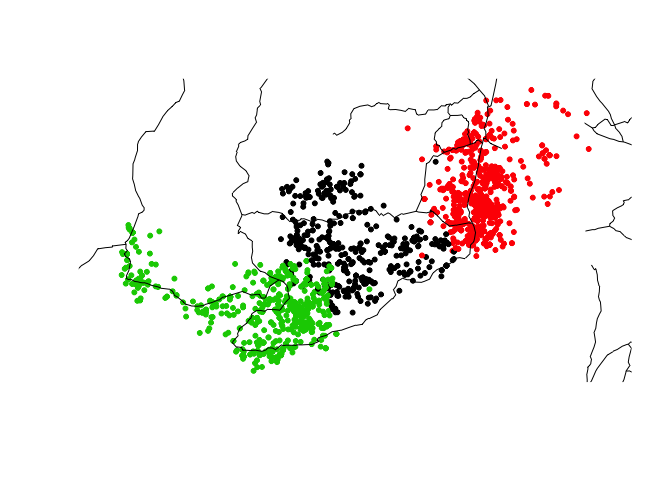

# Introduction to Spatial Data Analysis


### Rachel Voyt, Allison McNamara, and Silvy Van Kuijk
	[with modifications from Anthony Di Fiore]


## Preliminaries

Please install the following packages:

- {rgdal} - input/output and projetions
- {ggplot2} - our good ol' friend can also make beautiful maps!
- {dplyr} - data manipulation and transformation
- {ggmap} - {ggplot} and GIS had a baby and its name is {ggmap}
- {maptools} - tools for reading and handling spatial objects
- {sp} - classes and methods for spatial data
- {adehabitatHR} - a package for the analysis of the space use by animals
- {spatstat} - spatial point pattern analysis, model-fitting, simulation, tests
- {RColorBrewer} - brewin' some colors
- {curl} - get that data!
- {zoom} - zoomzoomzoom you make my heart go boomboomboom

## Objectives  

> In this lesson, you will learn about geospatial information and the analyses that can be done with it. We will download, manipulate, and transform data sets. Data can be projected in different ways for different purposes. We will use both home range data and geographic range data for our examples, and overlay these layers with other relevant data layers, such as altitude and land forms. This data can be visually and statistically analyzed.

## Introduction {.tabset}

Geospatial data is any information about a physical object, its location, and its context. Geospatial information is critical for analyzing data on landscapes, range, demographics, etc. Visualizing geospatial data on a map is helpful for thinking about the implications of your results. Spatial data analyses address questions that cannot be answered by simply looking at the data themselves, and are concerned with the quantitative location of important features.

### Why Use ***R*** for Geospatial Analysis??

You can project anything that you want on a map using geospatial methods in ***R***. Developers have been creating and updating ***R*** spatial data packages for the last 10 years. ***R*** is equipped to handle the large data sets that are often required for spatial analysis. A **Geographic Information System** (GIS) is a computer based system to aid in the collection, maintenance, storage, analysis, output, and distribution of spatial data and information. There are a variety of commercially available and open source GISs. ***ArcGIS***, for example, is a very sophisticated and expensive commerical product, but many of its functions and analyses can be done in ***R*** for free!


### Applications of GIS
* Create maps
* Visualize spatial data
* Project metadata
* Predict variables
* Layers and layers of spatial data visualization

### Key Concepts

A __Geographic Coordinate System__ is a spherical coordinate reference system for specifying locations of features on the curved surface of the earth used to define the spatial location and extent of geographic objects. Data are defined by a 3-D surface and measured in latitude and longitude. The longitude is the east or west location of a point, and the latitude is the north or south location of a point. WGS84 is a commonly used geographic coordinate system.

A __datum__ provides a frame of reference for describing locations on the surface of the earth.


A __Projected Coordinate System__ is a mathematical transformation that translates geographic coordinates onto some other surface, in most cases a flat 2-D grid. The __Universal Transverse Mercator projection (UTM)__ is the most common projection used in geospatial analyses. This is a cylindrical projection of the world's layout on a map that touches at the equator and divides the world into 60 zones.

<table><tr><td></td><td></tr></table>

__Raster data__ models are the natural means to represent continuous spatial features or phenomenon. They define the world as a regular set of cells in a grid pattern that are square and evenly spaced in the x and y directions.

__Vector data__ models use discrete elements such as points, lines, and polygons to represent the geometry of real-world entities.

__Shapefiles__ (.shp, .dbf, .shx, .prj, .sbn) are one common data format developed by ESRI and used by ***ArcGIS*** for storing non-topological geometry and attribute information for the spatial features in a data set. [Fortunately, ***R*** and other softwares are capable of reading and utilizing data in this format.] The geometry for a feature is stored as a shape comprising a set of vector coordinates. Shapefiles can support point, line, and area features. One can create a shapefile for use on a map by downloading from an external source, digitizing, or programming. Shapefiles can be projected on a map in layers and manipulated.

__Features__ are spatial descriptions of real-world objects that are stored as shapefiles. An example of a feature would be a road, a tree, or a swimming pool.

__Attributes__ are feature characteristics that can be associated with and stored alongside spatial data in a GIS. These characteristics can be used for producing different visualizations on a map and for spatially explicit analyses.


### Basic Types of Data
- __Point__: single point location, such as a GPS reading or a geocoded address (vector data)

- __Line__: set of ordered points, connected by straight line segments (vector data)

- __Polygon__: area, marked by one or more enclosing lines, possibly containing holes (vector data) 

- __Grid__: collection of points or rectangular cells, organised in a regular lattice (raster data)


## Recent Research and Applications

> **EXAMPLE:** Faust C, Dobson AP. 2015. Primate malarias: diversity, distribution and insights for zoonotic *Plasmodium*. *One Health* 1:66-75.

* The authors studied diversity of malaria causing protozoans in non-human primates in tropical and sub-tropical regions worldwide to understand human malarias and primate species barriers to malaria outbreaks.   
* Using ***R***, survey data was merged with IUCN spatial data for primate species geographic range  
* This map shows prevalence of primate malarias by tropical and sub-tropical (darker red=higher prevalence). The pie charts on the maps reflect the protozoa sampling methods used to test for malaria presence. As you can see, prevalence of malaria is high in non-human primate habitat regions throughout the world. 

<table><tr><td></td><td></td></tr></table>

> **EXAMPLE:** Williams AN, Ulm S, Cook AR, Langley MC, Collard M. 2013. Human refugia in Australia during the Last Glacial Maximum and Terminal Pleistocene: a geospatial analysis of the 25-12 ka Australian archaeological record. *Journal of Archaeological Science* 40:4612-4625.

* Evidence suggests that Aboriginal Australian populations took refuge (lived in isolated populations) in well-watered ranges and major riverine systems during the Last Glacial Maximum (~23-18 ka), the authors evaluate existing models of this process to determine possible locations of refugia.   
* Used ***ArcGIS***, ***R***, and the Geospatial Modelling Environment (GME) within ***ArcGIS***
* Below is one of the maps the authors create of the Interim Biogeographic Regionalization for Australia (IBRA), showing the 89 bioregions of Australia, each made up of interacting ecosystems.


> **EXAMPLE:** Vonhof MJ, Whitehead H, Fenton MB. 2003. Analysis of Spix's disc-winged bat association patterns and roosting home ranges reveal a novel social structure among bats. *Animal Behavior* 68:507-521.

* Using GIS methods from field work GPS points, authors found that various social groups of the same species overalp in space, but rarely interact socially, perhaps based on kinship and cooperation.
* The below map of the Cano Palma study region shows the different habitat types of _Thyroptera tricolor_ in gray, and the roosting home ranges of 21 social groups in the colored polygons.

<table><tr><td></td><td></td></tr></table>


## Useful Skills You'll Learn Today

* __Installing__ basemaps from multiple sources
* __Subsetting__ spatial data
* __Creating__ and download shapefiles
* __Manipulating__ shapefiles and polygons
* __Analyzing__ range use data
* __Accessing__, __analyzing__, and __transforming__ metadata
* __Making__ MAPS, MAPS, MAPS!


## Subsetting and Mapping Internet-Based Spatial Data {.tabset}

There are several sources of species spatial data that can be found for free on the internet. The IUCN Red List of Threatened Species is only one example, and offers comprehensive spatial datasets for mammals and many other animal groups. IUCN is great source because it includes information on the protected status of the species in addition to geographical ranges. The datasets can be found [here](http://www.iucnredlist.org/technical-documents/spatial-data), and additional information on the included attributes can be found [here](http://spatial-data.s3.amazonaws.com/groups/METADATA%20for%20Digital%20Distribution%20Maps%20of%20The%20IUCN%20Red%20List%20of%20Threatened%20Species%E2%84%A2.pdf).

The IUCN Red List also offers the opportunity to download spatial data for individual species, but in order to do so you must make an account and fill out a data request form. To avoid this extra step, you can instead use one of the comprehensive spatial datasets mentioned above and create a subset of your species of interest.

For this particular example, we want to look at home ranges for Callicebus species, so we'll be using the IUCN dataset for terrestrial mammals.

### Subsetting Spatial Data
#### Read in the IUCN spatial data for terrestrial mammals


```r
library(rgdal)
# tm <- readOGR(dsn =
# path.expand('~/Desktop/ADA/IUCN_Mammals'), layer
# = 'TERRESTRIAL_MAMMALS')
```

The package {rgdal} is one of many that you can use to load in spatial data. Here, the function `path.expand()` is needed only for MacOS users -- it allows the `readOGR()` function to understand the tilde (`~`). For other packages that can read in spatial data, check out Module 21 on the [Applied Data Analysis GitHub repository](https://github.com/difiore/applied-data-analysis).

> NOTE: When you download the terrestrial mammals file, the folder will automatically be named "TERRESTRIAL_MAMMALS" -- the same name as the shapefiles. If you try to read in spatial data with the `readOGR()` command where the `dsn` and `layer` names are the same, it will not work. Here, we've changed the folder name (the `dsn`) to IUCN_Mammals -- problem solved!

#### Subset spatial data for a species of interest

Before we can extract a subset of data that we are interested in (for example titi monkeys, from the genus *Callicebus*), we need to look at what attributes are included in our data. Attribute variables can be found with the command `names()`. In doing so, we see that there's an attribute labeled "genus_name" -- perfect! We can now subset our data for the *Callicebus* genus.


```r
# names(tm)
```

All shapefiles have both an attribute table and geometry data, which are both loaded automatically with the `readOGR()` command. The attribute table can be treated the same as a data frame (but isn't the same as a traditional data frame!), which is useful when we're trying to get a subset of our data. The next line of code asks ***R*** to select rows from our 'tm' dataset where "genus_name" is equal to *Callicebus*. Since we want to keep all of the columns associated with rows where "genus_name" is equal to *Callicebus*, we leave the area to the right of the comma blank. Here, we do not call specifically to the data slot of the 'tm' data object because we want to include spatial *and* attribute data included in our subset dataset.


```r
# subset <- tm[tm$genus_name=='Callicebus',]
```

#### Create a shapefile for the data subset

If we want to be able to work with this subset in future work, it might be nice to create a set of files separate from 'tm'. This way, we can avoid the ten minute wait-time needed to load the entire terrestrial mammals dataset every time we want to look at spatial data for *Callicebus* species specifically.

Still using package {rgdal}, we can create a new shapefile for our subset data with the function `writeOGR()` The function calls for a spatial data object, a data source name, a layer name, and a driver. Here, our object is our subset, which we want to store in the *callicebus_shapefiles* folder (our data source) with the name "callicebus" (our layer name). The "ESRI Shapefile" driver ensures that our output will be in shapefile format.


```r
# writeOGR(obj = subset, dsn =
# path.expand('~/Desktop/GIS+R_Data/callicebus_shapefiles'),
# layer = 'callicebus', driver = 'ESRI Shapefile')
```

Now that we've created a shapefile specifically for *Callicebus* species, we can load it in the same way we loaded our original terrestrial mammals dataset. To double check that we did this correctly, we use the `plot()` command. The `summary()` command gives us a look at the specific information included in our shapefile.

> NOTE: To run the code below, please download the "module-22-data" folder from ***GitHub*** to your desktop.


```r
# Read in subset spatial data
library(rgdal)
cbs <- readOGR(dsn = path.expand("~/Desktop/module-22-data/callicebus-shapefiles"), 
    layer = "callicebus")
```

```
## OGR data source with driver: ESRI Shapefile 
## Source: "/Users/christopherschmitt/Desktop/module-22-data/callicebus-shapefiles", layer: "callicebus"
## with 30 features
## It has 25 fields
## Integer64 fields read as strings:  presence origin seasonal year
```

```r
plot(cbs)
```

<!-- -->

```r
summary(cbs)
```

```
## Object of class SpatialPolygonsDataFrame
## Coordinates:
##         min        max
## x -78.45500 -36.410700
## y -25.19846   8.368336
## Is projected: FALSE 
## proj4string :
## [+proj=longlat +datum=WGS84 +no_defs +ellps=WGS84 +towgs84=0,0,0]
## Data attributes:
##      id_no                               binomial  presence origin
##  Min.   :    3549   Callicebus aureipalatii  : 1   1:30     1:30  
##  1st Qu.:   39943   Callicebus baptista      : 1                  
##  Median :   41552   Callicebus barbarabrownae: 1                  
##  Mean   :  527932   Callicebus bernhardi     : 1                  
##  3rd Qu.:   41561   Callicebus brunneus      : 1                  
##  Max.   :14699281   Callicebus caligatus     : 1                  
##                     (Other)                  :24                  
##  seasonal                 compiler    year   
##  1:30     Biodiversitas Brazil: 2   2008:28  
##           IUCN                :28   2011: 1  
##                                     2012: 1  
##                                              
##                                              
##                                              
##                                              
##                                                   citation 
##  Biodiversitas Brazil                                 : 2  
##  IUCN (International Union for Conservation of Nature):28  
##                                                            
##                                                            
##                                                            
##                                                            
##                                                            
##                 source   dist_comm  island   subspecies  subpop  
##  Defler et al. 2010: 1   NA's:30   NA's:30   NA's:30    NA's:30  
##  NA's              :29                                           
##                                                                  
##                                                                  
##                                                                  
##                                                                  
##                                                                  
##                legend   tax_comm     kingdom_na    phylum_nam
##  Extant (resident):30   NA's:30   ANIMALIA:30   CHORDATA:30  
##                                                              
##                                                              
##                                                              
##                                                              
##                                                              
##                                                              
##     class_name    order_name       family_nam      genus_name
##  MAMMALIA:30   PRIMATES:30   PITHECIIDAE:30   Callicebus:30  
##                                                              
##                                                              
##                                                              
##                                                              
##                                                              
##                                                              
##                      friendly_n code      shape_Leng     
##  Callicebus aureipalatii  : 1   CR: 3   Min.   : 0.8623  
##  Callicebus baptista      : 1   DD: 1   1st Qu.:10.7867  
##  Callicebus barbarabrownae: 1   EN: 3   Median :19.7031  
##  Callicebus bernhardi     : 1   LC:18   Mean   :19.8109  
##  Callicebus brunneus      : 1   NT: 1   3rd Qu.:24.8889  
##  Callicebus caligatus     : 1   VU: 4   Max.   :58.1452  
##  (Other)                  :24                            
##    shape_Area      
##  Min.   : 0.05671  
##  1st Qu.: 2.10393  
##  Median :10.41275  
##  Mean   :17.06826  
##  3rd Qu.:18.99769  
##  Max.   :77.41465  
## 
```

### Mapping Spatial Data with {ggplot2} and {ggmap}


The ***R*** package {ggmap} is based on the {ggplot2} package and can be used to replace the base graphics in R. While the function `qplot()` and `ggplot()` from {ggplot2} require more data preparation than the base `plot()` function, {ggplot2} automatically selects colors and legends with more visually appealing defaults.

#### Transforming spatial data for {ggplot2}

While `plot()` from ***R*** base graphics can use spatial objects like our *cbs* object directly, {ggplot2} instead requires spatial data to be supplied as a traditional data frame. To start, then, we need to transform our data so that {ggplot2} can read it. Recall from `summary(cbs)` that our data is said to be of class "SpatialPolygonsDataFrame". This type of data frame is **not** the same as a traditional data frame -- it contains multiple layers for every piece of information, as can be seen by running `str(cbs)`.


```r
str(cbs, list.len = 5)
```

```
## Formal class 'SpatialPolygonsDataFrame' [package "sp"] with 5 slots
##   ..@ data       :'data.frame':	30 obs. of  25 variables:
##   .. ..$ id_no     : num [1:30] 39928 39929 39930 39943 39944 ...
##   .. ..$ binomial  : Factor w/ 30 levels "Callicebus aureipalatii",..: 24 3 18 21 17 9 12 25 19 10 ...
##   .. ..$ presence  : Factor w/ 1 level "1": 1 1 1 1 1 1 1 1 1 1 ...
##   .. ..$ origin    : Factor w/ 1 level "1": 1 1 1 1 1 1 1 1 1 1 ...
##   .. ..$ seasonal  : Factor w/ 1 level "1": 1 1 1 1 1 1 1 1 1 1 ...
##   .. .. [list output truncated]
##   ..@ polygons   :List of 30
##   .. ..$ :Formal class 'Polygons' [package "sp"] with 5 slots
##   .. .. .. ..@ Polygons :List of 1
##   .. .. .. .. ..$ :Formal class 'Polygon' [package "sp"] with 5 slots
##   .. .. .. .. .. .. ..@ labpt  : num [1:2] -73.5 3.29
##   .. .. .. .. .. .. ..@ area   : num 1.94
##   .. .. .. .. .. .. ..@ hole   : logi FALSE
##   .. .. .. .. .. .. ..@ ringDir: int 1
##   .. .. .. .. .. .. ..@ coords : num [1:537, 1:2] -73 -73 -73 -73 -73 ...
##   .. .. .. ..@ plotOrder: int 1
##   .. .. .. ..@ labpt    : num [1:2] -73.5 3.29
##   .. .. .. ..@ ID       : chr "0"
##   .. .. .. ..@ area     : num 1.94
##   .. ..$ :Formal class 'Polygons' [package "sp"] with 5 slots
##   .. .. .. ..@ Polygons :List of 1
##   .. .. .. .. ..$ :Formal class 'Polygon' [package "sp"] with 5 slots
##   .. .. .. .. .. .. ..@ labpt  : num [1:2] -40.3 -11.7
##   .. .. .. .. .. .. ..@ area   : num 10.8
##   .. .. .. .. .. .. ..@ hole   : logi FALSE
##   .. .. .. .. .. .. ..@ ringDir: int 1
##   .. .. .. .. .. .. ..@ coords : num [1:54, 1:2] -38.8 -38.8 -38.7 -38.9 -39 ...
##   .. .. .. ..@ plotOrder: int 1
##   .. .. .. ..@ labpt    : num [1:2] -40.3 -11.7
##   .. .. .. ..@ ID       : chr "1"
##   .. .. .. ..@ area     : num 10.8
##   .. ..$ :Formal class 'Polygons' [package "sp"] with 5 slots
##   .. .. .. ..@ Polygons :List of 2
##   .. .. .. .. ..$ :Formal class 'Polygon' [package "sp"] with 5 slots
##   .. .. .. .. .. .. ..@ labpt  : num [1:2] -39.8 -15.2
##   .. .. .. .. .. .. ..@ area   : num 8.4
##   .. .. .. .. .. .. ..@ hole   : logi FALSE
##   .. .. .. .. .. .. ..@ ringDir: int 1
##   .. .. .. .. .. .. ..@ coords : num [1:967, 1:2] -38.9 -38.8 -38.8 -38.8 -38.8 ...
##   .. .. .. .. ..$ :Formal class 'Polygon' [package "sp"] with 5 slots
##   .. .. .. .. .. .. ..@ labpt  : num [1:2] -39.6 -18.1
##   .. .. .. .. .. .. ..@ area   : num 2e-05
##   .. .. .. .. .. .. ..@ hole   : logi TRUE
##   .. .. .. .. .. .. ..@ ringDir: int -1
##   .. .. .. .. .. .. ..@ coords : num [1:6, 1:2] -39.6 -39.6 -39.6 -39.6 -39.6 ...
##   .. .. .. ..@ plotOrder: int [1:2] 1 2
##   .. .. .. ..@ labpt    : num [1:2] -39.8 -15.2
##   .. .. .. ..@ ID       : chr "2"
##   .. .. .. ..@ area     : num 8.4
##   .. ..$ :Formal class 'Polygons' [package "sp"] with 5 slots
##   .. .. .. ..@ Polygons :List of 1
##   .. .. .. .. ..$ :Formal class 'Polygon' [package "sp"] with 5 slots
##   .. .. .. .. .. .. ..@ labpt  : num [1:2] -46.6 -20.8
##   .. .. .. .. .. .. ..@ area   : num 42.6
##   .. .. .. .. .. .. ..@ hole   : logi FALSE
##   .. .. .. .. .. .. ..@ ringDir: int 1
##   .. .. .. .. .. .. ..@ coords : num [1:1472, 1:2] -43.1 -43 -43 -43 -43 ...
##   .. .. .. ..@ plotOrder: int 1
##   .. .. .. ..@ labpt    : num [1:2] -46.6 -20.8
##   .. .. .. ..@ ID       : chr "3"
##   .. .. .. ..@ area     : num 42.6
##   .. ..$ :Formal class 'Polygons' [package "sp"] with 5 slots
##   .. .. .. ..@ Polygons :List of 1
##   .. .. .. .. ..$ :Formal class 'Polygon' [package "sp"] with 5 slots
##   .. .. .. .. .. .. ..@ labpt  : num [1:2] -75.688 0.417
##   .. .. .. .. .. .. ..@ area   : num 1.27
##   .. .. .. .. .. .. ..@ hole   : logi FALSE
##   .. .. .. .. .. .. ..@ ringDir: int 1
##   .. .. .. .. .. .. ..@ coords : num [1:419, 1:2] -75.9 -75.9 -75.9 -75.9 -75.8 ...
##   .. .. .. ..@ plotOrder: int 1
##   .. .. .. ..@ labpt    : num [1:2] -75.688 0.417
##   .. .. .. ..@ ID       : chr "4"
##   .. .. .. ..@ area     : num 1.27
##   .. .. [list output truncated]
##   ..@ plotOrder  : int [1:30] 14 21 10 4 8 16 20 22 12 24 ...
##   ..@ bbox       : num [1:2, 1:2] -78.45 -25.2 -36.41 8.37
##   .. ..- attr(*, "dimnames")=List of 2
##   .. .. ..$ : chr [1:2] "x" "y"
##   .. .. ..$ : chr [1:2] "min" "max"
##   ..@ proj4string:Formal class 'CRS' [package "sp"] with 1 slot
##   .. .. ..@ projargs: chr "+proj=longlat +datum=WGS84 +no_defs +ellps=WGS84 +towgs84=0,0,0"
```
  
We can transform our data into a traditional data frame using the `fortify()` command from the {ggplot2} package. 


```r
library(ggplot2)
cbs_f <- fortify(cbs)
```

```
## Regions defined for each Polygons
```

```r
head(cbs_f)
```

```
##       long      lat order  hole piece id group
## 1 -73.0338 4.676036     1 FALSE     1  0   0.1
## 2 -73.0113 4.659236     2 FALSE     1  0   0.1
## 3 -72.9944 4.645136     3 FALSE     1  0   0.1
## 4 -72.9804 4.625536     4 FALSE     1  0   0.1
## 5 -72.9663 4.597436     5 FALSE     1  0   0.1
## 6 -72.9579 4.560936     6 FALSE     1  0   0.1
```

Looking at our fortified data, we can see that we have lost the attribute information associated with the "cbs" object. To rejoin the spatial and non-spatial datasets, we use the `left_join()` function from the {dplyr} package. 


```r
library(dplyr)
```

```
## 
## Attaching package: 'dplyr'
```

```
## The following objects are masked from 'package:stats':
## 
##     filter, lag
```

```
## The following objects are masked from 'package:base':
## 
##     intersect, setdiff, setequal, union
```

```r
# Allocate an id variable to cbs data to guide
# merge
cbs$id <- row.names(cbs)

# Join fortified geospatial data with attribute
# data
cbs_f <- left_join(cbs_f, cbs@data)
```

```
## Joining, by = "id"
```

```r
head(cbs_f, n = 6)
```

```
##       long      lat order  hole piece id group id_no           binomial
## 1 -73.0338 4.676036     1 FALSE     1  0   0.1 39928 Callicebus ornatus
## 2 -73.0113 4.659236     2 FALSE     1  0   0.1 39928 Callicebus ornatus
## 3 -72.9944 4.645136     3 FALSE     1  0   0.1 39928 Callicebus ornatus
## 4 -72.9804 4.625536     4 FALSE     1  0   0.1 39928 Callicebus ornatus
## 5 -72.9663 4.597436     5 FALSE     1  0   0.1 39928 Callicebus ornatus
## 6 -72.9579 4.560936     6 FALSE     1  0   0.1 39928 Callicebus ornatus
##   presence origin seasonal compiler year
## 1        1      1        1     IUCN 2008
## 2        1      1        1     IUCN 2008
## 3        1      1        1     IUCN 2008
## 4        1      1        1     IUCN 2008
## 5        1      1        1     IUCN 2008
## 6        1      1        1     IUCN 2008
##                                                citation source dist_comm
## 1 IUCN (International Union for Conservation of Nature)   <NA>      <NA>
## 2 IUCN (International Union for Conservation of Nature)   <NA>      <NA>
## 3 IUCN (International Union for Conservation of Nature)   <NA>      <NA>
## 4 IUCN (International Union for Conservation of Nature)   <NA>      <NA>
## 5 IUCN (International Union for Conservation of Nature)   <NA>      <NA>
## 6 IUCN (International Union for Conservation of Nature)   <NA>      <NA>
##   island subspecies subpop            legend tax_comm kingdom_na
## 1   <NA>       <NA>   <NA> Extant (resident)     <NA>   ANIMALIA
## 2   <NA>       <NA>   <NA> Extant (resident)     <NA>   ANIMALIA
## 3   <NA>       <NA>   <NA> Extant (resident)     <NA>   ANIMALIA
## 4   <NA>       <NA>   <NA> Extant (resident)     <NA>   ANIMALIA
## 5   <NA>       <NA>   <NA> Extant (resident)     <NA>   ANIMALIA
## 6   <NA>       <NA>   <NA> Extant (resident)     <NA>   ANIMALIA
##   phylum_nam class_name order_name  family_nam genus_name
## 1   CHORDATA   MAMMALIA   PRIMATES PITHECIIDAE Callicebus
## 2   CHORDATA   MAMMALIA   PRIMATES PITHECIIDAE Callicebus
## 3   CHORDATA   MAMMALIA   PRIMATES PITHECIIDAE Callicebus
## 4   CHORDATA   MAMMALIA   PRIMATES PITHECIIDAE Callicebus
## 5   CHORDATA   MAMMALIA   PRIMATES PITHECIIDAE Callicebus
## 6   CHORDATA   MAMMALIA   PRIMATES PITHECIIDAE Callicebus
##           friendly_n code shape_Leng shape_Area
## 1 Callicebus ornatus   VU   9.618908   1.939651
## 2 Callicebus ornatus   VU   9.618908   1.939651
## 3 Callicebus ornatus   VU   9.618908   1.939651
## 4 Callicebus ornatus   VU   9.618908   1.939651
## 5 Callicebus ornatus   VU   9.618908   1.939651
## 6 Callicebus ornatus   VU   9.618908   1.939651
```

Taking a peek at our fortified "cbs" data shows that our attribute data has been successfully added back in.

Now that our spatial data is in a form that {ggplot2} can work with, we can produce a map! 

#### Mapping with {ggplot2}

Similar to other plots made with {ggplot2}, our maps are produced in layers of various {ggplot2} commands. Line by line, the code for our map works as follows: Within the `ggplot()` command, we assign the data we wish to use (cbs_f) and then set the aesthetics. Our data is in lat/long format, and "group=group" points `ggplot()` to the "group" column added by `fortify()` and identifies the groups of coordinates that pertain to individual polygons. Since we want to look at distributions of different species, we set the fill to "friendly_n" (the IUCN version of species name). `geom_polygon()` tells `ggplot()` the type of data we're plotting (polygons), and `coord_equal()` ensures that the scales of the axes are equal to the specified ratio, where the default is equal to 1 (i.e., an equal length on both axis represents the same change in units). Then we can put on some labels, a title, and we're good to go!


```r
map <- ggplot(cbs_f, aes(long, lat, group = group, 
    fill = friendly_n)) + geom_polygon() + coord_equal() + 
    labs(x = "Longitude", y = "Latitude") + ggtitle("Callicebus Distributions") + 
    scale_fill_discrete(name = "Species")
map
```

<!-- -->

#### Adding base maps to {ggplot2} with {ggmap}

While it's handy to have a general sense of how species distributions are laid out, we ultimately want to know where they're situated on a base map. This is where {ggmap} comes in. With {ggmap}, we can create a base map that will ultimately be overlaid with our species distribution data.

Before we create the base map, we first need to create the **bounding box** for our "cbs" data so that we can identify the extent of the image tiles that we need to collect from a remote map server site. For this, we use the `bbox()` function from the {sp} package.


```r
bb <- bbox(cbs)
b <- (bb - rowMeans(bb)) * 1.05 + rowMeans(bb)
```

The first line of code above identifies the bounding box based on our "cbs" spatial data. The second line of code zooms in on your bounding box by about 5%. To zoom in farther, replace 1.05 with 1.xx for an xx% increase in the plot size.

With our bounding box in hand, we can load in a base map with {ggmap}!

{ggmap} can create base maps from a variety of web map server sites, including Google Maps, OpenStreetMap, Stamen maps, or CloudMade maps using the command `get_map()`. Today we'll be using maps from Stamen -- the watercolor map for its ridiculous beauty and the toner map to so we can see country borders. For more information on the different map types available from the `get_map()` command, check out [this site](https://www.r-bloggers.com/gps-basemaps-in-r-using-get_map/).

First, we retrieve the map.


```r
library(ggmap)

# Watercolor map
sa_wcmap <- get_map(location = b, source = "stamen", 
    maptype = "watercolor")
```

Then we plot it using the `ggmap()` function.


```r
sa_wcmap <- ggmap(sa_wcmap)
sa_wcmap
```

<!-- -->

Here, we retrieve a different map type from Stamen and then plot it.


```r
# Toner map
sa_tmap <- get_map(location = b, source = "stamen", 
    maptype = "toner")
sa_tmap <- ggmap(sa_tmap)
sa_tmap
```

<!-- -->

Success! Base maps have been successfully acquired. We can now take our "cbs" spatial data from earlier and map it onto one of these base maps.

Here, we take our base map and add our fortified data in `geom_polygon()`. Be sure to add in "data=" before calling your data, otherwise {ggplot2} will throw an error message at you. Everything else in this step is the same as when we originally mapped the "cbs" data, apart from the "alpha=" and the border "linetype=" arguments. The alpha value defines the transparency of the polygon's fill, where the default = 1 (opaque). "linetype=1" calls for a solid line with a "burlywood3" color.


```r
map <- sa_wcmap + geom_polygon(data = cbs_f, aes(long, 
    lat, group = group, fill = friendly_n), alpha = 0.5, 
    color = "burlywood3", linetype = 1) + coord_equal() + 
    labs(x = "Longitude", y = "Latitude") + ggtitle("Callicebus Distributions") + 
    scale_fill_discrete(name = "Species")
map
```

<!-- -->

This is a decent map, but there's not a ton of differentiation between colors.


We can change the colors using the {RColorBrewer} package. However, the palettes available only provide up to 12 colors and we need 30 to cover all of the *Callicebus* species in our dataset. The first chunk of code expands the "Spectral" color palette, and is subsequently incorporated into the map.


```r
library(RColorBrewer)

# Expand color palette
colourCount = length(unique(cbs$friendly_n))
getPalette = colorRampPalette(brewer.pal(11, "Spectral"))

# New colors, new map!
map <- sa_wcmap + geom_polygon(data = cbs_f, aes(long, 
    lat, group = group, fill = friendly_n), alpha = 0.7, 
    color = "burlywood3", linetype = 1) + scale_fill_manual(values = getPalette(colourCount), 
    name = "Species") + coord_equal() + labs(x = "Longitude", 
    y = "Latitude") + ggtitle("Callicebus Distributions")
map
```

<!-- -->

#### Adding other Geospatial Data

Now that we know where our species distributions are located in South America, it may also be helpful to add in geographical data such as rivers, lakes, and elevation. These can be helpful in determining what influences species distributions.

River and lake data can be found for free on [Natural Earth](http://www.naturalearthdata.com/) under the downloads section. They provide many other kinds of data that you can download as well, so it's good resource to keep in mind for future mapping projects.

For rivers and lakes, Natural Earth provides a few different file options depending on the scale of your data. They range from detailed maps for large-scale data to basic maps for small-scale data. Today we'll be using the most detailed map. 

Natural Earth also allows you to choose between the basic file and the file with scale ranks + tapering. For our purposes, it doesn't make a difference which you choose; since we're zoomed out fairly far, they look exactly the same when they're mapped. 

Just like we've done earlier, before we map our river and lake data, we need to load it in and `fortify()` it so that it can be read by {ggplot2}.


```r
water <- readOGR(dsn = path.expand("~/Desktop/module-22-data/rivers+lakes"), 
    layer = "ne_10m_rivers_lake_centerlines")
```

```
## OGR data source with driver: ESRI Shapefile 
## Source: "/Users/christopherschmitt/Desktop/module-22-data/rivers+lakes", layer: "ne_10m_rivers_lake_centerlines"
## with 1454 features
## It has 7 fields
## Integer64 fields read as strings:  rivernum
```

```r
summary(water)
```

```
## Object of class SpatialLinesDataFrame
## Coordinates:
##          min       max
## x -164.90347 177.52036
## y  -52.15773  75.79348
## Is projected: FALSE 
## proj4string :
## [+proj=longlat +datum=WGS84 +no_defs +ellps=WGS84 +towgs84=0,0,0]
## Data attributes:
##                 dissolve      scalerank                featurecla  
##  178River           :   2   Min.   : 0.000   Lake Centerline: 253  
##  724River           :   2   1st Qu.: 6.000   River          :1201  
##  0River             :   1   Median : 7.000                         
##  1000Lake Centerline:   1   Mean   : 6.825                         
##  1000River          :   1   3rd Qu.: 8.000                         
##  (Other)            :1444   Max.   :10.000                         
##  NA's               :   3                                          
##         name                   name_alt       rivernum   
##  San Juan :   7   Aliakmonas       :   1   0      :   4  
##  Verde    :   6   Chixoy           :   1   303    :   3  
##  Angara   :   4   Drava            :   1   1000   :   2  
##  Chico    :   4   La Grande Rivi?re:   2   1001   :   2  
##  Churchill:   4   Meuse            :   1   1002   :   2  
##  (Other)  :1339   NA's             :1448   1003   :   2  
##  NA's     :  90                            (Other):1439  
##                                         note     
##  Changed in 2.0                           :   7  
##  linework edited 20121205                 :   1  
##  Version 1.2 edit in N. America and Europe:  30  
##  Version 1.3                              :   3  
##  NA's                                     :1413  
##                                                  
## 
```

```r
water_f <- fortify(water)
water$id <- row.names(water)
water_f <- left_join(water_f, water@data)
```

```
## Joining, by = "id"
```

Now we can map it with {ggplot2}! First, let's see how the rivers and lakes look without our species distributions. We'll use the watercolor base map for a cleaner look.


```r
watermap <- sa_wcmap + geom_path(data = water_f, aes(x = long, 
    y = lat, group = group))
watermap
```

<!-- -->

Et voila! Our waterways have been mapped! Because we're working with spatial lines data (not polygons, as with our species distributions), we need to use the `geom_path()` command in the map above. You may be tempted to use `geom_line()`, but don't! `geom_line()` uses the order of the x-axis to connect the points, and will end up putting in lines where they don't belong. `geom_path()` uses the actual order of the values in the data frame.

> NOTE: This base map and others that you can get with {ggmap} actually already have waterways, but you can't see them unless you're zoomed in quite a bit farther. However, you can't manipulate these waterways like you can with the waterways spatial data.

Now we can combine our waterways data with our species distributions!


```r
water_cbs <- sa_wcmap + geom_polygon(data = cbs_f, 
    aes(long, lat, group = group, fill = friendly_n), 
    alpha = 0.7, color = "burlywood3", linetype = 1) + 
    scale_fill_manual(values = getPalette(colourCount), 
        name = "Species") + geom_path(data = water_f, 
    aes(x = long, y = lat, group = group)) + coord_equal() + 
    labs(x = "Longitude", y = "Latitude") + ggtitle("Callicebus Distributions")
water_cbs
```

<!-- -->

As a final exercise, we can also look at our *Callicebus* species ranges by IUCN code. This may be useful in determining how geographic data may affect species vulnerability. The only change we need to make here is change the fill to "code". 

```r
names(cbs)
```

```
##  [1] "id_no"      "binomial"   "presence"   "origin"     "seasonal"  
##  [6] "compiler"   "year"       "citation"   "source"     "dist_comm" 
## [11] "island"     "subspecies" "subpop"     "legend"     "tax_comm"  
## [16] "kingdom_na" "phylum_nam" "class_name" "order_name" "family_nam"
## [21] "genus_name" "friendly_n" "code"       "shape_Leng" "shape_Area"
## [26] "id"
```

```r
cbs_code <- sa_wcmap + geom_polygon(data = cbs_f, aes(long, 
    lat, group = group, fill = code), alpha = 0.5, 
    color = "burlywood3", linetype = 1) + coord_equal() + 
    labs(x = "Longitude", y = "Latitude") + ggtitle("IUCN Status")
cbs_code
```

<!-- -->

## Home Range Analysis with GPS Data {.tabset}
### Importing data
#### Importing and projecting a shapefile

For this next section we will be looking at data on home range use by three groups of titi monkeys (*Callicebus discolor*) that are studied at the Tiputini Biodiversity Station in Ecuador. 

<table><tr><td></td><td></td></tr></table>

These data have been collected with a GPS. Every twenty seconds the GPS collects a *ranging point* automatically, which consists of the x and y coordinates for the location, altitude of the location, and a timestamp. From that, we (read: Tony) have created a `.csv` file that contains a subset of these points, twenty minutes apart. For today's purposes we will use a subset of data from a one-year period: July 2014 to June 2015.

Let's first load in a polygon of the trail sytem at research station. This can be done with the `readShapeLines()` command in the {maptools} package. 


```r
library(maptools)
```

```
## Checking rgeos availability: FALSE
##  	Note: when rgeos is not available, polygon geometry 	computations in maptools depend on gpclib,
##  	which has a restricted licence. It is disabled by default;
##  	to enable gpclib, type gpclibPermit()
```

```r
tbs <- readShapeLines("~/Desktop/module-22-data/tiputini/trail_polylines.shp")
plot(tbs)
```

<!-- -->

So once you have loaded in a shapefile, it is important to first find out what coordinate system is used, if any. This is done easily with the `proj4string` commands and functions in the package {sp}.


```r
tbs@proj4string  # This command shows us that there is no Coordinate System assigned to the TBS shapefile. 
```

```
## CRS arguments: NA
```

To be sure there are no coordinate data related to the file in any way, run the following code also from the {sp} package. Even though it seems there is no chosen projection, in this case our new projection will not be used correctly without using this command first.


```r
proj4string(tbs) <- NA_character_  # remove Coordinate Reference System information from TBS shapefile.
```

Now we can specify our new coordinate system, which will be the Projected Coordinate System UTM (Universal Transverse Mercator). This projects the earth on a flat surface and then uses x and y coordinates to pinpoint locations on a 2D surface. The command for this is `CRS()` from the {sp} package.


```r
proj4string(tbs) <- CRS("+proj=utm +zone=18 +south +datum=WGS84")  #Setting UTM WGS84 as our Coordinate Reference System (CRS).
plot(tbs)
```

<!-- -->

#### Importing and projecting `.csv` data

Now that we have defined the coordinate system of the shapefile, we can pull in the ranging data collected from the titi monkeys between July 2014 to June 2015. These data have been cleaned in advance and stored in a `.csv` file on GitHub.


```r
library(curl)
f <- curl("https://raw.githubusercontent.com/fuzzyatelin/fuzzyatelin.github.io/master/AN597_Fall17/module-22-data/GPScoordinates.csv")
points <- read.csv(f)
head(points)
```

```
##   Obs.Sample.ID     Date Month        Group     UTMX    UTMY
## 1       OS92719 4-Jul-14     7 Callicebus L 371667.0 9929338
## 2       OS92719 4-Jul-14     7 Callicebus L 371647.7 9929378
## 3       OS92719 4-Jul-14     7 Callicebus B 371664.1 9929523
## 4       OS92719 4-Jul-14     7 Callicebus B 371747.5 9929529
## 5       OS92719 4-Jul-14     7 Callicebus B 371711.8 9929542
## 6       OS92719 4-Jul-14     7 Callicebus B 371700.1 9929542
```

As you can see, the coordinates in this file are already in the UTM projection, but we will have to tell ***R*** that. This is also done through commands in the {sp} package. First, you'll have to convert the `.csv` file to a special dataframe for spatial points, and then set the right coordinate system.


```r
utm <- SpatialPointsDataFrame(coords = c(points[5], 
    points[6]), data = points[4])  #Column 5 has the X-coordinates, column 6 has the Y-coordinates, and column 4 has important attribute data.
str(utm)
```

```
## Formal class 'SpatialPointsDataFrame' [package "sp"] with 5 slots
##   ..@ data       :'data.frame':	1719 obs. of  1 variable:
##   .. ..$ Group: Factor w/ 3 levels "Callicebus B",..: 3 3 1 1 1 1 1 1 2 2 ...
##   ..@ coords.nrs : num(0) 
##   ..@ coords     : num [1:1719, 1:2] 371667 371648 371664 371747 371712 ...
##   .. ..- attr(*, "dimnames")=List of 2
##   .. .. ..$ : NULL
##   .. .. ..$ : chr [1:2] "UTMX" "UTMY"
##   ..@ bbox       : num [1:2, 1:2] 371376 9929241 372130 9929694
##   .. ..- attr(*, "dimnames")=List of 2
##   .. .. ..$ : chr [1:2] "UTMX" "UTMY"
##   .. .. ..$ : chr [1:2] "min" "max"
##   ..@ proj4string:Formal class 'CRS' [package "sp"] with 1 slot
##   .. .. ..@ projargs: chr NA
```

```r
plot(utm, pch = 1, col = utm$Group)
```

<!-- -->

```r
# set the projection
proj4string(utm) <- "+proj=utm +zone=18 +south +datum=WGS84"

# If you would then like to transform your data to
# Lat/Long rather then UTM, you can use this code:
# latlon <- spTransform(utm, CRS('+proj=longlat
# +datum=WGS84'))

plot(tbs)
plot(utm, pch = 20, col = utm$Group, add = T)  #Simply adding add = TRUE to your code will overlay the second plot on the first.
```

<!-- -->

If you want to see the map at the scale of the home range points, you simple load that before adding the trail system polygon:

```r
plot(utm, pch = 20, col = utm$Group)
plot(tbs, add = T)
```

<!-- -->

If you want to zoom in or out on your plots, you can use a simple command from the {zoom} package. The code block below isn't evaluated, because you can only use this command directly in your ***R*** console. Type the following.

> NOTE: This may work better on Windows rather than MacOS systems.


```r
library(zoom)
inout.zoom()
```

Now you can zoom in by left-clicking on your plot. By left-clicking near the edge of your plot you can zoom out. Last, you can leave this function by hitting Escape.

> NOTE: Always make sure that every file you work with has the same coordinate system. If you have different projections or datums, your layers will not overlay and you'll likely feel like the baboon in this GIF. These problems are created by the fact that geographical and projected coordinate systems project data in a different way (in 3D versus 2D representations, respectively) and the fact that the Earth isn't actually perfectly round!


<table><tr><td></td><td></td></tr></table>


### Analyzing home range use data
#### Creating home range polygons and estimating home range size

Now that we have all points plotted, we can draw polygons around the points of each group, representing the home ranges of the monkeys during the one-year period. We'll do this with the help of a package build especially for home range measurements: {adehabitatHR}

> NOTE: the functions in this package work best if you use the UTM projections!

First we calculate the utilization distribution with the help of the `kernelUD()` command. The ulitization distribution is a two dimensional probability density function that represents the probability of finding an animal in a defined area within its home range. Next we will use the command `getverticeshr()` to draw polygons around the kernel UD's that have just been calculates. 


```r
library(adehabitatHR)
kernel <- kernelUD(utm[, 1], h = "href")
TitiRange <- getverticeshr(kernel, 95)
plot(utm, pch = 20, col = utm$Group)
plot(tbs, add = T)
plot(TitiRange, border = TitiRange@data$id, add = T)
```

<!-- -->

There are many ways to calculate home range sizes, but by far the quickest and easiest way to calculate home range size is by using the `as.data.frame()` command. If you are working with Lat/Long coordinates, you will want to reproject them into UTM coordinates, because the function below only gives you a home range size in hectares if you use UTM coordinates (which are usually in meters).


```r
as.data.frame(TitiRange)
```

```
##                        id     area
## Callicebus B Callicebus B 6.195812
## Callicebus K Callicebus K 4.276863
## Callicebus L Callicebus L 6.643743
```

#### How are home ranges used? 

Let's look only at the home range of *Callicebus* group L. Using our points, we can also find out which parts of their home range are used more often, and which parts are used less frequently.

First, let's subset the data so we only have the ranging points of Callicebus L.


```r
library(RColorBrewer)
Lpoints <- points[points$Group == "Callicebus L", ]
```

There are many ways to create a "heat map", which colors space by intensity of use, but the easiest way seems to be through {ggplot}. You use the ranging points from group Callicebus L and then create the heat map by adding `stat_density2d()`. You can add fancy colors with the **RColorBrewer** package.


```r
hothothot <- ggplot(Lpoints, aes(x = UTMX, y = UTMY)) + 
    stat_density2d(aes(fill = ..density..), geom = "tile", 
        contour = FALSE) + geom_point(size = 0.25) + 
    scale_fill_gradientn(colours = rev(brewer.pal(7, 
        "Spectral"))) + coord_fixed() + ggtitle("Titis Like it HOTHOTHOT") + 
    theme(legend.position = "none")
hothothot
```

<!-- -->

## Additional Resources and Useful Links

[Use R!: Applied Spatial Data Analysis with R](http://gis.humboldt.edu/OLM/r/Spatial%20Analysis%20With%20R.pdf)

[R useful cheatsheet](www.maths.lancs.ac.uk/~rowlings/Teaching/UseR2012/cheatsheet.html)
  
[Introduction to Visualizing Spatial Data in R](https://cran.r-project.org/doc/contrib/intro-spatial-rl.pdf)

[Everything you'll ever need to know about shapefiles, and then some](https://www.esri.com/library/whitepapers/pdfs/shapefile.pdf)

[Working with IUCN Data with "LetsR](http://onlinelibrary.wiley.com/store/10.1111/2041-210X.12401/asset/supinfo/mee312401-sup-0002-ExamplecodeSuppInfo.Rmd?v=1&s=79b3e14248ed0592592acf64b0500f2f82462564)
