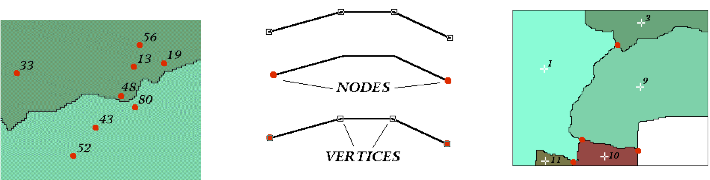
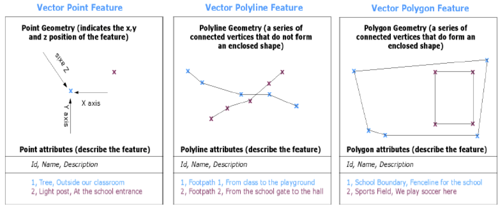
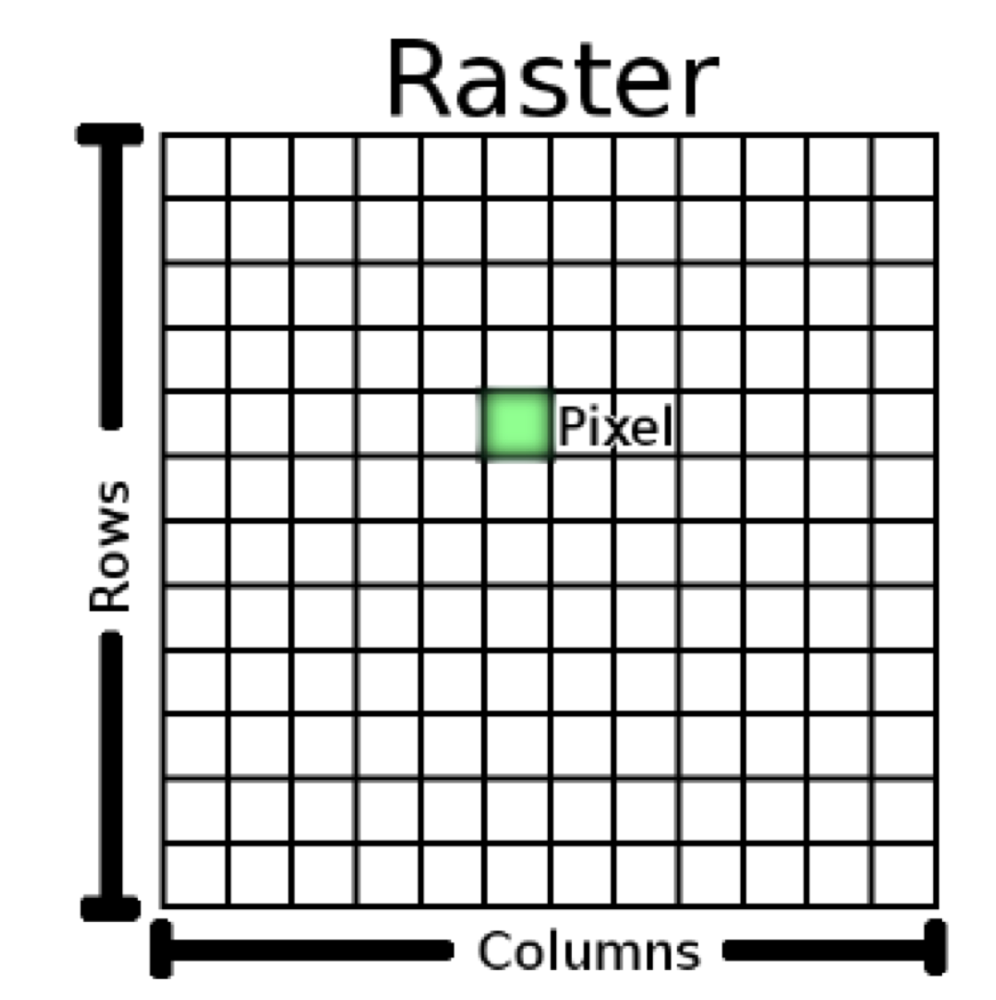
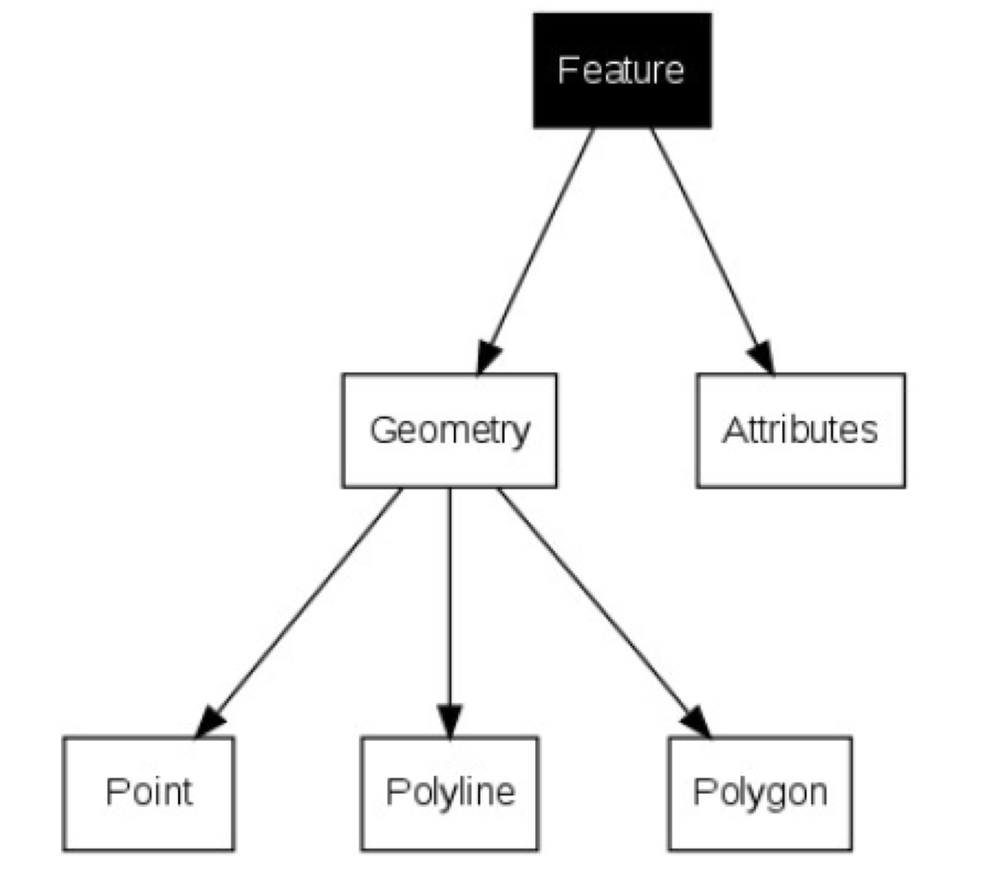

```{r setup, include=FALSE}
knitr::opts_chunk$set(
	echo = TRUE,
	fig.path = "img/",
	warning = FALSE,
	comment = "##",
	prompt = FALSE,
	tidy = TRUE,
	cache = TRUE,
	tidy.opts = list(width.cutoff = 75)
)
```
# Introduction to Spatial Data Analysis in ***R***

## Preliminaries
- The following packages are useful for dealing with spatial data in ***R***. Let's go ahead and install and load the following {sp}, {raster}, {rgdal}, {maptools}, {tmap}, {ggmap}, {GISTools}, {plotKML}

> NOTE: Additional useful packages include: {rasterVis} (raster visualisation), {mapdata} and {maps} (various map datasets), {OpenStreetMap} (access OSM data), {plotGoogleMaps}.

Also install the packages {rgbif}, {spocc}, and {dismo}, which provide access to Global Biodiversity Information Facility data. 

Finally, download the folder called "GISDATA" from our ***GitHub*** data repository to your desktop.

``` {r}
library(sp)  # classes and methods for spatial (vector) data
library(raster)  # classes and methods for grids, raster data
library(rgdal) # R bindings for the Geospatial Data Abstraction Library... input/output, projections
library(maptools) # tools for reading and handling spatial objects... input/output, projections
library(tmap) # thematic maps
library(ggmap) # map extension to ggplot2; allows downloading of maps from various web servers
library(GISTools) # eye candy for maps plus other functions
library(plotKML) # can read .gpx and can write KML files
```

## ***R*** as a Geographic Information System (GIS)

A **Geographic Information System (GIS)** is used for organization, visualization, and analysis of spatial data.

Involves:

- Digital data - the information you will view and analyze using computer software and hardware

- Computer hardware - computers/servers uses for storing, visualizing, and processing data

- Computer software - programs (e.g., ***R***, ***QGIS***, ***ArcGIS***, spatial databases) and functions run on hardware that allow you to work with digital data

GIS data typically includes **geographical data** (e.g., coordinates) plus nongeographical **attributes**.

The big dvantage of GIS is that it allows great flexibility to visualize data in different ways plus allows for many types of computationally-heavy manipulation and analysis of data.


GIS data are visualized as **layers**.


### Types of Geographic Data

- Vector Data (points, lines, and polygons) - have a **geometry** defined by **nodes** and **vertices**





- Raster Data - represented as **regular grid** with associated attributes (e.g., altitude); needs to be GEOREFERENCED




### Geographic Data Formats

There are lots different formats that various softwares use for storing spatial data of either the vector or raster type.

- Vector: ESRI "shapefiles" (multiple filetypes `.shp`, `.dbf`, `.shx`, `.prj`, `.sbn`), GeoJSON, GPS Exchange format (`.gpx`), Keyhole Markup Language (`.kml`), and many other proprietary formats

- Raster: lots of different grid image types (`.tiff`, `.GeoTIFF`, `.jpeg`, .`gif`, `.png`, ASCII grids, digital elevation models, and many other proprietary formats)

### Spatial Data Classes in ***R***

***R*** has some specialized data structures ("classes") for storing and analyzing spatial data, and some of the package listed above are important for loading or converting to or from other formats to ***R***'s structures.

- Types of geographic data with spatial coordinates but no attributes:

	- `SpatialPoints` If these consist of latitude and longitude coordinates, these must be ordered as longitude (x-coordinate), latitude (y-coordinate).
- `SpatialLines`
- `SpatialPolygon` For those familiar with ESRI's **ArcGIS**, spatial polygons are not equivalent to shape files but rather consist of a series of coordinates of vertices only. In order to be a shape file, the polygon data needs to have associated attribute data, and thus be a `SpatialPolygonsDataFrame`

- Types of geographic data with spatial coordinates **and** associated attributes:

- `SpatilalPointsDataFrame`
- `SpatialLinesDataFrame`
- `SpatialPolygonsDataFrame`

### Importing and Visualizing Spatial Data

#### Importing line shape files

We will load a shapefile from the "GISDATA"" folder that you downloaded from ***GitHub*** using several different packages...

> NOTE: Depending on where you download these to your computer, you may need to modify the filepath in the examples below.

``` {r}
library(raster)
tbs <- shapefile("~/Desktop/GISDATA/trail_polylines.shp")
plot(tbs)
# or
library(rgdal)
tbs <- readOGR(dsn = path.expand("~/Desktop/GISDATA"), layer = "trail_polylines")
plot(tbs)
# or
library(maptools)
tbs <- readShapeLines("~/Desktop/GISDATA/trail_polylines.shp") # note no extension on filename
plot(tbs)
# or
library(tmap)
tbs <- read_shape("~/Desktop/GISDATA/trail_polylines.shp")
plot(tbs)
class(tbs)
```

Take a look at the output and notice the format of the data using the `str()` command. 

``` {r}
str(tbs, max.level=4) # show structure of the "tbs" object, with max 4 levels of nesting
```

We can see that spatial objects are made up of a number of different *slots*, or kinds of attributes, represented by the `@` symbol. The key ones in a spatial object in ***R*** are the `@data` slot, which can be thought of as equivalent to the "attribute table" in ***ArcGIS***, the `@lines` or `@polygons` slot, which can be thought of as containing the "geometry" of the data object where the vertices of the object are stored, and the `@proj4string` slot, which is the coordinate reference system (CRS) for the object. CRSs come in two types, `geographic` and `projected`. The variables denoted by the `$` symbol within each data slot refer to specific attributes (i.e., named variables) relevant to that type of data.



- Geographic Coordinate System

	- Uses degrees of LATITUDE AND LONGITUDE (and sometimes height) to describe locations on the Earth’s surface
	- Latitude lines are always the same distance apart… but this is not the case for longitude!
  


- Projected Coordinate System

	- Defines location in space along 2 orthogonal axes (X and Y)
	- **UTM** or "universal trans mercator" is one common type of projected CRS, which divides the earth into 60 zones


We can use the following commands referencing different slots and variables within slots to look at some of the data in each slot of our spatial object:

``` {r}
str(tbs@data) # show structure of the 'data' slot
str(tbs@lines, list.len=3) # show structure of first 3 items in the 'lines' geometry slot
str(tbs@proj4string) # show structure of the 'projection' slot
```

#### Importing a point shape file

``` {r}
s <- read_shape("~/Desktop/GISDATA/primate sighting locations.shp") # primate sightings at Tiputini
plot(s, pch = 1, col ="red") # plot points 
str(s)
head(s@data)
head(s@coords)
s@proj4string
plot(tbs) # plot tbs trail map
plot(s, add=TRUE, pch = 1, col ="red") # Hmm... points don't plot on top of the trail map... this is because the CRS is different
# CHANGE PROJECTION
new_proj <- proj4string(tbs) # tbs data is in UTM coords
s <- spTransform(s, CRS(new_proj)) # transform s to UTM coords
plot(s, add=TRUE, pch = 1, col ="red")
```

#### Importing points as `.csv` data and setting the projection

``` {r}
points <- read.csv("~/Desktop/GISDATA/primate sighting locations.csv")
head(points)
points <- SpatialPointsDataFrame(coords=c(points[2],points[3]),data=points[4])
str(points)
plot(points, pch = 1, col ="blue")
proj4string(points) <- new_proj # assign UTM coordinate CRS to s
plot(tbs) # plot tbs
plot(points, pch = 1, col ="blue", add=TRUE)
library(GISTools) # this library can add 'eye candy' to our plot
title("Tiputini Biodiversity Station")
north.arrow(len = 100, x=370300, y=9928400)
map.scale(len=1000,xc=372000,yc=9928250,ndivs=1,units="KM")
```

``` {r}
library(ggmap)
map <- get_map(location = c(-76.15,-0.638), zoom = 14, source = "google") # returns a raster map
str(map)
ggmap(map)
map <- get_map(location = c(-76.15,-0.638), zoom = 14, source = "osm") # returns a raster map
str(map)
p <- ggmap(map)
p
```

> NOTE: If this command gives you error, you may need to install the development versions of {ggplot2} and {ggmap}. First, install the package {devtools} and then use the following code:

```
devtools::install_github("dkahle/ggmap")
devtools::install_github("hadley/ggplot2") 
```

Now, let's add our other spatial data on top of this raster.

``` {r}
points <- spTransform(points, CRS("+proj=longlat +datum=WGS84"))
d <- as.data.frame(points)
names(d) <- c("genus","long", "lat")
tbs <- spTransform(tbs, CRS("+proj=longlat +datum=WGS84"))
tbs <- fortify(tbs) # this ggplot2 function converts a spatial data frame to a regular data frame
p <- p + geom_path(data=tbs, aes(x=long, y=lat, group=id), colour="grey")
p
p <- p + geom_point(data=d, aes(x=long, y=lat, colour=factor(genus)), alpha = 0.25)
p
```

The function below, from Robin Lovelace, converts a {ggmap} map to a RasterStack, an ***R*** data structure for raster data.

``` {r}
ggmap_rast <- function(map){
  map_bbox <- attr(map, 'bb') 
  .extent <- extent(as.numeric(map_bbox[c(2,4,1,3)]))
  my_map <- raster(.extent, nrow= nrow(map), ncol = ncol(map))
  rgb_cols <- setNames(as.data.frame(t(col2rgb(map))), c('red','green','blue'))
  red <- my_map
  values(red) <- rgb_cols[['red']]
  green <- my_map
  values(green) <- rgb_cols[['green']]
  blue <- my_map
  values(blue) <- rgb_cols[['blue']]
  stack(red,green,blue)
}

map_rast <- ggmap_rast(map)
str(map_rast)
crs(map_rast) <- "+proj=longlat +datum=WGS84"

q <- tm_shape(map_rast) + tm_raster() + tm_shape(points, unit="km",unit.size = 1000) + tm_symbols(size=0.05, col="blue", shape=1) + tm_grid(projection="longlat", labels.size = 0.3) + tm_compass() # the `tm` functions from {tmap} generate nice looking maps!
q
```

The package {geojsonio} can convert data frames and spatial objects back and forth to GeoJSON format! See the useful [tutorial](https://ropensci.org/tutorials/geojsonio_tutorial.html) on [ROpenSci](https://ropensci.org/).

``` {r}
library(geojsonio)
geo_points <- geojson_json(points)
class(geo_points)
geo_tbs <- geojson_json(tbs)
class(geo_tbs)
geojson_write(geo_tbs,file="~/Desktop/geo_tbs.geojson") # write file
geo_tbs <- geojson_read(x="~/Desktop/geo_tbs.geojson", what = "sp") # read file back in
plot(geo_tbs, pch=1, cex=0.1)
```

> NOTE: one problem is that when writing GeoJSON with these functions, the CRS is *not* stored. After reading a GeoJSON file back in, the CRS is set to "+proj=longlat +datum=WGS84 +no_defs +ellps=WGS84 +towgs84=0,0,0" automatically, so you will need to reset the CRS to whatever it was before writing the file.

``` {r}
str(tbs)
proj4string(geo_tbs) <- "+proj=longlat +datum=WGS84"
plot(geo_tbs, pch=1, col="grey", cex=0.1)
```

We can also import `.gpx` files, another common geographic data format, to ***R***.

``` {r}
library(rgdal)
tbs <- readOGR(dsn=path.expand("~/Desktop/GISDATA/tbs.gpx"),layer="tracks")
names(tbs)
class(tbs)
plot(tbs)
trees <- readOGR(dsn=path.expand("~/Desktop/GISDATA/trees.gpx"),layer="waypoints")
names(trees)
class(trees)
plot(trees, pch = 1, col="green", add=TRUE)
```

We can also write geographic objects in ***R*** as `.kml` (keyhole markup language) files, which can be read by ***GoogleEarth*** or ***QGis***. The `plotKML()` functions writes these `.kml` to the working directory and also opens them in whatever software you have set up on your computer to open this type of file.

``` {r}
library("plotKML")
plotKML(tbs)
plotKML(trees)
```

## Getting Spatial Data from the Web

A number of the packages we have loaded provide easy access to a variety of geospatial data, and there are LOTS and LOTS of other freely available spatial data.

### Obtaining Country Shapefiles (Polygon)

As an example, [GADM](http://gadm.org/) is a spatial database of the location of the world's administrative boundaries where you can freely download shapefiles with this information. The {raster} package provides the `getData()` function that allows you to pull from this database.

``` {r}
library(raster)
colombia <- getData("GADM", country = "COL", level = 2) # higher levels yield finer administrative boundaries
colombia
class(colombia)
str(colombia, max.level = 5, list.len = 5)
qtm(colombia, title="Colombia") # the `qtm()` or "Quick Thematic Map" function from {tmap} generates nice looking maps!
colombia0 <- getData("GADM", country = "COL", level = 0) # just country boundary
ecuador <- getData("GADM", country = "ECU", level = 2)
ecuador
class(ecuador)
qtm(ecuador, title="Ecuador")
ecuador0 <- getData("GADM", country = "ECU", level = 0) # just country boundary
```

### Obtaining Raster Data

The {raster} package also allows us to download `SRTM` ("Shuttle Radar Tomography Mission") data, which provides *elevation* data in raster format. We need to pass latitude (`lat`) and longitude (`lon`) values of some location within the tile we are interested in.

> NOTE: These raster files are LARGE and will take some time to download!

#### Elevation data for a specific region in Colombia...

``` {r}
srtm1 <- getData('SRTM', lon=-68, lat=-1)
srtm1
str(srtm1) # 12 slots, including the CRS
plot(srtm1)
srtm2 <- getData('SRTM', lon=-68, lat=3)
srtm3 <- getData('SRTM', lon=-68, lat=8)
srtm4 <- getData('SRTM', lon=-68, lat=12)
srtm5 <- getData('SRTM', lon=-72, lat=-1)
srtm6 <- getData('SRTM', lon=-72, lat=3)
srtm7 <- getData('SRTM', lon=-72, lat=8)
srtm8 <- getData('SRTM', lon=-72, lat=12)
srtm9 <- getData('SRTM', lon=-78, lat=-1)
srtm10 <- getData('SRTM', lon=-78, lat=3)
srtm11 <- getData('SRTM', lon=-78, lat=8)
srtm12 <- getData('SRTM', lon=-78, lat=12)
```

#### Join all rasters into a single one

The `mosaic()` function from {raster} allows us to combine raster datasets and apply a function (in this case, `mean`) to areas of overlap between datasets. This function may take a long time to run!

``` {r}
colombia.srtm <- mosaic(srtm1, srtm2, srtm3, srtm4, srtm5, srtm6, srtm7, srtm8, srtm9, srtm10, srtm11, srtm12, fun=mean)
proj4string(colombia.srtm) <- proj4string(colombia) # ensures that our vector and raster data have the same CRS
plot(colombia.srtm)
plot(colombia, add=TRUE)
# export the raster data
writeRaster(colombia.srtm, filename=paste0("~/Desktop/GISDATA/colombia.raster.tif"),format="GTiff")
```
The `crop()` and `mask()` functions can be used to clip your raster data to a particular vector object.

``` {r}
# library(raster)
# colombia.crop <- crop(colombia.srtm, extent(colombia))
# plot(colombia.crop)
# proj4string(colombia.crop)
# plot(colombia0, add=TRUE)
```

### Obtaining BIOCLIM variables (raster data)

The BIOCLIM database contains data on a range of climatic variables.

``` {r}
climate <- getData("worldclim", var="bio", res=10)
par(mfrow=c(1,1))
plot(climate$bio1, main="Annual Mean Temperature")
plot(colombia0, add=TRUE)
plot(ecuador0, add=TRUE)
```

#### Other Useful Datasets Available with `getData()`

- http://www.worldclim.org
- http://www.gadm.org
- http://srtm.csi.cgiar.org/
- http://diva-gis.org/gdata

### Obtaining occurence data (vector data) from GBIF

There are many additional publicly and freely available datasets of interest to biologists. For example, we can access data from the **Global Biodiverity Information Facility (GBIF)**. See also [this tutorial](http://ropensci.org/tutorials/rgbif_tutorial.html)

``` {r}
par(mfrow=c(1,3))
# using the {rgbif} package
library(rgbif)
# Lookup names in all taxonomies in GBIF
head(name_lookup(query="Saguinus", rank="genus", return="data"))
head(name_lookup(query="Saguinus leucopus", rank="species", return = "data"))
# Search for GBIF occurrences
saguinus <- occ_search(scientificName = "Saguinus leucopus", country= "CO", hasCoordinate = TRUE)
head(saguinus)
# Get data for specific GBIF occurrences (i.e., search by key)
occ_get(key=1316534171, return="data")
# Plot occurences on map
plot(colombia0, main = "{rgbif}")
saguinus_sp <- SpatialPointsDataFrame(coords=cbind(saguinus$data$decimalLongitude,saguinus$data$decimalLatitude),data=saguinus$data)
plot(saguinus_sp, pch=1, col="blue", alpha=0.5, add=TRUE)
# using the {spocc} package
library(spocc)
# Search on a single species name, or many. And search across a single or many data sources.
saguinus <- occ(query = "Saguinus leucopus", from = "gbif", has_coords = TRUE, gbifopts = list(country = "CO"))
class(saguinus)
saguinus <- saguinus$gbif$data$Saguinus_leucopus # gives a row for each species with its associated variables
saguinus_sp <- SpatialPointsDataFrame(coords=cbind(saguinus$longitude, saguinus$latitude),data=saguinus)
plot(colombia0, main = "{spocc}")
plot(saguinus_sp, pch=1, col="blue", alpha=0.5, add=TRUE)
# using the {dismo} package
library(dismo)
saguinus_sp <- gbif(genus = "Saguinus", species = "leucopus", sp = TRUE) # returns only records with coordinate data and yields a SpatialPointsDataFrame
class(saguinus_sp)
plot(colombia0, main = "{dismo}")
plot(saguinus_sp, pch=1, col="blue", alpha=0.5, add=TRUE)
```
