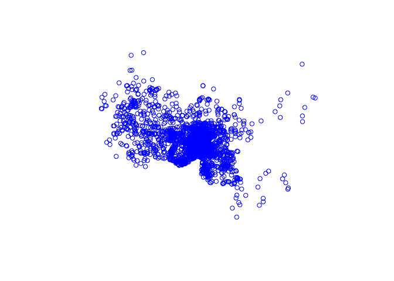

Module 21
================

Introduction to Spatial Data Analysis in ***R***
================================================

Preliminaries
-------------

-   The following packages are useful for dealing with spatial data in ***R***. Let's go ahead and install and load the following {sp}, {raster}, {rgdal}, {maptools}, {tmap}, {ggmap}, {GISTools}, {plotKML}

> NOTE: Additional useful packages include: {rasterVis} (raster visualisation), {mapdata} and {maps} (various map datasets), {OpenStreetMap} (access OSM data), {plotGoogleMaps}.

Also install the packages {rgbif}, {spocc}, and {dismo}, which provide access to Global Biodiversity Information Facility data.

Finally, download the folder called "GISDATA" from our ***GitHub*** data repository to your desktop.

``` r
library(sp)  # classes and methods for spatial (vector) data
library(raster)  # classes and methods for grids, raster data
library(rgdal)  # R bindings for the Geospatial Data Abstraction Library... input/output, projections
```

    ## rgdal: version: 1.2-4, (SVN revision 643)
    ##  Geospatial Data Abstraction Library extensions to R successfully loaded
    ##  Loaded GDAL runtime: GDAL 1.11.4, released 2016/01/25
    ##  Path to GDAL shared files: /Library/Frameworks/R.framework/Versions/3.3/Resources/library/rgdal/gdal
    ##  Loaded PROJ.4 runtime: Rel. 4.9.1, 04 March 2015, [PJ_VERSION: 491]
    ##  Path to PROJ.4 shared files: /Library/Frameworks/R.framework/Versions/3.3/Resources/library/rgdal/proj
    ##  Linking to sp version: 1.2-3

``` r
library(maptools)  # tools for reading and handling spatial objects... input/output, projections
```

    ## Checking rgeos availability: TRUE

``` r
library(tmap)  # thematic maps
library(ggmap)  # map extension to ggplot2; allows downloading of maps from various web servers
```

    ## Loading required package: ggplot2

    ## Google Maps API Terms of Service: http://developers.google.com/maps/terms.

    ## Please cite ggmap if you use it: see citation("ggmap") for details.

``` r
library(GISTools)  # eye candy for maps plus other functions
```

    ## Loading required package: RColorBrewer

    ## Loading required package: MASS

    ## 
    ## Attaching package: 'MASS'

    ## The following objects are masked from 'package:raster':
    ## 
    ##     area, select

    ## Loading required package: rgeos

    ## rgeos version: 0.3-21, (SVN revision 540)
    ##  GEOS runtime version: 3.4.2-CAPI-1.8.2 r3921 
    ##  Linking to sp version: 1.2-3 
    ##  Polygon checking: TRUE

``` r
library(plotKML)  # can read .gpx and can write KML files
```

    ## plotKML version 0.5-6 (2016-05-02)

    ## URL: http://plotkml.r-forge.r-project.org/

***R*** as a Geographic Information System (GIS)
------------------------------------------------

A **Geographic Information System (GIS)** is used for organization, visualization, and analysis of spatial data.

Involves:

-   Digital data - the information you will view and analyze using computer software and hardware

-   Computer hardware - computers/servers uses for storing, visualizing, and processing data

-   Computer software - programs (e.g., ***R***, ***QGIS***, ***ArcGIS***, spatial databases) and functions run on hardware that allow you to work with digital data

GIS data typically includes **geographical data** (e.g., coordinates) plus nongeographical **attributes**.

The big dvantage of GIS is that it allows great flexibility to visualize data in different ways plus allows for many types of computationally-heavy manipulation and analysis of data.


GIS data are visualized as **layers**.


### Types of Geographic Data

-   Vector Data (points, lines, and polygons) - have a **geometry** defined by **nodes** and **vertices**


-   Raster Data - represented as **regular grid** with associated attributes (e.g., altitude); needs to be GEOREFERENCED


### Geographic Data Formats

There are lots different formats that various softwares use for storing spatial data of either the vector or raster type.

-   Vector: ESRI "shapefiles" (multiple filetypes `.shp`, `.dbf`, `.shx`, `.prj`, `.sbn`), GeoJSON, GPS Exchange format (`.gpx`), Keyhole Markup Language (`.kml`), and many other proprietary formats

-   Raster: lots of different grid image types (`.tiff`, `.GeoTIFF`, `.jpeg`, .`gif`, `.png`, ASCII grids, digital elevation models, and many other proprietary formats)

### Spatial Data Classes in ***R***

***R*** has some specialized data structures ("classes") for storing and analyzing spatial data, and some of the package listed above are important for loading or converting to or from other formats to ***R***'s structures.

-   Types of geographic data with spatial coordinates but no attributes:

    -   `SpatialPoints` If these consist of latitude and longitude coordinates, these must be ordered as longitude (x-coordinate), latitude (y-coordinate).
-   `SpatialLines`
-   `SpatialPolygon` For those familiar with ESRI's **ArcGIS**, spatial polygons are not equivalent to shape files but rather consist of a series of coordinates of vertices only. In order to be a shape file, the polygon data needs to have associated attribute data, and thus be a `SpatialPolygonsDataFrame`

-   Types of geographic data with spatial coordinates **and** associated attributes:

-   `SpatilalPointsDataFrame`
-   `SpatialLinesDataFrame`
-   `SpatialPolygonsDataFrame`

### Importing and Visualizing Spatial Data

#### Importing line shape files

We will load a shapefile from the "GISDATA"" folder that you downloaded from ***GitHub*** using several different packages...

> NOTE: Depending on where you download these to your computer, you may need to modify the filepath in the examples below.

``` r
library(raster)
tbs <- shapefile("~/Desktop/GISDATA/trail_polylines.shp")
plot(tbs)
# or
library(rgdal)
tbs <- readOGR(dsn = path.expand("~/Desktop/GISDATA"), layer = "trail_polylines")
```

    ## OGR data source with driver: ESRI Shapefile 
    ## Source: "/Users/ad26693/Desktop/GISDATA", layer: "trail_polylines"
    ## with 29 features
    ## It has 1 fields

``` r
plot(tbs)
```


``` r
# or
library(maptools)
tbs <- readShapeLines("~/Desktop/GISDATA/trail_polylines.shp")  # note no extension on filename
plot(tbs)
# or
library(tmap)
tbs <- read_shape("~/Desktop/GISDATA/trail_polylines.shp")
plot(tbs)
class(tbs)
```

    ## [1] "SpatialLinesDataFrame"
    ## attr(,"package")
    ## [1] "sp"

Take a look at the output and notice the format of the data using the `str()` command.

``` r
str(tbs, max.level = 4)  # show structure of the 'tbs' object, with max 4 levels of nesting
```

    ## Formal class 'SpatialLinesDataFrame' [package "sp"] with 4 slots
    ##   ..@ data       :'data.frame':  29 obs. of  1 variable:
    ##   .. ..$ Trail: Factor w/ 29 levels "Al Rio","Chichico",..: 1 2 3 4 5 6 7 8 9 10 ...
    ##   ..@ lines      :List of 29
    ##   .. ..$ :Formal class 'Lines' [package "sp"] with 2 slots
    ##   .. ..$ :Formal class 'Lines' [package "sp"] with 2 slots
    ##   .. ..$ :Formal class 'Lines' [package "sp"] with 2 slots
    ##   .. ..$ :Formal class 'Lines' [package "sp"] with 2 slots
    ##   .. ..$ :Formal class 'Lines' [package "sp"] with 2 slots
    ##   .. ..$ :Formal class 'Lines' [package "sp"] with 2 slots
    ##   .. ..$ :Formal class 'Lines' [package "sp"] with 2 slots
    ##   .. ..$ :Formal class 'Lines' [package "sp"] with 2 slots
    ##   .. ..$ :Formal class 'Lines' [package "sp"] with 2 slots
    ##   .. ..$ :Formal class 'Lines' [package "sp"] with 2 slots
    ##   .. ..$ :Formal class 'Lines' [package "sp"] with 2 slots
    ##   .. ..$ :Formal class 'Lines' [package "sp"] with 2 slots
    ##   .. ..$ :Formal class 'Lines' [package "sp"] with 2 slots
    ##   .. ..$ :Formal class 'Lines' [package "sp"] with 2 slots
    ##   .. ..$ :Formal class 'Lines' [package "sp"] with 2 slots
    ##   .. ..$ :Formal class 'Lines' [package "sp"] with 2 slots
    ##   .. ..$ :Formal class 'Lines' [package "sp"] with 2 slots
    ##   .. ..$ :Formal class 'Lines' [package "sp"] with 2 slots
    ##   .. ..$ :Formal class 'Lines' [package "sp"] with 2 slots
    ##   .. ..$ :Formal class 'Lines' [package "sp"] with 2 slots
    ##   .. ..$ :Formal class 'Lines' [package "sp"] with 2 slots
    ##   .. ..$ :Formal class 'Lines' [package "sp"] with 2 slots
    ##   .. ..$ :Formal class 'Lines' [package "sp"] with 2 slots
    ##   .. ..$ :Formal class 'Lines' [package "sp"] with 2 slots
    ##   .. ..$ :Formal class 'Lines' [package "sp"] with 2 slots
    ##   .. ..$ :Formal class 'Lines' [package "sp"] with 2 slots
    ##   .. ..$ :Formal class 'Lines' [package "sp"] with 2 slots
    ##   .. ..$ :Formal class 'Lines' [package "sp"] with 2 slots
    ##   .. ..$ :Formal class 'Lines' [package "sp"] with 2 slots
    ##   ..@ bbox       : num [1:2, 1:2] 369603 9927991 374170 9931518
    ##   .. ..- attr(*, "dimnames")=List of 2
    ##   .. .. ..$ : chr [1:2] "x" "y"
    ##   .. .. ..$ : chr [1:2] "min" "max"
    ##   ..@ proj4string:Formal class 'CRS' [package "sp"] with 1 slot
    ##   .. .. ..@ projargs: chr "+proj=utm +zone=18 +south +datum=WGS84 +units=m +no_defs +ellps=WGS84 +towgs84=0,0,0"

We can see that spatial objects are made up of a number of different *slots*, or kinds of attributes, represented by the `@` symbol. The key ones in a spatial object in ***R*** are the `@data` slot, which can be thought of as equivalent to the "attribute table" in ***ArcGIS***, the `@lines` or `@polygons` slot, which can be thought of as containing the "geometry" of the data object where the vertices of the object are stored, and the `@proj4string` slot, which is the coordinate reference system (CRS) for the object. CRSs come in two types, `geographic` and `projected`. The variables denoted by the `$` symbol within each data slot refer to specific attributes (i.e., named variables) relevant to that type of data.


-   Geographic Coordinate System

    -   Uses degrees of LATITUDE AND LONGITUDE (and sometimes height) to describe locations on the Earth’s surface
    -   Latitude lines are always the same distance apart… but this is not the case for longitude!


-   Projected Coordinate System

    -   Defines location in space along 2 orthogonal axes (X and Y)
    -   **UTM** or "universal trans mercator" is one common type of projected CRS, which divides the earth into 60 zones


We can use the following commands referencing different slots and variables within slots to look at some of the data in each slot of our spatial object:

``` r
str(tbs@data)  # show structure of the 'data' slot
```

    ## 'data.frame':    29 obs. of  1 variable:
    ##  $ Trail: Factor w/ 29 levels "Al Rio","Chichico",..: 1 2 3 4 5 6 7 8 9 10 ...

``` r
str(tbs@lines, list.len = 3)  # show structure of first 3 items in the 'lines' geometry slot
```

    ## List of 29
    ##  $ :Formal class 'Lines' [package "sp"] with 2 slots
    ##   .. ..@ Lines:List of 1
    ##   .. .. ..$ :Formal class 'Line' [package "sp"] with 1 slot
    ##   .. .. .. .. ..@ coords: num [1:156, 1:2] 373587 373597 373603 373608 373608 ...
    ##   .. ..@ ID   : chr "0"
    ##  $ :Formal class 'Lines' [package "sp"] with 2 slots
    ##   .. ..@ Lines:List of 1
    ##   .. .. ..$ :Formal class 'Line' [package "sp"] with 1 slot
    ##   .. .. .. .. ..@ coords: num [1:235, 1:2] 372193 372199 372195 372194 372193 ...
    ##   .. ..@ ID   : chr "1"
    ##  $ :Formal class 'Lines' [package "sp"] with 2 slots
    ##   .. ..@ Lines:List of 1
    ##   .. .. ..$ :Formal class 'Line' [package "sp"] with 1 slot
    ##   .. .. .. .. ..@ coords: num [1:151, 1:2] 372135 372140 372145 372153 372156 ...
    ##   .. ..@ ID   : chr "2"
    ##   [list output truncated]

``` r
str(tbs@proj4string)  # show structure of the 'projection' slot
```

    ## Formal class 'CRS' [package "sp"] with 1 slot
    ##   ..@ projargs: chr "+proj=utm +zone=18 +south +datum=WGS84 +units=m +no_defs +ellps=WGS84 +towgs84=0,0,0"

#### Importing a point shape file

``` r
s <- read_shape("~/Desktop/GISDATA/primate sighting locations.shp")  # primate sightings at Tiputini
plot(s, pch = 1, col = "red")  # plot points 
```


``` r
str(s)
```

    ## Formal class 'SpatialPointsDataFrame' [package "sp"] with 5 slots
    ##   ..@ data       :'data.frame':  2478 obs. of  5 variables:
    ##   .. ..$ ID       : int [1:2478] 1 2 3 4 5 6 7 8 9 10 ...
    ##   .. ..$ Tree_Name: Factor w/ 2425 levels "108T","10T","110T",..: 1103 595 596 995 996 996 997 998 999 1000 ...
    ##   .. ..$ UTMX     : num [1:2478] 372387 371690 371669 372269 372312 ...
    ##   .. ..$ UTMY     : num [1:2478] 9929645 9929912 9929962 9929549 9929525 ...
    ##   .. ..$ Genus    : Factor w/ 8 levels "Alouatta","Aotus",..: 1 1 1 1 1 1 1 1 1 1 ...
    ##   ..@ coords.nrs : num(0) 
    ##   ..@ coords     : num [1:2478, 1:2] -76.1 -76.2 -76.2 -76.1 -76.1 ...
    ##   .. ..- attr(*, "dimnames")=List of 2
    ##   .. .. ..$ : NULL
    ##   .. .. ..$ : chr [1:2] "coords.x1" "coords.x2"
    ##   ..@ bbox       : num [1:2, 1:2] -76.171 -0.651 -76.125 -0.616
    ##   .. ..- attr(*, "dimnames")=List of 2
    ##   .. .. ..$ : chr [1:2] "coords.x1" "coords.x2"
    ##   .. .. ..$ : chr [1:2] "min" "max"
    ##   ..@ proj4string:Formal class 'CRS' [package "sp"] with 1 slot
    ##   .. .. ..@ projargs: chr "+proj=longlat +datum=WGS84 +no_defs +ellps=WGS84 +towgs84=0,0,0"

``` r
head(s@data)
```

    ##   ID  Tree_Name     UTMX    UTMY    Genus
    ## 1  1 FT5 120205 372386.8 9929645 Alouatta
    ## 2  2  AS-07-001 371690.0 9929912 Alouatta
    ## 3  3  AS-07-002 371668.6 9929962 Alouatta
    ## 4  4  FT 112604 372269.4 9929549 Alouatta
    ## 5  5   FT 22605 372312.1 9929525 Alouatta
    ## 6  6   FT 22605 372300.0 9929514 Alouatta

``` r
head(s@coords)
```

    ##      coords.x1  coords.x2
    ## [1,] -76.14682 -0.6363988
    ## [2,] -76.15308 -0.6339759
    ## [3,] -76.15327 -0.6335264
    ## [4,] -76.14788 -0.6372666
    ## [5,] -76.14749 -0.6374805
    ## [6,] -76.14760 -0.6375824

``` r
s@proj4string
```

    ## CRS arguments:
    ##  +proj=longlat +datum=WGS84 +no_defs +ellps=WGS84 +towgs84=0,0,0

``` r
plot(tbs)  # plot tbs trail map
plot(s, add = TRUE, pch = 1, col = "red")  # Hmm... points don't plot on top of the trail map... this is because the CRS is different
# CHANGE PROJECTION
new_proj <- proj4string(tbs)  # tbs data is in UTM coords
s <- spTransform(s, CRS(new_proj))  # transform s to UTM coords
plot(s, add = TRUE, pch = 1, col = "red")
```


#### Importing points as `.csv` data and setting the projection

``` r
points <- read.csv("~/Desktop/GISDATA/primate sighting locations.csv")
head(points)
```

    ##   ID     UTMX    UTMY    Genus
    ## 1  1 372386.8 9929645 Alouatta
    ## 2  2 371690.0 9929912 Alouatta
    ## 3  3 371668.6 9929962 Alouatta
    ## 4  4 372269.4 9929549 Alouatta
    ## 5  5 372312.1 9929525 Alouatta
    ## 6  6 372300.0 9929514 Alouatta

``` r
points <- SpatialPointsDataFrame(coords = c(points[2], points[3]), data = points[4])
str(points)
```

    ## Formal class 'SpatialPointsDataFrame' [package "sp"] with 5 slots
    ##   ..@ data       :'data.frame':  2478 obs. of  1 variable:
    ##   .. ..$ Genus: Factor w/ 8 levels "Alouatta","Aotus",..: 1 1 1 1 1 1 1 1 1 1 ...
    ##   ..@ coords.nrs : num(0) 
    ##   ..@ coords     : num [1:2478, 1:2] 372387 371690 371669 372269 372312 ...
    ##   .. ..- attr(*, "dimnames")=List of 2
    ##   .. .. ..$ : NULL
    ##   .. .. ..$ : chr [1:2] "UTMX" "UTMY"
    ##   ..@ bbox       : num [1:2, 1:2] 369742 9928026 374825 9931941
    ##   .. ..- attr(*, "dimnames")=List of 2
    ##   .. .. ..$ : chr [1:2] "UTMX" "UTMY"
    ##   .. .. ..$ : chr [1:2] "min" "max"
    ##   ..@ proj4string:Formal class 'CRS' [package "sp"] with 1 slot
    ##   .. .. ..@ projargs: chr NA

``` r
plot(points, pch = 1, col = "blue")
```



``` r
proj4string(points) <- new_proj  # assign UTM coordinate CRS to s
plot(tbs)  # plot tbs
plot(points, pch = 1, col = "blue", add = TRUE)
library(GISTools)  # this library can add 'eye candy' to our plot
title("Tiputini Biodiversity Station")
north.arrow(len = 100, x = 370300, y = 9928400)
map.scale(len = 1000, xc = 372000, yc = 9928250, ndivs = 1, units = "KM")
```


``` r
library(ggmap)
map <- get_map(location = c(-76.15, -0.638), zoom = 14, source = "google")  # returns a raster map
```

    ## Source : https://maps.googleapis.com/maps/api/staticmap?center=-0.638,-76.15&zoom=14&size=640x640&scale=2&maptype=terrain&language=en-EN

``` r
str(map)
```

    ##  chr [1:1280, 1:1280] "#CAE5A2" "#CAE5A2" "#CAE5A2" "#CAE5A2" ...
    ##  - attr(*, "class")= chr [1:2] "ggmap" "raster"
    ##  - attr(*, "bb")='data.frame':   1 obs. of  4 variables:
    ##   ..$ ll.lat: num -0.666
    ##   ..$ ll.lon: num -76.2
    ##   ..$ ur.lat: num -0.611
    ##   ..$ ur.lon: num -76.1
    ##  - attr(*, "source")= chr "google"
    ##  - attr(*, "maptype")= chr "terrain"
    ##  - attr(*, "zoom")= num 14

``` r
ggmap(map)
```


``` r
map <- get_map(location = c(-76.15, -0.638), zoom = 14, source = "osm")  # returns a raster map
```

    ## Source : https://maps.googleapis.com/maps/api/staticmap?center=-0.638,-76.15&zoom=14&size=640x640&scale=2&maptype=terrain

``` r
str(map)
```

    ##  chr [1:704, 1:704] "#F2EFE9" "#F2EFE9" "#F2EFE9" "#F2EFE9" ...
    ##  - attr(*, "class")= chr [1:2] "ggmap" "raster"
    ##  - attr(*, "bb")='data.frame':   1 obs. of  4 variables:
    ##   ..$ ll.lat: num -0.666
    ##   ..$ ll.lon: num -76.2
    ##   ..$ ur.lat: num -0.611
    ##   ..$ ur.lon: num -76.1
    ##  - attr(*, "source")= chr "osm"
    ##  - attr(*, "maptype")= chr "openstreetmap"
    ##  - attr(*, "scale")= num 31000

``` r
p <- ggmap(map)
p
```


> NOTE: If this command gives you error, you may need to install the development versions of {ggplot2} and {ggmap}. First, install the package {devtools} and then use the following code:

    devtools::install_github("dkahle/ggmap")
    devtools::install_github("hadley/ggplot2") 

Now, let's add our other spatial data on top of this raster.

``` r
points <- spTransform(points, CRS("+proj=longlat +datum=WGS84"))
d <- as.data.frame(points)
names(d) <- c("genus", "long", "lat")
tbs <- spTransform(tbs, CRS("+proj=longlat +datum=WGS84"))
tbs <- fortify(tbs)  # this ggplot2 function converts a spatial data frame to a regular data frame
p <- p + geom_path(data = tbs, aes(x = long, y = lat, group = id), colour = "grey")
p
```


``` r
p <- p + geom_point(data = d, aes(x = long, y = lat, colour = factor(genus)), 
    alpha = 0.25)
p
```


The function below, from Robin Lovelace, converts a {ggmap} map to a RasterStack, an ***R*** data structure for raster data.

``` r
ggmap_rast <- function(map) {
    map_bbox <- attr(map, "bb")
    .extent <- extent(as.numeric(map_bbox[c(2, 4, 1, 3)]))
    my_map <- raster(.extent, nrow = nrow(map), ncol = ncol(map))
    rgb_cols <- setNames(as.data.frame(t(col2rgb(map))), c("red", "green", "blue"))
    red <- my_map
    values(red) <- rgb_cols[["red"]]
    green <- my_map
    values(green) <- rgb_cols[["green"]]
    blue <- my_map
    values(blue) <- rgb_cols[["blue"]]
    stack(red, green, blue)
}

map_rast <- ggmap_rast(map)
str(map_rast)
```

    ## Formal class 'RasterStack' [package "raster"] with 11 slots
    ##   ..@ filename: chr ""
    ##   ..@ layers  :List of 3
    ##   .. ..$ :Formal class 'RasterLayer' [package "raster"] with 12 slots
    ##   .. .. .. ..@ file    :Formal class '.RasterFile' [package "raster"] with 13 slots
    ##   .. .. .. .. .. ..@ name        : chr ""
    ##   .. .. .. .. .. ..@ datanotation: chr "FLT4S"
    ##   .. .. .. .. .. ..@ byteorder   : chr "little"
    ##   .. .. .. .. .. ..@ nodatavalue : num -Inf
    ##   .. .. .. .. .. ..@ NAchanged   : logi FALSE
    ##   .. .. .. .. .. ..@ nbands      : int 1
    ##   .. .. .. .. .. ..@ bandorder   : chr "BIL"
    ##   .. .. .. .. .. ..@ offset      : int 0
    ##   .. .. .. .. .. ..@ toptobottom : logi TRUE
    ##   .. .. .. .. .. ..@ blockrows   : int 0
    ##   .. .. .. .. .. ..@ blockcols   : int 0
    ##   .. .. .. .. .. ..@ driver      : chr ""
    ##   .. .. .. .. .. ..@ open        : logi FALSE
    ##   .. .. .. ..@ data    :Formal class '.SingleLayerData' [package "raster"] with 13 slots
    ##   .. .. .. .. .. ..@ values    : int [1:495616] 242 242 242 242 242 242 242 242 242 242 ...
    ##   .. .. .. .. .. ..@ offset    : num 0
    ##   .. .. .. .. .. ..@ gain      : num 1
    ##   .. .. .. .. .. ..@ inmemory  : logi TRUE
    ##   .. .. .. .. .. ..@ fromdisk  : logi FALSE
    ##   .. .. .. .. .. ..@ isfactor  : logi FALSE
    ##   .. .. .. .. .. ..@ attributes: list()
    ##   .. .. .. .. .. ..@ haveminmax: logi TRUE
    ##   .. .. .. .. .. ..@ min       : int 4
    ##   .. .. .. .. .. ..@ max       : int 251
    ##   .. .. .. .. .. ..@ band      : int 1
    ##   .. .. .. .. .. ..@ unit      : chr ""
    ##   .. .. .. .. .. ..@ names     : chr "layer.1"
    ##   .. .. .. ..@ legend  :Formal class '.RasterLegend' [package "raster"] with 5 slots
    ##   .. .. .. .. .. ..@ type      : chr(0) 
    ##   .. .. .. .. .. ..@ values    : logi(0) 
    ##   .. .. .. .. .. ..@ color     : logi(0) 
    ##   .. .. .. .. .. ..@ names     : logi(0) 
    ##   .. .. .. .. .. ..@ colortable: logi(0) 
    ##   .. .. .. ..@ title   : chr(0) 
    ##   .. .. .. ..@ extent  :Formal class 'Extent' [package "raster"] with 4 slots
    ##   .. .. .. .. .. ..@ xmin: num -76.2
    ##   .. .. .. .. .. ..@ xmax: num -76.1
    ##   .. .. .. .. .. ..@ ymin: num -0.666
    ##   .. .. .. .. .. ..@ ymax: num -0.611
    ##   .. .. .. ..@ rotated : logi FALSE
    ##   .. .. .. ..@ rotation:Formal class '.Rotation' [package "raster"] with 2 slots
    ##   .. .. .. .. .. ..@ geotrans: num(0) 
    ##   .. .. .. .. .. ..@ transfun:function ()  
    ##   .. .. .. ..@ ncols   : int 704
    ##   .. .. .. ..@ nrows   : int 704
    ##   .. .. .. ..@ crs     :Formal class 'CRS' [package "sp"] with 1 slot
    ##   .. .. .. .. .. ..@ projargs: chr NA
    ##   .. .. .. ..@ history : list()
    ##   .. .. .. ..@ z       : list()
    ##   .. ..$ :Formal class 'RasterLayer' [package "raster"] with 12 slots
    ##   .. .. .. ..@ file    :Formal class '.RasterFile' [package "raster"] with 13 slots
    ##   .. .. .. .. .. ..@ name        : chr ""
    ##   .. .. .. .. .. ..@ datanotation: chr "FLT4S"
    ##   .. .. .. .. .. ..@ byteorder   : chr "little"
    ##   .. .. .. .. .. ..@ nodatavalue : num -Inf
    ##   .. .. .. .. .. ..@ NAchanged   : logi FALSE
    ##   .. .. .. .. .. ..@ nbands      : int 1
    ##   .. .. .. .. .. ..@ bandorder   : chr "BIL"
    ##   .. .. .. .. .. ..@ offset      : int 0
    ##   .. .. .. .. .. ..@ toptobottom : logi TRUE
    ##   .. .. .. .. .. ..@ blockrows   : int 0
    ##   .. .. .. .. .. ..@ blockcols   : int 0
    ##   .. .. .. .. .. ..@ driver      : chr ""
    ##   .. .. .. .. .. ..@ open        : logi FALSE
    ##   .. .. .. ..@ data    :Formal class '.SingleLayerData' [package "raster"] with 13 slots
    ##   .. .. .. .. .. ..@ values    : int [1:495616] 239 239 239 239 239 239 239 239 239 239 ...
    ##   .. .. .. .. .. ..@ offset    : num 0
    ##   .. .. .. .. .. ..@ gain      : num 1
    ##   .. .. .. .. .. ..@ inmemory  : logi TRUE
    ##   .. .. .. .. .. ..@ fromdisk  : logi FALSE
    ##   .. .. .. .. .. ..@ isfactor  : logi FALSE
    ##   .. .. .. .. .. ..@ attributes: list()
    ##   .. .. .. .. .. ..@ haveminmax: logi TRUE
    ##   .. .. .. .. .. ..@ min       : int 130
    ##   .. .. .. .. .. ..@ max       : int 250
    ##   .. .. .. .. .. ..@ band      : int 1
    ##   .. .. .. .. .. ..@ unit      : chr ""
    ##   .. .. .. .. .. ..@ names     : chr "layer.2"
    ##   .. .. .. ..@ legend  :Formal class '.RasterLegend' [package "raster"] with 5 slots
    ##   .. .. .. .. .. ..@ type      : chr(0) 
    ##   .. .. .. .. .. ..@ values    : logi(0) 
    ##   .. .. .. .. .. ..@ color     : logi(0) 
    ##   .. .. .. .. .. ..@ names     : logi(0) 
    ##   .. .. .. .. .. ..@ colortable: logi(0) 
    ##   .. .. .. ..@ title   : chr(0) 
    ##   .. .. .. ..@ extent  :Formal class 'Extent' [package "raster"] with 4 slots
    ##   .. .. .. .. .. ..@ xmin: num -76.2
    ##   .. .. .. .. .. ..@ xmax: num -76.1
    ##   .. .. .. .. .. ..@ ymin: num -0.666
    ##   .. .. .. .. .. ..@ ymax: num -0.611
    ##   .. .. .. ..@ rotated : logi FALSE
    ##   .. .. .. ..@ rotation:Formal class '.Rotation' [package "raster"] with 2 slots
    ##   .. .. .. .. .. ..@ geotrans: num(0) 
    ##   .. .. .. .. .. ..@ transfun:function ()  
    ##   .. .. .. ..@ ncols   : int 704
    ##   .. .. .. ..@ nrows   : int 704
    ##   .. .. .. ..@ crs     :Formal class 'CRS' [package "sp"] with 1 slot
    ##   .. .. .. .. .. ..@ projargs: chr NA
    ##   .. .. .. ..@ history : list()
    ##   .. .. .. ..@ z       : list()
    ##   .. ..$ :Formal class 'RasterLayer' [package "raster"] with 12 slots
    ##   .. .. .. ..@ file    :Formal class '.RasterFile' [package "raster"] with 13 slots
    ##   .. .. .. .. .. ..@ name        : chr ""
    ##   .. .. .. .. .. ..@ datanotation: chr "FLT4S"
    ##   .. .. .. .. .. ..@ byteorder   : chr "little"
    ##   .. .. .. .. .. ..@ nodatavalue : num -Inf
    ##   .. .. .. .. .. ..@ NAchanged   : logi FALSE
    ##   .. .. .. .. .. ..@ nbands      : int 1
    ##   .. .. .. .. .. ..@ bandorder   : chr "BIL"
    ##   .. .. .. .. .. ..@ offset      : int 0
    ##   .. .. .. .. .. ..@ toptobottom : logi TRUE
    ##   .. .. .. .. .. ..@ blockrows   : int 0
    ##   .. .. .. .. .. ..@ blockcols   : int 0
    ##   .. .. .. .. .. ..@ driver      : chr ""
    ##   .. .. .. .. .. ..@ open        : logi FALSE
    ##   .. .. .. ..@ data    :Formal class '.SingleLayerData' [package "raster"] with 13 slots
    ##   .. .. .. .. .. ..@ values    : int [1:495616] 233 233 233 233 233 233 233 233 233 233 ...
    ##   .. .. .. .. .. ..@ offset    : num 0
    ##   .. .. .. .. .. ..@ gain      : num 1
    ##   .. .. .. .. .. ..@ inmemory  : logi TRUE
    ##   .. .. .. .. .. ..@ fromdisk  : logi FALSE
    ##   .. .. .. .. .. ..@ isfactor  : logi FALSE
    ##   .. .. .. .. .. ..@ attributes: list()
    ##   .. .. .. .. .. ..@ haveminmax: logi TRUE
    ##   .. .. .. .. .. ..@ min       : int 4
    ##   .. .. .. .. .. ..@ max       : int 248
    ##   .. .. .. .. .. ..@ band      : int 1
    ##   .. .. .. .. .. ..@ unit      : chr ""
    ##   .. .. .. .. .. ..@ names     : chr "layer.3"
    ##   .. .. .. ..@ legend  :Formal class '.RasterLegend' [package "raster"] with 5 slots
    ##   .. .. .. .. .. ..@ type      : chr(0) 
    ##   .. .. .. .. .. ..@ values    : logi(0) 
    ##   .. .. .. .. .. ..@ color     : logi(0) 
    ##   .. .. .. .. .. ..@ names     : logi(0) 
    ##   .. .. .. .. .. ..@ colortable: logi(0) 
    ##   .. .. .. ..@ title   : chr(0) 
    ##   .. .. .. ..@ extent  :Formal class 'Extent' [package "raster"] with 4 slots
    ##   .. .. .. .. .. ..@ xmin: num -76.2
    ##   .. .. .. .. .. ..@ xmax: num -76.1
    ##   .. .. .. .. .. ..@ ymin: num -0.666
    ##   .. .. .. .. .. ..@ ymax: num -0.611
    ##   .. .. .. ..@ rotated : logi FALSE
    ##   .. .. .. ..@ rotation:Formal class '.Rotation' [package "raster"] with 2 slots
    ##   .. .. .. .. .. ..@ geotrans: num(0) 
    ##   .. .. .. .. .. ..@ transfun:function ()  
    ##   .. .. .. ..@ ncols   : int 704
    ##   .. .. .. ..@ nrows   : int 704
    ##   .. .. .. ..@ crs     :Formal class 'CRS' [package "sp"] with 1 slot
    ##   .. .. .. .. .. ..@ projargs: chr NA
    ##   .. .. .. ..@ history : list()
    ##   .. .. .. ..@ z       : list()
    ##   ..@ title   : chr(0) 
    ##   ..@ extent  :Formal class 'Extent' [package "raster"] with 4 slots
    ##   .. .. ..@ xmin: num -76.2
    ##   .. .. ..@ xmax: num -76.1
    ##   .. .. ..@ ymin: num -0.666
    ##   .. .. ..@ ymax: num -0.611
    ##   ..@ rotated : logi FALSE
    ##   ..@ rotation:Formal class '.Rotation' [package "raster"] with 2 slots
    ##   .. .. ..@ geotrans: num(0) 
    ##   .. .. ..@ transfun:function ()  
    ##   ..@ ncols   : int 704
    ##   ..@ nrows   : int 704
    ##   ..@ crs     :Formal class 'CRS' [package "sp"] with 1 slot
    ##   .. .. ..@ projargs: chr NA
    ##   ..@ history : list()
    ##   ..@ z       : list()

``` r
crs(map_rast) <- "+proj=longlat +datum=WGS84"

q <- tm_shape(map_rast) + tm_raster() + tm_shape(points, unit = "km", unit.size = 1000) + 
    tm_symbols(size = 0.05, col = "blue", shape = 1) + tm_grid(projection = "longlat", 
    labels.size = 0.3) + tm_compass()  # the `tm` functions from {tmap} generate nice looking maps!
q
```


The package {geojsonio} can convert data frames and spatial objects back and forth to GeoJSON format! See the useful [tutorial](https://ropensci.org/tutorials/geojsonio_tutorial.html) on [ROpenSci](https://ropensci.org/).

``` r
library(geojsonio)
geo_points <- geojson_json(points)
class(geo_points)
```

    ## [1] "json"     "geo_json"

``` r
geo_tbs <- geojson_json(tbs)
```

    ## Assuming 'long' and 'lat' are longitude and latitude, respectively

``` r
class(geo_tbs)
```

    ## [1] "json"     "geo_json"

``` r
geojson_write(geo_tbs, file = "~/Desktop/geo_tbs.geojson")  # write file
```

    ## Success! File is at ~/Desktop/geo_tbs.geojson

    ## <geojson>
    ##   Path:       ~/Desktop/geo_tbs.geojson
    ##   From class: json

``` r
geo_tbs <- geojson_read(x = "~/Desktop/geo_tbs.geojson", what = "sp")  # read file back in
plot(geo_tbs, pch = 1, cex = 0.1)
```


> NOTE: one problem is that when writing GeoJSON with these functions, the CRS is *not* stored. After reading a GeoJSON file back in, the CRS is set to "+proj=longlat +datum=WGS84 +no\_defs +ellps=WGS84 +towgs84=0,0,0" automatically, so you will need to reset the CRS to whatever it was before writing the file.

``` r
str(tbs)
```

    ## 'data.frame':    4188 obs. of  6 variables:
    ##  $ long : num  -76.1 -76.1 -76.1 -76.1 -76.1 ...
    ##  $ lat  : num  -0.648 -0.648 -0.648 -0.648 -0.648 ...
    ##  $ order: int  1 2 3 4 5 6 7 8 9 10 ...
    ##  $ piece: Factor w/ 1 level "1": 1 1 1 1 1 1 1 1 1 1 ...
    ##  $ id   : chr  "0" "0" "0" "0" ...
    ##  $ group: Factor w/ 29 levels "0.1","1.1","2.1",..: 1 1 1 1 1 1 1 1 1 1 ...

``` r
proj4string(geo_tbs) <- "+proj=longlat +datum=WGS84"
plot(geo_tbs, pch = 1, col = "grey", cex = 0.1)
```


We can also import `.gpx` files, another common geographic data format, to ***R***.

``` r
library(rgdal)
tbs <- readOGR(dsn = path.expand("~/Desktop/GISDATA/tbs.gpx"), layer = "tracks")
```

    ## OGR data source with driver: GPX 
    ## Source: "/Users/ad26693/Desktop/GISDATA/tbs.gpx", layer: "tracks"
    ## with 29 features
    ## It has 12 fields

``` r
names(tbs)
```

    ##  [1] "name"       "cmt"        "desc"       "src"        "link1_href"
    ##  [6] "link1_text" "link1_type" "link2_href" "link2_text" "link2_type"
    ## [11] "number"     "type"

``` r
class(tbs)
```

    ## [1] "SpatialLinesDataFrame"
    ## attr(,"package")
    ## [1] "sp"

``` r
plot(tbs)
trees <- readOGR(dsn = path.expand("~/Desktop/GISDATA/trees.gpx"), layer = "waypoints")
```

    ## OGR data source with driver: GPX 
    ## Source: "/Users/ad26693/Desktop/GISDATA/trees.gpx", layer: "waypoints"
    ## with 6742 features
    ## It has 27 fields

``` r
names(trees)
```

    ##  [1] "ele"           "time"          "magvar"        "geoidheight"  
    ##  [5] "name"          "cmt"           "desc"          "src"          
    ##  [9] "link1_href"    "link1_text"    "link1_type"    "link2_href"   
    ## [13] "link2_text"    "link2_type"    "sym"           "type"         
    ## [17] "fix"           "sat"           "hdop"          "vdop"         
    ## [21] "pdop"          "ageofdgpsdata" "dgpsid"        "ogr_ID"       
    ## [25] "ogr_LOCATION"  "ogr_FINAL_LON" "ogr_FINAL_LAT"

``` r
class(trees)
```

    ## [1] "SpatialPointsDataFrame"
    ## attr(,"package")
    ## [1] "sp"

``` r
plot(trees, pch = 1, col = "green", add = TRUE)
```


We can also write geographic objects in ***R*** as `.kml` (keyhole markup language) files, which can be read by ***GoogleEarth*** or ***QGis***. The `plotKML()` functions writes these `.kml` to the working directory and also opens them in whatever software you have set up on your computer to open this type of file.

``` r
library("plotKML")
plotKML(tbs)
```

    ## KML file opened for writing...

    ## Writing to KML...

    ## Closing  tbs.kml

``` r
plotKML(trees)
```

    ## Plotting the first variable on the list

    ## KML file opened for writing...

    ## Writing to KML...

    ## Closing  trees.kml

Getting Spatial Data from the Web
---------------------------------

A number of the packages we have loaded provide easy access to a variety of geospatial data, and there are LOTS and LOTS of other freely available spatial data.

### Obtaining Country Shapefiles (Polygon)

As an example, [GADM](http://gadm.org/) is a spatial database of the location of the world's administrative boundaries where you can freely download shapefiles with this information. The {raster} package provides the `getData()` function that allows you to pull from this database.

``` r
library(raster)
colombia <- getData("GADM", country = "COL", level = 2)  # higher levels yield finer administrative boundaries
colombia
```

    ## class       : SpatialPolygonsDataFrame 
    ## features    : 1065 
    ## extent      : -81.84153, -66.87033, -4.228429, 15.91247  (xmin, xmax, ymin, ymax)
    ## coord. ref. : +proj=longlat +datum=WGS84 +no_defs +ellps=WGS84 +towgs84=0,0,0 
    ## variables   : 15
    ## names       : OBJECTID, ID_0, ISO,   NAME_0, ID_1,   NAME_1, ID_2,    NAME_2,   HASC_2, CCN_2, CCA_2,    TYPE_2,    ENGTYPE_2, NL_NAME_2,    VARNAME_2 
    ## min values  :        1,   53, COL, Colombia,    1, Amazonas,    1, Abejorral,         ,    NA,      ,          ,             ,          ,              
    ## max values  :     1065,   53, COL, Colombia,   32,  Vichada, 1065, Zipaquirá, CO.VP.YA,    NA,      , Municipio, Municipality,          , Vistahermosa

``` r
class(colombia)
```

    ## [1] "SpatialPolygonsDataFrame"
    ## attr(,"package")
    ## [1] "sp"

``` r
str(colombia, max.level = 5, list.len = 5)
```

    ## Formal class 'SpatialPolygonsDataFrame' [package "sp"] with 5 slots
    ##   ..@ data       :'data.frame':  1065 obs. of  15 variables:
    ##   .. ..$ OBJECTID : int [1:1065] 1 2 3 4 5 6 7 8 9 10 ...
    ##   .. ..$ ID_0     : int [1:1065] 53 53 53 53 53 53 53 53 53 53 ...
    ##   .. ..$ ISO      : chr [1:1065] "COL" "COL" "COL" "COL" ...
    ##   .. ..$ NAME_0   : chr [1:1065] "Colombia" "Colombia" "Colombia" "Colombia" ...
    ##   .. ..$ ID_1     : int [1:1065] 1 1 1 1 1 1 1 1 2 2 ...
    ##   .. .. [list output truncated]
    ##   ..@ polygons   :List of 1065
    ##   .. ..$ :Formal class 'Polygons' [package "sp"] with 5 slots
    ##   .. .. .. ..@ Polygons :List of 1
    ##   .. .. .. ..@ plotOrder: int 1
    ##   .. .. .. ..@ labpt    : num [1:2] -73.57 -1.25
    ##   .. .. .. ..@ ID       : chr "1"
    ##   .. .. .. ..@ area     : num 0.835
    ##   .. ..$ :Formal class 'Polygons' [package "sp"] with 5 slots
    ##   .. .. .. ..@ Polygons :List of 1
    ##   .. .. .. ..@ plotOrder: int 1
    ##   .. .. .. ..@ labpt    : num [1:2] -72.73 -1.49
    ##   .. .. .. ..@ ID       : chr "2"
    ##   .. .. .. ..@ area     : num 1.81
    ##   .. ..$ :Formal class 'Polygons' [package "sp"] with 5 slots
    ##   .. .. .. ..@ Polygons :List of 2
    ##   .. .. .. ..@ plotOrder: int [1:2] 1 2
    ##   .. .. .. ..@ labpt    : num [1:2] -70.91 -1.48
    ##   .. .. .. ..@ ID       : chr "3"
    ##   .. .. .. ..@ area     : num 1.97
    ##   .. ..$ :Formal class 'Polygons' [package "sp"] with 5 slots
    ##   .. .. .. ..@ Polygons :List of 1
    ##   .. .. .. ..@ plotOrder: int 1
    ##   .. .. .. ..@ labpt    : num [1:2] -70.03 -3.67
    ##   .. .. .. ..@ ID       : chr "4"
    ##   .. .. .. ..@ area     : num 0.34
    ##   .. ..$ :Formal class 'Polygons' [package "sp"] with 5 slots
    ##   .. .. .. ..@ Polygons :List of 1
    ##   .. .. .. ..@ plotOrder: int 1
    ##   .. .. .. ..@ labpt    : num [1:2] -70.789 -0.819
    ##   .. .. .. ..@ ID       : chr "5"
    ##   .. .. .. ..@ area     : num 1.35
    ##   .. .. [list output truncated]
    ##   ..@ plotOrder  : int [1:1065] 386 1063 3 615 610 2 1060 1061 1064 8 ...
    ##   ..@ bbox       : num [1:2, 1:2] -81.84 -4.23 -66.87 15.91
    ##   .. ..- attr(*, "dimnames")=List of 2
    ##   .. .. ..$ : chr [1:2] "x" "y"
    ##   .. .. ..$ : chr [1:2] "min" "max"
    ##   ..@ proj4string:Formal class 'CRS' [package "sp"] with 1 slot
    ##   .. .. ..@ projargs: chr "+proj=longlat +datum=WGS84 +no_defs +ellps=WGS84 +towgs84=0,0,0"

``` r
qtm(colombia, title = "Colombia")  # the `qtm()` or 'Quick Thematic Map' function from {tmap} generates nice looking maps!
```


``` r
colombia0 <- getData("GADM", country = "COL", level = 0)  # just country boundary
ecuador <- getData("GADM", country = "ECU", level = 2)
ecuador
```

    ## class       : SpatialPolygonsDataFrame 
    ## features    : 199 
    ## extent      : -92.0089, -75.20004, -5.017375, 1.681548  (xmin, xmax, ymin, ymax)
    ## coord. ref. : +proj=longlat +datum=WGS84 +no_defs +ellps=WGS84 +towgs84=0,0,0 
    ## variables   : 15
    ## names       : OBJECTID, ID_0, ISO,  NAME_0, ID_1,           NAME_1, ID_2,   NAME_2,   HASC_2, CCN_2, CCA_2, TYPE_2, ENGTYPE_2, NL_NAME_2, VARNAME_2 
    ## min values  :        1,   68, ECU, Ecuador,    1,            Azuay,    1, Aguarico,         ,    NA,      , Canton,    Canton,          ,           
    ## max values  :      199,   68, ECU, Ecuador,   24, Zamora Chinchipe,  199,   Zaruma, EC.ZC.ZA,    NA,      , Canton,    Canton,          ,  Yantzaza

``` r
class(ecuador)
```

    ## [1] "SpatialPolygonsDataFrame"
    ## attr(,"package")
    ## [1] "sp"

``` r
qtm(ecuador, title = "Ecuador")
```


``` r
ecuador0 <- getData("GADM", country = "ECU", level = 0)  # just country boundary
```

### Obtaining Raster Data

The {raster} package also allows us to download `SRTM` ("Shuttle Radar Tomography Mission") data, which provides *elevation* data in raster format. We need to pass latitude (`lat`) and longitude (`lon`) values of some location within the tile we are interested in.

> NOTE: These raster files are LARGE and will take some time to download!

#### Elevation data for a specific region in Colombia...

``` r
srtm1 <- getData("SRTM", lon = -68, lat = -1)
srtm1
```

    ## class       : RasterLayer 
    ## dimensions  : 6001, 6001, 36012001  (nrow, ncol, ncell)
    ## resolution  : 0.0008333333, 0.0008333333  (x, y)
    ## extent      : -70.00042, -64.99958, -5.000416, 0.000417247  (xmin, xmax, ymin, ymax)
    ## coord. ref. : +proj=longlat +datum=WGS84 +ellps=WGS84 +towgs84=0,0,0 
    ## data source : /Users/ad26693/Development/repos/applied-data-analysis/module-21/srtm_23_13.tif 
    ## names       : srtm_23_13 
    ## values      : -32768, 32767  (min, max)

``` r
str(srtm1)  # 12 slots, including the CRS
```

    ## Formal class 'RasterLayer' [package "raster"] with 12 slots
    ##   ..@ file    :Formal class '.RasterFile' [package "raster"] with 13 slots
    ##   .. .. ..@ name        : chr "/Users/ad26693/Development/repos/applied-data-analysis/module-21/srtm_23_13.tif"
    ##   .. .. ..@ datanotation: chr "INT2S"
    ##   .. .. ..@ byteorder   : chr "little"
    ##   .. .. ..@ nodatavalue : num -Inf
    ##   .. .. ..@ NAchanged   : logi FALSE
    ##   .. .. ..@ nbands      : int 1
    ##   .. .. ..@ bandorder   : chr "BIL"
    ##   .. .. ..@ offset      : int 0
    ##   .. .. ..@ toptobottom : logi TRUE
    ##   .. .. ..@ blockrows   : int 1
    ##   .. .. ..@ blockcols   : int 6001
    ##   .. .. ..@ driver      : chr "gdal"
    ##   .. .. ..@ open        : logi FALSE
    ##   ..@ data    :Formal class '.SingleLayerData' [package "raster"] with 13 slots
    ##   .. .. ..@ values    : logi(0) 
    ##   .. .. ..@ offset    : num 0
    ##   .. .. ..@ gain      : num 1
    ##   .. .. ..@ inmemory  : logi FALSE
    ##   .. .. ..@ fromdisk  : logi TRUE
    ##   .. .. ..@ isfactor  : logi FALSE
    ##   .. .. ..@ attributes: list()
    ##   .. .. ..@ haveminmax: logi TRUE
    ##   .. .. ..@ min       : num -32768
    ##   .. .. ..@ max       : num 32767
    ##   .. .. ..@ band      : int 1
    ##   .. .. ..@ unit      : chr ""
    ##   .. .. ..@ names     : chr "srtm_23_13"
    ##   ..@ legend  :Formal class '.RasterLegend' [package "raster"] with 5 slots
    ##   .. .. ..@ type      : chr(0) 
    ##   .. .. ..@ values    : logi(0) 
    ##   .. .. ..@ color     : logi(0) 
    ##   .. .. ..@ names     : logi(0) 
    ##   .. .. ..@ colortable: logi(0) 
    ##   ..@ title   : chr(0) 
    ##   ..@ extent  :Formal class 'Extent' [package "raster"] with 4 slots
    ##   .. .. ..@ xmin: num -70
    ##   .. .. ..@ xmax: num -65
    ##   .. .. ..@ ymin: num -5
    ##   .. .. ..@ ymax: num 0.000417
    ##   ..@ rotated : logi FALSE
    ##   ..@ rotation:Formal class '.Rotation' [package "raster"] with 2 slots
    ##   .. .. ..@ geotrans: num(0) 
    ##   .. .. ..@ transfun:function ()  
    ##   ..@ ncols   : int 6001
    ##   ..@ nrows   : int 6001
    ##   ..@ crs     :Formal class 'CRS' [package "sp"] with 1 slot
    ##   .. .. ..@ projargs: chr "+proj=longlat +datum=WGS84 +ellps=WGS84 +towgs84=0,0,0"
    ##   ..@ history : list()
    ##   ..@ z       : list()

``` r
plot(srtm1)
```


``` r
srtm2 <- getData("SRTM", lon = -68, lat = 3)
srtm3 <- getData("SRTM", lon = -68, lat = 8)
srtm4 <- getData("SRTM", lon = -68, lat = 12)
srtm5 <- getData("SRTM", lon = -72, lat = -1)
srtm6 <- getData("SRTM", lon = -72, lat = 3)
srtm7 <- getData("SRTM", lon = -72, lat = 8)
srtm8 <- getData("SRTM", lon = -72, lat = 12)
srtm9 <- getData("SRTM", lon = -78, lat = -1)
srtm10 <- getData("SRTM", lon = -78, lat = 3)
srtm11 <- getData("SRTM", lon = -78, lat = 8)
srtm12 <- getData("SRTM", lon = -78, lat = 12)
```

#### Join all rasters into a single one

The `mosaic()` function from {raster} allows us to combine raster datasets and apply a function (in this case, `mean`) to areas of overlap between datasets. This function may take a long time to run!

``` r
colombia.srtm <- mosaic(srtm1, srtm2, srtm3, srtm4, srtm5, srtm6, srtm7, srtm8, 
    srtm9, srtm10, srtm11, srtm12, fun = mean)
proj4string(colombia.srtm) <- proj4string(colombia)  # ensures that our vector and raster data have the same CRS
plot(colombia.srtm)
plot(colombia, add = TRUE)
```


``` r
# export the raster data
writeRaster(colombia.srtm, filename = paste0("~/Desktop/GISDATA/colombia.raster.tif"), 
    format = "GTiff")
```

The `crop()` and `mask()` functions can be used to clip your raster data to a particular vector object.

``` r
# library(raster) colombia.crop <- crop(colombia.srtm, extent(colombia))
# plot(colombia.crop) proj4string(colombia.crop) plot(colombia0, add=TRUE)
```

### Obtaining BIOCLIM variables (raster data)

The BIOCLIM database contains data on a range of climatic variables.

``` r
climate <- getData("worldclim", var = "bio", res = 10)
par(mfrow = c(1, 1))
plot(climate$bio1, main = "Annual Mean Temperature")
plot(colombia0, add = TRUE)
plot(ecuador0, add = TRUE)
```


#### Other Useful Datasets Available with `getData()`

-   <http://www.worldclim.org>
-   <http://www.gadm.org>
-   <http://srtm.csi.cgiar.org/>
-   <http://diva-gis.org/gdata>

### Obtaining occurence data (vector data) from GBIF

There are many additional publicly and freely available datasets of interest to biologists. For example, we can access data from the **Global Biodiverity Information Facility (GBIF)**. See also [this tutorial](http://ropensci.org/tutorials/rgbif_tutorial.html)

``` r
par(mfrow = c(1, 3))
# using the {rgbif} package
library(rgbif)
# Lookup names in all taxonomies in GBIF
head(name_lookup(query = "Saguinus", rank = "genus", return = "data"))
```

    ## # A tibble: 6 × 38
    ##         key scientificName                           datasetKey  nubKey
    ##       <int>          <chr>                                <chr>   <int>
    ## 1 120825394       Saguinus 0a423169-63f8-439c-b833-ab01b379bd50 2436465
    ## 2 121267599       Saguinus bc1a1eb3-243d-4e87-b9fa-d35fe0800230 2436465
    ## 3 115200121       Saguinus cbb6498e-8927-405a-916b-576d00a6289b 2436465
    ## 4 120816015       Saguinus cc056915-475e-4179-b12e-849acebc6ed9 2436465
    ## 5 120821855       Saguinus f6b35f74-08c3-43a2-a4b6-53b6fe1c0cf6 2436465
    ## 6 120818503       Saguinus 64fa10f0-ca43-4f53-aa88-621ec9ea2b50 2436465
    ## # ... with 34 more variables: parentKey <int>, parent <chr>,
    ## #   kingdom <chr>, phylum <chr>, order <chr>, family <chr>, genus <chr>,
    ## #   kingdomKey <int>, phylumKey <int>, classKey <int>, orderKey <int>,
    ## #   familyKey <int>, genusKey <int>, canonicalName <chr>,
    ## #   authorship <chr>, nameType <chr>, taxonomicStatus <chr>, rank <chr>,
    ## #   numDescendants <int>, numOccurrences <int>, habitats <chr>,
    ## #   nomenclaturalStatus <lgl>, threatStatuses <lgl>, synonym <lgl>,
    ## #   class <chr>, taxonID <chr>, publishedIn <chr>, accordingTo <chr>,
    ## #   extinct <lgl>, acceptedKey <int>, accepted <chr>, species <chr>,
    ## #   speciesKey <int>, constituentKey <chr>

``` r
head(name_lookup(query = "Saguinus leucopus", rank = "species", return = "data"))
```

    ## # A tibble: 6 × 35
    ##         key                    scientificName
    ##       <int>                             <chr>
    ## 1 100034729                 Saguinus leucopus
    ## 2 114906320                 Saguinus leucopus
    ## 3 104048165                 Saguinus leucopus
    ## 4 107904895 Saguinus leucopus (Günther, 1877)
    ## 5 121062140 Saguinus leucopus (Günther, 1877)
    ## 6   2436476 Saguinus leucopus (Günther, 1877)
    ## # ... with 33 more variables: datasetKey <chr>, nubKey <int>,
    ## #   parentKey <int>, parent <chr>, kingdom <chr>, phylum <chr>,
    ## #   order <chr>, family <chr>, genus <chr>, species <chr>,
    ## #   kingdomKey <int>, phylumKey <int>, classKey <int>, orderKey <int>,
    ## #   familyKey <int>, genusKey <int>, speciesKey <int>,
    ## #   canonicalName <chr>, authorship <chr>, nameType <chr>, rank <chr>,
    ## #   numDescendants <int>, numOccurrences <int>, habitats <lgl>,
    ## #   nomenclaturalStatus <lgl>, threatStatuses <chr>, synonym <lgl>,
    ## #   class <chr>, accordingTo <chr>, taxonomicStatus <chr>, extinct <lgl>,
    ## #   constituentKey <chr>, publishedIn <chr>

``` r
# Search for GBIF occurrences
saguinus <- occ_search(scientificName = "Saguinus leucopus", country = "CO", 
    hasCoordinate = TRUE)
head(saguinus)
```

    ## $meta
    ## $meta$offset
    ## [1] 300
    ## 
    ## $meta$limit
    ## [1] 71
    ## 
    ## $meta$endOfRecords
    ## [1] TRUE
    ## 
    ## $meta$count
    ## [1] 371
    ## 
    ## 
    ## $hierarchy
    ## $hierarchy[[1]]
    ##                name     key    rank
    ## 1          Animalia       1 kingdom
    ## 2          Chordata      44  phylum
    ## 3          Mammalia     359   class
    ## 4          Primates     798   order
    ## 5    Callitrichidae    9620  family
    ## 6          Saguinus 2436465   genus
    ## 7 Saguinus leucopus 2436476 species
    ## 
    ## 
    ## $data
    ## # A tibble: 371 × 93
    ##                 name        key decimalLatitude decimalLongitude  issues
    ##                <chr>      <int>           <dbl>            <dbl>   <chr>
    ## 1  Saguinus leucopus 1316534171         6.02944        -74.58460 cdround
    ## 2  Saguinus leucopus 1316534160         6.02565        -74.58514 cdround
    ## 3  Saguinus leucopus 1316534183         6.04200        -74.59914 cdround
    ## 4  Saguinus leucopus 1316534184         6.05523        -74.59361 cdround
    ## 5  Saguinus leucopus 1316534304         5.67121        -74.77817        
    ## 6  Saguinus leucopus 1316534328         5.67620        -74.77589        
    ## 7  Saguinus leucopus 1316534318         5.67634        -74.77375        
    ## 8  Saguinus leucopus 1316534350         5.67239        -74.77451        
    ## 9  Saguinus leucopus 1316534307         5.68439        -74.78044        
    ## 10 Saguinus leucopus 1316534336         5.67618        -74.77381        
    ## # ... with 361 more rows, and 88 more variables: datasetKey <chr>,
    ## #   publishingOrgKey <chr>, publishingCountry <chr>, protocol <chr>,
    ## #   lastCrawled <chr>, lastParsed <chr>, crawlId <int>, extensions <chr>,
    ## #   basisOfRecord <chr>, individualCount <int>, taxonKey <int>,
    ## #   kingdomKey <int>, phylumKey <int>, classKey <int>, orderKey <int>,
    ## #   familyKey <int>, genusKey <int>, speciesKey <int>,
    ## #   scientificName <chr>, kingdom <chr>, phylum <chr>, order <chr>,
    ## #   family <chr>, genus <chr>, species <chr>, genericName <chr>,
    ## #   specificEpithet <chr>, taxonRank <chr>, dateIdentified <chr>,
    ## #   elevation <dbl>, elevationAccuracy <dbl>, continent <chr>,
    ## #   stateProvince <chr>, year <int>, month <int>, day <int>,
    ## #   eventDate <chr>, lastInterpreted <chr>, license <chr>,
    ## #   identifiers <chr>, facts <chr>, relations <chr>, geodeticDatum <chr>,
    ## #   class <chr>, countryCode <chr>, country <chr>, identifier <chr>,
    ## #   habitat <chr>, institutionID <chr>, georeferencedBy <chr>,
    ## #   samplingEffort <chr>, municipality <chr>, county <chr>, gbifID <chr>,
    ## #   collectionCode <chr>, language <chr>, occurrenceID <chr>, type <chr>,
    ## #   occurrenceStatus <chr>, recordedBy <chr>, catalogNumber <chr>,
    ## #   vernacularName <chr>, institutionCode <chr>, samplingProtocol <chr>,
    ## #   identifiedBy <chr>, coordinateUncertaintyInMeters <dbl>,
    ## #   locality <chr>, eventTime <chr>, collectionID <chr>,
    ## #   locationRemarks <chr>, eventRemarks <chr>, occurrenceRemarks <chr>,
    ## #   identificationQualifier <chr>, taxonRemarks <chr>, modified <chr>,
    ## #   datasetName <chr>, sex <chr>, recordNumber <chr>,
    ## #   nomenclaturalCode <chr>, higherGeography <chr>, preparations <chr>,
    ## #   rights <chr>, startDayOfYear <chr>, ownerInstitutionCode <chr>,
    ## #   datasetID <chr>, accessRights <chr>, higherClassification <chr>,
    ## #   associatedReferences <chr>
    ## 
    ## $media
    ## $media[[1]]
    ## list()
    ## 
    ## 
    ## $facets
    ## named list()

``` r
# Get data for specific GBIF occurrences (i.e., search by key)
occ_get(key = 1316534171, return = "data")
```

    ##                name        key decimalLatitude decimalLongitude  issues
    ## 1 Saguinus leucopus 1316534171         6.02944         -74.5846 cdround

``` r
# Plot occurences on map
plot(colombia0, main = "{rgbif}")
saguinus_sp <- SpatialPointsDataFrame(coords = cbind(saguinus$data$decimalLongitude, 
    saguinus$data$decimalLatitude), data = saguinus$data)
plot(saguinus_sp, pch = 1, col = "blue", alpha = 0.5, add = TRUE)
# using the {spocc} package
library(spocc)
# Search on a single species name, or many. And search across a single or
# many data sources.
saguinus <- occ(query = "Saguinus leucopus", from = "gbif", has_coords = TRUE, 
    gbifopts = list(country = "CO"))
class(saguinus)
```

    ## [1] "occdat"

``` r
saguinus <- saguinus$gbif$data$Saguinus_leucopus  # gives a row for each species with its associated variables
saguinus_sp <- SpatialPointsDataFrame(coords = cbind(saguinus$longitude, saguinus$latitude), 
    data = saguinus)
plot(colombia0, main = "{spocc}")
plot(saguinus_sp, pch = 1, col = "blue", alpha = 0.5, add = TRUE)
# using the {dismo} package
library(dismo)
saguinus_sp <- gbif(genus = "Saguinus", species = "leucopus", sp = TRUE)  # returns only records with coordinate data and yields a SpatialPointsDataFrame
```

    ## 483 records found

    ## 0-

    ## 300-

    ## 483 records downloaded

``` r
class(saguinus_sp)
```

    ## [1] "SpatialPointsDataFrame"
    ## attr(,"package")
    ## [1] "sp"

``` r
plot(colombia0, main = "{dismo}")
plot(saguinus_sp, pch = 1, col = "blue", alpha = 0.5, add = TRUE)
```


