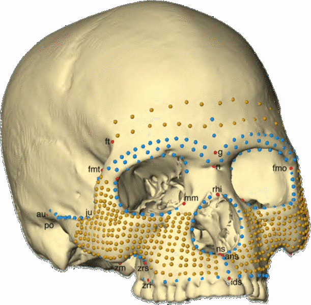
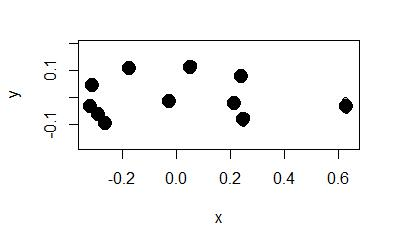
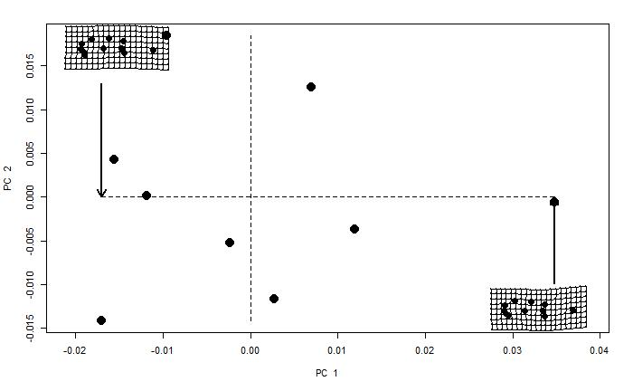
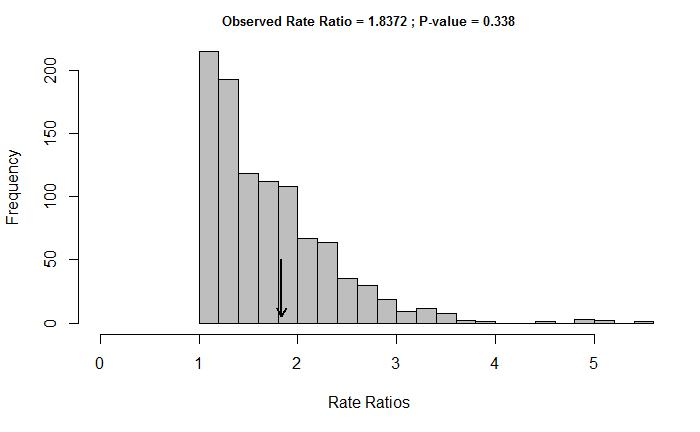
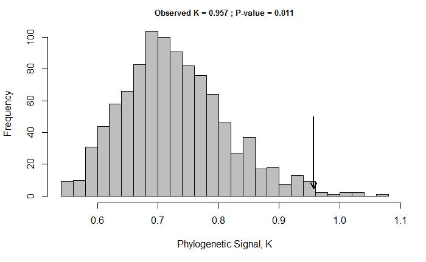

# Welcome, friends! 

Please go forth and scroll down to begin your journey though our group module assignment for AN 597. Our topic is "3D visualization and analysis".  
1. First, Julie will cover how to plot 3d surfaces, both non-interactively and interactively.  
2. Then Maria will cover how to collect and plot 3d landmark data.  
3. Finally, Zach will go over how to analyze landmark data.  

**A note before we start: Macs need XQuartz installed to be able to view images which use the rgl package. See the modules from Week 1 for instructions and click [here](https://www.xquartz.org/) to download.**

**Also, it's important to run through this in R studio. Many of these functions require feedback in the console or in a popup window, so they will not show in the knitted html. Additionally, the size of the mesh files and other 3D data means that the graphical output of many of these functions cannot be displayed correctly in the html output.**

# Part I : Plotting in 3D

## A brief introduction to non-interactive 3D plots

###`persp()` function

In the base R graphics system, the function `persp()` draws perspective plots of a surface over the x–y plane. Set `eval=TRUE` in the chunk below to run `demo(persp)`. The demo will give you an idea of what this function can do. 

```{r, eval=FALSE}
demo(persp)
```

A demo is an `.R` file that lives in `demo/`. Demos are like examples but tend to be longer. We can use the following line of code to check which packages have a native `demo()`. 

```{r}
demo(package=.packages(all.available = TRUE))
```

### {plot3D} package 

The {plot3D} package builds on on `persp()` to provide functions for both 2D and 3D plotting. Load the {plot3D} package and set `eval=TRUE` in the chunk below to go through some pretty impressive plot examples:

```{r, eval=FALSE}
install.packages("plot3D")
```

```{r}
library("plot3D")
```

```{r, eval=FALSE}
example(surf3D) #examples of 3D surfaces
example(persp3D) 
```

Let's do an example on our own. Use `surf3D()` to create a cut-away view of a Torus.

```{r}
# 3D Plot of Half of a Torus
par(mar = c(2, 2, 2, 2))
par(mfrow = c(1, 1))
R <- 3
r <- 2
x <- seq(0, 2*pi,length.out=50)
y <- seq(0, pi,length.out=50)
M <- mesh(x, y)
 
alpha <- M$x
beta <- M$y

surf3D(x = (R + r*cos(alpha)) * cos(beta),
       y = (R + r*cos(alpha)) * sin(beta),
       z = r * sin(alpha),
       colkey=FALSE,
       bty="b2",
       main="Half of a Torus")
```

Pretty cool, right? :D We can use these functions to create any 3D surface we can imagine. 

### {scatterplot3d} package 

It turns out there are SO MANY ways to create a 3D scatterplot, and (to me at least) all of them seem really useful and elegant. As you'll see, there are pros and cons to each method - which you should use depends on what function you're plotting for. Here, I'll first go over some non-interactive plotting functions, before getting into some interactive ones. 

The {scatterplot3d} package is the "go-to" package for simple, non-interactive 3D scatter plots. Load this package and set `eval=TRUE` in the chunk below to go through some examples of spirals, surfaces and 3D scatterplots: 

```{r, eval=FALSE}
install.packages("scatterplot3d") # Install
```

```{r}
library("scatterplot3d") # load
```

```{r, eval=FALSE}
example(scatterplot3d) 
```

This [link](http://www.sthda.com/english/wiki/scatterplot3d-3d-graphics-r-software-and-data-visualization) is really helpful if you want more information and detail about using {scatterplot3d} to create 3D plots. I won't go over this in detail because in my opinion, there are much more useful ways to create 3D plots that we'll go over in a bit more detail. 

### {lattice} package 

The {lattice} package has its own distinctive look. Once you see one lattice plot it should be pretty easy to distinguish plots made with this package from base graphics plots. Load the package and set `eval=TRUE` in the chunk below to see a 3D graph of a volcano, and 3D surface and scatter plots of iris data. 

```{r}
library(lattice)
```

```{r, eval=FALSE}
example(cloud)
```

## Interactive 3D plotting using the {rgl} package 

I've gone over {sctterplot3d} and {lattice} fairly quickly and with few examples. This is because I mainly want to focus on how to create *interactive* 3D visualizations. The first way to do this that I'll show you is with {rgl}. 

{rgl} is a 3D graphics package that produces real-time interactive 3D plots. It allows you to interactively rotate, zoom, and select regions of your graphic. 

Note that an RGL plot can be manually rotated by holding down on the mouse or touchpad. It can be also zoomed using the scroll wheel on a mouse or pressing `ctrl +` using the touchpad on a PC or two fingers (up or down) on a mac. These functions may not work in html, but should if you run in ***R***/***Rstudio***. 

### Install packages
Let's first set `eval=TRUE` in the chunk below to install the packages that you'll need for this section: 

```{r, eval=FALSE}
install.packages("rgl") # install
install.packages("car") 
```

```{r}
library("rgl") #load
library("car")
```

### Prepare the data

Let's take a look at the `iris` dataset: 

```{r}
data(iris)
head(iris)
```

Recall that the `iris` data set gives the measurements of the variables sepal length and width, petal length and width, respectively, for 50 flowers from each of 3 species of iris. The species are *Iris setosa*, *I. versicolor*, and *I. virginica*.

We'll use this dataset for the following examples. First we'll assign measurements of the variables sepal length, petal length, and sepal width.

```{r}
x <- sep.l <- iris$Sepal.Length
y <- pet.l <- iris$Petal.Length
z <- sep.w <- iris$Sepal.Width
```

### Start and close the RGL device
To make a 3d plot with {rgl}, you should first start the RGL device in ***R***. You can use the following function to manage the RGL device. 

* `rgl.open()`: Opens a new device
* `rgl.close()`: Closes the current device
* `rgl.clear()`: Clears the current device
* `rgl.cur()`: Returns the active device ID
* `rgl.quit()`: Shutdowns the RGL device system

You don't necessarily need to use open a new RGL device for each plot. 

Here we'll create a scatter plot using {rgl}, in 2 different ways:

###scatter3d()

First, the function `scatter3d()` uses the {rgl} package to draw a 3D scatter plot with various regression planes. 

```{r}
open3d()
scatter3d(x = sep.l, y = pet.l, z = sep.w, 
          xlab = "Sepal Length (cm)", ylab = "Petal Length (cm)",
          zlab = "Sepal Width (cm)")
rglwidget() #view the rgl device within your html doc
```
`x`, `y`, `z` are respectively the coordinates of points to be plotted. The arguments `y` and `z` can be optional depending on the structure of `x`.

Note that you can drag and drop to spin this plot around and view it from different angles. 

We can change the colors of the point and remove the regression surface:
```{r}
open3d()
scatter3d(x = sep.l, y = pet.l, z = sep.w,
        point.col = "blue", surface=FALSE, 
        xlab = "Sepal Length (cm)", ylab = "Petal Length (cm)",
        zlab = "Sepal Width (cm)")
rglwidget() #view the rgl device within your html doc
```

We can also use the format:

> scatter3d(formula, data)

Where `formula` is a model formula of form `y ~ x + z` and `data` is the data frame within which to evaluate the formula. If you want to plot the points by groups, you can use `y ~ x + z | g` where `g` is a factor dividing the data into groups

This is an example where we plot the points by groups:
```{r}
open3d()
scatter3d(x = sep.l, y = pet.l, z = sep.w, groups = iris$Species, 
          xlab = "Sepal Length (cm)", ylab = "Petal Length (cm)",
          zlab = "Sepal Width (cm)")
rglwidget() #view the rgl device within your html doc
```

We can remove the grids:
```{r}
open3d()
scatter3d(x = sep.l, y = pet.l, z = sep.w, groups = iris$Species,
          xlab = "Sepal Length (cm)", ylab = "Petal Length (cm)",
          zlab = "Sepal Width (cm)",
          grid = FALSE)
rglwidget() #view the rgl device within your html doc
```

The display of the surface(s) can be changed using the argument `fit`. Possible values for `fit` are `“linear”`, `“quadratic”`, `“smooth”` and `“additive”`:

```{r}
open3d()
scatter3d(x = sep.l, y = pet.l, z = sep.w, groups = iris$Species,
          xlab = "Sepal Length (cm)", ylab = "Petal Length (cm)",
          zlab = "Sepal Width (cm)", 
          grid = FALSE, fit = "smooth")
rglwidget() #view the rgl device within your html doc
```

We can remove surfaces as before `(argument surface = FALSE)`, and add concentration ellipsoids. 

```{r}
open3d()
scatter3d(x = sep.l, y = pet.l, z = sep.w, groups = iris$Species,
          xlab = "Sepal Length (cm)", ylab = "Petal Length (cm)",
          zlab = "Sepal Width (cm)",
          surface=FALSE, ellipsoid = TRUE)
rglwidget() #view the rgl device within your html doc
#rgl.close()
```

### Export images

The function `rgl.snapshot()` will save the screenshot as a png. 

```{r}
#rgl.snapshot(filename="plot.png")
```

The function `rgl.postscript()` will save the screenshot to a file in ps, eps, tex, pdf, svg, or pgf form. 

For example, 

```{r}
#rgl.postscript("plot.pdf", fmt="pdf")
```

### `rgl.points()`

The function `rgl.points()` is used to draw a basic 3D scatter plot:
```{r}
open3d()
rgl.bg(color = "white") # Setup the background color
rgl.points(x, y, z, color ="blue", size =5) # Scatter plot
rgl.spheres(x, y, z, r = 0.2, color = "grey") # change the shape of points to spheres with center (x, y, z) and radius r. 
rgl.bbox(color = "#333377") # Add bounding box decoration
rglwidget() #view the rgl device within your html doc
#rgl.close()
```

Some extra formatting tools for `rgl.bbox` are:
1. `xlen`, `ylen`, `zlen`: values specifying the number of tickmarks on `x`, `y` and `z` axes, respectively
2. `marklen`: value specifying the length of the tickmarks
3. `…`: other {rgl} material properties (see `?rgl.material`) including:
4. `color`: a vector of colors. The first color is used for the background color of the bounding box. The second color is used for the tick mark labels.
5. `emission`, `specular`, `shininess`: properties for lighting calculation
6. `alpha`: value specifying the color transparency. The value should be between `0.0` (fully transparent) and `1.0` (opaque)

### Label points interactively with the mouse

The function `identify3d()`, within the {car} package allows you to label points interactively with the mouse. 
```{r}
open3d()
rgl.bg(color = "white") # Setup the background color
rgl.points(x, y, z, color ="blue", size =5) # Scatter plot
#identify3d(x = sep.l, y = pet.l, z = sep.w, labels=row.names(iris), buttons=c("left", "right"))
rglwidget() #view the rgl device within your html doc
```
NOTE: you must uncomment the line of code above to have `identify3d()` work. The interactive portion does not function within an html doc, but it does if you run the script through ***R***/***Rstudio***. 

Using "buttons", I've set it so that you use left click to pick points and right click to exit. You can set it differently if you wish. You can also choose different labels - currently, it is set to displace the row name of the point you pick. 

### We can add axis lines and labels

For the function `rgl.lines()`, the arguments `x`, `y`, and `z` are numeric vectors of length 2 (i.e, : `x = c(x1,x2)`, `y = c(y1, y2)`, `z = c(z1, z2)` ).

The values `x1`, `y1` and `y3` are the 3D coordinates of the line starting point.
The values `x2`, `y2` and `y3` corresponds to the 3D coordinates of the line ending point.

```{r}
open3d()

# Make a scatter plot
rgl.spheres(x, y, z, r = 0.2, color = "yellow") 
# Add x, y, and z Axes
rgl.lines(c(min(x), max(x)), c(0, 0), c(0, 0), color = "black")
rgl.lines(c(0, 0), c(min(y),max(y)), c(0, 0), color = "red")
rgl.lines(c(0, 0), c(0, 0), c(min(z),max(z)), color = "green")
rglwidget() #view the rgl device within your html doc
```

As you can see, the axes are drawn but the problem is that they don’t cross at the point `c(0, 0, 0)`.

There are two solutions to handle this situation:

1. Scale the data to make things easy. Transform the `x`, `y` and `z` variables so that their `min = 0` and their `max = 1`
2. Use `c(-max, +max)` as the ranges of the axes

#### First, we can scale the data: 

```{r}
x1 <- (x - min(x))/(max(x) - min(x))
y1 <- (y - min(y))/(max(y) - min(y))
z1 <- (z - min(z))/(max(z) - min(z))
```

```{r}
open3d()

# Make a scatter plot
rgl.spheres(x1, y1, z1, r = 0.02, color = "yellow") 
# Add x, y, and z Axes
rgl.lines(c(0, 1), c(0, 0), c(0, 0), color = "black")
rgl.lines(c(0, 0), c(0,1), c(0, 0), color = "red")
rgl.lines(c(0, 0), c(0, 0), c(0,1), color = "green")
rglwidget() #view the rgl device within your html doc
```

#### OR, we can use c(-max,max)

This helper function will help us calculate the axis limits:
```{r}
lim <- function(x){c(-max(abs(x)), max(abs(x))) * 1.1}
```

```{r}
open3d()
# Make a scatter plot
rgl.spheres(x, y, z, r = 0.2, color = "yellow") 
# Add x, y, and z Axes
rgl.lines(lim(x), c(0, 0), c(0, 0), color = "black")
rgl.lines(c(0, 0), lim(y), c(0, 0), color = "red")
rgl.lines(c(0, 0), c(0, 0), lim(z), color = "green")
rglwidget() #view the rgl device within your html doc
```

### CHALLENGE 1

Create a custom function called "rgl_add_axes()" to add `x`, `y`, and `z` axes.

This function should take in `x`, `y`, and `z`; have `axis.col` be "grey" as default; include `xlab`, `ylab`, and `zlab`; have default option `show.plane` as "TRUE" (to add the axis planes); have `show.bbox` have default as "FALSE" (to add the bounding box decoration); and have `bbox.col` determine the bounding box colors (having the first color as the background color and the second color as the color of tick marks). 

Hints: The function `rgl.texts(x, y, z, text)` is used to add texts to an RGL plot. Also, `rgl.quads(x, y, z)` is used to add planes. `x`, `y` and `z` are numeric vectors of length four specifying the coordinates of the four nodes of the quad.

Answer to this challenge can be found [here](http://www.sthda.com/english/wiki/a-complete-guide-to-3d-visualization-device-system-in-r-r-software-and-data-visualization).


### Use {rgl} to create a surface animation of the globe 

Here we'll use the `persp3d()` function within {rgl} to create a surface animation of the globe. 

First provide formulas for the latitutde and longitude. 
```{r}
lat <- matrix(seq(90, -90, len = 50)*pi/180, 50, 50, byrow = TRUE)
long <- matrix(seq(-180, 180, len = 50)*pi/180, 50, 50)
```

Then, define some useful variables, including x, y, and z. 

```{r}
r <- 6378.1 # radius of Earth in km
x <- r*cos(lat)*cos(long)
y <- r*cos(lat)*sin(long)
z <- r*sin(lat)
```

Open a window for our creation (optional) and use the function `persp3d()` to draw a globe. 

```{r}
open3d()
persp3d(x, y, z, col = "white", 
       texture = system.file("textures/worldsmall.png", package = "rgl"), 
       specular = "black", axes = FALSE, box = FALSE, xlab = "", ylab = "", zlab = "",
       normal_x = x, normal_y = y, normal_z = z)
rglwidget() #view the rgl device within your html doc
```
```{r eval=FALSE}
if (!rgl.useNULL())
  play3d(spin3d(axis = c(0, 0, 1), rpm = 16), duration = 2.5)
rglwidget() #view the rgl device within your html doc
```

Animate our globe. 

Note: This doesn't animate in the html document, but it should run in the RGL device if you run it in ***R***/***Rstudio***. 

## Interactive 3D plotting using the {plotly} package

{plotly} is an ***R*** package that helps you create interactive web-based graphs and 3D surfaces.

You can set `eval=TRUE` in the chunk below to install the package from CRAN.

```{r, eval=FALSE}
install.packages("plotly")
```

Or you can install the latest from Github. 
```{r, eval=FALSE}
devtools::install_github("ropensci/plotly")
```

You must have ***R*** v.3.2.0 for these installs to work. 

```{r}
library(plotly)
library(rgl)
```

### Generalized format for basic plotting in R

> plot_ly( x , y ,type,mode,color,size )

Where:
<ul>
<li> `size` = values for same length as x, y and z that represents the size of datapoints or lines in plot.</li>
<li> `x` =  values for x-axis.</li>
<li> `y` = values for y-axis.</li>
<li> `type` = to specify the plot that you want to create like “histogram”, “surface” , “box”, etc.</li>
<li> `mode` = format in which you want data to be represented in the plot. Possible values are “markers”, “lines, “points”.</li>
<li> `color` = values of same length as x, y and z that represents the color of datapoints or lines in plot.</li></ul>

This line of code will add the layout fields, like plot title axis title/ labels, axis title/ label fonts,  etc.

> layout(plot ,title , xaxis = list(title ,titlefont ), yaxis = list(title ,titlefont ))

Where:
<ul><li>`plot` = the plotly object to be displayed</li>
<li>`title` = string containing the title of the plot</li>
<li>`xaxis : title` = title/ label for x-axis</li>
<li>`xaxis : titlefont` = font for title/ label of x-axis</li>
<li>`yaxis : title` = title/ label for y-axis</li>
<li>`yaxis : titlefont` = font for title/ label of y-axis</li></ul>

Let's run through an example with the iris dataset we've been using: 

### Basic visualizations

{plotly} graphs are interactive. Here are some basic functions that {plotly} enables you to do: 
<ul><li>hovering your mouse over the plot to view associated attributes</li>
<li>selecting a particular region on the plot (click-and-drag on the chart) using your mouse to zoom</li>
<li>resetting the axis (double-click to autoscale)</li>
<li>rotating the 3D images</li>
<li>click on legend entries to toggle traces</li>
<li>shift-and-drag to pan</li></ul>

#### An interactive histogram 
```{r}
#attaching the variables
attach(iris)
open3d()
#plotting a histogram with Sepal.Length variable and storing it in hist
hist<-plot_ly(x=Sepal.Length,type='histogram')

#defining labels and title using layout()
layout(hist,title = "Iris Dataset - Sepal.Length",
xaxis = list(title = "Sepal.Length"),
yaxis = list(title = "Count"))
```

#### An interactive box plot
```{r}
#plotting a Boxplot with Sepal.Length variable and storing it in box_plot
box_plot<-plot_ly(y=Sepal.Length,type='box',color=Species)

#defining labels and title using layout()
layout(box_plot,title = "Iris Dataset - Sepal.Length Boxplot",
yaxis = list(title = "Sepal.Length"))
```

#### An interactive scatter plot

```{r}
#plotting a Scatter Plot with Sepal.Length and Sepal.Width variables and storing it in scatter_plot1
scatter_plot1<-plot_ly(x=Sepal.Length,y=Sepal.Width,type='scatter',mode='markers')

#defining labels and titile using layout()
layout(scatter_plot1,title = "Iris Dataset - Sepal.Length vs Sepal.Width",
xaxis = list(title = "Sepal.Length"),
yaxis = list(title = "Sepal.Width"))
```

#### Let’s go a step further and add another dimension (Species) using color.

```{r}
#plotting a Scatter Plot with Sepal.Length and Sepal.Width variables with color representing the Species and storing it in scatter_plot12
scatter_plot2<-plot_ly(x=Sepal.Length,y=Sepal.Width,type='scatter', mode='markers', color = Species)

#defining labels and titile using layout()
layout(scatter_plot2,title = "Iris Dataset - Sepal.Length vs Sepal.Width", 
       xaxis = list(title = "Sepal.Length"),
       yaxis = list(title = "Sepal.Width"))
```


Although data frames can be thought of as the central object in this package, {plotly} visualizations don’t actually require a data frame. This makes chart types that accept a `z` argument especially easy to use if you have a numeric matrix. 

#### We can even add another dimension (Petal Length) to the plot by using the size of each data point in the plot.

```{r}
#plotting a Scatter Plot with Sepal.Length and Sepal.Width variables with color represneting the Species and size representing the Petal.Length. Then, storing it in scatter_plot3
scatter_plot3<-plot_ly(x=Sepal.Length,y=Sepal.Width,type='scatter',mode='markers',color = Species,size=Petal.Length)

#defining labels and titles using layout()
layout(scatter_plot3,title = "Iris Dataset - Sepal.Length vs Sepal.Width",
       xaxis = list(title = "Sepal.Length"),
       yaxis = list(title = "Sepal.Width"))
```

#### An interactive 3D scatterplot
```{r}
scatter_plot4 <- plot_ly(x=Sepal.Length,y=Sepal.Width,z=Petal.Length,type="scatter3d",mode='markers',size=Petal.Width,color=Species)

layout(scatter_plot4,title = "Iris Dataset in 3D")
```

#### An interactive time series plot

To plot a time series, let's load in a different dataset on international airline passengers. 

```{r}
data(AirPassengers)
str(AirPassengers)
```

As you can see, this dataset is a time-series from 1949 to 1961. 

```{r}
time_series<-plot_ly(x=time(AirPassengers),y=AirPassengers,type="scatter",mode="lines")

# defining labels and title using layout()
layout(time_series,title = "AirPassengers Dataset - Time Series Plot",
xaxis = list(title = "Time"),
yaxis = list(title = "Passengers"))
```

#### An interactive heat map

To plot an interactive heat map, let's load in a different (volcano) dataset. 

```{r}
#Loading the data
data(volcano)

#Checking dimensions
dim(volcano)
```

```{r}
p <- plot_ly(z = volcano, type = "surface")
p
```

Aside: As it turns out, there are more than 50 ways to plot this volcano set from ***R***, using the package {plot3d}. Learn more at this [link](https://cran.r-project.org/web/packages/plot3D/vignettes/volcano.pdf). 

### Using {plotly} with {ggplot2}

{ggplot2} is arguably one of the best data visualization libraries. {plotly} has a very useful {ggplot2} converter that quickly and easily turns {ggplot2} plots into interactive, web-based plots. 
Set `eval=TRUE` in the chunk below if you need to install these packages. 

```{r, eval=FALSE}
#load necessary libraries
install.packages('ggplot2')
install.packages('ggmap')
```

```{r}
library('ggplot2')
library('ggmap')

#List of Countries for ICC T20 WC 2017
ICC_WC_T20 <- c("Australia",
"India",
"South Africa",
"New Zealand",
"Sri Lanka",
"England",
"Bangladesh",
"Pakistan",
"West Indies",
"Ireland",
"Zimbabwe",
"Afghanistan")

#extract geo location of these countries
countries <- geocode(ICC_WC_T20)

#map longitude and latitude in separate variables
nation.x <- countries$lon
nation.y <- countries$lat

#using ggplot to plot the world map
mapWorld <- borders("world", colour="grey", fill="lightblue")

#add data points to the world map
q<-ggplot() + mapWorld + geom_point(aes(x=nation.x, y=nation.y) ,color="red", size=3)

#Using ggplotly() of ployly  to add interactivity to ggplot objects.
ggplotly(q) 

```

Note: {plotly} is not limited to ***R***. There are a lot of other languages/tools (including ***Python***, ***MATLAB***, ***Perl***, ***Julia***, ***Arduino***) that support it as well. 

Moreover, one of the main advantages of {plotly} that I didn't go over today is that {plotly} plots can easily be shared (and edited by people with no technical background for creating interactive plots) online by uploading the data and using the {plotly} GUI.

If you'd like more resources, [this link](https://plot.ly/r/) is an amazing resource. 

Hopefully this first part of our module has given you a good grasp on how to create 3d visualizations in ***R***!

```{r, echo=FALSE}
detachAllPackages <- function() {

  basic.packages <- c("package:stats","package:graphics","package:grDevices","package:utils","package:datasets","package:methods","package:base")

  package.list <- search()[ifelse(unlist(gregexpr("package:",search()))==1,TRUE,FALSE)]

  package.list <- setdiff(package.list,basic.packages)

  if (length(package.list)>0)  for (package in package.list) detach(package, character.only=TRUE)

}

detachAllPackages()
```

#Part II: Geometric morphometric analysis in R with 3D data


Geometric morphometrics is a technique used to quantify and analyze patterns in shapes across 2D and 3D specimens. For example, using morphometrics, you could quantify differences in the shape of a specific feature, say, the wing of an insect, within and across multiple species. In this tutorial, you will learn how to import and create landmark data in ***R*** for morphometric analysis using the package {geomorph}. The {geomorph} package allows us to make comparisons between specimens across the shapes of fixed points, curves and surfaces.

##Install {geomorph}

When installing {geomorph}, making sure `dependencies = TRUE` so that it also installs packages on which {geomorph} depends to function. 
```{r install, eval=FALSE}
install.packages("geomorph", dependencies = TRUE)
```

###Packages used in this section
```{r load packages,warning=FALSE}
library(geomorph)
library(Morpho)
library(abind)
library(curl)
library(knitr)
library(rgl)#Installed with geomorph
```

##Importing 3D data

The {geomorph} package allows you to input 3D data in ASCII `.ply` format which is a common output from 3D scanners. Here you will load three 3D scans of archaeological arrow heads from an online repository of 3D models [sketchfab](https://sketchfab.com/demoon/collections/ref_weapon_neolit)

Note: this may take a couple of minutes

```{r load,warning=FALSE}
library(curl)
library(geomorph)
f1 <- curl("https://raw.githubusercontent.com/mazattack/Group_Module/master/Data/A1.ply")
A1<-read.ply(f1) #using Geomorph
A2<-read.ply(curl("https://raw.githubusercontent.com/mazattack/Group_Module/master/Data/A2.ply"))
A3<-read.ply(curl("https://raw.githubusercontent.com/mazattack/Group_Module/master/Data/A3.ply"))
```

We can inspect this data most simply using `plot3d()` in the {rgl} package. This package is loaded by default when you load the geomorph package. 

```{r,warning=FALSE}
plot3d(A1) #Run in R to view in 3D
```

To import 3D data in binary `.ply` format, you can use the {Morpho} package.

```{r, eval=FALSE,warning=FALSE}
library(Morpho)
name<-file2mesh(curl("https://raw.githubusercontent.com/mazattack/Group_Module/master/Data/A2.ply"))#using Morpho
```

## Selecting landmarks

For geomorphometric analysis, we must first select *landmarks* on each of the specimens which will serve as standardized points, across which measurements and comparisons can be made. 

### Important Requirements for Landmarks

Remember the following requirements for landmarks:
<ol><li>Each image must have the same number of landmarks</li>
<li>The landmarks on each image must be in the same order</li>
<li>Landmarks are ordinarily placed on homologous points, points that can be
replicated from object to object based on common morphology, common
function, or common geometry</li>
<li>You may have to flip some images so that are not reversed left to right (e.g., if
most of your images show the right side, flip left side images so that they
mimic right side)</li></ol>

#### Collecting Landmarks on 2D data or with other software. 

Landmarks can be collected with other software, such as ***ImageJ*** with ***Point Picker*** installed. See these helpful resources:
[ImageJ – open-source software for image processing](http://rsbweb.nih.gov/ij/download.html)
[Point Picker plugin for ImageJ](http://bigwww.epfl.ch/thevenaz/pointpicker/)
[This user guide on digitizing in ImageJ](http://www.indiana.edu/~g562/Handouts/Collecting%20Landmarks.pdf) is really helpful. 

We can digitize 2D landmarks on `.jpg` files using the `digitize2d()` function in {geomorph}. 

[This user guide](https://rdrr.io/cran/geomorph/man/digitize2d.html) is really helpful for this. 
Also see 15.1 in [this user guide](file:///Volumes/Julie17/Quick_Guide_to_Geomorph-3.0.pdf). 

The user provides a list of image names, the number of landmarks to be digitized, and the name of an output TPS file. An option is included to allow the user to digitize a scale on each image to convert the landmark coordinates from pixels into meaningful units. Landmarks to be digitized can include both fixed landmarks and semi-landmarks, the latter of which are to be designated as "sliders" for subsequent analysis (see the function `define.sliders()`).

### Selecting fixed landmarks on 3D data
For 3D data, `digit.fixed()` from the geomorph package is used for selecting fixed landmarks that do not change from specimen to specimen, and `digit.curves()` and `digitsurface()` are tools for creating semi-landmarks along curves and surfaces which slide between the fixed landmarks. These sliding landmarks can also be defined from existing landmark data using `define.sliders`. In this tutorial, we will first define the fixed landmarks for three arrowheads, and create a template of surface semi-landmarks from A1 to calculate the surface landmarks of the other two arrowheads. 

Use `digit.fixed()` to selected fixed landmarks on the first specimen, this will save a `.nts` landmark file to the directory. You will use the console to confirm each point using y/n. 

On ***Windows*** machines, double right click to select the landmark.

On a ***Mac***, you must go the Preferences>Input> of ***XQuartz*** and tick "Emulate three button mouse". After that you can press the pad button to rotate the 3D mesh, press the pad button while holding down the COMMAND key to select a vertex to be used as a landmark, and press the pad button while holding down OPTION to adjust mesh perspective. Finally, you can use the mouse trackpad with two fingers to zoom in and out.

This can be kind of troublesome. The easiest way is to orient the arrowhead as shown below, and double right click along the edge where the landmarks are highlighted. You should click in the same order for each set of fixed landmarks so keep track of where you start. 

**Note: for this tutorial, start at the tip of the arrow and select in a clockwise order**.

```{r eval=FALSE}
A1_fix<-digit.fixed(A1, 10)#mesh, number of fixed landmarks to create. If you need to measure the shape of a curve, add in landmarks along the curve to be converted to sliders later on. 
A1_fix #run in R to see output
```
```{r echo=FALSE, results="hide",warning=FALSE}
wd<-getwd()
setwd("./Digit")
A1_nts<-readmulti.nts(c("A1_digit.nts"))
setwd(wd)
```


###Inspecting landmarks
We can inspect these landmarks using `plotspec()` to plot the landmarks you have just created on the 3D mesh.

```{r eval=FALSE}
plotspec(A1, A1_fix, centered=TRUE)#these may not overlap unless you specify centered = TRUE
```
```{r echo=FALSE}
plotspec(A1, A1_nts[,,1], centered=TRUE, ptsize=1)#I found the output below nicer to work with, but cannot be run from knitr
#rglwidget() crashes R
```

You can now find the `A1.nts` file in your working directory, this file will be overwritten each time you run digit.fixed on the same specimen, so remember to make a copy if you want to test different landmark points. 

Let's load that landmark file and compare the first sheet of this 3D matrix to the `A1_fix` created above.

```{r eval=FALSE}
A1_nts<-readmulti.nts(c("A1.nts"))#file must be located in working directory
A1_nts[,,1]
```
```{r echo=FALSE}
A1_nts[,,1]
```

In order to use the landmark data directly in functions like `plotspec()`, we must reference the first sheet of data, even if only one specimen is listed in the data set.

```{r}
plotspec(A1, A1_nts[,,1], centered=TRUE, ptsize=1)
#rglwidget() does not work here
```

## Build template
Now lets build a template using these fixed points, to create semi-landmarks over the surface of the model. This template will be used to create surface sliders for the remaining specimens. "buildtemplate" will overwrite your .nts files with your new landmark data, as well as create a "surfslide.csv" file in the working directory, which codes which landmarks are the surface sliders, and a template.txt which provides the xyz coordinates for the sliders.

```{r eval=FALSE}
A1_temp<-buildtemplate(A1, A1_fix, 50, ptsize=1) #mesh, file of landmark data, number of surface sliders to create, point size
A1_temp
```
```{r echo=FALSE}
A1_temp<-buildtemplate(A1, A1_nts[,,1], 50, 1, TRUE)
A1_temp
```

Now let view our template. How well does it match our 3D specimen?

```{r eval=FALSE}
plotspec(A1, A1_temp, ptsize=5, centered=T)#run in R studio for output
```

If you need to edit the template you can use `editTemplate()` to remove *n* points from the template.

```{r eval=FALSE}
A1_temp_ed<-editTemplate(template=A1_temp, fixed=8, n=1)#template, # of fixed points, number of points to be removed
```

##Create semi-landmarks
Finally, we can use that template to create a series of landmarks for the remainder of our sample. In `digitsurface()` we can either use existing landmark data for that specimen to align the semi-landmarks across the surface of the specimen, or create the landmarks directly within the function, the same way we did with `digit.fixed()`. Let's try out both ways here. Remember, the fixed landmarks must be in the same location and order in each specimen. This function will also read in the template data in the working directory to assign the landmarks.

```{r eval=FALSE}
digitsurface(spec=A2, fixed=10, ptsize=1, centered=TRUE)
```
```{r echo=FALSE, results="hide"}
wd<-getwd()
setwd("./Digit")
A2_nts<-readmulti.nts(c("A2_digit.nts"))
setwd(wd)
```

```{r echo=FALSE, results="hide"}
digitsurface(A2, A2_nts[,,1], 1, TRUE)
```

We can also run the digitsurface using existing landmark data. Let's use an `.nts` file I created for A3. First read in the data. Since we are working with `.nts` files, we can use `readmulti.nts()` to load the data.  
Download the landmark file A3.nts from https://github.com/mazattack/Group_Module/tree/master/Data and place it in your working directory. Reminder, to see your working directory, use `getwd()`.

```{r echo=FALSE, results="hide",warning=FALSE}
wd<-getwd()
setwd("./Digit")
A3_nts<-readmulti.nts(c("A3_digit.nts"))
setwd(wd)
```

```{r eval=FALSE, results="hide",warning=FALSE}
A3_nts<- readmulti.nts(c("A3.nts"))
digitsurface(A3, A3_nts[,,1], 1, TRUE)
```
```{r echo=FALSE, results="hide",warning=FALSE}
digitsurface(A3, A3_nts[,,1], 1, TRUE)
```

Finally, because two of our initial fixed landmarks fall along a curve with no distinguishing features, we should define them as sliders too. We must select the landmark at the start of the curve, the slider and the landmark at the end of the curve. In the following function, select landmarks 3, 2, 1, and 1, 10, 9. NOTE: that usually, you would want to place many more landmarks along a curve, and they should be defined as overlapping sliding landmarks, i.e. 1, 2, 3 and 2, 3, 4, and 3, 4, 5.


```{r eval=FALSE}
sliders<-define.sliders(landmarks=A1_temp, nsliders=2, surfsliders = TRUE, write.file = TRUE)
```
```{r echo=FALSE}
wd<-getwd()
setwd("./Curve")
sliders<-as.matrix(read.csv("curveslide.csv"))
setwd(wd)
```

```{r}
sliders
```

Now that we have imported all our 3D models, loaded and created the fixed and semi-landmarks, we need to transform them into a format for geomorphometric analysis. The easiest way to do this is load the raw landmark data into a 3D array.

##Importing landmark data

Whether you used ***R*** or ***ImageJ*** to collect digitized landmark coordinates, you can use ***R*** to import those landmark data. Landmark data brought into ***R*** can be in a variety of formats. Our functions can deal with the most common: `.tps` files, `.nts` files, and *Morphologicka* files. All of these functions return a 3D array, which is the preferred data format for landmark data.
<ul>
<li>If you have a single `.nts` file with the landmarks of multiple specimens use `readlands.nts()` to import. </li>
<li>If you have multiple `.nts` files with the landmarks of a single specimen use `readmulti.nts()`.</li>
<li>If you have a single `.tps` file, used `readlands.tps()`.</li></ul>

First you must create a filelist containing an array of the file names you will import.

```{r eval=FALSE}
filelist <- list.files(pattern = ".nts")#This will search the working directory (default) for the files containing .nts
filelist
```
```{r echo=FALSE, results="hide"}
setwd("./Surface")
filelist <- list.files(pattern = ".nts")#This will search the working directory (default) for the files containing .nts
arrow_nts<-readmulti.nts(filelist)
setwd(wd)
```

Here we will use `readmulti.nts()` to load the three `.nts` files we created containing the fixed and semi-fixed landmarks. The number of landmarks in each file must be identical.

```{r eval=FALSE}
arrow_nts<-readmulti.nts(filelist)
str(arrow_nts)
arrow_nts #note how the data is formatted
```
```{r echo=FALSE}
str(arrow_nts)
arrow_nts #note how the data is formatted
```

###Importing `.nts`/`.tps` in bulk
To import multiple `.nts` files with multiple specimens or multiple `.tps` files, you can use the function below. Simply replace the two `.nts` sections with `.tps`. 

```{r eval=FALSE}
require(abind)
filelist <- list.files(pattern = ".nts") #this will list files in the wd, use "path=" to specify files in another location
mydata <- NULL
for(i in filelist){
  tmp <- readland.nts(i)
  mydata$coords <- abind(mydata$coords, tmp)
  mydata$names <- rbind(mydata$names,cbind(dimnames(tmp)[[3]], i))
}
colnames(mydata$names) <- c("file") #If the file specifies species ID, I think this should be c("specimen", "file")
```

Note: There are more variables to specify with `.tps`, including species ID names and curve data. See the help file for more info. 

##Viewing landmark data
We can view the landmark data all together using `plotAllspecimens()`

```{r eval=1}
plotAllSpecimens(arrow_nts)
rglwidget()
```

You'll notice that the arrowhead landmarks are not aligned to one another. For this, we need to use a function that with align the models based on the landmarks we selected. 

## GPAGEN function
Generalized Procrustes Analysis (GPA) is a common statistical analysis for quantifying and comparing the shape of objects. The `gpagen()` function aligns and superimposes the landmark data and calculates the mean shape of those objects combined. The output of the `gpagen()` is the primary data set for subsequent analyses and statistical tests that describe the shape of the objects.

```{r,message=FALSE}
GPA<-gpagen(arrow_nts, curves=sliders, surfaces = 11:60)#11:60 are the numbers assigned to the landmarks we created with digit.surf, the first 10 are fixed, and we created 50 semi-landmarks 11:60
```

If we examine GPA output in the console, it will provide us info about what analyses was run, the dimensions of the model, and the mean coordinates of the landmarks across our specimens. Note `summary(GPA)` provides the same output. `View(GPA)` provides an overview of what is in our list.

```{r}
summary(GPA)
```

You can also view in ***RStudio*** with:

```{r eval=FALSE}
View(GPA)
```

Inspect the different data sets attached to GPA and read their descriptions below. 
<ul>
<li>*coords*	
A (p x k x n) array of aligned Procrustes coordinates, where p is the number of landmark points, k is the number of landmark dimensions (2 or 3), and n is the number of specimens. The third dimension of this array contains names for each specimen if specified in the original input array.</li>
<li>*Csize*	
A vector of centroid sizes for each specimen, containing the names for each specimen if specified in the original input array.</li>
<li>*iter*	
The number of GPA iterations until convergence was found (or GPA halted).</li>
<li>*points.VCV*	
Variance-covariance matrix among landmark coordinates.</li>
<li>*points.var*	
Variances of landmark points.</li>
<li>*consnsus*	
The consensus (mean) configuration.</li>
<li>*p*	
Number of landmarks.</li>
<li>*k*
Number of landmark dimensions.</li>
<li>*nsliders*	
Number of semilandmarks along curves.</li>
<li>*nsurf*	
Number of semilandmarks as surface points.</li>
<li>*data*	
Data frame with an n x (pk) matrix of Procrustes residuals and centroid size.</li>
<li>*Q*	
Final convergence criterion value.</li>
<li>*slide.method*	
Method used to slide semilandmarks.</li>
<li>*call*	
The match call.</li></ul>

### Plot aligned landmarks
For our purposes, the most important part of the GPA list is the `$coords` data, the coordinates of the aligned landmark data for each specimen.

Let's plot GPA to see our aligned landmark data (in grey) and the mean shape of the arrowheads (in black).

```{r, echo=1}
plotAllSpecimens(GPA$coords)
rglwidget()
```

To see the mean shape more clearly, we can define the links between the points using a matrix which defines the order to link the points together.

```{r}
alinks <- matrix(c(1,rep(2:10, each=2),1), nrow=10, byrow=TRUE) #we have 10 landmarks. for an example with "n" landmarks, change both "10" to "n". 
alinks
```
```{r}
plotAllSpecimens(GPA$coords, links=alinks)
```

To view the mean shape created by gpagen, we can use the function `mshape()`:

```{r}
meanarrow<-mshape(GPA$coords)
```
```{r}
plot(meanarrow)
```

###Visualizing differences in shape
To visualize the differences between the specimens and the mean, we can use the function `plotRefToTarget()`, with `M1` as the reference specimen and `M2` as the target specimen. 

```{r eval=FALSE}
plotRefToTarget(M1=meanarrow,M2=GPA$coords[,,1],method="points") #M2 here is the first specimen A1
```
```{r echo=FALSE}
plotRefToTarget(M1=meanarrow,M2=GPA$coords[,,1],method="points") #M2 here is the first specimen A1
rglwidget()
```

If we add our `alinks` for the outline, we can add an outline of the target (black) and reference (gray) shape to the plot. 

```{r eval=FALSE}
plotRefToTarget(meanarrow,GPA$coords[,,1],method="points", links = alinks)
```
```{r echo=FALSE}
plotRefToTarget(meanarrow,GPA$coords[,,1],method="points", links = alinks)
rglwidget()
```

In this next example, the target points are colored red, and their links are blue. Target=A3, Ref=Mean shape:

```{r eval=FALSE}
plotRefToTarget(meanarrow,GPA$coords[,,3],gridPars=gridPar(tar.pt.bg = "red", tar.link.col="blue",
tar.link.lwd=2), method="point", links = alinks)
```
```{r echo=FALSE}
plotRefToTarget(meanarrow,GPA$coords[,,3],gridPars=gridPar(tar.pt.bg = "red", tar.link.col="blue",
tar.link.lwd=2), method="point", links = alinks)
rglwidget()
```

We can also compare across two specimens. Target=A1, Ref=A3:

```{r eval=FALSE}
plotRefToTarget(GPA$coords[,,3], method="point", GPA$coords[,,1],links = alinks)
```
```{r echo=FALSE}
plotRefToTarget(GPA$coords[,,3], method="point", GPA$coords[,,1],links = alinks)
rglwidget()
```

```{r, echo=FALSE}
detachAllPackages <- function() {

  basic.packages <- c("package:stats","package:graphics","package:grDevices","package:utils","package:datasets","package:methods","package:base")

  package.list <- search()[ifelse(unlist(gregexpr("package:",search()))==1,TRUE,FALSE)]

  package.list <- setdiff(package.list,basic.packages)

  if (length(package.list)>0)  for (package in package.list) detach(package, character.only=TRUE)

}

detachAllPackages()
```

#Part III: Multidimensional Trait Analysis
Biologically meaningful phenotypes are often multi dimensional simply because real phenotypes are under multidimensional selection, resulting in  modular subunits which interact as a complex, functional phenotype. (For example, if we are interested in the evolution of "Brain Size", we need to take into account how selection operates on different regions of the brain). Therefore, it is necesary to have analyses that can quantify and statiscally contrast multi-dimensional traits. 

The following are examples of such analyses using landmark data that quantify 11 dimensions of head shape for 40 *Plethodon* salamander species. This will include statisical programs such as PCA applied to high dimensional data sets as well as more novel analyses that allow analysis of phylogenetic information in high dimensional data. All of these analyses work with data that have been alligned via a GPA.  

## Basic Analyses
First, load and allign the *Plethodon* species data set that came with the geomorph package. These data consist of 11 head shape landmarks whose dimensions are alligned to a common x,y grid to produce 11 sets of coordinates that specify a single point in 11 dimensional trait space. 

```{r, eval=FALSE}
library(geomorph)
data(plethspecies)
Y.gpa<-gpagen(plethspecies$land)
Y.gpa
```

```{r,eval=FALSE}
Call:
gpagen(A = plethspecies$land)

Generalized Procrustes Analysis
with Partial Procrustes Superimposition

11 fixed landmarks
0 semilandmarks (sliders)
2-dimensional landmarks
2 GPA iterations to converge

Consensus (mean) Configuration

               X           Y
 [1,]  0.21321198 -0.02105584
 [2,]  0.24769363 -0.08046387
 [3,] -0.02712554 -0.01550055
 [4,] -0.26228896 -0.09485409
 [5,] -0.29017433 -0.06350496
 [6,] -0.31712433 -0.03118322
 [7,] -0.31143955  0.04394055
 [8,] -0.17573253  0.10754464
 [9,]  0.05243877  0.11186878
 [10,]  0.24134839  0.07648746
 [11,]  0.62919248 -0.03327890
 ```
 
As you can see, the means of the 11, alligned 2D landmarks are arranged in a table. To view the common, unitless grid containing 11 alligned points, use the following function with the landmark coordinates extracted:

```{r , eval=FALSE}
plotAllSpecimens(Y.gpa$coords)
```



You can obtain a summary of the PCA and plot of the first 2 PCs with the following functions. The summary shows the exact and cummulative proportion of total variance explained by most of the PCs.First, convert the data into a 2D data matrix organized by species and then do the PCA and then obtain a plot. 

```{r, eval=FALSE}
y<-two.d.array(Y.gpa$coords)
plotTangentSpace(Y.gpa$coords) 
```

```{r, eval=FALSE}
PC Summary

Importance of first k=8 (out of 9) components:
                          PC1     PC2     PC3      PC4      PC5     PC6      PC7      PC8
Standard deviation     0.01649 0.01059 0.01042 0.007543 0.005143 0.00355 0.002441 0.001259
Proportion of Variance 0.45640 0.18799 0.18199 0.095450 0.044380 0.02115 0.010000 0.002660
Cumulative Proportion  0.45640 0.64439 0.82637 0.921820 0.966200 0.98734 0.997340 1.000000
```


## Phylogenetic Comparative Biology
We can also use {geomorph} to analyze the phylogenetic information contained in multi-dimensional data. For instance, it is useful to study divergence of evolutionary rates between closely related species. An evolutionary rate (ER) can be defined as the net rate of phenotypic or genetic variance over evolutionary time. ERs can be analyzed at different levels of biological organization (from species to populations to within individual variation). From analyzing ERs, we can begin to determine if certain phenotypes or genotypes are more or less evolutionarily labile in order to explain phenotypic differences of interest. We can use the `compare.evol.rates()` and associated functions to do this. 

### Function Assumptions
- Estimation of ERs is done using either "R" or "Q" approaches. "R" approaches use matrices of ER variances and convariances among different species within a group. "Q" approaches use distance matrices (here, this means pairwise contrasing distances of species from the ancenstral node on a phylogenetic tree). The Q approach is beneficial for analysing multi-dimensional traits because although the number of covariance vlaues is dependent on trait dimensionality, the number of species pairwise distances is not. This allows for hypothesis testing without an increase in the probability of Type I error. The use of the Q approach has two implications for the analysis. First, it necesaitates that the data already be organized into a phylogeny in order for the distance matrix to be constructed. Second, for the sake of simplicity, the model of evolution used here is that of Brownian Motion. For more extensive description of Evolutionary Rate Analysis, see Adams (2013).

- Under Brownian Motion, particles move multiple times on different axes, with each subsequent displacement being random and independent with respect to the previous displacement and any other particle's displacement. As a result, the mean displacement of a particle is 0 and the net variance in the displacement only varies with time (`σ²t`). For our purposes, we can think of the particle as the traits of a phenotype moving under Brownian motion around an ancestral node in a high-dimensional morphospace. Evolution under brownian motion can be sumulated many times to produce a distribution of probabilities for the end result of where a given phenoype will existrelative to the ancestral node. The resulting distribution is normal, with a mean of 0 (no net displacment from the ancestral node) and variance as σ²t. The `compare.evol.rates()` function is most useful if you already have a well established phylogeny with known branch lengths and species distributions. For a more extensive description of the use of brownian Motion in phylogenetic analysis and a detailed text on phylogenetic analysis, see Felsenstein (2004).

- The analysis presented here makes use of landmark data already applied to a 3D object and contrasts among groups of speces. Again, multi-dimensional data such as 3D landmarks are well suited for this analysis, but any type of multi-dimensional data is applicable and this analysis is only limited to contrasting objects that have evolved from a LCA and have well established phylogenies. Species groups are one example used here, but the same could be done for any other evolving thing.

### Overview of How the Function Works

For the example here, the ERs of 2 species groups will be contrasted. The function calculates the average distance of each species pheotypic value from the ancestral node, calculates the multivariate evolutionary rates for the phenotypic value of each species group, and determines a ratio of the higher rate divided by the lower rate, a value that serves as a test statistic to contrast with a distribution of ratios for the null hypothesis of no difference between group ERs (i.e. a statistically single ER for the whole phylogeny)

The null distribution is constructed via calculation of a single ER for the entire phylogeny. Using the phylogeny and the single ER, simulated phenotypic data sets are produced at the tips of the phylogeny. The number of these simulations is manually determined, but it should be sufficiently hight to produce a reliable null distribution. Using this artificial data, ERs are calculated for the two groups after each simulation and the frequencies of the resulting ERs are used to create a null distribution for the analysis. 

### Working Through The Function

1) The *Plethodon* species data used here is the same as was used for earlier analyses. Call the *Plethodon* data and allign with a GPA if not done already. Again, this data consists of 11 head shape landmarks that will be alligned to produce 11 sets of coordinates (each coordinate will have a y and x component) that specify a single point in an 11 dimensional trait space. 

```{r, eval=FALSE}
library(geomorph)
data(plethspecies)
Y.gpa<-gpagen(plethspecies$land)
```
Example output for the landmarks of one species. 
```{r, eval=FALSE}
$coords
, , P_cinereus

          [,1]        [,2]
[1,]  0.21608543 -0.02080337
[2,]  0.25310261 -0.07708298
[3,] -0.01792156 -0.01448663
[4,] -0.26651651 -0.09752395
[5,] -0.28724162 -0.06453206
[6,] -0.31967119 -0.03239812
[7,] -0.31362497  0.04171542
[8,] -0.17675527  0.10909564
[9,]  0.05039109  0.11565174
[10,]  0.23977149  0.08099904
[11,]  0.62238049 -0.04063473
```

2) Now, establish the two groups of data whose means you'd like to contrast. Here, we'll differentiate between landmark data of endangered (designated level 1) and non-endangered species (designated level 2). These are organized as in the original data set provided in the package.You can also view what you have with the `names()` function. Note that it will be disorganized if you don't extract the phylogenetic data with the $phy$tip suffix to `plethspecies`.

```{r setup5, eval=FALSE}
gp.end<-factor(c(0,0,1,0,0,1,1,0,0))
gp.end
names(gp.end)<-plethspecies$phy$tip
names(gp.end)
```

```{r, eval=FALSE}
[1] 0 0 1 0 0 1 1 0 0
Levels: 0 1
[1] "P_serratus"       "P_cinereus"       "P_shenandoah"     "P_hoffmani"      
[5] "P_virginia"       "P_nettingi"       "P_hubrichti"      "P_electromorphus"
[9] "P_richmondi"     
```
3) Now the data is ready for running the actual analysis. Use the following function and inputs: 
`compare.evol.rates(A, phy, gp, iter = 999, method = c("simulation","permutation"), print.progress = TRUE)`

`A` = the data set in a 2D matrix (Here, this is the landmark coordinate data set alligned using the Y.gpa function earlier (`Y.gpa$coords`))

`phy` = the phylogeny in which the data is organized (Here, this is the data set with the phylogeny extracted (`plethspecies$phy`))

`gp` = the factor array that is defined for group membership (Here, this is `gp.end`)

`iter` = the number of iterations for significance testing

`method` = method to assess significance (simulation or permutation)
	: a permutation test will reshuffle the data to create sampling distributions for the test statistic without resampling.
	: a simulation test will allow resampling

```{r setup1, eval=FALSE}
ER<-compare.evol.rates(A=Y.gpa$coords,phy=plethspecies$phy,method=c("simulation"),gp=gp.end,iter=999, print.progress = TRUE)
ER
```
```{r, eval=FALSE}
Call:

Observed Rate Ratio: 1.8372

P-value: 0.318

Based on 1000 random permutations

The rate for group 0 is 1.79641754369177e-06  

The rate for group 1 is 3.30041235292046e-06 
```
The `plot()` function returns the null distribution showing the frequency of each rate ratio given 1000 iterations of brownian evolution at a fixed rate for the entire phylogeny. The arrow indicates where your test statistic falls on the distribution. Note that because this distribution is recreated for every analysis, although your observed rate ratio will always be the same for contrasting the two given groups, the associated ratio test statistic and p-value will vary as the null distribution changes.

```{r setup3, eval=FALSE}
plot(ER)
```



Based on the null distribution and summary data, the observed rate ratio will occur about 40/1000 (RR=1.8) times (p=0.338) if there is only one true rate for the phylogeny. If our alpha value is 0.05, our data do not support a hypothesis that the species have different evolutionary rates based on their status as endangered or not. 

## Calculating Phylogenetic Signal
We can not only calculate ER differences between defined groups of species, but estimate whether divergence of sister species is equivalent to divergence between non-sister species using analysis of phylogenetic signal. This is an estimation of the degree of covariation in phenotype due to shared ancestry. The mean head shape data points among the *Plethodon* species shouldn't be considered independent data because they all have shared evolutionary history and some species groups are more closely related than others. Therefore, geomorph provides a simple function for estimating the strength of phylogenetic signal in high dimensional data.

The strength of phylogenetic signal (PS) is estimated with a K Statistic that is used to contrast an observed PS to the PS expected under Brownian Motion. The K statistic is a complex ratio. The numerator is observed phenotypic variation/phenotypic variation under phylogenetic covariation.The denomonator is the ratio of phenotypic variation under Brownian Motion/the number of species. As with the ER analysis, geomorph uses a distance-based analysis for estimating PS and the null distribution is constructed analogously: Given a phylogeny, brownian evolution is simulated a specified number of times and a frequency distribution of simulated K values are obtained to which the actual K value is contrasted. The funtions for the PS analysis and distribution are as follows, where `A` = the data set used and `phy` = the extracted phylogenetic information. For a more detailed review of PS analysis for multi-dimensional data, see Adams (2014).

```{r setup4, eval=FALSE}
PS<- physignal(A=Y.gpa$coords,phy=plethspecies$phy,iter=999)
summary(PS)
plot(PS)
```
```{r, eval=FALSE}
Call:
physignal(A = Y.gpa$coords, phy = plethspecies$phy, iter = 999) 

Observed Phylogenetic Signal (K): 0.9573

P-value: 0.011

Based on 1000 random permutations
```


As you can see, the K value is in the upper tail of the distribution with a p value <0.5. Given an alpha of 0.05, we have support for rejecting the null hypothesis that evolution of these species occuring randomly. Those species who are sister species are more related than would be expected if brownain evolution had occured, the divergence between sister species is not equivalent to the divergence between non-sister species and therefore we should consider phylogeny when doing statisics on these data. Therefore, these phenotypic data support that the species are not all equally related. 

For an overview of all of {geomorph} functions and datasets, see the Package Documentation by Adams et al (2017)

# References Cited:

Adams, D.C.; Collyer,M; Kaliontzopoulou,A; Sherratt,E (2017) Geometric Morphometric Analyses of 2D/3D Landmark Data. URL: http://geomorphr.github.io/geomorph/

Adams, D.C. (2014) A Generalized K Statistic for Estimating Phylogenetic Signal from Shape and Other High-Dimensional Multivariate Data. Syst. Biol.63(5): 685-697

Adams, D.C. (2013) Quantifying and Comparing Phylogenetic Evolutionary Rates for Shape and Other
High-Dimensional Phenotypic Data. Syst. Biol. 63(2):166–177

Adams, D.C. and Otárola-Castillo, E. 2013  Geomorph: An r package for the collection and analysis of geometric morphometric shape data. Methods in Ecology and Evolution 4(4). 

Felsenstein J (2004) Inferring phylogenies. Sunderland (MA): SinauerAssociates 391-392
