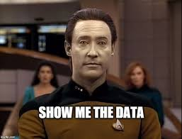
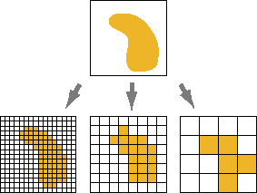
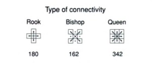
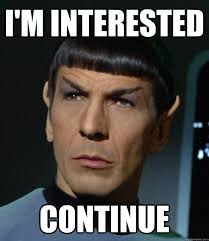

***

```{r setup, include=FALSE}
knitr::opts_chunk$set(
	echo = TRUE,
	warning = FALSE,
	comment = "##",
	prompt = FALSE,
	tidy = TRUE,
	tidy.opts = list(width.cutoff = 75),
	fig.path = "img/"
)
```

# Spatial Autocorrelation with a group of *MORANS* 

***

## Objectives

>Comparing spatial autocorrelaton statistics 

## Topics

***


When talking about anything spatial we need to consider that variables are in fact NOT independent of each other. Not only do different variables have an effect on each other, a single variable may affect different points in space. Closer points are more related to each other than points further away and therefore closer points have greater influence on each other. Spatial autocorrelation is therefore "the correlation between the values of a single variable that is strictly due to the proximity of these values in geographical space by introducing a deviation from the assumption of independent observations of classical statistics (Griffith, 2003)."

</br>

In order to access this correlation we need to understand how the features or objects with the variable are related to each other. In other words, we need a way to describe using statistics the spatial distribution of objects with one or more attributes.

</br>

There are a few statistics used to assess patterns and spatial relations of objects. We will cover the most common types of statistics used for spatial autocorrelation in this module.

</br>
 
Join Count Statistics

* Global Moran's I

* Geary's C

* Local Moran's I

</br>

## Example of Patterns

***

In general there are three patterns that the above statistics can distinguish between

</br>

* clustered, clumped, or patchy

* Uniform or even distribution

* Random distribution (no discernable pattern)


Much of spatial analysis deals with understanding how objects or attributes are clustered together. In general, we consider random distributions, uniform distributions, and clustered distributions to be the focus of our analysis.

The statistics used to analyze these clusters are therefore, trying to tell us how closely related objects are in space.

When dealing with spatial data we must also considered that objects next to each other may have influence on one another. That is, objects in space are not, in fact indepdent, but are rather dependent and the intensity of dependencies varies by how close two objects or neighborhoods are to each other. The statistics must reflect this dependency and are the proccess of relating clustered values together is known as spatial autocorrelation.

# Getting Data 

We need a few packages
```{r}
suppressPackageStartupMessages({
library(curl)
library(ape) #you may need to install this package first
library(spdep) #for spatial autocorrelation
library(ncf)
library(raster)
library(pgirmess) #to create your raster grid cells
library(gstat)
library(dismo)
library(igraph)
library(dplyr)
library(ggplot2)})
```


Let us pull in our example data sets



```{r}
#Random Data
f <- curl("https://raw.githubusercontent.com/brennastallings/SpatialAnalysisModule/master/Made%20Data/Example_Data_Random")
d <- read.csv(f, header = TRUE, sep = ",", stringsAsFactors = FALSE)
plot(d$x, d$y)
#Clumped Data
c <- curl("https://raw.githubusercontent.com/brennastallings/SpatialAnalysisModule/master/Made%20Data/Example_Data_Clumped")
e <- read.csv(c, header = TRUE, sep = ",", stringsAsFactors = FALSE)
plot(e$x, e$y)
#Very Clumped Data
m <- curl("https://raw.githubusercontent.com/brennastallings/SpatialAnalysisModule/master/Made%20Data/Example_Data_ExtraClumped")
n <- read.csv(m, header = TRUE, sep = ",", stringsAsFactors = FALSE)
plot(n$x, n$y)
#Uniform Data
u <- curl("https://raw.githubusercontent.com/brennastallings/SpatialAnalysisModule/master/Made%20Data/Example_Data_Uniform")
v <- read.csv(u, header = TRUE, sep = ",", stringsAsFactors = FALSE)
plot(v$x, v$y)
uf<- curl("https://raw.githubusercontent.com/brennastallings/SpatialAnalysisModule/master/Made%20Data/Example_Data_Uniform500")
u.50<- read.csv(uf, header = TRUE, sep = ",", stringsAsFactors = FALSE)

#real data from Harvard forest on tree distributions.
HTrees <- read.csv("http://harvardforest.fas.harvard.edu/data/p03/hf032/hf032-01-tree.csv")
```


# Lets talk about Rasterization

## Vectors vs Rasters

There are 2 main types of data that can be used with spatial data, called vectors and rasters. Vector data is when the data is used as points, lines, and polygons, such as our orginal data, which is stored as points. We then convert the data to raster format for our statistics.
The main pros of using polygon data is that it is more spatially accurate. The polygons can be created to fit the data, and uses smaller fie/storage size. However, vector data doesnt work well with continuous data.

The point to polygon transformation can be particularly useful. Polygons help visualize nearest neighbors. One type of polygon is the priximity polygon, or Voronoi polygon, which has each polygon surrounding the area of an object or point.


```{r}
#Random Data
poly2<- voronoi(d)
plot(poly2)
#Clumped Data
poly<-voronoi(e)
plot(poly)
#Uniform Data
poly3<- voronoi(u.50)
plot(poly3)

```

Raster data uses a matrix of cells to represent the data, using either categorical or continuous variables. It works better than polygons for continuous data such as elevation and temperature. Raster data can be used in a few ways. The data can be assumed to exist at the center of the cell or across the whole cell. You can define a cell's contents based on either the center point, majority, or average value. Raster data is useful for very large datasets and images, espeically in remote sensing data.

Raster data also has a standard cell size across the area which is defined by the user. The size of the cells determines the spatial resolution, and therefore the spatial scale to which patterns are accurate. You need to pay attention to and carefully consider cell size for rasters. Picking the wrong size of cells can lead to pixelation of data and loss of information, while using a very small cell size can make the file size unweildy.

## Brennas Pet Potato

</br>



We will be using raster data for a couple of reasons. The main ones being that some of the packages that we use in this modlue require raster data to work, so we have no choice, and that it makes you learn how to convert between the data types.

First let us look at a simple dataset of 500 points that we created to mimic spatial data. Each point has x and y values, which represent a longitude and latitude, and an attribute, which we will use later. This data was made to be randomly distributed.

```{r echo=F}
plot(d[,2], d[,3], main="Random Scatterplot Example",
     xlab="Lat ", ylab="Long ", xlim=c(0, 100), ylim = c(0,100))
```

We will change this to a raster data set using the package 'spdf'
```{r}
#First we get the needed columns from the data into a new format for the package
random.spdf <- cbind(d$x,d$y)
#Next we define the extent, or size, of the plot the data is found in
jc.extent <- extent(0,100,0,100)
# Then we set up a blank raster, which we will then put the data into
r <- raster(nrows=100, ncols=100, ext=jc.extent,)
r1<- raster(nrows=25, ncols=20, ext=jc.extent)
#Then we assign the data to the raster
random.rast1<-rasterize(random.spdf, r, field = 1)
random.rast1[is.na(random.rast1)] <- 0
plot(random.rast1)
```

As in the picture we showed earlier, changing the size of cells in the raster changes the pixelation of the output, this one with a cell size of 3.3 x 3.3 pixels instead of 1 x 1 pixels in the first. Visually compare the two different rasters.
```{r}
#First we get the needed columns from the data into a new format for the package
random.spdf <- cbind(d$x,d$y)
#Next we define the extent, or size, of the plot the data is found in
jc.extent <- extent(0,100,0,100)
# Then we set up a blank raster, which we will then put the data into
r <- raster(nrows=30, ncols=30, ext=jc.extent)
#Then we assign the data to the raster
random.rast<-rasterize(random.spdf, r, field = 1)
random.rast[is.na(random.rast)] <- 0
plot(random.rast)
```

Once data is rasterized, you can identify cells that are connected, using the clump function, and can identify the edges, or transitions, between cell values.
```{r echo=F}
#First we rasterize the clumped data
clumped.spdf <- cbind(e$x,e$y)
#Define the extent for the join count analyses
jc.extent <- extent(0,100,0,100)
#set up a blank raster
r <- raster(nrows=100, ncols=100, ext=jc.extent)

clumped.rast<-rasterize(clumped.spdf, r, field = 1)
clumped.rast[is.na(clumped.rast)] <- 0
```
```{r}
rand.clump<-clump(random.rast1)
plot(rand.clump)
clump.clump<- clump(clumped.rast)
plot(clump.clump)
```


The boundaries are cells that have more than 1 class in the cells around them
```{r}
plot(boundaries(clumped.rast, classes=T))
```


# Local v Global

One thing to keep in mind with all the stats that we will be using is the difference between local and global stats and what they are calculating. Many of the functions we will be using can calculate either one, but you need to know which one you want.
Global tests look for clustering within your entire dataset, while local stats can distinguish clustering in smaller subsections, working at a smaller scale.  

# Spatial Weight 

## What are Weight Counts? And is impolite to ask?

First we will look at our clumped data

```{r echo=F}
plot(e[,2], e[,3], main="Clumped Data Example",
     xlab="Lat ", ylab="Long ", xlim=c(0, 100), ylim = c(0,100), pch=e[,4])
```

Next, we want to make a distance matrix and inverse distance matrix

```{r}
e.small<- sample_n(e[2:3], size=5, replace=F)
e.dis<- pointDistance(e.small, lonlat=F)
#make the  matrix
w<- 1/e.dis
w
```

Inverse distance matricies and distance weighting assume that points that are closer togther are more statistically significant.

Different ways we can compare neighbors or define neighborhoods
-Define what a neighborhood is
-Inverse distance weighting as the most common
-Rook, queen, bishop moves for raster data



- Distance bands - discrete neighborhoods define by distance from a cell or polygon that is pre-assigned by the user. Anything that falls withing that radius is part of the neighborhood.

# Come on Morans, You cant stop us!... Lets play with stats now!

Let us start with join count analysis. This type of analysis looks at sets of data that have character attributes and spatial location. Character attributes can include prescence/abscence data as well as characterizations such as blue versus red states. Join count statistics can tell you whether your data is clumped, randomly dispersed, or uniformly dispersed. Join count statistics are typically used when dealing with polygons rather than points.

To start we will use tree data from Harvard and then apply this methodology to our own data that we created.

First we need to create a raster for our data. Be careful when you define your raster size as the size may be dependent on the type of data you have and the data limitations.

```{r}
# Create subset of data for Acer rubrum
acru <- subset(HTrees, species == "ACRU" & dbh91 != "NA", select = c("xsite", "ysite", "dbh91"))

# Convert tree data to SpatialPointsDataFrame, both for entire dataset, and # for individual species
acru.spdf <- acru
coordinates(acru.spdf) <- c("xsite", "ysite")

#Define the extent for the join count analyses
jc.extent <- extent(-300,100,-700,-200)
#set up a blank raster
r <- raster(nrows=25, ncols=20, ext=jc.extent)

acru.rast<-rasterize(acru.spdf, r, field = 1)
acru.rast[is.na(acru.rast)] <- 0
# You can plot the result
plot(acru.rast)
# You can plot the points on top of the raster to verify it is correct
# Remember - we only mae the raster for a subset of the data, so there will be points in a larger area than the raster covers
plot(acru.spdf, add = TRUE)

# Generate neighbors list - the function is 'cell2nb' and the arguments are
# the number of rows and colums in your grid; you can simply get those
# characteristics from your any of your rasters using 'nrow' and 'ncol'
# commands, nested in the cell2nb function (as ilustrated below). Note, the
# default for this is 'rook', but you can change the join counts to 'queen'
# by adding the argument 'type='queen'.
nb.acru <- cell2nb(nrow = nrow(acru.rast), ncol = ncol(acru.rast))
# To calculate neighbors for queen configuration
nb.queen <- cell2nb(nrow = nrow(acru.rast), ncol = ncol(acru.rast), type = "queen")
# Convert the neighbors list to a 'weights' list; again, this will be the
# same for all species we are analyzing. You an follow the example below
# using 'style='B' (as a Binary weights matrix). Again, calculate this for
# the queen setup as well as the default (rook) setup.
lwb.acru <- nb2listw(nb.acru, style = "B")
lwb.queen.acru <- nb2listw(nb.queen, style = "B")

# First, the regular join count test for Acer rubrum (Testing the hypothesis
# of aggregation among like categories; add the argument 'alternative='less'
# to reverse this)
joincount.test(as.factor(acru.rast@data@values), lwb.acru, alternative = "greater") # Second, the permutation-based jon count test; similar to above, and you
# can adjust the number of simulations with the 'nsim' argument
joincount.mc(as.factor(acru.rast@data@values), lwb.acru, nsim = 999, alternative = "greater")
# Can also compute these for the queen setup; for example, with the
# permutation test:
joincount.mc(as.factor(acru.rast@data@values), lwb.queen.acru, nsim = 999, alternative = "greater")
```


Now lets break this methodology down so that we can apply it to our own data for join count statistics.

To start we will look at our random data.

First we rasterize
Second we will define our neighborhoods
Third we will run our statistics
```{r}
random.spdf <- as.data.frame(cbind(d$x,d$y))
random.df<- as.data.frame(cbind(d$x,d$y,d$att))
coordinates(random.spdf) <- c("V1", "V2")
#Define the extent for the join count analyses
jc.extent <- extent(0,100,0,100)
#set up a blank raster
#r <- raster(nrows=100, ncols=100, ext=jc.extent)
#trying different raster for morans
r <- raster(nrows=25, ncols=20, ext=jc.extent)
random.rast<-rasterize(random.spdf, r, field = 1)
random.rast[is.na(random.rast)] <- 0
# You can plot the result
plot(random.rast)

# Generate neighbors list
nb.rand <- cell2nb(nrow = nrow(random.rast), ncol = ncol(random.rast), type="rook")
# To calculate neighbors for queen configuration
nb.rand.queen <- cell2nb(nrow = nrow(random.rast), ncol = ncol(random.rast), type = "queen")
# Convert the neighbors list to a 'weights' list;
lwb.rand <- nb2listw(nb.rand, style = "B")
lwb.rand.queen <- nb2listw(nb.rand, style = "B")

# First, the regular join count test for random data (Testing the hypothesis
# of aggregation among like categories; add the argument 'alternative='less'
# to reverse this)
joincount.test(as.factor(random.rast@data@values), lwb.rand, alternative = "greater")
# Second, the permutation-based jon count test; similar to above, and you
# can adjust the number of simulations with the 'nsim' argument
joincount.mc(as.factor(random.rast@data@values), lwb.rand, nsim = 999, alternative = "greater")
# Can also compute these for the queen setup; for example, with the
# permutation test:
joincount.mc(as.factor(random.rast@data@values), lwb.rand.queen, nsim = 999, alternative = "greater")
```


This is the data where everything is clumped
```{r}
clumped.spdf <- as.data.frame(cbind(e$x,e$y))
clumped.df<- as.data.frame(cbind(e$x,e$y, e$X.1))
#Define the extent for the join count analyses
jc.extent <- extent(0,100,0,100)
#set up a blank raster
r <- raster(nrows=25, ncols=20, ext=jc.extent)

clumped.rast<-rasterize(clumped.spdf, r, field = 1)
clumped.rast[is.na(clumped.rast)] <- 0
# You can plot the result
plot(clumped.rast)

# Generate neighbors list
nb.clump <- cell2nb(nrow = nrow(clumped.rast), ncol = ncol(clumped.rast))
# To calculate neighbors for queen configuration
nb.clump.queen <- cell2nb(nrow = nrow(clumped.rast), ncol = ncol(clumped.rast), type = "queen")
# Convert the neighbors list to a 'weights' list;
lwb <- nb2listw(nb.clump, style = "B")
lwb.queen <- nb2listw(nb.clump.queen, style = "B")
#join Counts
joincount.test(as.factor(clumped.rast@data@values), lwb, alternative = "greater")
# Second, the permutation-based jon count test; similar to above, and you
# can adjust the number of simulations with the 'nsim' argument
joincount.mc(as.factor(clumped.rast@data@values), lwb, nsim = 999, alternative = "greater")
# Can also compute these for the queen setup; for example, with the
# permutation test:
joincount.mc(as.factor(clumped.rast@data@values), lwb.queen, nsim = 999, alternative = "greater")
```


This is for a dataset with a single, very clumped distribution
```{r}
#Rasterize
v_clumped.spdf <- as.data.frame(cbind(n$x,n$y))
v_clump.df<- as.data.frame(cbind(n$x,n$y, n$att))
#Define the extent for the join count analyses
jc.extent <- extent(0,100,0,100)
#set up a blank raster
r <- raster(nrows=25, ncols=20, ext=jc.extent)

v_clumped.rast<-rasterize(v_clumped.spdf, r, field = 1)
v_clumped.rast[is.na(v_clumped.rast)] <- 0
# You can plot the result
plot(v_clumped.rast)

# Generate neighbors list
nb.vc <- cell2nb(nrow = nrow(v_clumped.rast), ncol = ncol(v_clumped.rast))
# To calculate neighbors for queen configuration
nb.vc.queen <- cell2nb(nrow = nrow(v_clumped.rast), ncol = ncol(v_clumped.rast), type = "queen")
# Convert the neighbors list to a 'weights' list;
lwb.vc <- nb2listw(nb.vc, style = "B")
lwb.vc.queen <- nb2listw(nb.vc.queen, style = "B")

#join Counts
#joincount.test(as.factor(v_clumped.rast@data@values), lwb, alternative = "greater")
# Second, the permutation-based jon count test; similar to above, and you
# can adjust the number of simulations with the 'nsim' argument
#joincount.mc(as.factor(v_clumped.rast@data@values), lwb, nsim = 999, alternative = "greater")
# Can also compute these for the queen setup; for example, with the
# permutation test:
#joincount.mc(as.factor(v_clumped.rast@data@values), lwb.queen, nsim = 999, alternative = "greater")
```


This is uniformly distributed data
```{r}
unif.spdf <- as.data.frame(cbind(v$x,v$y))
unif.df<- as.data.frame(cbind(v$x,v$y,v$att))
#Define the extent for the join count analyses
jc.extent <- extent(0,100,0,100)
#set up a blank raster
r <- raster(nrows=25, ncols=20, ext=jc.extent)

unif.rast<-rasterize(unif.spdf, r, field = 1)
unif.rast[is.na(unif.rast)] <- 0

# You can plot the result
plot(unif.rast)


# Generate neighbors list
nb.unif <- cell2nb(nrow = nrow(unif.rast), ncol = ncol(unif.rast))
# To calculate neighbors for queen configuration
nb.unif.queen <- cell2nb(nrow = nrow(unif.rast), ncol = ncol(unif.rast), type = "queen")
# Convert the neighbors list to a 'weights' list;
lwb.unif <- nb2listw(nb.unif, style = "B")
lwb.queen <- nb2listw(nb.queen, style = "B")

#join Counts
#joincount.test(as.factor(unif.rast@data@values), lwb, alternative = "greater")
# Second, the permutation-based jon count test; similar to above, and you
# can adjust the number of simulations with the 'nsim' argument
#joincount.mc(as.factor(unif.rast@data@values), lwb, nsim = 999, alternative = "greater")
# Can also compute these for the queen setup; for example, with the
# permutation test:
#joincount.mc(as.factor(unif.rast@data@values), lwb.queen, nsim = 999, alternative = "greater")
```



# Continuous Data Statistics 

While join count statistics is powerful for prescence/abscence and character attributes, most of the time ecology deals with continuous data and many variables. Statics such as Moran's I and Geary's C are often used for to calculate spatial autocorrelation. Using the Harvard Forest example, we can calculate both statistics.

```{r}
# Use the function 'sample' to get random sample of points; this is done on a SpatialPointsDataFrame , but could also be run on a regular dataframe
acru.sample <- acru.spdf[sample(1:nrow(acru.spdf), 500, replace = FALSE), ]
# plot(acru.sample) #plot if you want to see waht the random sample of data # looks like
acru.sample.df<- as.data.frame(acru.sample)
```

We will use the package spdep. We can use other packages for these statistics. spdep allows for more customization, espeically for distance bands. Distance bands are important as they allow you to define neighborhoods, which determine how far from a point its value will affect other values. In ecology these distance bands can include how far an animal can travel, or perhaps how far a pollutant can travel in a body of water before it's toxicity disipates.

MONTE CARLO is essentially bootstrapping the NORMAL METHODS.

## Harvard Tree Data 

### Moran's I
```{r}
moran.out.acru <-moran.test(acru.sample$dbh91, nb2listw(nb.queen, style = "B"))
moran.out.acru
acru.moran <- correlog(coordinates(acru.sample), acru.sample$dbh91, method = "Moran", nbclass = NULL, alternative = "two.sided")
#acru.moran
# Can view the textual results by simply typing 'acru.moran'
plot(acru.moran) #plots the results
moran.acru.mc<- moran.mc(acru.sample$dbh91, nb2listw(nb.acru, style = "B"), nsim=99)
moran.acru.mc
```


### Geary C
```{r}
acru.geary.out<- geary.test(acru.sample$dbh91, nb2listw(nb.acru, style = "B"))
acru.geary.out
acru.geary <- correlog(coordinates(acru.sample), acru.sample$dbh91, method = "Geary", alternative = "two.sided")
#acru.geary
plot(acru.geary)
acru.geary.mc<- geary.mc(acru.sample$dbh91, nb2listw(nb.acru, style = "B"), nsim=99)
acru.geary.mc
```


### Local Moran's I
```{r}
acru.rast.count <-rasterize(x=acru.sample, y=acru.rast, field=acru.spdf$dbh91)
acru.rast.count
plot(MoranLocal(acru.rast.count))
```


## Simulated Data

Next we will run the same statistical tests as we did with the tree data
For our random data

### Random Data
```{r}
#Moran's I
random.moran <- correlog(coordinates(random.spdf), d$att, method = "Moran", nbclass = NULL, alternative = "two.sided")
# Can view the textual results by simply typing 'random.moran'
plot(random.moran) #plots the results

moran.out.rand <- moran.test(random.df$V3, nb2listw(nb.rand, style = "B"))
moran.out.rand
moran.rand.mc<- moran.mc(random.df$V3, nb2listw(nb.rand, style = "B"), nsim=99)
moran.rand.mc

#Local Moran's
random.rast.count <-rasterize(random.spdf, r, fun=function(x,...)length(x))[[1]]
plot(MoranLocal(random.rast.count))

#Geary's C
random.geary <- correlog(coordinates(random.spdf), d$att, method = "Geary", alternative = "two.sided")
plot(random.geary)
rand.geary.out<- geary.test(random.df$V3, nb2listw(nb.rand, style = "B"))
rand.geary.out

rand.geary.mc<- geary.mc(random.df$V3, nb2listw(nb.rand, style = "B"), nsim=99)
rand.geary.mc
```


### For our clumped data
```{r}
#Moran's
moran.out.clump <- moran.test(clumped.df$V3, nb2listw(nb.clump, style = "B"))
moran.out.clump
moran.clump.mc<- moran.mc(clumped.df$V3, nb2listw(nb.clump, style = "B"), nsim=99)
moran.clump.mc
clumped.moran <- correlog(coordinates(clumped.spdf), e$X.1, method = "Moran", nbclass = NULL, alternative = "two.sided")
# Can view the textual results by simply typing 'random.moran'
plot(clumped.moran) #plots the results

#Local Moran's
clumped.rast.count <-rasterize(clumped.spdf, r, fun=function(x,...)length(x))[[1]]
plot(MoranLocal(clumped.rast.count))

#Geary's C
clumped.geary <- correlog(coordinates(clumped.spdf), e$X.1, method = "Geary", alternative = "two.sided")
plot(clumped.geary)
clump.geary.out<- geary.test(clumped.df$V3, nb2listw(nb.clump, style = "B"))
clump.geary.out

clump.geary.mc<- geary.mc(clumped.df$V3, nb2listw(nb.clump, style = "B"), nsim=99)
clump.geary.mc
```

### For our very clumped data
```{r}
#Moran's I
v_clumped.moran <- correlog(v_clumped.spdf, n$att, method = "Moran", nbclass = NULL, alternative = "two.sided")
# Can view the textual results by simply typing 'random.moran'
plot(v_clumped.moran) #plots the results

moran.out.vc <- moran.test(v_clump.df$V3, nb2listw(nb.vc, style = "B"))
moran.out.vc
moran.vc.mc<- moran.mc(v_clump.df$V3, nb2listw(nb.vc, style = "B"), nsim=99)
moran.vc.mc
#Local Moran's
vc.rast.count <-rasterize(v_clumped.spdf, r, fun=function(x,...)length(x))[[1]]
plot(MoranLocal(vc.rast.count))

#Geary's C
v_clumped.geary <- correlog(coordinates(v_clumped.spdf), d$att, method = "Geary", alternative = "two.sided")
plot(v_clumped.geary)
geary.out.vc<- geary.test(v_clump.df$V3, nb2listw(nb.vc, style = "B"))
geary.out.vc
vc.geary.mc<- geary.mc(v_clump.df$V3, nb2listw(nb.vc, style = "B"), nsim=99)
vc.geary.mc
```


# Interpolation

You can also use the data that is already collected to interpolate across to areas for which you have no data. We will use the example from the tree data, though it is admittedly a strange example, as trees dont cover entire areas.
The 2 plots have different levels of effect across points, making smoother, or less smooth images.
```{r}
#first the data we have-this is our original raster for the acru trees
plot(acru.spdf, col=acru.spdf$dbh91)
g<- ggplot(data=acru, aes(x=xsite, y=ysite)) + geom_tile(mapping= aes(fill=acru.spdf$dbh91)) + scale_fill_gradient(low="blue", high="yellow")
g
```


Now that we have seen/remembered what our raster looks like, we will interpolate our data to the surrounding areas. This will use the data we have and use distance weighting in the background to casue closer points to have more effect on an interpolated point than farther points.
```{r}
#Then we will interpolate over the whole area
#First we make a new grid to put the data in
grid.new<-as.data.frame(spsample(acru.spdf ,"regular", n=500))
names(grid.new)       <- c("X", "Y")
coordinates(grid.new) <- c("X", "Y")
gridded(grid.new)     <- TRUE  # Create SpatialPixel object
fullgrid(grid.new)    <- TRUE 
#This is the actual interpolation, tell it what to interpolate
#This first one has the least smoothing
P.orig.idw <- gstat::idw(dbh91 ~ 1, acru.spdf, newdata=grid.new, idp=3.0)
#power values range between 1-3 with a smaller number creating a smoother surface (stronger influence from surrounding points) and a larger number creating a surface that is more true to the actual data and in turn a less smooth surface potentially
plot(P.orig.idw)

#then interpolation
grid<-as.data.frame(spsample(acru.spdf ,"regular", n=500))
names(grid)       <- c("X", "Y")
coordinates(grid) <- c("X", "Y")
gridded(grid)     <- TRUE  # Create SpatialPixel object
fullgrid(grid)    <- TRUE  # Create SpatialGrid object
# Add P's projection information to the empty grid
proj4string(grid) <- proj4string(acru.spdf)

# Interpolate the grid cells using a power value of 1 (idp=.0)
#This has the most smoothing
P.idw <- gstat::idw(dbh91 ~ 1, acru.spdf, newdata=grid, idp=1.0)

plot(P.idw)
```

The output from these expand our data to cover all the places that we didnt sample. Essintially, they are saying that if there were trees covering the area, these are the expected diameter at breast height values. There are 2 versions. The first is more pixelated and true to the original data. The second is more smooth. This is beacause they have different levels of influence from surrounding points. THe second graph takes more of its influence of values from other points, so the values average out more across space. 


# Citations

<https://rdrr.io/rforge/spdep/man/localG.html> For G star
</br>
<https://github.com/r-spatial/spdep/blob/master/man/localG.Rd> For localG
</br>
<https://cran.r-project.org/web/packages/lctools/vignettes/SpatialAutocorrelation.pdf>
</br>
<https://mltconsecol.github.io/TU_LandscapeAnalysis_Documents/Assignments_web/Assignment06_Autocorrelation.pdf>
</br>
Harvard Trees
<https://gdmdata.com/media/documents/handouts/2017ASA_FarmToTable_Spatial_correlation.pdf>
</br>
<https://rstudio-pubs-static.s3.amazonaws.com/223305_944ddc517306448f8fb0d60ca29dd94b.html> 
