<center></center>

# Introduction

Welcome to the {assignPOP} module! In this module we will first explain the concept of cross validation. We will walk through a rudimentary example of it and explain two methods of cross validation. Then we will walk you through using the {assignPOP} package to do cross validation with non-genetic data and genetic data.
 
## Introduction: {assignPOP}

<center>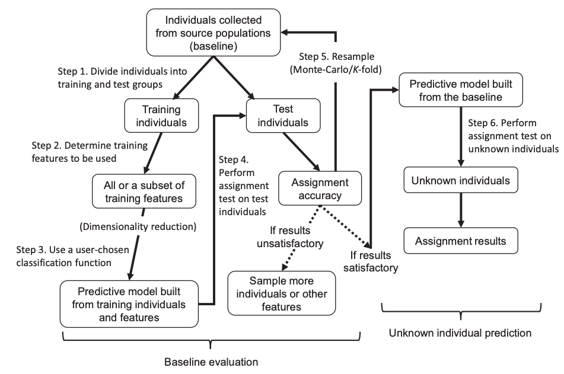</center>

{AssignPOP} is a module that was created for population assignment using a machine learning framework. {AssignPOP} uses cross validation methods, Monte Carlo and K-fold to estimate assignment accuracy, and membership probability. 

```{r, eval=FALSE}
#Installing and loading the package with another needed package, "klaR".

library(assignPOP) 

library(klaR)
``` 

 
## Introduction: What is cross validation? 

Cross validation is a way of ensuring that the model being used has accurate predictive power. It does this by creating a holdout sample (a portion of the dataset, also called test set) to set aside. The rest of the data is then "trained" or put through tests compared to the holdout sample. The prediction errors from each of these tests is averaged to determine the ultimate prediction error of the model. 
 
This is useful if the sample size is very small. Instead of taking a sizeable portion of the data to validate and applying that model to the rest of the data, cross validation allows us to take multiple portions of a small set of data, and apply models to it.
 
The debate with cross validation is what portion of the data should the holdout sample be composed off? It is important that this holdout sample is homogeneous and representative of the dataset. To perform this analysis, the K-fold and Monte Carlo cross validation methods can be used.

# Monte Carlo 

The Monte Carlo method composes the holdback sample by taking random points from the data. This means some points can be repeated, however some may never be selected. It also means that every time this is run there can be slightly different results. We will also be doing this analysis with {assignPOP}.
 
# K-fold 

The K-fold method divides the data set into "k" samples. One of these samples is used as a holdout sample. The rest is then trained. Then the next sample is used as the holdout sample while the remaining is trained. This is done until all the data is trained. This is one of the benefits of k-fold cross validation. It is also very useful for small datasets. However, as a result of this sequential order the holdback samples are all dependent on each other. The Monte Carlo method avoids this.


```{r, echo=FALSE}
url <- "https://i.stack.imgur.com/FKKvG.png"
```

<center></center>

Now we will walk through a simple example. First, let's load some data. We will be using a made-up data set of Turtle measurements. The Turtle ID and population were from a public dataset but the measurements were all made up. There are a total of 9 populations with a different number of individuals, followed by 4 different measurements. 

Import morphometric data containing sample IDs and features. Note that this must be saved in your working directory. You can find the file in our Github repository.
```{r}
morphdf <- read.csv( "Turtle_data_01.csv", header=TRUE ) 
```

Next create a string vector for population label. Define the name of the population and the number of individuals in each.
```{r}
pop_label <- c( rep("BM", 46), rep("BN", 6), rep("ITCS", 46), rep("SICO", 42), rep("SP", 12), rep("CROA", 4), rep("FR", 87), rep("GR", 77), rep("MAC", 10) ) 
```

Add the pop_label to the last column; 'morphdf_pop' is a data frame with a population label in the last column.
```{r}
morphdf_pop <- cbind(morphdf, pop_label)

#Handling numeric population name
#A set of population names: BM, BN, ITCS...
pop_label <- c( rep("BM", 46), rep("BN", 6), rep("ITCS", 46), rep("SICO", 42), rep("SP", 12), rep("CROA", 4), rep("FR", 87), rep("GR", 77), rep("MAC", 10) ) 

#Add the pop_label
morphdf_pop <- cbind(morphdf, pop_label)

#Convert population name to factor data type 
morphdf_pop$pop_label <- as.factor(morphdf_pop$pop_label)
```
 
Now that we have morph data loaded, let's try some simple cross validation.

Randomly shuffle the data.
```{r}
yourData<-morphdf_pop[sample(nrow(morphdf_pop)),]
```

Create 3 equally sized folds.
```{r}
folds <- cut(seq(1,nrow(yourData)),breaks=3,labels=FALSE)
```

Perform 3 fold cross-validation.
```{r}
for(i in 1:3){
    #Segment your data by fold using the which() function 
    testIndexes <- which(folds==i,arr.ind=TRUE)
    testData <- yourData[testIndexes, ]
    trainData <- yourData[-testIndexes, ]}
```

Now we have a test set and a training set. We can start by doing a linear regression of turtle height to weight for the test set and comparing the R-squared value to that of the training set. 

```{r}
m_test<- lm(Height ~ Weight, data=testData)
summary(m_test)

m_train<- lm(Height ~ Weight, data=trainData)
summary(m_train)
```

Here we see the R-squared value for the test data is 0.5981 and for the training data it is 0.6424. This is pretty close, but we would have to do this 2 more times with a new test set and then eventually compile all the percent errors to determine the accuracy of the model. This can get really complicated so we will use {assignPOP} to do the rest.

# Using Morphometric Data in {assignPOP}

## K-Fold Morphometric
Perform K-fold cross-validation using {assign.kfold}

- k.fold tells the function how many times to split the data; you can list a few numbers here to make it run multiple tests.

- You will be prompted to say "Y" or "N" to whether or not you want a PCA run on the data. The PCA is optional for the morphometric data, but we recommend running it. You can see what the difference is in your data when you run it without the PCA on your own!

- You will also be prompted to make sure that your headers are correctly assigned as their type of data. For our data, all our columns are integers. Type "Y" if they all say "integer"!

```{r, eval=FALSE}
assign.kfold(morphdf_pop, k.fold=3, 
             model="svm", dir="morphResultFolder_KF/") 
```

The K-fold is now done, with three assignment tests complete! The data has been sent to a folder called "morphResultFolder_KF". We can now visualize our data with a membership probability plot.
- You will be told that only one proportion of training loci is found, which is the non-genetic data. You will be prompted to type "Y" or "N" in response to whether there is any genetic data. There is none, so type "N"!

- Next you will have to choose between one of the four output styles. Each is explained in the prompt in your console. We recommend running all four to see the differences in the types of visualization you can have! For now, type "3" for the "Separated by fold" option.
```{r, fig.cap="Figure 1: Membership Probability Plot", eval=FALSE}
#Make membership probability plot
membership.plot(dir="morphResultFolder_KF/")
```

<center>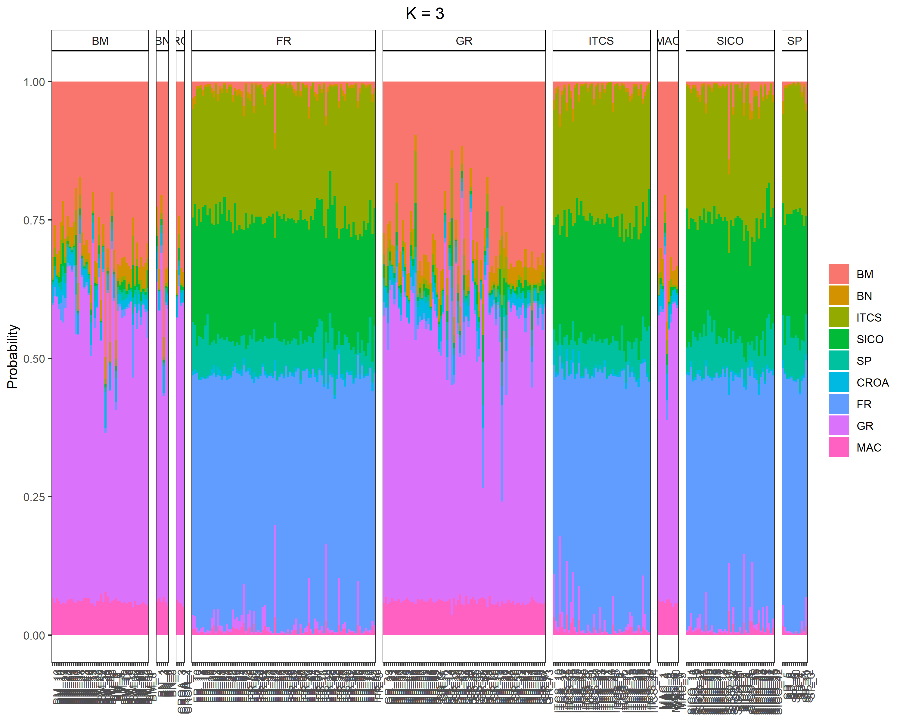</center>
<center>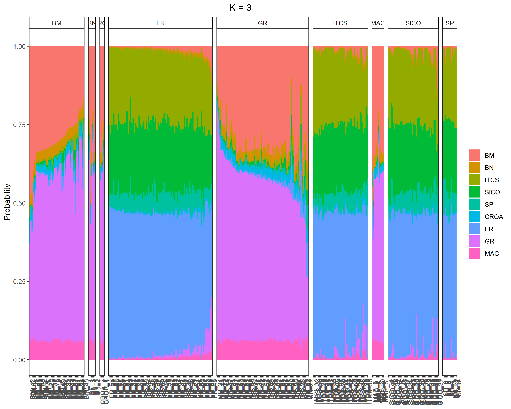</center>
<center>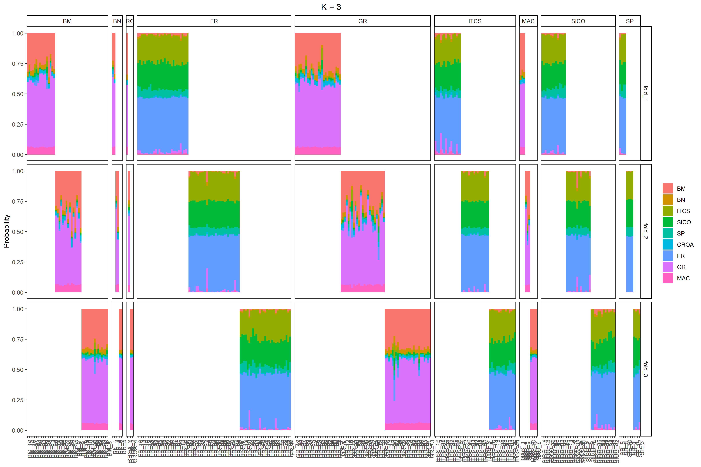</center>
<center></center>

(Figures 1A, 1B, 1C, 1D) Each graph here compiles all the percent errors when comparing all the non-genetic data to each other using 3 folds. It then assigns proportions of each population within each population. In all cases here we see GR, BM, and MAC appear strongly in the GR, BM, MAC, BN, and CROA populations. This suggest that these populations have a lot of mixing of individuals, or they are the same individual. This makes sense since geographically these locations are the closest.

## Monte Carlo Morphometric
Now we can run the Monte-Carlo for the non-genetic data.
- {train.inds} is telling you how to define the holdout sample. It can be a proportion or an integer. An integer tells you how many samples to use in the holdout sample while a proportion will give you a proportion of samples to put in the holdout sample. Listing a few numbers will allow you to make multiple holdout samples. 

- Here we are taking one third of the data to mimic what we did in the k-fold cross validation, you do not have to do this but the holdout sample for both methods will be of the same size

- {iterations} tells you have many tests to run. Here we did 3 tests to mimic k-fold. You can change this for the Monte Carlo method, because it is taking random samples where individuals can be reselected.

- You will be prompted to say "Y" or "N" to whether or not you want a PCA to run on the data. The PCA is optional for the morphometric data, but we recommend running it. You can see what the difference is on your own when you run it without the PCA!

- You will also be prompted to make sure that your headers are correctly assigned as their type of data. For our data, all our columns are integers. Type "Y" if they all say "integer"!

```{r, eval=FALSE}
#Perform Monte-Carlo cross-validation, with using subsets of high Fst loci as training loci, LDA to build predictive models
assign.MC(morphdf_pop, train.inds=c(0.33),
          iterations=3, model="svm", dir="morphResultFolder_MC/")
```

The Monte-Carlo is now done, and three assignment tests have been completed. We can now calculate our assignment accuracy for the test with the following code.

```{r, eval=FALSE}
#Calculate assignment accuracy
morph_accuRes_MC <- accuracy.MC(dir="morphResultFolder_MC/")
```

As said in the console, the results of the test were saved as a text file in the directory inside of the "morphResultFlder_MC". We can read this into R using the function "read.table()". Notice that the file has been inputted into the folder and not straight into the directory, since yours might have a unique name. This means you will have to change the name of the "YOUR FILE ROUTE HERE" to match your file's directory route.  

```{r, eval = FALSE}
accuMC <- read.table("YOUR FILE ROUTE HERE", header=T)
```

By creating an assignment accuracy boxplot we see that the accuracy for the FR and GR samples is the highest. This is because these have the greatest sample size. Try running multiple tests while changing the paramaters to see how this affects the accuracy!

```{r, fig.cap="Figure 2: Assignment Accuracy Boxplot", eval=FALSE}
#Make assignment accuracy boxplot
accuracy.plot(morph_accuRes_MC, pop=c("BM", "BN", "ITCS", "SICO", "SP", "CROA", "FR", "GR", "MAC"))
```
<center>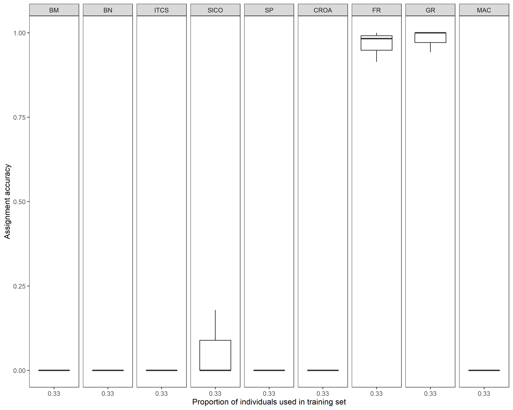</center>
(Figure 2) The FR and GR populations have the greatest assignment accuracy given their larger sample size.

<center>


</center>

# Using Genomic Data in {assignPOP}
Now let's load our genomic data. This genomic data is the public dataset used to get the ID and population form our made-up morphometric dataset. It is in the GENEPOP format, but you can also import from the STRUCTURE format using the complementary function. The path defined is from the public repository we made for this class. Note that the following code might take a few minutes to run.
- {pop.names} will set the population names based on the ones in our data. Since turtles are diploid creatures, we will set "haploid" to false.

```{r, eval= FALSE}
#Load the dataset from GitHub. 
YourGenepop <- read.Genepop( "https://raw.githubusercontent.com/cavega36/AssignPopModule/master/Turtle_data.txt", pop.names=c("BM", "BN", "ITCS", "SICO", "SP", "CROA", "FR", "GR", "MAC"), haploid = FALSE) 
```

That looks good! We now have genetic data loaded. The output shows our nine populations with the amount of individuals in them. It also shows us the elements that are included in the data output list, which is just handy information to have.

## Low Variance Removal in Genomic Data 
We can also remove low variance loci with the following code (optional). We will be using this for the rest of the module though, so please run it!
- Reduce low variance within our dataset and create a new matrix for it. The "p" value is set to 0.95, meaning that a locus will be removed from the dataset if its major allele occurs in over 95% of individuals across the populations. This will leave only the data with higher variance, which will make our results more interesting.

```{r, eval= FALSE}
YourGenepop_rd <- reduce.allele( YourGenepop, p = 0.95) 
```

Our dataset has now been reduced. As shown by the output in the console, 81 alleles were removed and 9 loci remain. 

## K-Fold Genomic
We will now run the K-fold test for the genetic data.
- The argument {train.loci} will allow you to specify the proportion of of loci to use as a training set

- The argument{loci.sample} is telling you to pick a random set of the 33%

```{r, eval= FALSE}
#Perform K-fold cross-validation 
assign.kfold(YourGenepop_rd, k.fold=3, train.loci=c(1), loci.sample="fst",
             model="svm", dir="genResultFolder_KF/") 
```

Great! Three assignment tests were completed and now we can visualize it similarly to the morphometric data with a membership probability plot.
- You will be asked whether or not the data included genetic loci, and in this case it does! Type in "Y" for yes into the console.

- Now, you will be prompted to choose an output style just like the morphometric data. We challenge you to run this four times to see all the outputs, but for now just type "3" for the "Separated by fold" option. Note that option 4 won't work for this example because it would produce the same graph as option 2 based on the data. 

- You can interpret this the same way we did before. We can see that with the genetic data there is less variation in population assignment. This can signify that although measurements differ among populations, genetically there is less variation. 

```{r, fig.cap="Figure 3: Membership Probability Plot", eval=FALSE}
#Make membership probability plot
membership.plot(dir="genResultFolder_KF/")
```

<center>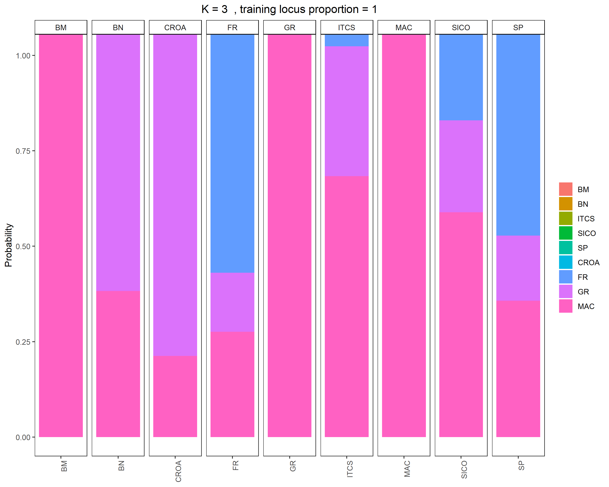</center>
<center></center>
<center>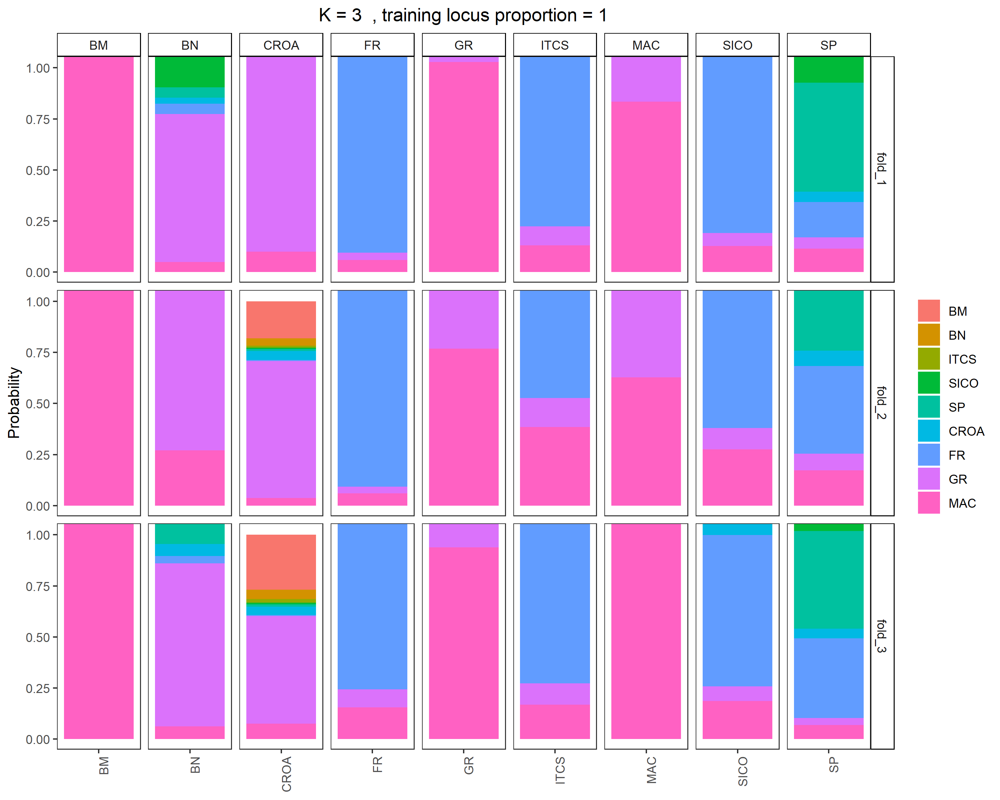</center>

(Figures 3A, 3B, 3C) These figures can be used to see an individual's probability of being assigned to a population. We can see grouping based on subspecies level populations. Note that this K-Fold is based on population, rather than individuals. This differs from morphometric data which require individuals to assign to populations.

## Monte Carlo Genomic
Now we can run the Monte-Carlo for the genetic data.

```{r, eval=FALSE}
#Perform Monte-Carlo cross-validation using subsets of high Fst loci as training loci, LDA to build predictive models
assign.MC(YourGenepop_rd, train.inds=c(0.33), train.loci=c(1), loci.sample="fst",
          iterations=3, model="svm", dir="genResultFolder_MC/")
```

The Monte-Carlo is done with three assignment tests complete! Similarly to the morphometric data, we can calculate the assignment accuracy and plot it!

```{r, eval=FALSE}
#Calculate assignment accuracy
gen_accuRes_MC <- accuracy.MC(dir="genResultFolder_MC/")
```

This time, the results of this test were saved within the "genResultFolder_MC", but the file name is the same. We can now make a plot to represent this data.

```{r, fig.cap="Figure 4: Assignment Accuracy Boxplot", eval= FALSE}
#Make assignment accuracy boxplot, making sure to properly assign our populations
accuracy.plot(gen_accuRes_MC, pop=c("BM", "BN", "ITCS", "SICO", "SP", "CROA", "FR", "GR", "MAC"))
```

<center>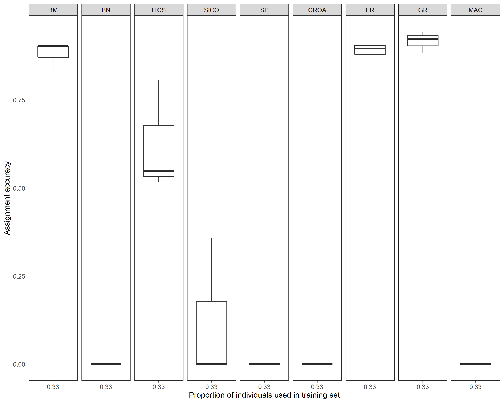</center>

As before, the FR and GR populations have high accuracy. Due to the larger amount of genetic data, the accuracy of some other populations is greater than if we only used the non-genetic data. However, it still might be useful to have more iterations. 

## Identify informative loci

Identifying informative loci is important because if you were using these samples for an actual experiment, it could help you identify loci that might be associated with functional genes. It coud also help to reduce time and cost of preparing samples.

This test is based on the Fst values. Fst values, or the fixation index, are a measure of population differentiation due to genetic structure. The values range from 0 to 1, with 0 meaning the samples are not different, and 1 being very different with no alleles in common. 

We will now use {check.loci}. This function reads through the training locus files created for the assignment test. It then counts the frequency of each locus and puts the results in a text file. 
- The {top.loci} amount is the amount of loci you want to see. 20 loci is the most frequently used hight Fst training loci across the assignment tests.

- You will be prompted to choose which results you would like to check. The options will be the groups of different proportions or numbers of training individuals that you specified in "train.inds" of the Monte-Carlo function earlier. You can also choose "all".

- The output of this, (High_Fst_Locus_Freq.txt) includes a list of loci names ordered by their Fst values, with the highest in the top. The number in parentheses after the locus name indicates the number of tests it appeared in. The number in the parentheses after the locus shows how many tests it occurred in. 

Note that this may take a few moments.

```{r, eval=FALSE}
check.loci(dir="genResultFolder_MC/", top.loci=20)
```

# Integrated Data

Here we compile the reduced variance genetic data with morphometric data. We will call this our integrated dataset. Note that our made up dataset introduces a decrease in accuracy. DISCLAIMER: Because our dataset did not work, we will not include it in the repository. This is only to give a visualization of where we went wrong.
```{r, eval=FALSE}
IntegratedData <- compile.data(YourGenepop_rd, "non_gen_data_integrated_2.csv")
```

## K-Fold Integrated Data
```{r, eval=FALSE}
assign.kfold(IntegratedData, k.fold=4, train.loci= 1, loci.sample="fst",
             model="svm", dir="genResultFolderIntegrated_KF/")
```

```{r, eval=FALSE}
membership.plot(dir="genResultFolderIntegrated_KF/")
```

<center></center>
<center>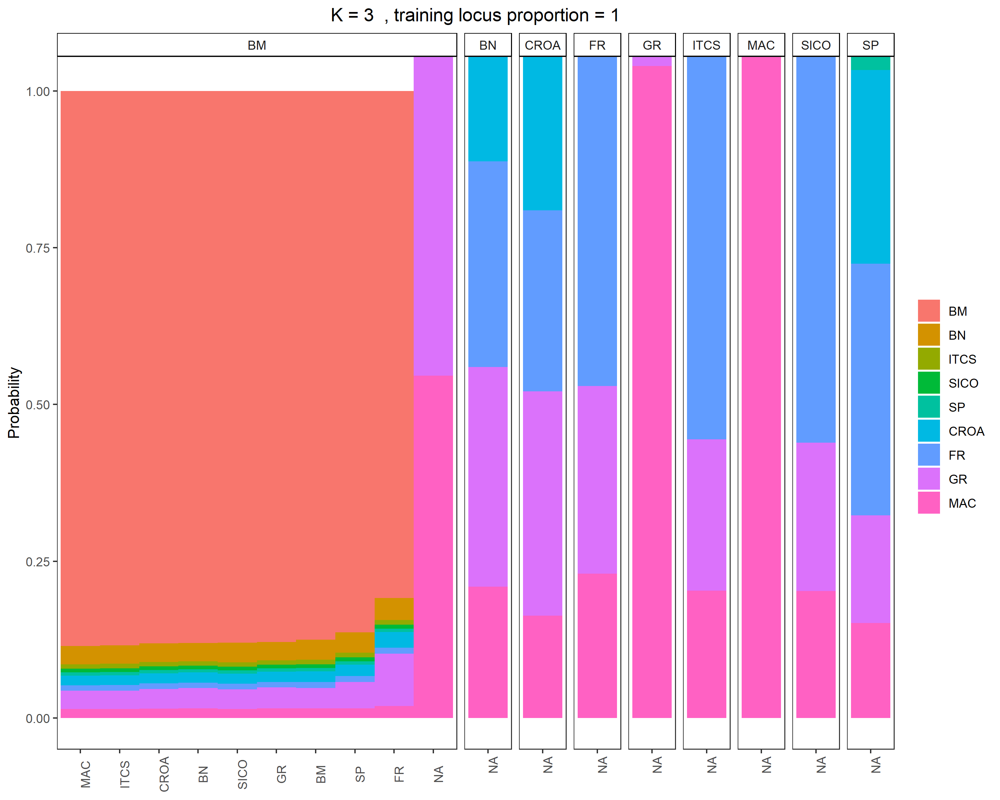</center>
<center>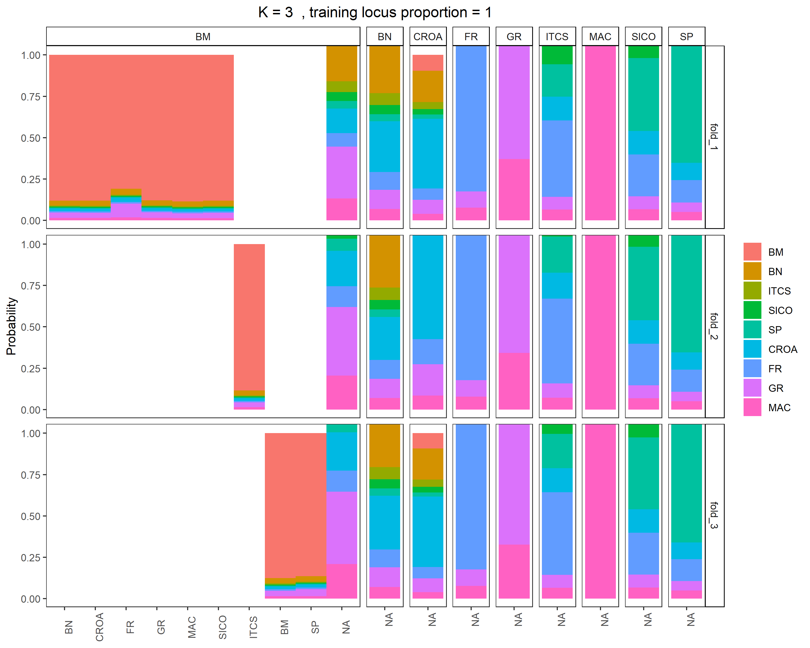</center>
<center></center>

(Figures 5A, 5B, 5C, 5D) Our k-fold integrated data failed to produce a result due to our made-up dataset. 

<center>


</center>

## Monte Carlo Integrated Data
```{r, eval=FALSE}
assign.MC(IntegratedData, train.inds=0.6, train.loci=c(1), loci.sample="fst",
          iterations=3, model="svm", dir="genResultFolderIntegrated_MC/")
```

```{r, eval=FALSE}
gen_accuRes_Integrated_MC <- accuracy.MC(dir="genResultFolderIntegrated_MC/")
```

```{r, eval=FALSE}
accuracy.plot(gen_accuRes_Integrated_MC, pop=c("BM", "BN", "ITCS", "SICO", "SP", "CROA", "FR", "GR", "MAC"))
```

<center>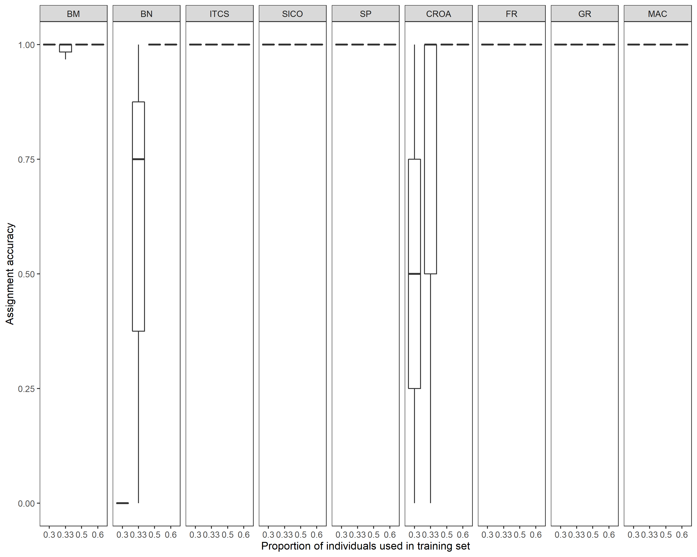</center>

(Figure 6) With this Monte Carlo Cross-Validation, our made-up dataset failed to create a properly integrated result. 

# Conclusion
Now you know how to run both the K-fold Cross Validation and Monte-Carlo tests for morphometric data, genetic data, and can take an integrated approach to improve accuracy all while using the package {assignPOP}. Although we were unable to successfully make our own dataset, we are confident that the code used will work for improved datasets! Thank you for skating through this module with us.

<center>


</center>

# References

* [Chen, K-Y, Marschall, E.A., Sovic, M.G., Fries, A.C., Gibbs, H.L., Ludsin, S.A. (2018). assignPOP: An R package forpopulation assignment using genetic, non-genetic, or integrated data in a machine-learning framework. Methods in Ecology and Evolution. 9:439–446.](https://doi.org/10.1111/2041-210X.12897)
* [Fixtion Index (Fst)](https://nctc.fws.gov/courses/csp/csp3157/content/terms/fst.html)
* [Package assignPOP](https://cran.r-project.org/web/packages/assignPOP/assignPOP.pdf)
* [Perez, M., Livoreil, B., Mantovani, S., Boisselier, M. C., Crestanello, B., Abdelkrim, J., ... & Sterijovski, B. (2013). Genetic variation and population structure in the endangered Hermann’s tortoise: the roles of geography and human-mediated processes. Journal of Heredity, 105(1), 70-81.](https://academic.oup.com/jhered/article/105/1/70/857728)
* [Yan Holtz: "Pimp My RMD: a few tips for R Markdown"](https://holtzy.github.io/Pimp-my-rmd/#theme)
* [Cross-Validation](https://www.statisticshowto.datasciencecentral.com/cross-validation-statistics/)
* [Penn State Cross-Validation](https://quantdev.ssri.psu.edu/tutorials/cross-validation-tutorial)


