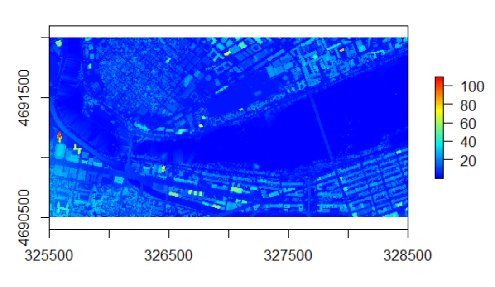

# Part I. Introduction to LIDAR

Within GIS there are multiple different tools to help you understand data that you collect about different landscapes. From previous modules you would have seen how to create maps to display your statistical analysis, or have seen how to identify different clusters and analyze significant hot and cold spots. Here we will explore how to take Lidar data files to create maps that help you analyze the landscape and interpret it to answer important questions. 

Lidar stands for Light Detection and Ranging. It is a surveying/remote sensing method that measures distance to a target. It does this by illuminating the target with laser light and measuring the reflected light with a sensor. Differences in laser return times and wavelengths can then be used to make digital 3-D representations. It is commonly used to make high-resolution maps, with applications in fields such as archaeology, geography, and laser guidance. 


By being able to analyze landscapes using Lidar, we can answer more important/pertinent questions to current issues. One example of this is Boston's pledge to being carbon neutral by 2050. While this falls under being a civil engineering problem, its an excellent example of a different but important application of GIS, specifically Lidar uses. 

One way that Boston can push towards being carbon neutral would be by switching to renewable energy sources like solar, wind, and hydrologic power. The best places to utilize solar power, for example, would be places that have constant uninterrupted exposure to sunlight. Using Lidar data to map out the rooftops of Boston, we would be able to determine how much solar radiation we can obtain. You would accomplish this by mapping out the rooftops and looking at the area of them along with the amount of solar radiation from the direct irradiation and irradiance on the horizontal plane, and ambient temperature. This would in turn help to determine if there would be enough watt hours over the course of a year for it to be beneficial to begin transitioning the majority, if not all, of Boston's rooftops to being solar paneled. 

info & data download here:
https://drive.google.com/file/d/15Tdl4O4dje-7dQgGUciQpTgUza8LUo7Q/view


## Necessary Packages

```{r eval=FALSE}
#install.packages(c("lidR","sf","ggplot2)
#install.packages("googledrive")
library(lidR)
library(sf)
library(ggplot2)
library(googledrive)
library(curl)
```

## Import LIDAR Data

The way LIDAR works is by emitting laser pulses to reflect from objects both on and above the ground surface: vegetation, buildings, bridges, etc. Any emitted laser pulse that encounters multiple reflection surfaces as it travels toward the ground is split into as many returns as there are reflective surfaces.

- The first returned laser pulse is the most significant return and will be associated with the highest feature in the landscape like a treetop or the top of a building. The first return can also represent the ground, in which case only one return will be detected by the lidar system.

- Multiple returns are capable of detecting the elevations of several objects within the laser footprint of an outgoing laser pulse. The intermediate returns, in general, are used for vegetation structure, and the last return for bare-earth terrain models.

- The last return will not always be from a ground return. For example, consider a case where a pulse hits a thick branch on its way to the ground and the pulse does not actually reach the ground. In this case, the last return is not from the ground but from the branch that reflected the entire laser pulse. 

<br><center>

</center><br>

## Reading in LAS data

A LAS file is an industry-standard binary format for storing airborne lidar data. Here we are just reading the LIDAR data files in to ***R*** and assigning them to variables for later use. 

```{r eval=FALSE}
temp1 <- tempfile(fileext = ".las")
temp2 <- tempfile(fileext = ".las")

dl1 <- drive_download(
  as_id("1J5YAg8QSmeRmL3vm3nGGcQFJwIg_pbmO"), path = temp1, overwrite = TRUE)
dl2 <- drive_download(
  as_id("1MkQqwqb2WqcWJkF8DwSRf45WQEWbF9go"), path = temp2, overwrite = TRUE)

las1 <- readLAS("/var/folders/7g/dn_1ng7x3rvgnnf8c97vn_6h0000gp/T//RtmpZZn76R/file299d54b3889.las") #you might need to change this to the path given in the output above under 'saved locally as:'
las2 <- readLAS("/var/folders/7g/dn_1ng7x3rvgnnf8c97vn_6h0000gp/T//RtmpZZn76R/file299dd6cad16.las")


las <- rbind(las1, las2)
plot(las) #30 seconds
```


## Transition LIDAR data to DEM*

### What is DEM? Why do we need it?*

DEM stands for Digital Elevation Model. This is a 3D CG representation of a terrain's surface created from a terrain's elevation data. Things like power lines, buildings and towers or trees and other vegetation aren't included in the model. It filters out what are known as "non-ground points". Another way to think of it is an image containing only the topography from the ground.


```{r eval=FALSE}
dem <-  grid_terrain(las, algorithm = tin())
plot(dem) # 1.5 min
```


## Convert to CHM + create hillshade model

### What is CHM? Why do we need it?

CHM stands for Canopy Height Model. This represents the height of objects above the ground. It is essentially the DTM (Digital Terrain Model) subtracted from the DSM (Digital Surface Model). The DTM is ground elevation where as the DSM is the top of the surface over the "canopy" of the, for example, forest. We need the CHM because it represents the actual height of trees, buildings, etc. with the influence of ground elevation removed.


```{r eval=FALSE}
proj4string(las) <-CRS("+proj=utm +zone=19 +datum=NAD83") #assigning coord ref system
dsm1 <- grid_canopy(las, res = 1, dsmtin())
col <- height.colors(100) #how many colors to use, the more colors the better resolution in the plot
plot(dsm1, col = col)
```



## Hillshade. What is it? How is it made?

A hillshade is a grayscale 3D representation of the surface, with the sun's relative position taken into account for shading the image. This function uses the altitude and azimuth properties to specify the sun's position.Used as a background, hillshades provide a relief over which you can draw raster data or vector data. They are used as a background to provide a relief over which you can draw raster data or vector data.

```{r eval=FALSE}
slope  <- terrain(dsm1, opt='slope')
aspect <- terrain(dsm1, opt='aspect')
hill <- hillShade(slope, aspect, 45, 120)
plot(hill, col=grey(0:100/100), legend=FALSE, main='Boston University')
plot(dsm1, col=rainbow(25, alpha=0.35),add=TRUE) # 2 min
```


## Add Boston Univeristy rooftop shapefile

A shapefile is a geospatial vector data format for geographic information system software. 

```{r eval = FALSE}
BU_buildings_shp <- st_read("building_structures_bu.shp")
BU_buildings <- ggplot() + 
  geom_sf(data = BU_buildings_shp, size = 0.5, color = "black", fill = "cyan1") + 
  ggtitle("BU Buildings") + 
  coord_sf()
plot(BU_buildings) # 5 sec
```


## Plot Building Vector File on Raster

```{r eval = FALSE}
#This projects the BU rooftop shape file correctly with the hillshade raster image
dsm2 <- projectRaster(dsm1, crs = crs(BU_buildings))
dsm3 <- crop(dsm2, BU_buildings) #there are 16 different options instead of "2" here, not sure which one we want
hill2 <- projectRaster(hill, crs = crs(BU_buildings))
hill3 <- crop(hill2, BU_buildings) #there are 16 different options instead of "2" here, not sure which one we want
plot(hill3, col=grey(0:100/100), legend=FALSE, main ='Boston University')
plot(BU_buildings,add=TRUE)
plot(dsm3,col=rainbow(25, alpha=0.35),add=TRUE) # 30 sec
```

.png)

# Part II. Using Lidar data - How do Boston Common & Arnold Arboretum canopy heights differ?

Lidar data can be downloaded at this [USGS site](https://viewer.nationalmap.gov/basic/)


We downloaded the data from the tiles where "Boston Common" & "Arnold Arboretum" were located. Boston Common was split across two tiles so I downloaded two & combine them below:

```{r eval = FALSE}
#reading in the las data
temp3 <- tempfile(fileext = ".las")
temp4 <- tempfile(fileext = ".las")

dl3 <- drive_download(
  as_id("1kFiXzocfKyD7HjifsWVUQ4JjewrgSKvR"), path = temp3, overwrite = TRUE)
dl4 <- drive_download(
  as_id("15MY5uKMYIHlPlMLWBKnKIwVAaSp4ELwf"), path = temp4, overwrite = TRUE)

las.bc1 <- readLAS("/var/folders/7g/dn_1ng7x3rvgnnf8c97vn_6h0000gp/T//RtmpBE9hRX/file2ba22fc88a85.las") #you might need to change this to the path given in the output above under 'saved locally as:'
las.bc2 <- readLAS("/var/folders/7g/dn_1ng7x3rvgnnf8c97vn_6h0000gp/T//RtmpBE9hRX/file2ba216fe3a45.las")

#if downloaded right from GIS site:
#las.bc1 <- readLAS("~/Downloads/temp/USGS_LPC_MA_Sndy_CMPG_2013_19TCG285905_LAS_2015.las")
#las.bc2 <- readLAS("~/Downloads/temp/USGS_LPC_MA_Sndy_CMPG_2013_19TCG300905_LAS_2015.las")

#taking a look - Xquartz pops up
plot(las.bc1)
plot(las.bc2)
#combining the two Boston Common tiles
las.bc <- rbind(las.bc1, las.bc2)
plot(las.bc)
```


```{r eval = FALSE}
#assigning coordinate reference system - very important
proj4string(las.bc) <- CRS("+proj=utm +zone=19 +datum=NAD83")
#looking at the canopy height model
chm.bc <- grid_canopy(las.bc, res = 1, dsmtin())
plot(chm.bc)
```


Now we're going to clip the giant LAS file down to an area of interest within Boston Common with no trees, using the x, y coordinates seen in the canopy height model above.

```{r eval = FALSE}
las.bc.clipped <- lasclipRectangle(las.bc, 329500, 4690980, 329900, 4691380)
plot(las.bc.clipped) #check to see how it looks
```


Now to compute the CHM for the clipped area

```{r eval = FALSE}
dsm.bc <- grid_canopy(las.bc.clipped, res = 1, dsmtin())
plot(dsm.bc)
extent(dsm.bc) #400 x 400 area
```

Then we repeated everything above but for a tile of the same size within Arnold Arboretum

```{r eval = FALSE}
temp5 <- tempfile(fileext = ".las")

dl5 <- drive_download(
  as_id("1GTCqB9eTiAQi9vdh_OXdpVSojz9ZLVWG"), path = temp5, overwrite = TRUE)

las.aa <- readLAS("/var/folders/7g/dn_1ng7x3rvgnnf8c97vn_6h0000gp/T//RtmpBE9hRX/file2ba2ca393ce.las") #you might need to change this to the path given in the output above under 'saved locally as:'
#if downloaded right from USGS site:
#las.aa <- readLAS("~/Downloads/temp/USGS_LPC_MA_Sndy_CMPG_2013_19TCG240845_LAS_2015.las")

plot(las.aa)
extent(las.aa)

las.aa.clipped <- lasclipRectangle(las.aa, 324650, 4684800, 325050, 4685200)
plot(las.aa.clipped)
chm.aa <- grid_canopy(las.aa.clipped, res = 1, dsmtin())
plot(chm.aa)
extent(chm.aa) #400 x 400
```


Then we converted the RasterLayer dataset to a data frame so we can do some stats.

```{r eval = FALSE}
df.bc <- as.data.frame(chm.bc, xy = TRUE)
ggplot() +
  geom_raster(data = df.bc , aes(x = x, y = y, fill = Z)) +
  scale_fill_viridis_c()
```


Now for Arnold Arboreteum

```{r eval = FALSE}
df.aa <- as.data.frame(chm.aa, xy = TRUE)
ggplot() +
  geom_raster(data = df.aa, aes(x = x, y = y, fill = Z)) +
  scale_fill_viridis_c()
```


Now grouping the data together & making a new variable called 'site' to distinguish the two.

```{r eval = FALSE}
df.bc$site <- rep("Boston Common",160000)
df.aa$site <- rep("Arnold Arboretum",160000)
site.df <- rbind(df.bc,df.aa)
str(site.df)
ggplot(site.df,aes(x=site,y=Z,color=site))+
  geom_boxplot()+
  ylab("Canopy height (m)")+
  xlab("Site")+
  theme_classic()+
  theme(legend.position="none")+
  scale_color_manual(values=c("chartreuse3","darkgreen"))
```


Last but not least, the stats. Unfortunately the data is not at all normally distributed.

```{r eval = FALSE}
hist(df.bc$Z)
hist(df.aa$Z)
```


We tried normalizing but didn't really trust the results, so we went with a non-parametric test, the Mann-Whitney-Wilcoxon test because we have two independent groups.

``` {r eval = FALSE}
wilcox.test(Z~site,data=site.df)
```

