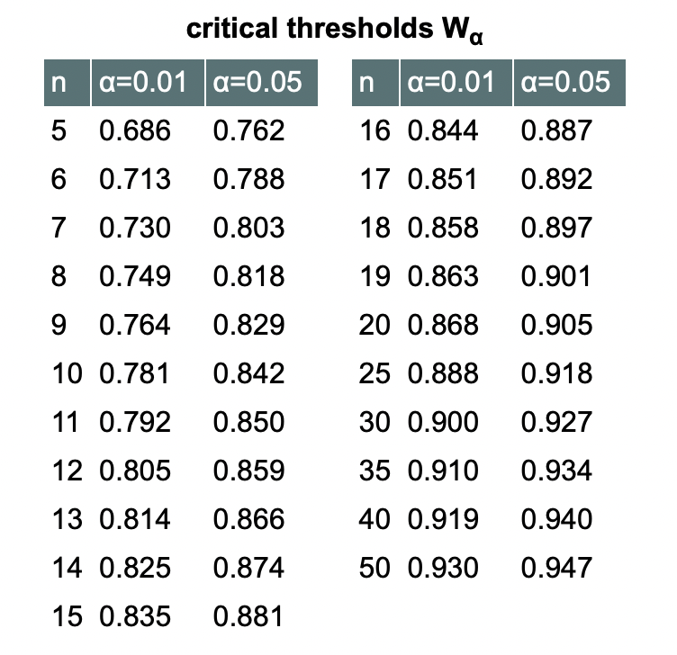

```{r setup, include=FALSE}
knitr::opts_chunk$set(echo = TRUE)
```


## Introduction to Goodness-of-Fit Tests

Before starting to work with a data set, you have to figure out what kind of data it is. Goodness of fit tests report if your data is normal or matches with expected data. Then you are able to pick the best statistical test to run on your data. Different data types have different goodness of fit tests and each test is used to draw different conclusions. 

#### Different Goodness-of-Fit tests we'll be covering:
  + **G Test:** a variation of the chi-squared test and determines if your data matches an expected distribution. 
  + **Kolmogorov-Smirnov Test:** determines if the observed data matches a normally distributed population.
  + **Anderson-Darling Test:** derived from the Kolmogorov-Smirnov test and is more sensitive to the distribution edges. 
  + **Shapiro-Wilks Test:** determines if a random sample is from a normally distributed population but is used for smaller sample populations under 2000.

## Objectives
[1] Understand what a goodness of fit test is and how to apply it.

[2] Be able identify which test is most appropriate for your data set.


## Packages
```{r Packages, warning=FALSE}
# G test
library(DescTools)
library(curl)

# Anderson Darling test
library(nortest)
```

# G Test 

Like the Chi-squared test in Module 14, the G test allows you to determine if there is a significant difference in proportions of a categorical variable to the theoretical expectation. Chi-squared test give approximately the same results as G test but you can perform more elaborate statistical analyses with G test results. Downside is that less people are familiar with the G test compared to the Chi-squared test. As they give similar results, it's best to pick one method that is most applicable to your data set rather than using both methods. Pick one and stick with it. 

Both G test and Chi-squared Test data needs to fulfill certain assumptions: 

1. Random Sample <br>
2. Independence between samples <br>
3. Variable must be proportional or categorical <br>
4. Mutually exclusive categories <br>
5. Variables must have 2 or more options <br>


It's more beneficial to use the G Test over the Chi-Squared Test if: 

1. There are more than 1000 values in total <br> 
2. There are outliers in the data <br>
3. If dataset is small use the Fisher's Exact Test. <br>

**Null Hypothesis:** The observed data has the same proportions as the expected theoretical population. <br>
**Alternate Hypothesis:** The observed data doesn't have the same proportions as the expected theoretical population. 

## Objectives

[1] Understand when it is appropriate to use the G test.

[2] Be able to run the G test by hand and through an R package.

``` {r Generating Data, include=FALSE, eval=FALSE}

set.seed(1)
Flower.color <- sample(x = c("purple", "white", "orange", "blue"), prob= c(.5, .35, 0.05, 0.1), size = 1200, replace = TRUE)

Flower.size <- sample(x = c("Large", "Small"), prob= c(0.5, 0.5), size = 1200, replace = TRUE)


Flower.species <- sample(x = c("Siberian", "Japanese", "Dutch", "Bearded"), prob= c(.25, .25, 0.25, 0.25), size = 1200, replace = TRUE)

Flower.location <- sample(x = c("North", "East", "South", "West"), prob= c(.2, .30, 0.30, 0.2), size = 1200, replace = TRUE)

Data <- cbind(Flower.color, Flower.size, Flower.species, Flower.location)
head(Data)
write.csv(Data, "C:\\Users\\Emily\\Documents\\Github\\Chisquare-repo\\Iris.csv", row.names=TRUE)
```

## G Test Formula


O = Observed <br>
E = Expected


#### Implementating the G Test on the iris data set

I was out in the field and collected data about 1200 Irises. I noted the color, size, species, and location of each flower. From a glance I see four flower colors that are roughly equally but I want to test statistically there actually is proportionally equal amounts of each flower color. 


```{r Tabulating Data}
library(curl)
f <- curl("https://raw.githubusercontent.com/YYangEmily/Chisquare-repo/main/Iris.csv")
d <- read.csv(f, header = TRUE, sep = ",", stringsAsFactors = FALSE)
head(d)

table(d$Flower.color) # Count how many of each color

# Find the G value
G <- 2 * ((121 * log(121/300)) + (59 * log(59/300)) + (628 * log(628/300)) + (392 * log(392/300))) #log function in R is equivalent to ln

G # Use G value to find p-value

pchisq(725.9525, df=3, lower.tail = FALSE) # Finding the p-value
```

We got an G value of 725.95 and the degree of freedom is options-1 = 3. Using those we calculated a p-value of 4.9e-157 which is below the critical p-value = 0.05. We can reject the null hypothesis and conclude that the flower color proportions of the Irises observed are not equally distributed.

```{r Coding}
library(DescTools)

#perform the G-test 
GTest(x = c(121, 59, 628, 392), #observed values
      p = c(1/4, 1/4, 1/4, 1/4)) #expected proportions
```

Once again, the p-value is below 0.05. We can reject the null hypothesis and conclude that the flower color proportions of the Irises I observed are not equally distributed. 

#### Lets do it again with Flower Size

I want to see if the data fits my expectation that there are equal proportions of large and small flowers. 

```{r Size}

table(d$Flower.size) # Count how many of each size
 
G <- 2 * ((577 * log(577/600)) + (623 * log(623/600)))
G
 
pchisq(1.763765, df=1, lower.tail = FALSE) # Finding the p-value
 

GTest(x = c(577, 623), # observed values
      p = c(1/2, 1/2), # expected proportions
      correct = "none") # no correction
```

As you can see this time the p-value = 0.1842 which is above the critical p-value of 0.05 and we fail to reject the null hypothesis. There are equal proportions of each flower size. 


## G Test Challenges

Perform the G test with following columns in the iris data set: Flower.location and Flower.species. <br>

## G Test of Independence

In addition to goodness of fit test you can also use the G test for Independence. For example I want to test if flower color and flower size are independent variables. 

**Null Hypothesis:** The two test variables are independent. <br>
**Alternate Hypothesis:** The two variables are dependent.

```{r Independence}
library(tidyverse)
d$Flower.color <- as.factor(d$Flower.color)
d$Flower.size <- as.factor(d$Flower.size)
d %>% 
  dplyr::count(Flower.color, Flower.size)

obs <- rbind(c(64, 22, 327, 210), # Small
             c(57, 37, 301, 182)) # Large
 
GTest(obs, # Compare small vs large
      correct = "none") # no correction

```
We find a p-value of 0.1342 which is above  the critical p-value of 0.05 and fail to reject the null hypothesis. We conclude that the two variables are independent.


# Kolmorgorov-Smirnov Test

We can use the <b>Kolmorgorov-Smirnov Test</b> as a way to reject null hypotheses. By using this statistical method, we are aiming to prove that the two data sets we are working with do not come from the same distribution.

The most common way to reject the null is with a student's t-test, however, this can only be accurately used when we know our data set is <b>normal</b>. If we are using data that we aren't sure about, or know isn't of a normal distribution, it can be trickier to reject this hypothesis. This test is more effective with larger data sets (n &ge; 50) when compared to the Shapiro-Wilks test which is only effective for smaller data sets. 

If we are running a one-sample K-S Test:

  1. **Null hypothesis:** The sample comes from the same distribution as the data set we are comparing it with <br>
  2. **Alternative hypothesis:** The sample does not come from the same distribution <br>

If we are running a two-sample K-S Test:

  1. **Null hypothesis:** Both samples come from the same distribution <br>
  2. **Alternative hypothesis:** Both samples do not come from the same distribution <br>


**Why is it important to disprove the null?**
Failing to reject a null hypothesis means there is no sufficient evidence for the expected or the observed results we see in our studies.


## Kolmorgorov-Smirnov Test Formula 

## Objectives 

[1] Understand what a Kolmogorov-Smirnov Test is and how to interpret the results. 

[2] Learn what conditions are ideal for a K-S Test.


<b>F<sub>0</sub>(x)</b> = the total observed frequency distribution of a random sample

<b>F<sub>0</sub>(x) = <sup>k</sup>&frasl;<sub>n</sub></b> where k = the number of observations and n is the total number of predicted observations

<b>F<sub>r</sub>(x)</b> = the theoretical frequency distribution

<b>D</b> = the critical value between 0 and 1 indicating the magnitude of the observed difference in distributions. Values closer to 1 indicate high difference, while values closer to 0 indicate high likeness. Unlike a p-value which has a set threshold for whether something is significant or not--although this is also not necessarily the be-all-end-all of significance!--the D value produced from the K-S test is relative to each individual distribution. <b>Different data sets will produce different D values!</b>

If the calculated value is <b>less</b> than the critical value <b>D</b> we must <b>accept the null hypothesis</b>

If the calculated value is <b>greater</b> than the critical value we can <b> reject the null hypothesis</b>


## One-Sample Test ##
Let's do an example! <br>


We are zoologists studying turtles and we want to conduct an experiment to see if different species of turtle prefer to eat cucumbers or lettuce when presented with both. We will be including 5 different species and counting how many turtles go for each food choice first in each population (n = 150).

```{r 2, include=TRUE}
# create matrix with 5 columns and 2 rows
data <- matrix(c(16, 12, 1, 22, 11, 14, 18, 29, 8, 19), nrow = 2, ncol = 5, byrow = TRUE)
# specify the column names and row names of matrix
colnames(data) <- c('A.marmorata ','C.fimbriata ','C.picta ','C.flavomarginata ', 'C.amboinensis')
rownames(data) <-  c('Cucumber','Lettuce')
# assign to table
final = as.table(data)
# display
final
```
<b>H<sub>0</sub></b> = There is no difference among turtle species with respect to their choice of cucumber over lettuce.

<b>H<sub>1</sub></b> = There is a difference among turtle species with respect to their choice of cucumber over lettuce


Let's say we predict 18 turtles from each species choose cucumber and make a new table with our prediction.

```{r 4, include=TRUE}
#appending our original table
final_new <- final 
#assigning a new row name and filling in the data using the list function
final_new <- rbind(final_new, 'Predictions' = list(18, 18, 18, 18, 18)) 
#ready to print!
final_new
```
```{r 5, include=TRUE}
calculations <- matrix(c(16, 18, '16/150', '18/150', '2/150', 12, 18, '28/150', '36/150', '8/150', 1, 18, '29/150', '54/150', '25/150', 22, 18, '51/150', '72/150', '21/150', 11, 18, '62/150', '90/150', '28/150'), nrow = 5, ncol = 5, byrow = TRUE)
colnames(calculations) <- c('Observed ','Predictions ','F0(X)', 'Fr(X)', '|F0(X) -Fr(X)|')
rownames(calculations) <-  c('A.marmorata ','C.fimbriata ','C.picta ','C.flavomarginata ', 'C.amboinensis')
table = as.table(calculations)
table
```
Now it's time to analyze! To find our critical D value we need to look at our table and find the maximum difference between F<sub>0</sub>(x) and F<sub>r</sub>(x). We can see that our maximum value is that of C. amboinensis at 28/150. Our critical D value that we will use to compare our values to is 0.1867. Now we can look at our table and choose a value of alpha to work with. Say we are 5% certain we are going to make a Type 1 error, i.e. detecting a difference under the assumption of the null, we can use our table to choose our critical value.


```{r 6, include=TRUE}
#denote the total number of turtles
n <- 150
#grab our formula
D <- 1.36/sqrt(n)
#calculate!
D
```
Our critical value for our data set at an alpha level of 5% is 0.11, which is smaller than our critical value of 0.1867. Because our value is <b>greater</b> than the critical value, we can reject the null and conclude that there is difference among turtle species with their respect to choosing cucumber over lettuce for their snack of choice!


## Kolmorgorov-Smirnov Test Challenge

Assuming an alpha level of 0.01, what is the critical D value for our sample of turtles? Can we still reject the null?

```{r 7, include=TRUE}
#denote the total number of turtles
n <- 150
#grab our formula
D <- 1.63/sqrt(n)
#calculate!
D
```
YES! 0.133 &#8804; 0.1867, therefore we can still reject the null.

Now let's learn the easy way! Our KS Test is in base R so we can just go ahead and use it as is.


## Two-Sample Test

First, let's make two data sets, one random, and one normal.
```{r 13, include=TRUE}
#make this example reproducible
set.seed(0)
#generate two data sets. We are using rpois() to ensure a non-normal distribution, and rnorm() to ensure a normalized one.
data1 <- rpois(n=50, lambda=5)
data2 <- rnorm(100)
```

```{r 14, include=TRUE}
#using our pre-made function, we are going to fill both arguments with the data sets to ensure a comparison
ks.test(data1, data2)
```
To visually represent why D is interpreted the way it is, let's take a look at this graph.


Here we can see that D is showing us the maximum distance between 2 graphs. If the two data sets come from the exact same distribution, our D value (i.e. distance between the graphs) would be small (theoretically 0). If we have data coming from two very distributions our maximum distance between our graphs is large (maximum of 1).

#### If you're curious about seeing a KS Test in action, feel free to check out <a href="Mizumoto&al2022.pdf">this</a> paper on same-sex sexual behavior in termites.

<br>

# Anderson Darling Test

Objectives

- Learn about the Anderson Darling Equation and understand how it can be used in R.  

- Go through the Anderson Darling Test step-by-step and how to interpret the results. 

- Use the ad.test() built in function with Poisson functions. 

## Introduction

The Anderson Darling test is a type of the goodness of fit test used to determine if a sample of data comes follows a specific kind of distribution, more commonly normal distribution. It is a modification of the Kolmogorov-Smirnov test that focuses more on whether or not the tails follow normal distribution, rather than the peak. 

It is important to note that the length of the sample data *must* be **greater than 7**, but is advised to be **greater than 20**. The smaller the sample of data, the more likely it is to get false results.

Hypotheses 
<br>

- Null Hypothesis: H<sub>0</sub> is the data that follows a specific distribution
- Alternative Hypothesis: H<sub>A</sub> is the data that does not follow the specific distribution 

## Anderson Darling Test Statistic Equation: 

The equation below gives you the test statistic for your specified distribution. 
 


- n = the sample size
- F(Xi) = CDF (cumulative distribution function) for the specified distribution
- i = the ith sample, calculated when the data is sorted in ascending order (1:n)

Once the test statistic is calculated, you can use it to determine whether we can reject the null hypothesis or fail to reject the null. This is done by comparing it to a critical value that is determined by the kind of distribution you are testing for. 
In this case, we will be testing for normality, so the critical value is **0.787.**

The critical value is published in the following article: Stephens, M. A. (1974). EDF Statistics for Goodness of Fit and Some Comparisons, Journal of the American Statistical Association, 69, pp. 730-737.

If the test statistic is **less then 0.787**, we can fail to reject the null hypothesis, meaning that the data follows normal distribution. If the critical value is **greater than 0.787**, the null hypothesis is rejected and the sample of data does not follow normal distribution. 

However, the smaller the sample of data, the more likely you are to get false readings of normality. Therefore, it is best to use the p-value as your indicator in most scenarios or to confirm your results of the test statistic. 

You will start by modifying the test statistic using the following equation: **Z = AD(1.0 + 0.75/n + 2.25/n^2).** From here, the p-value can be calculated based on an equation that is determined by the modified test statistic which we will discuss below. Once we calculate the p-value, we can determine whether we can reject the null hypothesis or fail to reject the null.

The test rejects the null hypothesis of normality when the p-value is **less than or equal to the alpha value of 0.05** and accepts the null hypothesis (fails to reject the null) if it is **greater than the alpha value of 0.05.** 

<br>

### Using the Anderson-Darling Test with Data Known as "chickwts" 

Newly hatched chicks were randomly allocated into six groups, and each group was given a different feed supplement. Their weights in grams after six weeks are given along with feed types. 


<br>

```{r}
set.seed(1)
d <- chickwts
head(d)
```
<br>

#### Determining if the Chick Weight Data follows Normal Distribution 

```{r}
a <- d$weight #assign the weight variable to a vector
a
```

<br>

#### Calculating the Test Statistic in R Step-By-Step 
The several equations below are derived from the formula depicted above and taken from ad.test(), the built in R function we will use later in this module: 
```{r}
x <- sort(a) #a is the data set that you want to test, sort() puts the data in ascending order, which is necessary to compute the anderson darling test statistic 
x
```
<br>

```{r}
n <- length(x) #determine the length of the sample of data
n #n is 71 
```

<br>

#### Calculating the Cumulative Distribution F(Xi) 
```{r}
logp1 <- pnorm((x - mean(x))/sd(x), log.p = TRUE) #F(Xi) is the cumulative distribution and pnorm() allows us to calculate the cumulative probability for each data point using the mean and standard deviation, which are used to define normal distribution, log.p() gives each of these probabilities as a log()
logp1
```
<br>

#### Calculating -F(Xn-i+1)
```{r}
logp2 <- pnorm(-(x - mean(x))/sd(x), log.p = TRUE) #using pnorm() to find -F(Xn-i+1) for each data point
logp2
```
<br>

#### Calculating the Summation Portion of the Equation
```{r}
h <- (2 * seq(1:n) - 1) * (logp1 + rev(logp2)) #summation part of the equation, rev() computes the function described in logp2 of each point of data in descending order, rather than ascending 
```

<br>


#### Calculating the Test Statistic 
```{r}
A <- -n - mean(h) #computing the test statistic by combining the first half of the equation with the second half
A # The test statistic is computed 
```
The test statistic is less than the critical value of 0.787 meaning we can fail to reject the null - meaning the sample of data follows normal distribution. Because the sample of data is on the smaller side, 71, we can use the p-value to confirm our results. 
<br>


#### Calculating the Modified Test Statistic  
```{r}
# Z = AD(1.0 + 0.75/n + 2.25/n^2)
AA <- (1 + 0.75/n + 2.25/n^2) * A
AA #The modified test statistic is computed 
```

<br>

#### P Value Equations are Dependent Upon the Modified Test Statistic Value 
The following formulas are taken from Agostino and Stephen’s Goodness of Fit Techniques: 

  + Use this if AA > 10
<br>
pval <- 3.7e-24

  + Use this if AA < 0.2
<br>
pval <- 1 - exp(-13.436 + 101.14 * AA - 223.73 * AA^2)
    
 + Use this if AA < 0.34 
<br>
pval <- 1 - exp(-8.318 + 42.796 * AA - 59.938 * AA^2)

 + Use this if AA < 0.6
 <br>
pval <- exp(0.9177 - 4.279 * AA - 1.38 * AA^2)

 + Use this if AA < 10
 <br>
pval <- exp(1.2937 - 5.709 * AA + 0.0186 * AA^2)

 
 <br>

#### Calculating the p-value
```{r}
pval <- exp(0.9177 - 4.279 * AA - 1.38 * AA^2)
pval #The p-value is computed
```
It can be concluded that chick weight data does follow normal distribution because the p-value is greater than 0.05. 

<br>


### Challenge 1

Determine the test statistic (A), modified test statistic (AA), and p-value of a sample of the chickwts data set. Is this sample of the data set originating from normal distribution? How do you know this?


```{r}
set.seed(1)
b <- sample(a, size=71, replace=TRUE, prob=NULL) #I chose 71 because that is the length of the initial data set
b
```

<br>

#### Calculate the Test Statistic (A) 

```{r}
x <- sort(b) 
n <- length(x) 
logp1 <- pnorm((x - mean(x))/sd(x), log.p = TRUE)
logp2 <- pnorm(-(x - mean(x))/sd(x), log.p = TRUE)
h <- (2 * seq(1:n) - 1) * (logp1 + rev(logp2))
A <- -n - mean(h)
A  
```
The test statistic is less than the critical value of 0.787 meaning we can fail to reject the null - meaning the sample of data follows normal distribution. Let's confirm this with our p-value!

<br>

#### Calculate the Modified Test Statistic (AA) 
```{r}
AA <- (1 + 0.75/n + 2.25/n^2) * A
AA 
```

<br>

#### Calculating the p-value with the equation based on the modified test statistic (AA)
```{r}
pval <- exp(0.9177 - 4.279 * AA - 1.38 * AA^2)
pval
```
The p-value is greater than 0.05, so the test fails to reject the null hypothesis meaning the sample of chick weight data follows normal distribution. 

<br>

#### Performing the Anderson Darling Test on the Sample of Data using the ad.test() built in function

```{r} 
library(nortest) #make sure your package is loaded 
```

<br>

#### Creating a function that is normally distributed 
```{r}
set.seed(1) #Use the set.seed() function to allow the data to repeatable
ndistribution <- rnorm(100, 5, 1) #The rnorm() function generates a random sample that is normally distributed
ndistribution
```

<br>

#### Using the ad.test() function 
```{r}
ad.test(ndistribution) #that was easy!
```
Because the p-value is greater than 0.05 and the test statistic is less than the critical value of 0.787, it can be determined that the data follows normal distribution and that the null hypothesis has failed being rejected. 

<br>

#### Visualizing Results 
```{r}
hist(ndistribution, main = "Histogram Showing Normal Distribution", prob = TRUE, col="blue")
lines(density(ndistribution), col = 4, lwd = 2)
```

<br> 

### Challenge 2
Create a data set using a poisson function that is not normally distributed. Use the ad.test() to confirm that the data is not normally distributed. Plot the data using a histogram to visualize your results.

```{r}
set.seed(1)
nodistribution <- rpois(100, 5) #rpois() can be used to create a sample that is not normally distributed
nodistribution
```
<br>

#### Using the ad.test() function 
```{r}
ad.test(nodistribution)
```
Because the p-value is less than or equal to 0.05 and the test statistic is greater than the critical value of 0.787, it can be determined that the data is different than normal and the null hypothesis is rejected.

<br>

#### Visualizing Results
```{r}
hist(nodistribution, main= "Histogram Showing No Normal Distribution", prob = TRUE, col="red")
lines(density(nodistribution), col = "red3", lwd = 2)
```

<br>

### Shortcut to Creating Poisson Data Sets and Using the ad.test() function all at once
```{r}
ad.test(rnorm(100, mean = 5, sd = 3))
```
The data set follows normal distribution because the p-value >0.05 and the test statistic is less than the critical value of 0.787. 

<br>

```{r}
ad.test(rpois(100,5))
```
The data set does not follow normal distribution because the p-value <0.05 and the test statistic is greater than the critical value of 0.787.


<br> 


# Shapiro-Wilk Test 

***Objectives:***

[1] Learn the Shapiro-Wilk Function and how it is derived.

[2] Use the shapiro.test() function in R and interpret the results. 


Like the other Goodness of Fit tests, the **Shapiro-Wilk test** is a test of normality that is used to determine whether a sample came from a normal distribution. The S-W test compares the actual SD of data to the computed SD from the slope of a QQ plot for the data and looks at its ratio. If the data are sampled from a normal distribution, the values should be really similar and the ratio will be close to 1.0.

  + **Null hypothesis:** the sample follows a normal distribution (p > 0.5); we have failed to reject the null
  + **Alt hypothesis:** the sample does not follow a normal distribution (p < 0.5); the null hypothesis is rejected
  
  
## Why should you use the Shapiro-Wilk test?
  + Used on one sample with univariate, continuous data 
  + More appropriate method for smaller samples (n<50)
      + May be better for wildlife samples that are typically smaller 
  + More powerful than the Anderson-Darling test


## Cautions when using the Shapiro-Wilk test
  + The test does not work on larger samples because the test becomes more sensitive to small deviations which leads to the greater probability of rejecting the null hypothesis
  + You shouldn't use the Shapiro-Wilk test when evaluating assumptions for parametric tests (i.e. ANOVA, T tests) because it's too sensitive 
  + Not ideal if several values within the data are identical 


To perform the S–W test for normality, assume that the sample is composed of n independent and identically distributed observations (x1,x2,…xn) from a normal distribution with unspecified mean and variance. If x[1],x[2],…x[n] represents the n observations arranged in ascending sequence, the test statistic is:


The denominator is essentially the sum of squares equation which calculates variances while the numerator is the estimate slope of the Q-Q plot. The a values are constants generated from the means, variances and co-variances of the order statistics of a sample size (n) from a normal distribution. Ideally, the slope of the Q-Q plot should be equal to the standard deviation if it is normally distributed so if you were to square this value, then it should equal to variance. 

  - If the null hypothesis is true, then the W statistic should be variance over variance (both values are the same) which should equal to one. 
  - If the W statistic is less than one, then there is a difference between the data and its normal distribution 
    - The p value will determine whether the W statistic is significant 

<br>

## Calculating the W statistic

In order to calculate the W statistic, here is the following procedure:

  - First, the sample size of n has to be sorted in increasing order and the resulting sorted sample is designated as y1, y2, ..yn 
  - Then, you calculate the sum of squares using this formula:

{width=75%}

  - To calculate the numerator, if the sample size is an even number, then it is calculated using k = n/2
    - If the sample size is odd, the median must not be included so it's calculated as k = (n-1)/2 using this formula: 

{width=75%}

  - The test statistic is finally calculated as W = b^2 / (n-1)*S^2 
    - You analyze the value by using the critical threshold table:
    
{width=50%}

**If the test statistic is smaller than the critical threshold then the assumption of a normal distribution is rejected.**
  
<br> 

### Conducting a Shapiro-Wilk Test 

Let's go through with a very small list of values to see how the W statistic can be calculated. We will work to a 95% degree of confidence (0.05). 
```{r SW calc 1}
example <- c(20, 20, 21, 26, 43, 43, 54, 54, 55) # list of numbers in chronological order 

hist(example) # looking at the data 
qqnorm(example) 
qqline(example, col = "dodgerblue4", lwd = 2)

# using coefficients for n=9 to calculate the numerator
0.5888*(55-20) + 0.3244*(54-20) + 0.1976*(54-21) + 0.0947*(43-26) 

# calculating the standard deviation
sd(example)

# calculating the W statistic
((39.7683)^2) / ((9-1)*15.52^2) 
```

Our calculated value of 0.8207 is less than the critical threshold for n=9 (0.829) which means that our data is not normally distributed.


As you can see, the Shapiro-Wilk Test can be really difficult to calculate, especially if you have more values, so there's a simple command in R to conduct this test! 

```{r SW calculations }
shapiro.test(example) 
```
Although the W statistic is pretty close to 1, it is under the critical threshold and the p-value is under 0.05 which reinforces the idea that this data is not normally distributed. 

<br>

#### Now, let's look at another data set where it may be of normal distribution. 
```{r SW creating dataset}
library(ggpubr)
library(dplyr)
set.seed(123)
normdata <- rnorm(35, mean = 25, sd = 3) # making a normally distributed graph
hist(normdata) 
qqnorm(normdata) 
qqline(normdata, col = "dodgerblue4", lwd = 2)
```

As we can see, the data set we created follows the guidelines of being normally distributed data but let's see how to test its normality with the Shapiro-Wilk test.
 
  1.  **Null hypothesis:** the data follows a normal distribution
  2.  **Alt hypothesis:** the data does not follow a normal distribution 
  

```{r SW not normal dist}
shapiro.test(normdata)
```
Here, the W statistic is really close to 1 and the p-value is greater than 0.05 so the null hypothesis is not rejected.  


## Shapiro-Wilk Challenge 


ToothGrowth is a data set in R showing the length of teeth of guinea pigs at three Vitamin C dosage levels(0.5, 1 and 2mg) with two delivery methods(orange juice or ascorbic acid). The column ‘len’ shows the tooth length. Test the normality of the distribution of these guinea pigs’ teeth lengths.

```{r SW ToothGrowth}
data("ToothGrowth")
head(ToothGrowth)
hist(ToothGrowth$len)  
qqnorm(ToothGrowth$len)
qqline(ToothGrowth$len, col = "dodgerblue4", lwd = 2) #looks fairly normal but might have some difference
```

```{r SW ToothGrowth calculation}
shapiro.test(ToothGrowth$len)
```

Looks to be very normally distributed! 


<br> 


# Final Challenge

```{r}
goodness_of_fit <- c(4.942893, 5.503608, 6.085769, 4.309046, 3.715401, 5.046726, 4.764293, 4.457112, 4.566690, 4.350528, 5.726751, 6.151912, 5.992160, 4.570487, 6.238304, 4.720654, 6.757903, 5.560746, 4.547216, 4.167957, 3.833429, 3.934409, 3.436218, 6.156537, 5.832047, 4.772671, 5.266137, 4.623297, 7.441365, 4.204661, 4.945123)
goodness_of_fit
```


For the following challenge, you will be using the "goodness_of_fit" data set that was created above. Determine which type of Goodness of Fit Tests we have described above would be best to use to test for normality. Compare these tests along with one other test that may not work as well. 


First, we need to determine how many data points there are. You can count them by hand or use the length() function: 

```{r}
length(goodness_of_fit)
```

- We can rule out using the G-test as it is best used for categorical data.
- We can rule out the Kolmorgorov-Smirnov Test because as described, we must use that for data sets that are greater than 50 points.

The two tests that remain that are able to be used with data sets below 50 are the Anderson Darling test and the Shapiro-Wilk Test. Let's compare their results using the built in R functions!

```{r}
ad.test(goodness_of_fit)
```

```{r}
shapiro.test(goodness_of_fit)
```
Both p-values are relatively close being only 0.1122 points away from one another. Although the values are close, the Shapiro Wilk test is more powerful than the Anderson Darling test and would be more accurate in this scenario. For example, the p-value being higher for the Shapiro Wilk test indicates that it has more significance. 

The p-value for each test is greater than 0.05 meaning that the null hypothesis can be accepted meaning the data set comes from normal distribution. This makes sense because it was created using the rnorm() function! 

Now, let's compare it with the Kolmorgorov-Smirnov Test:

```{r}
ks.test(goodness_of_fit, "rnorm")
```

The p-value appears to be far below 0.05, which would mean that the null hypothesis is rejected and that this test deems the data set to be normally distributed. However, our D value is above 1, meaning the test did not run properly as we have too few samples. This test is very sensitive to sample size and can be easily thrown into disarray by incorrect sample sizing. This is an example as to why it is important to select the right goodness of fit test when analyzing data. 

<br>

## Sources

<p style="color: forestgreen">G test</p>

https://www.statology.org/g-test/ <br>
https://www.statstest.com/g-test/ <br>
https://www.biostathandbook.com/gtestgof.html <br>
https://www.biostathandbook.com/gtestind.html<br>
https://www.r-bloggers.com/2022/05/calculate-the-p-value-from-chi-square-statistic-in-r/ <br>
https://stats.libretexts.org/Bookshelves/Applied_Statistics/Biological_Statistics_(McDonald)/02%3A_Tests_for_Nominal_Variables/2.04%3A_GTest_of_Goodness-of-Fit <br>

<p style="color: forestgreen">Kolmogorov-Smirnov</p>

https://www.tutorialspoint.com/statistics/kolmogorov_smirnov_test.htm <br>
https://towardsdatascience.com/understanding-kolmogorov-smirnov-ks-tests-for-data-drift-on-profiled-data-5c8317796f78 <br>
https://www.itl.nist.gov/div898/handbook/eda/section3/eda35g.htm <br>
https://www.researchgate.net/post/Interpret_P_and_D_values_in_Two-Sample_Kolmogorov-Smirnov_Test <br>
https://www.statisticshowto.com/kolmogorov-smirnov-test/ <br>
https://blogs.sas.com/content/iml/2019/05/15/kolmogorov-d-statistic.html <br>
https://www.sciencedirect.com/topics/earth-and-planetary-sciences/kolmogorov-smirnov-test <br>
https://stat.ethz.ch/R-manual/R-devel/library/stats/html/ks.test.html <br>
https://www.statology.org/kolmogorov-smirnov-test-r/ <br>

<p style="color: forestgreen">Anderson Darling</p>
https://www.itl.nist.gov/div898/handbook/eda/section3/eda35e.htm <br>
https://www.statology.org/anderson-darling-test-r/ <br> https://variation.com/wp-content/distribution_analyzer_help/hs140.htm <br>
https://www.rdocumentation.org/packages/datasets/versions/3.6.2/topics/chickwts <br>
https://citeseerx.ist.psu.edu/document?repid=rep1&type=pdf&doi=d973dfd21d5c3ee5b5860191ee0de9635111dda1 <br>
https://search.r-project.org/CRAN/refmans/nortest/html/ad.test.html <br>
https://www.statisticshowto.com/anderson-darling-test/ <br>
https://welcometochickenlandia.com/blog/the-age-old-practice-of-cold-brooding-baby-chicks/ <br>
https://www.jstor.org/stable/pdf/2286009.pdf?refreqid=fastly-default%3A97956dda812cf4fdf7108dba8f38485c&ab_segments=&origin=&initiator=&acceptTC=1 <br> 


<p style="color: forestgreen">Shapiro-Wilk</p>
http://www.statistics4u.info/fundstat_eng/ee_shapiro_wilk_test.html# <br>
http://blog.excelmasterseries.com/2015/05/how-to-create-completely-automated_4.html <br>
https://www.graphpad.com/guides/prism/latest/statistics/stat_choosing_a_normality_test.htm <br>
https://www.sciencedirect.com/topics/mathematics/wilk-test <br> 
http://collbiom.up.lublin.pl/pdf/cb41_211.pdf


