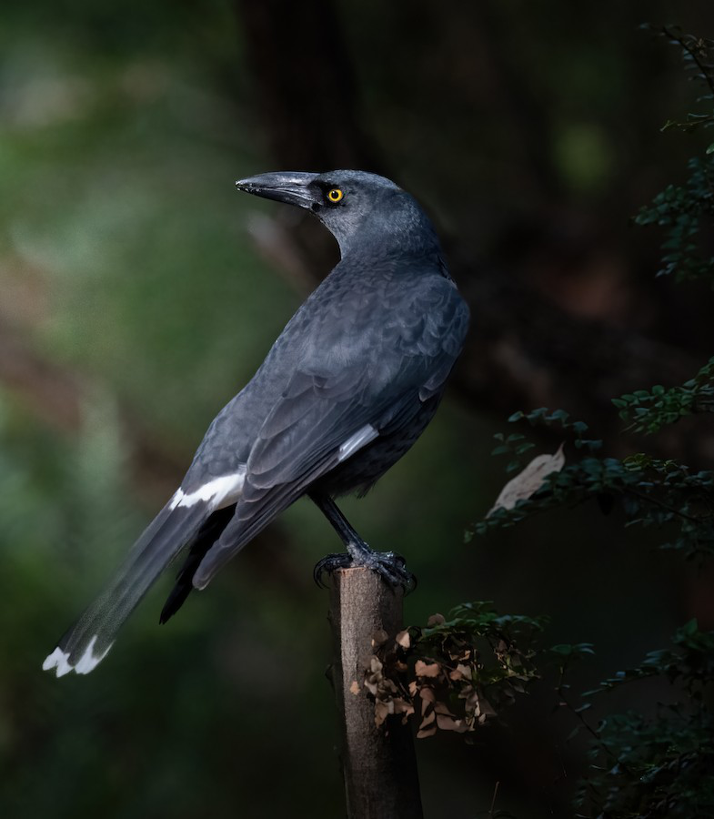
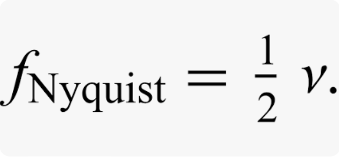
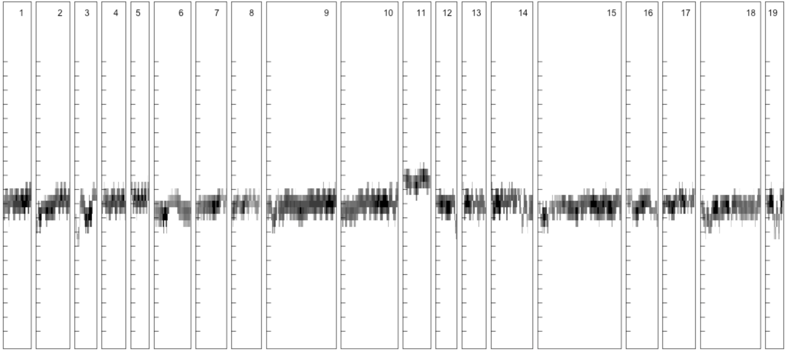
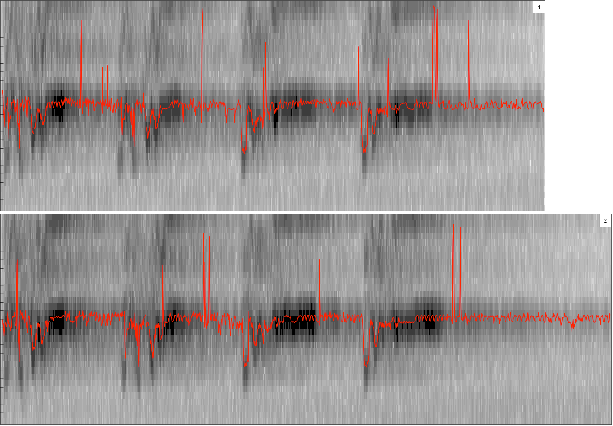
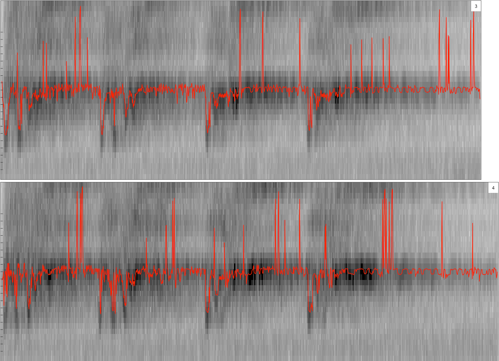
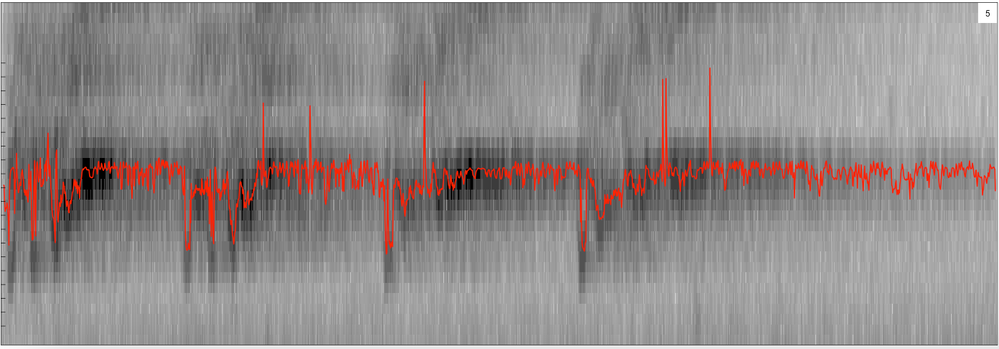

```{r setup, include=FALSE} 
knitr::opts_chunk$set(warning = FALSE, message = FALSE) 
```

## Preliminaries 
Install these packages in *R*: {bioacoustics}, {warbleR}, {tools}, {viridis}

## Objectives 
The objective of this module is to introduce you to analysis of biacoustic data so that you can read, display, and analyze audio recordings of vocalizations in animals.

## Intro to Bioacoustics

What is bioacoustics, who uses it, and how is it implemented? 

Broadly, bioacoustics is the the noninvasive crossdisciplinary science of biology and acoustics that studies the production, transmission, and reception of animal sounds. Given the wide range of information that bioacoustics provides, it's used by researchers, physicians, and government agencies. Studying sounds and it's affects on living organisms, can provide powerful insight into natural history, structure and dynamics of ecosystems, species biodiversity, habitat and species health, information climate change, and much more.  

### Typical Frequency Ranges

Different Sounds will happen at different frequencies. This is important to know because you settings may have to change in order to display and analyze your bioacoustic data correctly. Here are a general list of frequency ranges that you might encounter:

* Humans: 100 Hz to 900 Hz
* Apes: 900 Hz to 1,400 Hz
* Birds: 1,000 Hz to 8,000 Hz 
* Bats: 9,000 Hz to 200,000 Hz
* Frogs: 1500 Hz to 6000 Hz
* Whales: 30 Hz to 8,000 Hz
* Dolphins: 200 Hz to 150,000 Hz

First, let's load in the packages that we need:

## Load in Packages
```{r, prelims, message=FALSE, results='hide'}
library(warbleR)
library(bioacoustics)
library(tools)
library(randomForest)
# Unfortunately, ohun is currently under policy violation, so for the time being we are using an archived version. We expect this library to be unarchived after investigation.
url <- "https://cran.r-project.org/src/contrib/Archive/ohun/ohun_1.0.0.tar.gz"
install.packages(url, type="source", repos=NULL)
library(ohun)
library(viridis)
```

## Importing Data from the internet

The warbleR package comes with the function query_xc which allows you to seamlessly import audio data from [xeno-canto] (https://xeno-canto.org/484847).
```{r, importing, message=FALSE, results='hide'}
# pulling all Strepera versicolor calls without downloading locally
df1 = query_xc(qword ='Strepera versicolor type:call cnt:"Australia"', download = FALSE)

# Filter by type   
df1 = df1[df1$Vocalization_type=="call",] #filtering by only calls
df1 = df1[df1$Quality=="A",] #a type quality
df1 = df1[1:9,]#takes the first 9 mp3 files 

# Download data to working directory
query_xc(X = df1, download = TRUE, path = getwd())
```

## Importing Your Own Data

Great! Now that we know how to load in data from an cloud-based data set, lets try something that will probably be more useful in your own future research endeavor. Say you are a ecologist who has just come back from a field expedition where you set up passive bio-acoustic monitors. All the recorded audio files (usually in .mp3 or .wav formats) are saved in a harddrive. How would you import your data then?    

You can import you files straight from your Harddrive, Desktop or anywhere else on your personal computer. No need for cloud storage! The following code reads in a file named *mgr.wav* which, you can download from: *https://github.com/rhottensomers/AN588_R_Vignette/blob/main/mgr.wav* and save in your working directory. 

```{r, importing_mp3}
# getwd() gets our current working directory and file.path() combines getwd() and "mgr.wav" into a file path format. 
wav <- read_audio(file.path(getwd(), "mgr.wav"))

# Say you have a file saved on your Desktop, your code might look a little like this:
# wav <- read_audio(file.path("~/Desktop", "mgr.wav"))
```

Now that we know how to read files, lets load in a file named "Strepera-versicolor-571957.mp3". Here is the mp3 file:

<center>
{width=60%}\

```{r, results='asis', echo=FALSE}
cat('<audio controls> 
  <source src="Strepera-versicolor-571957.mp3" type="audio/mpeg">
</audio>') 
# Reference: https://community.rstudio.com/t/audio-files-in-r-markdown/20874)
```
</center>

Note, when you are sampling audio data, you need to make sure that your sampling rate is greater than twice the highest frequency you will observe. 

<center>
{width=70%}\
</center>


For Birds (our data here), the highest frequency we would expect is 8000 Hz. Notice here that the sampling rate here is more than double that frequency. 

```{r, readf}
# Read just one file!
STREPV <- read_audio(file.path(getwd(), "Strepera-versicolor-571957.mp3"))
STREPV
```

However, while reading in one file at a time is helpful, an ecologist returning from a month long expedition will surely have more than one file to read. We have written a function here that will read all the mp3 files in your working directory. You could expand on this function to read files in different directories or even create a data frame!

``` {r read_all}
# Read all the files in your current directory!
read_all_mp3 <- function(){
  # List all mp3 files in current directory
  mp3_files = list.files(path=".", pattern=".mp3", all.files=TRUE, full.names=TRUE)
  audio_list <- list()
  # Append all the files a paths to a single list named audio_list
  for(files in mp3_files) {
    curr_file_path <- read_audio(file.path(files))
    audio_list <- append(audio_list, curr_file_path)
  }
  return(audio_list)
}

read_all_mp3()
```


## Plotting the data

Now that we've imported, converted, and read our audio files it's time to plot them. This can be done many different ways depending on what information you need out of your bioacoustic information. These primarily graph simply display the wave files but later on we will give you a way to graph analysis onto them. 


The simplest of the graphs is plot() which plots wave objects. It displays a black and white graph of audio spikes. This is a waveform,  x axis is the time of the file and the yaxis is a amplitude, or the displacement of a particle
```{r, plotp}
# First you call your wave audio file that we converted previously:
plot(STREPV)

# Now let's zoom in on the first audio spike: 
plot(STREPV, xlim = c(3, 5)) # xlim is indicating the time limits to narrow the field of analysis
```

Plot can also be used with stereo audio files where there is audio from the right and left channel. To see if your data is stereo vs mono you can look at the list from either read_audio or read_all_mp3(). Under the audio file it will state Channels(mono/stereo) and if it is stereo you can plot it this way: 
```{r, steroplot}
 # Reads stereo audio and converts it into a wave object. 
STREPV2 <- read_audio(file.path(getwd(), "Strepera-versicolor-743906.mp3")) 

# Displays wave object information. You can see clearly here that STREPV2 is a stereo wave object
STREPV2

# Now let's plot it!
plot(STREPV2)
```

This plot graph is similar to the one above but it has one graph for the right channel and one for the left. Stereo and mono wave object do plot differently with plot() so always make sure to confirm what kind of channel your object is. 

While plot() is wonderful spectro() and fspec() are both plotting devices that come with the bioacoustics r package. They are able to generate spectrograms. Spectrograms are a visual representation of the strength or loudness of the audio signal/frequency throughout the wave object. Spectro, true to its name, plots a spectrogram of your data. 
```{r, spectro}
# First let's look at the parameters within spectrogram:
?spectro()

# Tick indicates the frequency tick marks. We are displaying from 1 to 20 khz by 1khz steps. Different animals may need different frequencies so be sure to check that you are display the correct range. 
ticks <- c(from = 1000, to = 20000, by = 1000)

# Specify the time limits on the X-axis in seconds (s)
temp_slice <- c(from = 1, to = 10)

spectro(STREPV, tlim = temp_slice, FFT_size = 512, ticks_y = ticks) # sets the y axis labeling, in Hz, so its 1 kHz to 100 kHz, in 1 kHz interval
```

<br> NOTE: Y axis is frequency in hertz and X axis is time. However spectro() does not have the ability to add x axis label so it should only be used for visualization. 
Spectro() is wonderful for an elementary spectrogram but there is a better way to visualize the data with fspec(). It is a matrix of amplitude or decibel (dB) values in the time / frequency domain. This function on its own generates only the matris of a spectrogram so in order to visual the data we use image() to display the graph. 

```{r, fspec}
# First let's look at the parameters:
?fspec

# Now graph!
image(fspec(STREPV, tlim = temp_slice, rotate = TRUE)) 
```

NOTE: If you have older zero-crossing bat vocalization patterns, then the functions write_zc() and plot_zc() will serve as replacements for fspec() and spectro(). (Add in paragraph after running through spectro and fspec() with an asterisk)

## Plotting parts of the data

Now that we have the prepared audiofile in its manipulatative form, we can filter the desired sounds(the bird calls) from background noise(other bird noises, self noise, etc).

Blob_detection is one function that detects and filters audio and displays them in batches. A "blob" is simply an area that is distinguishable from the background.
It is a common type of detection/filtration algorithm used not only in audio analysis but also in image processing. Blob detection can be used to filter and identify colors, intensity/brightness, etc.
```{r blob_detec}
# blob_detection
?blob_detection
BD <- blob_detection(
  STREPV, #Waveform of the audio file made
  time_exp = 1, #Time expansion factor, 1 represents real-time
  min_dur = 20, #Min duration of the threshold, in ms
  max_dur = 2000,  #Max duration of the threshold, in ms, based on the plot, 1500 ms is the average length of the bird's call, we'll set the max length to be 2 seconds to be safe
  min_area = 85, #Minimum number of pixels in the area of the audio event. This can be adjusted to filter more sounds out.
  min_TBE = 1, #Min window between 2 audio events
  max_TBE = 25000, #Max window between audio events, we don't want to exclude any noises so we can set it to a high measurement
  LPF = 6000, #Low-Pass Filter. Frequencies above the cutoff are not included. Based on average bird call frequency.
  HPF = 1000, #High-Pass Filter. Frequencies below the cutoff are not included. Based on average bird call frequency.
  FFT_size = 512, #Size of the Fast Fourier Transform (FFT) window, essentially the "smoothness" of frequency changes
  FFT_overlap = 0.875, #Percentage of overlap between two FFT windows
  blur = 3, #Gaussian smoothing function for blurring the spectrogram of the audio event to reduce image noise
  spectro_dir = file.path(getwd(), "Spectros"), #Path to the filtered spectrogram png files used in the HTML
  time_scale = 1, #Time resolution of the spectrogram in milliseconds per pixel.
  ticks = c(1000, 20000, 1000), #Sets y-axis min, max, and interval width
  acoustic_feat = FALSE
)
BD
```
\

The function returns an HTML file that shows all the audio events that fall within the parameters of the function, and a data frame containing information about the events extracted. This may require trial and error with the arguments to find the events that need to be extracted. As seen above more than 5 events are found. This is because there are changes in the frequency of the calls as well as calls that cannot be seen in the waveform(low in volume). If you play around with some of the parameters for the detection function, you can see the change in the number of blobs identified. Try comparing the blobs with the actual recording and the waveform, what is it picking up?

Threshold detection is another form of detection that identifies events based on the SNR, the signal-to-noise ratio. If the amplitude is above the SNR, an audio event is recorded. Mostly, it consists of the same arguments as blob detection with a few additions.
```{r, plot_data}
# Threshold_detection
?threshold_detection
TD <- threshold_detection(
  STREPV, 
  threshold = 12, #sets the sensitivity of the event, compared to the SNR(in dB, Lower the threshold for a noisier environment(low SNR); a too low or too high sensitivity may collect too many signals or not enough)
  time_exp = 1,
  min_dur = 20,
  max_dur = 2000, 
  min_TBE = 1, 
  max_TBE = 25000, 
  LPF = 6000, 
  HPF = 1000, 
  start_thr = 60, #start threshold for an audio event, 20dB is recommended for birds
  end_thr = 80, #end threshold for an audio event, 30dB is recommended for birds
  SNR_thr = 12, #SNR threshold (dB) at which the extraction of the audio event stops, 8dB is recommended for birds.
  angle_thr = 170, #Angle threshold at which the audio event extraction stops.
  duration_thr = 2000, #Maximum duration threshold in milliseconds (ms) after which the monitoring of the background noise is resumed.
  NWS = 200, #Length of time used for background noise estimation in the recording (ms)
  spectro_dir = file.path(getwd(), "Spectros"), 
  time_scale = 1, # Time resolution of the spectrogram in milliseconds (ms) per pixel (px).
  ticks = c(1000, 20000, 1000), #Sets y-axis min, max, and interval width
  acoustic_feat = FALSE
)
TD
```

\
\
\

You can see that threshold_detection has identified fewer events compared to blob detection. Notice how the extracted data compares between the data frames, because of how each form of detection filters audio, one type may be better to use than the other.

Third, the auto_detec function automatically detects the start and end of vocalizations in sound files based on amplitude, duration, and frequency range attributes. 
```{r,autodetec, message=FALSE, results='hide'}
# Let's look at the parameters of the function first
?auto_detec
detection <- auto_detec(threshold = 12,
ssmooth = 300, # 'smoothens' spectrogram
bp = c(1, 6), # lower and upper limits of a frequency bandpass filter (in kHz)
wl = 300, # Window used internally for bandpass filtering
path = getwd())
```

The packages 'ohun' and 'viridis' allow us to visualize the autodetection points determined above plotted on a spectrogram, this time with labeled axis!
```{r, ohun, message=FALSE, results='hide'}
label_spectro(wave = STREPV, #Wave object
  detection = detection[detection$sound.files == "Strepera-versicolor-571957.mp3", ], #Data frame or 'selection.table' with the detection
  hop.size = 10, #Time window duration (in ms).
  ovlp = 50, #% overlap between two consecutive windows
  flim = c(1, 10), #Frequency limits
  fastdisp=TRUE) #Faster display of model
```

## **Challenge**
1. Record an audio file of you saying something (around 30 seconds!)
2. Transfer that file onto your laptop. Save it wherever you'd like!
3. Read in the mp3 file. 
4. Plot the spectrogram from 10-20 seconds of the audio file.
5. Run a detection algorithm on your file and plot the detection results.

Try this yourself first! When done, check out what we came up with by hitting the "Show" button. 
``` {r Challenge Code, eval=F, echo=T, class.source = 'fold-hide'}
wav <- read_audio(file.path("~/Desktop", "your_file_name.wav"))
temp_slice <- c(from = 10, to = 20) # in seconds
ticks <- c(from = 1000, to = 20000, by = 1000)
spectro(wav, tlim = temp_slice, FFT_size = 512, ticks_y = ticks) sets the y axis labeling, in Hz, so its 1 kHz to 100 kHz, in 1 kHz interval
detection <- auto_detec(threshold = 5, ssmooth = 300, bp = c(2, 9), wl = 300, path = getwd())

label_spectro(wave = wav, detection = detection[detection$sound.files == "mgr.wav", ], hop.size = 10, ovlp = 50, flim = c(1, 10), fastdisp=TRUE) 
```

## References
*https://cran.r-project.org/web/packages/bioacoustics/vignettes/tutorial.html*
*https://cran.r-project.org/web/packages/warbleR/vignettes/warbleR_workflow_01.html*
*https://cran.r-project.org/web/packages/Rraven/vignettes/Rraven.html*