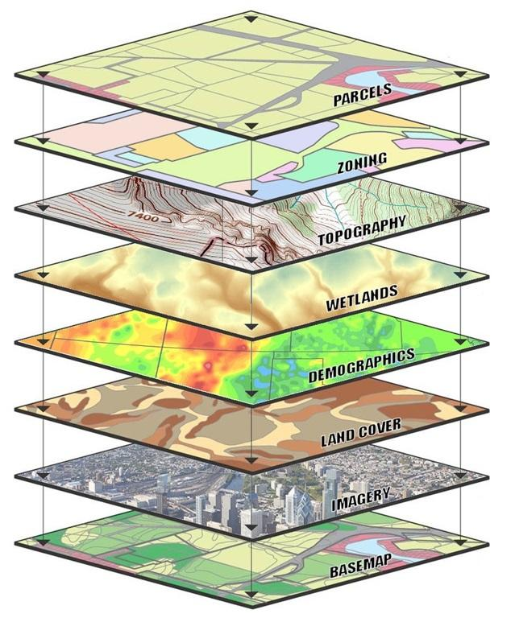
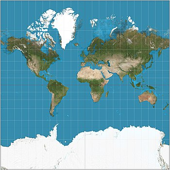
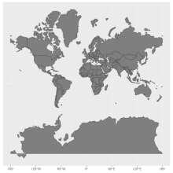
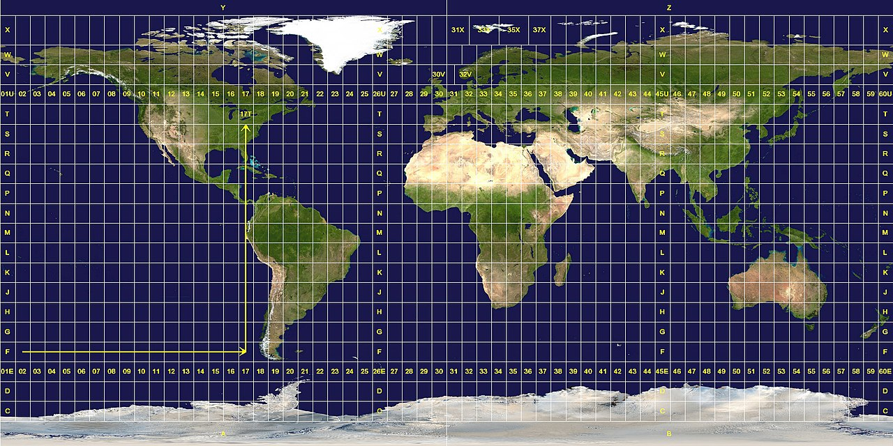

***

```{r setup, include=FALSE}
knitr::opts_chunk$set(
	echo = TRUE,
	fig.path = "img/",
	warning = FALSE,
	comment = "##",
	prompt = FALSE,
	tidy = TRUE,
	tidy.opts = list(width.cutoff = 75)
)
```
# GIS and Spatial Analysis in R

***

## Preliminaries
- Install these packages in ***R***, if you don't have them already: [{adehabitatHR}](https://cran.r-project.org/web/packages/adehabitatHR/vignettes/adehabitatHR.pdf), [{DT}](https://rstudio.github.io/DT/), [{ggmap}](https://github.com/dkahle/ggmap), [{lubridate}](https://lubridate.tidyverse.org/),
[{maptools}](https://cran.r-project.org/web/packages/maptools/maptools.pdf), [{readxl}](https://readxl.tidyverse.org/), [{rgdal}](https://crantastic.org/packages/rgdal), [{rgeos}](https://cran.rstudio.com/web/packages/rgeos/rgeos.pdf), [{sf}](https://r-spatial.github.io/sf/articles/sf1.html),
[{sp}](https://cran.r-project.org/web/packages/sp/sp.pdf), [{spatialEco}](https://github.com/jeffreyevans/spatialEco), [{spdplyr}](https://github.com/mdsumner/spdplyr), [{tidyverse}](https://www.tidyverse.org/)

## Objectives
> In this module, we use R to extend our use of the system to GIS analyses. This module will include working with GIS data to create maps, and to extract data from numerous layers of different data types for spatial analysis. This is a first step, and by no means comprehensive. Remember that R is constantly changing, and the ways and packages by which GIS analyses are being done are changing, too!

## Geographic Information Systems (GIS)

Geographic Information Systems, or GIS, is an analytical framework that can be used to organize, communicate, and better understand landscape-scale datasets. GIS allows users to overlay multiple layers of data that are geographically referenced to the same mapping system, so that those layers can be associated and mutually inform each other. This allows for both the creation of comprehensive maps, and for the integration of diverse datatypes. 

As is fitting for GIS, perhaps the best representation of this is an image:


If we added another layer of GPS points with, say, locations where monkeys have been spotted, we can then use spatial analysis techniques to construct statistical models that may help us to better understand how all of the factors in these various layers might influence whether an observer would see a monkey at a particular location. Such data and techniques are typically used in creating landscape-level inferences regarding how organisms are found in the environment. These may include species distribution models, assessments of factors associated with daily ranging paths or presence/absence of species in different habitat types, and estimating home range use patterns. The nature of layer integration has also been helpful for predicting archaeological artefact discovery, analyzing dental enamel imperfections, and other, perhaps less readily intuitive uses.

Historically, GIS analyses have been done primarily using the proprietary [ESRI](https://www.esri.com/en-us/what-is-gis/overview) system of programs, including the excellent ArcGIS, which are a comprehensive suite of GIS analytical tools. There are also open-source GIS frameworks that can be used, including [QGIS](https://qgis.org/en/site/) and [GRASS](https://grass.osgeo.org/), among many others.

The increasing functionality of ***R*** for GIS, however, is providing another powerful option for open-source GIS analyses. In our case, this may be especially appealing, as we've already built some analytical capabilities. Conducting GIS analyses in ***R*** itself allows us to extract data from multiple layers and immediately analyze them using statistical models of our choice. As {ggplot2} and the rest of the {tidyverse} continues to integrate with GIS-style methods, this has become much easier, as well (and prettier!).

In this module, we'll explore some aspects of GIS-based analysis as a base for asking questions about primate ranging and space use.

### Importing Data for Use in GIS

####Projections and Coordinate Systems

For the most part, importing data for GIS analyses is similar to importing data for any other ***R*** analysis, depending on the type of data. To integrate your data with spatial datasets, however, those data must use a common *coordinate system*, and be *projected* into the same geospatial extent as the other data layers with which you're working. Coordinate systems and projections are critically important, as they dictate how commonly marked points align, and the ways in which the 3-dimensional geographic space of the globe are mapped into the 2-dimensional space of a map. To learn more about these systems, [ArcGIS Help](http://resources.arcgis.com/en/help/main/10.1/index.html#/What_are_map_projections/003r00000001000000/) has a great resource. You can also see a list of map projections [here](https://storymaps.arcgis.com/stories/ea0519db9c184d7e84387924c84b703f). For the most part, we'll be working using the Mercator (UTM) projection, shown here:



Always keep in mind that the projection is not a *true* representation of the relative size of landmasses on the globe, as these areas exist on a 3-dimensional surface and each projection system distorts those true areas into a 2-dimensional space. The WGS84/UTM coordinates on the Mercator projection is no different. Here's an image that shows the Mercator projection size vs. real size of each country (note that distortion in this projection increases with distance from the equator):



We'll also be using the WGS84 or Universal Transverse Mercator (UTM) coordinate systems to map points onto the Mercator projection. The UTM coordinate system maps points within 6-degree longitudinal tiles, or zones, in the Mercator projection. Each zone has a designated letter/number, and the coordinate system essentially counts a 'northing' and 'easting' from the southwest corner of the tile. Knowing your tile is critically important: because of the amplified distortion of the Mercator projection away from the equator, each zone has a slightly different system for accounting for distortion.

You can see the zones here:



Once you know your UTM zone, it's fairly straightforward to map UTM coordinates into the more commonly used GPS-based coordinate system, WGS84 (although you can set GPS receivers to record data directly in UTM). For example, spider monkey points collected at the [Tiputini Biodiversity Station](https://www.bu.edu/cecb/tiputini/) in Amazonian Ecuador would be mapped to UTM zone 17M. The World Geodetic System 1984 (WGS84) is defined and maintained by the United States National Geospatial-Intelligence Agency, and so is typically the default for U.S. GPS systems.

Remember: if different datasets have different coordinate systems or projections, they won't integrate properly! Imagine trying to map UTM points onto a map using the Azimuthal Equidistant projection! Also remember that these global reference systems are continuously updated, and demarcated into epochs of use. New Zealand, for example, due to tectonic plate movement, shifts 5 cm every year from the designated WGS84 coordinates in that country!

Now, to start, let's import a GPS dataset of interest and start some spatial analyses!

#### EXAMPLE:

Suppose we have been studying a group of white-bellied spider monkeys (*Ateles belzebuth*) for the past few years at the Tiputini Biodiversity Station. While collecting behavioral data, we've also been collecting GPS points and location data from georeferenced markers every 20-minutes throughout the day, and every time we run into them throughout the day. From this data, we're interested in figuring out the size of their home range.

#### **CHALLENGE 1**

Let's explore this question using some actual data. First, load in the dataset "atelesranging.csv" and do some exploratory mapping and data analysis. This is only a little more complicated than how we've been doing it before given the spatial aspect of the data:

```{r}
library(curl)
f <- curl("https://raw.githubusercontent.com/fuzzyatelin/fuzzyatelin.github.io/master/AN597_Fall19/atelesranging.csv")
d <- read.csv(f, header = TRUE, sep = ",")
head(d)
summary(d)
```

Let's take a quick look at how these points map out:

```{r,warning=F,message=F}
library(tidyverse)
ggplot(data=d,aes(x=UTMX,y=UTMY))+geom_point()+theme_bw()
```

Ok, so we can see there's some points... but without the projection and some other layers, they're not much help. Let's get some more information added to our 'map'.

First, let's make sure we've got the points in the proper projection. We can do that most simply using the {sf} package. Note that the `crs` command (which stands for 'coordinate reference system') in the `st_as_sf` call is where we designate the projection. In this case, `32718` is the EPSG code. To learn more about how to define the projection, see [this helpful tutorial](). In the meantime, let's project!

```{r}
library(sf)
d<-st_as_sf(d,coords=c("UTMX","UTMY"),crs=32718)
```

Now, we'll need to plot using the `geom_sf()` call, which will ensure that our `ggplot` is a map with the required coordinate system and projection (notice how our axes now contain the tranlsated latitude and longitude associated with our coordinate/projection):

```{r}
q<-ggplot()+geom_sf(data=d,color="light pink",alpha=0.5)+theme_bw()
q
```

Now, to contextualize this data a bit more, we've also got some *shapefiles* associated with the study site. A shapefile is a simple, nontopological format for storing the location and attributes of a geographic feature, which can be represented by points, lines, or polygons (areas). Also associated with these values might be a dBASE table, which can store additional attributes associated with the shapefile features. In file format, shapefiles are actually several (5 or 6) files together. Most publicly available spatial layers (i.e., those available from governmental repositories) are available as shapefiles.

To load a shapefile into ***R***, we must load all associated files at once. Luckily, the package {rgdal} has a set command for doing so. Let's load in a shapefile of the Tiputini River, which forms the southern boundary of the spider monkeys' territory.

NOTE: To execute this code, you'll need to download these files from the [AN597_Fall19](https://github.com/fuzzyatelin/fuzzyatelin.github.io/tree/master/AN597_Fall19) folder on my GitHub page to a folder in your working directory called `GISdata`.

```{r}
library(rgdal)
tbs_rio<-readOGR(dsn=path.expand("GISdata"),layer="rio_tiputini_drawing")
tbs_rio<-st_as_sf(tbs_rio,crs=32718)
```

Notice that, in addition to importing, we've also converted our shapefile into an {sf} object with the same projection as our data. Let's see how they look:

```{r}
q<-ggplot()+geom_sf(data=tbs_rio,color="dodgerblue")+geom_sf(data=d,color="light pink",alpha=0.5)+theme_bw()
q
```

We can do the same for the system of trails from Tiputini:
```{r}
tbs_trails<-readOGR(dsn=path.expand("GISdata"),layer="trail_polylines_2010")
tbs_trails<-st_as_sf(tbs_trails,crs=32718)

q<-ggplot()+geom_sf(data=tbs_trails)+geom_sf(data=tbs_rio,color="dodgerblue")+geom_sf(data=d,color="light pink",alpha=0.5)+theme_bw()
q
```

Great! Now we've got a basic map with the trails and river, with our spider monkey ranging points overlaid above them. This is helpful for seeing where the spider monkeys occur on the trail system and relative to the river, but we can do much more...

For example, if we'd like to add satellite data to our map, we can use the {ggmap} package. Note that, as of recently, this requires registering with Google since we are actually accessing their API (application programming interface) within the package. Intructions on how to do so are [here](https://github.com/dkahle/ggmap), which you must complete before the next step.

```{r,fig.width=8,fig.height=8}
library(ggmap)
#ggmap::register_google(key = "SET YOUR KEY HERE")
map<-get_googlemap(center = c(lon = -76.15, lat = -0.635),
                    zoom = 14, scale = 2,
                    maptype ='satellite',
                    color = 'color')

#Google is weird, so we need to define a function to fix the bbox to be in our actual data projection of EPSG:32718
ggmap_bbox <- function(map) {
  if (!inherits(map, "ggmap")) stop("map must be a ggmap object")
  # Extract the bounding box (in lat/lon) from the ggmap to a numeric vector, 
  # and set the names to what sf::st_bbox expects:
  map_bbox <- setNames(unlist(attr(map, "bb")), 
                       c("ymin", "xmin", "ymax", "xmax"))

  # Coonvert the bbox to an sf polygon, transform it to 32718, 
  # and convert back to a bbox (convoluted, but it works)
  bbox_32718 <- st_bbox(st_transform(st_as_sfc(st_bbox(map_bbox, crs = 4326)), 32718))

  # Overwrite the bbox of the ggmap object with the transformed coordinates 
  attr(map, "bb")$ll.lat <- bbox_32718["ymin"]
  attr(map, "bb")$ll.lon <- bbox_32718["xmin"]
  attr(map, "bb")$ur.lat <- bbox_32718["ymax"]
  attr(map, "bb")$ur.lon <- bbox_32718["xmax"]
  map
}

# Use the function:
map <- ggmap_bbox(map)

p<-ggmap(map)+coord_sf(xlim=c(-76.18,-76.13),ylim=c(-0.63,-0.66),crs=st_crs(32718))+geom_sf(data=tbs_trails,inherit.aes=FALSE)+geom_sf(data=tbs_rio,color="dodgerblue",inherit.aes=FALSE)+geom_sf(data=d,color="light pink",alpha=0.5,inherit.aes=FALSE)
p
```


