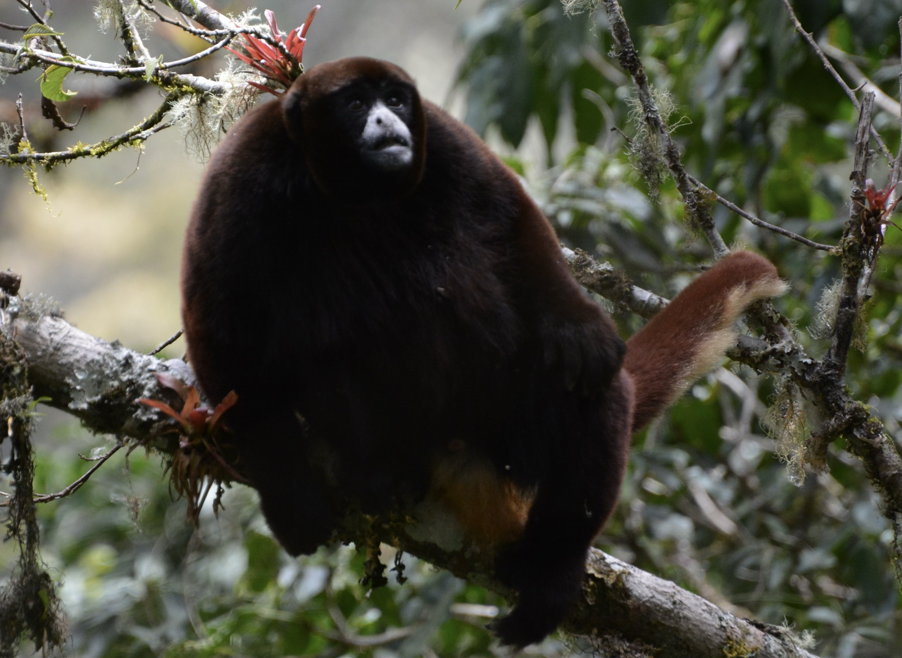
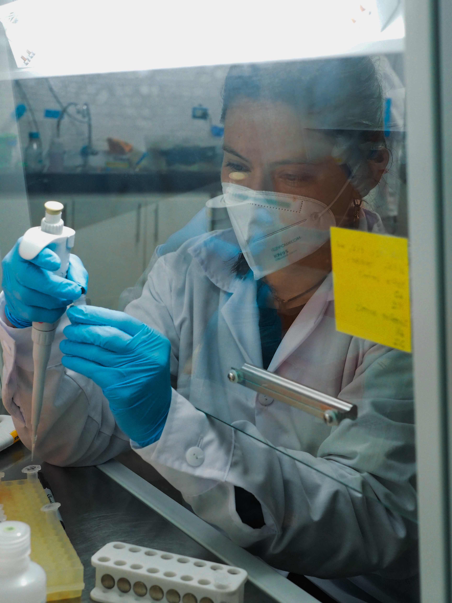
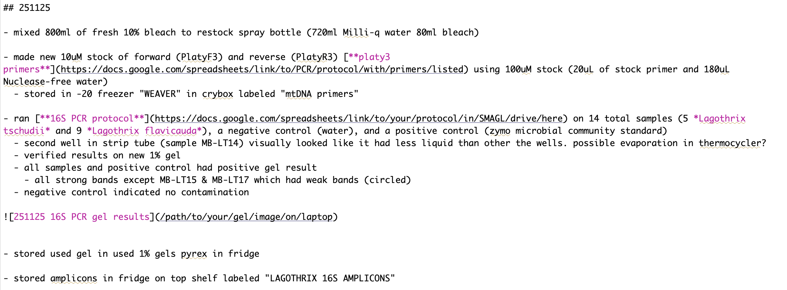
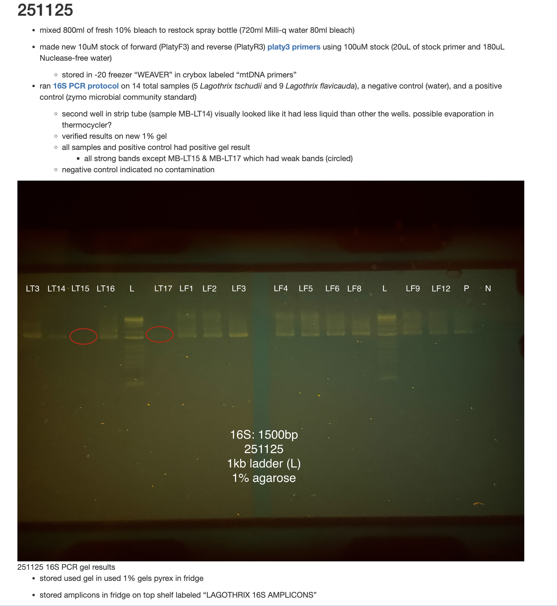
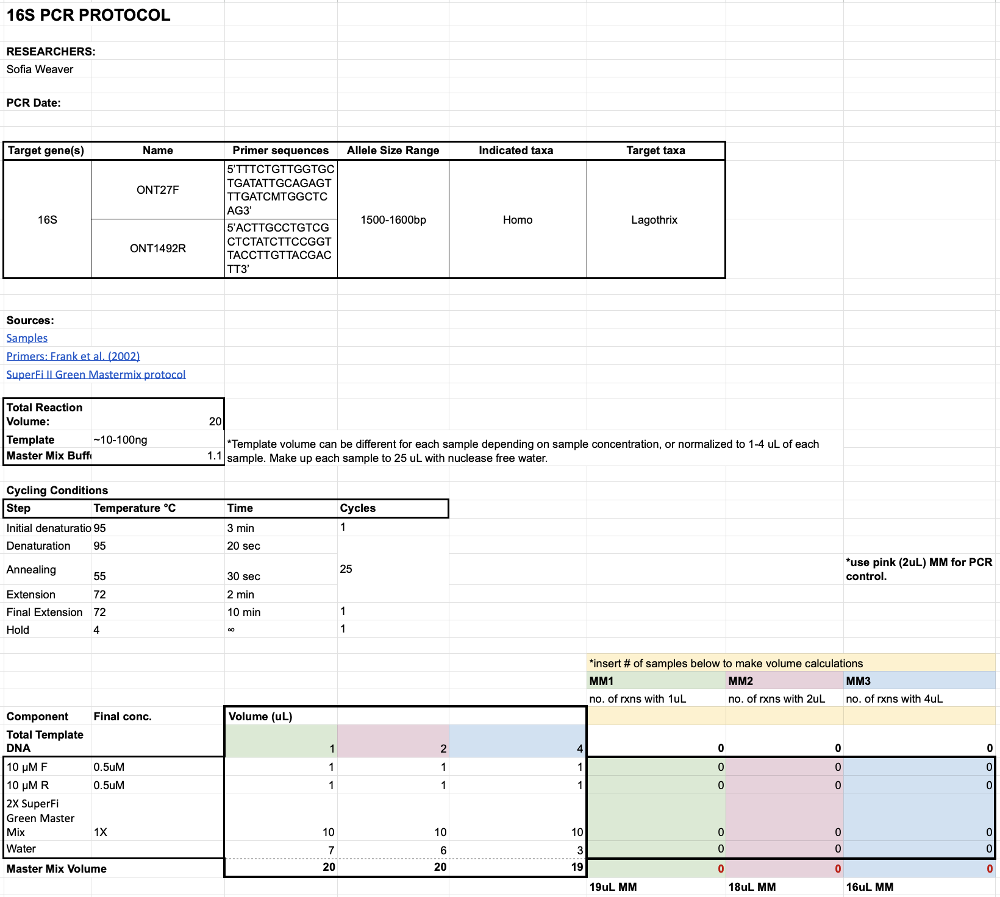
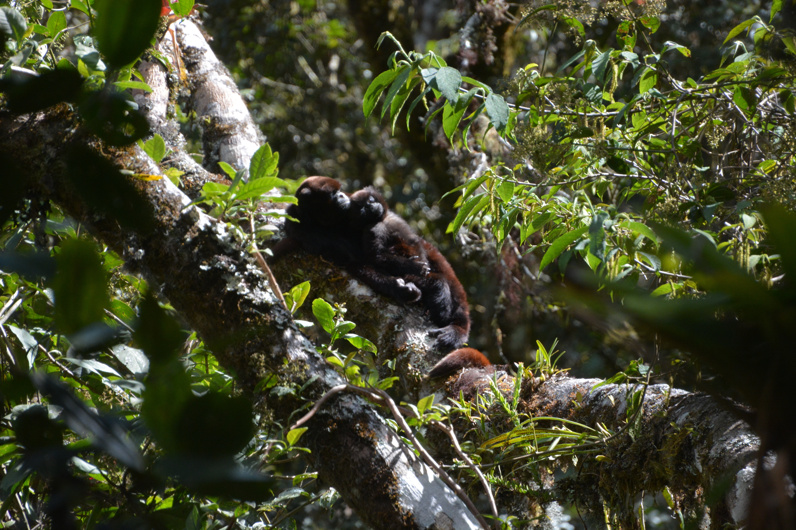

```{r,echo=F}
library(knitr)
```

# Welcome to the SMAGL Wet Lab! 


<br><br>

You're probably reading this because you've recently joined the SMAGL (good choice). Before you get started, you should think about your goals in joining the lab.

---

Do you:

**A)** want to get research experience by assisting someone with their project?

**B)** want to develop and conduct your own independent project?

**C)** have no idea what you want to do but think monkeys are cool so here you are?

---

One, a mixture, or all of the above are an appropriate place to start!

As you likely already know, our lab's research focuses on three types of nonhuman primates: savanna monkeys (*Chlorocebus* spp.) across the globe, woolly monkeys (*Lagothrix flavicauda* and *Lagothrix lagotricha tschudii*) in Perú, and Himalayan langurs (*Semnopithecus schistaceus*) in India.

```{r monkey pics, fig.cap="", fig.align="center", fig.width=14, fig.height=3.5, echo=FALSE}
library(jpeg)
library(grid)
library(gridExtra)

# Load images
img1 <- rasterGrob(as.raster(jpeg::readJPEG("img/verv.jpg")), y = 0, just = "bottom")
img2 <- rasterGrob(as.raster(jpeg::readJPEG("img/flav_juvenile_female.jpg")), y = 0, just = "bottom")
img3 <- rasterGrob(as.raster(jpeg::readJPEG("img/langur.jpeg")), y = 0, just = "bottom")

# Create captions
caption1 <- textGrob("Chlorocebus pygerythrus", gp = gpar(fontsize = 20, fontface = "italic"))
caption2 <- textGrob("Lagothrix flavicauda", gp = gpar(fontsize = 20, fontface = "italic"))
caption3 <- textGrob("Semnopithecus schistaceus", gp = gpar(fontsize = 20, fontface = "italic"))

# Arrange images with captions and spacing between them
panel <- function(img, caption) {
  arrangeGrob(img, caption, ncol = 1, heights = c(20, 2.2, 1))
}

grid.arrange(
  panel(img1, caption1),
  nullGrob(),
  panel(img2, caption2),
  nullGrob(),
  panel(img3, caption3),
  ncol = 5,
  widths = c(1, 0.15, 1, 0.15, 1)
)
```

To get a more general feel of what the lab does and the different research opportunities we provide, please take your time reading through the rest of the [**SMAGL Student Guide**](https://fuzzyatelin.github.io/smagl_student_guide/overview.html)! 


# Getting Started in the SMAGL Wet Lab


<br><br>
If you are interested in gaining "wet bench" genetics lab experience in the SMAGL, here's what you need to do before getting started:


**1. Find a graduate student or postdoc to shadow and train you in basic skills in the lab.** 

Your trainer will tell you when you are proficient in the skills necessary to do any kind of wet lab work unsupervised and on your own time. *Until then, you will need to shadow or be accompanied by an experienced SMAGL member whenever you are working in the lab*. 

**2. Start familiarizing yourself with *R* and *RStudio* (if you have not already)**

Ideally, you will have already taken, are currently taking, or plan to imminently take [AN/BI588 (Project Design and Statistics in Biological Anthopology)](https://www.bu.edu/academics/cas/courses/cas-an-588/) with Prof. Schmitt (next offered in the Fall 2027 semester). If not, you should begin going through the coding modules from the course on your own [**here**](https://fuzzyatelin.github.io/bioanth-stats/overview.html). 

**Students wishing to do independent wet lab research *must* complete all modules from the course *before* starting their project!**


## Basic Molecular Genetics

In order to keep things consistent in the wet lab (such as use of reagents, protocols that yield outputs - including eluates or data that might be used by multiple people on multiple projects in the lab), we all follow the same typical workflow in the SMAGL wet lab, each step of which has associated protocols we expect all students to follow (potentially with some modification based on the needs of their own projects). 

**1.** Sample collection (typically of fecal matter and done non-invasively in the field)

**2.** Extraction of DNA from the sample (may be done in the field at an appropriate lab, or in the SMAGL Wet Lab in STO 251)

**3.** Quantitation of DNA extracted (and/or amplified) to ensure there is enough for downstream processes (preferable using the Quantus)

**4.** Amplification of a targeted region in the genome via polymerase chain reaction (PCR)

**5.** Validation of DNA presence/size using gel electrophoresis

**6.** Dual indexing (optional; to *double* label samples and maximize the number of reactions you can include on a sequencing run)

**7.** Library preparation & sequencing

To gain a better understanding of the basic theory behind these components (i.e., what exactly it is you're doing at a molecular level when you're conducting these experiments), please read [**this paper**](https://pmc.ncbi.nlm.nih.gov/articles/PMC6425773/) and go through these [**Khan Academy modules**](https://www.khanacademy.org/science/ap-biology/gene-expression-and-regulation/biotechnology/v/the-polymerase-chain-reaction-pcr) from PCR up to DNA sequencing. We sequence our nucleic acids using a *third* generation sequencing platform developed by Oxford Nanopore Technologies (ONT). Please be aware that this is *very* different from both Sanger (or classic) sequencing and next generation sequencing (like Illumina sequencing), which means that many of our downstream data analytical pipelines need to account for this! Please watch [**this video**](https://www.youtube.com/watch?v=FYEWrUVJ2as&t=74s) to learn the basics of how ONT sequencing works. 

Once you have gone through all of the above, please read [**this document**](https://docs.google.com/document/d/17aixvE7lKxdITYb4pNiJVg05ljp8hXDkF9XkVoqlah0/edit?tab=t.0#heading=h.qhs8l5jtzif0), specific to our lab, that will help you to understand the why and how of *dual indexing* and the necessary preparations you have to take prior to library prep and sequencing (*everyone say a huge "thank you" to Mel for developing and providing these!*).


## Keeping a Lab Notebook in the SMAGL

One of the most important things in research is keeping detailed, understandable, and replicable records of *everything* that you do. Remember, good science is both replicable and falsifiable! A lab notebook makes it so that collaborators, future SMAGL members, and anyone new to the lab can reference and replicate your completed work (e.g. to replicate experimental protocols, add comparable new samples to a dataset, access data and assess suitability for planned analyses, etc.).

Rather than keeping a paper notebook, in the SMAGL you should be documenting your time and activities in the lab using a [*RMarkdown*](https://rmarkdown.rstudio.com) or [*Quarto*](https://quarto.org) document that can be successfully knitted to either PDF or HTML so that it can be shared with your trainer or Prof. Schmitt and archived in the SMAGL files (if you have no idea what this means, follow the instructions from "Getting started in the wet lab", bullet 2). 

#### Your lab notebook entries should *always* include: 

- **The date** (for *each* entry/addition)

- **The experiments** you run and using which protocols 

- ***Anything** you do in the wet lab!* 

Here is an example of a notebook entry from Sofia Weaver's *RMarkdown*, or `Rmd` file, lab notebook:


<br><br>
and here is how this portion of Sofia's lab notebook looks when knitted:
<br>



As you can see, keeping a lab notebook like this allows whoever is reading it to understand exactly what you did, the logic behind it, your results, and how you interpret them.

**Please make sure you are making a lab notebook entry *EVERY TIME* you use the wet lab space!!**

Even if you think you didn't do anything significant, make a record of every time you are in the lab. We don't always know what's happening in the lab, and it's possible that knowing someone was present at a particular time could be important to understanding why an experiment might have gone differently than expected!


## PCR Protocol Documentation

In addition to keeping your own *RMarkdown* or *Quarto* lab notebook, any time you run a PCR it *must* be documented within the SMAGL Schmitt Lab Google Drive! 

When creating a new PCR protocol that the lab has not yet established, please use [**this template**](https://docs.google.com/spreadsheets/d/1ICLiLE7X8pwF2cN59u5cpD-gl9iFcJmgL94v3IssolI/edit?gid=90984168#gid=90984168) to create a template of your own for your project, which you can then fill out each time you run a PCR. Please always include labeled images of your gels for each run in both your template document for the reaction and your lab notebook, as well as in a *master sheet* of positive and negative results from all of your experiments.


Here is an example from Sofia's PCRs amplifying the 16S region of bacterial ribosomes to study the gut microbiome of the Peruvian woolly monkeys:



## Library Prep Documentation

Once you have samples to sequence, please reference the [Library Prep and Sequencing folder](https://drive.google.com/drive/u/1/folders/1R3w6D2Q-fiYEB9jSzbl71OBUz1aX1B6p) within the Protocols folder in the SMAGL drive. 

Within this folder, you will: 

**1.** Create a new folder with the same name as your *sequencing run* (i.e., "WoollyRun20")

**2.** Make a copy of a pre-existing template for the appropriate sequencing kit you are using

**3.** Create a master sheet of all of the samples to be sequenced using [the existing template](https://docs.google.com/spreadsheets/d/1q3mLLqc3KvylahyjoNiYVHkhq0V7p4GkK0YjSsuBW9E/edit?gid=1180759223#gid=1180759223)

**4.** Complete all necessary calculations and plate maps **PRIOR** to beginning library prep that can be found in the sheet template and Mel's dual index and pre library prep - prep document listed above


**Yay! Congratulations!**

You now have an idea of the typical workflow within the SMAGL wet lab and are ready to get started!

Do **NOT** forget that admitting when you do not know something or asking for help is an important part of being successful in a wet lab. That being said, it is important that you pay attention, document everything, and are not afraid to make mistakes so that you can do good science and work independently without supervision! 

**Enjoy pipetting <3**





